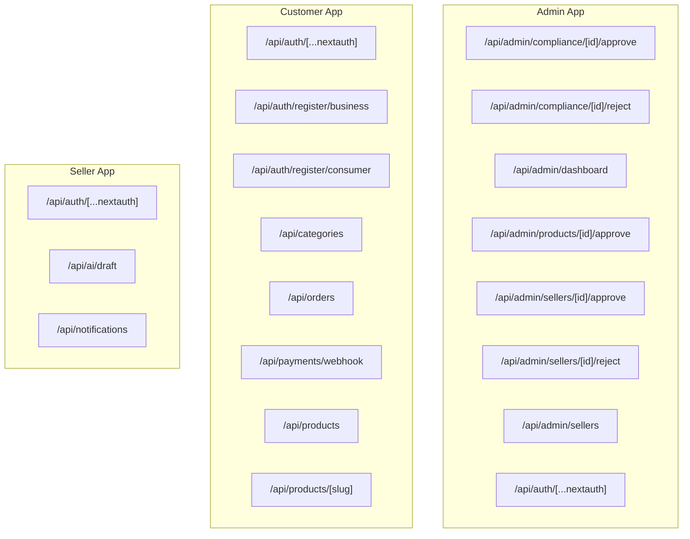
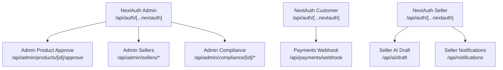

# API Reference

<cite>
**Referenced Files in This Document**
- [admin compliance approve route.ts](file://apps/admin/src/app/api/admin/compliance%5Bid%5D/approve/route.ts)
- [admin compliance reject route.ts](file://apps/admin/src/app/api/admin/compliance%5Bid%5D/reject/route.ts)
- [admin dashboard route.ts](file://apps/admin/src/app/api/admin/dashboard/route.ts)
- [admin products approve route.ts](file://apps/admin/src/app/api/admin/products%5Bid%5D/approve/route.ts)
- [admin sellers approve route.ts](file://apps/admin/src/app/api/admin/sellers%5Bid%5D/approve/route.ts)
- [admin sellers reject route.ts](file://apps/admin/src/app/api/admin/sellers%5Bid%5D/reject/route.ts)
- [admin sellers index route.ts](file://apps/admin/src/app/api/admin/sellers/route.ts)
- [admin auth route.ts](file://apps/admin/src/app/api/auth%5B...nextauth%5D/route.ts)
- [customer auth register business route.ts](file://apps/customer/src/app/api/auth/register/business/route.ts)
- [customer auth register consumer route.ts](file://apps/customer/src/app/api/auth/register/consumer/route.ts)
- [customer auth nextauth route.ts](file://apps/customer/src/app/api/auth%5B...nextauth%5D/route.ts)
- [customer categories route.ts](file://apps/customer/src/app/api/categories/route.ts)
- [customer orders route.ts](file://apps/customer/src/app/api/orders/route.ts)
- [customer payments webhook route.ts](file://apps/customer/src/app/api/payments/webhook/route.ts)
- [customer products slug route.ts](file://apps/customer/src/app/api/products/%5Bslug%5D/route.ts)
- [customer products route.ts](file://apps/customer/src/app/api/products/route.ts)
- [seller ai draft route.ts](file://apps/seller/src/app/api/ai/draft/route.ts)
- [seller auth nextauth route.ts](file://apps/seller/src/app/api/auth%5B...nextauth%5D/route.ts)
- [seller notifications route.ts](file://apps/seller/src/app/api/notifications/route.ts)
</cite>

## Table of Contents
1. [Introduction](#introduction)
2. [Project Structure](#project-structure)
3. [Core Components](#core-components)
4. [Architecture Overview](#architecture-overview)
5. [Detailed Component Analysis](#detailed-component-analysis)
6. [Dependency Analysis](#dependency-analysis)
7. [Performance Considerations](#performance-considerations)
8. [Troubleshooting Guide](#troubleshooting-guide)
9. [Conclusion](#conclusion)
10. [Appendices](#appendices)

## Introduction
This document provides a comprehensive API reference for the Avenick Commerce platform, covering REST endpoints across the Admin, Customer, and Seller applications. It describes endpoint patterns, HTTP methods, authentication requirements, request/response considerations, and integration guidelines. The API surface is implemented using Next.js file-based routing under each app’s api directory.

## Project Structure
The API endpoints are organized per-app under Next.js app/api routes. The primary areas covered include:
- Authentication APIs for Admin, Customer, and Seller
- Product management APIs for Customer
- Order processing APIs for Customer
- Payments webhook for Customer
- Admin management APIs for compliance, products, and sellers
- Seller AI and notifications APIs

**Diagram sources**
- [admin compliance approve route.ts](file://apps/admin/src/app/api/admin/compliance%5Bid%5D/approve/route.ts)
- [admin compliance reject route.ts](file://apps/admin/src/app/api/admin/compliance%5Bid%5D/reject/route.ts)
- [admin dashboard route.ts](file://apps/admin/src/app/api/admin/dashboard/route.ts)
- [admin products approve route.ts](file://apps/admin/src/app/api/admin/products%5Bid%5D/approve/route.ts)
- [admin sellers approve route.ts](file://apps/admin/src/app/api/admin/sellers%5Bid%5D/approve/route.ts)
- [admin sellers reject route.ts](file://apps/admin/src/app/api/admin/sellers%5Bid%5D/reject/route.ts)
- [admin sellers index route.ts](file://apps/admin/src/app/api/admin/sellers/route.ts)
- [admin auth route.ts](file://apps/admin/src/app/api/auth%5B...nextauth%5D/route.ts)
- [customer auth nextauth route.ts](file://apps/customer/src/app/api/auth%5B...nextauth%5D/route.ts)
- [customer auth register business route.ts](file://apps/customer/src/app/api/auth/register/business/route.ts)
- [customer auth register consumer route.ts](file://apps/customer/src/app/api/auth/register/consumer/route.ts)
- [customer categories route.ts](file://apps/customer/src/app/api/categories/route.ts)
- [customer orders route.ts](file://apps/customer/src/app/api/orders/route.ts)
- [customer payments webhook route.ts](file://apps/customer/src/app/api/payments/webhook/route.ts)
- [customer products route.ts](file://apps/customer/src/app/api/products/route.ts)
- [customer products slug route.ts](file://apps/customer/src/app/api/products/%5Bslug%5D/route.ts)
- [seller auth nextauth route.ts](file://apps/seller/src/app/api/auth%5B...nextauth%5D/route.ts)
- [seller ai draft route.ts](file://apps/seller/src/app/api/ai/draft/route.ts)
- [seller notifications route.ts](file://apps/seller/src/app/api/notifications/route.ts)

**Section sources**
- [admin auth route.ts](file://apps/admin/src/app/api/auth%5B...nextauth%5D/route.ts)
- [customer auth nextauth route.ts](file://apps/customer/src/app/api/auth%5B...nextauth%5D/route.ts)
- [seller auth nextauth route.ts](file://apps/seller/src/app/api/auth%5B...nextauth%5D/route.ts)

## Core Components
This section outlines the major API groups and their responsibilities.

- Authentication APIs
  - Admin: NextAuth-based sign-in/sign-out and session management
  - Customer: NextAuth-based authentication and registration endpoints for business and consumer accounts
  - Seller: NextAuth-based authentication for seller portal
- Product Management APIs
  - Customer: Product listing and product detail retrieval by slug
  - Admin: Approve/reject product listings
- Order Processing APIs
  - Customer: Orders listing
- Payments
  - Customer: Payment webhook for payment provider callbacks
- Admin Management APIs
  - Admin: Compliance review, product moderation, and seller management
- Seller APIs
  - Seller: AI draft generation and notifications

**Section sources**
- [customer auth register business route.ts](file://apps/customer/src/app/api/auth/register/business/route.ts)
- [customer auth register consumer route.ts](file://apps/customer/src/app/api/auth/register/consumer/route.ts)
- [customer products route.ts](file://apps/customer/src/app/api/products/route.ts)
- [customer products slug route.ts](file://apps/customer/src/app/api/products/%5Bslug%5D/route.ts)
- [admin products approve route.ts](file://apps/admin/src/app/api/admin/products%5Bid%5D/approve/route.ts)
- [customer orders route.ts](file://apps/customer/src/app/api/orders/route.ts)
- [customer payments webhook route.ts](file://apps/customer/src/app/api/payments/webhook/route.ts)
- [admin compliance approve route.ts](file://apps/admin/src/app/api/admin/compliance%5Bid%5D/approve/route.ts)
- [admin compliance reject route.ts](file://apps/admin/src/app/api/admin/compliance%5Bid%5D/reject/route.ts)
- [admin sellers approve route.ts](file://apps/admin/src/app/api/admin/sellers%5Bid%5D/approve/route.ts)
- [admin sellers reject route.ts](file://apps/admin/src/app/api/admin/sellers%5Bid%5D/reject/route.ts)
- [admin sellers index route.ts](file://apps/admin/src/app/api/admin/sellers/route.ts)
- [seller ai draft route.ts](file://apps/seller/src/app/api/ai/draft/route.ts)
- [seller notifications route.ts](file://apps/seller/src/app/api/notifications/route.ts)

## Architecture Overview
The API architecture follows Next.js file-based routing conventions. Each endpoint is a route handler module exporting appropriate HTTP method handlers. Authentication is primarily handled via NextAuth in most apps. Payment webhooks integrate with external providers. Admin APIs manage moderation and seller lifecycle. Seller APIs focus on AI assistance and notifications.

```mermaid
graph TB
Client["Client Application"] --> AuthC["Customer Auth<br/>/api/auth/[...nextauth]"]
Client --> RegC["Customer Register<br/>/api/auth/register/*"]
Client --> ProdC["Customer Products<br/>/api/products/*"]
Client --> OrdersC["Customer Orders<br/>/api/orders"]
Client --> PayWebhook["Payments Webhook<br/>/api/payments/webhook"]
Client --> AuthA["Admin Auth<br/>/api/auth/[...nextauth]"]
Client --> AdminDash["Admin Dashboard<br/>/api/admin/dashboard"]
Client --> AdminProd["Admin Product Approve<br/>/api/admin/products/[id]/approve"]
Client --> AdminComp["Admin Compliance<br/>/api/admin/compliance/[id]/*"]
Client --> AdminSellers["Admin Sellers<br/>/api/admin/sellers/*"]
Client --> AuthS["Seller Auth<br/>/api/auth/[...nextauth]"]
Client --> AISeller["Seller AI Draft<br/>/api/ai/draft"]
Client --> NotifS["Seller Notifications<br/>/api/notifications"]
```

**Diagram sources**
- [customer auth nextauth route.ts](file://apps/customer/src/app/api/auth%5B...nextauth%5D/route.ts)
- [customer auth register business route.ts](file://apps/customer/src/app/api/auth/register/business/route.ts)
- [customer auth register consumer route.ts](file://apps/customer/src/app/api/auth/register/consumer/route.ts)
- [customer products route.ts](file://apps/customer/src/app/api/products/route.ts)
- [customer products slug route.ts](file://apps/customer/src/app/api/products/%5Bslug%5D/route.ts)
- [customer orders route.ts](file://apps/customer/src/app/api/orders/route.ts)
- [customer payments webhook route.ts](file://apps/customer/src/app/api/payments/webhook/route.ts)
- [admin auth route.ts](file://apps/admin/src/app/api/auth%5B...nextauth%5D/route.ts)
- [admin dashboard route.ts](file://apps/admin/src/app/api/admin/dashboard/route.ts)
- [admin products approve route.ts](file://apps/admin/src/app/api/admin/products%5Bid%5D/approve/route.ts)
- [admin compliance approve route.ts](file://apps/admin/src/app/api/admin/compliance%5Bid%5D/approve/route.ts)
- [admin compliance reject route.ts](file://apps/admin/src/app/api/admin/compliance%5Bid%5D/reject/route.ts)
- [admin sellers approve route.ts](file://apps/admin/src/app/api/admin/sellers%5Bid%5D/approve/route.ts)
- [admin sellers reject route.ts](file://apps/admin/src/app/api/admin/sellers%5Bid%5D/reject/route.ts)
- [admin sellers index route.ts](file://apps/admin/src/app/api/admin/sellers/route.ts)
- [seller auth nextauth route.ts](file://apps/seller/src/app/api/auth%5B...nextauth%5D/route.ts)
- [seller ai draft route.ts](file://apps/seller/src/app/api/ai/draft/route.ts)
- [seller notifications route.ts](file://apps/seller/src/app/api/notifications/route.ts)

## Detailed Component Analysis

### Authentication APIs

#### Admin Authentication
- Path: /api/auth/[...nextauth]
- Method: GET/POST
- Purpose: NextAuth-based authentication for Admin portal
- Authentication: Session-based via NextAuth
- Request: NextAuth callback parameters
- Response: Redirects or session JSON
- Notes: Integrates with configured NextAuth providers

**Section sources**
- [admin auth route.ts](file://apps/admin/src/app/api/auth%5B...nextauth%5D/route.ts)

#### Customer Authentication
- Path: /api/auth/[...nextauth]
- Method: GET/POST
- Purpose: NextAuth-based authentication for Customer portal
- Authentication: Session-based via NextAuth
- Request: NextAuth callback parameters
- Response: Redirects or session JSON
- Notes: Supports customer login and session management

**Section sources**
- [customer auth nextauth route.ts](file://apps/customer/src/app/api/auth%5B...nextauth%5D/route.ts)

#### Customer Registration
- Business Registration
  - Path: /api/auth/register/business
  - Method: POST
  - Purpose: Register a business account
  - Authentication: None (public)
  - Request: Business registration payload
  - Response: Success or error
- Consumer Registration
  - Path: /api/auth/register/consumer
  - Method: POST
  - Purpose: Register a consumer account
  - Authentication: None (public)
  - Request: Consumer registration payload
  - Response: Success or error

**Section sources**
- [customer auth register business route.ts](file://apps/customer/src/app/api/auth/register/business/route.ts)
- [customer auth register consumer route.ts](file://apps/customer/src/app/api/auth/register/consumer/route.ts)

#### Seller Authentication
- Path: /api/auth/[...nextauth]
- Method: GET/POST
- Purpose: NextAuth-based authentication for Seller portal
- Authentication: Session-based via NextAuth
- Request: NextAuth callback parameters
- Response: Redirects or session JSON
- Notes: Supports seller login and session management

**Section sources**
- [seller auth nextauth route.ts](file://apps/seller/src/app/api/auth%5B...nextauth%5D/route.ts)

### Product Management APIs

#### Customer Product Listing
- Path: /api/products
- Method: GET
- Purpose: Retrieve product catalog
- Authentication: Optional (public)
- Query Parameters: Filtering/sorting parameters supported by implementation
- Response: Product list
- Notes: Pagination and filters may be supported by backend logic

**Section sources**
- [customer products route.ts](file://apps/customer/src/app/api/products/route.ts)

#### Customer Product Detail by Slug
- Path: /api/products/[slug]
- Method: GET
- Purpose: Retrieve product details by slug
- Authentication: Optional (public)
- Path Parameters: slug
- Response: Product detail
- Notes: Slug-based lookup

**Section sources**
- [customer products slug route.ts](file://apps/customer/src/app/api/products/%5Bslug%5D/route.ts)

#### Admin Product Approval
- Path: /api/admin/products/[id]/approve
- Method: POST
- Purpose: Approve a product listing
- Authentication: Admin required
- Path Parameters: id
- Response: Approval result
- Notes: Requires admin privileges

**Section sources**
- [admin products approve route.ts](file://apps/admin/src/app/api/admin/products%5Bid%5D/approve/route.ts)

### Order Processing APIs

#### Customer Orders
- Path: /api/orders
- Method: GET
- Purpose: List customer orders
- Authentication: Customer required
- Response: Orders list
- Notes: Requires authenticated customer session

**Section sources**
- [customer orders route.ts](file://apps/customer/src/app/api/orders/route.ts)

### Payments

#### Payments Webhook
- Path: /api/payments/webhook
- Method: POST
- Purpose: Handle payment provider webhooks
- Authentication: Provider signature verification
- Request: Webhook payload from payment provider
- Response: Acknowledgement or error
- Notes: Validates webhook signature and updates payment status

**Section sources**
- [customer payments webhook route.ts](file://apps/customer/src/app/api/payments/webhook/route.ts)

### Admin Management APIs

#### Admin Dashboard
- Path: /api/admin/dashboard
- Method: GET
- Purpose: Admin dashboard metrics and summary
- Authentication: Admin required
- Response: Dashboard data
- Notes: Requires admin privileges

**Section sources**
- [admin dashboard route.ts](file://apps/admin/src/app/api/admin/dashboard/route.ts)

#### Admin Compliance Review
- Approve
  - Path: /api/admin/compliance/[id]/approve
  - Method: POST
  - Purpose: Approve a compliance item
  - Authentication: Admin required
  - Path Parameters: id
  - Response: Approval result
- Reject
  - Path: /api/admin/compliance/[id]/reject
  - Method: POST
  - Purpose: Reject a compliance item
  - Authentication: Admin required
  - Path Parameters: id
  - Response: Rejection result

**Section sources**
- [admin compliance approve route.ts](file://apps/admin/src/app/api/admin/compliance%5Bid%5D/approve/route.ts)
- [admin compliance reject route.ts](file://apps/admin/src/app/api/admin/compliance%5Bid%5D/reject/route.ts)

#### Admin Sellers Management
- Approve
  - Path: /api/admin/sellers/[id]/approve
  - Method: POST
  - Purpose: Approve a seller
  - Authentication: Admin required
  - Path Parameters: id
  - Response: Approval result
- Reject
  - Path: /api/admin/sellers/[id]/reject
  - Method: POST
  - Purpose: Reject a seller
  - Authentication: Admin required
  - Path Parameters: id
  - Response: Rejection result
- Sellers Index
  - Path: /api/admin/sellers
  - Method: GET
  - Purpose: List sellers
  - Authentication: Admin required
  - Response: Sellers list

**Section sources**
- [admin sellers approve route.ts](file://apps/admin/src/app/api/admin/sellers%5Bid%5D/approve/route.ts)
- [admin sellers reject route.ts](file://apps/admin/src/app/api/admin/sellers%5Bid%5D/reject/route.ts)
- [admin sellers index route.ts](file://apps/admin/src/app/api/admin/sellers/route.ts)

### Seller APIs

#### AI Draft Generation
- Path: /api/ai/draft
- Method: POST
- Purpose: Generate product or content drafts using AI
- Authentication: Seller required
- Request: Prompt and context
- Response: Generated draft
- Notes: Requires authenticated seller session

**Section sources**
- [seller ai draft route.ts](file://apps/seller/src/app/api/ai/draft/route.ts)

#### Seller Notifications
- Path: /api/notifications
- Method: GET
- Purpose: Retrieve seller notifications
- Authentication: Seller required
- Response: Notifications list
- Notes: Requires authenticated seller session

**Section sources**
- [seller notifications route.ts](file://apps/seller/src/app/api/notifications/route.ts)

## Dependency Analysis
- Authentication dependencies
  - NextAuth integration is centralized in each app’s auth route
  - Admin, Customer, and Seller apps each expose NextAuth routes
- Payment webhook
  - Customer app exposes a webhook endpoint for payment provider callbacks
- Admin moderation
  - Admin app exposes endpoints for product and seller moderation, and compliance review
- Seller productivity
  - Seller app exposes AI draft and notifications endpoints

**Diagram sources**
- [admin auth route.ts](file://apps/admin/src/app/api/auth%5B...nextauth%5D/route.ts)
- [customer auth nextauth route.ts](file://apps/customer/src/app/api/auth%5B...nextauth%5D/route.ts)
- [seller auth nextauth route.ts](file://apps/seller/src/app/api/auth%5B...nextauth%5D/route.ts)
- [customer payments webhook route.ts](file://apps/customer/src/app/api/payments/webhook/route.ts)
- [admin products approve route.ts](file://apps/admin/src/app/api/admin/products%5Bid%5D/approve/route.ts)
- [admin sellers index route.ts](file://apps/admin/src/app/api/admin/sellers/route.ts)
- [admin sellers approve route.ts](file://apps/admin/src/app/api/admin/sellers%5Bid%5D/approve/route.ts)
- [admin sellers reject route.ts](file://apps/admin/src/app/api/admin/sellers%5Bid%5D/reject/route.ts)
- [admin compliance approve route.ts](file://apps/admin/src/app/api/admin/compliance%5Bid%5D/approve/route.ts)
- [admin compliance reject route.ts](file://apps/admin/src/app/api/admin/compliance%5Bid%5D/reject/route.ts)
- [seller ai draft route.ts](file://apps/seller/src/app/api/ai/draft/route.ts)
- [seller notifications route.ts](file://apps/seller/src/app/api/notifications/route.ts)

**Section sources**
- [admin auth route.ts](file://apps/admin/src/app/api/auth%5B...nextauth%5D/route.ts)
- [customer auth nextauth route.ts](file://apps/customer/src/app/api/auth%5B...nextauth%5D/route.ts)
- [seller auth nextauth route.ts](file://apps/seller/src/app/api/auth%5B...nextauth%5D/route.ts)
- [customer payments webhook route.ts](file://apps/customer/src/app/api/payments/webhook/route.ts)
- [admin products approve route.ts](file://apps/admin/src/app/api/admin/products%5Bid%5D/approve/route.ts)
- [admin sellers index route.ts](file://apps/admin/src/app/api/admin/sellers/route.ts)
- [admin sellers approve route.ts](file://apps/admin/src/app/api/admin/sellers%5Bid%5D/approve/route.ts)
- [admin sellers reject route.ts](file://apps/admin/src/app/api/admin/sellers%5Bid%5D/reject/route.ts)
- [admin compliance approve route.ts](file://apps/admin/src/app/api/admin/compliance%5Bid%5D/approve/route.ts)
- [admin compliance reject route.ts](file://apps/admin/src/app/api/admin/compliance%5Bid%5D/reject/route.ts)
- [seller ai draft route.ts](file://apps/seller/src/app/api/ai/draft/route.ts)
- [seller notifications route.ts](file://apps/seller/src/app/api/notifications/route.ts)

## Performance Considerations
- Prefer paginated responses for listing endpoints (orders, products, sellers)
- Cache public product listings where feasible
- Validate and sanitize query parameters to avoid expensive queries
- Use efficient filtering and sorting on the server side
- Rate limit sensitive endpoints (authentication, registration)

## Troubleshooting Guide
- Authentication failures
  - Verify NextAuth provider configuration and callback URLs
  - Ensure cookies/session storage are enabled in client
- Payment webhook errors
  - Confirm webhook secret and signature verification logic
  - Log raw payload and response for debugging
- Admin moderation errors
  - Validate admin permissions and resource ownership
  - Check ID parameter correctness
- Seller AI and notifications
  - Confirm seller session and provider credentials
  - Validate request payload structure

## Conclusion
The Avenick Commerce API is structured around Next.js file-based routing with clear separation of concerns across Admin, Customer, and Seller applications. Authentication is standardized via NextAuth, while specialized endpoints handle product management, orders, payments, admin moderation, and seller productivity. Client applications should integrate using standard HTTP requests, respect authentication requirements, and implement robust error handling and logging.

## Appendices

### API Usage Examples

- Customer Registration (Business)
  - Endpoint: POST /api/auth/register/business
  - Request: Business registration payload
  - Response: Success or error
  - Example: Submit form data to register a business account

- Customer Registration (Consumer)
  - Endpoint: POST /api/auth/register/consumer
  - Request: Consumer registration payload
  - Response: Success or error
  - Example: Submit form data to register a consumer account

- Customer Orders
  - Endpoint: GET /api/orders
  - Authentication: Customer session required
  - Response: Orders list
  - Example: Fetch order history after login

- Payments Webhook
  - Endpoint: POST /api/payments/webhook
  - Request: Webhook payload from payment provider
  - Response: Acknowledgement or error
  - Example: Handle payment confirmation events

- Admin Product Approval
  - Endpoint: POST /api/admin/products/[id]/approve
  - Authentication: Admin session required
  - Path Parameters: id
  - Response: Approval result
  - Example: Approve a product listing

- Admin Sellers Management
  - Approve: POST /api/admin/sellers/[id]/approve
  - Reject: POST /api/admin/sellers/[id]/reject
  - List: GET /api/admin/sellers
  - Authentication: Admin session required
  - Response: Approval/rejection result or sellers list

- Seller AI Draft
  - Endpoint: POST /api/ai/draft
  - Authentication: Seller session required
  - Request: Prompt and context
  - Response: Generated draft

- Seller Notifications
  - Endpoint: GET /api/notifications
  - Authentication: Seller session required
  - Response: Notifications list

### Parameter Validation and Serialization Patterns
- Path parameters
  - Validate presence and type (e.g., numeric IDs, slugs)
- Query parameters
  - Sanitize and validate pagination, filters, and sorting keys
- Request bodies
  - Enforce required fields and types
  - Apply schema validation before processing
- Responses
  - Use consistent JSON shapes
  - Include metadata for paginated lists
  - Return appropriate HTTP status codes

### Integration Guidelines
- Use HTTPS for all API calls
- Implement retry with exponential backoff for transient errors
- Log request IDs and timestamps for tracing
- Respect rate limits and implement client-side throttling
- Handle CSRF protection for state-changing operations (via NextAuth)
- Store tokens securely and refresh sessions as needed