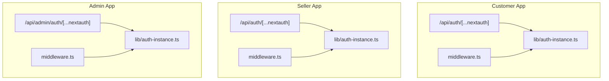
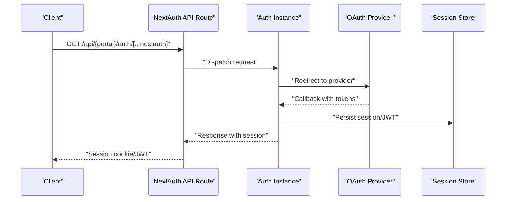
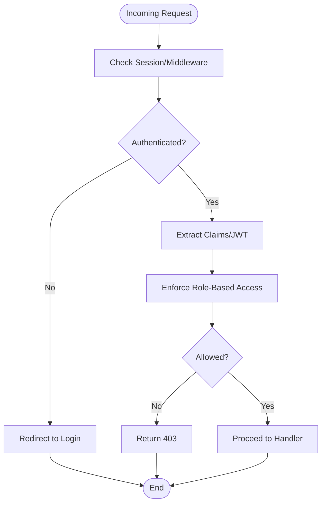
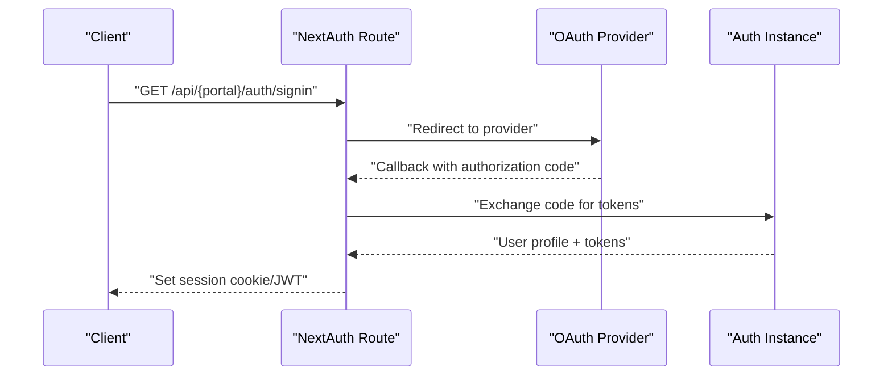
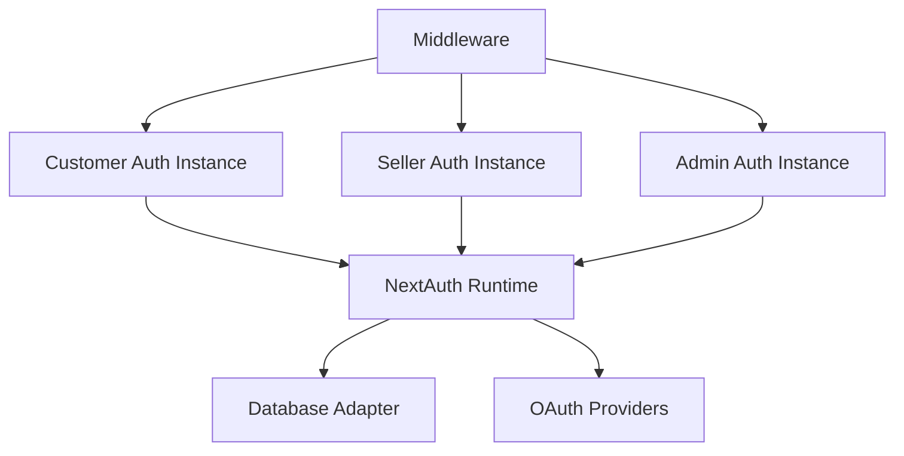

# Authentication APIs

<cite>
**Referenced Files in This Document**
- [apps/customer/src/app/api/auth/[...nextauth]/route.ts](file://apps/customer/src/app/api/auth/[...nextauth]/route.ts)
- [apps/seller/src/app/api/auth/[...nextauth]/route.ts](file://apps/seller/src/app/api/auth/[...nextauth]/route.ts)
- [apps/admin/src/lib/auth-instance.ts](file://apps/admin/src/lib/auth-instance.ts)
- [apps/customer/src/lib/auth-instance.ts](file://apps/customer/src/lib/auth-instance.ts)
- [apps/seller/src/lib/auth-instance.ts](file://apps/seller/src/lib/auth-instance.ts)
- [apps/admin/src/middleware.ts](file://apps/admin/src/middleware.ts)
- [apps/customer/src/middleware.ts](file://apps/customer/src/middleware.ts)
- [apps/seller/src/middleware.ts](file://apps/seller/src/middleware.ts)
- [apps/admin/src/lib/auth.ts](file://apps/admin/src/lib/auth.ts)
- [apps/customer/src/lib/auth.ts](file://apps/customer/src/lib/auth.ts)
- [apps/seller/src/lib/auth.ts](file://apps/seller/src/lib/auth.ts)
</cite>

## Table of Contents
1. [Introduction](#introduction)
2. [Project Structure](#project-structure)
3. [Core Components](#core-components)
4. [Architecture Overview](#architecture-overview)
5. [Detailed Component Analysis](#detailed-component-analysis)
6. [Dependency Analysis](#dependency-analysis)
7. [Performance Considerations](#performance-considerations)
8. [Troubleshooting Guide](#troubleshooting-guide)
9. [Conclusion](#conclusion)

## Introduction
This document provides comprehensive API documentation for authentication endpoints across the customer, admin, and seller portals. It focuses on NextAuth.js file-based API routes, session management, JWT handling, role-based access patterns, and middleware integration. It also outlines request/response patterns for login/logout, user registration, password reset, and OAuth integration points, along with practical examples and error handling guidance.

## Project Structure
Authentication is implemented via NextAuth.js file-based API routes under each application’s API surface. The customer and seller portals expose NextAuth endpoints at `/api/auth/[...nextauth]`, while the admin portal exposes its own NextAuth endpoint at `/api/admin/auth/[...nextauth]`. Shared authentication utilities and middleware are located under each app’s lib and middleware directories.

**Diagram sources**
- [apps/customer/src/app/api/auth/[...nextauth]/route.ts](file://apps/customer/src/app/api/auth/[...nextauth]/route.ts#L1-L4)
- [apps/seller/src/app/api/auth/[...nextauth]/route.ts](file://apps/seller/src/app/api/auth/[...nextauth]/route.ts#L1-L4)
- [apps/admin/src/lib/auth-instance.ts](file://apps/admin/src/lib/auth-instance.ts)
- [apps/customer/src/lib/auth-instance.ts](file://apps/customer/src/lib/auth-instance.ts)
- [apps/seller/src/lib/auth-instance.ts](file://apps/seller/src/lib/auth-instance.ts)
- [apps/admin/src/middleware.ts](file://apps/admin/src/middleware.ts)
- [apps/customer/src/middleware.ts](file://apps/customer/src/middleware.ts)
- [apps/seller/src/middleware.ts](file://apps/seller/src/middleware.ts)

**Section sources**
- [apps/customer/src/app/api/auth/[...nextauth]/route.ts](file://apps/customer/src/app/api/auth/[...nextauth]/route.ts#L1-L4)
- [apps/seller/src/app/api/auth/[...nextauth]/route.ts](file://apps/seller/src/app/api/auth/[...nextauth]/route.ts#L1-L4)

## Core Components
- NextAuth.js API routes: Each portal exposes NextAuth endpoints via a small handler export that delegates to a shared auth instance.
- Shared auth instances: Centralized NextAuth configuration per app lives in a dedicated auth-instance module.
- Middleware: Role-aware middleware enforces protected routes and session validation per app.
- Registration endpoints: Customer app exposes registration endpoints for business and consumer users under `/api/auth/register`.

Key responsibilities:
- Customer portal: NextAuth at `/api/auth/[...nextauth]`; registration endpoints under `/api/auth/register`.
- Seller portal: NextAuth at `/api/auth/[...nextauth]`.
- Admin portal: NextAuth at `/api/admin/auth/[...nextauth]`.

**Section sources**
- [apps/customer/src/app/api/auth/[...nextauth]/route.ts](file://apps/customer/src/app/api/auth/[...nextauth]/route.ts#L1-L4)
- [apps/seller/src/app/api/auth/[...nextauth]/route.ts](file://apps/seller/src/app/api/auth/[...nextauth]/route.ts#L1-L4)
- [apps/admin/src/lib/auth-instance.ts](file://apps/admin/src/lib/auth-instance.ts)
- [apps/customer/src/lib/auth-instance.ts](file://apps/customer/src/lib/auth-instance.ts)
- [apps/seller/src/lib/auth-instance.ts](file://apps/seller/src/lib/auth-instance.ts)
- [apps/admin/src/middleware.ts](file://apps/admin/src/middleware.ts)
- [apps/customer/src/middleware.ts](file://apps/customer/src/middleware.ts)
- [apps/seller/src/middleware.ts](file://apps/seller/src/middleware.ts)

## Architecture Overview
The authentication architecture leverages NextAuth.js file-based API routes to handle OAuth flows, callbacks, and session management. Each app maintains its own NextAuth configuration via a shared auth instance. Middleware validates sessions and enforces role-based access control.

**Diagram sources**
- [apps/customer/src/app/api/auth/[...nextauth]/route.ts](file://apps/customer/src/app/api/auth/[...nextauth]/route.ts#L1-L4)
- [apps/seller/src/app/api/auth/[...nextauth]/route.ts](file://apps/seller/src/app/api/auth/[...nextauth]/route.ts#L1-L4)
- [apps/admin/src/lib/auth-instance.ts](file://apps/admin/src/lib/auth-instance.ts)
- [apps/customer/src/lib/auth-instance.ts](file://apps/customer/src/lib/auth-instance.ts)
- [apps/seller/src/lib/auth-instance.ts](file://apps/seller/src/lib/auth-instance.ts)

## Detailed Component Analysis

### NextAuth API Routes
- Customer portal: Exposes NextAuth handlers at `/api/auth/[...nextauth]` by exporting the handlers from the shared auth instance.
- Seller portal: Mirrors the customer pattern at `/api/auth/[...nextauth]`.
- Admin portal: Exposes NextAuth handlers at `/api/admin/auth/[...nextauth]` via its own auth instance.

These routes act as thin wrappers around the NextAuth configuration and do not implement custom logic.

**Section sources**
- [apps/customer/src/app/api/auth/[...nextauth]/route.ts](file://apps/customer/src/app/api/auth/[...nextauth]/route.ts#L1-L4)
- [apps/seller/src/app/api/auth/[...nextauth]/route.ts](file://apps/seller/src/app/api/auth/[...nextauth]/route.ts#L1-L4)

### Shared Auth Instances
Each app defines a centralized NextAuth configuration in a dedicated auth-instance module. These modules encapsulate:
- Base URL detection
- Secret keys
- Database adapter configuration
- OAuth providers
- Callbacks and session handling
- JWT configuration

Role-based access patterns are enforced via middleware and provider-specific claims.

**Section sources**
- [apps/admin/src/lib/auth-instance.ts](file://apps/admin/src/lib/auth-instance.ts)
- [apps/customer/src/lib/auth-instance.ts](file://apps/customer/src/lib/auth-instance.ts)
- [apps/seller/src/lib/auth-instance.ts](file://apps/seller/src/lib/auth-instance.ts)

### Middleware Integration
Each app includes middleware that:
- Validates incoming requests for protected routes
- Enforces role-based access control
- Ensures session presence and validity
- Redirects unauthenticated users appropriately

Middleware integrates with the shared auth instance to maintain consistent session handling across the app.

**Section sources**
- [apps/admin/src/middleware.ts](file://apps/admin/src/middleware.ts)
- [apps/customer/src/middleware.ts](file://apps/customer/src/middleware.ts)
- [apps/seller/src/middleware.ts](file://apps/seller/src/middleware.ts)

### Registration Endpoints (Customer Portal)
The customer portal exposes registration endpoints under `/api/auth/register`:
- Business registration
- Consumer registration

These endpoints integrate with the shared auth instance and NextAuth configuration to create user accounts and initialize sessions.

**Section sources**
- [apps/customer/src/lib/auth.ts](file://apps/customer/src/lib/auth.ts)

### Admin Authentication Endpoint
The admin portal exposes NextAuth at `/api/admin/auth/[...nextauth]` and uses its own auth instance for configuration and middleware enforcement.

**Section sources**
- [apps/admin/src/lib/auth.ts](file://apps/admin/src/lib/auth.ts)

### Session Management and JWT Handling
- Sessions are managed via NextAuth with a database adapter and JWT strategy.
- JWT tokens carry user identity and roles for downstream authorization checks.
- Middleware reads session data to enforce role-based access control.

[No sources needed since this diagram shows conceptual workflow, not actual code structure]

### OAuth Integration Points
- NextAuth handles OAuth flows, including provider redirects and callbacks.
- Providers are configured in the shared auth instance per app.
- Callbacks persist sessions and issue JWT tokens.

[No sources needed since this diagram shows conceptual workflow, not actual code structure]

## Dependency Analysis
Authentication relies on:
- NextAuth.js runtime and configuration
- Database adapter for session storage
- OAuth providers
- Middleware for access control
- Shared auth instances per app

**Diagram sources**
- [apps/admin/src/lib/auth-instance.ts](file://apps/admin/src/lib/auth-instance.ts)
- [apps/customer/src/lib/auth-instance.ts](file://apps/customer/src/lib/auth-instance.ts)
- [apps/seller/src/lib/auth-instance.ts](file://apps/seller/src/lib/auth-instance.ts)
- [apps/admin/src/middleware.ts](file://apps/admin/src/middleware.ts)
- [apps/customer/src/middleware.ts](file://apps/customer/src/middleware.ts)
- [apps/seller/src/middleware.ts](file://apps/seller/src/middleware.ts)

**Section sources**
- [apps/admin/src/lib/auth-instance.ts](file://apps/admin/src/lib/auth-instance.ts)
- [apps/customer/src/lib/auth-instance.ts](file://apps/customer/src/lib/auth-instance.ts)
- [apps/seller/src/lib/auth-instance.ts](file://apps/seller/src/lib/auth-instance.ts)
- [apps/admin/src/middleware.ts](file://apps/admin/src/middleware.ts)
- [apps/customer/src/middleware.ts](file://apps/customer/src/middleware.ts)
- [apps/seller/src/middleware.ts](file://apps/seller/src/middleware.ts)

## Performance Considerations
- Minimize round-trips to OAuth providers by reusing sessions.
- Use database adapters optimized for concurrent access.
- Cache frequently accessed user roles and permissions in middleware.
- Keep JWT payloads minimal to reduce cookie sizes.

[No sources needed since this section provides general guidance]

## Troubleshooting Guide
Common issues and resolutions:
- Authentication failures during OAuth callback: Verify provider credentials and callback URLs in the shared auth instance.
- Session not persisted: Confirm database adapter connectivity and session store configuration.
- Role-based access denied: Ensure middleware correctly reads JWT claims and enforces policies.
- CORS errors: Configure allowed origins and credentials in NextAuth settings.

**Section sources**
- [apps/admin/src/lib/auth-instance.ts](file://apps/admin/src/lib/auth-instance.ts)
- [apps/customer/src/lib/auth-instance.ts](file://apps/customer/src/lib/auth-instance.ts)
- [apps/seller/src/lib/auth-instance.ts](file://apps/seller/src/lib/auth-instance.ts)
- [apps/admin/src/middleware.ts](file://apps/admin/src/middleware.ts)
- [apps/customer/src/middleware.ts](file://apps/customer/src/middleware.ts)
- [apps/seller/src/middleware.ts](file://apps/seller/src/middleware.ts)

## Conclusion
The authentication system across the customer, admin, and seller portals is built on a consistent NextAuth.js architecture with shared auth instances and middleware-driven access control. The file-based API routes provide standardized OAuth and session management, while registration endpoints enable user onboarding. Proper configuration of providers, session storage, and middleware ensures secure and scalable authentication across all portals.