# Business-Specific APIs

<cite>
**Referenced Files in This Document**
- [page.tsx](file://apps/customer/src/app/b2b/page.tsx)
- [page.tsx](file://apps/customer/src/app/b2b/approvals/page.tsx)
- [page.tsx](file://apps/customer/src/app/b2b/approval-policies/page.tsx)
- [actions.ts](file://apps/customer/src/app/b2b/approval-policies/actions.ts)
- [page.tsx](file://apps/customer/src/app/b2b/purchase-orders/page.tsx)
- [actions.ts](file://apps/customer/src/app/b2b/purchase-orders/actions.ts)
- [page.tsx](file://apps/customer/src/app/b2b/quotes/page.tsx)
- [page.tsx](file://apps/customer/src/app/b2b/lists/page.tsx)
- [actions.ts](file://apps/customer/src/app/b2b/lists/actions.ts)
- [page.tsx](file://apps/customer/src/app/b2b/team/page.tsx)
- [actions.ts](file://apps/customer/src/app/b2b/team/actions.ts)
- [page.tsx](file://apps/customer/src/app/b2b/rfq/new/page.tsx)
- [page.tsx](file://apps/customer/src/app/b2b/rfq/[id]/page.tsx)
- [MODULE_02_B2B_TRADE_NOTES.md](file://MODULE_02_B2B_TRADE_NOTES.md)
</cite>

## Table of Contents
1. [Introduction](#introduction)
2. [Project Structure](#project-structure)
3. [Core Components](#core-components)
4. [Architecture Overview](#architecture-overview)
5. [Detailed Component Analysis](#detailed-component-analysis)
6. [Dependency Analysis](#dependency-analysis)
7. [Performance Considerations](#performance-considerations)
8. [Troubleshooting Guide](#troubleshooting-guide)
9. [Conclusion](#conclusion)
10. [Appendices](#appendices)

## Introduction
This document provides comprehensive API documentation for B2B business-specific endpoints in the customer portal. It focuses on:
- Approval policies management
- Purchase order lifecycle
- Quote generation and acceptance
- Business list management
- RFQ (Request for Quote) processing
- Business account hierarchies and team collaboration

It also outlines approval workflows, multi-level authorization, validation rules, and end-to-end B2B purchase workflows including quote-to-order conversion scenarios.

## Project Structure
The B2B feature set is organized under the customer application’s Next.js app router. Key areas include:
- Dashboard and navigation
- Approvals center
- Approval policies
- Purchase orders
- Quotes
- Lists (business contact lists)
- Team collaboration
- RFQ creation and detail views

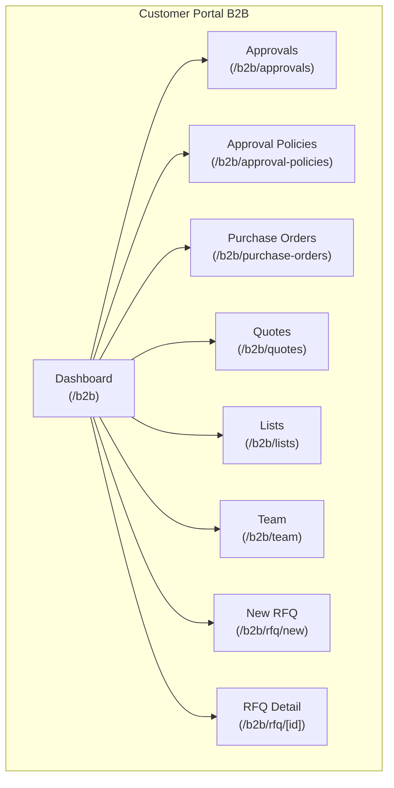

**Section sources**
- [page.tsx:177-200](file://apps/customer/src/app/b2b/page.tsx#L177-L200)
- [page.tsx:38-61](file://apps/customer/src/app/b2b/approvals/page.tsx#L38-L61)
- [page.tsx:0-10](file://apps/customer/src/app/b2b/approval-policies/page.tsx#L0-L10)
- [page.tsx:24-51](file://apps/customer/src/app/b2b/purchase-orders/page.tsx#L24-L51)
- [page.tsx:23-41](file://apps/customer/src/app/b2b/quotes/page.tsx#L23-L41)
- [page.tsx:0-10](file://apps/customer/src/app/b2b/lists/page.tsx#L0-L10)
- [page.tsx:0-10](file://apps/customer/src/app/b2b/team/page.tsx#L0-L10)
- [page.tsx:0-20](file://apps/customer/src/app/b2b/rfq/new/page.tsx#L0-L20)
- [page.tsx:0-20](file://apps/customer/src/app/b2b/rfq/[id]/page.tsx#L0-L20)

## Core Components
- Dashboard: Aggregates pending approvals, recent activity, and quick links to B2B features.
- Approvals: Centralized review and action center for purchase orders requiring authorization.
- Approval Policies: Define thresholds and routing rules for purchase order approvals.
- Purchase Orders: Lifecycle management from draft to ordered, including requester and approver visibility.
- Quotes: Grouping of supplier quotes per RFQ with statuses and actions (accept/decline).
- Lists: Manage business contact lists for quoting and purchasing.
- Team: Collaborative management of team members and roles within a business account.
- RFQ: Creation of multi-item requests and viewing supplier quotes.

**Section sources**
- [page.tsx:177-200](file://apps/customer/src/app/b2b/page.tsx#L177-L200)
- [page.tsx:38-61](file://apps/customer/src/app/b2b/approvals/page.tsx#L38-L61)
- [page.tsx:0-10](file://apps/customer/src/app/b2b/approval-policies/page.tsx#L0-L10)
- [page.tsx:24-51](file://apps/customer/src/app/b2b/purchase-orders/page.tsx#L24-L51)
- [page.tsx:23-41](file://apps/customer/src/app/b2b/quotes/page.tsx#L23-L41)
- [page.tsx:0-10](file://apps/customer/src/app/b2b/lists/page.tsx#L0-L10)
- [page.tsx:0-10](file://apps/customer/src/app/b2b/team/page.tsx#L0-L10)
- [page.tsx:0-20](file://apps/customer/src/app/b2b/rfq/new/page.tsx#L0-L20)
- [page.tsx:0-20](file://apps/customer/src/app/b2b/rfq/[id]/page.tsx#L0-L20)

## Architecture Overview
The B2B feature set is client-driven with server-side rendering and data fetching via database queries. The dashboard orchestrates navigation to specialized pages. Approval workflows involve requester and approver roles, while purchase orders integrate with ordering systems. Quotes originate from RFQs and can be accepted to initiate purchase processes.

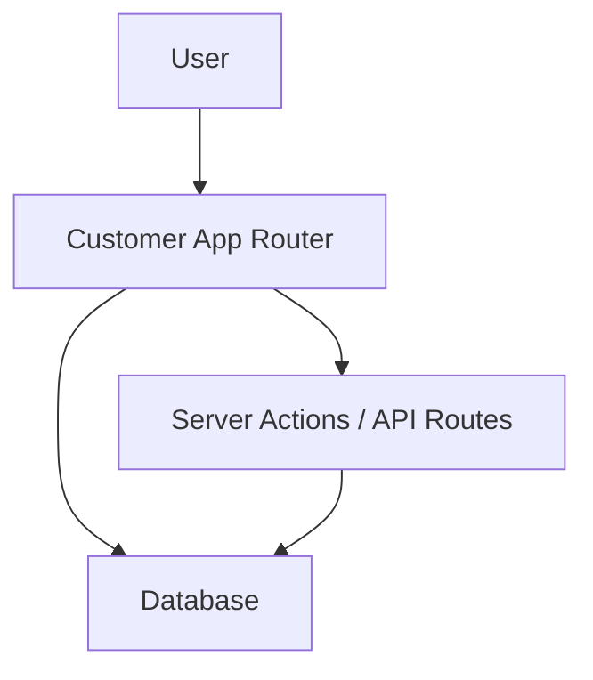

[No sources needed since this diagram shows conceptual workflow, not actual code structure]

## Detailed Component Analysis

### Approval Policies Management
Purpose:
- Define approval thresholds and routing rules for purchase orders within a business account.

Key behaviors:
- Retrieve and render current policy configuration.
- Provide a validated form for editing policy parameters.
- Persist updates via server actions.

Request/Response outline:
- GET /b2b/approval-policies
  - Response: Current policy configuration object (thresholds, approvers).
- POST /b2b/approval-policies
  - Request body: Updated policy fields.
  - Response: Success indicator and refreshed policy data.

Validation rules:
- Threshold values must be numeric and non-negative.
- Approver roles must match supported roles within the business hierarchy.

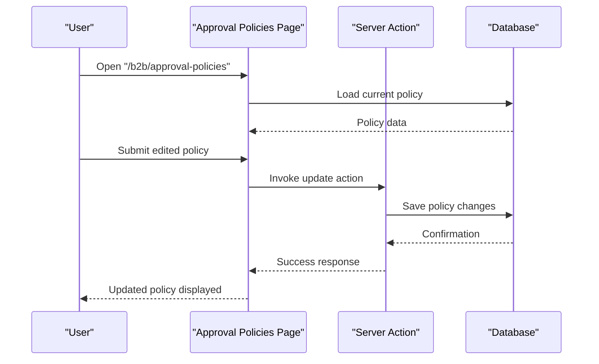

**Diagram sources**
- [page.tsx:0-10](file://apps/customer/src/app/b2b/approval-policies/page.tsx#L0-L10)
- [actions.ts:1-50](file://apps/customer/src/app/b2b/approval-policies/actions.ts#L1-L50)

**Section sources**
- [page.tsx:0-10](file://apps/customer/src/app/b2b/approval-policies/page.tsx#L0-L10)
- [actions.ts:1-50](file://apps/customer/src/app/b2b/approval-policies/actions.ts#L1-L50)

### Purchase Orders Management
Purpose:
- Manage purchase order lifecycle: create, review, approve, and convert to ordered.

Key behaviors:
- Fetch purchase orders scoped to the current company.
- Compute statistics for open, pending, and total ordered amounts.
- Determine eligibility to approve based on member role.

Request/Response outline:
- GET /b2b/purchase-orders
  - Response: List of purchase orders with status, totals, and requester metadata.
- POST /b2b/purchase-orders (placeholder for actions)
  - Request body: Action payload (approve/reject/submit).
  - Response: Updated order status and state.

Approval workflow:
- Draft → Pending Approval (requester submits) → Approved (authorized) → Ordered (converted).
- Multi-level authorization: Roles COMPANY_ADMIN and COMPANY_APPROVER can approve.

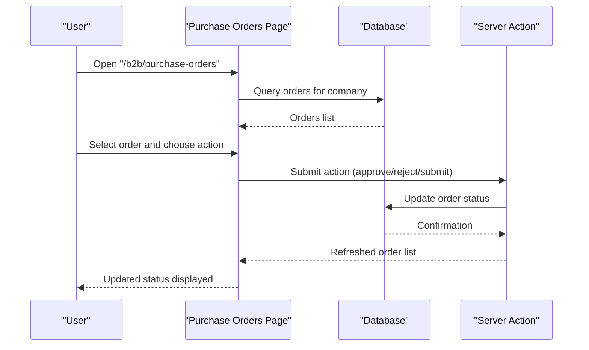

**Diagram sources**
- [page.tsx:24-51](file://apps/customer/src/app/b2b/purchase-orders/page.tsx#L24-L51)
- [actions.ts:1-50](file://apps/customer/src/app/b2b/purchase-orders/actions.ts#L1-L50)

**Section sources**
- [page.tsx:24-51](file://apps/customer/src/app/b2b/purchase-orders/page.tsx#L24-L51)
- [actions.ts:1-50](file://apps/customer/src/app/b2b/purchase-orders/actions.ts#L1-L50)

### Quotes and RFQ Processing
Purpose:
- Receive supplier quotes for RFQs and accept/decline them.
- Support multi-item RFQ creation and quote grouping.

Key behaviors:
- Group quotes by RFQ ID.
- Display statuses: Received, Accepted, Declined, Expired.
- Allow accepting quotes to initiate purchase workflows.

Request/Response outline:
- GET /b2b/quotes
  - Response: Quotes grouped by RFQ with status and totals.
- POST /b2b/quotes (placeholder for acceptance)
  - Request body: Quote identifier and action.
  - Response: Updated quote status and next steps.

RFQ creation:
- Multi-item form with add/remove item controls.
- Priority selection and submission flow.

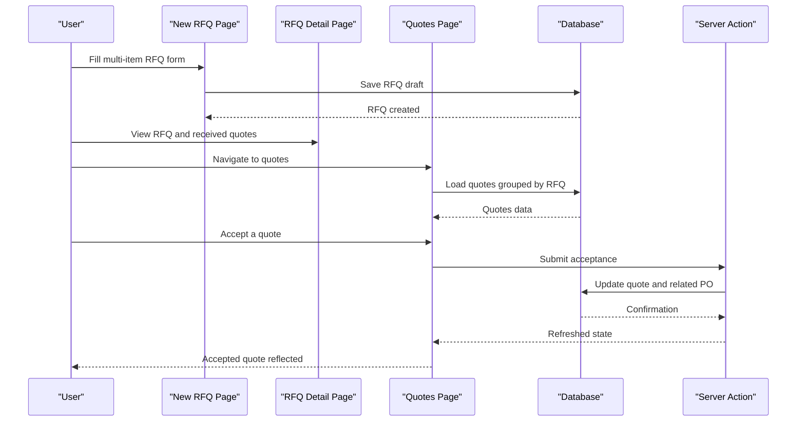

**Diagram sources**
- [page.tsx:0-20](file://apps/customer/src/app/b2b/rfq/new/page.tsx#L0-L20)
- [page.tsx:0-20](file://apps/customer/src/app/b2b/rfq/[id]/page.tsx#L0-L20)
- [page.tsx:23-41](file://apps/customer/src/app/b2b/quotes/page.tsx#L23-L41)
- [actions.ts:1-50](file://apps/customer/src/app/b2b/purchase-orders/actions.ts#L1-L50)

**Section sources**
- [page.tsx:23-41](file://apps/customer/src/app/b2b/quotes/page.tsx#L23-L41)
- [page.tsx:0-20](file://apps/customer/src/app/b2b/rfq/new/page.tsx#L0-L20)
- [page.tsx:0-20](file://apps/customer/src/app/b2b/rfq/[id]/page.tsx#L0-L20)

### Business Lists Management
Purpose:
- Maintain business contact lists for quoting and purchasing.

Key behaviors:
- Render list management interface.
- Provide actions to add, remove, or update contacts.

Request/Response outline:
- GET /b2b/lists
  - Response: List of business contacts.
- POST /b2b/lists (placeholder for CRUD)
  - Request body: Contact details and operation.
  - Response: Updated list and success indicator.

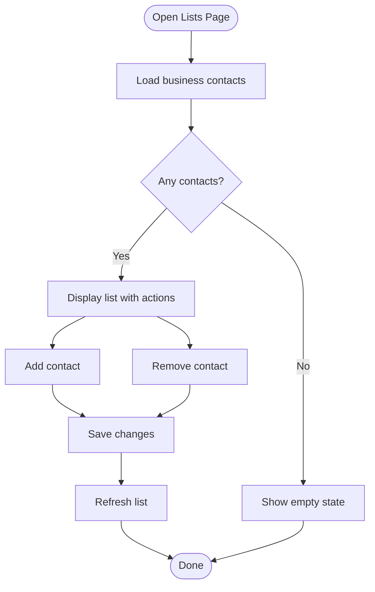

**Diagram sources**
- [page.tsx:0-10](file://apps/customer/src/app/b2b/lists/page.tsx#L0-L10)
- [actions.ts:1-50](file://apps/customer/src/app/b2b/lists/actions.ts#L1-L50)

**Section sources**
- [page.tsx:0-10](file://apps/customer/src/app/b2b/lists/page.tsx#L0-L10)
- [actions.ts:1-50](file://apps/customer/src/app/b2b/lists/actions.ts#L1-L50)

### Team Collaboration APIs
Purpose:
- Manage team members and roles within a business account.

Key behaviors:
- Display team members with roles.
- Provide actions to invite, update roles, or remove members.

Request/Response outline:
- GET /b2b/team
  - Response: Team member list with roles and metadata.
- POST /b2b/team (placeholder for invites and updates)
  - Request body: Member details and action.
  - Response: Updated team state and notifications.

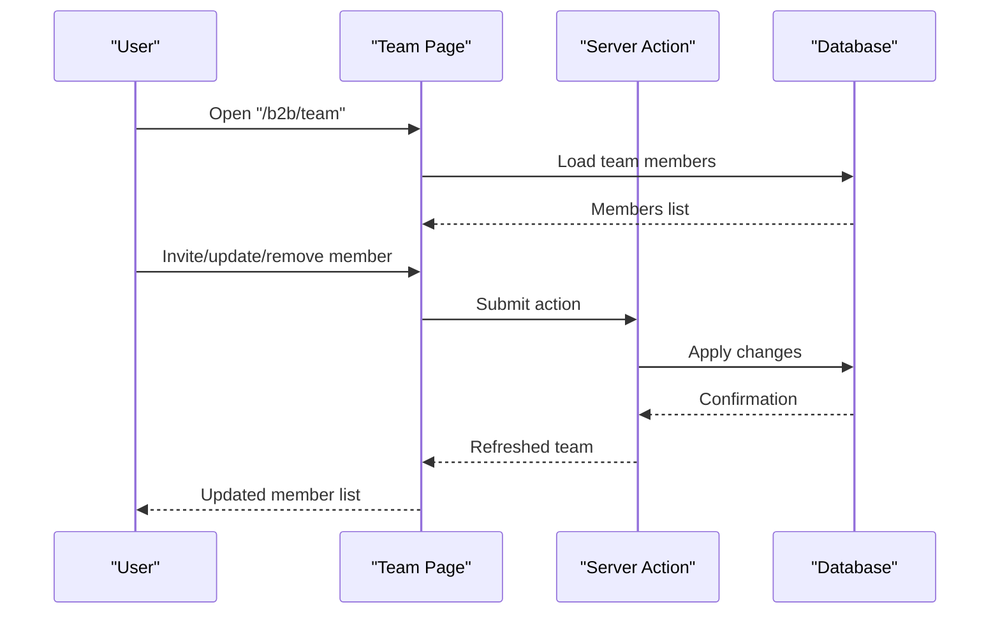

**Diagram sources**
- [page.tsx:0-10](file://apps/customer/src/app/b2b/team/page.tsx#L0-L10)
- [actions.ts:1-50](file://apps/customer/src/app/b2b/team/actions.ts#L1-L50)

**Section sources**
- [page.tsx:0-10](file://apps/customer/src/app/b2b/team/page.tsx#L0-L10)
- [actions.ts:1-50](file://apps/customer/src/app/b2b/team/actions.ts#L1-L50)

### Approvals Center
Purpose:
- Central hub for reviewing purchase orders awaiting approval.

Key behaviors:
- Filter and display pending approvals.
- Provide approve/reject actions based on authorization.

Request/Response outline:
- GET /b2b/approvals
  - Response: Approval queue with order summaries and statuses.
- POST /b2b/approvals (placeholder for decisions)
  - Request body: Decision and optional comment.
  - Response: Updated approval record and next state.

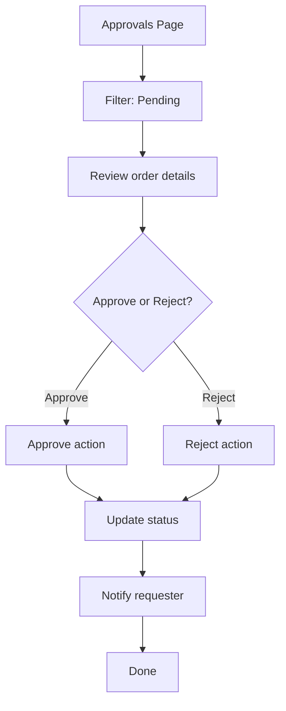

**Diagram sources**
- [page.tsx:38-61](file://apps/customer/src/app/b2b/approvals/page.tsx#L38-L61)

**Section sources**
- [page.tsx:38-61](file://apps/customer/src/app/b2b/approvals/page.tsx#L38-L61)

## Dependency Analysis
- The B2B dashboard aggregates navigation to all major features.
- Purchase orders depend on company context and member roles for visibility and actions.
- Quotes depend on RFQ existence and supplier responses.
- Approval policies influence who can approve and under what thresholds.
- Team membership determines access and authorization levels.

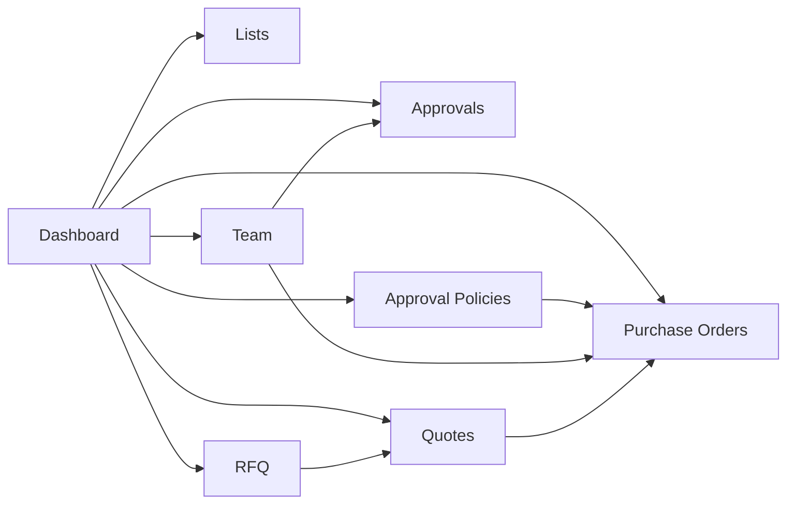

[No sources needed since this diagram shows conceptual relationships, not specific code structure]

**Section sources**
- [page.tsx:177-200](file://apps/customer/src/app/b2b/page.tsx#L177-L200)
- [page.tsx:38-61](file://apps/customer/src/app/b2b/approvals/page.tsx#L38-L61)
- [page.tsx:0-10](file://apps/customer/src/app/b2b/approval-policies/page.tsx#L0-L10)
- [page.tsx:24-51](file://apps/customer/src/app/b2b/purchase-orders/page.tsx#L24-L51)
- [page.tsx:23-41](file://apps/customer/src/app/b2b/quotes/page.tsx#L23-L41)
- [page.tsx:0-10](file://apps/customer/src/app/b2b/lists/page.tsx#L0-L10)
- [page.tsx:0-10](file://apps/customer/src/app/b2b/team/page.tsx#L0-L10)
- [page.tsx:0-20](file://apps/customer/src/app/b2b/rfq/new/page.tsx#L0-L20)
- [page.tsx:0-20](file://apps/customer/src/app/b2b/rfq/[id]/page.tsx#L0-L20)

## Performance Considerations
- Batch queries: Fetch requester names and other metadata in single queries to avoid N+1 problems.
- Pagination: Limit returned purchase orders and quotes to recent items to reduce payload sizes.
- Role checks: Perform role checks server-side to minimize client-side filtering overhead.
- Caching: Cache frequently accessed policy configurations and team member lists.

[No sources needed since this section provides general guidance]

## Troubleshooting Guide
Common issues and resolutions:
- No company account: Redirect to company registration or switch context.
- No pending approvals: Verify member role and ensure orders are submitted for approval.
- UI-only actions: Integrate server actions for approve/reject and quote acceptance.
- Mock data limitations: Replace mock RFQs and quotes with live data sources.

Testing checklist highlights:
- RFQ rows clickable and lead to detail pages.
- New RFQ form supports multi-item entries.
- Quotes grouped by RFQ with accept/decline actions.
- Approvals center displays pending orders with actions.

**Section sources**
- [MODULE_02_B2B_TRADE_NOTES.md:24-45](file://MODULE_02_B2B_TRADE_NOTES.md#L24-L45)

## Conclusion
The B2B feature set provides a robust foundation for managing purchase workflows, approvals, and team collaboration. Integrating server actions and live data sources will enable full end-to-end functionality, including multi-level authorization, quote-to-order conversion, and business contact management.

[No sources needed since this section summarizes without analyzing specific files]

## Appendices

### End-to-End Workflows

#### Complete B2B Purchase Workflow
- Create RFQ with multiple items.
- Receive supplier quotes.
- Accept the best quote.
- Convert quote to purchase order.
- Submit order for approval.
- Approve order.
- Mark as ordered.

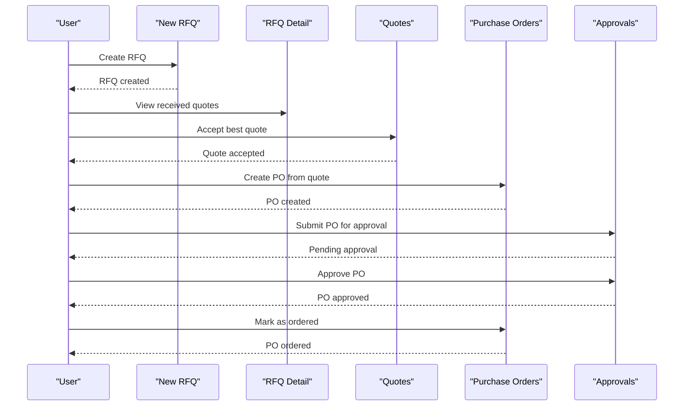

[No sources needed since this diagram shows conceptual workflow, not actual code structure]

#### Quote-to-Order Conversion Scenario
- Supplier responds to RFQ with multiple quotes.
- Buyer selects the most favorable quote.
- System creates a purchase order linked to the quote.
- PO enters approval workflow.

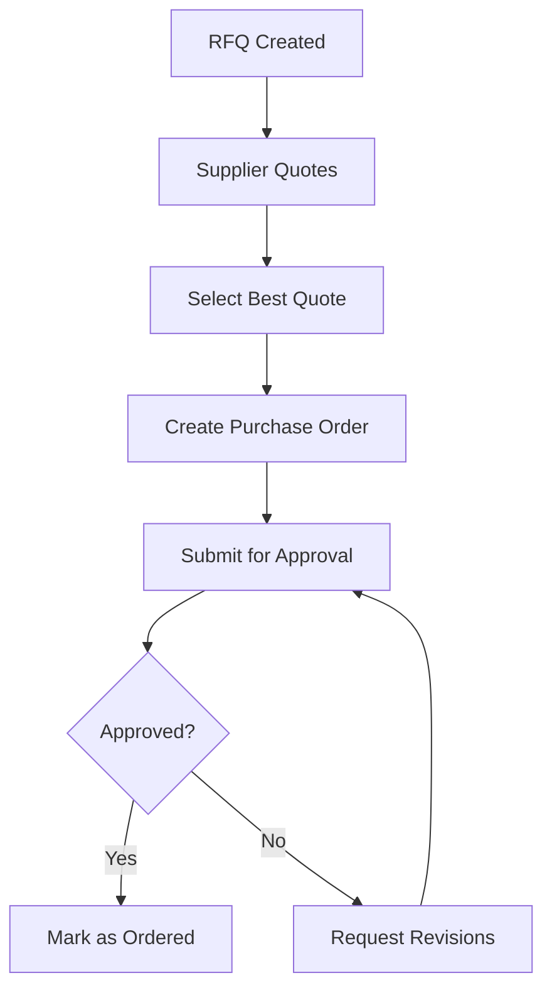

[No sources needed since this diagram shows conceptual workflow, not actual code structure]