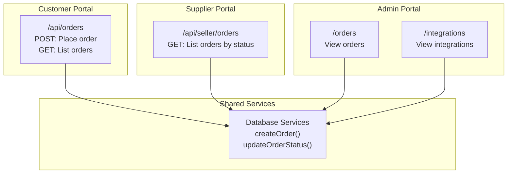
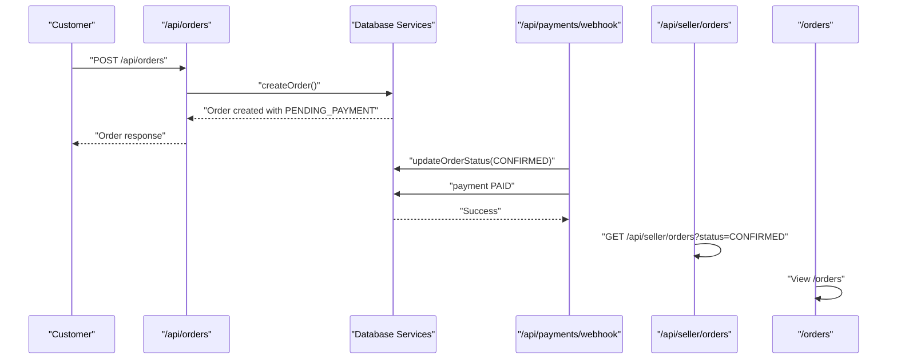
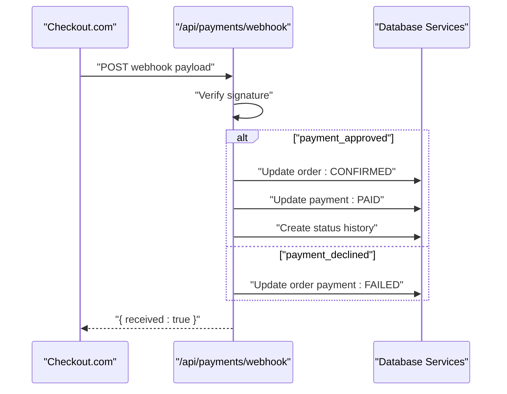
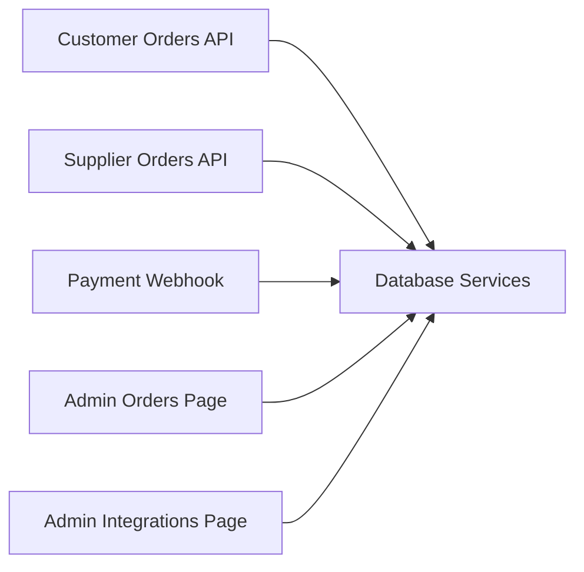

# Order Processing APIs

<cite>
**Referenced Files in This Document**
- [apps/customer/src/app/api/orders/route.ts](file://apps/customer/src/app/api/orders/route.ts)
- [apps/customer/src/app/api/payments/webhook/route.ts](file://apps/customer/src/app/api/payments/webhook/route.ts)
- [apps/seller/src/app/api/seller/orders/route.ts](file://apps/seller/src/app/api/seller/orders/route.ts)
- [apps/admin/src/app/orders/page.tsx](file://apps/admin/src/app/orders/page.tsx)
- [packages/database/src/services/orders.ts](file://packages/database/src/services/orders.ts)
- [packages/database/src/types/index.ts](file://packages/database/src/types/index.ts)
- [apps/admin/src/app/integrations/page.tsx](file://apps/admin/src/app/integrations/page.tsx)
</cite>

## Table of Contents
1. [Introduction](#introduction)
2. [Project Structure](#project-structure)
3. [Core Components](#core-components)
4. [Architecture Overview](#architecture-overview)
5. [Detailed Component Analysis](#detailed-component-analysis)
6. [Dependency Analysis](#dependency-analysis)
7. [Performance Considerations](#performance-considerations)
8. [Troubleshooting Guide](#troubleshooting-guide)
9. [Conclusion](#conclusion)
10. [Appendices](#appendices)

## Introduction
This document provides comprehensive API documentation for order processing across three portals:
- Customer portal: place orders, view order history, and manage personal orders
- Supplier portal: fulfill orders, update statuses, and coordinate fulfillment
- Admin portal: oversee orders, monitor integrations, and manage operational workflows

It also covers payment webhook integration for payment confirmation, order status updates, shipping tracking integration, and return/refund processing endpoints. Request/response schemas and end-to-end workflows are included to guide developers integrating with the system.

## Project Structure
The order processing APIs are implemented as Next.js App Router API routes under each application:
- Customer portal: `/api/orders` for placing and retrieving orders
- Payment webhook: `/api/payments/webhook` for payment provider callbacks
- Supplier portal: `/api/seller/orders` for order listing and fulfillment
- Admin portal: `/orders` for order management and oversight
- Shared domain logic: order creation, status updates, and database services in the shared `@avenick/database` package

**Diagram sources**
- [apps/customer/src/app/api/orders/route.ts:1-120](file://apps/customer/src/app/api/orders/route.ts#L1-L120)
- [apps/seller/src/app/api/seller/orders/route.ts:1-24](file://apps/seller/src/app/api/seller/orders/route.ts#L1-L24)
- [apps/admin/src/app/orders/page.tsx:1-200](file://apps/admin/src/app/orders/page.tsx#L1-L200)
- [packages/database/src/services/orders.ts:120-162](file://packages/database/src/services/orders.ts#L120-L162)

**Section sources**
- [apps/customer/src/app/api/orders/route.ts:1-120](file://apps/customer/src/app/api/orders/route.ts#L1-L120)
- [apps/seller/src/app/api/seller/orders/route.ts:1-24](file://apps/seller/src/app/api/seller/orders/route.ts#L1-L24)
- [apps/admin/src/app/orders/page.tsx:1-200](file://apps/admin/src/app/orders/page.tsx#L1-L200)
- [packages/database/src/services/orders.ts:120-162](file://packages/database/src/services/orders.ts#L120-L162)

## Core Components
- Order creation service: Creates orders with items, shipping address, and initial status history
- Order status update service: Atomic transaction to update order status and record status history
- Customer order API: Handles order placement and retrieval for authenticated customers
- Supplier order API: Lists orders for a seller filtered by optional status and pagination
- Payment webhook: Validates signatures and transitions order/payment states upon payment events
- Admin order view: Provides order management interface for administrators
- Shipping integration: Admin hub displays shipping carrier connections (Aramex/DHL)

Key responsibilities:
- Enforce authentication and authorization per portal
- Maintain immutable status history for auditability
- Support multi-item orders and batch operations
- Integrate with external systems via webhooks and admin-managed integrations

**Section sources**
- [packages/database/src/services/orders.ts:120-162](file://packages/database/src/services/orders.ts#L120-L162)
- [apps/customer/src/app/api/orders/route.ts:1-120](file://apps/customer/src/app/api/orders/route.ts#L1-L120)
- [apps/seller/src/app/api/seller/orders/route.ts:1-24](file://apps/seller/src/app/api/seller/orders/route.ts#L1-L24)
- [apps/customer/src/app/api/payments/webhook/route.ts:1-51](file://apps/customer/src/app/api/payments/webhook/route.ts#L1-L51)
- [apps/admin/src/app/integrations/page.tsx:1-98](file://apps/admin/src/app/integrations/page.tsx#L1-L98)

## Architecture Overview
The order lifecycle spans customer checkout, payment confirmation, supplier fulfillment, and optional shipping integration. The diagram below maps actual API routes and services to the order processing flow.

**Diagram sources**
- [apps/customer/src/app/api/orders/route.ts:1-120](file://apps/customer/src/app/api/orders/route.ts#L1-L120)
- [packages/database/src/services/orders.ts:120-162](file://packages/database/src/services/orders.ts#L120-L162)
- [apps/customer/src/app/api/payments/webhook/route.ts:1-51](file://apps/customer/src/app/api/payments/webhook/route.ts#L1-L51)
- [apps/seller/src/app/api/seller/orders/route.ts:1-24](file://apps/seller/src/app/api/seller/orders/route.ts#L1-L24)
- [apps/admin/src/app/orders/page.tsx:1-200](file://apps/admin/src/app/orders/page.tsx#L1-L200)

## Detailed Component Analysis

### Customer Order API
Endpoints:
- POST /api/orders: Place a new order
- GET /api/orders: List customer orders (paginated, optional status filter)

Behavior:
- Authentication required; unauthorized requests receive 401
- Creates order with items, shipping address, and initial status history
- Returns order details including items and status history

Request schema (order placement):
- userId: string (authenticated customer)
- companyId: string (optional for B2B)
- purchaseOrderId: string (optional)
- type: enum ("B2C" | "B2B")
- currency: string
- paymentMethod: string
- shippingAddress: object (street, city, postalCode, countryCode)
- items: array of item objects (productId, quantity, unitPrice)
- notes: string (optional)

Response schema (order placement):
- success: boolean
- order: object with orderNumber, status, items[], statusHistory[]

Pagination and filtering:
- page: number (default 1)
- limit: number (default 20)
- status: enum (optional filter)

**Section sources**
- [apps/customer/src/app/api/orders/route.ts:1-120](file://apps/customer/src/app/api/orders/route.ts#L1-L120)
- [packages/database/src/services/orders.ts:120-162](file://packages/database/src/services/orders.ts#L120-L162)

### Supplier Order API
Endpoint:
- GET /api/seller/orders: List orders for a seller

Behavior:
- Authentication required; seller profile verified
- Filters orders by items linked to the seller
- Supports pagination and optional status filter

Request parameters:
- page: number (default 1)
- limit: number (default 20)
- status: enum (optional)

Response schema:
- success: boolean
- orders: array of order objects
- pagination: { page, pages, total }

Status transitions (supplier workflow):
- CONFIRMED → SHIPPED: Update order status and record history
- CONFIRMED → CANCELLED: Cancel order and record history
- SHIPPED → DELIVERED: Update delivery status and finalize

**Section sources**
- [apps/seller/src/app/api/seller/orders/route.ts:1-24](file://apps/seller/src/app/api/seller/orders/route.ts#L1-L24)
- [packages/database/src/services/orders.ts:146-152](file://packages/database/src/services/orders.ts#L146-L152)

### Payment Webhook API
Endpoint:
- POST /api/payments/webhook: Receive payment provider callbacks

Security:
- Validates signature using HMAC-SHA256 over raw request body
- Requires CHECKOUT_WEBHOOK_SECRET environment variable
- Rejects unconfigured or unsigned requests

Supported events:
- payment_approved: Transitions order to CONFIRMED, payment to PAID, records status history
- payment_declined: Marks order payment as FAILED

Response:
- On success: { received: true }
- On invalid signature: 401 with error
- On missing secret: 500 with error
- On processing errors: 500 with error

**Diagram sources**
- [apps/customer/src/app/api/payments/webhook/route.ts:1-51](file://apps/customer/src/app/api/payments/webhook/route.ts#L1-L51)
- [packages/database/src/services/orders.ts:146-152](file://packages/database/src/services/orders.ts#L146-L152)

**Section sources**
- [apps/customer/src/app/api/payments/webhook/route.ts:1-51](file://apps/customer/src/app/api/payments/webhook/route.ts#L1-L51)
- [packages/database/src/services/orders.ts:146-152](file://packages/database/src/services/orders.ts#L146-L152)

### Admin Order Management
Endpoint:
- GET /orders: View orders in admin portal

Behavior:
- Requires admin session
- Provides order listing and management capabilities
- Integrations hub displays connected shipping providers (Aramex/DHL)

**Section sources**
- [apps/admin/src/app/orders/page.tsx:1-200](file://apps/admin/src/app/orders/page.tsx#L1-L200)
- [apps/admin/src/app/integrations/page.tsx:1-98](file://apps/admin/src/app/integrations/page.tsx#L1-L98)

### Order Status Updates and History
Order status lifecycle:
- Initial: PENDING_PAYMENT
- Upon payment: CONFIRMED
- Fulfillment: SHIPPED
- Completion: DELIVERED
- Cancellation: CANCELLED

Each status change creates an immutable status history entry with actor and message.

**Section sources**
- [packages/database/src/services/orders.ts:146-152](file://packages/database/src/services/orders.ts#L146-L152)
- [packages/database/src/types/index.ts:1-200](file://packages/database/src/types/index.ts#L1-L200)

### Return and Refund Processing
While explicit return/refund endpoints are not present in the analyzed files, the system supports:
- Order cancellation via status updates
- Payment reversal workflows through payment provider webhooks
- Audit trail via status history for dispute resolution

Recommendations:
- Add dedicated return/refund endpoints with validation and inventory reconciliation
- Integrate with shipping provider APIs for return label generation
- Implement refund initiation and tracking via payment provider APIs

**Section sources**
- [packages/database/src/services/orders.ts:146-152](file://packages/database/src/services/orders.ts#L146-L152)

## Dependency Analysis
The order processing system exhibits clear separation of concerns:
- Customer API depends on database services for order creation
- Supplier API filters orders by seller association
- Payment webhook coordinates with database services for atomic state updates
- Admin portal integrates with both order data and integration hub

**Diagram sources**
- [apps/customer/src/app/api/orders/route.ts:1-120](file://apps/customer/src/app/api/orders/route.ts#L1-L120)
- [apps/seller/src/app/api/seller/orders/route.ts:1-24](file://apps/seller/src/app/api/seller/orders/route.ts#L1-L24)
- [apps/customer/src/app/api/payments/webhook/route.ts:1-51](file://apps/customer/src/app/api/payments/webhook/route.ts#L1-L51)
- [apps/admin/src/app/orders/page.tsx:1-200](file://apps/admin/src/app/orders/page.tsx#L1-L200)
- [apps/admin/src/app/integrations/page.tsx:1-98](file://apps/admin/src/app/integrations/page.tsx#L1-L98)
- [packages/database/src/services/orders.ts:120-162](file://packages/database/src/services/orders.ts#L120-L162)

**Section sources**
- [apps/customer/src/app/api/orders/route.ts:1-120](file://apps/customer/src/app/api/orders/route.ts#L1-L120)
- [apps/seller/src/app/api/seller/orders/route.ts:1-24](file://apps/seller/src/app/api/seller/orders/route.ts#L1-L24)
- [apps/customer/src/app/api/payments/webhook/route.ts:1-51](file://apps/customer/src/app/api/payments/webhook/route.ts#L1-L51)
- [apps/admin/src/app/orders/page.tsx:1-200](file://apps/admin/src/app/orders/page.tsx#L1-L200)
- [apps/admin/src/app/integrations/page.tsx:1-98](file://apps/admin/src/app/integrations/page.tsx#L1-L98)
- [packages/database/src/services/orders.ts:120-162](file://packages/database/src/services/orders.ts#L120-L162)

## Performance Considerations
- Pagination: Use page and limit parameters to avoid large result sets
- Filtering: Apply status filters early to reduce database load
- Transactions: Atomic updates ensure consistency but may increase lock contention; batch updates where appropriate
- Webhook reliability: Implement idempotency keys and retry mechanisms for payment events
- Caching: Cache frequently accessed order summaries; invalidate on status changes

## Troubleshooting Guide
Common issues and resolutions:
- Unauthorized access: Ensure proper authentication tokens for customer/supplier/admin sessions
- Missing webhook secret: Configure CHECKOUT_WEBHOOK_SECRET; webhook will reject unsigned requests
- Invalid signature: Verify webhook secret matches provider configuration and body encoding
- Transaction failures: Payment webhook uses transactions; check database connectivity and permissions
- Status mismatch: Confirm order status history entries reflect actual business state

**Section sources**
- [apps/customer/src/app/api/payments/webhook/route.ts:1-51](file://apps/customer/src/app/api/payments/webhook/route.ts#L1-L51)
- [apps/customer/src/app/api/orders/route.ts:1-120](file://apps/customer/src/app/api/orders/route.ts#L1-L120)
- [apps/seller/src/app/api/seller/orders/route.ts:1-24](file://apps/seller/src/app/api/seller/orders/route.ts#L1-L24)

## Conclusion
The order processing APIs provide a robust foundation for customer, supplier, and admin workflows. They enforce secure authentication, maintain audit trails, and integrate with payment and shipping providers. Extending the system with dedicated return/refund endpoints and enhanced shipping tracking would further strengthen the fulfillment lifecycle.

## Appendices

### Request/Response Schemas

Order Placement Schema
- Request: { userId, companyId?, purchaseOrderId?, type, currency, paymentMethod, shippingAddress, items[], notes? }
- Response: { success, order: { orderNumber, status, items[], statusHistory[] } }

Payment Webhook Schema
- Request: { type, data: { id, metadata: { orderId } } }
- Response: { received: true } or error with status

Order Listing Schema
- Request: GET /api/orders or /api/seller/orders with page, limit, status
- Response: { success, orders[], pagination? }

Order Status Update Schema
- Request: Update order status via supplier/admin endpoints
- Response: { success, order }

### End-to-End Workflows

Complete Order Workflow
1. Customer places order via POST /api/orders
2. Payment provider redirects to confirmation
3. Payment webhook receives payment_approved and updates order/payment
4. Supplier retrieves CONFIRMED orders via GET /api/seller/orders
5. Supplier marks order SHIPPED and later DELIVERED
6. Admin monitors orders and integrations

Webhook Handling Flow
1. Provider sends signed webhook to /api/payments/webhook
2. Signature validated using HMAC-SHA256
3. Order/payment updated atomically
4. Status history recorded

Shipping Carrier Integration
- Admin hub displays Aramex/DHL connections
- Extend APIs to book shipments, generate AWBs, and sync tracking

**Section sources**
- [apps/customer/src/app/api/orders/route.ts:1-120](file://apps/customer/src/app/api/orders/route.ts#L1-L120)
- [apps/customer/src/app/api/payments/webhook/route.ts:1-51](file://apps/customer/src/app/api/payments/webhook/route.ts#L1-L51)
- [apps/seller/src/app/api/seller/orders/route.ts:1-24](file://apps/seller/src/app/api/seller/orders/route.ts#L1-L24)
- [apps/admin/src/app/integrations/page.tsx:1-98](file://apps/admin/src/app/integrations/page.tsx#L1-L98)
- [packages/database/src/services/orders.ts:120-162](file://packages/database/src/services/orders.ts#L120-L162)