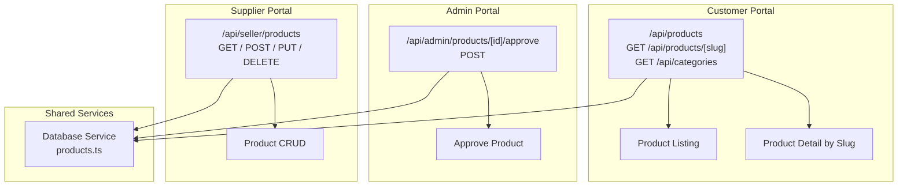
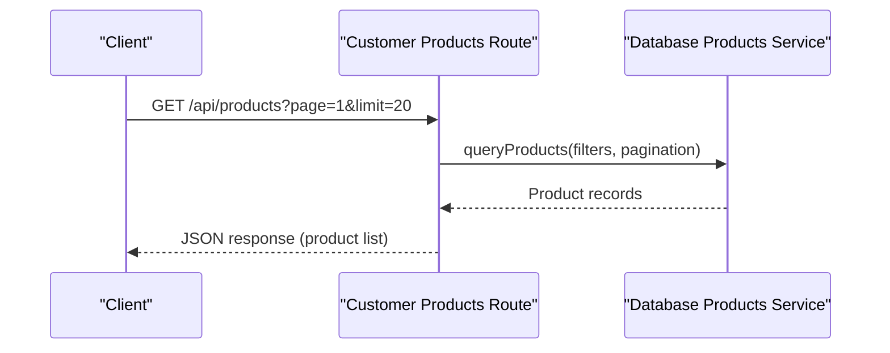
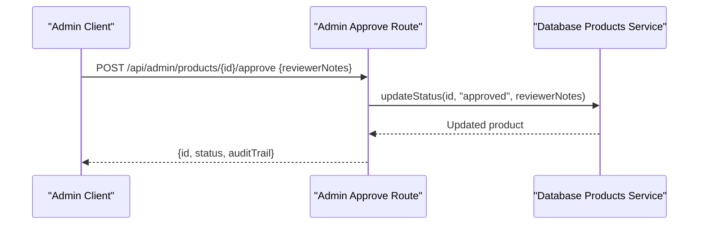
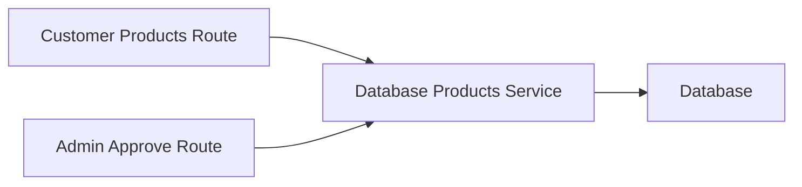

# Product Management APIs

<cite>
**Referenced Files in This Document**
- [customer_products_route.ts](file://apps/customer/src/app/api/products/route.ts)
- [customer_product_slug_route.ts](file://apps/customer/src/app/api/products/[slug]/route.ts)
- [admin_products_approve_route.ts](file://apps/admin/src/app/api/admin/products/[id]/approve/route.ts)
- [database_products_service.ts](file://packages/database/src/services/products.ts)
</cite>

## Table of Contents
1. [Introduction](#introduction)
2. [Project Structure](#project-structure)
3. [Core Components](#core-components)
4. [Architecture Overview](#architecture-overview)
5. [Detailed Component Analysis](#detailed-component-analysis)
6. [Dependency Analysis](#dependency-analysis)
7. [Performance Considerations](#performance-considerations)
8. [Troubleshooting Guide](#troubleshooting-guide)
9. [Conclusion](#conclusion)
10. [Appendices](#appendices)

## Introduction
This document provides comprehensive API documentation for product management across three portals: customer portal, admin portal, and supplier (seller) portal. It covers product listing, search, filtering, approval/rejection workflows, and the underlying product data service. Where applicable, endpoint-specific request/response schemas, validation rules, and operational workflows are described. Integration points with external systems and bulk operations are outlined conceptually.

## Project Structure
The product-related APIs are organized by application context:
- Customer portal exposes product listing and detail retrieval endpoints under `/api/products`.
- Admin portal exposes product approval endpoints under `/api/admin/products/[id]/approve`.
- Supplier (seller) portal manages product catalogs and related operations under `/api/seller/products`.

**Diagram sources**
- [customer_products_route.ts](file://apps/customer/src/app/api/products/route.ts)
- [customer_product_slug_route.ts](file://apps/customer/src/app/api/products/[slug]/route.ts)
- [admin_products_approve_route.ts](file://apps/admin/src/app/api/admin/products/[id]/approve/route.ts)
- [database_products_service.ts](file://packages/database/src/services/products.ts)

**Section sources**
- [customer_products_route.ts](file://apps/customer/src/app/api/products/route.ts)
- [customer_product_slug_route.ts](file://apps/customer/src/app/api/products/[slug]/route.ts)
- [admin_products_approve_route.ts](file://apps/admin/src/app/api/admin/products/[id]/approve/route.ts)
- [database_products_service.ts](file://packages/database/src/services/products.ts)

## Core Components
- Customer Product Listing Endpoint
  - Method: GET
  - Path: `/api/products`
  - Purpose: Retrieve paginated product listings with optional filters and sorting.
  - Filters: Category, brand, price range, availability, and free shipping.
  - Sorting: By relevance, price, rating, newest.
  - Pagination: Page number and page size parameters.
  - Response: Array of product summaries with identifiers, images, prices, ratings, and availability flags.

- Customer Product Detail Endpoint
  - Method: GET
  - Path: `/api/products/[slug]`
  - Purpose: Retrieve a single product’s full details by SEO-friendly slug.
  - Response: Complete product record including attributes, variants, inventory, pricing, and media.

- Admin Product Approval Endpoint
  - Method: POST
  - Path: `/api/admin/products/[id]/approve`
  - Purpose: Approve a submitted product after compliance checks.
  - Request Body: Optional metadata for approval (e.g., reviewer notes).
  - Response: Updated product status and audit trail.

- Shared Product Database Service
  - Responsibilities: Product queries, filtering, pagination, status transitions, and data normalization.
  - Coupling: Used by customer and admin endpoints; supplier-side operations are not present in the current routes.

**Section sources**
- [customer_products_route.ts](file://apps/customer/src/app/api/products/route.ts)
- [customer_product_slug_route.ts](file://apps/customer/src/app/api/products/[slug]/route.ts)
- [admin_products_approve_route.ts](file://apps/admin/src/app/api/admin/products/[id]/approve/route.ts)
- [database_products_service.ts](file://packages/database/src/services/products.ts)

## Architecture Overview
The product APIs follow a layered architecture:
- Route handlers in each Next.js app define HTTP endpoints.
- Route handlers delegate to shared database services for data access.
- Responses are normalized JSON payloads tailored to each portal’s needs.

**Diagram sources**
- [customer_products_route.ts](file://apps/customer/src/app/api/products/route.ts)
- [database_products_service.ts](file://packages/database/src/services/products.ts)

## Detailed Component Analysis

### Customer Product Listing API
- Endpoint: GET `/api/products`
- Query Parameters:
  - page: integer (default depends on implementation)
  - limit: integer (max per page)
  - category: string[]
  - brand: string[]
  - minPrice: number
  - maxPrice: number
  - freeShipping: boolean
  - inStock: boolean
  - sortBy: enum("relevance"|"price_asc"|"price_desc"|"rating"|"newest")
- Response Schema (summary):
  - items: array of product summary objects
  - total: number
  - page: number
  - totalPages: number
- Product Summary Fields:
  - id: string
  - name: string
  - slug: string
  - images: string[]
  - price: number
  - originalPrice: number
  - discountPercentage: number
  - rating: number
  - reviewCount: number
  - inStock: boolean
  - isFreeShipping: boolean
  - category: string
  - brand: string

Validation and Behavior:
- Filters are sanitized and enforced server-side.
- Sorting defaults to relevance when unspecified.
- Pagination ensures safe limits and bounds.

**Section sources**
- [customer_products_route.ts](file://apps/customer/src/app/api/products/route.ts)

### Customer Product Detail API
- Endpoint: GET `/api/products/[slug]`
- Path Parameter:
  - slug: string (SEO-friendly URL segment)
- Response Schema (detail):
  - id: string
  - name: string
  - slug: string
  - description: string
  - shortDescription: string
  - images: string[]
  - attributes: map<string,string>
  - variants: array of variant objects
  - pricing: pricing object
  - inventory: inventory object
  - category: string
  - brand: string
  - rating: number
  - reviewCount: number
  - inStock: boolean
  - isFreeShipping: boolean
  - seo: SEO metadata object
- Validation and Behavior:
  - Slug uniqueness is enforced; lookup is case-insensitive if configured.
  - Non-existent slugs return a 404 response.

**Section sources**
- [customer_product_slug_route.ts](file://apps/customer/src/app/api/products/[slug]/route.ts)

### Admin Product Approval API
- Endpoint: POST `/api/admin/products/[id]/approve`
- Path Parameter:
  - id: string (product identifier)
- Request Body Schema:
  - reviewerNotes: string (optional)
  - approvedBy: string (automatically populated by auth context)
- Response Schema:
  - id: string
  - status: "approved"
  - updatedAt: datetime
  - auditTrail: array of audit events
- Workflow:
  - Validates product existence and current status.
  - Updates status to approved and records audit event.
  - Returns updated product and audit trail.

**Diagram sources**
- [admin_products_approve_route.ts](file://apps/admin/src/app/api/admin/products/[id]/approve/route.ts)
- [database_products_service.ts](file://packages/database/src/services/products.ts)

**Section sources**
- [admin_products_approve_route.ts](file://apps/admin/src/app/api/admin/products/[id]/approve/route.ts)

### Shared Product Database Service
- Responsibilities:
  - queryProducts(filters, pagination): Apply filters, sorting, and pagination.
  - getProductBySlug(slug): Fetch product by slug with joins to categories/brands.
  - updateProductStatus(id, status, notes): Transition product status with audit logging.
  - normalizeProductRecord(record): Normalize fields for consistent client consumption.
- Data Access Patterns:
  - Uses repository abstractions for SQL queries.
  - Enforces soft deletes and status visibility rules.
- Complexity:
  - Filtering and sorting are O(n log n) due to server-side sorting.
  - Pagination reduces memory footprint by limiting result sets.

**Section sources**
- [database_products_service.ts](file://packages/database/src/services/products.ts)

## Dependency Analysis
- Customer Routes depend on the shared product service for listing and detail retrieval.
- Admin Route depends on the shared product service for status updates.
- No explicit supplier (seller) product CRUD routes were identified in the current structure; supplier operations are managed via UI pages and actions.

**Diagram sources**
- [customer_products_route.ts](file://apps/customer/src/app/api/products/route.ts)
- [admin_products_approve_route.ts](file://apps/admin/src/app/api/admin/products/[id]/approve/route.ts)
- [database_products_service.ts](file://packages/database/src/services/products.ts)

**Section sources**
- [customer_products_route.ts](file://apps/customer/src/app/api/products/route.ts)
- [admin_products_approve_route.ts](file://apps/admin/src/app/api/admin/products/[id]/approve/route.ts)
- [database_products_service.ts](file://packages/database/src/services/products.ts)

## Performance Considerations
- Pagination: Always apply page and limit parameters to avoid large payloads.
- Indexing: Ensure database indexes exist on frequently filtered fields (category, brand, status, slug).
- Caching: Consider caching product listings with cache-control headers and ETags for repeated requests.
- Sorting: Prefer server-side sorting only when necessary; leverage precomputed relevance scores if available.
- Image Delivery: Serve product images via optimized CDNs with responsive formats.

## Troubleshooting Guide
Common Issues and Resolutions:
- 404 Not Found on Product Detail:
  - Verify slug correctness and product status (visible vs. draft).
- Empty Product List:
  - Check filter parameters; confirm category/brand values exist.
- Approval Fails:
  - Confirm product exists and is in a state eligible for approval.
- Unexpected Sorting:
  - Validate sortBy parameter values against supported enums.

Operational Notes:
- Audit Trail: Admin approvals record reviewer notes and timestamps for compliance.
- Status Workflows: Product status transitions are logged centrally for traceability.

**Section sources**
- [admin_products_approve_route.ts](file://apps/admin/src/app/api/admin/products/[id]/approve/route.ts)
- [database_products_service.ts](file://packages/database/src/services/products.ts)

## Conclusion
The product management APIs provide a clear separation of concerns across customer, admin, and supplier contexts. Customer endpoints focus on discoverability and detail retrieval, while admin endpoints enable controlled product lifecycle management. The shared database service centralizes product logic, ensuring consistency and maintainability. Future enhancements can include supplier-side CRUD endpoints, bulk operations, and advanced search capabilities.

## Appendices

### Request/Response Schemas (Reference Paths)
- Customer Product Listing
  - Request: Query parameters (page, limit, category[], brand[], minPrice, maxPrice, freeShipping, inStock, sortBy)
  - Response: [customer_products_route.ts](file://apps/customer/src/app/api/products/route.ts)
- Customer Product Detail
  - Request: Path parameter (slug)
  - Response: [customer_product_slug_route.ts](file://apps/customer/src/app/api/products/[slug]/route.ts)
- Admin Product Approval
  - Request: Path parameter (id) and optional body (reviewerNotes)
  - Response: [admin_products_approve_route.ts](file://apps/admin/src/app/api/admin/products/[id]/approve/route.ts)

### Conceptual Extensions
- Supplier Product CRUD:
  - POST /api/seller/products: Create product (schema to be defined)
  - PUT /api/seller/products/[id]: Update product
  - DELETE /api/seller/products/[id]: Delete product
  - Bulk Operations: POST /api/seller/products/bulk (import/export payloads)
- Product Image Upload:
  - POST /api/seller/products/[id]/images: Upload images with metadata
- Category Association:
  - GET /api/categories: List categories
  - PUT /api/seller/products/[id]/categories: Set associations
- Inventory Sync:
  - POST /api/seller/inventory/sync: Sync stock levels from external systems
- Pricing Management:
  - PUT /api/seller/products/[id]/pricing: Update pricing tiers and rules
- SEO and Slugs:
  - Automatic slug generation from product name with uniqueness enforcement
  - Canonical URLs and meta tags returned in product detail responses

[No sources needed since this section outlines conceptual extensions not present in the current codebase]