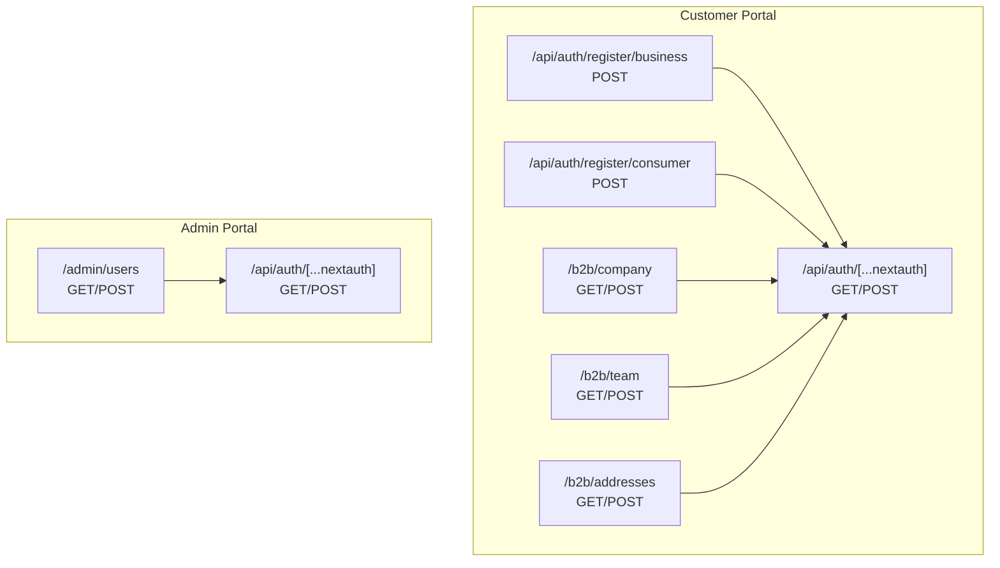
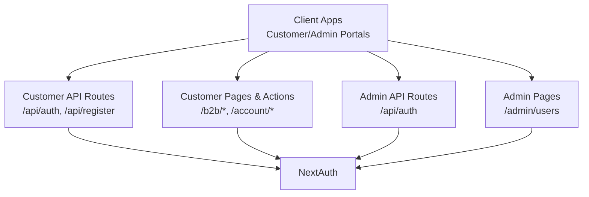
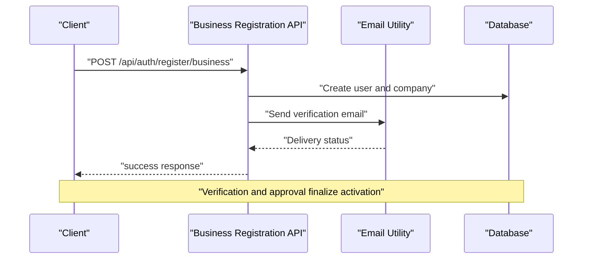
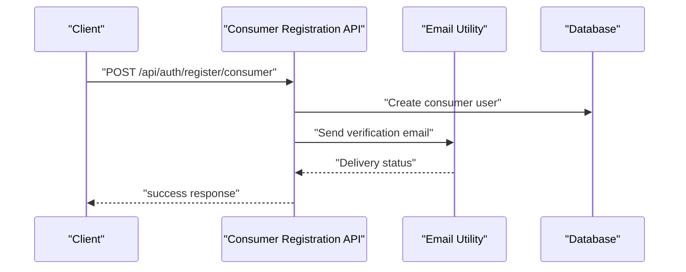
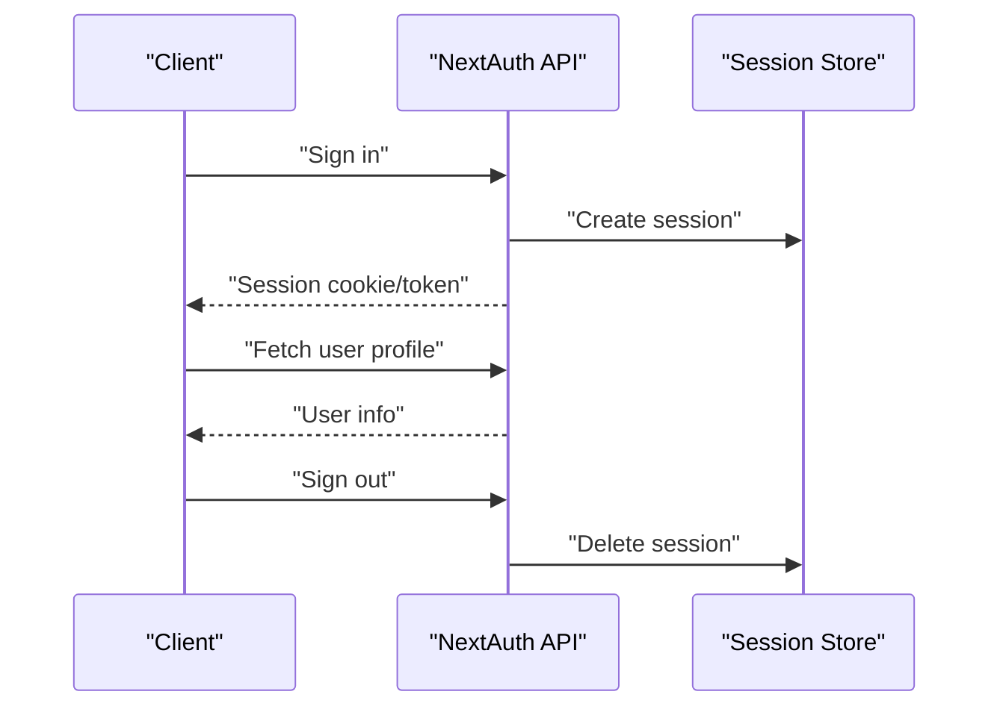
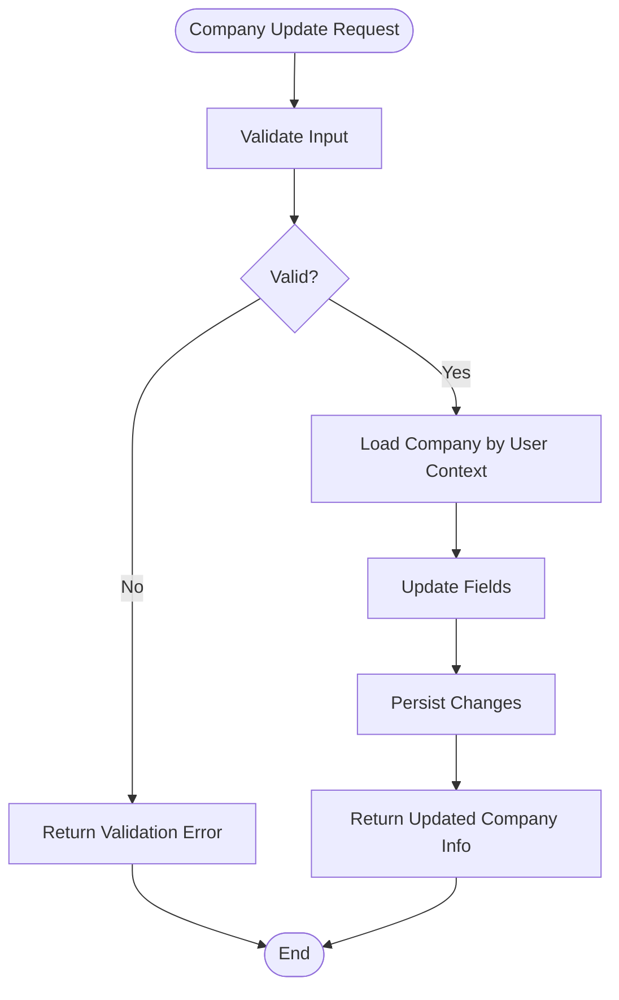
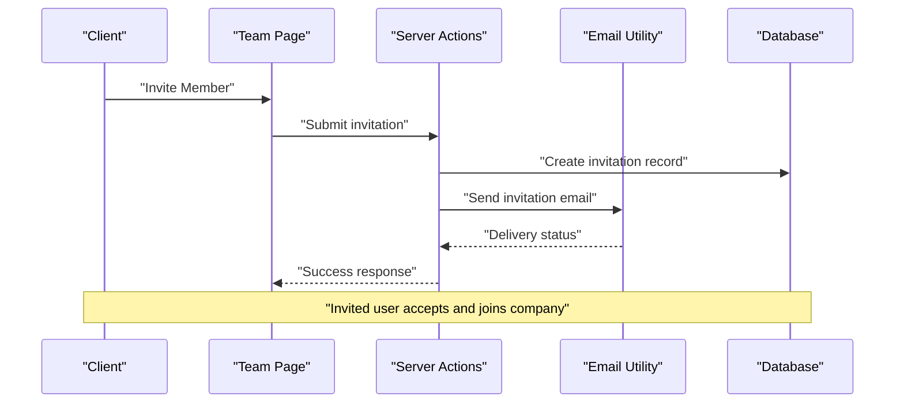
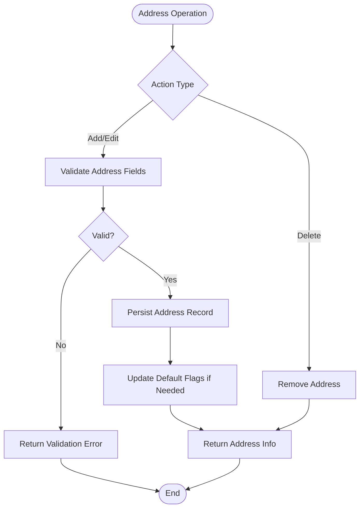
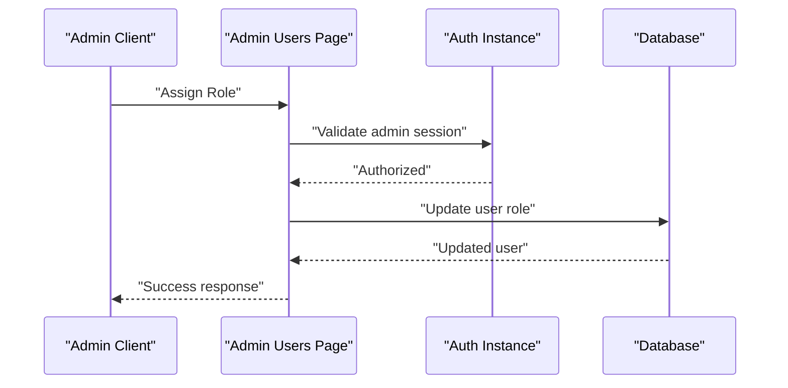
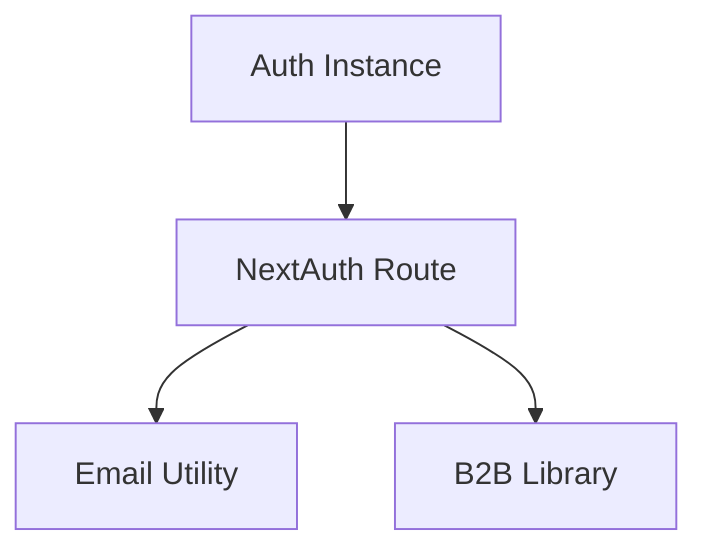

# User Account APIs

<cite>
**Referenced Files in This Document**
- [business.route.ts](file://apps/customer/src/app/api/auth/register/business/route.ts)
- [consumer.route.ts](file://apps/customer/src/app/api/auth/register/consumer/route.ts)
- [auth.route.ts](file://apps/customer/src/app/api/auth/[...nextauth]/route.ts)
- [admin-auth.route.ts](file://apps/admin/src/app/api/auth/[...nextauth]/route.ts)
- [company.page.tsx](file://apps/customer/src/app/b2b/company/page.tsx)
- [team.page.tsx](file://apps/customer/src/app/b2b/team/page.tsx)
- [team.actions.ts](file://apps/customer/src/app/b2b/team/actions.ts)
- [addresses.page.tsx](file://apps/customer/src/app/b2b/addresses/page.tsx)
- [addresses.actions.ts](file://apps/customer/src/app/b2b/addresses/actions.ts)
- [users.page.tsx](file://apps/admin/src/app/users/page.tsx)
- [b2b.ts](file://apps/customer/src/lib/b2b.ts)
- [email.ts](file://apps/customer/src/lib/email.ts)
- [auth-instance.ts](file://apps/customer/src/lib/auth-instance.ts)
- [auth-instance.ts](file://apps/admin/src/lib/auth-instance.ts)
</cite>

## Table of Contents
1. [Introduction](#introduction)
2. [Project Structure](#project-structure)
3. [Core Components](#core-components)
4. [Architecture Overview](#architecture-overview)
5. [Detailed Component Analysis](#detailed-component-analysis)
6. [Dependency Analysis](#dependency-analysis)
7. [Performance Considerations](#performance-considerations)
8. [Troubleshooting Guide](#troubleshooting-guide)
9. [Conclusion](#conclusion)
10. [Appendices](#appendices)

## Introduction
This document provides comprehensive API documentation for user account and registration endpoints across the customer and admin portals. It covers:
- Business registration and consumer registration endpoints
- Company management and team/user management for B2B
- Address book operations
- Authentication via NextAuth
- Administrative user oversight

The documentation specifies endpoint paths, request/response schemas, verification and activation workflows, and illustrates end-to-end onboarding flows for businesses and teams.

## Project Structure
Key API routes and pages relevant to user accounts and B2B operations are organized under the customer and admin applications. The customer portal exposes registration, authentication, B2B company/team management, and address book pages. The admin portal provides oversight pages for users.

**Diagram sources**
- [business.route.ts:1-200](file://apps/customer/src/app/api/auth/register/business/route.ts#L1-L200)
- [consumer.route.ts:1-200](file://apps/customer/src/app/api/auth/register/consumer/route.ts#L1-L200)
- [auth.route.ts:1-200](file://apps/customer/src/app/api/auth/[...nextauth]/route.ts#L1-L200)
- [admin-auth.route.ts:1-200](file://apps/admin/src/app/api/auth/[...nextauth]/route.ts#L1-L200)
- [company.page.tsx:1-200](file://apps/customer/src/app/b2b/company/page.tsx#L1-L200)
- [team.page.tsx:1-200](file://apps/customer/src/app/b2b/team/page.tsx#L1-L200)
- [addresses.page.tsx:1-200](file://apps/customer/src/app/b2b/addresses/page.tsx#L1-L200)
- [users.page.tsx:1-200](file://apps/admin/src/app/users/page.tsx#L1-L200)

**Section sources**
- [business.route.ts:1-200](file://apps/customer/src/app/api/auth/register/business/route.ts#L1-L200)
- [consumer.route.ts:1-200](file://apps/customer/src/app/api/auth/register/consumer/route.ts#L1-L200)
- [auth.route.ts:1-200](file://apps/customer/src/app/api/auth/[...nextauth]/route.ts#L1-L200)
- [admin-auth.route.ts:1-200](file://apps/admin/src/app/api/auth/[...nextauth]/route.ts#L1-L200)
- [company.page.tsx:1-200](file://apps/customer/src/app/b2b/company/page.tsx#L1-L200)
- [team.page.tsx:1-200](file://apps/customer/src/app/b2b/team/page.tsx#L1-L200)
- [addresses.page.tsx:1-200](file://apps/customer/src/app/b2b/addresses/page.tsx#L1-L200)
- [users.page.tsx:1-200](file://apps/admin/src/app/users/page.tsx#L1-L200)

## Core Components
- Business Registration API: Creates a business account and associated user profile, triggers verification, and initializes company structure.
- Consumer Registration API: Creates a consumer account and profile.
- Authentication APIs: NextAuth integration for login, logout, callbacks, and session management.
- Company Management: Retrieve/update company information and manage hierarchical relationships.
- Team/User Management: Invite and manage team members within a company.
- Address Book: CRUD operations for user addresses.
- Admin Users Oversight: View and manage users in the admin portal.

**Section sources**
- [business.route.ts:1-200](file://apps/customer/src/app/api/auth/register/business/route.ts#L1-L200)
- [consumer.route.ts:1-200](file://apps/customer/src/app/api/auth/register/consumer/route.ts#L1-L200)
- [auth.route.ts:1-200](file://apps/customer/src/app/api/auth/[...nextauth]/route.ts#L1-L200)
- [admin-auth.route.ts:1-200](file://apps/admin/src/app/api/auth/[...nextauth]/route.ts#L1-L200)
- [company.page.tsx:1-200](file://apps/customer/src/app/b2b/company/page.tsx#L1-L200)
- [team.page.tsx:1-200](file://apps/customer/src/app/b2b/team/page.tsx#L1-L200)
- [addresses.page.tsx:1-200](file://apps/customer/src/app/b2b/addresses/page.tsx#L1-L200)
- [users.page.tsx:1-200](file://apps/admin/src/app/users/page.tsx#L1-L200)

## Architecture Overview
The customer portal exposes REST-like API routes under /api for authentication and registration, while B2B features are implemented as Next.js app router pages with server actions. The admin portal mirrors similar patterns for oversight.

**Diagram sources**
- [auth.route.ts:1-200](file://apps/customer/src/app/api/auth/[...nextauth]/route.ts#L1-L200)
- [admin-auth.route.ts:1-200](file://apps/admin/src/app/api/auth/[...nextauth]/route.ts#L1-L200)
- [business.route.ts:1-200](file://apps/customer/src/app/api/auth/register/business/route.ts#L1-L200)
- [consumer.route.ts:1-200](file://apps/customer/src/app/api/auth/register/consumer/route.ts#L1-L200)
- [company.page.tsx:1-200](file://apps/customer/src/app/b2b/company/page.tsx#L1-L200)
- [team.page.tsx:1-200](file://apps/customer/src/app/b2b/team/page.tsx#L1-L200)
- [addresses.page.tsx:1-200](file://apps/customer/src/app/b2b/addresses/page.tsx#L1-L200)
- [users.page.tsx:1-200](file://apps/admin/src/app/users/page.tsx#L1-L200)

## Detailed Component Analysis

### Business Registration API
- Endpoint: POST /api/auth/register/business
- Purpose: Register a business account and create a primary user profile linked to a new company entity.
- Request Schema:
  - email: string (required)
  - password: string (required)
  - firstName: string (required)
  - lastName: string (required)
  - businessName: string (required)
  - businessType: string (optional)
  - phone: string (optional)
  - address: AddressInput (optional)
- Response Schema:
  - success: boolean
  - user: UserInfo
  - company: CompanyInfo
  - message: string (optional)
- Verification Workflow:
  - On successful creation, a verification email is sent via the email utility.
  - After verification, the account is activated and the user gains access to B2B features.
- Activation Workflow:
  - Admin or system may approve the business upon submission.
  - Approved businesses gain full B2B capabilities.

**Diagram sources**
- [business.route.ts:1-200](file://apps/customer/src/app/api/auth/register/business/route.ts#L1-L200)
- [email.ts:1-200](file://apps/customer/src/lib/email.ts#L1-L200)

**Section sources**
- [business.route.ts:1-200](file://apps/customer/src/app/api/auth/register/business/route.ts#L1-L200)
- [email.ts:1-200](file://apps/customer/src/lib/email.ts#L1-L200)

### Consumer Registration API
- Endpoint: POST /api/auth/register/consumer
- Purpose: Register a consumer account and create a personal profile.
- Request Schema:
  - email: string (required)
  - password: string (required)
  - firstName: string (required)
  - lastName: string (required)
  - phone: string (optional)
- Response Schema:
  - success: boolean
  - user: UserInfo
  - message: string (optional)
- Verification Workflow:
  - Similar to business registration, a verification email is sent.
  - Verified consumers can access consumer features.

**Diagram sources**
- [consumer.route.ts:1-200](file://apps/customer/src/app/api/auth/register/consumer/route.ts#L1-L200)
- [email.ts:1-200](file://apps/customer/src/lib/email.ts#L1-L200)

**Section sources**
- [consumer.route.ts:1-200](file://apps/customer/src/app/api/auth/register/consumer/route.ts#L1-L200)
- [email.ts:1-200](file://apps/customer/src/lib/email.ts#L1-L200)

### Authentication APIs
- Customer Authentication:
  - Endpoint: GET/POST /api/auth/[...nextauth]
  - Handles login, logout, callbacks, session retrieval, and user profile updates.
- Admin Authentication:
  - Endpoint: GET/POST /api/auth/[...nextauth]
  - Mirrors customer authentication for admin sessions.

**Diagram sources**
- [auth.route.ts:1-200](file://apps/customer/src/app/api/auth/[...nextauth]/route.ts#L1-L200)
- [admin-auth.route.ts:1-200](file://apps/admin/src/app/api/auth/[...nextauth]/route.ts#L1-L200)

**Section sources**
- [auth.route.ts:1-200](file://apps/customer/src/app/api/auth/[...nextauth]/route.ts#L1-L200)
- [admin-auth.route.ts:1-200](file://apps/admin/src/app/api/auth/[...nextauth]/route.ts#L1-L200)

### Company Management API
- Endpoint: GET/POST /b2b/company
- Purpose: Retrieve and update company information for the authenticated user’s company.
- Request Schema (POST):
  - companyName: string (optional)
  - businessType: string (optional)
  - taxId: string (optional)
  - billingAddress: AddressInput (optional)
  - shippingAddress: AddressInput (optional)
  - contacts: ContactInput[] (optional)
- Response Schema:
  - success: boolean
  - company: CompanyInfo
  - message: string (optional)
- Notes:
  - Multi-user company hierarchy is supported; company ownership and permissions are enforced by backend logic.

**Diagram sources**
- [company.page.tsx:1-200](file://apps/customer/src/app/b2b/company/page.tsx#L1-L200)

**Section sources**
- [company.page.tsx:1-200](file://apps/customer/src/app/b2b/company/page.tsx#L1-L200)

### Team/User Management API
- Endpoint: GET/POST /b2b/team
- Purpose: List and invite team members; manage roles within the company.
- Request Schema (POST Invite):
  - email: string (required)
  - role: string (required)
  - firstName: string (optional)
  - lastName: string (optional)
- Response Schema:
  - success: boolean
  - teamMember: TeamMemberInfo
  - message: string (optional)
- Invitation Workflow:
  - An invitation email is sent to the invited user.
  - Upon acceptance, the user joins the company with the assigned role.

**Diagram sources**
- [team.page.tsx:1-200](file://apps/customer/src/app/b2b/team/page.tsx#L1-L200)
- [team.actions.ts:1-200](file://apps/customer/src/app/b2b/team/actions.ts#L1-L200)
- [email.ts:1-200](file://apps/customer/src/lib/email.ts#L1-L200)

**Section sources**
- [team.page.tsx:1-200](file://apps/customer/src/app/b2b/team/page.tsx#L1-L200)
- [team.actions.ts:1-200](file://apps/customer/src/app/b2b/team/actions.ts#L1-L200)
- [email.ts:1-200](file://apps/customer/src/lib/email.ts#L1-L200)

### Address Book Operations API
- Endpoint: GET/POST /b2b/addresses
- Purpose: Manage user addresses for billing/shipping.
- Request Schema (POST Add/Edit):
  - label: string (required)
  - street: string (required)
  - city: string (required)
  - state: string (required)
  - postalCode: string (required)
  - country: string (required)
  - isDefaultBilling: boolean (optional)
  - isDefaultShipping: boolean (optional)
- Response Schema:
  - success: boolean
  - address: AddressInfo
  - message: string (optional)
- Notes:
  - Default flags ensure single primary addresses per type.

**Diagram sources**
- [addresses.page.tsx:1-200](file://apps/customer/src/app/b2b/addresses/page.tsx#L1-L200)
- [addresses.actions.ts:1-200](file://apps/customer/src/app/b2b/addresses/actions.ts#L1-L200)

**Section sources**
- [addresses.page.tsx:1-200](file://apps/customer/src/app/b2b/addresses/page.tsx#L1-L200)
- [addresses.actions.ts:1-200](file://apps/customer/src/app/b2b/addresses/actions.ts#L1-L200)

### Administrative User Oversight API
- Endpoint: GET/POST /admin/users
- Purpose: Admins can view and manage users within the system.
- Request Schema (POST Update Role):
  - userId: string (required)
  - role: string (required)
- Response Schema:
  - success: boolean
  - user: UserInfo
  - message: string (optional)
- Notes:
  - Role assignments are enforced by backend policies.

**Diagram sources**
- [users.page.tsx:1-200](file://apps/admin/src/app/users/page.tsx#L1-L200)
- [auth-instance.ts:1-200](file://apps/admin/src/lib/auth-instance.ts#L1-L200)

**Section sources**
- [users.page.tsx:1-200](file://apps/admin/src/app/users/page.tsx#L1-L200)
- [auth-instance.ts:1-200](file://apps/admin/src/lib/auth-instance.ts#L1-L200)

## Dependency Analysis
- Authentication Dependencies:
  - NextAuth handles session management and integrates with customer/admin auth routes.
- Email Dependencies:
  - Email utility is used for verification and invitation emails.
- B2B Utilities:
  - B2B helper library supports company/team operations.
- Authorization:
  - Auth instances enforce role-based access for admin endpoints.

**Diagram sources**
- [auth.route.ts:1-200](file://apps/customer/src/app/api/auth/[...nextauth]/route.ts#L1-L200)
- [admin-auth.route.ts:1-200](file://apps/admin/src/app/api/auth/[...nextauth]/route.ts#L1-L200)
- [email.ts:1-200](file://apps/customer/src/lib/email.ts#L1-L200)
- [b2b.ts:1-200](file://apps/customer/src/lib/b2b.ts#L1-L200)
- [auth-instance.ts:1-200](file://apps/customer/src/lib/auth-instance.ts#L1-L200)
- [auth-instance.ts:1-200](file://apps/admin/src/lib/auth-instance.ts#L1-L200)

**Section sources**
- [auth.route.ts:1-200](file://apps/customer/src/app/api/auth/[...nextauth]/route.ts#L1-L200)
- [admin-auth.route.ts:1-200](file://apps/admin/src/app/api/auth/[...nextauth]/route.ts#L1-L200)
- [email.ts:1-200](file://apps/customer/src/lib/email.ts#L1-L200)
- [b2b.ts:1-200](file://apps/customer/src/lib/b2b.ts#L1-L200)
- [auth-instance.ts:1-200](file://apps/customer/src/lib/auth-instance.ts#L1-L200)
- [auth-instance.ts:1-200](file://apps/admin/src/lib/auth-instance.ts#L1-L200)

## Performance Considerations
- Minimize redundant database writes during batch operations (e.g., setting defaults).
- Use pagination for listing team members and addresses.
- Cache frequently accessed company data where appropriate.
- Ensure email delivery does not block request completion; queue asynchronous tasks.

## Troubleshooting Guide
- Registration Failures:
  - Verify email uniqueness and password strength.
  - Confirm email service configuration for verification and invitation emails.
- Authentication Issues:
  - Check NextAuth callback URLs and cookie settings.
  - Ensure session storage is reachable and not blocked by CORS.
- Company/Team Operations:
  - Validate input schemas before persisting.
  - Handle concurrency when updating default addresses or roles.
- Admin Access:
  - Confirm admin role checks and session validity.

**Section sources**
- [business.route.ts:1-200](file://apps/customer/src/app/api/auth/register/business/route.ts#L1-L200)
- [consumer.route.ts:1-200](file://apps/customer/src/app/api/auth/register/consumer/route.ts#L1-L200)
- [auth.route.ts:1-200](file://apps/customer/src/app/api/auth/[...nextauth]/route.ts#L1-L200)
- [admin-auth.route.ts:1-200](file://apps/admin/src/app/api/auth/[...nextauth]/route.ts#L1-L200)
- [team.actions.ts:1-200](file://apps/customer/src/app/b2b/team/actions.ts#L1-L200)
- [addresses.actions.ts:1-200](file://apps/customer/src/app/b2b/addresses/actions.ts#L1-L200)
- [auth-instance.ts:1-200](file://apps/admin/src/lib/auth-instance.ts#L1-L200)

## Conclusion
The customer and admin portals expose a cohesive set of APIs for user registration, authentication, B2B company and team management, and address book operations. Verification and activation workflows ensure secure onboarding, while admin oversight enables effective user management. Following the request/response schemas and workflows outlined here will help implement robust integrations.

## Appendices
- Example Onboarding Flows:
  - Business Onboarding:
    1. POST business registration
    2. Receive verification email
    3. Admin approves business
    4. User accesses B2B features
  - Team Collaboration:
    1. Admin invites team members
    2. Invitations are sent and accepted
    3. Roles are assigned and enforced
  - Consumer Onboarding:
    1. POST consumer registration
    2. Verify email
    3. Access consumer features