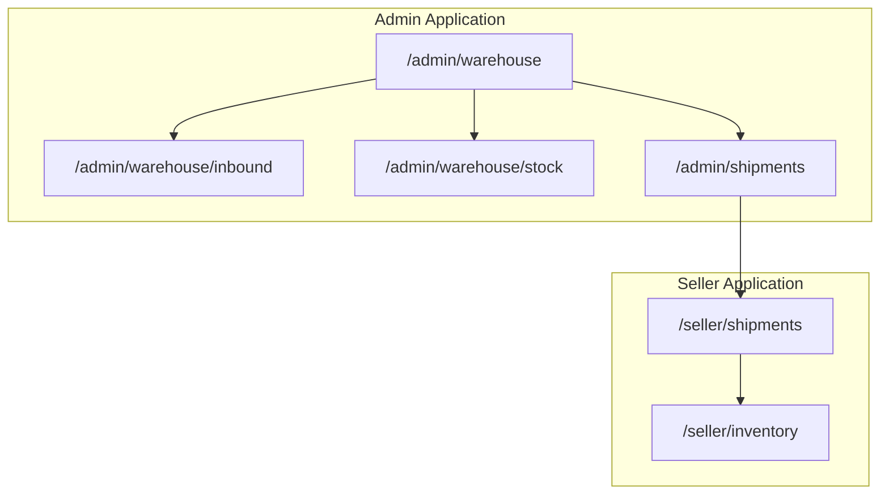
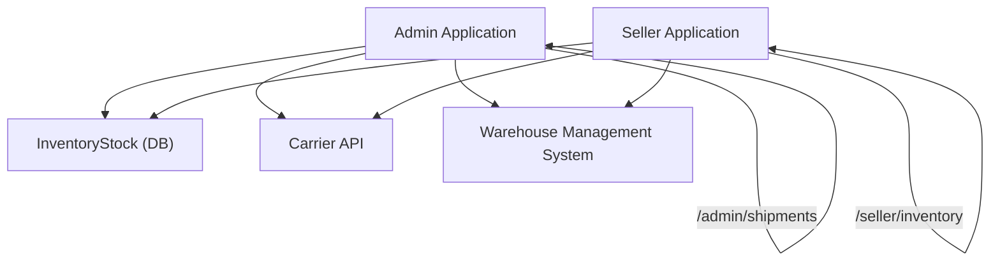
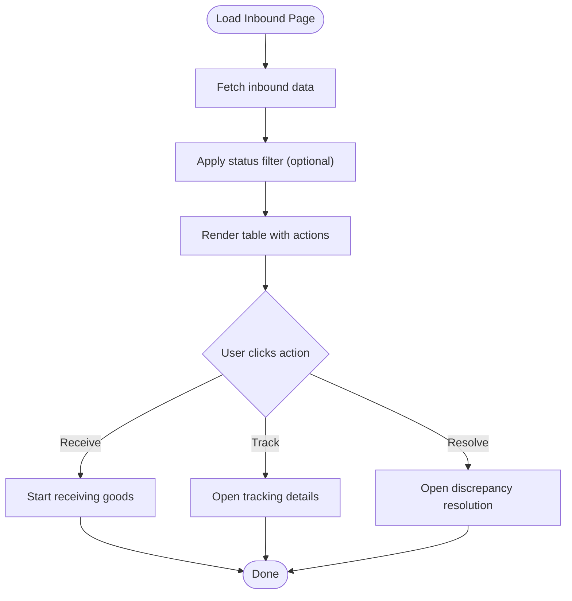
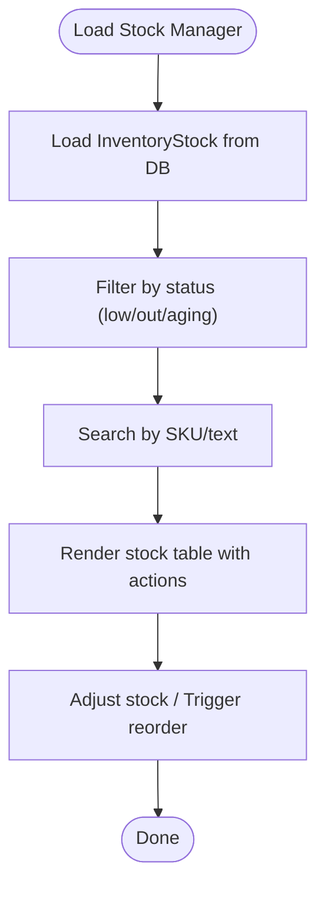
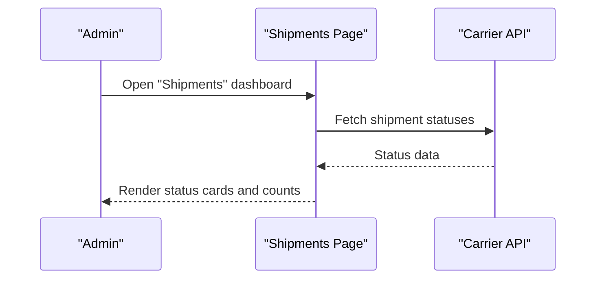
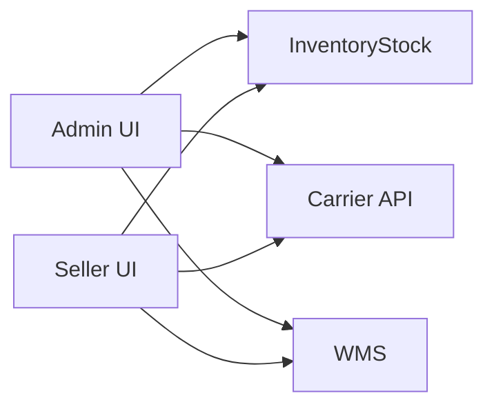

# Warehouse & Logistics APIs

<cite>
**Referenced Files in This Document**
- [MODULE_05_WAREHOUSE_3PL_NOTES.md](file://MODULE_05_WAREHOUSE_3PL_NOTES.md)
- [apps/admin/src/app/warehouse/page.tsx](file://apps/admin/src/app/warehouse/page.tsx)
- [apps/admin/src/app/warehouse/inbound/page.tsx](file://apps/admin/src/app/warehouse/inbound/page.tsx)
- [apps/admin/src/app/warehouse/stock/page.tsx](file://apps/admin/src/app/warehouse/stock/page.tsx)
- [apps/admin/src/app/shipments/page.tsx](file://apps/admin/src/app/shipments/page.tsx)
- [apps/seller/src/app/shipments/page.tsx](file://apps/seller/src/app/shipments/page.tsx)
- [apps/seller/src/app/inventory/page.tsx](file://apps/seller/src/app/inventory/page.tsx)
</cite>

## Table of Contents
1. [Introduction](#introduction)
2. [Project Structure](#project-structure)
3. [Core Components](#core-components)
4. [Architecture Overview](#architecture-overview)
5. [Detailed Component Analysis](#detailed-component-analysis)
6. [Dependency Analysis](#dependency-analysis)
7. [Performance Considerations](#performance-considerations)
8. [Troubleshooting Guide](#troubleshooting-guide)
9. [Conclusion](#conclusion)
10. [Appendices](#appendices)

## Introduction
This document provides detailed API documentation for warehouse and logistics endpoints across the admin and seller applications. It focuses on:
- Shipment management for marketplace oversight
- Inventory tracking for sellers
- Inbound logistics for warehouse operations
- Stock management for warehouse reconciliation

It also outlines request/response patterns, integration touchpoints, and end-to-end fulfillment workflows inferred from the existing UI pages and module notes.

## Project Structure
The warehouse and logistics features are primarily implemented as Next.js app router pages under the admin and seller applications. The module notes describe the intended routes and capabilities.

**Diagram sources**
- [MODULE_05_WAREHOUSE_3PL_NOTES.md](file://MODULE_05_WAREHOUSE_3PL_NOTES.md)
- [apps/admin/src/app/warehouse/page.tsx](file://apps/admin/src/app/warehouse/page.tsx)
- [apps/admin/src/app/warehouse/inbound/page.tsx](file://apps/admin/src/app/warehouse/inbound/page.tsx)
- [apps/admin/src/app/warehouse/stock/page.tsx](file://apps/admin/src/app/warehouse/stock/page.tsx)
- [apps/admin/src/app/shipments/page.tsx](file://apps/admin/src/app/shipments/page.tsx)
- [apps/seller/src/app/shipments/page.tsx](file://apps/seller/src/app/shipments/page.tsx)
- [apps/seller/src/app/inventory/page.tsx](file://apps/seller/src/app/inventory/page.tsx)

**Section sources**
- [MODULE_05_WAREHOUSE_3PL_NOTES.md](file://MODULE_05_WAREHOUSE_3PL_NOTES.md)
- [apps/admin/src/app/warehouse/page.tsx](file://apps/admin/src/app/warehouse/page.tsx)
- [apps/admin/src/app/warehouse/inbound/page.tsx](file://apps/admin/src/app/warehouse/inbound/page.tsx)
- [apps/admin/src/app/warehouse/stock/page.tsx](file://apps/admin/src/app/warehouse/stock/page.tsx)
- [apps/admin/src/app/shipments/page.tsx](file://apps/admin/src/app/shipments/page.tsx)
- [apps/seller/src/app/shipments/page.tsx](file://apps/seller/src/app/shipments/page.tsx)
- [apps/seller/src/app/inventory/page.tsx](file://apps/seller/src/app/inventory/page.tsx)

## Core Components
- Admin Warehouse Overview: Provides quick stats and navigation to inbound, stock, and pick-pack dispatch workflows.
- Inbound Goods Tracking: UI for tracking incoming shipments, receiving goods, and handling discrepancies.
- Stock Manager: UI for viewing and adjusting inventory stock levels with filtering and search.
- Marketplace Shipments Dashboard: Admin-level overview of outbound shipment statuses.
- Seller Shipment Management: Seller-facing shipment tracking and management.
- Seller Inventory Tracking: Seller-facing inventory monitoring.

**Section sources**
- [apps/admin/src/app/warehouse/page.tsx](file://apps/admin/src/app/warehouse/page.tsx)
- [apps/admin/src/app/warehouse/inbound/page.tsx](file://apps/admin/src/app/warehouse/inbound/page.tsx)
- [apps/admin/src/app/warehouse/stock/page.tsx](file://apps/admin/src/app/warehouse/stock/page.tsx)
- [apps/admin/src/app/shipments/page.tsx](file://apps/admin/src/app/shipments/page.tsx)
- [apps/seller/src/app/shipments/page.tsx](file://apps/seller/src/app/shipments/page.tsx)
- [apps/seller/src/app/inventory/page.tsx](file://apps/seller/src/app/inventory/page.tsx)

## Architecture Overview
The warehouse and logistics domain is structured around:
- Admin dashboards for oversight and reconciliation
- Seller dashboards for operational execution
- Shared UI patterns for shipment tracking and inventory management

**Diagram sources**
- [MODULE_05_WAREHOUSE_3PL_NOTES.md](file://MODULE_05_WAREHOUSE_3PL_NOTES.md)
- [apps/admin/src/app/warehouse/page.tsx](file://apps/admin/src/app/warehouse/page.tsx)
- [apps/admin/src/app/warehouse/inbound/page.tsx](file://apps/admin/src/app/warehouse/inbound/page.tsx)
- [apps/admin/src/app/warehouse/stock/page.tsx](file://apps/admin/src/app/warehouse/stock/page.tsx)
- [apps/admin/src/app/shipments/page.tsx](file://apps/admin/src/app/shipments/page.tsx)
- [apps/seller/src/app/shipments/page.tsx](file://apps/seller/src/app/shipments/page.tsx)
- [apps/seller/src/app/inventory/page.tsx](file://apps/seller/src/app/inventory/page.tsx)

## Detailed Component Analysis

### Admin: Warehouse Overview
- Purpose: Central hub for warehouse KPIs and navigation to inbound, stock, and pick-pack dispatch.
- Key UI elements: Quick stats cards, segment-based utilization bars, stock by category charts, aging inventory table, and quick navigation grid.
- Filters and actions: Links to inbound and stock filters; dispatch queue navigation.

**Section sources**
- [apps/admin/src/app/warehouse/page.tsx](file://apps/admin/src/app/warehouse/page.tsx)
- [MODULE_05_WAREHOUSE_3PL_NOTES.md](file://MODULE_05_WAREHOUSE_3PL_NOTES.md)

### Admin: Inbound Goods
- Purpose: Track incoming shipments, manage receiving, and handle discrepancies.
- UI highlights: Status tabs with badges, summary stats (in transit, arrived, discrepancies), and action buttons per row (Receive, Track, Resolve).
- Data model (from UI): Inbound records include status, expected value, and supplier POs.

**Diagram sources**
- [apps/admin/src/app/warehouse/inbound/page.tsx](file://apps/admin/src/app/warehouse/inbound/page.tsx)

**Section sources**
- [apps/admin/src/app/warehouse/inbound/page.tsx](file://apps/admin/src/app/warehouse/inbound/page.tsx)
- [MODULE_05_WAREHOUSE_3PL_NOTES.md](file://MODULE_05_WAREHOUSE_3PL_NOTES.md)

### Admin: Stock Manager
- Purpose: View and manage stock levels with filtering and search.
- UI highlights: Filters for All/Low Stock/Out of Stock/Aging; Available column color-coded; Reorder actions for low/out-of-stock items.
- Data source: Connected to InventoryStock via database queries.

**Diagram sources**
- [apps/admin/src/app/warehouse/stock/page.tsx](file://apps/admin/src/app/warehouse/stock/page.tsx)

**Section sources**
- [apps/admin/src/app/warehouse/stock/page.tsx](file://apps/admin/src/app/warehouse/stock/page.tsx)
- [MODULE_05_WAREHOUSE_3PL_NOTES.md](file://MODULE_05_WAREHOUSE_3PL_NOTES.md)

### Admin: Marketplace Shipments
- Purpose: Admin-level oversight of outbound shipments across the marketplace.
- UI highlights: Status badges (Pending Pickup, In Transit, Delivered, Exception); summary counts; quick link to dispatch queue.

**Diagram sources**
- [apps/admin/src/app/shipments/page.tsx](file://apps/admin/src/app/shipments/page.tsx)

**Section sources**
- [apps/admin/src/app/shipments/page.tsx](file://apps/admin/src/app/shipments/page.tsx)

### Seller: Shipments
- Purpose: Seller-facing shipment tracking and management aligned with marketplace dispatch.
- UI highlights: Likely mirrors marketplace shipment statuses and actions for seller operations.

**Section sources**
- [apps/seller/src/app/shipments/page.tsx](file://apps/seller/src/app/shipments/page.tsx)

### Seller: Inventory
- Purpose: Seller-facing inventory monitoring and tracking.
- UI highlights: Likely includes stock visibility and allocation indicators.

**Section sources**
- [apps/seller/src/app/inventory/page.tsx](file://apps/seller/src/app/inventory/page.tsx)

## Dependency Analysis
- Admin dashboards depend on:
  - UI components for charts and tables
  - Database connectivity for stock data
  - Carrier APIs for shipment tracking
  - Warehouse Management Systems for receiving and dispatch
- Seller dashboards mirror admin views but focus on seller-specific operations.

**Diagram sources**
- [apps/admin/src/app/warehouse/page.tsx](file://apps/admin/src/app/warehouse/page.tsx)
- [apps/admin/src/app/warehouse/inbound/page.tsx](file://apps/admin/src/app/warehouse/inbound/page.tsx)
- [apps/admin/src/app/warehouse/stock/page.tsx](file://apps/admin/src/app/warehouse/stock/page.tsx)
- [apps/admin/src/app/shipments/page.tsx](file://apps/admin/src/app/shipments/page.tsx)
- [apps/seller/src/app/shipments/page.tsx](file://apps/seller/src/app/shipments/page.tsx)
- [apps/seller/src/app/inventory/page.tsx](file://apps/seller/src/app/inventory/page.tsx)

**Section sources**
- [MODULE_05_WAREHOUSE_3PL_NOTES.md](file://MODULE_05_WAREHOUSE_3PL_NOTES.md)

## Performance Considerations
- Use efficient filtering and search on the client side for inbound and stock tables.
- Batch requests to carrier APIs to minimize latency.
- Cache frequently accessed shipment statuses and stock summaries.
- Optimize database queries for stock reconciliation and aging inventory reports.

## Troubleshooting Guide
- Authentication redirects: All warehouse routes require admin session and return 307 redirects if unauthenticated.
- Inbound discrepancies: Verify status filtering and action buttons for "Receive," "Track," and "Resolve."
- Stock filters: Confirm low/out/aging filters render correct subsets of InventoryStock.
- Dispatch queue: Use the quick link from the shipments dashboard to navigate to pick-pack dispatch.

**Section sources**
- [MODULE_05_WAREHOUSE_3PL_NOTES.md](file://MODULE_05_WAREHOUSE_3PL_NOTES.md)
- [apps/admin/src/app/warehouse/inbound/page.tsx](file://apps/admin/src/app/warehouse/inbound/page.tsx)
- [apps/admin/src/app/warehouse/stock/page.tsx](file://apps/admin/src/app/warehouse/stock/page.tsx)
- [apps/admin/src/app/shipments/page.tsx](file://apps/admin/src/app/shipments/page.tsx)

## Conclusion
The warehouse and logistics domain integrates admin oversight with seller operations through shared UI patterns and data sources. The module notes and UI pages define the intended scope for inbound tracking, stock management, and shipment monitoring. Extending these pages into API endpoints would involve implementing backend routes for shipment creation, delivery confirmation, inventory adjustments, and stock transfers, while integrating with carrier APIs and warehouse systems.

## Appendices

### Endpoints and Workflows

- Shipment Management
  - Marketplace overview: Admin-level shipment status dashboard.
  - Seller operations: Shipment tracking aligned with dispatch queue.
  - Workflow: Create shipment -> carrier pickup -> in-transit -> delivery confirmation -> update stock.

- Inventory Tracking
  - Seller inventory monitoring: Stock visibility and allocation indicators.
  - Workflow: Monitor stock -> trigger reorder when low/out -> update stock after adjustment.

- Inbound Logistics
  - Inbound tracking: Supplier POs, carrier/tracking, arrival alerts, discrepancy handling.
  - Workflow: Receive inbound -> reconcile quantities -> update stock -> resolve discrepancies.

- Stock Management
  - Stock manager: Filters (low/out/aging), search, adjust/reorder actions.
  - Workflow: Reconcile stock -> adjust quantities -> trigger reorder -> update stock.

**Section sources**
- [apps/admin/src/app/shipments/page.tsx](file://apps/admin/src/app/shipments/page.tsx)
- [apps/seller/src/app/shipments/page.tsx](file://apps/seller/src/app/shipments/page.tsx)
- [apps/seller/src/app/inventory/page.tsx](file://apps/seller/src/app/inventory/page.tsx)
- [apps/admin/src/app/warehouse/inbound/page.tsx](file://apps/admin/src/app/warehouse/inbound/page.tsx)
- [apps/admin/src/app/warehouse/stock/page.tsx](file://apps/admin/src/app/warehouse/stock/page.tsx)