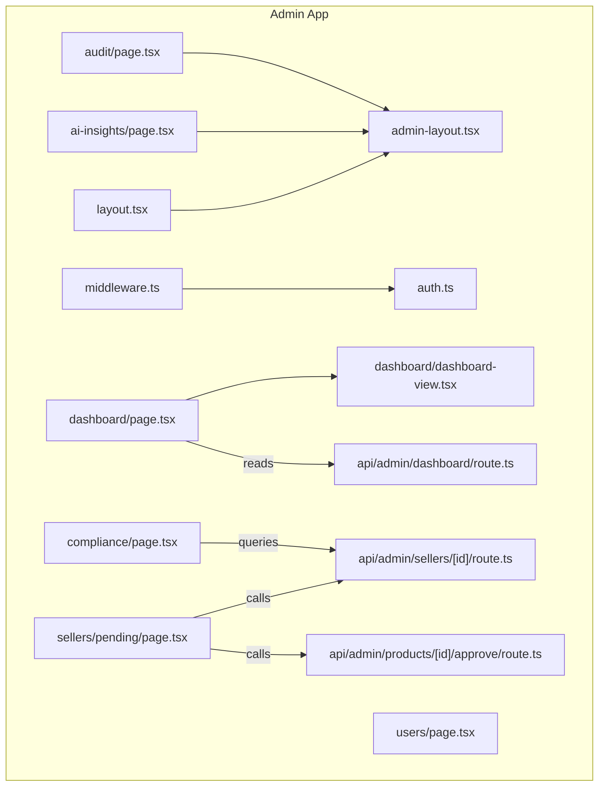
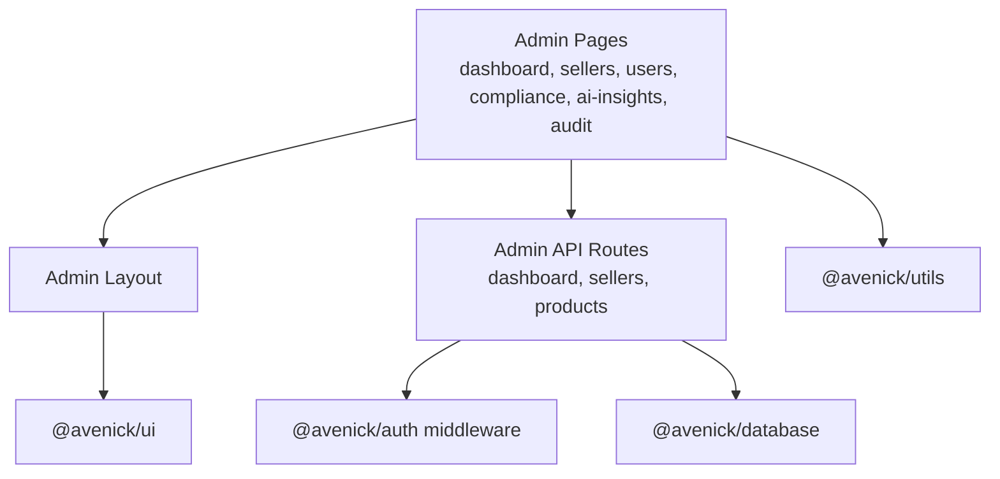
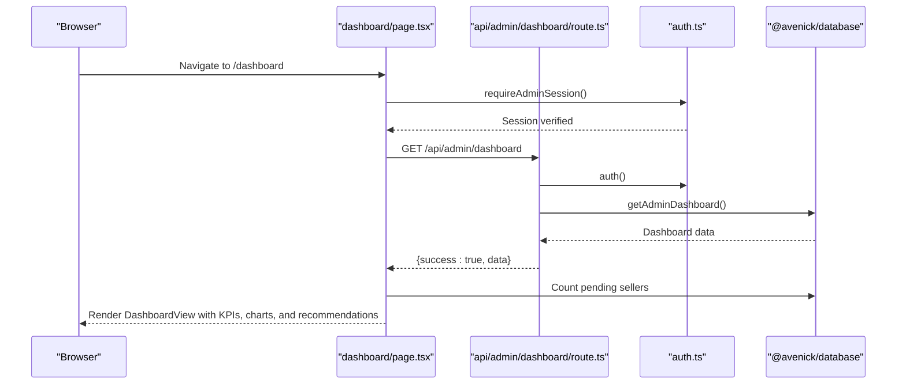
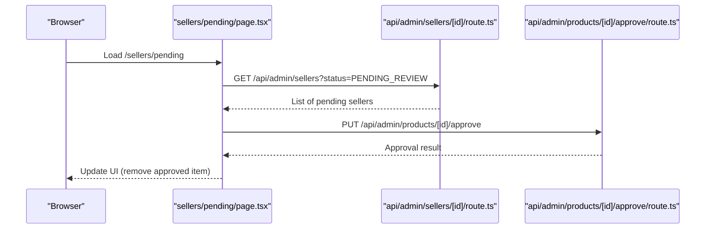
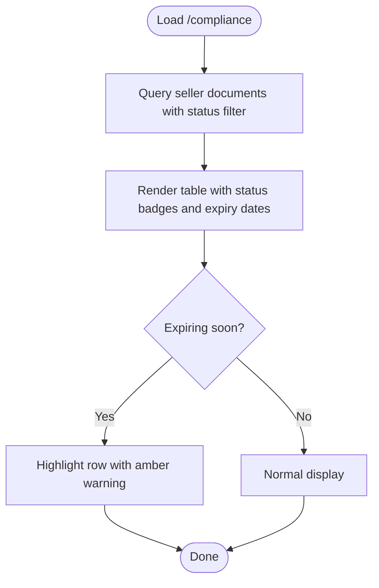
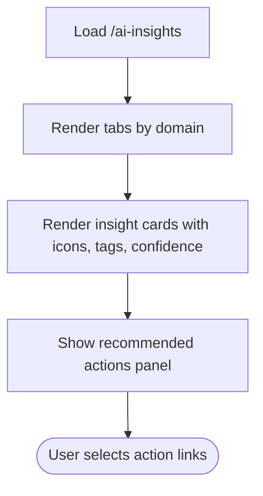
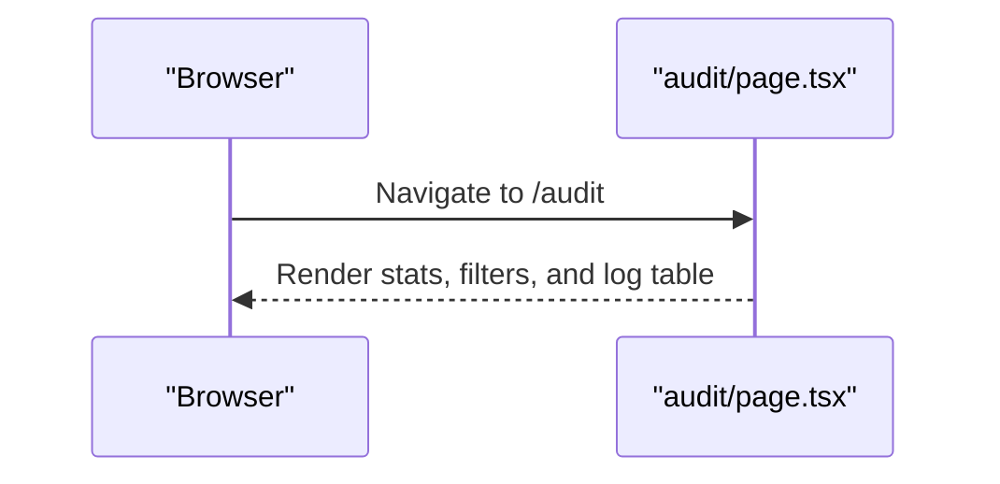
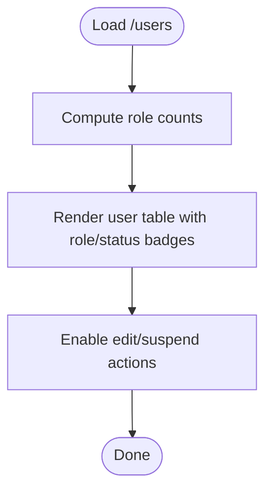
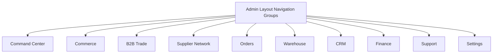
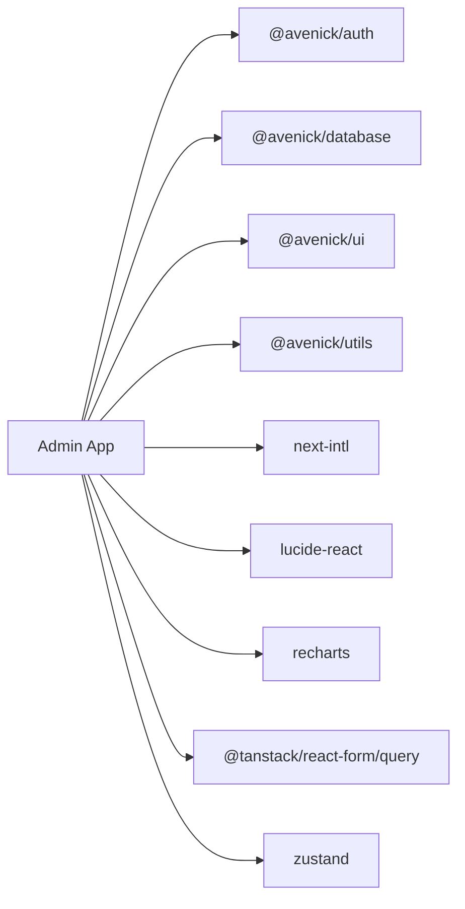

# Admin Portal

<cite>
**Referenced Files in This Document**
- [layout.tsx](file://apps/admin/src/app/layout.tsx)
- [package.json](file://apps/admin/package.json)
- [middleware.ts](file://apps/admin/src/middleware.ts)
- [auth.ts](file://apps/admin/src/lib/auth.ts)
- [admin-layout.tsx](file://apps/admin/src/components/layout/admin-layout.tsx)
- [dashboard/page.tsx](file://apps/admin/src/app/dashboard/page.tsx)
- [dashboard/dashboard-view.tsx](file://apps/admin/src/app/dashboard/dashboard-view.tsx)
- [sellers/pending/page.tsx](file://apps/admin/src/app/sellers/pending/page.tsx)
- [users/page.tsx](file://apps/admin/src/app/users/page.tsx)
- [compliance/page.tsx](file://apps/admin/src/app/compliance/page.tsx)
- [api/admin/dashboard/route.ts](file://apps/admin/src/app/api/admin/dashboard/route.ts)
- [api/admin/sellers/[id]/route.ts](file://apps/admin/src/app/api/admin/sellers/[id]/route.ts)
- [api/admin/products/[id]/approve/route.ts](file://apps/admin/src/app/api/admin/products/[id]/approve/route.ts)
- [ai-insights/page.tsx](file://apps/admin/src/app/ai-insights/page.tsx)
- [audit/page.tsx](file://apps/admin/src/app/audit/page.tsx)
</cite>

## Table of Contents
1. [Introduction](#introduction)
2. [Project Structure](#project-structure)
3. [Core Components](#core-components)
4. [Architecture Overview](#architecture-overview)
5. [Detailed Component Analysis](#detailed-component-analysis)
6. [Dependency Analysis](#dependency-analysis)
7. [Performance Considerations](#performance-considerations)
8. [Troubleshooting Guide](#troubleshooting-guide)
9. [Conclusion](#conclusion)
10. [Appendices](#appendices)

## Introduction
The Admin Portal is a comprehensive administrative console for Avenick Commerce, designed to provide oversight across commerce, B2B trade, supplier network, orders, warehouse, CRM, finance, support, and platform settings. It centralizes platform KPIs, pending seller review workflows, AI-powered insights, compliance monitoring, audit trails, and operational controls. Built as a Next.js application, it leverages shared packages for authentication, database access, UI components, and utilities, and integrates with external libraries for internationalization, state management, and data visualization.

## Project Structure
The Admin application follows a modular file-per-page structure under the Next.js App Router. Key areas include:
- Application shell and internationalization
- Middleware and authentication gating
- Centralized navigation layout with grouped sections
- Feature pages for dashboard, sellers, users, compliance, AI insights, audit, and more
- API routes for admin-only backend operations

**Diagram sources**
- [layout.tsx:1-27](file://apps/admin/src/app/layout.tsx#L1-L27)
- [middleware.ts:1-9](file://apps/admin/src/middleware.ts#L1-L9)
- [auth.ts:1-11](file://apps/admin/src/lib/auth.ts#L1-L11)
- [admin-layout.tsx:1-267](file://apps/admin/src/components/layout/admin-layout.tsx#L1-L267)
- [dashboard/page.tsx:1-28](file://apps/admin/src/app/dashboard/page.tsx#L1-L28)
- [dashboard/dashboard-view.tsx:1-383](file://apps/admin/src/app/dashboard/dashboard-view.tsx#L1-L383)
- [sellers/pending/page.tsx:1-132](file://apps/admin/src/app/sellers/pending/page.tsx#L1-L132)
- [users/page.tsx:1-181](file://apps/admin/src/app/users/page.tsx#L1-L181)
- [compliance/page.tsx:1-74](file://apps/admin/src/app/compliance/page.tsx#L1-L74)
- [ai-insights/page.tsx:1-318](file://apps/admin/src/app/ai-insights/page.tsx#L1-L318)
- [audit/page.tsx:1-128](file://apps/admin/src/app/audit/page.tsx#L1-L128)
- [api/admin/dashboard/route.ts:1-16](file://apps/admin/src/app/api/admin/dashboard/route.ts#L1-L16)
- [api/admin/sellers/[id]/route.ts](file://apps/admin/src/app/api/admin/sellers/[id]/route.ts#L1-L25)
- [api/admin/products/[id]/approve/route.ts](file://apps/admin/src/app/api/admin/products/[id]/approve/route.ts#L1-L21)

**Section sources**
- [layout.tsx:1-27](file://apps/admin/src/app/layout.tsx#L1-L27)
- [package.json:1-49](file://apps/admin/package.json#L1-L49)
- [middleware.ts:1-9](file://apps/admin/src/middleware.ts#L1-L9)
- [auth.ts:1-11](file://apps/admin/src/lib/auth.ts#L1-L11)
- [admin-layout.tsx:1-267](file://apps/admin/src/components/layout/admin-layout.tsx#L1-L267)

## Core Components
- Internationalization and theme hydration: The root layout sets metadata and wraps children with an internationalization provider, hydrating theme preferences from local storage.
- Authentication middleware: Enforces admin-only access via a shared auth middleware factory and restricts routes using a path matcher.
- Admin layout: Provides grouped navigation across Command Center, Commerce, B2B Trade, Supplier Network, Orders, Warehouse, CRM, Finance, Support, and Settings, with persistent sidebar state and badges for pending items.
- Dashboard: Renders executive KPIs, alerts, AI recommendations, operational health, and performance charts/bento grids.
- Sellers review: Lists pending applications with approve/reject actions and document previews.
- Users management: Displays user stats, filters, and a table with role/status indicators and actions.
- Compliance monitoring: Shows document statuses, expiry warnings, and links to seller profiles.
- AI Insights: Presents categorized actionable intelligence with confidence indicators and recommended actions.
- Audit Trail: Summarizes events, filters by category, and displays immutable log entries.

**Section sources**
- [layout.tsx:1-27](file://apps/admin/src/app/layout.tsx#L1-L27)
- [middleware.ts:1-9](file://apps/admin/src/middleware.ts#L1-L9)
- [auth.ts:1-11](file://apps/admin/src/lib/auth.ts#L1-L11)
- [admin-layout.tsx:17-107](file://apps/admin/src/components/layout/admin-layout.tsx#L17-L107)
- [dashboard/page.tsx:1-28](file://apps/admin/src/app/dashboard/page.tsx#L1-L28)
- [dashboard/dashboard-view.tsx:91-383](file://apps/admin/src/app/dashboard/dashboard-view.tsx#L91-L383)
- [sellers/pending/page.tsx:16-132](file://apps/admin/src/app/sellers/pending/page.tsx#L16-L132)
- [users/page.tsx:47-181](file://apps/admin/src/app/users/page.tsx#L47-L181)
- [compliance/page.tsx:7-74](file://apps/admin/src/app/compliance/page.tsx#L7-L74)
- [ai-insights/page.tsx:197-318](file://apps/admin/src/app/ai-insights/page.tsx#L197-L318)
- [audit/page.tsx:29-128](file://apps/admin/src/app/audit/page.tsx#L29-L128)

## Architecture Overview
The Admin Portal is a client-server hybrid:
- Client-side pages render UI and call API routes for admin-protected operations.
- API routes enforce role-based access and delegate to shared database utilities.
- Shared packages supply authentication, database queries, UI primitives, and utilities.

**Diagram sources**
- [admin-layout.tsx:1-267](file://apps/admin/src/components/layout/admin-layout.tsx#L1-L267)
- [api/admin/dashboard/route.ts:1-16](file://apps/admin/src/app/api/admin/dashboard/route.ts#L1-L16)
- [api/admin/sellers/[id]/route.ts](file://apps/admin/src/app/api/admin/sellers/[id]/route.ts#L1-L25)
- [api/admin/products/[id]/approve/route.ts](file://apps/admin/src/app/api/admin/products/[id]/approve/route.ts#L1-L21)
- [auth.ts:1-11](file://apps/admin/src/lib/auth.ts#L1-L11)

## Detailed Component Analysis

### Executive Dashboard
The dashboard aggregates platform KPIs, highlights alerts, and surfaces AI recommendations and operational health metrics. It computes derived values (e.g., revenue split percentages) and renders charts and tables for top categories, suppliers, and customers.

**Diagram sources**
- [dashboard/page.tsx:7-27](file://apps/admin/src/app/dashboard/page.tsx#L7-L27)
- [api/admin/dashboard/route.ts:5-15](file://apps/admin/src/app/api/admin/dashboard/route.ts#L5-L15)
- [auth.ts:4-10](file://apps/admin/src/lib/auth.ts#L4-L10)

**Section sources**
- [dashboard/page.tsx:1-28](file://apps/admin/src/app/dashboard/page.tsx#L1-L28)
- [dashboard/dashboard-view.tsx:91-383](file://apps/admin/src/app/dashboard/dashboard-view.tsx#L91-L383)

### Pending Seller Review Workflow
The pending sellers page fetches applications in PENDING_REVIEW, displays owner and contact details, documents with status badges, and supports approve/reject actions. Approve and reject calls are routed through dedicated API endpoints.

**Diagram sources**
- [sellers/pending/page.tsx:22-40](file://apps/admin/src/app/sellers/pending/page.tsx#L22-L40)
- [api/admin/sellers/[id]/route.ts](file://apps/admin/src/app/api/admin/sellers/[id]/route.ts#L5-L24)
- [api/admin/products/[id]/approve/route.ts](file://apps/admin/src/app/api/admin/products/[id]/approve/route.ts#L5-L20)

**Section sources**
- [sellers/pending/page.tsx:1-132](file://apps/admin/src/app/sellers/pending/page.tsx#L1-L132)

### Compliance Monitoring
The compliance page lists seller documents across various statuses, highlights expiring items, and links to seller profiles for review. It counts pending applications to update sidebar badges.

**Diagram sources**
- [compliance/page.tsx:11-65](file://apps/admin/src/app/compliance/page.tsx#L11-L65)

**Section sources**
- [compliance/page.tsx:1-74](file://apps/admin/src/app/compliance/page.tsx#L1-L74)

### AI Insights
The AI Insights page organizes actionable intelligence across Commerce, B2B, Operations, and Risk domains, with confidence indicators and recommended actions. It uses a reusable card component and categorizes events for quick triage.

**Diagram sources**
- [ai-insights/page.tsx:197-318](file://apps/admin/src/app/ai-insights/page.tsx#L197-L318)

**Section sources**
- [ai-insights/page.tsx:1-318](file://apps/admin/src/app/ai-insights/page.tsx#L1-L318)

### Audit Trail
The audit page presents an immutable log of administrative and system events, with filtering by category and search, and export capability. It displays event counts and security flags.

**Diagram sources**
- [audit/page.tsx:29-128](file://apps/admin/src/app/audit/page.tsx#L29-L128)

**Section sources**
- [audit/page.tsx:1-128](file://apps/admin/src/app/audit/page.tsx#L1-L128)

### User Management
The users page showcases role and status distributions, searchable/filterable user listings, and action buttons for editing and suspending users (non-admins).

**Diagram sources**
- [users/page.tsx:47-181](file://apps/admin/src/app/users/page.tsx#L47-L181)

**Section sources**
- [users/page.tsx:1-181](file://apps/admin/src/app/users/page.tsx#L1-L181)

### Conceptual Overview
The Admin Portal’s navigation groups align with operational domains:
- Command Center: Dashboard, AI Insights, Automation
- Commerce: Products, Categories, Brands, Deals, Pricing & Commission
- B2B Trade: Companies, RFQs, Quotes, Approvals
- Supplier Network: All Suppliers, Pending, Documents, Performance
- Orders: All Orders, Shipments, Returns, Dispatch
- Warehouse: Overview, Inbound, Stock, Pick/Pack
- CRM: Accounts, Campaigns, Segments, Retention
- Finance: Invoices, Payments, Settlements, VAT
- Support: Tickets, Disputes, SLA Monitor
- Settings: Users, Integrations, Audit Trail, Settings

**Diagram sources**
- [admin-layout.tsx:17-107](file://apps/admin/src/components/layout/admin-layout.tsx#L17-L107)

[No sources needed since this diagram shows conceptual workflow, not actual code structure]

[No sources needed since this section doesn't analyze specific source files]

## Dependency Analysis
The Admin app depends on shared packages and external libraries:
- @avenick/auth: authentication middleware and session utilities
- @avenick/database: database accessors and mock datasets
- @avenick/ui: UI primitives and components (e.g., AI insight cards)
- @avenick/utils: formatting utilities
- next-intl: internationalization
- lucide-react: icons
- recharts: data visualization
- react-hook-form, zod: forms and validation
- @tanstack/react-query/react-table: data fetching and tables
- zustand: state management

**Diagram sources**
- [package.json:12-34](file://apps/admin/package.json#L12-L34)

**Section sources**
- [package.json:1-49](file://apps/admin/package.json#L1-L49)

## Performance Considerations
- Client-server boundaries: Keep server-rendered dashboard data minimal and serializable; offload heavy computations to API routes.
- Pagination and limits: Apply limits on document and log listings to avoid large payloads.
- Memoization and caching: Use React.memo and React.useMemo for repeated rendering; leverage TanStack Query for efficient caching and refetching.
- Lazy loading: Defer non-critical components and images to reduce initial load.
- Icons and charts: Use lightweight iconography and responsive chart sizes.

[No sources needed since this section provides general guidance]

## Troubleshooting Guide
- Access denied: Ensure the user role is ADMIN or SUPER_ADMIN; middleware redirects unauthenticated or unauthorized users to the login page.
- API errors: Verify API routes return structured responses and handle forbidden and not-found cases.
- Pending items badge: Confirm counts are updated after approve/reject actions and that sidebar reflects real-time values.
- Internationalization: Confirm locale and direction are applied at the root layout level.

**Section sources**
- [auth.ts:4-10](file://apps/admin/src/lib/auth.ts#L4-L10)
- [middleware.ts:4-8](file://apps/admin/src/middleware.ts#L4-L8)
- [api/admin/dashboard/route.ts:9-14](file://apps/admin/src/app/api/admin/dashboard/route.ts#L9-L14)
- [layout.tsx:15-17](file://apps/admin/src/app/layout.tsx#L15-L17)

## Conclusion
The Admin Portal consolidates administrative oversight with a modern UI, robust access controls, and integrated AI insights. Its modular structure and shared packages enable scalable enhancements across commerce, supplier management, compliance, finance, and support, while maintaining a strong focus on operational visibility and auditability.

[No sources needed since this section summarizes without analyzing specific files]

## Appendices

### API Route Reference
- GET /api/admin/dashboard: Returns aggregated dashboard data for admins.
- GET /api/admin/sellers/[id]: Retrieves seller profile with documents and counts.
- PUT /api/admin/products/[id]/approve: Approves a product (admin-only).

**Section sources**
- [api/admin/dashboard/route.ts:1-16](file://apps/admin/src/app/api/admin/dashboard/route.ts#L1-L16)
- [api/admin/sellers/[id]/route.ts](file://apps/admin/src/app/api/admin/sellers/[id]/route.ts#L1-L25)
- [api/admin/products/[id]/approve/route.ts](file://apps/admin/src/app/api/admin/products/[id]/approve/route.ts#L1-L21)