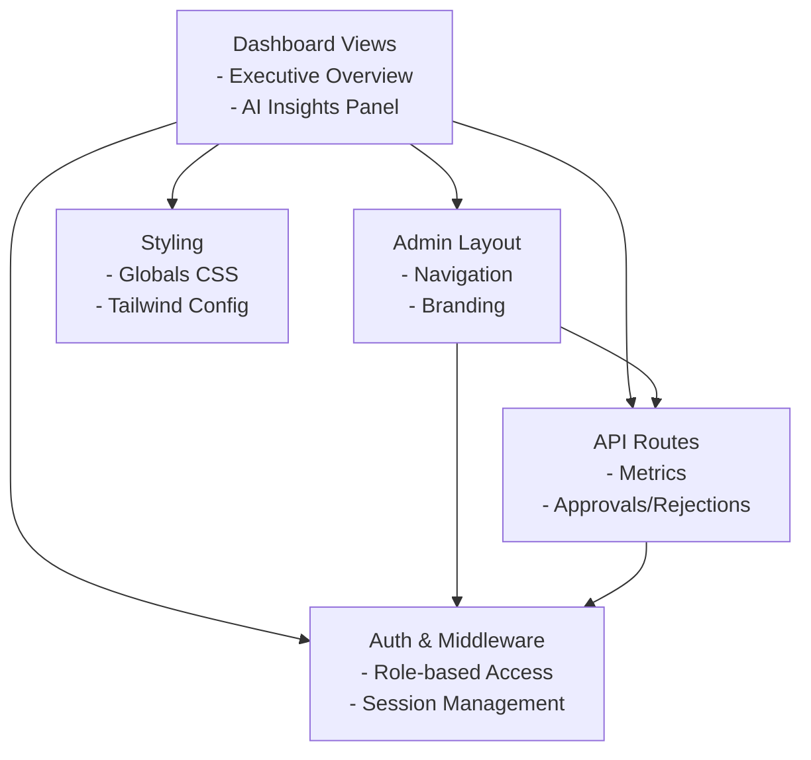
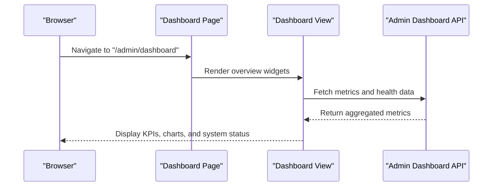
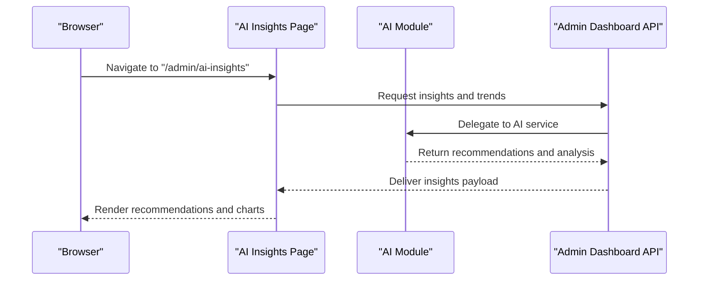
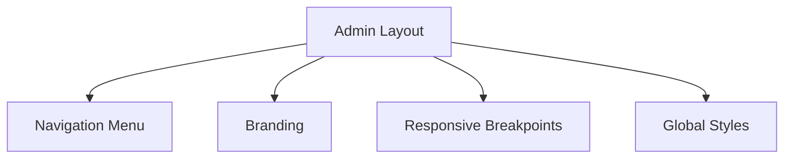
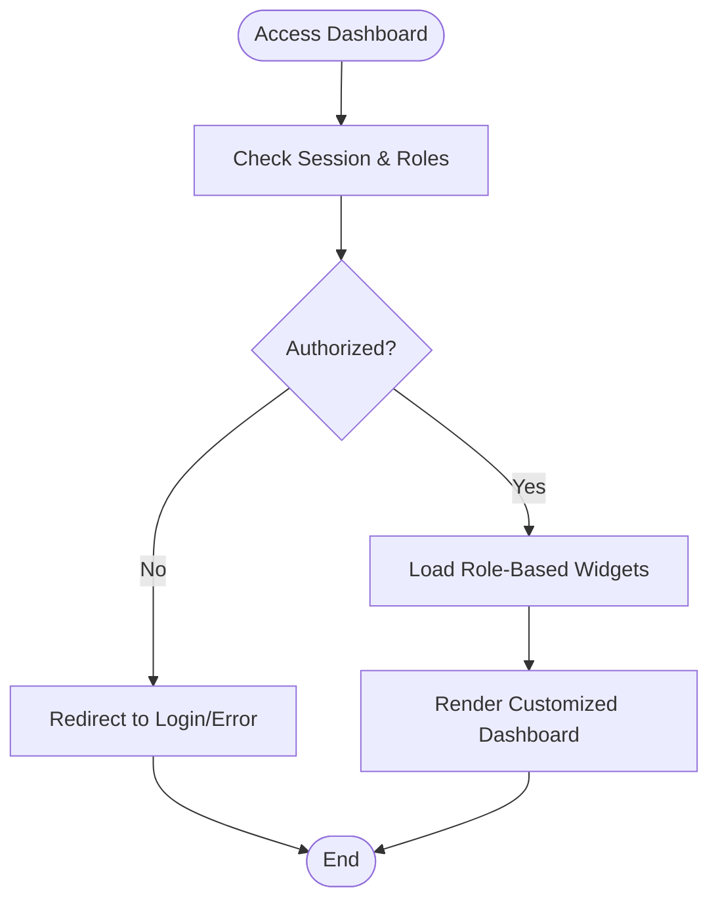
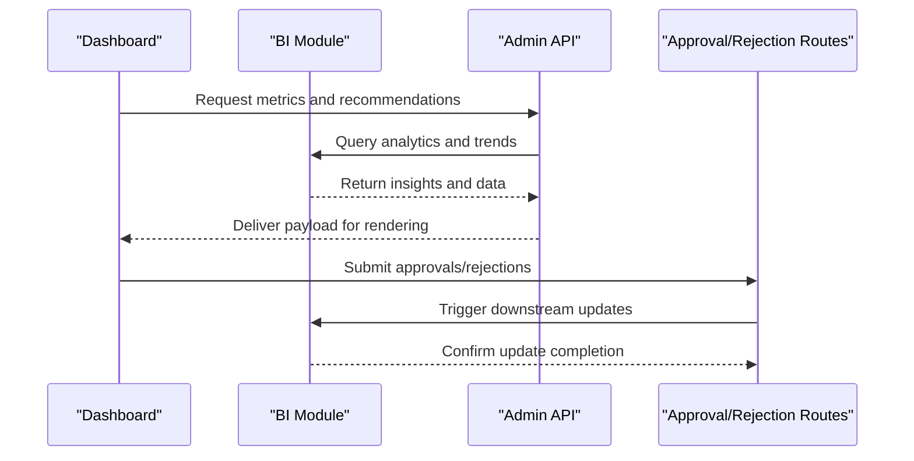
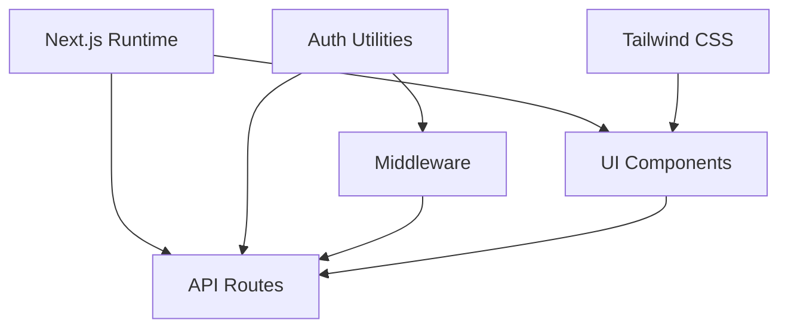

# Administrative Dashboard

<cite>
**Referenced Files in This Document**
- [page.tsx](file://apps/admin/src/app/page.tsx)
- [layout.tsx](file://apps/admin/src/app/layout.tsx)
- [admin-layout.tsx](file://apps/admin/src/components/layout/admin-layout.tsx)
- [dashboard-view.tsx](file://apps/admin/src/app/dashboard/dashboard-view.tsx)
- [page.tsx](file://apps/admin/src/app/dashboard/page.tsx)
- [route.ts](file://apps/admin/src/app/api/admin/dashboard/route.ts)
- [page.tsx](file://apps/admin/src/app/ai-insights/page.tsx)
- [route.ts](file://apps/admin/src/app/api/admin/compliance/[id]/approve/route.ts)
- [route.ts](file://apps/admin/src/app/api/admin/compliance/[id]/reject/route.ts)
- [route.ts](file://apps/admin/src/app/api/admin/products/[id]/approve/route.ts)
- [route.ts](file://apps/admin/src/app/api/admin/sellers/[id]/approve/route.ts)
- [route.ts](file://apps/admin/src/app/api/admin/sellers/[id]/reject/route.ts)
- [route.ts](file://apps/admin/src/app/api/auth/[...nextauth]/route.ts)
- [auth.ts](file://apps/admin/src/lib/auth.ts)
- [auth-instance.ts](file://apps/admin/src/lib/auth-instance.ts)
- [middleware.ts](file://apps/admin/src/middleware.ts)
- [globals.css](file://apps/admin/src/app/globals.css)
- [tailwind.config.js](file://apps/admin/src/tailwind.config.js)
- [package.json](file://apps/admin/package.json)
- [EXECUTIVE_DASHBOARD_NOTES.md](file://EXECUTIVE_DASHBOARD_NOTES.md)
- [MODULE_09_ADMIN_SETTINGS_NOTES.md](file://MODULE_09_ADMIN_SETTINGS_NOTES.md)
- [MODULE_11_AI_AUTOMATION_INTEGRATIONS_NOTES.md](file://MODULE_11_AI_AUTOMATION_INTEGRATIONS_NOTES.md)
</cite>

## Table of Contents
1. [Introduction](#introduction)
2. [Project Structure](#project-structure)
3. [Core Components](#core-components)
4. [Architecture Overview](#architecture-overview)
5. [Detailed Component Analysis](#detailed-component-analysis)
6. [Dependency Analysis](#dependency-analysis)
7. [Performance Considerations](#performance-considerations)
8. [Troubleshooting Guide](#troubleshooting-guide)
9. [Conclusion](#conclusion)
10. [Appendices](#appendices)

## Introduction
This document describes the Administrative Dashboard interface, focusing on the executive overview dashboard with key performance indicators, real-time metrics, and system health monitoring. It also covers the AI insights panel for automated business recommendations and trend analysis, dashboard widgets and data visualization components, layout structure and responsive design patterns, user role-based customization, and integration with business intelligence modules and real-time data updates.

## Project Structure
The administrative dashboard is implemented as a Next.js application under apps/admin. The structure organizes pages, layouts, API routes, shared components, and styling. Key areas include:
- Pages for the dashboard overview and AI insights
- Layout components for admin shell navigation and branding
- API routes for administrative actions and dashboard metrics
- Authentication and middleware for role-based access
- Global styles and Tailwind configuration for responsive design

```mermaid
graph TB
subgraph "Admin App"
P["apps/admin/src/app"]
L["apps/admin/src/components/layout"]
A["apps/admin/src/app/api/admin"]
LIB["apps/admin/src/lib"]
M["apps/admin/src/middleware.ts"]
G["apps/admin/src/app/globals.css"]
T["apps/admin/src/tailwind.config.js"]
PKG["apps/admin/package.json"]
end
P --> |"Dashboard overview"| D["apps/admin/src/app/dashboard/page.tsx"]
P --> |"AI Insights panel"| AI["apps/admin/src/app/ai-insights/page.tsx"]
P --> |"Root page"| ROOT["apps/admin/src/app/page.tsx"]
P --> |"Layout"| LAY["apps/admin/src/app/layout.tsx"]
L --> |"Admin shell"| AL["apps/admin/src/components/layout/admin-layout.tsx"]
A --> |"Metrics"| MET["apps/admin/src/app/api/admin/dashboard/route.ts"]
A --> |"Approve/Reject"| APP["apps/admin/src/app/api/admin/compliance/[id]/approve/route.ts"]
A --> |"Approve/Reject"| SPR["apps/admin/src/app/api/admin/sellers/[id]/approve/route.ts"]
A --> |"Approve/Reject"| PRP["apps/admin/src/app/api/admin/products/[id]/approve/route.ts"]
LIB --> |"Auth"| AUTH["apps/admin/src/lib/auth.ts"]
LIB --> |"Auth instance"| INST["apps/admin/src/lib/auth-instance.ts"]
M --> |"Middleware"| MW["apps/admin/src/middleware.ts"]
G --> |"Styles"| CSS["apps/admin/src/app/globals.css"]
T --> |"Tailwind config"| TW["apps/admin/src/tailwind.config.js"]
PKG --> |"Dependencies"| DEPS["apps/admin/package.json"]
```

**Diagram sources**
- [page.tsx:1-200](file://apps/admin/src/app/page.tsx#L1-L200)
- [layout.tsx:1-200](file://apps/admin/src/app/layout.tsx#L1-L200)
- [admin-layout.tsx:1-200](file://apps/admin/src/components/layout/admin-layout.tsx#L1-L200)
- [dashboard-view.tsx:1-200](file://apps/admin/src/app/dashboard/dashboard-view.tsx#L1-L200)
- [page.tsx:1-200](file://apps/admin/src/app/dashboard/page.tsx#L1-L200)
- [route.ts:1-200](file://apps/admin/src/app/api/admin/dashboard/route.ts#L1-L200)
- [page.tsx:1-200](file://apps/admin/src/app/ai-insights/page.tsx#L1-L200)
- [route.ts:1-200](file://apps/admin/src/app/api/admin/compliance/[id]/approve/route.ts#L1-L200)
- [route.ts:1-200](file://apps/admin/src/app/api/admin/sellers/[id]/approve/route.ts#L1-L200)
- [route.ts:1-200](file://apps/admin/src/app/api/admin/products/[id]/approve/route.ts#L1-L200)
- [auth.ts:1-200](file://apps/admin/src/lib/auth.ts#L1-L200)
- [auth-instance.ts:1-200](file://apps/admin/src/lib/auth-instance.ts#L1-L200)
- [middleware.ts:1-200](file://apps/admin/src/middleware.ts#L1-L200)
- [globals.css:1-200](file://apps/admin/src/app/globals.css#L1-L200)
- [tailwind.config.js:1-200](file://apps/admin/src/tailwind.config.js#L1-L200)
- [package.json:1-200](file://apps/admin/package.json#L1-L200)

**Section sources**
- [page.tsx:1-200](file://apps/admin/src/app/page.tsx#L1-L200)
- [layout.tsx:1-200](file://apps/admin/src/app/layout.tsx#L1-L200)
- [admin-layout.tsx:1-200](file://apps/admin/src/components/layout/admin-layout.tsx#L1-L200)
- [dashboard-view.tsx:1-200](file://apps/admin/src/app/dashboard/dashboard-view.tsx#L1-L200)
- [page.tsx:1-200](file://apps/admin/src/app/dashboard/page.tsx#L1-L200)
- [route.ts:1-200](file://apps/admin/src/app/api/admin/dashboard/route.ts#L1-L200)
- [page.tsx:1-200](file://apps/admin/src/app/ai-insights/page.tsx#L1-L200)
- [auth.ts:1-200](file://apps/admin/src/lib/auth.ts#L1-L200)
- [auth-instance.ts:1-200](file://apps/admin/src/lib/auth-instance.ts#L1-L200)
- [middleware.ts:1-200](file://apps/admin/src/middleware.ts#L1-L200)
- [globals.css:1-200](file://apps/admin/src/app/globals.css#L1-L200)
- [tailwind.config.js:1-200](file://apps/admin/src/tailwind.config.js#L1-L200)
- [package.json:1-200](file://apps/admin/package.json#L1-L200)

## Core Components
- Executive overview dashboard: Provides KPIs, real-time metrics, and system health monitoring via dedicated views and API endpoints.
- AI insights panel: Presents automated business recommendations and trend analysis derived from integrated AI modules.
- Dashboard widgets and visualizations: Modular components for displaying charts, summaries, and actionable insights.
- Layout and navigation: Admin shell with consistent navigation, branding, and responsive design.
- Authentication and roles: Middleware and auth utilities enforce role-based access and secure navigation.
- Business intelligence integration: API routes handle administrative actions and expose metrics for dashboards.

**Section sources**
- [page.tsx:1-200](file://apps/admin/src/app/page.tsx#L1-L200)
- [layout.tsx:1-200](file://apps/admin/src/app/layout.tsx#L1-L200)
- [admin-layout.tsx:1-200](file://apps/admin/src/components/layout/admin-layout.tsx#L1-L200)
- [dashboard-view.tsx:1-200](file://apps/admin/src/app/dashboard/dashboard-view.tsx#L1-L200)
- [page.tsx:1-200](file://apps/admin/src/app/dashboard/page.tsx#L1-L200)
- [route.ts:1-200](file://apps/admin/src/app/api/admin/dashboard/route.ts#L1-L200)
- [page.tsx:1-200](file://apps/admin/src/app/ai-insights/page.tsx#L1-L200)
- [auth.ts:1-200](file://apps/admin/src/lib/auth.ts#L1-L200)
- [auth-instance.ts:1-200](file://apps/admin/src/lib/auth-instance.ts#L1-L200)
- [middleware.ts:1-200](file://apps/admin/src/middleware.ts#L1-L200)

## Architecture Overview
The admin dashboard follows a layered architecture:
- Presentation layer: Next.js pages and components for the dashboard and AI insights panels.
- Layout layer: Shared admin layout and navigation components.
- API layer: Route handlers for administrative actions and metrics retrieval.
- Authentication layer: Auth utilities and middleware for role-based access control.
- Styling layer: Global CSS and Tailwind configuration for responsive design.

**Diagram sources**
- [page.tsx:1-200](file://apps/admin/src/app/page.tsx#L1-L200)
- [layout.tsx:1-200](file://apps/admin/src/app/layout.tsx#L1-L200)
- [admin-layout.tsx:1-200](file://apps/admin/src/components/layout/admin-layout.tsx#L1-L200)
- [route.ts:1-200](file://apps/admin/src/app/api/admin/dashboard/route.ts#L1-L200)
- [auth.ts:1-200](file://apps/admin/src/lib/auth.ts#L1-L200)
- [auth-instance.ts:1-200](file://apps/admin/src/lib/auth-instance.ts#L1-L200)
- [middleware.ts:1-200](file://apps/admin/src/middleware.ts#L1-L200)
- [globals.css:1-200](file://apps/admin/src/app/globals.css#L1-L200)
- [tailwind.config.js:1-200](file://apps/admin/src/tailwind.config.js#L1-L200)

## Detailed Component Analysis

### Executive Overview Dashboard
The executive overview dashboard aggregates key performance indicators, real-time metrics, and system health monitoring. It is composed of:
- Dashboard page: Renders the overview layout and KPI widgets.
- Dashboard view: Contains reusable widgets for charts, summaries, and alerts.
- API route: Exposes metrics and health signals consumed by the dashboard.

**Diagram sources**
- [page.tsx:1-200](file://apps/admin/src/app/dashboard/page.tsx#L1-L200)
- [dashboard-view.tsx:1-200](file://apps/admin/src/app/dashboard/dashboard-view.tsx#L1-L200)
- [route.ts:1-200](file://apps/admin/src/app/api/admin/dashboard/route.ts#L1-L200)

**Section sources**
- [page.tsx:1-200](file://apps/admin/src/app/dashboard/page.tsx#L1-L200)
- [dashboard-view.tsx:1-200](file://apps/admin/src/app/dashboard/dashboard-view.tsx#L1-L200)
- [route.ts:1-200](file://apps/admin/src/app/api/admin/dashboard/route.ts#L1-L200)

### AI Insights Panel
The AI insights panel presents automated business recommendations and trend analysis. It integrates with AI modules and displays actionable insights tailored to the admin’s role and current business context.

**Diagram sources**
- [page.tsx:1-200](file://apps/admin/src/app/ai-insights/page.tsx#L1-L200)
- [route.ts:1-200](file://apps/admin/src/app/api/admin/dashboard/route.ts#L1-L200)

**Section sources**
- [page.tsx:1-200](file://apps/admin/src/app/ai-insights/page.tsx#L1-L200)
- [route.ts:1-200](file://apps/admin/src/app/api/admin/dashboard/route.ts#L1-L200)

### Dashboard Widgets and Data Visualization
Widgets are modular components designed for:
- KPI cards: Summarize key metrics with trend indicators.
- Charts: Display time-series and distribution data.
- Alerts: Highlight anomalies or thresholds.
- Interactive filters: Allow drill-down and segment selection.

These widgets consume data from the dashboard API and adapt to screen sizes through responsive design.

**Section sources**
- [dashboard-view.tsx:1-200](file://apps/admin/src/app/dashboard/dashboard-view.tsx#L1-L200)
- [route.ts:1-200](file://apps/admin/src/app/api/admin/dashboard/route.ts#L1-L200)

### Layout Structure and Responsive Design
The admin layout ensures consistent navigation and branding across pages. It leverages:
- Admin shell: Centralized navigation and menu structure.
- Responsive breakpoints: Tailwind classes and global CSS for adaptive layouts.
- Global styles: Consistent typography, spacing, and color tokens.

**Diagram sources**
- [admin-layout.tsx:1-200](file://apps/admin/src/components/layout/admin-layout.tsx#L1-L200)
- [layout.tsx:1-200](file://apps/admin/src/app/layout.tsx#L1-L200)
- [globals.css:1-200](file://apps/admin/src/app/globals.css#L1-L200)
- [tailwind.config.js:1-200](file://apps/admin/src/tailwind.config.js#L1-L200)

**Section sources**
- [admin-layout.tsx:1-200](file://apps/admin/src/components/layout/admin-layout.tsx#L1-L200)
- [layout.tsx:1-200](file://apps/admin/src/app/layout.tsx#L1-L200)
- [globals.css:1-200](file://apps/admin/src/app/globals.css#L1-L200)
- [tailwind.config.js:1-200](file://apps/admin/src/tailwind.config.js#L1-L200)

### User Role-Based Dashboard Customization
Role-based customization allows administrators to tailor dashboard content and permissions:
- Middleware enforces role checks and redirects unauthorized users.
- Auth utilities manage session state and access tokens.
- API routes validate roles before serving sensitive data or performing actions.

**Diagram sources**
- [middleware.ts:1-200](file://apps/admin/src/middleware.ts#L1-L200)
- [auth.ts:1-200](file://apps/admin/src/lib/auth.ts#L1-L200)
- [auth-instance.ts:1-200](file://apps/admin/src/lib/auth-instance.ts#L1-L200)

**Section sources**
- [middleware.ts:1-200](file://apps/admin/src/middleware.ts#L1-L200)
- [auth.ts:1-200](file://apps/admin/src/lib/auth.ts#L1-L200)
- [auth-instance.ts:1-200](file://apps/admin/src/lib/auth-instance.ts#L1-L200)

### Integration with Business Intelligence Modules and Real-Time Updates
The dashboard integrates with business intelligence modules through:
- API endpoints for metrics and recommendations.
- Real-time update mechanisms via polling or server-sent events.
- Action routes for approvals and rejections that trigger downstream BI updates.

**Diagram sources**
- [route.ts:1-200](file://apps/admin/src/app/api/admin/dashboard/route.ts#L1-L200)
- [route.ts:1-200](file://apps/admin/src/app/api/admin/compliance/[id]/approve/route.ts#L1-L200)
- [route.ts:1-200](file://apps/admin/src/app/api/admin/sellers/[id]/approve/route.ts#L1-L200)
- [route.ts:1-200](file://apps/admin/src/app/api/admin/products/[id]/approve/route.ts#L1-L200)

**Section sources**
- [route.ts:1-200](file://apps/admin/src/app/api/admin/dashboard/route.ts#L1-L200)
- [route.ts:1-200](file://apps/admin/src/app/api/admin/compliance/[id]/approve/route.ts#L1-L200)
- [route.ts:1-200](file://apps/admin/src/app/api/admin/sellers/[id]/approve/route.ts#L1-L200)
- [route.ts:1-200](file://apps/admin/src/app/api/admin/products/[id]/approve/route.ts#L1-L200)

## Dependency Analysis
The admin dashboard depends on:
- Next.js runtime for routing and SSR/SSG.
- Tailwind CSS for responsive styling and design tokens.
- Authentication utilities and middleware for access control.
- API routes for data fetching and administrative actions.

**Diagram sources**
- [package.json:1-200](file://apps/admin/package.json#L1-L200)
- [tailwind.config.js:1-200](file://apps/admin/src/tailwind.config.js#L1-L200)
- [auth.ts:1-200](file://apps/admin/src/lib/auth.ts#L1-L200)
- [auth-instance.ts:1-200](file://apps/admin/src/lib/auth-instance.ts#L1-L200)
- [middleware.ts:1-200](file://apps/admin/src/middleware.ts#L1-L200)
- [route.ts:1-200](file://apps/admin/src/app/api/admin/dashboard/route.ts#L1-L200)

**Section sources**
- [package.json:1-200](file://apps/admin/package.json#L1-L200)
- [tailwind.config.js:1-200](file://apps/admin/src/tailwind.config.js#L1-L200)
- [auth.ts:1-200](file://apps/admin/src/lib/auth.ts#L1-L200)
- [auth-instance.ts:1-200](file://apps/admin/src/lib/auth-instance.ts#L1-L200)
- [middleware.ts:1-200](file://apps/admin/src/middleware.ts#L1-L200)
- [route.ts:1-200](file://apps/admin/src/app/api/admin/dashboard/route.ts#L1-L200)

## Performance Considerations
- Optimize widget rendering by lazy-loading heavy charts and deferring non-critical resources.
- Implement caching strategies for frequently accessed metrics to reduce API load.
- Use efficient data fetching patterns (e.g., background updates) to minimize UI blocking.
- Leverage responsive breakpoints to avoid unnecessary reflows and repaints.

## Troubleshooting Guide
Common issues and resolutions:
- Authentication failures: Verify session state and role claims; ensure middleware is configured correctly.
- Missing metrics: Confirm API route availability and data pipeline connectivity.
- Styling inconsistencies: Check Tailwind configuration and global CSS overrides.
- Widget rendering errors: Validate prop types and data shape passed to visualization components.

**Section sources**
- [middleware.ts:1-200](file://apps/admin/src/middleware.ts#L1-L200)
- [auth.ts:1-200](file://apps/admin/src/lib/auth.ts#L1-L200)
- [auth-instance.ts:1-200](file://apps/admin/src/lib/auth-instance.ts#L1-L200)
- [route.ts:1-200](file://apps/admin/src/app/api/admin/dashboard/route.ts#L1-L200)
- [globals.css:1-200](file://apps/admin/src/app/globals.css#L1-L200)
- [tailwind.config.js:1-200](file://apps/admin/src/tailwind.config.js#L1-L200)

## Conclusion
The Administrative Dashboard provides a comprehensive executive overview with KPIs, real-time metrics, and system health monitoring, complemented by an AI insights panel for automated recommendations. Its modular architecture, responsive design, and role-based customization enable flexible and secure administration. Integration with business intelligence modules and real-time data updates ensures timely and actionable insights for decision-making.

## Appendices
- Executive dashboard notes: Additional guidance and feature highlights for the executive overview.
- Admin settings notes: Configuration and customization options for the admin interface.
- AI and automation notes: Details on AI module integration and automation workflows.

**Section sources**
- [EXECUTIVE_DASHBOARD_NOTES.md:1-200](file://EXECUTIVE_DASHBOARD_NOTES.md#L1-L200)
- [MODULE_09_ADMIN_SETTINGS_NOTES.md:1-200](file://MODULE_09_ADMIN_SETTINGS_NOTES.md#L1-L200)
- [MODULE_11_AI_AUTOMATION_INTEGRATIONS_NOTES.md:1-200](file://MODULE_11_AI_AUTOMATION_INTEGRATIONS_NOTES.md#L1-L200)