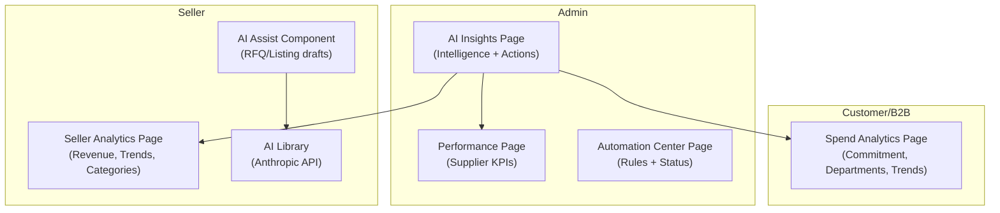
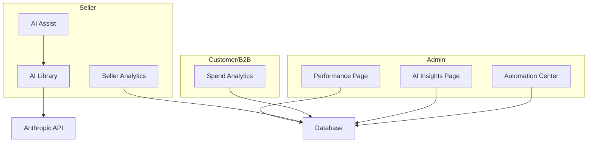
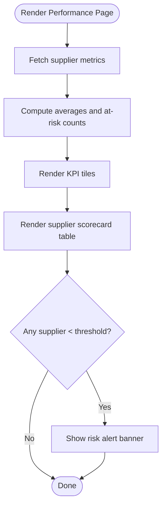
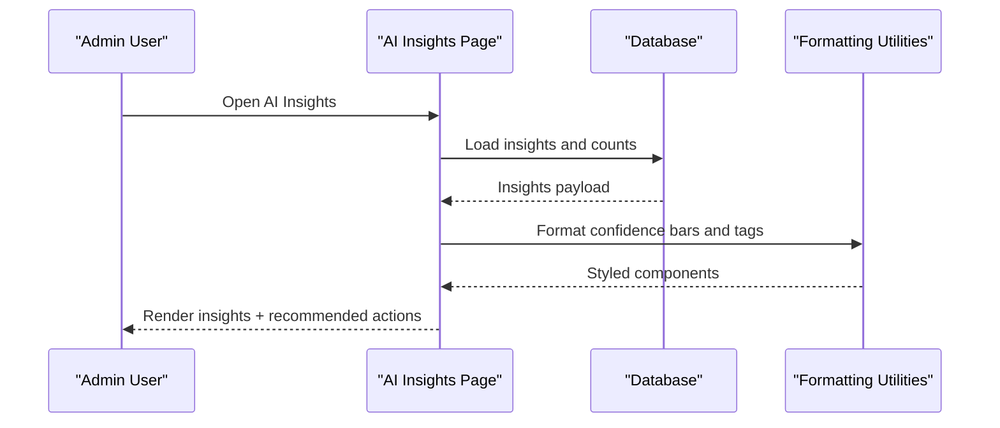
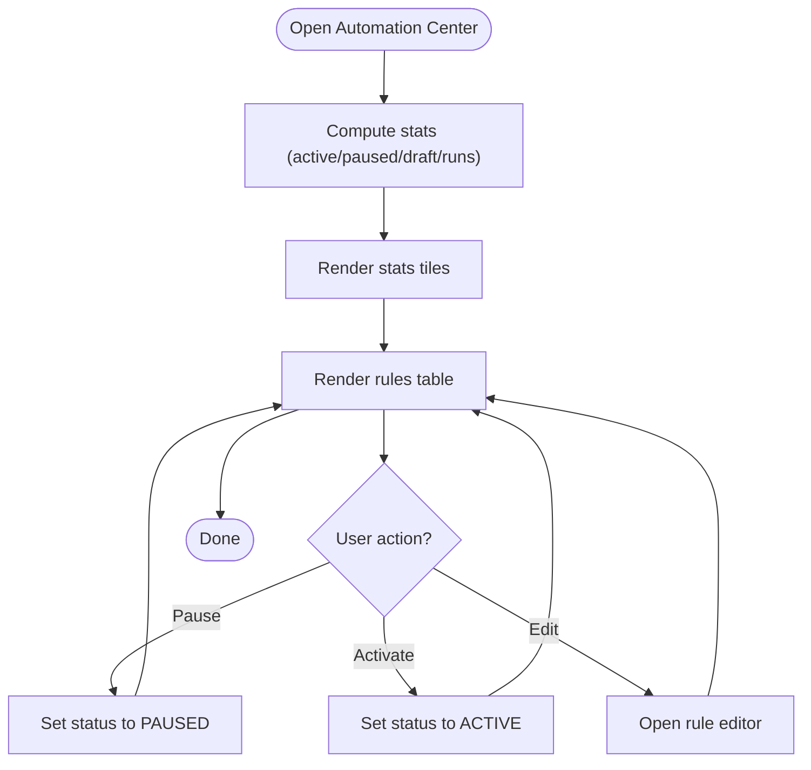
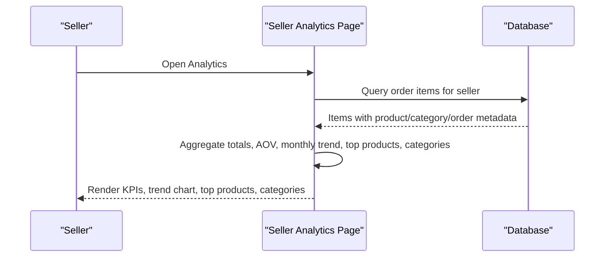
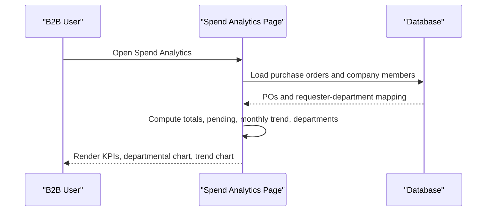
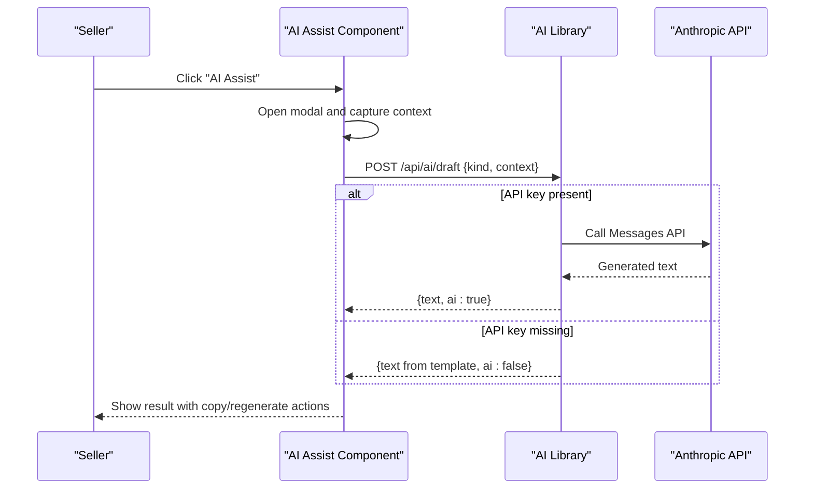
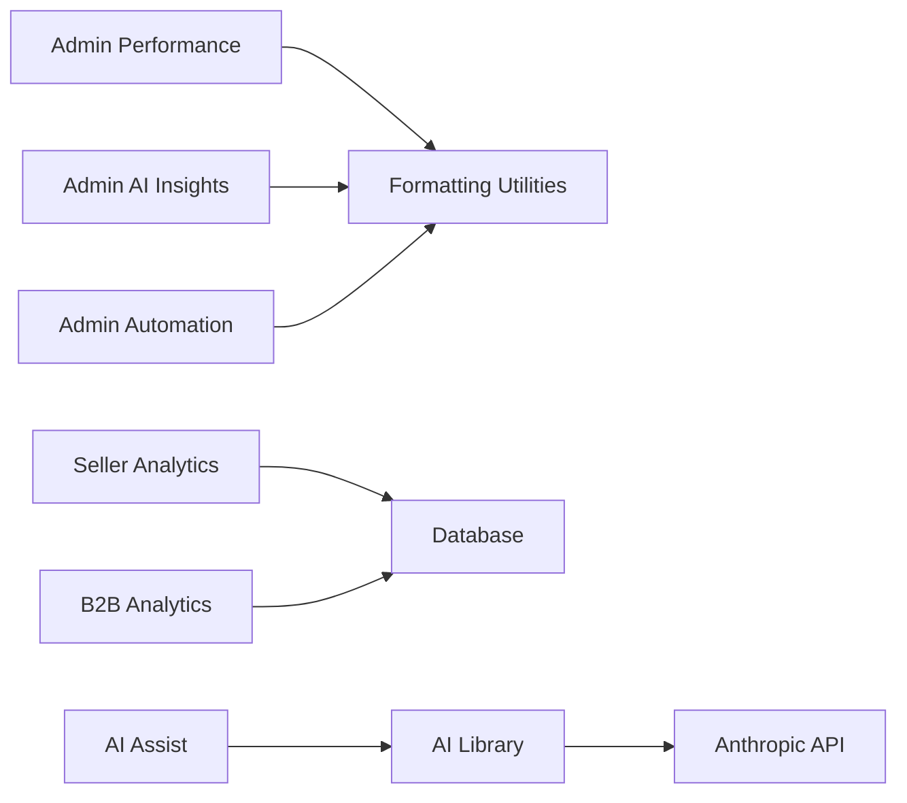

# Business Intelligence

<cite>
**Referenced Files in This Document**
- [apps/admin/src/app/performance/page.tsx](file://apps/admin/src/app/performance/page.tsx)
- [apps/admin/src/app/ai-insights/page.tsx](file://apps/admin/src/app/ai-insights/page.tsx)
- [apps/admin/src/app/automation/page.tsx](file://apps/admin/src/app/automation/page.tsx)
- [apps/seller/src/app/analytics/page.tsx](file://apps/seller/src/app/analytics/page.tsx)
- [apps/customer/src/app/b2b/analytics/page.tsx](file://apps/customer/src/app/b2b/analytics/page.tsx)
- [apps/seller/src/lib/ai.ts](file://apps/seller/src/lib/ai.ts)
- [apps/seller/src/components/ai-assist.tsx](file://apps/seller/src/components/ai-assist.tsx)
</cite>

## Table of Contents
1. [Introduction](#introduction)
2. [Project Structure](#project-structure)
3. [Core Components](#core-components)
4. [Architecture Overview](#architecture-overview)
5. [Detailed Component Analysis](#detailed-component-analysis)
6. [Dependency Analysis](#dependency-analysis)
7. [Performance Considerations](#performance-considerations)
8. [Troubleshooting Guide](#troubleshooting-guide)
9. [Conclusion](#conclusion)
10. [Appendices](#appendices)

## Introduction
This document describes the Business Intelligence module of the platform, focusing on performance analytics, market insights, AI-powered automation, and executive dashboards. It covers:
- Performance dashboards for business metrics, revenue analytics, and growth indicators
- AI insights generation including predictive analytics, recommendation engines, and automated business suggestions
- Market analytics capabilities such as competitive analysis, demand forecasting, and trend identification
- Automation workflows including process optimization, workflow automation, and intelligent decision-making systems
- Reporting mechanisms, data visualization tools, and executive dashboards

The module is implemented across three primary roles:
- Admin: Executive dashboards, AI insights, and automation center
- Seller: Sales performance analytics and AI-assisted content creation
- Customer/B2B: Spend analytics and procurement insights

## Project Structure
The Business Intelligence module is organized by role and domain:
- Admin pages: performance, AI insights, automation center
- Seller pages: analytics and AI assistant
- Customer/B2B pages: spend analytics

**Diagram sources**
- [apps/admin/src/app/performance/page.tsx:1-97](file://apps/admin/src/app/performance/page.tsx#L1-L97)
- [apps/admin/src/app/ai-insights/page.tsx:1-318](file://apps/admin/src/app/ai-insights/page.tsx#L1-L318)
- [apps/admin/src/app/automation/page.tsx:1-259](file://apps/admin/src/app/automation/page.tsx#L1-L259)
- [apps/seller/src/app/analytics/page.tsx:1-156](file://apps/seller/src/app/analytics/page.tsx#L1-L156)
- [apps/seller/src/components/ai-assist.tsx:1-110](file://apps/seller/src/components/ai-assist.tsx#L1-L110)
- [apps/seller/src/lib/ai.ts:1-51](file://apps/seller/src/lib/ai.ts#L1-L51)
- [apps/customer/src/app/b2b/analytics/page.tsx:1-121](file://apps/customer/src/app/b2b/analytics/page.tsx#L1-L121)

**Section sources**
- [apps/admin/src/app/performance/page.tsx:1-97](file://apps/admin/src/app/performance/page.tsx#L1-L97)
- [apps/admin/src/app/ai-insights/page.tsx:1-318](file://apps/admin/src/app/ai-insights/page.tsx#L1-L318)
- [apps/admin/src/app/automation/page.tsx:1-259](file://apps/admin/src/app/automation/page.tsx#L1-L259)
- [apps/seller/src/app/analytics/page.tsx:1-156](file://apps/seller/src/app/analytics/page.tsx#L1-L156)
- [apps/seller/src/components/ai-assist.tsx:1-110](file://apps/seller/src/components/ai-assist.tsx#L1-L110)
- [apps/seller/src/lib/ai.ts:1-51](file://apps/seller/src/lib/ai.ts#L1-L51)
- [apps/customer/src/app/b2b/analytics/page.tsx:1-121](file://apps/customer/src/app/b2b/analytics/page.tsx#L1-L121)

## Core Components
- Admin Performance Dashboard: Shows supplier KPIs, SLA metrics, and risk indicators.
- Admin AI Insights: Presents categorized actionable intelligence with confidence levels and recommended actions.
- Admin Automation Center: Manages workflow rules, statuses, owners, and execution stats.
- Seller Analytics: Displays revenue trends, top products, category breakdowns, and KPIs.
- Customer/B2B Spend Analytics: Visualizes committed spend, pending approvals, departmental allocation, and monthly trends.
- AI Assistant: Provides AI-generated drafts for RFQ replies and product listings with a graceful fallback when API keys are unavailable.

**Section sources**
- [apps/admin/src/app/performance/page.tsx:9-97](file://apps/admin/src/app/performance/page.tsx#L9-L97)
- [apps/admin/src/app/ai-insights/page.tsx:10-187](file://apps/admin/src/app/ai-insights/page.tsx#L10-L187)
- [apps/admin/src/app/automation/page.tsx:9-130](file://apps/admin/src/app/automation/page.tsx#L9-L130)
- [apps/seller/src/app/analytics/page.tsx:14-156](file://apps/seller/src/app/analytics/page.tsx#L14-L156)
- [apps/customer/src/app/b2b/analytics/page.tsx:25-121](file://apps/customer/src/app/b2b/analytics/page.tsx#L25-L121)
- [apps/seller/src/components/ai-assist.tsx:7-110](file://apps/seller/src/components/ai-assist.tsx#L7-L110)
- [apps/seller/src/lib/ai.ts:15-50](file://apps/seller/src/lib/ai.ts#L15-L50)

## Architecture Overview
The Business Intelligence layer integrates real-time data, AI inference, and automation orchestration:
- Data sources: Database queries for orders, purchase orders, and company membership
- AI inference: Anthropic Messages API for RFQ and listing drafts
- Automation: Rule engine with triggers, conditions, and actions
- Visualization: Charts and KPI cards rendered client-side

**Diagram sources**
- [apps/admin/src/app/performance/page.tsx:1-97](file://apps/admin/src/app/performance/page.tsx#L1-L97)
- [apps/admin/src/app/ai-insights/page.tsx:1-318](file://apps/admin/src/app/ai-insights/page.tsx#L1-L318)
- [apps/admin/src/app/automation/page.tsx:1-259](file://apps/admin/src/app/automation/page.tsx#L1-L259)
- [apps/seller/src/app/analytics/page.tsx:1-156](file://apps/seller/src/app/analytics/page.tsx#L1-L156)
- [apps/seller/src/components/ai-assist.tsx:1-110](file://apps/seller/src/components/ai-assist.tsx#L1-L110)
- [apps/seller/src/lib/ai.ts:1-51](file://apps/seller/src/lib/ai.ts#L1-L51)
- [apps/customer/src/app/b2b/analytics/page.tsx:1-121](file://apps/customer/src/app/b2b/analytics/page.tsx#L1-L121)

## Detailed Component Analysis

### Admin Performance Dashboard
- Purpose: Executive overview of supplier performance, SLA adherence, and risk.
- Data visualization: KPI tiles, supplier scorecards with progress bars, and trend indicators.
- Risk alerts: Highlights suppliers below a threshold to prevent negative impact on platform NPS.

**Diagram sources**
- [apps/admin/src/app/performance/page.tsx:20-97](file://apps/admin/src/app/performance/page.tsx#L20-L97)

**Section sources**
- [apps/admin/src/app/performance/page.tsx:9-97](file://apps/admin/src/app/performance/page.tsx#L9-L97)

### Admin AI Insights
- Purpose: Deliver actionable intelligence across Commerce, B2B, Operations, and Risk domains.
- Features: Confidence indicators, categorized tags, recommended actions, and model status panel.
- Navigation: Links to relevant functional areas (products, warehouse, CRM, finance, etc.).

**Diagram sources**
- [apps/admin/src/app/ai-insights/page.tsx:197-313](file://apps/admin/src/app/ai-insights/page.tsx#L197-L313)

**Section sources**
- [apps/admin/src/app/ai-insights/page.tsx:8-187](file://apps/admin/src/app/ai-insights/page.tsx#L8-L187)
- [apps/admin/src/app/ai-insights/page.tsx:189-195](file://apps/admin/src/app/ai-insights/page.tsx#L189-L195)
- [apps/admin/src/app/ai-insights/page.tsx:197-313](file://apps/admin/src/app/ai-insights/page.tsx#L197-L313)

### Admin Automation Center
- Purpose: Manage workflow rules that automate business processes.
- Features: Rule table with status badges, owner attribution, last-run timestamps, and quick actions (pause/activate/edit).
- Metrics: Active, paused, draft counts and monthly execution totals.

**Diagram sources**
- [apps/admin/src/app/automation/page.tsx:138-259](file://apps/admin/src/app/automation/page.tsx#L138-L259)

**Section sources**
- [apps/admin/src/app/automation/page.tsx:9-130](file://apps/admin/src/app/automation/page.tsx#L9-L130)
- [apps/admin/src/app/automation/page.tsx:138-259](file://apps/admin/src/app/automation/page.tsx#L138-L259)

### Seller Analytics
- Purpose: Enable sellers to track revenue, units sold, AOV, and monthly trends.
- Data processing: Aggregates order items, computes revenue by product and category, and renders charts.
- Empty-state handling: Friendly message when no sales data exists.

**Diagram sources**
- [apps/seller/src/app/analytics/page.tsx:11-156](file://apps/seller/src/app/analytics/page.tsx#L11-L156)

**Section sources**
- [apps/seller/src/app/analytics/page.tsx:14-156](file://apps/seller/src/app/analytics/page.tsx#L14-L156)

### Customer/B2B Spend Analytics
- Purpose: Provide procurement visibility for B2B companies with committed spend, pending approvals, and departmental allocation.
- Data processing: Builds department-to-spend mapping and monthly trend aggregation.
- Empty-state handling: Guidance when no approved/ordered purchase orders exist.

**Diagram sources**
- [apps/customer/src/app/b2b/analytics/page.tsx:11-121](file://apps/customer/src/app/b2b/analytics/page.tsx#L11-L121)

**Section sources**
- [apps/customer/src/app/b2b/analytics/page.tsx:25-121](file://apps/customer/src/app/b2b/analytics/page.tsx#L25-L121)

### AI Assistant (RFQ/Listing Drafts)
- Purpose: Provide AI-generated drafts for RFQ replies and product listings with a graceful fallback.
- Integration: Uses Anthropic Messages API when configured; otherwise returns a template response.
- UX: Modal dialog with context input, generate/regenerate, copy-to-clipboard, and toast feedback.

**Diagram sources**
- [apps/seller/src/components/ai-assist.tsx:27-46](file://apps/seller/src/components/ai-assist.tsx#L27-L46)
- [apps/seller/src/lib/ai.ts:15-50](file://apps/seller/src/lib/ai.ts#L15-L50)

**Section sources**
- [apps/seller/src/components/ai-assist.tsx:7-110](file://apps/seller/src/components/ai-assist.tsx#L7-L110)
- [apps/seller/src/lib/ai.ts:15-50](file://apps/seller/src/lib/ai.ts#L15-L50)

## Dependency Analysis
- Admin pages depend on shared layouts and utilities for session checks and formatting.
- Seller analytics depends on database queries and currency formatting utilities.
- AI assistant depends on the AI library and Next.js fetch for API communication.
- B2B spend analytics depends on database queries and context resolution for company membership.

**Diagram sources**
- [apps/admin/src/app/performance/page.tsx:1-97](file://apps/admin/src/app/performance/page.tsx#L1-L97)
- [apps/admin/src/app/ai-insights/page.tsx:1-318](file://apps/admin/src/app/ai-insights/page.tsx#L1-L318)
- [apps/admin/src/app/automation/page.tsx:1-259](file://apps/admin/src/app/automation/page.tsx#L1-L259)
- [apps/seller/src/app/analytics/page.tsx:1-156](file://apps/seller/src/app/analytics/page.tsx#L1-L156)
- [apps/customer/src/app/b2b/analytics/page.tsx:1-121](file://apps/customer/src/app/b2b/analytics/page.tsx#L1-L121)
- [apps/seller/src/components/ai-assist.tsx:1-110](file://apps/seller/src/components/ai-assist.tsx#L1-L110)
- [apps/seller/src/lib/ai.ts:1-51](file://apps/seller/src/lib/ai.ts#L1-L51)

**Section sources**
- [apps/admin/src/app/performance/page.tsx:1-9](file://apps/admin/src/app/performance/page.tsx#L1-L9)
- [apps/admin/src/app/ai-insights/page.tsx:1-6](file://apps/admin/src/app/ai-insights/page.tsx#L1-L6)
- [apps/admin/src/app/automation/page.tsx:1-5](file://apps/admin/src/app/automation/page.tsx#L1-L5)
- [apps/seller/src/app/analytics/page.tsx:1-5](file://apps/seller/src/app/analytics/page.tsx#L1-L5)
- [apps/customer/src/app/b2b/analytics/page.tsx:1-5](file://apps/customer/src/app/b2b/analytics/page.tsx#L1-L5)
- [apps/seller/src/components/ai-assist.tsx:1-6](file://apps/seller/src/components/ai-assist.tsx#L1-L6)
- [apps/seller/src/lib/ai.ts:1-6](file://apps/seller/src/lib/ai.ts#L1-L6)

## Performance Considerations
- Data aggregation: Client-side aggregation in analytics pages is efficient for moderate datasets; consider server-side aggregation or pagination for very large histories.
- Rendering: SVG-based charts and progress bars are lightweight; avoid excessive DOM updates by batching state changes.
- AI requests: Debounce user actions and cache recent results to reduce API calls and improve responsiveness.
- Automation rules: Keep rule conditions selective and indexed to minimize database load during rule evaluations.

## Troubleshooting Guide
- AI drafts not generated:
  - Verify the Anthropic API key is configured; otherwise, the system falls back to a template.
  - Check network connectivity and API response codes.
- Empty analytics data:
  - Confirm that orders or purchase orders exist for the selected periods.
  - Ensure filters exclude cancelled or pending-payment orders where applicable.
- Automation rule status not updating:
  - Confirm auto-refresh intervals and rule execution logs.
  - Validate rule triggers and conditions align with current data.

**Section sources**
- [apps/seller/src/lib/ai.ts:19-26](file://apps/seller/src/lib/ai.ts#L19-L26)
- [apps/seller/src/lib/ai.ts:39-49](file://apps/seller/src/lib/ai.ts#L39-L49)
- [apps/seller/src/components/ai-assist.tsx:31-38](file://apps/seller/src/components/ai-assist.tsx#L31-L38)
- [apps/seller/src/app/analytics/page.tsx:66-66](file://apps/seller/src/app/analytics/page.tsx#L66-L66)
- [apps/customer/src/app/b2b/analytics/page.tsx:62-62](file://apps/customer/src/app/b2b/analytics/page.tsx#L62-L62)

## Conclusion
The Business Intelligence module delivers a comprehensive suite of dashboards, AI-driven insights, and automation tools tailored to administrators, sellers, and B2B buyers. It emphasizes actionable intelligence, real-time data visualization, and intelligent automation to drive performance, optimize operations, and support strategic decision-making.

## Appendices
- Executive dashboard notes and branding guidelines are documented separately for broader context.
- AI and automation integration notes outline extended capabilities and future enhancements.