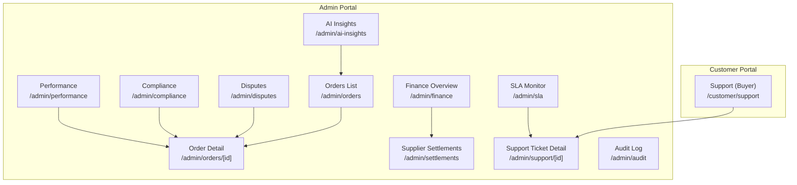
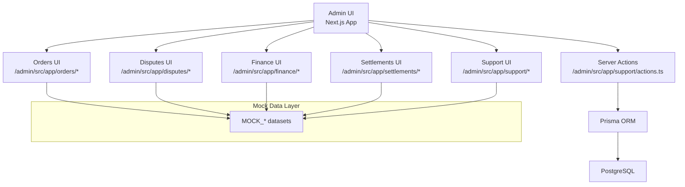
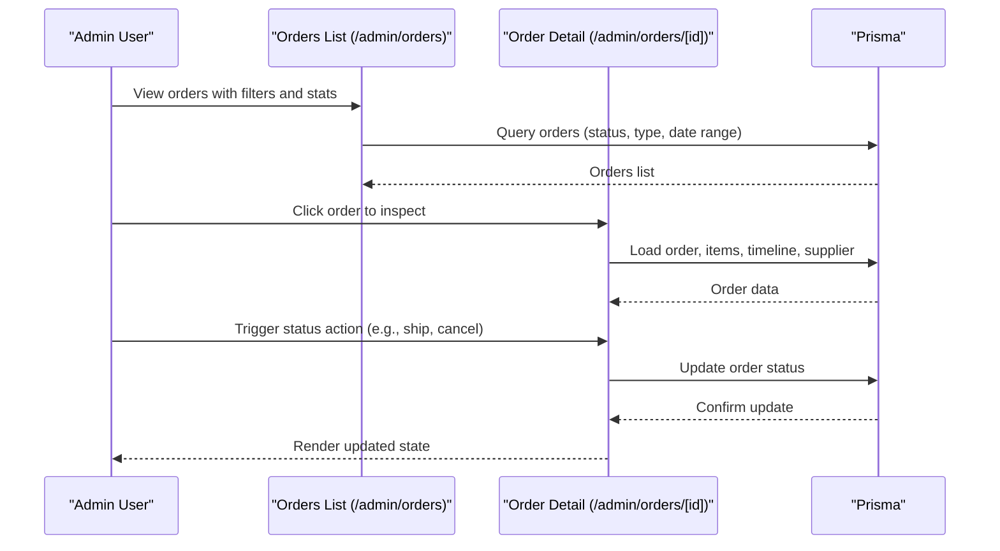
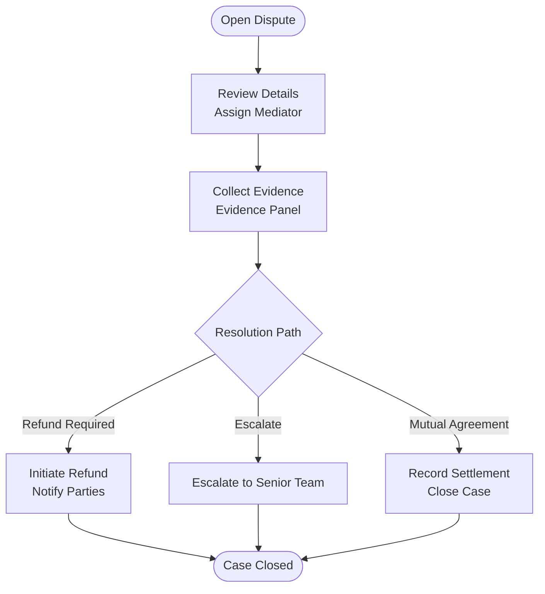
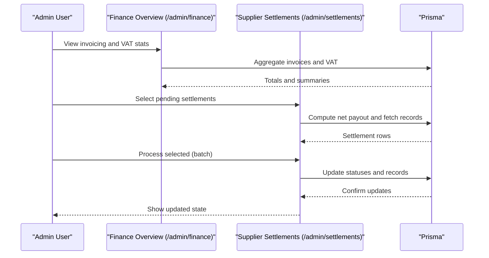
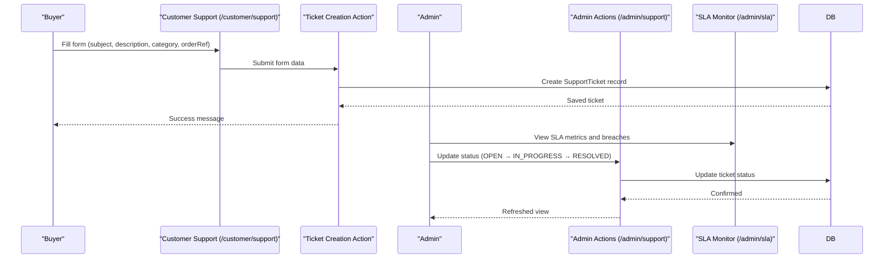
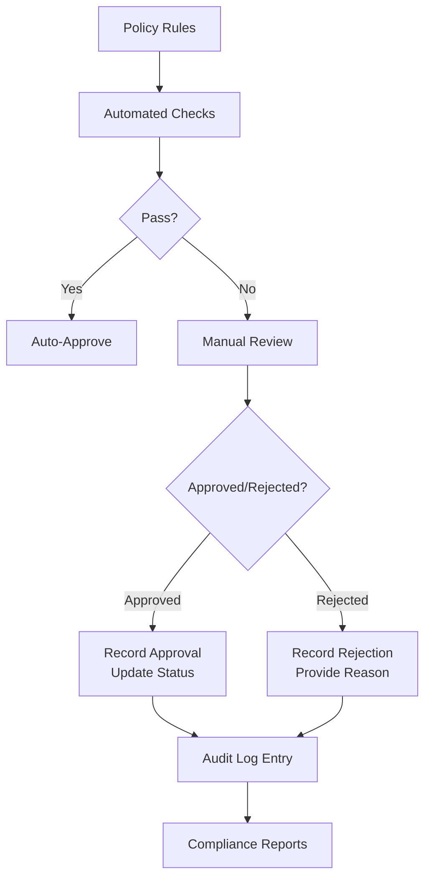
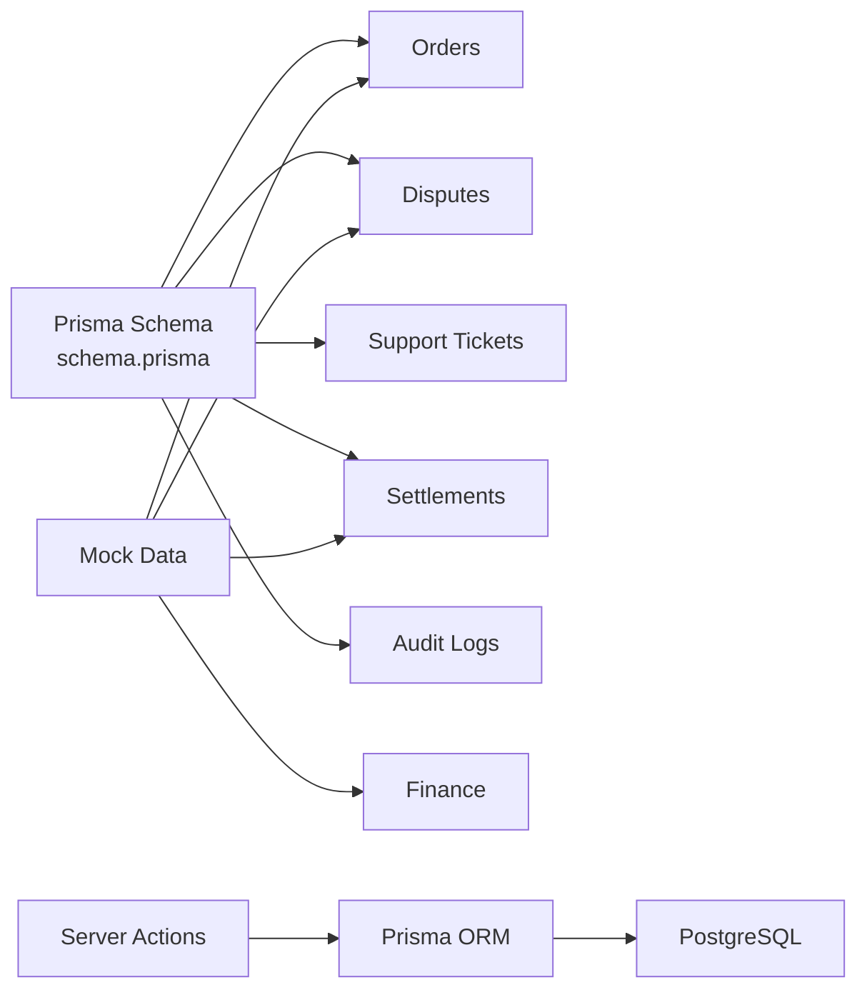

# Operational Control

<cite>
**Referenced Files in This Document**
- [MODULE_04_ORDERS_FULFILLMENT_NOTES.md](file://MODULE_04_ORDERS_FULFILLMENT_NOTES.md)
- [MODULE_08_SUPPORT_DISPUTES_NOTES.md](file://MODULE_08_SUPPORT_DISPUTES_NOTES.md)
- [MODULE_07_FINANCE_NOTES.md](file://MODULE_07_FINANCE_NOTES.md)
- [page.tsx](file://apps/admin/src/app/orders/page.tsx)
- [page.tsx](file://apps/admin/src/app/orders/[id]/page.tsx)
- [page.tsx](file://apps/admin/src/app/disputes/page.tsx)
- [page.tsx](file://apps/admin/src/app/finance/page.tsx)
- [page.tsx](file://apps/admin/src/app/settlements/page.tsx)
- [page.tsx](file://apps/admin/src/app/support/[id]/page.tsx)
- [actions.ts](file://apps/admin/src/app/support/actions.ts)
- [page.tsx](file://apps/customer/src/app/support/page.tsx)
- [actions.ts](file://apps/customer/src/app/support/actions.ts)
- [page.tsx](file://apps/admin/src/app/sla/page.tsx)
- [page.tsx](file://apps/admin/src/app/compliance/page.tsx)
- [page.tsx](file://apps/admin/src/app/audit/page.tsx)
- [page.tsx](file://apps/admin/src/app/performance/page.tsx)
- [page.tsx](file://apps/admin/src/app/ai-insights/page.tsx)
- [schema.prisma](file://packages/database/prisma/schema.prisma)
- [mock-data.ts](file://packages/database/src/mock-data.ts)
- [migration.sql](file://packages/database/prisma/migrations/20260601013412_add_support_tickets/migration.sql)
</cite>

## Table of Contents
1. [Introduction](#introduction)
2. [Project Structure](#project-structure)
3. [Core Components](#core-components)
4. [Architecture Overview](#architecture-overview)
5. [Detailed Component Analysis](#detailed-component-analysis)
6. [Dependency Analysis](#dependency-analysis)
7. [Performance Considerations](#performance-considerations)
8. [Troubleshooting Guide](#troubleshooting-guide)
9. [Conclusion](#conclusion)
10. [Appendices](#appendices)

## Introduction
This document describes the Operational Control module, focusing on order supervision, dispute resolution, financial oversight, and support operations. It explains workflows for order management (supervision, quality assurance, fulfillment monitoring), dispute resolution (conflict mediation, evidence handling, resolution workflows), financial oversight (settlement processing, revenue analytics, compliance monitoring), and support operations (ticket management, escalation handling, customer service coordination). It also covers compliance monitoring, policy enforcement, and regulatory adherence tools.

## Project Structure
Operational Control spans three applications:
- Admin portal: central operational dashboard for supervisors and administrators.
- Customer portal: self-service for buyers to manage orders, returns, and support.
- Seller portal: operational controls for suppliers (not the focus here but relevant for order fulfillment context).

Key routes and pages:
- Orders: listing and detail views for supervision and fulfillment monitoring.
- Disputes: dispute cards with status, priority, and actions.
- Finance: invoicing, settlements, and VAT overview.
- Support: ticket creation and management for escalations.
- SLA: compliance monitoring and breach tracking.
- Compliance/Audit/Performance/AI Insights: governance and operational intelligence.

**Diagram sources**
- [page.tsx](file://apps/admin/src/app/orders/page.tsx)
- [page.tsx](file://apps/admin/src/app/orders/[id]/page.tsx)
- [page.tsx](file://apps/admin/src/app/disputes/page.tsx)
- [page.tsx](file://apps/admin/src/app/finance/page.tsx)
- [page.tsx](file://apps/admin/src/app/settlements/page.tsx)
- [page.tsx](file://apps/admin/src/app/support/[id]/page.tsx)
- [page.tsx](file://apps/admin/src/app/sla/page.tsx)
- [page.tsx](file://apps/admin/src/app/compliance/page.tsx)
- [page.tsx](file://apps/admin/src/app/audit/page.tsx)
- [page.tsx](file://apps/admin/src/app/performance/page.tsx)
- [page.tsx](file://apps/admin/src/app/ai-insights/page.tsx)
- [page.tsx](file://apps/customer/src/app/support/page.tsx)

**Section sources**
- [MODULE_04_ORDERS_FULFILLMENT_NOTES.md](file://MODULE_04_ORDERS_FULFILLMENT_NOTES.md)
- [MODULE_08_SUPPORT_DISPUTES_NOTES.md](file://MODULE_08_SUPPORT_DISPUTES_NOTES.md)
- [MODULE_07_FINANCE_NOTES.md](file://MODULE_07_FINANCE_NOTES.md)

## Core Components
- Order Management
  - Orders list and detail for supervision, timeline, status actions, and fulfillment tracking.
  - Returns/exchange flow integrated with order context.
- Dispute Resolution
  - Dispute cards with status, priority, type, and actions; mock data for demonstration.
- Financial Oversight
  - Finance overview with invoicing stats, VAT, and credit alerts.
  - Supplier settlements with pending payouts and processing actions.
- Support Operations
  - Customer support ticket creation with auto-generated ticket numbers.
  - Admin support actions to update status and escalate tickets.
  - SLA monitor for response and resolution metrics.
- Governance and Intelligence
  - Compliance, audit logs, performance scoring, and AI insights for operational decisions.

**Section sources**
- [MODULE_04_ORDERS_FULFILLMENT_NOTES.md](file://MODULE_04_ORDERS_FULFILLMENT_NOTES.md)
- [MODULE_08_SUPPORT_DISPUTES_NOTES.md](file://MODULE_08_SUPPORT_DISPUTES_NOTES.md)
- [MODULE_07_FINANCE_NOTES.md](file://MODULE_07_FINANCE_NOTES.md)
- [page.tsx](file://apps/admin/src/app/orders/page.tsx)
- [page.tsx](file://apps/admin/src/app/orders/[id]/page.tsx)
- [page.tsx](file://apps/admin/src/app/disputes/page.tsx)
- [page.tsx](file://apps/admin/src/app/finance/page.tsx)
- [page.tsx](file://apps/admin/src/app/settlements/page.tsx)
- [page.tsx](file://apps/admin/src/app/support/[id]/page.tsx)
- [actions.ts](file://apps/admin/src/app/support/actions.ts)
- [page.tsx](file://apps/customer/src/app/support/page.tsx)
- [actions.ts](file://apps/customer/src/app/support/actions.ts)
- [page.tsx](file://apps/admin/src/app/sla/page.tsx)
- [page.tsx](file://apps/admin/src/app/compliance/page.tsx)
- [page.tsx](file://apps/admin/src/app/audit/page.tsx)
- [page.tsx](file://apps/admin/src/app/performance/page.tsx)
- [page.tsx](file://apps/admin/src/app/ai-insights/page.tsx)

## Architecture Overview
Operational Control is implemented as a Next.js application with server-side rendering and server actions. Data access uses Prisma ORM against a PostgreSQL backend. Mock data is used for dashboards and reporting. Administrative actions require session validation.

**Diagram sources**
- [actions.ts](file://apps/admin/src/app/support/actions.ts)
- [page.tsx](file://apps/admin/src/app/orders/page.tsx)
- [page.tsx](file://apps/admin/src/app/disputes/page.tsx)
- [page.tsx](file://apps/admin/src/app/finance/page.tsx)
- [page.tsx](file://apps/admin/src/app/settlements/page.tsx)
- [page.tsx](file://apps/admin/src/app/support/[id]/page.tsx)
- [mock-data.ts](file://packages/database/src/mock-data.ts)
- [schema.prisma](file://packages/database/prisma/schema.prisma)

## Detailed Component Analysis

### Order Supervision and Fulfillment Monitoring
- Purpose: Provide visibility into order lifecycle, status, and fulfillment performance.
- Key pages:
  - Orders list: filters by status/type, GMV stats, dispute alerts, and quick actions.
  - Order detail: timeline, items with supplier info, customer card, shipping address, and status actions.
- Workflows:
  - Supervision: monitor open orders, SLA risks, and dispute indicators.
  - Quality assurance: review order metadata and item details for completeness.
  - Fulfillment monitoring: track processing, shipping, and delivery stages; flag delays.

**Diagram sources**
- [page.tsx](file://apps/admin/src/app/orders/page.tsx)
- [page.tsx](file://apps/admin/src/app/orders/[id]/page.tsx)
- [schema.prisma](file://packages/database/prisma/schema.prisma)

**Section sources**
- [MODULE_04_ORDERS_FULFILLMENT_NOTES.md](file://MODULE_04_ORDERS_FULFILLMENT_NOTES.md)
- [page.tsx](file://apps/admin/src/app/orders/page.tsx)
- [page.tsx](file://apps/admin/src/app/orders/[id]/page.tsx)

### Dispute Resolution
- Purpose: Mediation and resolution of buyer-seller disputes with structured workflows.
- Key pages:
  - Disputes list: cards with status, priority, type, and action buttons.
- Workflows:
  - Conflict mediation: triage by priority and type; assign reviewer; apply status transitions.
  - Evidence handling: attach and review evidence; maintain audit trail.
  - Resolution workflows: reach settlement, issue refunds, or escalate further.

**Diagram sources**
- [page.tsx](file://apps/admin/src/app/disputes/page.tsx)
- [mock-data.ts](file://packages/database/src/mock-data.ts)

**Section sources**
- [MODULE_08_SUPPORT_DISPUTES_NOTES.md](file://MODULE_08_SUPPORT_DISPUTES_NOTES.md)
- [page.tsx](file://apps/admin/src/app/disputes/page.tsx)

### Financial Oversight
- Purpose: Oversee revenue, settlements, and compliance obligations.
- Key pages:
  - Finance overview: invoicing totals, collected/outstanding amounts, VAT summary, credit alerts.
  - Supplier settlements: pending payouts, net calculations, and batch processing.
- Workflows:
  - Settlement processing: compute net payout, mark as paid, reconcile accounts.
  - Revenue analytics: GMV by category and supplier, funnel metrics.
  - Compliance monitoring: VAT periods, filing deadlines, country-specific rates.

**Diagram sources**
- [page.tsx](file://apps/admin/src/app/finance/page.tsx)
- [page.tsx](file://apps/admin/src/app/settlements/page.tsx)
- [mock-data.ts](file://packages/database/src/mock-data.ts)
- [schema.prisma](file://packages/database/prisma/schema.prisma)

**Section sources**
- [MODULE_07_FINANCE_NOTES.md](file://MODULE_07_FINANCE_NOTES.md)
- [page.tsx](file://apps/admin/src/app/finance/page.tsx)
- [page.tsx](file://apps/admin/src/app/settlements/page.tsx)

### Support Operations
- Purpose: Manage customer service tickets, escalations, and SLA compliance.
- Key pages:
  - Customer support: create tickets with subject, description, category, and optional order reference.
  - Admin support: update ticket status, escalate, and coordinate resolution.
  - SLA monitor: first response time, resolution time, compliance percentage, and breaches.
- Workflows:
  - Ticket management: auto-generate ticket number, route to appropriate agent, update status.
  - Escalation handling: raise priority, notify supervisors, enforce SLA thresholds.
  - Customer service coordination: internal notes, evidence attachments, and resolution tracking.

**Diagram sources**
- [page.tsx](file://apps/customer/src/app/support/page.tsx)
- [actions.ts](file://apps/customer/src/app/support/actions.ts)
- [page.tsx](file://apps/admin/src/app/support/[id]/page.tsx)
- [actions.ts](file://apps/admin/src/app/support/actions.ts)
- [page.tsx](file://apps/admin/src/app/sla/page.tsx)
- [migration.sql](file://packages/database/prisma/migrations/20260601013412_add_support_tickets/migration.sql)

**Section sources**
- [MODULE_08_SUPPORT_DISPUTES_NOTES.md](file://MODULE_08_SUPPORT_DISPUTES_NOTES.md)
- [page.tsx](file://apps/customer/src/app/support/page.tsx)
- [actions.ts](file://apps/customer/src/app/support/actions.ts)
- [page.tsx](file://apps/admin/src/app/support/[id]/page.tsx)
- [actions.ts](file://apps/admin/src/app/support/actions.ts)
- [page.tsx](file://apps/admin/src/app/sla/page.tsx)

### Compliance Monitoring, Policy Enforcement, and Regulatory Adherence
- Purpose: Enforce policies, maintain audit trails, and ensure regulatory compliance.
- Key pages:
  - Compliance: review and approve/reject seller documents and product listings.
  - Audit: log all administrative actions for traceability.
  - Performance: score suppliers and track KPIs (on-time delivery, return rate).
  - AI Insights: operational recommendations for efficiency and risk mitigation.
- Workflows:
  - Policy enforcement: automated checks and manual overrides; documented decisions.
  - Regulatory adherence: VAT period tracking, filing reminders, and country-specific rules.
  - Governance: dashboards for compliance health, warnings, and corrective actions.

**Diagram sources**
- [page.tsx](file://apps/admin/src/app/compliance/page.tsx)
- [page.tsx](file://apps/admin/src/app/audit/page.tsx)
- [page.tsx](file://apps/admin/src/app/performance/page.tsx)
- [page.tsx](file://apps/admin/src/app/ai-insights/page.tsx)
- [schema.prisma](file://packages/database/prisma/schema.prisma)

**Section sources**
- [page.tsx](file://apps/admin/src/app/compliance/page.tsx)
- [page.tsx](file://apps/admin/src/app/audit/page.tsx)
- [page.tsx](file://apps/admin/src/app/performance/page.tsx)
- [page.tsx](file://apps/admin/src/app/ai-insights/page.tsx)

## Dependency Analysis
Operational Control depends on:
- Prisma schema for enums and entity definitions (e.g., order, dispute, support ticket, settlement, audit).
- Mock data for dashboards and reporting.
- Server actions for secure administrative operations.
- Middleware/session guards for admin routes.

**Diagram sources**
- [schema.prisma](file://packages/database/prisma/schema.prisma)
- [mock-data.ts](file://packages/database/src/mock-data.ts)
- [actions.ts](file://apps/admin/src/app/support/actions.ts)

**Section sources**
- [schema.prisma](file://packages/database/prisma/schema.prisma)
- [mock-data.ts](file://packages/database/src/mock-data.ts)
- [actions.ts](file://apps/admin/src/app/support/actions.ts)

## Performance Considerations
- Dashboard rendering: leverage aggregated metrics and paginated lists to reduce load.
- Real-time updates: avoid frequent polling; use cache revalidation on state changes.
- Data modeling: ensure proper indexing on frequently filtered columns (status, date, user ID).
- Batch operations: group settlement processing and status updates to minimize round trips.
- Mock data usage: keep dashboards responsive during development; replace with real queries in production.

## Troubleshooting Guide
- Admin session errors: ensure middleware validates sessions before accessing admin routes.
- Ticket creation failures: verify required fields and session presence; confirm Prisma model constraints.
- Status transitions: confirm allowed state transitions and revalidation after updates.
- SLA metrics: static mock data indicates missing live timer engine; implement real-time counters in production.
- Evidence handling: UI currently shows counts; implement file upload and preview in production.

Common checks:
- Routes return expected redirects/status codes.
- Zero TypeScript errors across modules.
- All pages render without runtime exceptions.

**Section sources**
- [MODULE_08_SUPPORT_DISPUTES_NOTES.md](file://MODULE_08_SUPPORT_DISPUTES_NOTES.md)
- [MODULE_07_FINANCE_NOTES.md](file://MODULE_07_FINANCE_NOTES.md)
- [MODULE_04_ORDERS_FULFILLMENT_NOTES.md](file://MODULE_04_ORDERS_FULFILLMENT_NOTES.md)

## Conclusion
Operational Control integrates order supervision, dispute resolution, financial oversight, and support operations into a cohesive admin experience. Dashboards provide actionable insights, while server actions and Prisma ensure secure, auditable operations. Compliance, performance, and AI-driven insights support continuous improvement and regulatory adherence.

## Appendices
- Enum definitions and entity relationships are defined in the Prisma schema and used across components.
- Mock data supports rapid prototyping and testing of dashboards and workflows.

**Section sources**
- [schema.prisma](file://packages/database/prisma/schema.prisma)
- [mock-data.ts](file://packages/database/src/mock-data.ts)