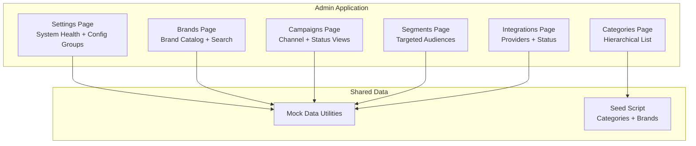
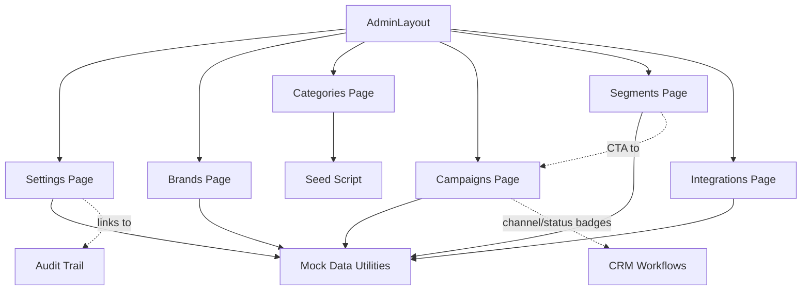
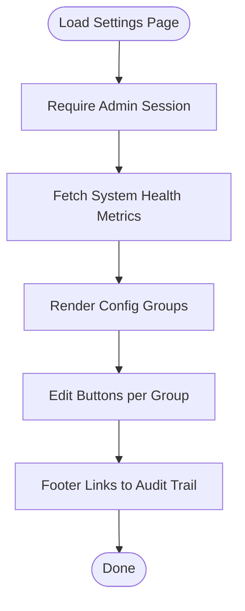
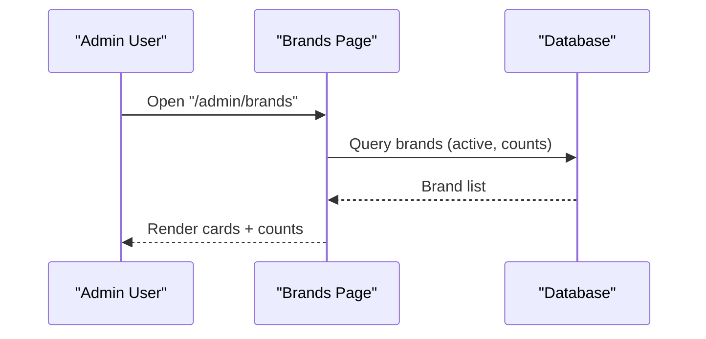
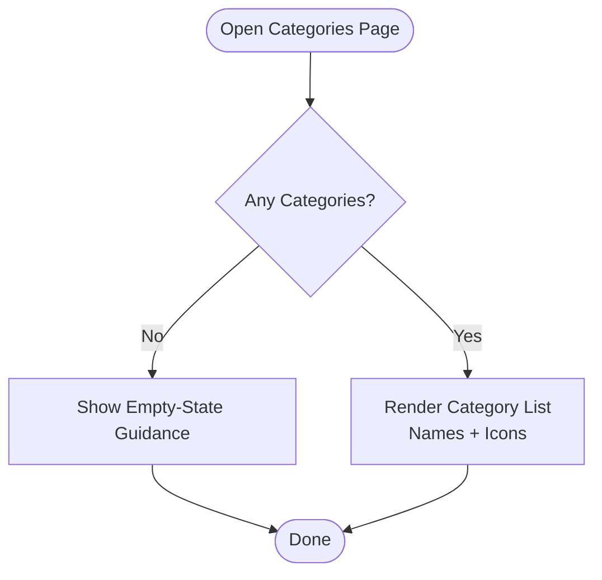
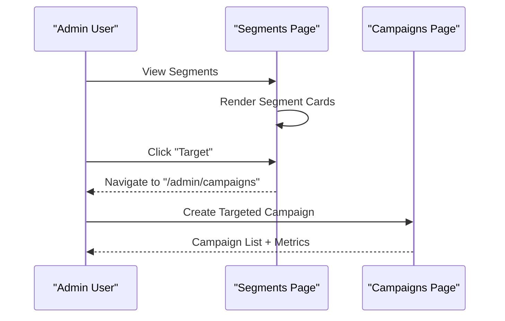
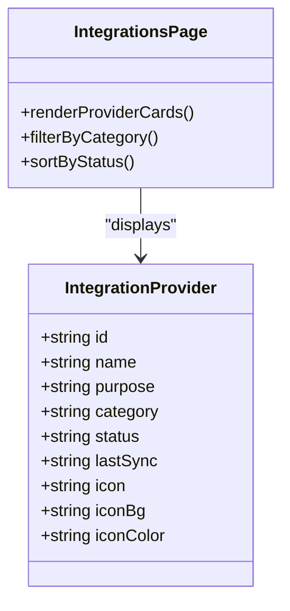
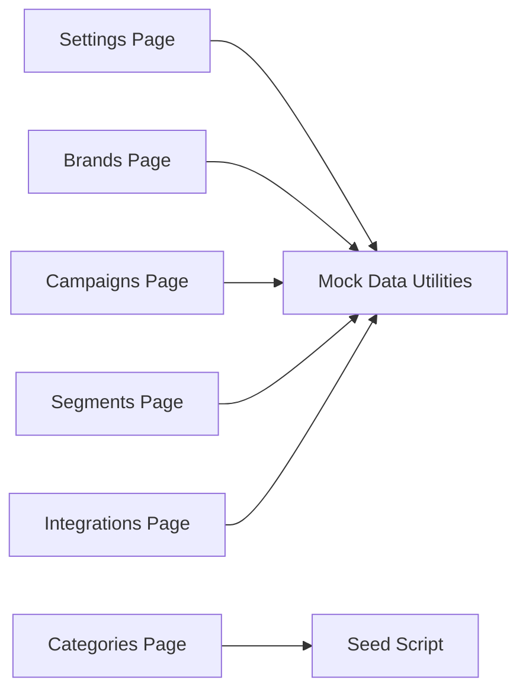

# Platform Configuration

<cite>
**Referenced Files in This Document**
- [apps/admin/src/app/settings/page.tsx](file://apps/admin/src/app/settings/page.tsx)
- [apps/admin/src/app/brands/page.tsx](file://apps/admin/src/app/brands/page.tsx)
- [apps/customer/src/app/brands/page.tsx](file://apps/customer/src/app/brands/page.tsx)
- [apps/admin/src/app/categories/page.tsx](file://apps/admin/src/app/categories/page.tsx)
- [apps/admin/src/app/campaigns/page.tsx](file://apps/admin/src/app/campaigns/page.tsx)
- [apps/admin/src/app/segments/page.tsx](file://apps/admin/src/app/segments/page.tsx)
- [apps/admin/src/app/integrations/page.tsx](file://apps/admin/src/app/integrations/page.tsx)
- [packages/database/prisma/seed.ts](file://packages/database/prisma/seed.ts)
- [packages/database/src/mock-data.ts](file://packages/database/src/mock-data.ts)
- [MODULE_09_ADMIN_SETTINGS_NOTES.md](file://MODULE_09_ADMIN_SETTINGS_NOTES.md)
- [MODULE_06_CRM_GROWTH_NOTES.md](file://MODULE_06_CRM_GROWTH_NOTES.md)
</cite>

## Table of Contents
1. [Introduction](#introduction)
2. [Project Structure](#project-structure)
3. [Core Components](#core-components)
4. [Architecture Overview](#architecture-overview)
5. [Detailed Component Analysis](#detailed-component-analysis)
6. [Dependency Analysis](#dependency-analysis)
7. [Performance Considerations](#performance-considerations)
8. [Troubleshooting Guide](#troubleshooting-guide)
9. [Conclusion](#conclusion)
10. [Appendices](#appendices)

## Introduction
This document describes the Platform Configuration capabilities implemented in the admin application, focusing on system settings, brand management, category organization, marketing campaigns, and integration setup. It synthesizes the current admin UI pages and supporting mock data to explain how platform configuration is presented and managed, along with the underlying data model foundations.

## Project Structure
The platform configuration surface area spans several admin pages and shared data utilities:
- System settings and health monitoring
- Brand management for multi-brand marketplace configuration
- Category hierarchy and catalog structure
- Marketing campaigns and segmentation
- Integration hub for payment, shipping, accounting, messaging, and search providers

**Diagram sources**
- [apps/admin/src/app/settings/page.tsx:43-148](file://apps/admin/src/app/settings/page.tsx#L43-L148)
- [apps/admin/src/app/brands/page.tsx:8-47](file://apps/admin/src/app/brands/page.tsx#L8-L47)
- [apps/admin/src/app/categories/page.tsx:29-51](file://apps/admin/src/app/categories/page.tsx#L29-L51)
- [apps/admin/src/app/campaigns/page.tsx:24-28](file://apps/admin/src/app/campaigns/page.tsx#L24-L28)
- [apps/admin/src/app/segments/page.tsx:110-130](file://apps/admin/src/app/segments/page.tsx#L110-L130)
- [apps/admin/src/app/integrations/page.tsx:46-98](file://apps/admin/src/app/integrations/page.tsx#L46-L98)
- [packages/database/src/mock-data.ts:315-323](file://packages/database/src/mock-data.ts#L315-L323)
- [packages/database/prisma/seed.ts:186-235](file://packages/database/prisma/seed.ts#L186-L235)

**Section sources**
- [apps/admin/src/app/settings/page.tsx:43-148](file://apps/admin/src/app/settings/page.tsx#L43-L148)
- [apps/admin/src/app/brands/page.tsx:8-47](file://apps/admin/src/app/brands/page.tsx#L8-L47)
- [apps/admin/src/app/categories/page.tsx:29-51](file://apps/admin/src/app/categories/page.tsx#L29-L51)
- [apps/admin/src/app/campaigns/page.tsx:24-28](file://apps/admin/src/app/campaigns/page.tsx#L24-L28)
- [apps/admin/src/app/segments/page.tsx:110-130](file://apps/admin/src/app/segments/page.tsx#L110-L130)
- [apps/admin/src/app/integrations/page.tsx:46-98](file://apps/admin/src/app/integrations/page.tsx#L46-L98)
- [packages/database/src/mock-data.ts:315-323](file://packages/database/src/mock-data.ts#L315-L323)
- [packages/database/prisma/seed.ts:186-235](file://packages/database/prisma/seed.ts#L186-L235)

## Core Components
- System Settings and Health
  - Presents system health metrics and grouped configuration rows (e.g., General/Commerce/Notifications/Security).
  - Includes audit trail linkage and change logging semantics.
- Brand Management
  - Admin view: brand cards with counts and search.
  - Public view: brand browsing with product counts and optional country labels.
- Category Organization
  - Hierarchical category listing with localized names and icon identifiers.
  - Seed script establishes baseline categories for the catalog.
- Marketing Campaigns and Segmentation
  - Campaigns dashboard with channel and status badges.
  - Segments dashboard with targetable audience cards and quick-create CTA.
- Integration Hub
  - Provider cards showing category, connection status, and last-sync freshness.
  - Example providers include Payments, Shipping, Warehouse, Accounting, Messaging, and Search.

**Section sources**
- [apps/admin/src/app/settings/page.tsx:43-148](file://apps/admin/src/app/settings/page.tsx#L43-L148)
- [apps/admin/src/app/brands/page.tsx:8-47](file://apps/admin/src/app/brands/page.tsx#L8-L47)
- [apps/customer/src/app/brands/page.tsx:10-51](file://apps/customer/src/app/brands/page.tsx#L10-L51)
- [apps/admin/src/app/categories/page.tsx:29-51](file://apps/admin/src/app/categories/page.tsx#L29-L51)
- [packages/database/prisma/seed.ts:186-235](file://packages/database/prisma/seed.ts#L186-L235)
- [apps/admin/src/app/campaigns/page.tsx:24-28](file://apps/admin/src/app/campaigns/page.tsx#L24-L28)
- [apps/admin/src/app/segments/page.tsx:110-130](file://apps/admin/src/app/segments/page.tsx#L110-L130)
- [apps/admin/src/app/integrations/page.tsx:46-98](file://apps/admin/src/app/integrations/page.tsx#L46-L98)

## Architecture Overview
The configuration UIs are server-rendered admin pages that consume shared mock data and database utilities. They present curated views for platform operators while linking to audit and CRM workflows.

**Diagram sources**
- [apps/admin/src/app/settings/page.tsx:43-148](file://apps/admin/src/app/settings/page.tsx#L43-L148)
- [apps/admin/src/app/brands/page.tsx:8-47](file://apps/admin/src/app/brands/page.tsx#L8-L47)
- [apps/admin/src/app/categories/page.tsx:29-51](file://apps/admin/src/app/categories/page.tsx#L29-L51)
- [apps/admin/src/app/campaigns/page.tsx:24-28](file://apps/admin/src/app/campaigns/page.tsx#L24-L28)
- [apps/admin/src/app/segments/page.tsx:110-130](file://apps/admin/src/app/segments/page.tsx#L110-L130)
- [apps/admin/src/app/integrations/page.tsx:46-98](file://apps/admin/src/app/integrations/page.tsx#L46-L98)
- [packages/database/src/mock-data.ts:315-323](file://packages/database/src/mock-data.ts#L315-L323)
- [packages/database/prisma/seed.ts:186-235](file://packages/database/prisma/seed.ts#L186-L235)

## Detailed Component Analysis

### System Settings and Health
- Purpose: Centralize platform configuration visibility and operational oversight.
- Features:
  - System Health card with per-service status, latency, uptime, and summary metrics.
  - Four configuration groups rendered as editable rows (labels and values).
  - Audit trail linkage and footer note indicating change logging and approvals.
- Operational parameters exposed via mock data include commerce settings (commission rates, VAT), notifications channels, and security policies.

**Diagram sources**
- [apps/admin/src/app/settings/page.tsx:43-148](file://apps/admin/src/app/settings/page.tsx#L43-L148)
- [MODULE_09_ADMIN_SETTINGS_NOTES.md:35-40](file://MODULE_09_ADMIN_SETTINGS_NOTES.md#L35-L40)

**Section sources**
- [apps/admin/src/app/settings/page.tsx:43-148](file://apps/admin/src/app/settings/page.tsx#L43-L148)
- [MODULE_09_ADMIN_SETTINGS_NOTES.md:35-40](file://MODULE_09_ADMIN_SETTINGS_NOTES.md#L35-L40)

### Brand Management
- Admin view:
  - Brand cards with color swatches, country, product counts, and search input.
  - Placeholder for adding new brands.
- Public view:
  - Browse-by-brand grid with product counts and optional country labels.
  - Links to product listings filtered by brand.
- Underlying data:
  - Mock brands and product counts support the admin grid.
  - Seed script inserts brand records for the catalog.

**Diagram sources**
- [apps/admin/src/app/brands/page.tsx:8-47](file://apps/admin/src/app/brands/page.tsx#L8-L47)
- [apps/customer/src/app/brands/page.tsx:10-51](file://apps/customer/src/app/brands/page.tsx#L10-L51)
- [packages/database/prisma/seed.ts:222-235](file://packages/database/prisma/seed.ts#L222-L235)

**Section sources**
- [apps/admin/src/app/brands/page.tsx:8-47](file://apps/admin/src/app/brands/page.tsx#L8-L47)
- [apps/customer/src/app/brands/page.tsx:10-51](file://apps/customer/src/app/brands/page.tsx#L10-L51)
- [packages/database/prisma/seed.ts:222-235](file://packages/database/prisma/seed.ts#L222-L235)

### Category Organization
- Purpose: Define and visualize the hierarchical catalog structure.
- Features:
  - Empty-state guidance to create the first category.
  - List view with localized names and icon identifiers.
- Foundation:
  - Seed script creates baseline categories (e.g., Industrial Supplies, Electronics, Office Supplies, Safety & PPE, Food & Hospitality, Building Materials) with slugs, names, icons, and sort order.

**Diagram sources**
- [apps/admin/src/app/categories/page.tsx:29-51](file://apps/admin/src/app/categories/page.tsx#L29-L51)
- [packages/database/prisma/seed.ts:186-235](file://packages/database/prisma/seed.ts#L186-L235)

**Section sources**
- [apps/admin/src/app/categories/page.tsx:29-51](file://apps/admin/src/app/categories/page.tsx#L29-L51)
- [packages/database/prisma/seed.ts:186-235](file://packages/database/prisma/seed.ts#L186-L235)

### Marketing Campaigns and Segmentation
- Campaigns:
  - Channel badges (Email, SMS, WhatsApp) and status badges (Active, Scheduled, Completed).
  - Tabbed view and summary metrics for revenue and engagement.
- Segments:
  - Eight segment cards with growth indicators, average LTV, and member counts.
  - “Target” action navigates to campaigns to launch targeted outreach.
- Data:
  - Mock campaigns include channel, audience, status, and performance metrics.

**Diagram sources**
- [apps/admin/src/app/segments/page.tsx:110-130](file://apps/admin/src/app/segments/page.tsx#L110-L130)
- [apps/admin/src/app/campaigns/page.tsx:24-28](file://apps/admin/src/app/campaigns/page.tsx#L24-L28)
- [packages/database/src/mock-data.ts:315-323](file://packages/database/src/mock-data.ts#L315-L323)

**Section sources**
- [apps/admin/src/app/segments/page.tsx:110-130](file://apps/admin/src/app/segments/page.tsx#L110-L130)
- [apps/admin/src/app/campaigns/page.tsx:24-28](file://apps/admin/src/app/campaigns/page.tsx#L24-L28)
- [packages/database/src/mock-data.ts:315-323](file://packages/database/src/mock-data.ts#L315-L323)
- [MODULE_06_CRM_GROWTH_NOTES.md:35-66](file://MODULE_06_CRM_GROWTH_NOTES.md#L35-L66)

### Integration Setup
- Purpose: Manage connections to external services (payments, shipping, warehouse, accounting, messaging, search).
- Features:
  - Provider cards with category, status, and last-sync freshness.
  - Example providers include Payments, Aramex/DHL, Deposco WMS, Zoho Books, WhatsApp Business API, and Algolia Search.
- Status states:
  - CONNECTED, AVAILABLE, and others represented by status badges.

**Diagram sources**
- [apps/admin/src/app/integrations/page.tsx:46-98](file://apps/admin/src/app/integrations/page.tsx#L46-L98)

**Section sources**
- [apps/admin/src/app/integrations/page.tsx:46-98](file://apps/admin/src/app/integrations/page.tsx#L46-L98)

## Dependency Analysis
- UI pages depend on shared mock data and database utilities for rendering.
- Campaigns and segments leverage mock datasets for performance and audience metrics.
- Categories rely on seed scripts for initial structure.
- Integrations page consumes provider metadata arrays.

**Diagram sources**
- [apps/admin/src/app/settings/page.tsx:43-148](file://apps/admin/src/app/settings/page.tsx#L43-L148)
- [apps/admin/src/app/brands/page.tsx:8-47](file://apps/admin/src/app/brands/page.tsx#L8-L47)
- [apps/admin/src/app/categories/page.tsx:29-51](file://apps/admin/src/app/categories/page.tsx#L29-L51)
- [apps/admin/src/app/campaigns/page.tsx:24-28](file://apps/admin/src/app/campaigns/page.tsx#L24-L28)
- [apps/admin/src/app/segments/page.tsx:110-130](file://apps/admin/src/app/segments/page.tsx#L110-L130)
- [apps/admin/src/app/integrations/page.tsx:46-98](file://apps/admin/src/app/integrations/page.tsx#L46-L98)
- [packages/database/src/mock-data.ts:315-323](file://packages/database/src/mock-data.ts#L315-L323)
- [packages/database/prisma/seed.ts:186-235](file://packages/database/prisma/seed.ts#L186-L235)

**Section sources**
- [apps/admin/src/app/settings/page.tsx:43-148](file://apps/admin/src/app/settings/page.tsx#L43-L148)
- [apps/admin/src/app/brands/page.tsx:8-47](file://apps/admin/src/app/brands/page.tsx#L8-L47)
- [apps/admin/src/app/categories/page.tsx:29-51](file://apps/admin/src/app/categories/page.tsx#L29-L51)
- [apps/admin/src/app/campaigns/page.tsx:24-28](file://apps/admin/src/app/campaigns/page.tsx#L24-L28)
- [apps/admin/src/app/segments/page.tsx:110-130](file://apps/admin/src/app/segments/page.tsx#L110-L130)
- [apps/admin/src/app/integrations/page.tsx:46-98](file://apps/admin/src/app/integrations/page.tsx#L46-L98)
- [packages/database/src/mock-data.ts:315-323](file://packages/database/src/mock-data.ts#L315-L323)
- [packages/database/prisma/seed.ts:186-235](file://packages/database/prisma/seed.ts#L186-L235)

## Performance Considerations
- Server-side rendering of admin pages reduces client-side load and ensures immediate access to configuration data.
- Mock data and seed scripts enable fast local development and testing without live service dependencies.
- Grid and list components are optimized for minimal re-renders; pagination or virtualization could be considered for very large catalogs.

## Troubleshooting Guide
- Settings page shows system health:
  - Verify service statuses and uptime percentages; degraded services trigger a visual alert.
  - Use the audit trail link to review configuration changes and approvals.
- Brands page:
  - If no brands appear, confirm seeding or mock data availability.
  - Use the search bar to filter brands during development.
- Categories page:
  - If empty, create the first category to populate the list.
- Campaigns and Segments:
  - Ensure mock datasets are loaded; statuses and metrics reflect the provided arrays.
- Integrations:
  - Confirm provider categories and statuses; refresh last-sync indicators after manual triggers.

**Section sources**
- [apps/admin/src/app/settings/page.tsx:43-148](file://apps/admin/src/app/settings/page.tsx#L43-L148)
- [apps/admin/src/app/brands/page.tsx:8-47](file://apps/admin/src/app/brands/page.tsx#L8-L47)
- [apps/admin/src/app/categories/page.tsx:29-51](file://apps/admin/src/app/categories/page.tsx#L29-L51)
- [apps/admin/src/app/campaigns/page.tsx:24-28](file://apps/admin/src/app/campaigns/page.tsx#L24-L28)
- [apps/admin/src/app/segments/page.tsx:110-130](file://apps/admin/src/app/segments/page.tsx#L110-L130)
- [apps/admin/src/app/integrations/page.tsx:46-98](file://apps/admin/src/app/integrations/page.tsx#L46-L98)
- [packages/database/src/mock-data.ts:315-323](file://packages/database/src/mock-data.ts#L315-L323)
- [packages/database/prisma/seed.ts:186-235](file://packages/database/prisma/seed.ts#L186-L235)

## Conclusion
The Platform Configuration module consolidates system settings, brand management, category organization, marketing campaigns, and integration setup into cohesive admin experiences. While many features currently rely on mock data and seed scripts, the structure supports future expansion to real-time integrations and production-grade configuration workflows.

## Appendices
- Data model foundations:
  - Categories: seeded with localized names, slugs, icons, and sort order.
  - Brands: seeded with identifiers and countries.
  - Campaigns: mock datasets include channel, audience, status, and performance metrics.

**Section sources**
- [packages/database/prisma/seed.ts:186-235](file://packages/database/prisma/seed.ts#L186-L235)
- [packages/database/src/mock-data.ts:315-323](file://packages/database/src/mock-data.ts#L315-L323)