# System Oversight

<cite>
**Referenced Files in This Document**
- [README.md](file://README.md)
- [MODULE_09_ADMIN_SETTINGS_NOTES.md](file://MODULE_09_ADMIN_SETTINGS_NOTES.md)
- [apps/admin/src/app/users/page.tsx](file://apps/admin/src/app/users/page.tsx)
- [apps/admin/src/app/companies/page.tsx](file://apps/admin/src/app/companies/page.tsx)
- [apps/admin/src/app/sellers/[id]/page.tsx](file://apps/admin/src/app/sellers/[id]/page.tsx)
- [apps/admin/src/app/sellers/pending/page.tsx](file://apps/admin/src/app/sellers/pending/page.tsx)
- [apps/admin/src/app/settings/page.tsx](file://apps/admin/src/app/settings/page.tsx)
- [apps/admin/src/app/brands/page.tsx](file://apps/admin/src/app/brands/page.tsx)
- [apps/admin/src/app/audit/page.tsx](file://apps/admin/src/app/audit/page.tsx)
- [apps/admin/src/app/compliance/page.tsx](file://apps/admin/src/app/compliance/page.tsx)
- [apps/admin/src/app/approvals/page.tsx](file://apps/admin/src/app/approvals/page.tsx)
- [apps/admin/src/app/api/admin/sellers/[id]/approve/route.ts](file://apps/admin/src/app/api/admin/sellers/[id]/approve/route.ts)
- [apps/admin/src/app/api/admin/sellers/[id]/reject/route.ts](file://apps/admin/src/app/api/admin/sellers/[id]/reject/route.ts)
- [apps/admin/src/app/api/admin/products/[id]/approve/route.ts](file://apps/admin/src/app/api/admin/products/[id]/approve/route.ts)
- [apps/admin/src/app/api/admin/compliance/[id]/approve/route.ts](file://apps/admin/src/app/api/admin/compliance/[id]/approve/route.ts)
- [apps/admin/src/app/api/admin/compliance/[id]/reject/route.ts](file://apps/admin/src/app/api/admin/compliance/[id]/reject/route.ts)
- [apps/admin/src/lib/auth.ts](file://apps/admin/src/lib/auth.ts)
- [apps/admin/src/middleware.ts](file://apps/admin/src/middleware.ts)
- [apps/admin/src/components/layout/admin-layout.tsx](file://apps/admin/src/components/layout/admin-layout.tsx)
- [apps/admin/src/app/dashboard/dashboard-view.tsx](file://apps/admin/src/app/dashboard/dashboard-view.tsx)
- [apps/admin/src/app/login/page.tsx](file://apps/admin/src/app/login/page.tsx)
- [apps/admin/package.json](file://apps/admin/package.json)
- [apps/customer/src/app/b2b/team/actions.ts](file://apps/customer/src/app/b2b/team/actions.ts)
- [apps/customer/src/app/b2b/company/page.tsx](file://apps/customer/src/app/b2b/company/page.tsx)
- [apps/customer/src/app/b2b/register/page.tsx](file://apps/customer/src/app/b2b/register/page.tsx)
- [apps/customer/src/app/b2b/approval-policies/page.tsx](file://apps/customer/src/app/b2b/approval-policies/page.tsx)
- [apps/customer/src/app/b2b/approval-policies/actions.ts](file://apps/customer/src/app/b2b/approval-policies/actions.ts)
- [apps/customer/src/lib/b2b.ts](file://apps/customer/src/lib/b2b.ts)
- [apps/seller/src/app/products/actions.ts](file://apps/seller/src/app/products/actions.ts)
- [apps/seller/src/app/orders/actions.ts](file://apps/seller/src/app/orders/actions.ts)
- [apps/seller/src/app/shipments/actions.ts](file://apps/seller/src/app/shipments/actions.ts)
- [apps/seller/src/app/saved-views/actions.ts](file://apps/seller/src/app/saved-views/actions.ts)
- [apps/seller/src/lib/auth.ts](file://apps/seller/src/lib/auth.ts)
- [apps/seller/src/middleware.ts](file://apps/seller/src/middleware.ts)
- [apps/seller/src/app/login/page.tsx](file://apps/seller/src/app/login/page.tsx)
- [apps/seller/src/app/dashboard/page.tsx](file://apps/seller/src/app/dashboard/page.tsx)
- [apps/seller/src/app/analytics/page.tsx](file://apps/seller/src/app/analytics/page.tsx)
- [apps/seller/src/app/inventory/page.tsx](file://apps/seller/src/app/inventory/page.tsx)
- [apps/seller/src/app/commission/page.tsx](file://apps/seller/src/app/commission/page.tsx)
- [apps/seller/src/app/compliance/page.tsx](file://apps/seller/src/app/compliance/page.tsx)
- [apps/seller/src/app/issues/page.tsx](file://apps/seller/src/app/issues/page.tsx)
- [apps/seller/src/app/messages/page.tsx](file://apps/seller/src/app/messages/page.tsx)
- [apps/seller/src/app/onboarding/page.tsx](file://apps/seller/src/app/onboarding/page.tsx)
- [apps/seller/src/app/payouts/page.tsx](file://apps/seller/src/app/payouts/page.tsx)
- [apps/seller/src/app/performance/page.tsx](file://apps/seller/src/app/performance/page.tsx)
- [apps/seller/src/app/products/page.tsx](file://apps/seller/src/app/products/page.tsx)
- [apps/seller/src/app/quotes/page.tsx](file://apps/seller/src/app/quotes/page.tsx)
- [apps/seller/src/app/returns/page.tsx](file://apps/seller/src/app/returns/page.tsx)
- [apps/seller/src/app/shipments/page.tsx](file://apps/seller/src/app/shipments/page.tsx)
- [apps/seller/src/app/api/seller/dashboard/route.ts](file://apps/seller/src/app/api/seller/dashboard/route.ts)
- [apps/seller/src/app/api/seller/orders/route.ts](file://apps/seller/src/app/api/seller/orders/route.ts)
- [apps/seller/src/app/api/notifications/route.ts](file://apps/seller/src/app/api/notifications/route.ts)
- [apps/seller/src/app/api/ai/draft/route.ts](file://apps/seller/src/app/api/ai/draft/route.ts)
- [apps/seller/src/lib/auth-instance.ts](file://apps/seller/src/lib/auth-instance.ts)
- [apps/customer/src/lib/auth-instance.ts](file://apps/customer/src/lib/auth-instance.ts)
- [apps/customer/src/app/login/page.tsx](file://apps/customer/src/app/login/page.tsx)
- [apps/customer/src/app/register/page.tsx](file://apps/customer/src/app/register/page.tsx)
- [apps/customer/src/app/b2b/register/business/page.tsx](file://apps/customer/src/app/b2b/register/business/page.tsx)
- [apps/customer/src/app/b2b/register/consumer/page.tsx](file://apps/customer/src/app/b2b/register/consumer/page.tsx)
- [apps/customer/src/app/api/auth/[...nextauth]/route.ts](file://apps/customer/src/app/api/auth/[...nextauth]/route.ts)
- [apps/customer/src/app/api/register/business/route.ts](file://apps/customer/src/app/api/register/business/route.ts)
- [apps/customer/src/app/api/register/consumer/route.ts](file://apps/customer/src/app/api/register/consumer/route.ts)
- [apps/customer/src/app/api/categories/route.ts](file://apps/customer/src/app/api/categories/route.ts)
- [apps/customer/src/app/api/orders/route.ts](file://apps/customer/src/app/api/orders/route.ts)
- [apps/customer/src/app/api/payments/webhook/route.ts](file://apps/customer/src/app/api/payments/webhook/route.ts)
- [apps/customer/src/app/api/products/[slug]/route.ts](file://apps/customer/src/app/api/products/[slug]/route.ts)
- [apps/customer/src/lib/email.ts](file://apps/customer/src/lib/email.ts)
- [apps/customer/src/lib/b2b.ts](file://apps/customer/src/lib/b2b.ts)
- [apps/customer/src/middleware.ts](file://apps/customer/src/middleware.ts)
- [apps/customer/src/components/layout/main-layout.tsx](file://apps/customer/src/components/layout/main-layout.tsx)
- [apps/customer/src/components/layout/header.tsx](file://apps/customer/src/components/layout/header.tsx)
- [apps/customer/src/components/layout/footer.tsx](file://apps/customer/src/components/layout/footer.tsx)
- [apps/customer/src/components/layout/role-switcher.tsx](file://apps/customer/src/components/layout/role-switcher.tsx)
- [apps/customer/src/components/b2b/b2b-shell.tsx](file://apps/customer/src/components/b2b/b2b-shell.tsx)
- [apps/customer/src/components/b2b/reorder-button.tsx](file://apps/customer/src/components/b2b/reorder-button.tsx)
- [apps/customer/src/components/b2b/validated-form.tsx](file://apps/customer/src/components/b2b/validated-form.tsx)
- [apps/customer/src/stores/cart.ts](file://apps/customer/src/stores/cart.ts)
- [apps/customer/src/stores/wishlist.ts](file://apps/customer/src/stores/wishlist.ts)
- [packages/auth/index.ts](file://packages/auth/index.ts)
- [packages/config/index.ts](file://packages/config/index.ts)
- [packages/database/index.ts](file://packages/database/index.ts)
- [packages/types/index.ts](file://packages/types/index.ts)
- [packages/ui/index.ts](file://packages/ui/index.ts)
- [packages/utils/index.ts](file://packages/utils/index.ts)
- [packages/email-templates/index.ts](file://packages/email-templates/index.ts)
- [turbo.json](file://turbo.json)
- [pnpm-workspace.yaml](file://pnpm-workspace.yaml)
- [package.json](file://package.json)
</cite>

## Table of Contents
1. [Introduction](#introduction)
2. [Project Structure](#project-structure)
3. [Core Components](#core-components)
4. [Architecture Overview](#architecture-overview)
5. [Detailed Component Analysis](#detailed-component-analysis)
6. [Dependency Analysis](#dependency-analysis)
7. [Performance Considerations](#performance-considerations)
8. [Troubleshooting Guide](#troubleshooting-guide)
9. [Conclusion](#conclusion)
10. [Appendices](#appendices)

## Introduction
This document describes the System Oversight module of the commerce platform, focusing on administrative capabilities for user management, company and seller administration, system configuration, compliance and approvals, audit and monitoring, and security controls. It synthesizes the available frontend pages, API routes, and shared packages to explain how oversight tasks are organized across the admin application and supporting libraries.

## Project Structure
The System Oversight module is primarily implemented in the admin application, complemented by shared packages for authentication, configuration, database, types, UI, and utilities. The admin app exposes dedicated pages for users, companies, sellers, settings, brands, audit, compliance, and approvals, along with API routes under /api/admin for administrative actions such as approvals and rejections.

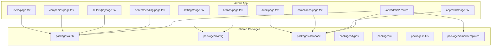

**Diagram sources**
- [apps/admin/src/app/users/page.tsx](file://apps/admin/src/app/users/page.tsx)
- [apps/admin/src/app/companies/page.tsx](file://apps/admin/src/app/companies/page.tsx)
- [apps/admin/src/app/sellers/[id]/page.tsx](file://apps/admin/src/app/sellers/[id]/page.tsx)
- [apps/admin/src/app/sellers/pending/page.tsx](file://apps/admin/src/app/sellers/pending/page.tsx)
- [apps/admin/src/app/settings/page.tsx](file://apps/admin/src/app/settings/page.tsx)
- [apps/admin/src/app/brands/page.tsx](file://apps/admin/src/app/brands/page.tsx)
- [apps/admin/src/app/audit/page.tsx](file://apps/admin/src/app/audit/page.tsx)
- [apps/admin/src/app/compliance/page.tsx](file://apps/admin/src/app/compliance/page.tsx)
- [apps/admin/src/app/approvals/page.tsx](file://apps/admin/src/app/approvals/page.tsx)
- [apps/admin/src/app/api/admin/sellers/[id]/approve/route.ts](file://apps/admin/src/app/api/admin/sellers/[id]/approve/route.ts)
- [apps/admin/src/app/api/admin/sellers/[id]/reject/route.ts](file://apps/admin/src/app/api/admin/sellers/[id]/reject/route.ts)
- [apps/admin/src/app/api/admin/products/[id]/approve/route.ts](file://apps/admin/src/app/api/admin/products/[id]/approve/route.ts)
- [apps/admin/src/app/api/admin/compliance/[id]/approve/route.ts](file://apps/admin/src/app/api/admin/compliance/[id]/approve/route.ts)
- [apps/admin/src/app/api/admin/compliance/[id]/reject/route.ts](file://apps/admin/src/app/api/admin/compliance/[id]/reject/route.ts)
- [packages/auth/index.ts](file://packages/auth/index.ts)
- [packages/config/index.ts](file://packages/config/index.ts)
- [packages/database/index.ts](file://packages/database/index.ts)
- [packages/types/index.ts](file://packages/types/index.ts)
- [packages/ui/index.ts](file://packages/ui/index.ts)
- [packages/utils/index.ts](file://packages/utils/index.ts)
- [packages/email-templates/index.ts](file://packages/email-templates/index.ts)

**Section sources**
- [apps/admin/src/app/users/page.tsx](file://apps/admin/src/app/users/page.tsx)
- [apps/admin/src/app/companies/page.tsx](file://apps/admin/src/app/companies/page.tsx)
- [apps/admin/src/app/sellers/[id]/page.tsx](file://apps/admin/src/app/sellers/[id]/page.tsx)
- [apps/admin/src/app/sellers/pending/page.tsx](file://apps/admin/src/app/sellers/pending/page.tsx)
- [apps/admin/src/app/settings/page.tsx](file://apps/admin/src/app/settings/page.tsx)
- [apps/admin/src/app/brands/page.tsx](file://apps/admin/src/app/brands/page.tsx)
- [apps/admin/src/app/audit/page.tsx](file://apps/admin/src/app/audit/page.tsx)
- [apps/admin/src/app/compliance/page.tsx](file://apps/admin/src/app/compliance/page.tsx)
- [apps/admin/src/app/approvals/page.tsx](file://apps/admin/src/app/approvals/page.tsx)
- [packages/auth/index.ts](file://packages/auth/index.ts)
- [packages/config/index.ts](file://packages/config/index.ts)
- [packages/database/index.ts](file://packages/database/index.ts)
- [packages/types/index.ts](file://packages/types/index.ts)
- [packages/ui/index.ts](file://packages/ui/index.ts)
- [packages/utils/index.ts](file://packages/utils/index.ts)
- [packages/email-templates/index.ts](file://packages/email-templates/index.ts)

## Core Components
- Users management: Admin users page for managing platform users.
- Company administration: Admin companies page for managing organizations.
- Seller administration: Admin seller detail and pending seller pages for onboarding and verification workflows.
- System configuration: Admin settings and brands pages for platform customization.
- Compliance and approvals: Admin compliance and approvals pages for oversight workflows.
- Audit and monitoring: Admin audit page for compliance logging and administrative activity monitoring.
- Security and access control: Authentication and middleware utilities across admin, customer, and seller apps.

**Section sources**
- [apps/admin/src/app/users/page.tsx](file://apps/admin/src/app/users/page.tsx)
- [apps/admin/src/app/companies/page.tsx](file://apps/admin/src/app/companies/page.tsx)
- [apps/admin/src/app/sellers/[id]/page.tsx](file://apps/admin/src/app/sellers/[id]/page.tsx)
- [apps/admin/src/app/sellers/pending/page.tsx](file://apps/admin/src/app/sellers/pending/page.tsx)
- [apps/admin/src/app/settings/page.tsx](file://apps/admin/src/app/settings/page.tsx)
- [apps/admin/src/app/brands/page.tsx](file://apps/admin/src/app/brands/page.tsx)
- [apps/admin/src/app/compliance/page.tsx](file://apps/admin/src/app/compliance/page.tsx)
- [apps/admin/src/app/approvals/page.tsx](file://apps/admin/src/app/approvals/page.tsx)
- [apps/admin/src/app/audit/page.tsx](file://apps/admin/src/app/audit/page.tsx)
- [apps/admin/src/lib/auth.ts](file://apps/admin/src/lib/auth.ts)
- [apps/admin/src/middleware.ts](file://apps/admin/src/middleware.ts)

## Architecture Overview
The System Oversight module follows a Next.js app router architecture with route handlers under /api/admin for administrative operations. Pages in the admin app delegate to shared packages for authentication, configuration, database, and utilities. Middleware enforces access control, while authentication utilities manage session and role-based access.

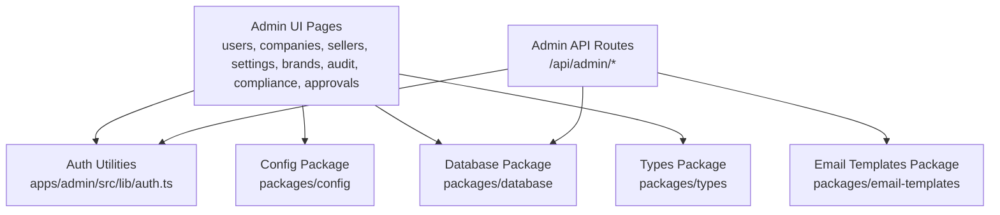

**Diagram sources**
- [apps/admin/src/app/users/page.tsx](file://apps/admin/src/app/users/page.tsx)
- [apps/admin/src/app/api/admin/sellers/[id]/approve/route.ts](file://apps/admin/src/app/api/admin/sellers/[id]/approve/route.ts)
- [apps/admin/src/lib/auth.ts](file://apps/admin/src/lib/auth.ts)
- [packages/config/index.ts](file://packages/config/index.ts)
- [packages/database/index.ts](file://packages/database/index.ts)
- [packages/types/index.ts](file://packages/types/index.ts)
- [packages/email-templates/index.ts](file://packages/email-templates/index.ts)

## Detailed Component Analysis

### User Management
- Purpose: Manage platform users within the admin interface.
- Key pages: users page.
- Access control: Protected by admin authentication and middleware.
- Related utilities: Authentication helpers and shared types.

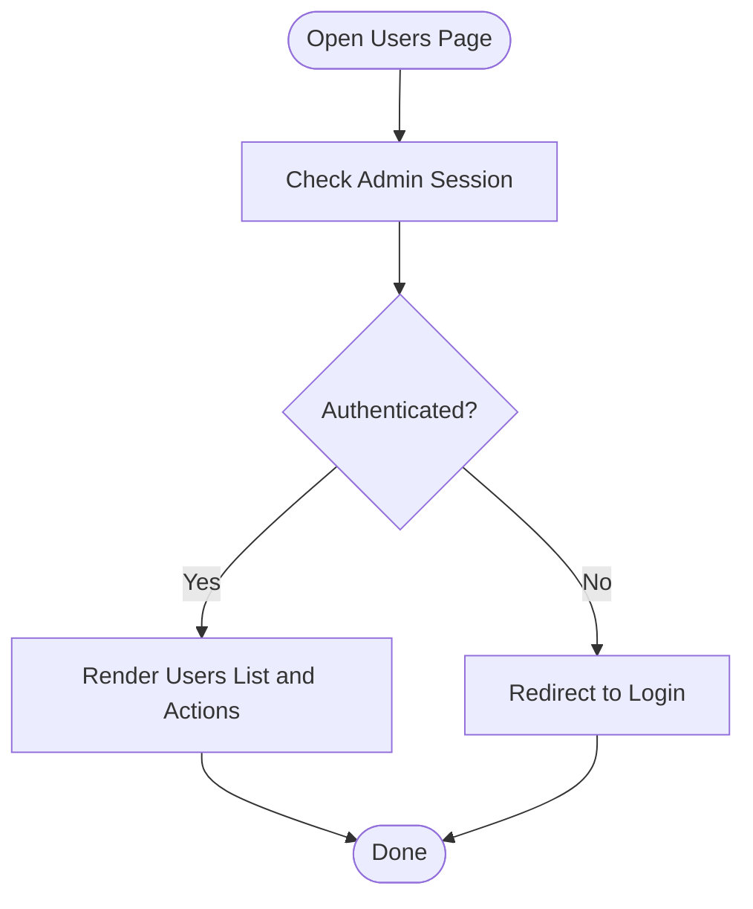

**Diagram sources**
- [apps/admin/src/app/users/page.tsx](file://apps/admin/src/app/users/page.tsx)
- [apps/admin/src/lib/auth.ts](file://apps/admin/src/lib/auth.ts)
- [apps/admin/src/middleware.ts](file://apps/admin/src/middleware.ts)

**Section sources**
- [apps/admin/src/app/users/page.tsx](file://apps/admin/src/app/users/page.tsx)
- [apps/admin/src/lib/auth.ts](file://apps/admin/src/lib/auth.ts)
- [apps/admin/src/middleware.ts](file://apps/admin/src/middleware.ts)

### Company Administration
- Purpose: Manage organizations and their administrative details.
- Key pages: companies page.
- Access control: Admin-only via middleware and auth checks.
- Related utilities: Shared auth and database packages.

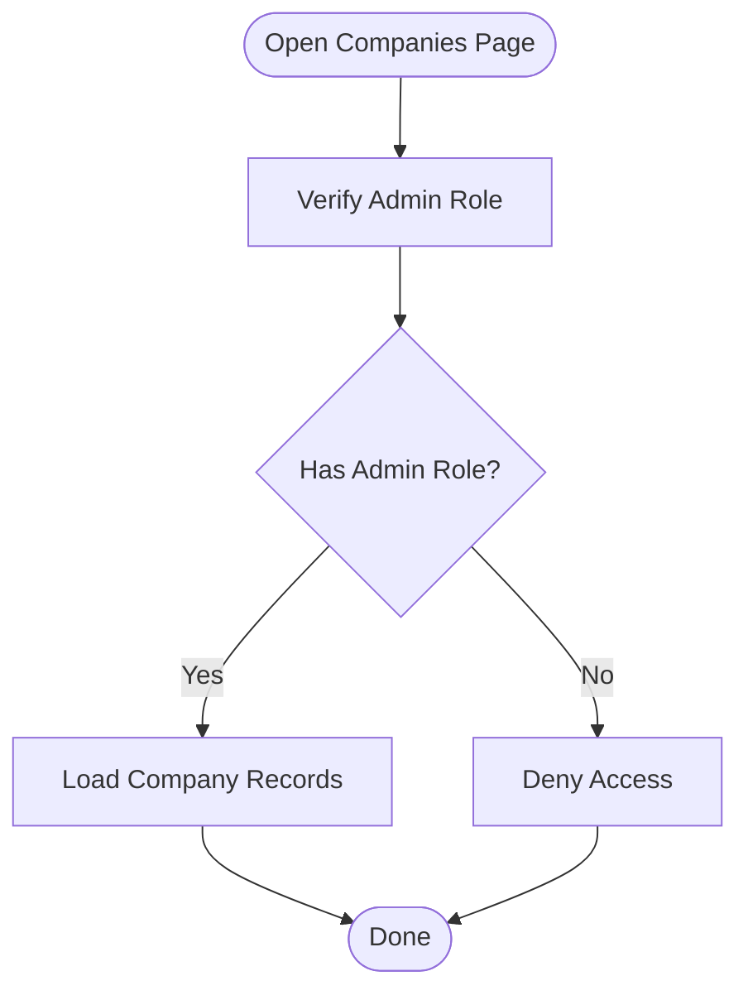

**Diagram sources**
- [apps/admin/src/app/companies/page.tsx](file://apps/admin/src/app/companies/page.tsx)
- [apps/admin/src/lib/auth.ts](file://apps/admin/src/lib/auth.ts)
- [apps/admin/src/middleware.ts](file://apps/admin/src/middleware.ts)

**Section sources**
- [apps/admin/src/app/companies/page.tsx](file://apps/admin/src/app/companies/page.tsx)
- [apps/admin/src/lib/auth.ts](file://apps/admin/src/lib/auth.ts)
- [apps/admin/src/middleware.ts](file://apps/admin/src/middleware.ts)

### Seller Management and Verification Workflows
- Purpose: Onboard and verify sellers, handle approval/rejection decisions.
- Key pages: seller detail ([id]) and pending sellers list.
- API actions: Approve and reject routes under /api/admin/sellers/[id].
- Workflow: Review seller profile and documents, approve to activate, reject with feedback.
- Access control: Admin-only.

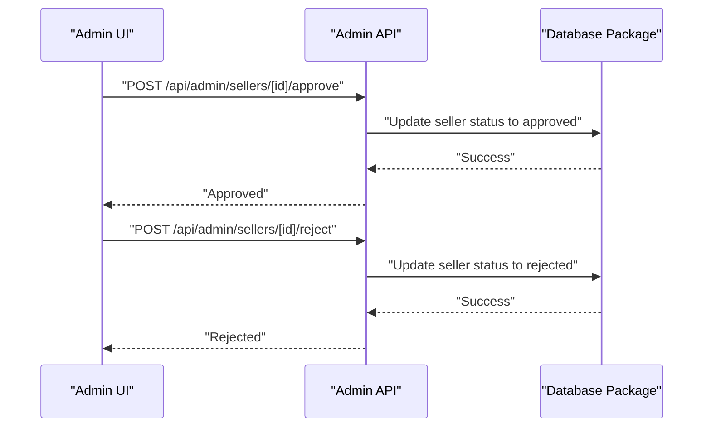

**Diagram sources**
- [apps/admin/src/app/sellers/[id]/page.tsx](file://apps/admin/src/app/sellers/[id]/page.tsx)
- [apps/admin/src/app/sellers/pending/page.tsx](file://apps/admin/src/app/sellers/pending/page.tsx)
- [apps/admin/src/app/api/admin/sellers/[id]/approve/route.ts](file://apps/admin/src/app/api/admin/sellers/[id]/approve/route.ts)
- [apps/admin/src/app/api/admin/sellers/[id]/reject/route.ts](file://apps/admin/src/app/api/admin/sellers/[id]/reject/route.ts)
- [packages/database/index.ts](file://packages/database/index.ts)

**Section sources**
- [apps/admin/src/app/sellers/[id]/page.tsx](file://apps/admin/src/app/sellers/[id]/page.tsx)
- [apps/admin/src/app/sellers/pending/page.tsx](file://apps/admin/src/app/sellers/pending/page.tsx)
- [apps/admin/src/app/api/admin/sellers/[id]/approve/route.ts](file://apps/admin/src/app/api/admin/sellers/[id]/approve/route.ts)
- [apps/admin/src/app/api/admin/sellers/[id]/reject/route.ts](file://apps/admin/src/app/api/admin/sellers/[id]/reject/route.ts)
- [packages/database/index.ts](file://packages/database/index.ts)

### Product Approvals
- Purpose: Approve product listings for marketplace visibility.
- API action: Approve route under /api/admin/products/[id].
- Access control: Admin-only.

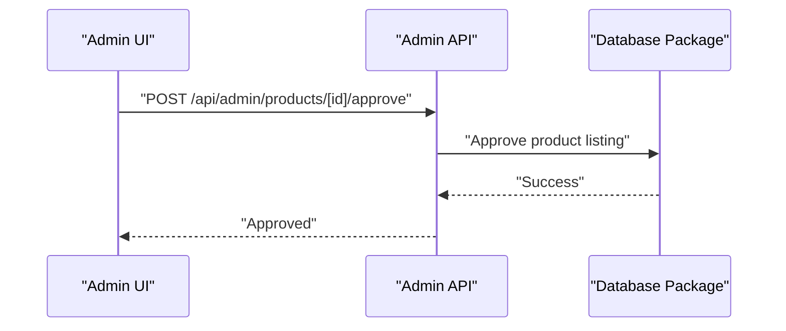

**Diagram sources**
- [apps/admin/src/app/api/admin/products/[id]/approve/route.ts](file://apps/admin/src/app/api/admin/products/[id]/approve/route.ts)
- [packages/database/index.ts](file://packages/database/index.ts)

**Section sources**
- [apps/admin/src/app/api/admin/products/[id]/approve/route.ts](file://apps/admin/src/app/api/admin/products/[id]/approve/route.ts)
- [packages/database/index.ts](file://packages/database/index.ts)

### Compliance and Approval Policies
- Purpose: Oversee compliance items and enforce approval policies.
- Key pages: compliance and approvals.
- API actions: Approve and reject routes under /api/admin/compliance/[id].
- Access control: Admin-only.

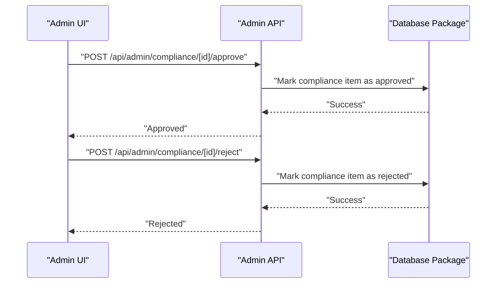

**Diagram sources**
- [apps/admin/src/app/compliance/page.tsx](file://apps/admin/src/app/compliance/page.tsx)
- [apps/admin/src/app/approvals/page.tsx](file://apps/admin/src/app/approvals/page.tsx)
- [apps/admin/src/app/api/admin/compliance/[id]/approve/route.ts](file://apps/admin/src/app/api/admin/compliance/[id]/approve/route.ts)
- [apps/admin/src/app/api/admin/compliance/[id]/reject/route.ts](file://apps/admin/src/app/api/admin/compliance/[id]/reject/route.ts)
- [packages/database/index.ts](file://packages/database/index.ts)

**Section sources**
- [apps/admin/src/app/compliance/page.tsx](file://apps/admin/src/app/compliance/page.tsx)
- [apps/admin/src/app/approvals/page.tsx](file://apps/admin/src/app/approvals/page.tsx)
- [apps/admin/src/app/api/admin/compliance/[id]/approve/route.ts](file://apps/admin/src/app/api/admin/compliance/[id]/approve/route.ts)
- [apps/admin/src/app/api/admin/compliance/[id]/reject/route.ts](file://apps/admin/src/app/api/admin/compliance/[id]/reject/route.ts)
- [packages/database/index.ts](file://packages/database/index.ts)

### Audit Trail and Administrative Monitoring
- Purpose: Track administrative activities and maintain compliance logs.
- Key page: audit.
- Data source: Database package for retrieving audit records.
- Access control: Admin-only.

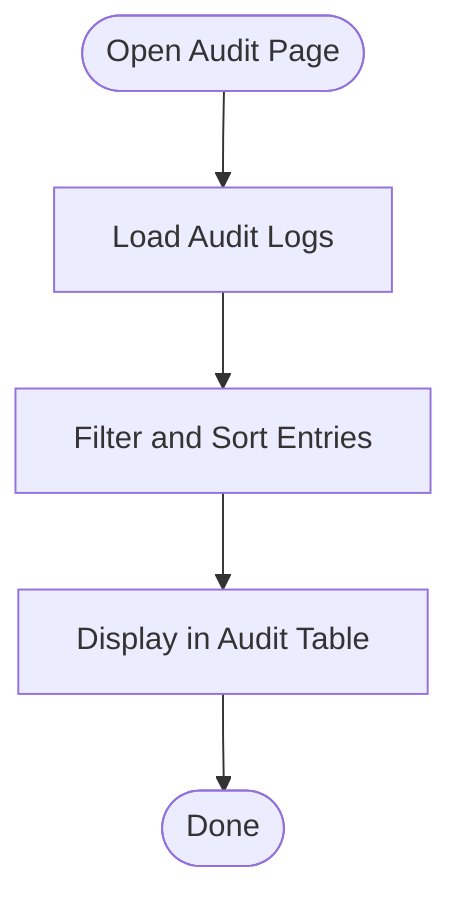

**Diagram sources**
- [apps/admin/src/app/audit/page.tsx](file://apps/admin/src/app/audit/page.tsx)
- [packages/database/index.ts](file://packages/database/index.ts)

**Section sources**
- [apps/admin/src/app/audit/page.tsx](file://apps/admin/src/app/audit/page.tsx)
- [packages/database/index.ts](file://packages/database/index.ts)

### System Settings and Brand Management
- Purpose: Configure platform-wide settings and manage brand assets.
- Key pages: settings and brands.
- Configuration source: Config package for platform settings.
- Access control: Admin-only.

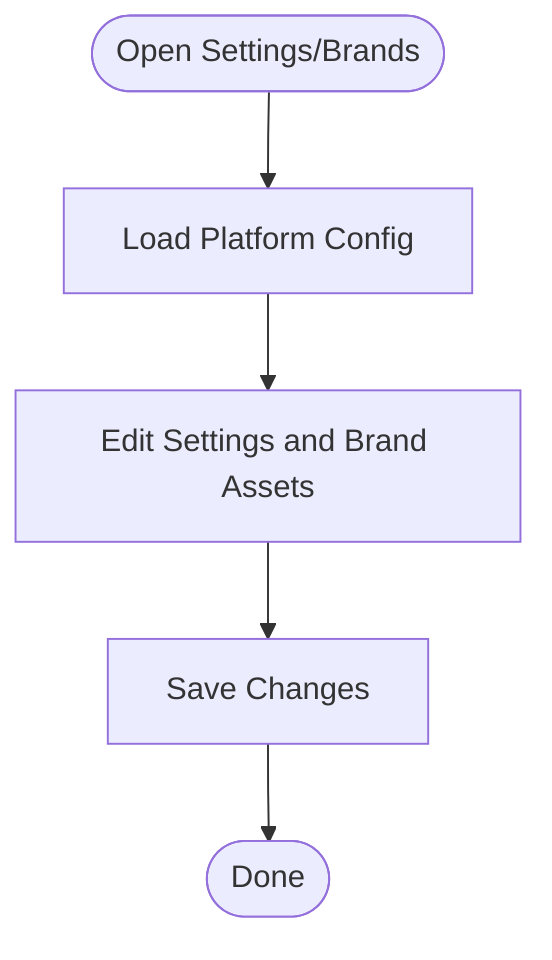

**Diagram sources**
- [apps/admin/src/app/settings/page.tsx](file://apps/admin/src/app/settings/page.tsx)
- [apps/admin/src/app/brands/page.tsx](file://apps/admin/src/app/brands/page.tsx)
- [packages/config/index.ts](file://packages/config/index.ts)

**Section sources**
- [apps/admin/src/app/settings/page.tsx](file://apps/admin/src/app/settings/page.tsx)
- [apps/admin/src/app/brands/page.tsx](file://apps/admin/src/app/brands/page.tsx)
- [packages/config/index.ts](file://packages/config/index.ts)

### Security Policies and Access Controls
- Authentication: Shared auth utilities and NextAuth integration.
- Middleware: Enforce admin access and role checks.
- Session management: Auth instances across admin, customer, and seller apps.
- Email templates: Shared package for notification templates.

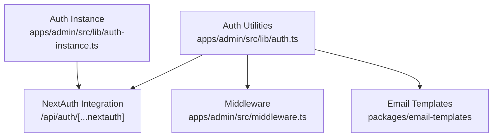

**Diagram sources**
- [apps/admin/src/lib/auth.ts](file://apps/admin/src/lib/auth.ts)
- [apps/admin/src/middleware.ts](file://apps/admin/src/middleware.ts)
- [apps/admin/src/lib/auth-instance.ts](file://apps/admin/src/lib/auth-instance.ts)
- [apps/customer/src/app/api/auth/[...nextauth]/route.ts](file://apps/customer/src/app/api/auth/[...nextauth]/route.ts)
- [packages/email-templates/index.ts](file://packages/email-templates/index.ts)

**Section sources**
- [apps/admin/src/lib/auth.ts](file://apps/admin/src/lib/auth.ts)
- [apps/admin/src/middleware.ts](file://apps/admin/src/middleware.ts)
- [apps/admin/src/lib/auth-instance.ts](file://apps/admin/src/lib/auth-instance.ts)
- [apps/customer/src/app/api/auth/[...nextauth]/route.ts](file://apps/customer/src/app/api/auth/[...nextauth]/route.ts)
- [packages/email-templates/index.ts](file://packages/email-templates/index.ts)

## Dependency Analysis
The admin app depends on shared packages for authentication, configuration, database, types, UI, and utilities. API routes depend on database and auth packages to enforce access control and persist changes.

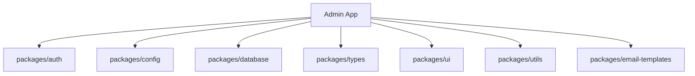

**Diagram sources**
- [apps/admin/src/app/users/page.tsx](file://apps/admin/src/app/users/page.tsx)
- [apps/admin/src/app/companies/page.tsx](file://apps/admin/src/app/companies/page.tsx)
- [apps/admin/src/app/api/admin/sellers/[id]/approve/route.ts](file://apps/admin/src/app/api/admin/sellers/[id]/approve/route.ts)
- [packages/auth/index.ts](file://packages/auth/index.ts)
- [packages/config/index.ts](file://packages/config/index.ts)
- [packages/database/index.ts](file://packages/database/index.ts)
- [packages/types/index.ts](file://packages/types/index.ts)
- [packages/ui/index.ts](file://packages/ui/index.ts)
- [packages/utils/index.ts](file://packages/utils/index.ts)
- [packages/email-templates/index.ts](file://packages/email-templates/index.ts)

**Section sources**
- [apps/admin/src/app/users/page.tsx](file://apps/admin/src/app/users/page.tsx)
- [apps/admin/src/app/companies/page.tsx](file://apps/admin/src/app/companies/page.tsx)
- [apps/admin/src/app/api/admin/sellers/[id]/approve/route.ts](file://apps/admin/src/app/api/admin/sellers/[id]/approve/route.ts)
- [packages/auth/index.ts](file://packages/auth/index.ts)
- [packages/config/index.ts](file://packages/config/index.ts)
- [packages/database/index.ts](file://packages/database/index.ts)
- [packages/types/index.ts](file://packages/types/index.ts)
- [packages/ui/index.ts](file://packages/ui/index.ts)
- [packages/utils/index.ts](file://packages/utils/index.ts)
- [packages/email-templates/index.ts](file://packages/email-templates/index.ts)

## Performance Considerations
- Pagination and filtering on audit and compliance tables to reduce payload sizes.
- Lazy loading of images and assets in settings and brands pages.
- Debounced search inputs for improved responsiveness.
- Efficient database queries using indexes for audit log retrieval and compliance status updates.

## Troubleshooting Guide
- Authentication failures: Verify NextAuth configuration and session cookies; check middleware enforcement.
- Authorization errors: Confirm admin role presence and middleware permissions.
- API route failures: Inspect database connectivity and transaction handling; validate request payloads.
- Audit logs missing: Ensure audit logging is enabled and database writes succeed.

**Section sources**
- [apps/admin/src/lib/auth.ts](file://apps/admin/src/lib/auth.ts)
- [apps/admin/src/middleware.ts](file://apps/admin/src/middleware.ts)
- [apps/admin/src/app/api/admin/sellers/[id]/approve/route.ts](file://apps/admin/src/app/api/admin/sellers/[id]/approve/route.ts)
- [apps/admin/src/app/api/admin/compliance/[id]/approve/route.ts](file://apps/admin/src/app/api/admin/compliance/[id]/approve/route.ts)

## Conclusion
The System Oversight module provides a comprehensive administrative surface for managing users, companies, sellers, and system configuration, supported by robust compliance workflows, audit logging, and centralized security controls. The modular design leverages shared packages to ensure consistency and maintainability across the platform.

## Appendices
- Additional B2B and customer-facing pages demonstrate complementary workflows for team management, company registration, and approval policies, reinforcing the broader administrative ecosystem.

**Section sources**
- [apps/customer/src/app/b2b/team/actions.ts](file://apps/customer/src/app/b2b/team/actions.ts)
- [apps/customer/src/app/b2b/company/page.tsx](file://apps/customer/src/app/b2b/company/page.tsx)
- [apps/customer/src/app/b2b/register/page.tsx](file://apps/customer/src/app/b2b/register/page.tsx)
- [apps/customer/src/app/b2b/approval-policies/page.tsx](file://apps/customer/src/app/b2b/approval-policies/page.tsx)
- [apps/customer/src/app/b2b/approval-policies/actions.ts](file://apps/customer/src/app/b2b/approval-policies/actions.ts)
- [apps/customer/src/lib/b2b.ts](file://apps/customer/src/lib/b2b.ts)