# Admin Portal

<cite>
**Referenced Files in This Document**
- [apps/admin/src/app/layout.tsx](file://apps/admin/src/app/layout.tsx)
- [apps/admin/src/middleware.ts](file://apps/admin/src/middleware.ts)
- [apps/admin/src/lib/auth.ts](file://apps/admin/src/lib/auth.ts)
- [apps/admin/src/components/layout/admin-layout.tsx](file://apps/admin/src/components/layout/admin-layout.tsx)
- [apps/admin/src/app/dashboard/page.tsx](file://apps/admin/src/app/dashboard/page.tsx)
- [apps/admin/src/app/dashboard/dashboard-view.tsx](file://apps/admin/src/app/dashboard/dashboard-view.tsx)
- [apps/admin/src/app/users/page.tsx](file://apps/admin/src/app/users/page.tsx)
- [apps/admin/src/app/sellers/page.tsx](file://apps/admin/src/app/sellers/page.tsx)
- [apps/admin/src/app/compliance/page.tsx](file://apps/admin/src/app/compliance/page.tsx)
- [apps/admin/src/app/audit/page.tsx](file://apps/admin/src/app/audit/page.tsx)
- [apps/admin/src/app/disputes/page.tsx](file://apps/admin/src/app/disputes/page.tsx)
- [apps/admin/src/app/ai-insights/page.tsx](file://apps/admin/src/app/ai-insights/page.tsx)
- [apps/admin/src/app/performance/page.tsx](file://apps/admin/src/app/performance/page.tsx)
- [apps/admin/src/app/settings/page.tsx](file://apps/admin/src/app/settings/page.tsx)
- [apps/admin/src/app/integrations/page.tsx](file://apps/admin/src/app/integrations/page.tsx)
- [apps/admin/src/app/api/admin/dashboard/route.ts](file://apps/admin/src/app/api/admin/dashboard/route.ts)
</cite>

## Table of Contents
1. [Introduction](#introduction)
2. [Project Structure](#project-structure)
3. [Core Components](#core-components)
4. [Architecture Overview](#architecture-overview)
5. [Detailed Component Analysis](#detailed-component-analysis)
6. [Dependency Analysis](#dependency-analysis)
7. [Performance Considerations](#performance-considerations)
8. [Troubleshooting Guide](#troubleshooting-guide)
9. [Conclusion](#conclusion)
10. [Appendices](#appendices)

## Introduction
The Admin Portal is the central command center for overseeing the marketplace operations, enforcing compliance, and driving business intelligence. It provides:
- Executive dashboard with real-time performance metrics and AI-powered insights
- User and supplier management with role-based access controls
- Content moderation and compliance monitoring
- Operational oversight across orders, finance, and support
- Integration hub for third-party systems
- Audit trail and system configuration management

## Project Structure
The Admin application is a Next.js app under apps/admin. Key areas:
- Routing and pages under apps/admin/src/app
- Shared UI and layout under apps/admin/src/components/layout
- Authentication utilities under apps/admin/src/lib
- Middleware for admin routing protection under apps/admin/src/middleware.ts
- Internationalization and theme-aware root layout under apps/admin/src/app/layout.tsx

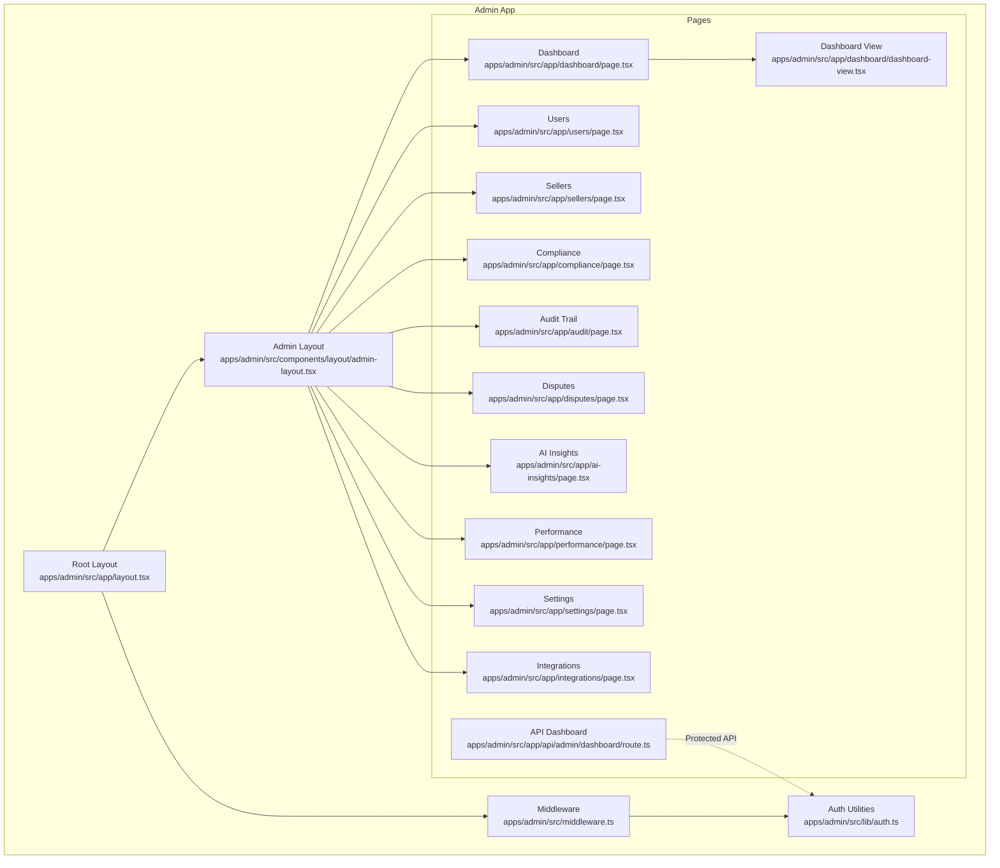

**Diagram sources**
- [apps/admin/src/app/layout.tsx:1-27](file://apps/admin/src/app/layout.tsx#L1-L27)
- [apps/admin/src/middleware.ts:1-9](file://apps/admin/src/middleware.ts#L1-L9)
- [apps/admin/src/lib/auth.ts:1-11](file://apps/admin/src/lib/auth.ts#L1-L11)
- [apps/admin/src/components/layout/admin-layout.tsx:1-267](file://apps/admin/src/components/layout/admin-layout.tsx#L1-L267)
- [apps/admin/src/app/dashboard/page.tsx:1-28](file://apps/admin/src/app/dashboard/page.tsx#L1-L28)
- [apps/admin/src/app/dashboard/dashboard-view.tsx:1-383](file://apps/admin/src/app/dashboard/dashboard-view.tsx#L1-L383)
- [apps/admin/src/app/users/page.tsx:1-181](file://apps/admin/src/app/users/page.tsx#L1-L181)
- [apps/admin/src/app/sellers/page.tsx:1-94](file://apps/admin/src/app/sellers/page.tsx#L1-L94)
- [apps/admin/src/app/compliance/page.tsx:1-74](file://apps/admin/src/app/compliance/page.tsx#L1-L74)
- [apps/admin/src/app/audit/page.tsx:1-128](file://apps/admin/src/app/audit/page.tsx#L1-L128)
- [apps/admin/src/app/disputes/page.tsx:1-144](file://apps/admin/src/app/disputes/page.tsx#L1-L144)
- [apps/admin/src/app/ai-insights/page.tsx:1-318](file://apps/admin/src/app/ai-insights/page.tsx#L1-L318)
- [apps/admin/src/app/performance/page.tsx:1-97](file://apps/admin/src/app/performance/page.tsx#L1-L97)
- [apps/admin/src/app/settings/page.tsx:1-149](file://apps/admin/src/app/settings/page.tsx#L1-L149)
- [apps/admin/src/app/integrations/page.tsx:1-264](file://apps/admin/src/app/integrations/page.tsx#L1-L264)
- [apps/admin/src/app/api/admin/dashboard/route.ts:1-16](file://apps/admin/src/app/api/admin/dashboard/route.ts#L1-L16)

**Section sources**
- [apps/admin/src/app/layout.tsx:1-27](file://apps/admin/src/app/layout.tsx#L1-L27)
- [apps/admin/src/middleware.ts:1-9](file://apps/admin/src/middleware.ts#L1-L9)
- [apps/admin/src/lib/auth.ts:1-11](file://apps/admin/src/lib/auth.ts#L1-L11)
- [apps/admin/src/components/layout/admin-layout.tsx:1-267](file://apps/admin/src/components/layout/admin-layout.tsx#L1-L267)

## Core Components
- Root layout and internationalization provider for the Admin app
- Middleware enforcing admin-only access and protected routes
- Authentication utilities ensuring ADMIN/SUPER_ADMIN roles
- Centralized admin navigation and responsive layout
- Dashboard rendering executive KPIs, AI recommendations, and operational health
- User management with role and status filtering
- Supplier directory with tiering, status, and compliance indicators
- Compliance monitoring for document reviews and expiry warnings
- Audit trail viewer with categories, actions, and export capability
- Disputes management with statuses, priorities, and resolution actions
- AI-powered insights grouped by domain with confidence and recommended actions
- Supplier performance metrics and scorecards
- Marketplace settings and system health monitoring
- Integration hub for connecting external systems

**Section sources**
- [apps/admin/src/app/layout.tsx:1-27](file://apps/admin/src/app/layout.tsx#L1-L27)
- [apps/admin/src/middleware.ts:1-9](file://apps/admin/src/middleware.ts#L1-L9)
- [apps/admin/src/lib/auth.ts:1-11](file://apps/admin/src/lib/auth.ts#L1-L11)
- [apps/admin/src/components/layout/admin-layout.tsx:1-267](file://apps/admin/src/components/layout/admin-layout.tsx#L1-L267)
- [apps/admin/src/app/dashboard/page.tsx:1-28](file://apps/admin/src/app/dashboard/page.tsx#L1-L28)
- [apps/admin/src/app/dashboard/dashboard-view.tsx:1-383](file://apps/admin/src/app/dashboard/dashboard-view.tsx#L1-L383)
- [apps/admin/src/app/users/page.tsx:1-181](file://apps/admin/src/app/users/page.tsx#L1-L181)
- [apps/admin/src/app/sellers/page.tsx:1-94](file://apps/admin/src/app/sellers/page.tsx#L1-L94)
- [apps/admin/src/app/compliance/page.tsx:1-74](file://apps/admin/src/app/compliance/page.tsx#L1-L74)
- [apps/admin/src/app/audit/page.tsx:1-128](file://apps/admin/src/app/audit/page.tsx#L1-L128)
- [apps/admin/src/app/disputes/page.tsx:1-144](file://apps/admin/src/app/disputes/page.tsx#L1-L144)
- [apps/admin/src/app/ai-insights/page.tsx:1-318](file://apps/admin/src/app/ai-insights/page.tsx#L1-L318)
- [apps/admin/src/app/performance/page.tsx:1-97](file://apps/admin/src/app/performance/page.tsx#L1-L97)
- [apps/admin/src/app/settings/page.tsx:1-149](file://apps/admin/src/app/settings/page.tsx#L1-L149)
- [apps/admin/src/app/integrations/page.tsx:1-264](file://apps/admin/src/app/integrations/page.tsx#L1-L264)

## Architecture Overview
The Admin Portal follows a layered architecture:
- Presentation layer: Next.js app pages and shared UI components
- Navigation and shell: AdminLayout provides unified sidebar, header, and quick actions
- Authentication and routing: Middleware and auth utilities enforce role-based access
- Data access: Pages fetch data from database utilities and pass serialized props to client components
- API surface: Protected admin dashboard endpoint validates roles and returns aggregated metrics

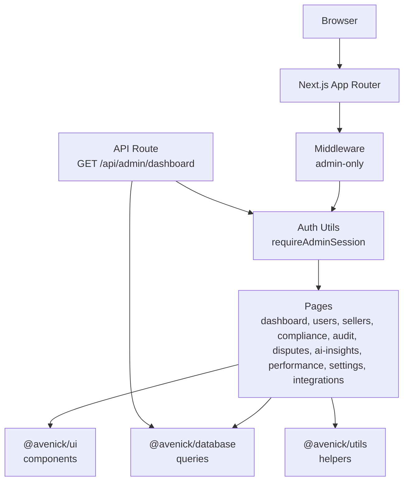

**Diagram sources**
- [apps/admin/src/middleware.ts:1-9](file://apps/admin/src/middleware.ts#L1-L9)
- [apps/admin/src/lib/auth.ts:1-11](file://apps/admin/src/lib/auth.ts#L1-L11)
- [apps/admin/src/app/dashboard/page.tsx:1-28](file://apps/admin/src/app/dashboard/page.tsx#L1-L28)
- [apps/admin/src/app/api/admin/dashboard/route.ts:1-16](file://apps/admin/src/app/api/admin/dashboard/route.ts#L1-L16)
- [apps/admin/src/app/dashboard/dashboard-view.tsx:1-383](file://apps/admin/src/app/dashboard/dashboard-view.tsx#L1-L383)

## Detailed Component Analysis

### Executive Dashboard
The dashboard aggregates live and mock data to present:
- Hero KPIs (GMV, B2B/B2C revenue, commission)
- Secondary stats (active companies/customers, suppliers, RFQ conversion, fulfillment rate, warehouse utilization)
- Operational alerts (open disputes, delayed orders)
- AI recommendations and operational health indicators
- Revenue split, funnel visualizations, and top performers

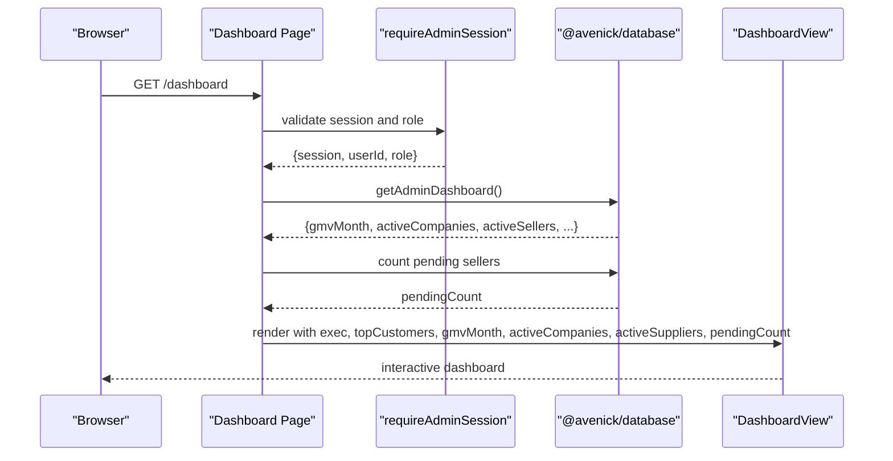

**Diagram sources**
- [apps/admin/src/app/dashboard/page.tsx:1-28](file://apps/admin/src/app/dashboard/page.tsx#L1-L28)
- [apps/admin/src/app/dashboard/dashboard-view.tsx:1-383](file://apps/admin/src/app/dashboard/dashboard-view.tsx#L1-L383)
- [apps/admin/src/lib/auth.ts:1-11](file://apps/admin/src/lib/auth.ts#L1-L11)

**Section sources**
- [apps/admin/src/app/dashboard/page.tsx:1-28](file://apps/admin/src/app/dashboard/page.tsx#L1-L28)
- [apps/admin/src/app/dashboard/dashboard-view.tsx:1-383](file://apps/admin/src/app/dashboard/dashboard-view.tsx#L1-L383)

### User Management
The Users page provides:
- Role-based statistics and filters
- Searchable table with user roles, portals, status, activity, and join dates
- Action buttons for editing and suspending users (non-admins)

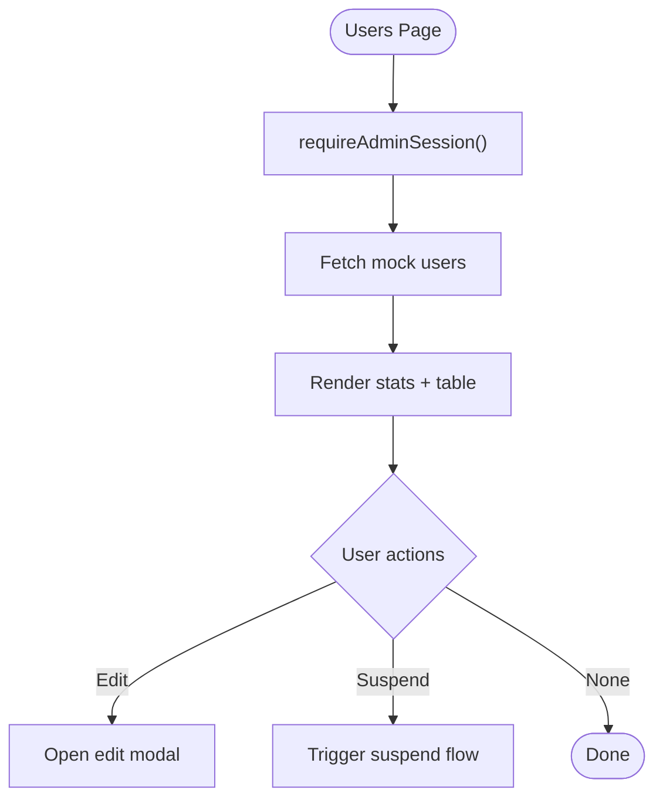

**Diagram sources**
- [apps/admin/src/app/users/page.tsx:1-181](file://apps/admin/src/app/users/page.tsx#L1-L181)
- [apps/admin/src/lib/auth.ts:1-11](file://apps/admin/src/lib/auth.ts#L1-L11)

**Section sources**
- [apps/admin/src/app/users/page.tsx:1-181](file://apps/admin/src/app/users/page.tsx#L1-L181)

### Supplier Directory and Compliance Monitoring
The Sellers page displays:
- Filtered list by status (All, Pending, Active, Suspended)
- Business name, contact, CR number, tier, status, product count, pending documents, creation date
- Quick navigation to seller detail

The Compliance page surfaces:
- Document review queue with status badges and expiry warnings
- Links to seller profiles for review actions

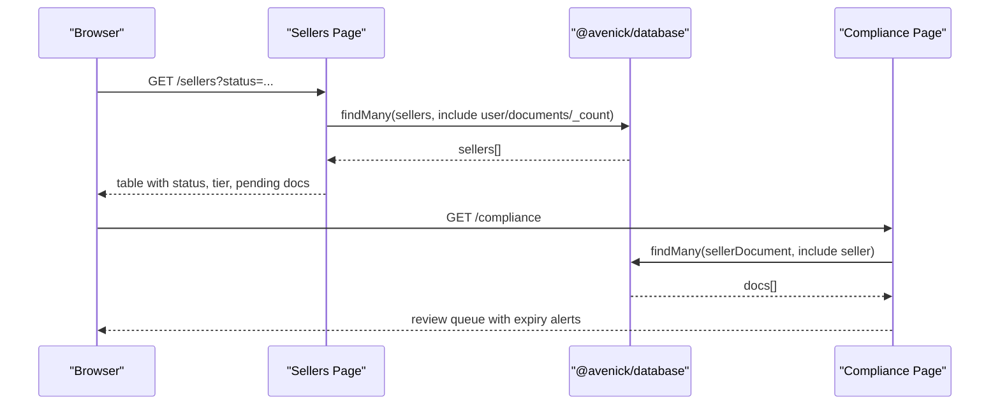

**Diagram sources**
- [apps/admin/src/app/sellers/page.tsx:1-94](file://apps/admin/src/app/sellers/page.tsx#L1-L94)
- [apps/admin/src/app/compliance/page.tsx:1-74](file://apps/admin/src/app/compliance/page.tsx#L1-L74)

**Section sources**
- [apps/admin/src/app/sellers/page.tsx:1-94](file://apps/admin/src/app/sellers/page.tsx#L1-L94)
- [apps/admin/src/app/compliance/page.tsx:1-74](file://apps/admin/src/app/compliance/page.tsx#L1-L74)

### Audit Trail
The Audit page presents:
- Immutable event logs with categories and actions
- Stats for events, admin actions, system events, and security flags
- Filtering by category and search across actor/action/target
- Export option and retention notice

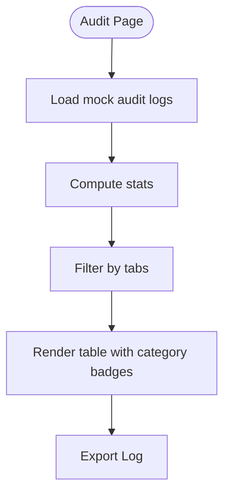

**Diagram sources**
- [apps/admin/src/app/audit/page.tsx:1-128](file://apps/admin/src/app/audit/page.tsx#L1-L128)

**Section sources**
- [apps/admin/src/app/audit/page.tsx:1-128](file://apps/admin/src/app/audit/page.tsx#L1-L128)

### Disputes Management
The Disputes page organizes:
- Open disputes, disputed value, awaiting seller, and resolved counts
- Card-based view with status, priority, parties, order reference, evidence, and timestamps
- Action buttons for reviewing cases, mediating, and reminding sellers

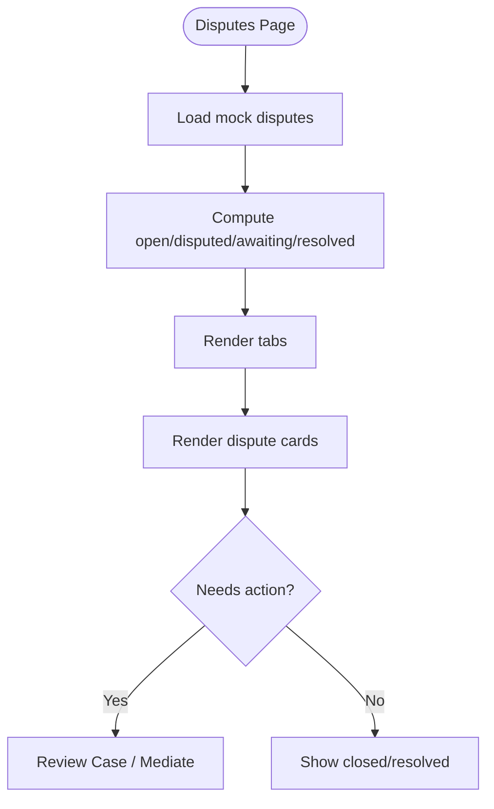

**Diagram sources**
- [apps/admin/src/app/disputes/page.tsx:1-144](file://apps/admin/src/app/disputes/page.tsx#L1-L144)

**Section sources**
- [apps/admin/src/app/disputes/page.tsx:1-144](file://apps/admin/src/app/disputes/page.tsx#L1-L144)

### AI Insights and Business Intelligence
The AI Insights page:
- Groups insights by Commerce, B2B, Operations, and Risk
- Presents confidence indicators and recommended actions
- Provides links to relevant functional areas for remediation

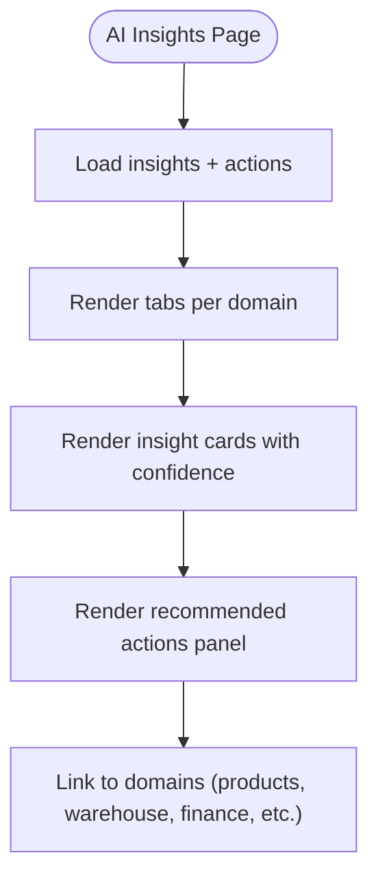

**Diagram sources**
- [apps/admin/src/app/ai-insights/page.tsx:1-318](file://apps/admin/src/app/ai-insights/page.tsx#L1-L318)

**Section sources**
- [apps/admin/src/app/ai-insights/page.tsx:1-318](file://apps/admin/src/app/ai-insights/page.tsx#L1-L318)

### Supplier Performance
The Performance page:
- Shows average supplier score, on-time delivery, return rate, and at-risk suppliers
- Displays scorecards with visual bars and trend indicators

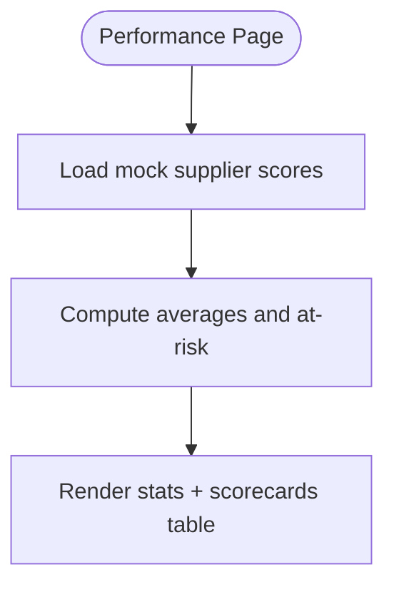

**Diagram sources**
- [apps/admin/src/app/performance/page.tsx:1-97](file://apps/admin/src/app/performance/page.tsx#L1-L97)

**Section sources**
- [apps/admin/src/app/performance/page.tsx:1-97](file://apps/admin/src/app/performance/page.tsx#L1-L97)

### Settings and System Health
The Settings page:
- Displays system health metrics and service statuses
- Groups marketplace settings (general, commerce, notifications, security)
- Links to audit trail and notes about change logging and approvals

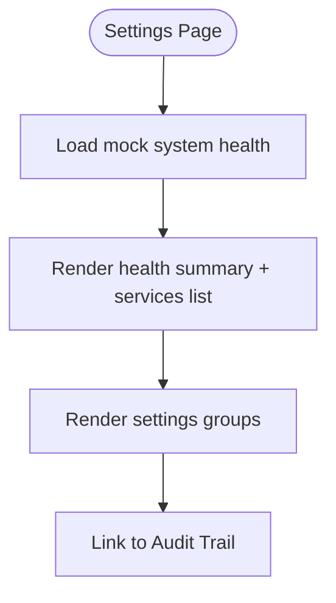

**Diagram sources**
- [apps/admin/src/app/settings/page.tsx:1-149](file://apps/admin/src/app/settings/page.tsx#L1-L149)

**Section sources**
- [apps/admin/src/app/settings/page.tsx:1-149](file://apps/admin/src/app/settings/page.tsx#L1-L149)

### Integrations Hub
The Integrations page:
- Lists integrations by category and status (Connected, Available, Coming Soon)
- Shows purpose, last sync, and action buttons per status
- Provides search and bulk sync controls

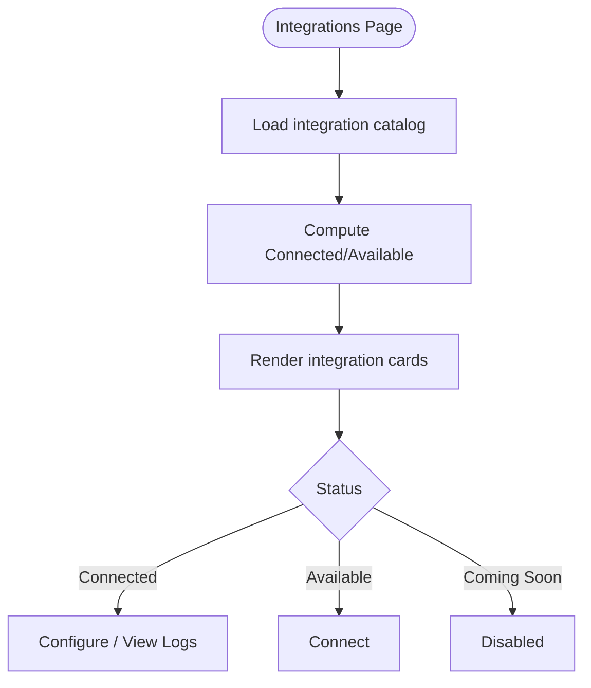

**Diagram sources**
- [apps/admin/src/app/integrations/page.tsx:1-264](file://apps/admin/src/app/integrations/page.tsx#L1-L264)

**Section sources**
- [apps/admin/src/app/integrations/page.tsx:1-264](file://apps/admin/src/app/integrations/page.tsx#L1-L264)

### API Endpoint for Admin Dashboard
The protected API endpoint:
- Validates admin session and role
- Returns aggregated dashboard data

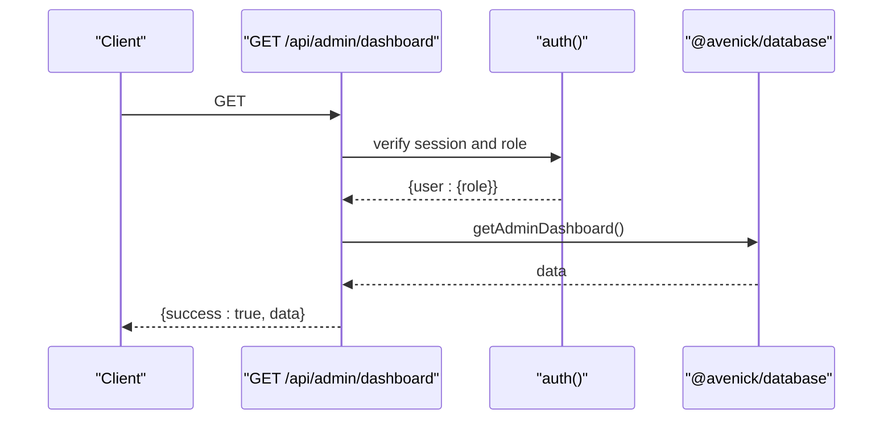

**Diagram sources**
- [apps/admin/src/app/api/admin/dashboard/route.ts:1-16](file://apps/admin/src/app/api/admin/dashboard/route.ts#L1-L16)
- [apps/admin/src/lib/auth.ts:1-11](file://apps/admin/src/lib/auth.ts#L1-L11)

**Section sources**
- [apps/admin/src/app/api/admin/dashboard/route.ts:1-16](file://apps/admin/src/app/api/admin/dashboard/route.ts#L1-L16)
- [apps/admin/src/lib/auth.ts:1-11](file://apps/admin/src/lib/auth.ts#L1-L11)

## Dependency Analysis
Key dependencies and relationships:
- Middleware depends on auth middleware factory and admin-specific auth instance
- Pages depend on auth utilities for role checks
- Dashboard page depends on database utilities for live metrics and falls back to mocks
- UI components rely on shared UI library and utility helpers
- API route depends on auth and database utilities

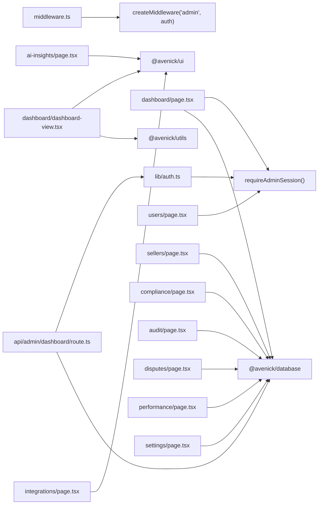

**Diagram sources**
- [apps/admin/src/middleware.ts:1-9](file://apps/admin/src/middleware.ts#L1-L9)
- [apps/admin/src/lib/auth.ts:1-11](file://apps/admin/src/lib/auth.ts#L1-L11)
- [apps/admin/src/app/dashboard/page.tsx:1-28](file://apps/admin/src/app/dashboard/page.tsx#L1-L28)
- [apps/admin/src/app/dashboard/dashboard-view.tsx:1-383](file://apps/admin/src/app/dashboard/dashboard-view.tsx#L1-L383)
- [apps/admin/src/app/users/page.tsx:1-181](file://apps/admin/src/app/users/page.tsx#L1-L181)
- [apps/admin/src/app/sellers/page.tsx:1-94](file://apps/admin/src/app/sellers/page.tsx#L1-L94)
- [apps/admin/src/app/compliance/page.tsx:1-74](file://apps/admin/src/app/compliance/page.tsx#L1-L74)
- [apps/admin/src/app/audit/page.tsx:1-128](file://apps/admin/src/app/audit/page.tsx#L1-L128)
- [apps/admin/src/app/disputes/page.tsx:1-144](file://apps/admin/src/app/disputes/page.tsx#L1-L144)
- [apps/admin/src/app/ai-insights/page.tsx:1-318](file://apps/admin/src/app/ai-insights/page.tsx#L1-L318)
- [apps/admin/src/app/performance/page.tsx:1-97](file://apps/admin/src/app/performance/page.tsx#L1-L97)
- [apps/admin/src/app/settings/page.tsx:1-149](file://apps/admin/src/app/settings/page.tsx#L1-L149)
- [apps/admin/src/app/integrations/page.tsx:1-264](file://apps/admin/src/app/integrations/page.tsx#L1-L264)
- [apps/admin/src/app/api/admin/dashboard/route.ts:1-16](file://apps/admin/src/app/api/admin/dashboard/route.ts#L1-L16)

**Section sources**
- [apps/admin/src/middleware.ts:1-9](file://apps/admin/src/middleware.ts#L1-L9)
- [apps/admin/src/lib/auth.ts:1-11](file://apps/admin/src/lib/auth.ts#L1-L11)
- [apps/admin/src/app/dashboard/page.tsx:1-28](file://apps/admin/src/app/dashboard/page.tsx#L1-L28)
- [apps/admin/src/app/dashboard/dashboard-view.tsx:1-383](file://apps/admin/src/app/dashboard/dashboard-view.tsx#L1-L383)
- [apps/admin/src/app/api/admin/dashboard/route.ts:1-16](file://apps/admin/src/app/api/admin/dashboard/route.ts#L1-L16)

## Performance Considerations
- Dashboard data aggregation: Prefer live metrics when available; fallback to mocks for demonstration stability
- Pagination and limits: Sellers and compliance lists apply take limits to avoid heavy queries
- Client-server serialization: Only pass serializable data to client components
- Local storage for UI state: Collapsed sidebar state persists across sessions
- Image and asset optimization: Leverage Next.js image optimization and CDN-ready assets

## Troubleshooting Guide
Common issues and resolutions:
- Access denied: Ensure the session contains ADMIN or SUPER_ADMIN role; otherwise redirect to login
- Missing live data: Verify database queries and fallback mocks; check API endpoint permissions
- Compliance alerts: Review document expiry dates and pending counts; follow review workflows
- Dispute resolution: Use status-specific actions; escalate or remind as appropriate
- Integration connectivity: Confirm connection status, last sync, and configure or connect as needed
- Audit trail: Use filters and search; export logs when required; verify immutability and retention

**Section sources**
- [apps/admin/src/lib/auth.ts:1-11](file://apps/admin/src/lib/auth.ts#L1-L11)
- [apps/admin/src/app/api/admin/dashboard/route.ts:1-16](file://apps/admin/src/app/api/admin/dashboard/route.ts#L1-L16)
- [apps/admin/src/app/compliance/page.tsx:1-74](file://apps/admin/src/app/compliance/page.tsx#L1-L74)
- [apps/admin/src/app/disputes/page.tsx:1-144](file://apps/admin/src/app/disputes/page.tsx#L1-L144)
- [apps/admin/src/app/integrations/page.tsx:1-264](file://apps/admin/src/app/integrations/page.tsx#L1-L264)
- [apps/admin/src/app/audit/page.tsx:1-128](file://apps/admin/src/app/audit/page.tsx#L1-L128)

## Conclusion
The Admin Portal consolidates oversight, governance, and intelligence across the marketplace. It ensures secure access, provides actionable insights, and streamlines operations through integrated workflows for users, suppliers, compliance, support, and integrations.

## Appendices
- Theme and localization: Root layout initializes NextIntlClientProvider and applies theme preference
- Navigation: AdminLayout organizes functional areas into labeled groups with icons and badges
- Quick actions: Dashboard offers shortcuts to create RFQs, invite suppliers, launch campaigns, and access warehouse queues

**Section sources**
- [apps/admin/src/app/layout.tsx:1-27](file://apps/admin/src/app/layout.tsx#L1-L27)
- [apps/admin/src/components/layout/admin-layout.tsx:1-267](file://apps/admin/src/components/layout/admin-layout.tsx#L1-L267)