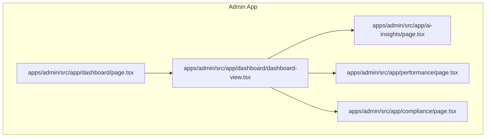
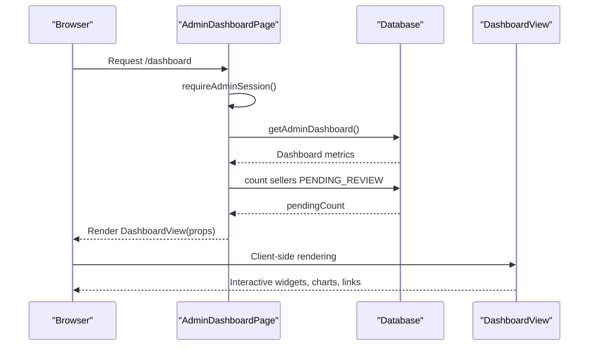
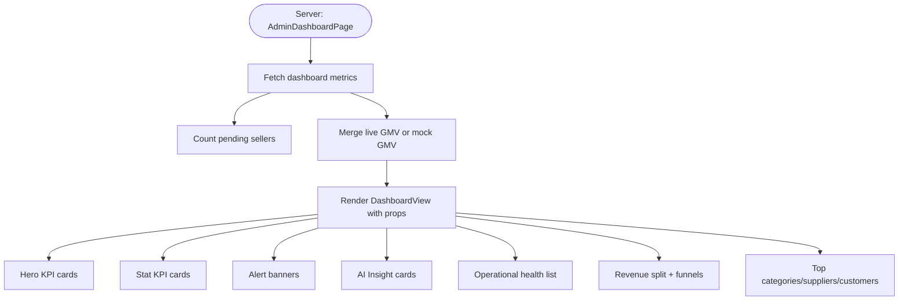
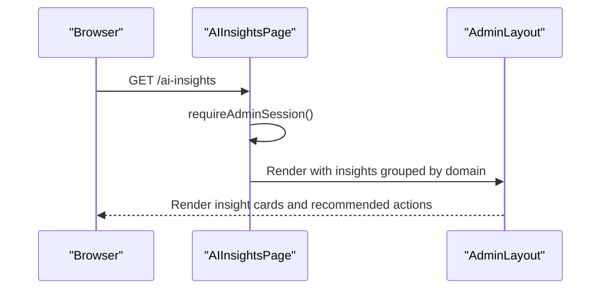
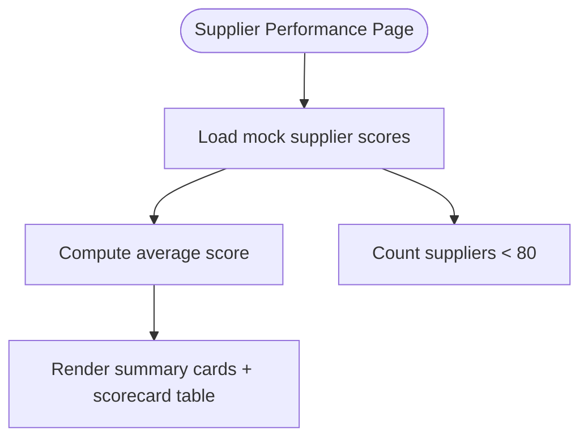
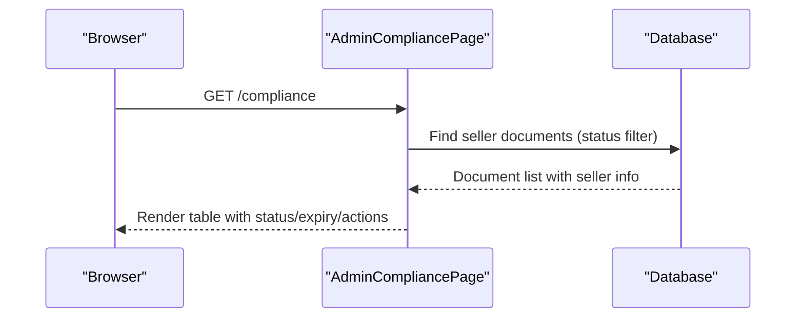
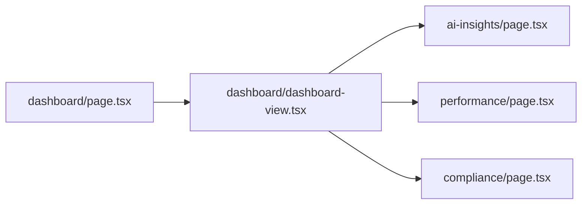

# Administrative Dashboard

<cite>
**Referenced Files in This Document**
- [apps/admin/src/app/dashboard/page.tsx](file://apps/admin/src/app/dashboard/page.tsx)
- [apps/admin/src/app/dashboard/dashboard-view.tsx](file://apps/admin/src/app/dashboard/dashboard-view.tsx)
- [apps/admin/src/app/ai-insights/page.tsx](file://apps/admin/src/app/ai-insights/page.tsx)
- [apps/admin/src/app/performance/page.tsx](file://apps/admin/src/app/performance/page.tsx)
- [apps/admin/src/app/compliance/page.tsx](file://apps/admin/src/app/compliance/page.tsx)
</cite>

## Table of Contents
1. [Introduction](#introduction)
2. [Project Structure](#project-structure)
3. [Core Components](#core-components)
4. [Architecture Overview](#architecture-overview)
5. [Detailed Component Analysis](#detailed-component-analysis)
6. [Dependency Analysis](#dependency-analysis)
7. [Performance Considerations](#performance-considerations)
8. [Troubleshooting Guide](#troubleshooting-guide)
9. [Conclusion](#conclusion)

## Introduction
This document describes the Administrative Dashboard, the central monitoring and analytics interface for the commerce platform. It covers performance metrics display, system health indicators, real-time business KPIs, the AI-powered insights dashboard with predictive analytics and automated recommendations, customizable widgets, data visualization components, interactive charts, executive summary cards, recent activity feeds, alert systems, dashboard configuration options, user preferences, permission-based data filtering, and integration with business intelligence modules and real-time data updates.

## Project Structure
The Administrative Dashboard is implemented as a Next.js application under apps/admin. The dashboard page orchestrates server-side data fetching and passes structured props to a client-rendered DashboardView component. The AI Insights page presents curated recommendations grouped by domain. The Supplier Performance and Compliance pages complement the dashboard with specialized analytics and governance views.

**Diagram sources**
- [apps/admin/src/app/dashboard/page.tsx](file://apps/admin/src/app/dashboard/page.tsx)
- [apps/admin/src/app/dashboard/dashboard-view.tsx](file://apps/admin/src/app/dashboard/dashboard-view.tsx)
- [apps/admin/src/app/ai-insights/page.tsx](file://apps/admin/src/app/ai-insights/page.tsx)
- [apps/admin/src/app/performance/page.tsx](file://apps/admin/src/app/performance/page.tsx)
- [apps/admin/src/app/compliance/page.tsx](file://apps/admin/src/app/compliance/page.tsx)

**Section sources**
- [apps/admin/src/app/dashboard/page.tsx](file://apps/admin/src/app/dashboard/page.tsx)
- [apps/admin/src/app/dashboard/dashboard-view.tsx](file://apps/admin/src/app/dashboard/dashboard-view.tsx)
- [apps/admin/src/app/ai-insights/page.tsx](file://apps/admin/src/app/ai-insights/page.tsx)
- [apps/admin/src/app/performance/page.tsx](file://apps/admin/src/app/performance/page.tsx)
- [apps/admin/src/app/compliance/page.tsx](file://apps/admin/src/app/compliance/page.tsx)

## Core Components
- Executive Command Center (dashboard): Presents live KPIs, alerts, AI recommendations, operational health, and key charts and tables.
- AI Insights: Curated, confidence-scored recommendations across Commerce, B2B, Operations, and Risk domains.
- Supplier Performance: Marketplace-wide supplier scorecards, SLA tracking, and at-risk indicators.
- Compliance: Document status tracking and expiry warnings for sellers.

Key implementation patterns:
- Server-side session enforcement and data fetching for the dashboard.
- Client-side rendering of responsive KPI cards, charts, and tables.
- Reusable UI building blocks for panels, bars, trends, and links.
- Permission gating via admin session checks.

**Section sources**
- [apps/admin/src/app/dashboard/page.tsx](file://apps/admin/src/app/dashboard/page.tsx)
- [apps/admin/src/app/dashboard/dashboard-view.tsx](file://apps/admin/src/app/dashboard/dashboard-view.tsx)
- [apps/admin/src/app/ai-insights/page.tsx](file://apps/admin/src/app/ai-insights/page.tsx)
- [apps/admin/src/app/performance/page.tsx](file://apps/admin/src/app/performance/page.tsx)
- [apps/admin/src/app/compliance/page.tsx](file://apps/admin/src/app/compliance/page.tsx)

## Architecture Overview
The dashboard follows a server-rendered page that fetches data and passes it to a client component. The client composes reusable UI elements to render KPIs, charts, tables, and actionable insights. AI Insights is a dedicated page with domain-specific recommendations. Supplier Performance and Compliance provide specialized analytics.

**Diagram sources**
- [apps/admin/src/app/dashboard/page.tsx](file://apps/admin/src/app/dashboard/page.tsx)
- [apps/admin/src/app/dashboard/dashboard-view.tsx](file://apps/admin/src/app/dashboard/dashboard-view.tsx)

## Detailed Component Analysis

### Executive Command Center (Dashboard)
The dashboard aggregates live and mock data to present:
- Hero KPIs: GMV, B2B/B2C revenue, Commission.
- Stat KPIs: Active companies/customers, active suppliers, RFQ conversion, fulfillment rate, warehouse utilization.
- Alerts: Open disputes, delayed orders.
- AI recommendations: Confidence-tagged cards with actions.
- Operational health: Severity-labeled metrics with links.
- Pending supplier reviews.
- Revenue split visualization (B2B vs B2C).
- RFQ funnel and Order lifecycle progress bars.
- Top categories, top suppliers, and top customers tables.

**Diagram sources**
- [apps/admin/src/app/dashboard/page.tsx](file://apps/admin/src/app/dashboard/page.tsx)
- [apps/admin/src/app/dashboard/dashboard-view.tsx](file://apps/admin/src/app/dashboard/dashboard-view.tsx)

**Section sources**
- [apps/admin/src/app/dashboard/page.tsx](file://apps/admin/src/app/dashboard/page.tsx)
- [apps/admin/src/app/dashboard/dashboard-view.tsx](file://apps/admin/src/app/dashboard/dashboard-view.tsx)

### AI Insights Dashboard
The AI Insights page organizes recommendations by domain:
- Commerce: Price optimization, category growth, bundling, CRM targeting.
- B2B: RFQ response gaps, VIP inactivity, credit limit upgrades, quote-to-order efficiency.
- Operations: Inventory risk, SLA risk, warehouse optimization.
- Risk: Compliance expiry, payment anomalies, seller quality decline.

Each insight includes:
- Icon and color-coded tag.
- Title and description.
- Confidence indicator.
- Action link and destination.

**Diagram sources**
- [apps/admin/src/app/ai-insights/page.tsx](file://apps/admin/src/app/ai-insights/page.tsx)

**Section sources**
- [apps/admin/src/app/ai-insights/page.tsx](file://apps/admin/src/app/ai-insights/page.tsx)

### Supplier Performance Analytics
The Supplier Performance page displays:
- Summary cards for average score, on-time delivery, return rate, and at-risk suppliers.
- A sortable scorecard table with tiers, scores, on-time metrics, return rates, response times, and trend indicators.

**Diagram sources**
- [apps/admin/src/app/performance/page.tsx](file://apps/admin/src/app/performance/page.tsx)

**Section sources**
- [apps/admin/src/app/performance/page.tsx](file://apps/admin/src/app/performance/page.tsx)

### Compliance Monitoring
The Compliance page surfaces seller documents with status and expiry dates:
- Filters and sorts by status and upload date.
- Highlights expiring documents within a near-term window.
- Provides quick navigation to review pending documents.

**Diagram sources**
- [apps/admin/src/app/compliance/page.tsx](file://apps/admin/src/app/compliance/page.tsx)

**Section sources**
- [apps/admin/src/app/compliance/page.tsx](file://apps/admin/src/app/compliance/page.tsx)

## Dependency Analysis
- Server-to-client data transfer: The dashboard page performs server-side work and passes only serializable props to the client component.
- UI composition: DashboardView composes reusable panels, bars, trends, and links.
- Domain integration: AI Insights complements dashboard KPIs with domain-specific recommendations.
- Governance linkage: Compliance page informs operational health and risk indicators.

**Diagram sources**
- [apps/admin/src/app/dashboard/page.tsx](file://apps/admin/src/app/dashboard/page.tsx)
- [apps/admin/src/app/dashboard/dashboard-view.tsx](file://apps/admin/src/app/dashboard/dashboard-view.tsx)
- [apps/admin/src/app/ai-insights/page.tsx](file://apps/admin/src/app/ai-insights/page.tsx)
- [apps/admin/src/app/performance/page.tsx](file://apps/admin/src/app/performance/page.tsx)
- [apps/admin/src/app/compliance/page.tsx](file://apps/admin/src/app/compliance/page.tsx)

**Section sources**
- [apps/admin/src/app/dashboard/page.tsx](file://apps/admin/src/app/dashboard/page.tsx)
- [apps/admin/src/app/dashboard/dashboard-view.tsx](file://apps/admin/src/app/dashboard/dashboard-view.tsx)
- [apps/admin/src/app/ai-insights/page.tsx](file://apps/admin/src/app/ai-insights/page.tsx)
- [apps/admin/src/app/performance/page.tsx](file://apps/admin/src/app/performance/page.tsx)
- [apps/admin/src/app/compliance/page.tsx](file://apps/admin/src/app/compliance/page.tsx)

## Performance Considerations
- Server-side rendering: The dashboard page executes server-side logic to fetch metrics and enforce permissions before hydration.
- Client-side interactivity: DashboardView leverages React state and minimal effects for interactive widgets and charts.
- Data freshness: The AI Insights page indicates live model status and last update cadence.
- Visual density: Charts and tables use proportional bars and compact layouts to maximize information density without heavy libraries.

[No sources needed since this section provides general guidance]

## Troubleshooting Guide
- Session errors: All pages use admin session checks; ensure authentication middleware is functioning.
- Empty or stale metrics: Verify server-side data fetches and fallback mocks for demo scenarios.
- Compliance alerts: Confirm document expiry calculations and near-expiry thresholds.
- Navigation: Quick actions and insight cards link to relevant sections; confirm route availability.

**Section sources**
- [apps/admin/src/app/dashboard/page.tsx](file://apps/admin/src/app/dashboard/page.tsx)
- [apps/admin/src/app/ai-insights/page.tsx](file://apps/admin/src/app/ai-insights/page.tsx)
- [apps/admin/src/app/compliance/page.tsx](file://apps/admin/src/app/compliance/page.tsx)

## Conclusion
The Administrative Dashboard consolidates real-time business KPIs, AI-driven insights, operational health, and governance data into a cohesive, interactive interface. Its modular design enables easy extension with additional widgets, charts, and domain-specific analytics while maintaining strong permission controls and responsive UX.

[No sources needed since this section summarizes without analyzing specific files]