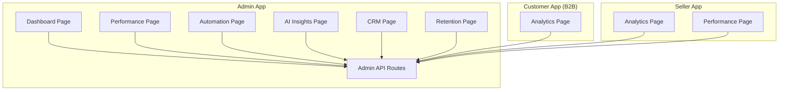
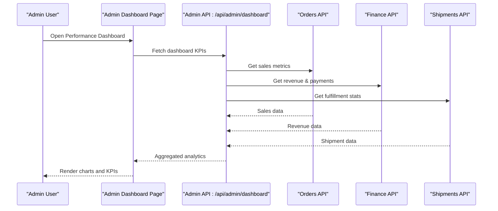
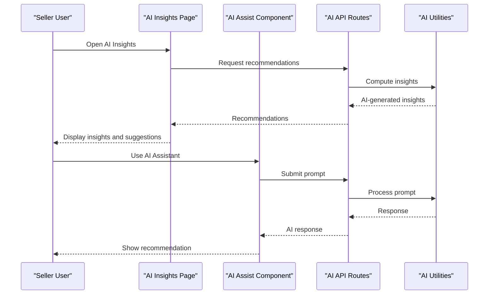
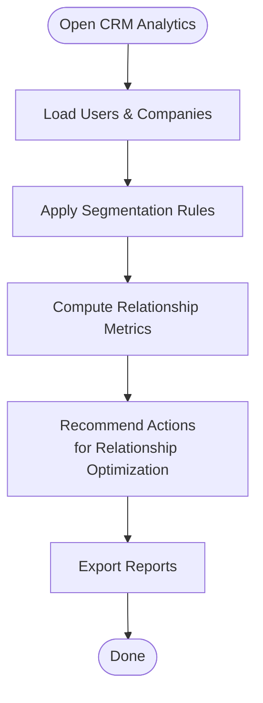
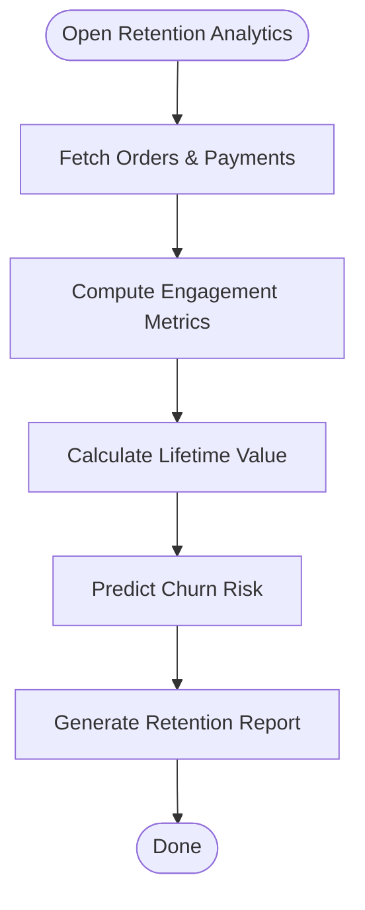
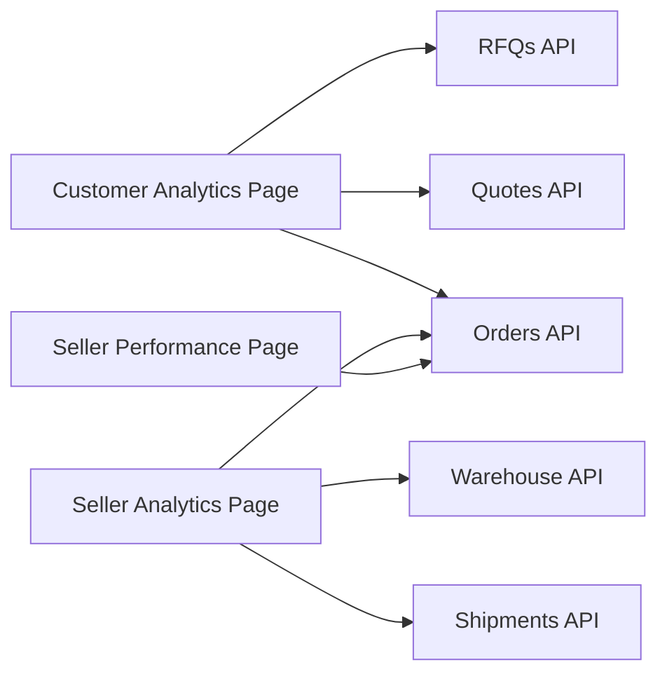
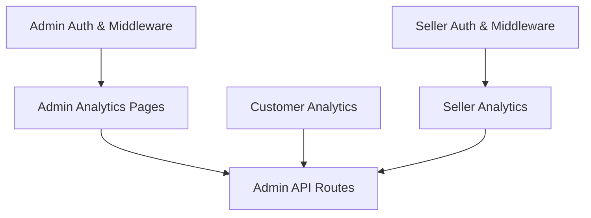

# Business Intelligence & Analytics

<cite>
**Referenced Files in This Document**
- [README.md](file://README.md)
- [MODULE_06_CRM_GROWTH_NOTES.md](file://MODULE_06_CRM_GROWTH_NOTES.md)
- [MODULE_11_AI_AUTOMATION_INTEGRATIONS_NOTES.md](file://MODULE_11_AI_AUTOMATION_INTEGRATIONS_NOTES.md)
- [apps/admin/src/app/dashboard/page.tsx](file://apps/admin/src/app/dashboard/page.tsx)
- [apps/admin/src/app/performance/page.tsx](file://apps/admin/src/app/performance/page.tsx)
- [apps/admin/src/app/automation/page.tsx](file://apps/admin/src/app/automation/page.tsx)
- [apps/admin/src/app/ai-insights/page.tsx](file://apps/admin/src/app/ai-insights/page.tsx)
- [apps/admin/src/app/crm/page.tsx](file://apps/admin/src/app/crm/page.tsx)
- [apps/admin/src/app/retention/page.tsx](file://apps/admin/src/app/retention/page.tsx)
- [apps/customer/src/app/b2b/analytics/page.tsx](file://apps/customer/src/app/b2b/analytics/page.tsx)
- [apps/seller/src/app/analytics/page.tsx](file://apps/seller/src/app/analytics/page.tsx)
- [apps/seller/src/app/performance/page.tsx](file://apps/seller/src/app/performance/page.tsx)
- [apps/admin/src/app/dashboard/dashboard-view.tsx](file://apps/admin/src/app/dashboard/dashboard-view.tsx)
- [apps/admin/src/app/api/admin/dashboard/route.ts](file://apps/admin/src/app/api/admin/dashboard/route.ts)
- [apps/admin/src/app/api/admin/compliance[id]/approve/route.ts](file://apps/admin/src/app/api/admin/compliance[id]/approve/route.ts)
- [apps/admin/src/app/api/admin/compliance[id]/reject/route.ts](file://apps/admin/src/app/api/admin/compliance[id]/reject/route.ts)
- [apps/admin/src/app/api/admin/products[id]/approve/route.ts](file://apps/admin/src/app/api/admin/products[id]/approve/route.ts)
- [apps/admin/src/app/api/admin/sellers/[id]/approve/route.ts](file://apps/admin/src/app/api/admin/sellers/[id]/approve/route.ts)
- [apps/admin/src/app/api/admin/sellers/[id]/reject/route.ts](file://apps/admin/src/app/api/admin/sellers/[id]/reject/route.ts)
- [apps/admin/src/app/api/admin/sellers/route.ts](file://apps/admin/src/app/api/admin/sellers/route.ts)
- [apps/admin/src/app/api/admin/compliance/route.ts](file://apps/admin/src/app/api/admin/compliance/route.ts)
- [apps/admin/src/app/api/admin/brands/route.ts](file://apps/admin/src/app/api/admin/brands/route.ts)
- [apps/admin/src/app/api/admin/categories/route.ts](file://apps/admin/src/app/api/admin/categories/route.ts)
- [apps/admin/src/app/api/admin/products/route.ts](file://apps/admin/src/app/api/admin/products/route.ts)
- [apps/admin/src/app/api/admin/orders/route.ts](file://apps/admin/src/app/api/admin/orders/route.ts)
- [apps/admin/src/app/api/admin/users/route.ts](file://apps/admin/src/app/api/admin/users/route.ts)
- [apps/admin/src/app/api/admin/deals/route.ts](file://apps/admin/src/app/api/admin/deals/route.ts)
- [apps/admin/src/app/api/admin/disputes/route.ts](file://apps/admin/src/app/api/admin/disputes/route.ts)
- [apps/admin/src/app/api/admin/finance/route.ts](file://apps/admin/src/app/api/admin/finance/route.ts)
- [apps/admin/src/app/api/admin/integrations/route.ts](file://apps/admin/src/app/api/admin/integrations/route.ts)
- [apps/admin/src/app/api/admin/payments/route.ts](file://apps/admin/src/app/api/admin/payments/route.ts)
- [apps/admin/src/app/api/admin/pricing/route.ts](file://apps/admin/src/app/api/admin/pricing/route.ts)
- [apps/admin/src/app/api/admin/quotes/route.ts](file://apps/admin/src/app/api/admin/quotes/route.ts)
- [apps/admin/src/app/api/admin/returns/route.ts](file://apps/admin/src/app/api/admin/returns/route.ts)
- [apps/admin/src/app/api/admin/rfqs/route.ts](file://apps/admin/src/app/api/admin/rfqs/route.ts)
- [apps/admin/src/app/api/admin/segments/route.ts](file://apps/admin/src/app/api/admin/segments/route.ts)
- [apps/admin/src/app/api/admin/settlements/route.ts](file://apps/admin/src/app/api/admin/settlements/route.ts)
- [apps/admin/src/app/api/admin/shipments/route.ts](file://apps/admin/src/app/api/admin/shipments/route.ts)
- [apps/admin/src/app/api/admin/sla/route.ts](file://apps/admin/src/app/api/admin/sla/route.ts)
- [apps/admin/src/app/api/admin/support/[id]/route.ts](file://apps/admin/src/app/api/admin/support/[id]/route.ts)
- [apps/admin/src/app/api/admin/vat/route.ts](file://apps/admin/src/app/api/admin/vat/route.ts)
- [apps/admin/src/app/api/admin/warehouse/inbound/route.ts](file://apps/admin/src/app/api/admin/warehouse/inbound/route.ts)
- [apps/admin/src/app/api/admin/warehouse/pickpack/route.ts](file://apps/admin/src/app/api/admin/warehouse/pickpack/route.ts)
- [apps/admin/src/app/api/admin/warehouse/stock/route.ts](file://apps/admin/src/app/api/admin/warehouse/stock/route.ts)
- [apps/admin/src/app/api/admin/warehouse/route.ts](file://apps/admin/src/app/api/admin/warehouse/route.ts)
- [apps/admin/src/app/api/admin/companies/route.ts](file://apps/admin/src/app/api/admin/companies/route.ts)
- [apps/admin/src/app/api/admin/settings/route.ts](file://apps/admin/src/app/api/admin/settings/route.ts)
- [apps/admin/src/app/api/admin/audit/route.ts](file://apps/admin/src/app/api/admin/audit/route.ts)
- [apps/admin/src/app/api/admin/approvals/route.ts](file://apps/admin/src/app/api/admin/approvals/route.ts)
- [apps/admin/src/app/api/admin/compliance/[id]/approve/route.ts](file://apps/admin/src/app/api/admin/compliance/[id]/approve/route.ts)
- [apps/admin/src/app/api/admin/compliance/[id]/reject/route.ts](file://apps/admin/src/app/api/admin/compliance/[id]/reject/route.ts)
- [apps/admin/src/app/api/admin/products/[id]/approve/route.ts](file://apps/admin/src/app/api/admin/products/[id]/approve/route.ts)
- [apps/admin/src/app/api/admin/sellers/[id]/approve/route.ts](file://apps/admin/src/app/api/admin/sellers/[id]/approve/route.ts)
- [apps/admin/src/app/api/admin/sellers/[id]/reject/route.ts](file://apps/admin/src/app/api/admin/sellers/[id]/reject/route.ts)
- [apps/admin/src/app/api/admin/sellers/route.ts](file://apps/admin/src/app/api/admin/sellers/route.ts)
- [apps/admin/src/app/api/admin/compliance/route.ts](file://apps/admin/src/app/api/admin/compliance/route.ts)
- [apps/admin/src/app/api/admin/brands/route.ts](file://apps/admin/src/app/api/admin/brands/route.ts)
- [apps/admin/src/app/api/admin/categories/route.ts](file://apps/admin/src/app/api/admin/categories/route.ts)
- [apps/admin/src/app/api/admin/products/route.ts](file://apps/admin/src/app/api/admin/products/route.ts)
- [apps/admin/src/app/api/admin/orders/route.ts](file://apps/admin/src/app/api/admin/orders/route.ts)
- [apps/admin/src/app/api/admin/users/route.ts](file://apps/admin/src/app/api/admin/users/route.ts)
- [apps/admin/src/app/api/admin/deals/route.ts](file://apps/admin/src/app/api/admin/deals/route.ts)
- [apps/admin/src/app/api/admin/disputes/route.ts](file://apps/admin/src/app/api/admin/disputes/route.ts)
- [apps/admin/src/app/api/admin/finance/route.ts](file://apps/admin/src/app/api/admin/finance/route.ts)
- [apps/admin/src/app/api/admin/integrations/route.ts](file://apps/admin/src/app/api/admin/integrations/route.ts)
- [apps/admin/src/app/api/admin/payments/route.ts](file://apps/admin/src/app/api/admin/payments/route.ts)
- [apps/admin/src/app/api/admin/pricing/route.ts](file://apps/admin/src/app/api/admin/pricing/route.ts)
- [apps/admin/src/app/api/admin/quotes/route.ts](file://apps/admin/src/app/api/admin/quotes/route.ts)
- [apps/admin/src/app/api/admin/returns/route.ts](file://apps/admin/src/app/api/admin/returns/route.ts)
- [apps/admin/src/app/api/admin/rfqs/route.ts](file://apps/admin/src/app/api/admin/rfqs/route.ts)
- [apps/admin/src/app/api/admin/segments/route.ts](file://apps/admin/src/app/api/admin/segments/route.ts)
- [apps/admin/src/app/api/admin/settlements/route.ts](file://apps/admin/src/app/api/admin/settlements/route.ts)
- [apps/admin/src/app/api/admin/shipments/route.ts](file://apps/admin/src/app/api/admin/shipments/route.ts)
- [apps/admin/src/app/api/admin/sla/route.ts](file://apps/admin/src/app/api/admin/sla/route.ts)
- [apps/admin/src/app/api/admin/support/[id]/route.ts](file://apps/admin/src/app/api/admin/support/[id]/route.ts)
- [apps/admin/src/app/api/admin/vat/route.ts](file://apps/admin/src/app/api/admin/vat/route.ts)
- [apps/admin/src/app/api/admin/warehouse/inbound/route.ts](file://apps/admin/src/app/api/admin/warehouse/inbound/route.ts)
- [apps/admin/src/app/api/admin/warehouse/pickpack/route.ts](file://apps/admin/src/app/api/admin/warehouse/pickpack/route.ts)
- [apps/admin/src/app/api/admin/warehouse/stock/route.ts](file://apps/admin/src/app/api/admin/warehouse/stock/route.ts)
- [apps/admin/src/app/api/admin/warehouse/route.ts](file://apps/admin/src/app/api/admin/warehouse/route.ts)
- [apps/admin/src/app/api/admin/companies/route.ts](file://apps/admin/src/app/api/admin/companies/route.ts)
- [apps/admin/src/app/api/admin/settings/route.ts](file://apps/admin/src/app/api/admin/settings/route.ts)
- [apps/admin/src/app/api/admin/audit/route.ts](file://apps/admin/src/app/api/admin/audit/route.ts)
- [apps/admin/src/app/api/admin/approvals/route.ts](file://apps/admin/src/app/api/admin/approvals/route.ts)
- [apps/admin/src/lib/auth.ts](file://apps/admin/src/lib/auth.ts)
- [apps/admin/src/middleware.ts](file://apps/admin/src/middleware.ts)
- [apps/admin/src/components/layout/admin-layout.tsx](file://apps/admin/src/components/layout/admin-layout.tsx)
- [apps/customer/src/lib/b2b.ts](file://apps/customer/src/lib/b2b.ts)
- [apps/customer/src/lib/email.ts](file://apps/customer/src/lib/email.ts)
- [apps/seller/src/lib/auth.ts](file://apps/seller/src/lib/auth.ts)
- [apps/seller/src/lib/ai.ts](file://apps/seller/src/lib/ai.ts)
- [apps/seller/src/components/ai-assist.tsx](file://apps/seller/src/components/ai-assist.tsx)
- [apps/seller/src/components/command-palette.tsx](file://apps/seller/src/components/command-palette.tsx)
- [apps/seller/src/components/notification-bell.tsx](file://apps/seller/src/components/notification-bell.tsx)
- [apps/seller/src/components/onboarding-checklist.tsx](file://apps/seller/src/components/onboarding-checklist.tsx)
- [apps/seller/src/components/orders-table.tsx](file://apps/seller/src/components/orders-table.tsx)
- [apps/seller/src/components/products-table.tsx](file://apps/seller/src/components/products-table.tsx)
- [apps/seller/src/components/saved-views.tsx](file://apps/seller/src/components/saved-views.tsx)
- [apps/seller/src/components/toast.tsx](file://apps/seller/src/components/toast.tsx)
</cite>

## Table of Contents
1. [Introduction](#introduction)
2. [Project Structure](#project-structure)
3. [Core Components](#core-components)
4. [Architecture Overview](#architecture-overview)
5. [Detailed Component Analysis](#detailed-component-analysis)
6. [Dependency Analysis](#dependency-analysis)
7. [Performance Considerations](#performance-considerations)
8. [Troubleshooting Guide](#troubleshooting-guide)
9. [Conclusion](#conclusion)
10. [Appendices](#appendices)

## Introduction
This document describes the Business Intelligence and Analytics module across the Admin, Customer (B2B), and Seller applications. It focuses on:
- Performance monitoring dashboards (sales metrics, conversion rates, revenue analytics)
- Automation insights and AI-driven recommendations
- Growth analytics and CRM features (lead management, customer segmentation, relationship optimization)
- Retention analytics (churn prediction, lifetime value, engagement metrics)
- Reporting, export, and visualization capabilities

The module leverages dedicated pages and API routes under the Admin app, with complementary analytics views in the Customer and Seller apps.

## Project Structure
The Analytics module spans three Next.js applications:
- Admin app: Central analytics hub with dashboards, automation insights, CRM, retention, and performance monitoring pages; extensive API routes for administrative analytics and operational data.
- Customer app (B2B): Analytics page tailored for buyer-side insights.
- Seller app: Analytics and performance pages for supplier/partner analytics.

**Diagram sources**
- [apps/admin/src/app/dashboard/page.tsx](file://apps/admin/src/app/dashboard/page.tsx)
- [apps/admin/src/app/performance/page.tsx](file://apps/admin/src/app/performance/page.tsx)
- [apps/admin/src/app/automation/page.tsx](file://apps/admin/src/app/automation/page.tsx)
- [apps/admin/src/app/ai-insights/page.tsx](file://apps/admin/src/app/ai-insights/page.tsx)
- [apps/admin/src/app/crm/page.tsx](file://apps/admin/src/app/crm/page.tsx)
- [apps/admin/src/app/retention/page.tsx](file://apps/admin/src/app/retention/page.tsx)
- [apps/customer/src/app/b2b/analytics/page.tsx](file://apps/customer/src/app/b2b/analytics/page.tsx)
- [apps/seller/src/app/analytics/page.tsx](file://apps/seller/src/app/analytics/page.tsx)
- [apps/seller/src/app/performance/page.tsx](file://apps/seller/src/app/performance/page.tsx)

**Section sources**
- [apps/admin/src/app/dashboard/page.tsx](file://apps/admin/src/app/dashboard/page.tsx)
- [apps/admin/src/app/performance/page.tsx](file://apps/admin/src/app/performance/page.tsx)
- [apps/admin/src/app/automation/page.tsx](file://apps/admin/src/app/automation/page.tsx)
- [apps/admin/src/app/ai-insights/page.tsx](file://apps/admin/src/app/ai-insights/page.tsx)
- [apps/admin/src/app/crm/page.tsx](file://apps/admin/src/app/crm/page.tsx)
- [apps/admin/src/app/retention/page.tsx](file://apps/admin/src/app/retention/page.tsx)
- [apps/customer/src/app/b2b/analytics/page.tsx](file://apps/customer/src/app/b2b/analytics/page.tsx)
- [apps/seller/src/app/analytics/page.tsx](file://apps/seller/src/app/analytics/page.tsx)
- [apps/seller/src/app/performance/page.tsx](file://apps/seller/src/app/performance/page.tsx)

## Core Components
- Dashboard: High-level KPIs and overview widgets for sales, conversions, and revenue.
- Performance Monitoring: Sales metrics, conversion funnels, and revenue analytics.
- Automation Insights: AI-driven recommendations and process improvement suggestions.
- CRM Analytics: Lead management, segmentation, and relationship optimization.
- Retention Analytics: Churn prediction, lifetime value, and engagement metrics.
- Reporting and Export: Dashboards and views with export capabilities.
- Visualization Tools: Charts and widgets integrated via shared UI components.

These components are implemented as React pages and supported by API routes for data retrieval and administrative actions.

**Section sources**
- [apps/admin/src/app/dashboard/page.tsx](file://apps/admin/src/app/dashboard/page.tsx)
- [apps/admin/src/app/performance/page.tsx](file://apps/admin/src/app/performance/page.tsx)
- [apps/admin/src/app/automation/page.tsx](file://apps/admin/src/app/automation/page.tsx)
- [apps/admin/src/app/ai-insights/page.tsx](file://apps/admin/src/app/ai-insights/page.tsx)
- [apps/admin/src/app/crm/page.tsx](file://apps/admin/src/app/crm/page.tsx)
- [apps/admin/src/app/retention/page.tsx](file://apps/admin/src/app/retention/page.tsx)
- [apps/customer/src/app/b2b/analytics/page.tsx](file://apps/customer/src/app/b2b/analytics/page.tsx)
- [apps/seller/src/app/analytics/page.tsx](file://apps/seller/src/app/analytics/page.tsx)
- [apps/seller/src/app/performance/page.tsx](file://apps/seller/src/app/performance/page.tsx)

## Architecture Overview
The Analytics module follows a layered architecture:
- UI Layer: Pages and components for dashboards, charts, and insights.
- API Layer: Route handlers under the Admin app for analytics data and administrative operations.
- Data Access: Shared utilities and database connectors (referenced in module notes).
- Authentication and Middleware: Admin and Seller apps enforce roles and permissions.

```mermaid
graph TB
UI_Dash["Admin Dashboard UI"]
UI_Perf["Admin Performance UI"]
UI_Auto["Admin Automation UI"]
UI_AI["Admin AI Insights UI"]
UI_CRM["Admin CRM UI"]
UI_Ret["Admin Retention UI"]
UI_CustAna["Customer Analytics UI"]
UI_SelAna["Seller Analytics UI"]
UI_SelPerf["Seller Performance UI"]
API_Dash["Admin API: /api/admin/dashboard"]
API_Compliance["Admin API: Compliance & Approvals"]
API_Sellers["Admin API: Sellers Management"]
API_Products["Admin API: Products Management"]
API_Orders["Admin API: Orders"]
API_Users["Admin API: Users"]
API_Finance["Admin API: Finance"]
API_Segments["Admin API: Segments"]
API_Shipments["Admin API: Shipments"]
API_Warehouse["Admin API: Warehouse"]
API_SLA["Admin API: SLA"]
API_Support["Admin API: Support"]
API_VAT["Admin API: VAT"]
API_Settings["Admin API: Settings"]
API_Audit["Admin API: Audit"]
API_Approvals["Admin API: Approvals"]
UI_Dash --> API_Dash
UI_Perf --> API_Orders
UI_Auto --> API_Compliance
UI_AI --> API_Compliance
UI_CRM --> API_Users
UI_Ret --> API_Orders
UI_CustAna --> API_Orders
UI_SelAna --> API_Orders
UI_SelPerf --> API_Orders
API_Compliance --> API_Sellers
API_Compliance --> API_Products
API_Sellers --> API_Users
API_Orders --> API_Finance
API_Orders --> API_Shipments
API_Orders --> API_Warehouse
API_Orders --> API_SLA
API_Orders --> API_Support
API_Orders --> API_VAT
API_Orders --> API_Segments
API_Orders --> API_Settings
API_Orders --> API_Audit
API_Orders --> API_Approvals
```

**Diagram sources**
- [apps/admin/src/app/api/admin/dashboard/route.ts](file://apps/admin/src/app/api/admin/dashboard/route.ts)
- [apps/admin/src/app/api/admin/compliance[id]/approve/route.ts](file://apps/admin/src/app/api/admin/compliance[id]/approve/route.ts)
- [apps/admin/src/app/api/admin/compliance[id]/reject/route.ts](file://apps/admin/src/app/api/admin/compliance[id]/reject/route.ts)
- [apps/admin/src/app/api/admin/products[id]/approve/route.ts](file://apps/admin/src/app/api/admin/products[id]/approve/route.ts)
- [apps/admin/src/app/api/admin/sellers/[id]/approve/route.ts](file://apps/admin/src/app/api/admin/sellers/[id]/approve/route.ts)
- [apps/admin/src/app/api/admin/sellers/[id]/reject/route.ts](file://apps/admin/src/app/api/admin/sellers/[id]/reject/route.ts)
- [apps/admin/src/app/api/admin/sellers/route.ts](file://apps/admin/src/app/api/admin/sellers/route.ts)
- [apps/admin/src/app/api/admin/compliance/route.ts](file://apps/admin/src/app/api/admin/compliance/route.ts)
- [apps/admin/src/app/api/admin/brands/route.ts](file://apps/admin/src/app/api/admin/brands/route.ts)
- [apps/admin/src/app/api/admin/categories/route.ts](file://apps/admin/src/app/api/admin/categories/route.ts)
- [apps/admin/src/app/api/admin/products/route.ts](file://apps/admin/src/app/api/admin/products/route.ts)
- [apps/admin/src/app/api/admin/orders/route.ts](file://apps/admin/src/app/api/admin/orders/route.ts)
- [apps/admin/src/app/api/admin/users/route.ts](file://apps/admin/src/app/api/admin/users/route.ts)
- [apps/admin/src/app/api/admin/deals/route.ts](file://apps/admin/src/app/api/admin/deals/route.ts)
- [apps/admin/src/app/api/admin/disputes/route.ts](file://apps/admin/src/app/api/admin/disputes/route.ts)
- [apps/admin/src/app/api/admin/finance/route.ts](file://apps/admin/src/app/api/admin/finance/route.ts)
- [apps/admin/src/app/api/admin/integrations/route.ts](file://apps/admin/src/app/api/admin/integrations/route.ts)
- [apps/admin/src/app/api/admin/payments/route.ts](file://apps/admin/src/app/api/admin/payments/route.ts)
- [apps/admin/src/app/api/admin/pricing/route.ts](file://apps/admin/src/app/api/admin/pricing/route.ts)
- [apps/admin/src/app/api/admin/quotes/route.ts](file://apps/admin/src/app/api/admin/quotes/route.ts)
- [apps/admin/src/app/api/admin/returns/route.ts](file://apps/admin/src/app/api/admin/returns/route.ts)
- [apps/admin/src/app/api/admin/rfqs/route.ts](file://apps/admin/src/app/api/admin/rfqs/route.ts)
- [apps/admin/src/app/api/admin/segments/route.ts](file://apps/admin/src/app/api/admin/segments/route.ts)
- [apps/admin/src/app/api/admin/settlements/route.ts](file://apps/admin/src/app/api/admin/settlements/route.ts)
- [apps/admin/src/app/api/admin/shipments/route.ts](file://apps/admin/src/app/api/admin/shipments/route.ts)
- [apps/admin/src/app/api/admin/sla/route.ts](file://apps/admin/src/app/api/admin/sla/route.ts)
- [apps/admin/src/app/api/admin/support/[id]/route.ts](file://apps/admin/src/app/api/admin/support/[id]/route.ts)
- [apps/admin/src/app/api/admin/vat/route.ts](file://apps/admin/src/app/api/admin/vat/route.ts)
- [apps/admin/src/app/api/admin/warehouse/inbound/route.ts](file://apps/admin/src/app/api/admin/warehouse/inbound/route.ts)
- [apps/admin/src/app/api/admin/warehouse/pickpack/route.ts](file://apps/admin/src/app/api/admin/warehouse/pickpack/route.ts)
- [apps/admin/src/app/api/admin/warehouse/stock/route.ts](file://apps/admin/src/app/api/admin/warehouse/stock/route.ts)
- [apps/admin/src/app/api/admin/warehouse/route.ts](file://apps/admin/src/app/api/admin/warehouse/route.ts)
- [apps/admin/src/app/api/admin/companies/route.ts](file://apps/admin/src/app/api/admin/companies/route.ts)
- [apps/admin/src/app/api/admin/settings/route.ts](file://apps/admin/src/app/api/admin/settings/route.ts)
- [apps/admin/src/app/api/admin/audit/route.ts](file://apps/admin/src/app/api/admin/audit/route.ts)
- [apps/admin/src/app/api/admin/approvals/route.ts](file://apps/admin/src/app/api/admin/approvals/route.ts)

## Detailed Component Analysis

### Performance Monitoring Dashboard
- Purpose: Aggregate sales metrics, conversion rates, and revenue analytics.
- Implementation: Dedicated page under Admin app with supporting API routes for orders, finance, and related entities.
- Key Data Sources: Orders, Payments, Shipments, VAT, and Settlements APIs.
- Visualization: Widgets and charts rendered via shared UI components.

**Diagram sources**
- [apps/admin/src/app/dashboard/page.tsx](file://apps/admin/src/app/dashboard/page.tsx)
- [apps/admin/src/app/api/admin/dashboard/route.ts](file://apps/admin/src/app/api/admin/dashboard/route.ts)
- [apps/admin/src/app/api/admin/orders/route.ts](file://apps/admin/src/app/api/admin/orders/route.ts)
- [apps/admin/src/app/api/admin/shipments/route.ts](file://apps/admin/src/app/api/admin/shipments/route.ts)
- [apps/admin/src/app/api/admin/payments/route.ts](file://apps/admin/src/app/api/admin/payments/route.ts)

**Section sources**
- [apps/admin/src/app/performance/page.tsx](file://apps/admin/src/app/performance/page.tsx)
- [apps/admin/src/app/dashboard/page.tsx](file://apps/admin/src/app/dashboard/page.tsx)
- [apps/admin/src/app/dashboard/dashboard-view.tsx](file://apps/admin/src/app/dashboard/dashboard-view.tsx)
- [apps/admin/src/app/api/admin/dashboard/route.ts](file://apps/admin/src/app/api/admin/dashboard/route.ts)
- [apps/admin/src/app/api/admin/orders/route.ts](file://apps/admin/src/app/api/admin/orders/route.ts)
- [apps/admin/src/app/api/admin/shipments/route.ts](file://apps/admin/src/app/api/admin/shipments/route.ts)
- [apps/admin/src/app/api/admin/payments/route.ts](file://apps/admin/src/app/api/admin/payments/route.ts)

### Automation Insights and AI Recommendations
- Purpose: Identify process improvements and deliver AI-driven recommendations.
- Implementation: AI Insights page and AI Assist component in the Seller app; AI utilities and routes.
- Capabilities: Draft AI content, recommendations, and assistant-like interactions.

**Diagram sources**
- [apps/admin/src/app/ai-insights/page.tsx](file://apps/admin/src/app/ai-insights/page.tsx)
- [apps/seller/src/components/ai-assist.tsx](file://apps/seller/src/components/ai-assist.tsx)
- [apps/seller/src/lib/ai.ts](file://apps/seller/src/lib/ai.ts)
- [apps/seller/src/app/api/ai/draft/route.ts](file://apps/seller/src/app/api/ai/draft/route.ts)

**Section sources**
- [apps/admin/src/app/automation/page.tsx](file://apps/admin/src/app/automation/page.tsx)
- [apps/admin/src/app/ai-insights/page.tsx](file://apps/admin/src/app/ai-insights/page.tsx)
- [apps/seller/src/components/ai-assist.tsx](file://apps/seller/src/components/ai-assist.tsx)
- [apps/seller/src/lib/ai.ts](file://apps/seller/src/lib/ai.ts)
- [apps/seller/src/app/api/ai/draft/route.ts](file://apps/seller/src/app/api/ai/draft/route.ts)

### CRM Analytics: Leads, Segmentation, and Relationship Optimization
- Purpose: Manage leads, segment customers, and optimize relationships.
- Implementation: CRM page in Admin app; data sourced from Users, Segments, Companies, and related APIs.
- Features: Lead lifecycle tracking, segmentation analytics, and relationship health indicators.

**Diagram sources**
- [apps/admin/src/app/crm/page.tsx](file://apps/admin/src/app/crm/page.tsx)
- [apps/admin/src/app/api/admin/users/route.ts](file://apps/admin/src/app/api/admin/users/route.ts)
- [apps/admin/src/app/api/admin/segments/route.ts](file://apps/admin/src/app/api/admin/segments/route.ts)
- [apps/admin/src/app/api/admin/companies/route.ts](file://apps/admin/src/app/api/admin/companies/route.ts)

**Section sources**
- [apps/admin/src/app/crm/page.tsx](file://apps/admin/src/app/crm/page.tsx)
- [apps/admin/src/app/api/admin/users/route.ts](file://apps/admin/src/app/api/admin/users/route.ts)
- [apps/admin/src/app/api/admin/segments/route.ts](file://apps/admin/src/app/api/admin/segments/route.ts)
- [apps/admin/src/app/api/admin/companies/route.ts](file://apps/admin/src/app/api/admin/companies/route.ts)

### Retention Analytics: Churn Prediction, Lifetime Value, Engagement
- Purpose: Predict churn, compute lifetime value, and track engagement.
- Implementation: Retention page in Admin app; integrates with Orders, Payments, and Users APIs.
- Capabilities: Cohort analysis, churn risk scoring, LTV modeling, and engagement trend visualization.

**Diagram sources**
- [apps/admin/src/app/retention/page.tsx](file://apps/admin/src/app/retention/page.tsx)
- [apps/admin/src/app/api/admin/orders/route.ts](file://apps/admin/src/app/api/admin/orders/route.ts)
- [apps/admin/src/app/api/admin/payments/route.ts](file://apps/admin/src/app/api/admin/payments/route.ts)
- [apps/admin/src/app/api/admin/users/route.ts](file://apps/admin/src/app/api/admin/users/route.ts)

**Section sources**
- [apps/admin/src/app/retention/page.tsx](file://apps/admin/src/app/retention/page.tsx)
- [apps/admin/src/app/api/admin/orders/route.ts](file://apps/admin/src/app/api/admin/orders/route.ts)
- [apps/admin/src/app/api/admin/payments/route.ts](file://apps/admin/src/app/api/admin/payments/route.ts)
- [apps/admin/src/app/api/admin/users/route.ts](file://apps/admin/src/app/api/admin/users/route.ts)

### Customer and Seller Analytics Views
- Customer (B2B) Analytics: Buyer-focused analytics page for order history, spending trends, and RFQ/quote analytics.
- Seller Analytics: Supplier/partner analytics and performance dashboards.

**Diagram sources**
- [apps/customer/src/app/b2b/analytics/page.tsx](file://apps/customer/src/app/b2b/analytics/page.tsx)
- [apps/seller/src/app/analytics/page.tsx](file://apps/seller/src/app/analytics/page.tsx)
- [apps/seller/src/app/performance/page.tsx](file://apps/seller/src/app/performance/page.tsx)
- [apps/admin/src/app/api/admin/orders/route.ts](file://apps/admin/src/app/api/admin/orders/route.ts)
- [apps/admin/src/app/api/admin/quotes/route.ts](file://apps/admin/src/app/api/admin/quotes/route.ts)
- [apps/admin/src/app/api/admin/rfqs/route.ts](file://apps/admin/src/app/api/admin/rfqs/route.ts)
- [apps/admin/src/app/api/admin/shipments/route.ts](file://apps/admin/src/app/api/admin/shipments/route.ts)
- [apps/admin/src/app/api/admin/warehouse/stock/route.ts](file://apps/admin/src/app/api/admin/warehouse/stock/route.ts)

**Section sources**
- [apps/customer/src/app/b2b/analytics/page.tsx](file://apps/customer/src/app/b2b/analytics/page.tsx)
- [apps/seller/src/app/analytics/page.tsx](file://apps/seller/src/app/analytics/page.tsx)
- [apps/seller/src/app/performance/page.tsx](file://apps/seller/src/app/performance/page.tsx)
- [apps/admin/src/app/api/admin/orders/route.ts](file://apps/admin/src/app/api/admin/orders/route.ts)
- [apps/admin/src/app/api/admin/quotes/route.ts](file://apps/admin/src/app/api/admin/quotes/route.ts)
- [apps/admin/src/app/api/admin/rfqs/route.ts](file://apps/admin/src/app/api/admin/rfqs/route.ts)
- [apps/admin/src/app/api/admin/shipments/route.ts](file://apps/admin/src/app/api/admin/shipments/route.ts)
- [apps/admin/src/app/api/admin/warehouse/stock/route.ts](file://apps/admin/src/app/api/admin/warehouse/stock/route.ts)

## Dependency Analysis
- UI-to-API Coupling: Each analytics page depends on specific Admin API routes for data.
- Cross-App Dependencies:
  - Customer app analytics relies on Admin API routes for order and quote data.
  - Seller app analytics integrates with Admin API routes for orders, shipments, and warehouse.
- Authentication and Roles:
  - Admin app enforces authentication and middleware for privileged access.
  - Seller app enforces seller-specific authentication and permissions.

**Diagram sources**
- [apps/admin/src/lib/auth.ts](file://apps/admin/src/lib/auth.ts)
- [apps/admin/src/middleware.ts](file://apps/admin/src/middleware.ts)
- [apps/seller/src/lib/auth.ts](file://apps/seller/src/lib/auth.ts)
- [apps/admin/src/app/api/admin/orders/route.ts](file://apps/admin/src/app/api/admin/orders/route.ts)
- [apps/admin/src/app/api/admin/shipments/route.ts](file://apps/admin/src/app/api/admin/shipments/route.ts)
- [apps/admin/src/app/api/admin/warehouse/stock/route.ts](file://apps/admin/src/app/api/admin/warehouse/stock/route.ts)

**Section sources**
- [apps/admin/src/lib/auth.ts](file://apps/admin/src/lib/auth.ts)
- [apps/admin/src/middleware.ts](file://apps/admin/src/middleware.ts)
- [apps/seller/src/lib/auth.ts](file://apps/seller/src/lib/auth.ts)
- [apps/admin/src/app/api/admin/orders/route.ts](file://apps/admin/src/app/api/admin/orders/route.ts)
- [apps/admin/src/app/api/admin/shipments/route.ts](file://apps/admin/src/app/api/admin/shipments/route.ts)
- [apps/admin/src/app/api/admin/warehouse/stock/route.ts](file://apps/admin/src/app/api/admin/warehouse/stock/route.ts)

## Performance Considerations
- Data Aggregation: Prefer pre-aggregated datasets or summary endpoints to reduce client-side computation.
- Pagination and Filtering: Apply server-side pagination and filters for large datasets (orders, users, segments).
- Caching: Implement caching strategies for static or slowly changing analytics data.
- Lazy Loading: Load heavy visualizations and large datasets on demand.
- API Efficiency: Batch requests where possible and avoid redundant data fetching.

## Troubleshooting Guide
- Authentication Failures:
  - Verify admin and seller authentication flows and middleware configurations.
  - Ensure proper role checks before rendering analytics pages.
- API Route Errors:
  - Confirm Admin API routes are reachable and return expected JSON payloads.
  - Check for missing or incorrect route parameters (e.g., IDs).
- Data Gaps:
  - Validate that Orders, Payments, Shipments, and Users APIs are returning data.
  - Inspect warehouse and segment APIs for completeness.
- Visualization Issues:
  - Ensure shared UI components are properly imported and configured.
  - Verify chart libraries and widget rendering logic.

**Section sources**
- [apps/admin/src/lib/auth.ts](file://apps/admin/src/lib/auth.ts)
- [apps/admin/src/middleware.ts](file://apps/admin/src/middleware.ts)
- [apps/seller/src/lib/auth.ts](file://apps/seller/src/lib/auth.ts)
- [apps/admin/src/app/api/admin/orders/route.ts](file://apps/admin/src/app/api/admin/orders/route.ts)
- [apps/admin/src/app/api/admin/payments/route.ts](file://apps/admin/src/app/api/admin/payments/route.ts)
- [apps/admin/src/app/api/admin/shipments/route.ts](file://apps/admin/src/app/api/admin/shipments/route.ts)
- [apps/admin/src/app/api/admin/segments/route.ts](file://apps/admin/src/app/api/admin/segments/route.ts)
- [apps/admin/src/app/api/admin/warehouse/stock/route.ts](file://apps/admin/src/app/api/admin/warehouse/stock/route.ts)

## Conclusion
The Business Intelligence and Analytics module provides a comprehensive suite of dashboards and insights across Admin, Customer (B2B), and Seller applications. It integrates performance monitoring, automation insights, CRM analytics, retention analytics, and robust reporting capabilities. The modular design, coupled with Admin API routes and shared UI components, enables scalable and maintainable analytics experiences.

## Appendices
- Module Notes References:
  - CRM and Growth module notes outline strategic direction and feature scope.
  - AI and Automation Integrations module notes describe AI-driven capabilities and automation pathways.

**Section sources**
- [MODULE_06_CRM_GROWTH_NOTES.md](file://MODULE_06_CRM_GROWTH_NOTES.md)
- [MODULE_11_AI_AUTOMATION_INTEGRATIONS_NOTES.md](file://MODULE_11_AI_AUTOMATION_INTEGRATIONS_NOTES.md)
- [README.md](file://README.md)