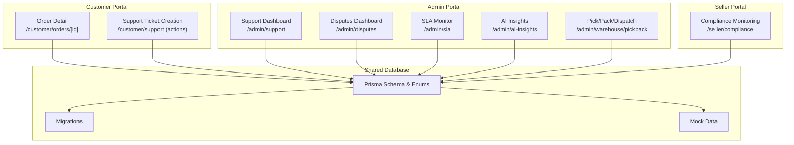
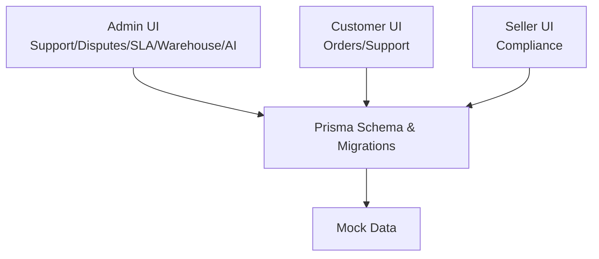
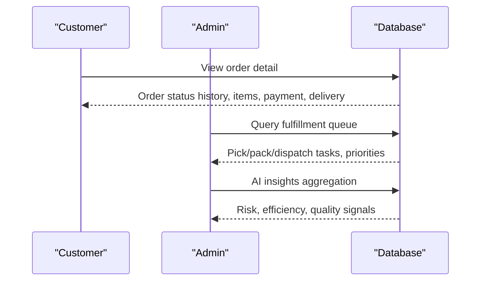
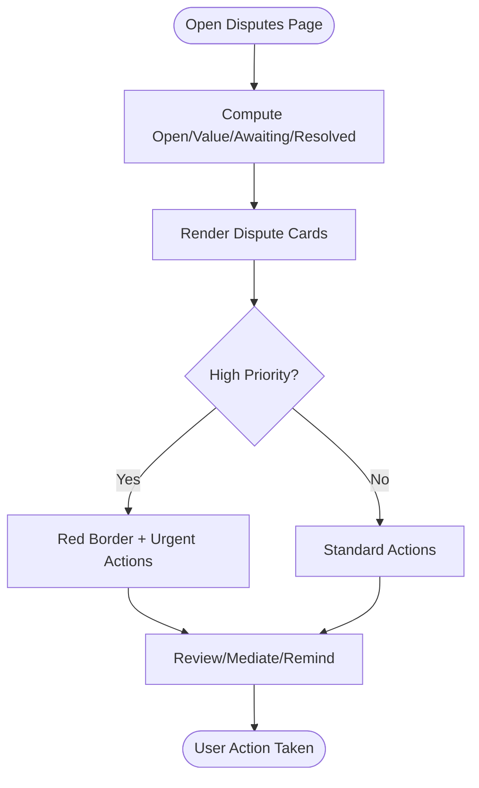
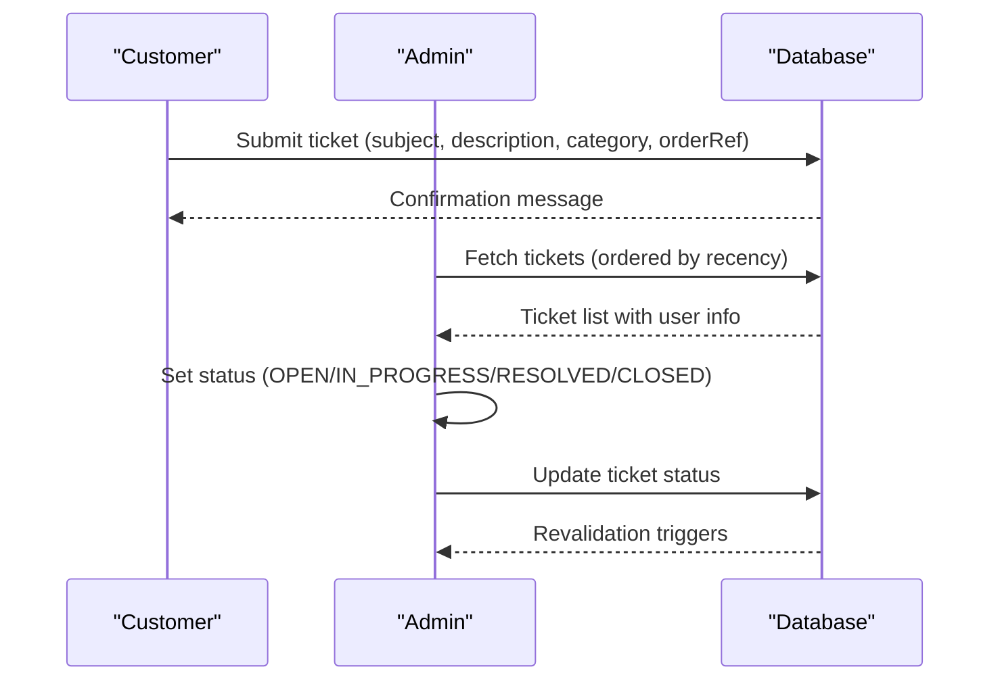
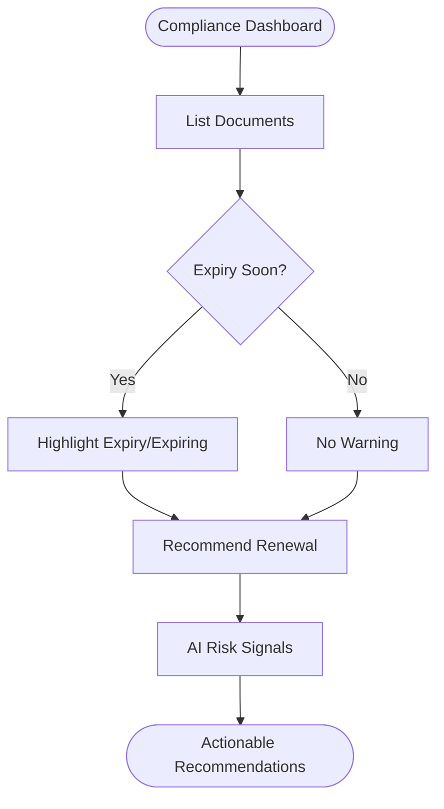
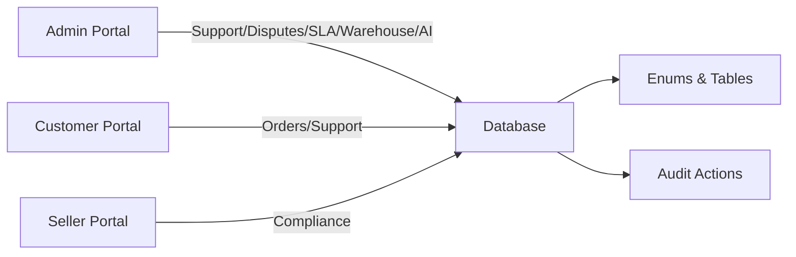
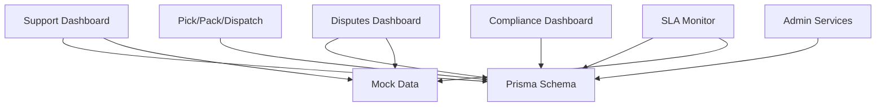

# Operational Control

<cite>
**Referenced Files in This Document**
- [MODULE_08_SUPPORT_DISPUTES_NOTES.md](file://MODULE_08_SUPPORT_DISPUTES_NOTES.md)
- [apps/admin/src/app/support/page.tsx](file://apps/admin/src/app/support/page.tsx)
- [apps/admin/src/app/support/actions.ts](file://apps/admin/src/app/support/actions.ts)
- [apps/admin/src/app/support/[id]/page.tsx](file://apps/admin/src/app/support/[id]/page.tsx)
- [apps/admin/src/app/disputes/page.tsx](file://apps/admin/src/app/disputes/page.tsx)
- [apps/admin/src/app/sla/page.tsx](file://apps/admin/src/app/sla/page.tsx)
- [apps/admin/src/app/ai-insights/page.tsx](file://apps/admin/src/app/ai-insights/page.tsx)
- [apps/customer/src/app/support/actions.ts](file://apps/customer/src/app/support/actions.ts)
- [apps/customer/src/app/orders/[id]/page.tsx](file://apps/customer/src/app/orders/[id]/page.tsx)
- [apps/seller/src/app/compliance/page.tsx](file://apps/seller/src/app/compliance/page.tsx)
- [apps/admin/src/app/warehouse/pickpack/page.tsx](file://apps/admin/src/app/warehouse/pickpack/page.tsx)
- [packages/database/src/mock-data.ts](file://packages/database/src/mock-data.ts)
- [packages/database/prisma/schema.prisma](file://packages/database/prisma/schema.prisma)
- [packages/database/prisma/migrations/20260601013412_add_support_tickets/migration.sql](file://packages/database/prisma/migrations/20260601013412_add_support_tickets/migration.sql)
- [packages/database/src/services/admin.ts](file://packages/database/src/services/admin.ts)
</cite>

## Table of Contents
1. [Introduction](#introduction)
2. [Project Structure](#project-structure)
3. [Core Components](#core-components)
4. [Architecture Overview](#architecture-overview)
5. [Detailed Component Analysis](#detailed-component-analysis)
6. [Dependency Analysis](#dependency-analysis)
7. [Performance Considerations](#performance-considerations)
8. [Troubleshooting Guide](#troubleshooting-guide)
9. [Conclusion](#conclusion)
10. [Appendices](#appendices)

## Introduction
This document describes the Operational Control module that encompasses order supervision, dispute resolution, and support operations across the three portals: Admin, Customer, and Seller. It explains order monitoring capabilities (order flow tracking, fulfillment status, and quality assurance), dispute workflows (customer complaints, return disputes, and payment conflicts), and customer support operations (ticket management, escalation handling, and resolution tracking). It also covers compliance monitoring systems for regulatory adherence and policy enforcement, integration with the three portals, audit trails, and operational reporting features.

## Project Structure
The Operational Control module spans three Next.js applications and a shared database package:
- Admin portal: central operational hub for support, disputes, SLA monitoring, warehouse pick/pack dispatch, and AI-driven insights.
- Customer portal: self-service order tracking and support ticket creation.
- Seller portal: compliance monitoring and operational dashboards for supplier-facing controls.
- Shared database package: Prisma schema and migrations define domain models and enums, including order, payment, fulfillment, support, and audit domains.

**Diagram sources**
- [apps/admin/src/app/support/page.tsx:27-54](file://apps/admin/src/app/support/page.tsx#L27-L54)
- [apps/admin/src/app/disputes/page.tsx:26-96](file://apps/admin/src/app/disputes/page.tsx#L26-L96)
- [apps/admin/src/app/sla/page.tsx:116-140](file://apps/admin/src/app/sla/page.tsx#L116-L140)
- [apps/admin/src/app/ai-insights/page.tsx:130-192](file://apps/admin/src/app/ai-insights/page.tsx#L130-L192)
- [apps/admin/src/app/warehouse/pickpack/page.tsx:1-64](file://apps/admin/src/app/warehouse/pickpack/page.tsx#L1-L64)
- [apps/customer/src/app/orders/[id]/page.tsx](file://apps/customer/src/app/orders/[id]/page.tsx#L82-L106)
- [apps/customer/src/app/support/actions.ts:1-34](file://apps/customer/src/app/support/actions.ts#L1-L34)
- [apps/seller/src/app/compliance/page.tsx:83-105](file://apps/seller/src/app/compliance/page.tsx#L83-L105)
- [packages/database/prisma/schema.prisma:145-276](file://packages/database/prisma/schema.prisma#L145-L276)
- [packages/database/prisma/migrations/20260601013412_add_support_tickets/migration.sql:1-34](file://packages/database/prisma/migrations/20260601013412_add_support_tickets/migration.sql#L1-L34)
- [packages/database/src/mock-data.ts:149-217](file://packages/database/src/mock-data.ts#L149-L217)

**Section sources**
- [apps/admin/src/app/support/page.tsx:27-54](file://apps/admin/src/app/support/page.tsx#L27-L54)
- [apps/admin/src/app/disputes/page.tsx:26-96](file://apps/admin/src/app/disputes/page.tsx#L26-L96)
- [apps/admin/src/app/sla/page.tsx:116-140](file://apps/admin/src/app/sla/page.tsx#L116-L140)
- [apps/admin/src/app/ai-insights/page.tsx:130-192](file://apps/admin/src/app/ai-insights/page.tsx#L130-L192)
- [apps/admin/src/app/warehouse/pickpack/page.tsx:1-64](file://apps/admin/src/app/warehouse/pickpack/page.tsx#L1-L64)
- [apps/customer/src/app/orders/[id]/page.tsx](file://apps/customer/src/app/orders/[id]/page.tsx#L82-L106)
- [apps/customer/src/app/support/actions.ts:1-34](file://apps/customer/src/app/support/actions.ts#L1-L34)
- [apps/seller/src/app/compliance/page.tsx:83-105](file://apps/seller/src/app/compliance/page.tsx#L83-L105)
- [packages/database/prisma/schema.prisma:145-276](file://packages/database/prisma/schema.prisma#L145-L276)
- [packages/database/prisma/migrations/20260601013412_add_support_tickets/migration.sql:1-34](file://packages/database/prisma/migrations/20260601013412_add_support_tickets/migration.sql#L1-L34)
- [packages/database/src/mock-data.ts:149-217](file://packages/database/src/mock-data.ts#L149-L217)

## Core Components
- Order Monitoring and Fulfillment
  - Order macro status tracking and delivery progression in the Customer portal.
  - Warehouse pick/pack/dispatch queues and fulfillment stages in the Admin portal.
  - Quality assurance indicators surfaced via AI Insights and seller performance dashboards.
- Dispute Resolution
  - Disputes dashboard aggregating open disputes, disputed value, and resolution metrics.
  - Dispute cards with type, priority, evidence count, and actionable statuses.
- Customer Support Operations
  - Support dashboard with status stats, SLA urgency indicators, and escalations.
  - Ticket detail page with chat-style conversation, internal notes, SLA bar, and quick actions.
  - Customer-side ticket creation workflow with auto-generated ticket numbers.
- Compliance Monitoring
  - Compliance monitoring for sellers with expiry/expiring notices and rejection reasons.
  - AI Insights highlighting compliance risks and recommending actions.
- Reporting and Auditing
  - SLA monitor with top metrics, compliance gauges, performance-by-type tables, and breach logs.
  - Admin dashboard KPIs for GMV, orders, active sellers, and recent orders.

**Section sources**
- [apps/customer/src/app/orders/[id]/page.tsx](file://apps/customer/src/app/orders/[id]/page.tsx#L82-L106)
- [apps/admin/src/app/warehouse/pickpack/page.tsx:1-64](file://apps/admin/src/app/warehouse/pickpack/page.tsx#L1-L64)
- [apps/admin/src/app/disputes/page.tsx:26-96](file://apps/admin/src/app/disputes/page.tsx#L26-L96)
- [apps/admin/src/app/support/page.tsx:27-54](file://apps/admin/src/app/support/page.tsx#L27-L54)
- [apps/admin/src/app/support/[id]/page.tsx](file://apps/admin/src/app/support/[id]/page.tsx#L1-L30)
- [apps/customer/src/app/support/actions.ts:1-34](file://apps/customer/src/app/support/actions.ts#L1-L34)
- [apps/seller/src/app/compliance/page.tsx:83-105](file://apps/seller/src/app/compliance/page.tsx#L83-L105)
- [apps/admin/src/app/sla/page.tsx:116-140](file://apps/admin/src/app/sla/page.tsx#L116-L140)
- [apps/admin/src/app/ai-insights/page.tsx:130-192](file://apps/admin/src/app/ai-insights/page.tsx#L130-L192)
- [packages/database/src/services/admin.ts:1-31](file://packages/database/src/services/admin.ts#L1-L31)

## Architecture Overview
Operational Control integrates three portals with a shared database layer:
- Admin portal orchestrates support, disputes, SLA, warehouse operations, and AI insights.
- Customer portal enables order tracking and support ticket submission.
- Seller portal focuses on compliance monitoring and operational dashboards.
- Database layer defines enums and tables for orders, payments, fulfillments, support tickets, and audit actions.

**Diagram sources**
- [packages/database/prisma/schema.prisma:145-276](file://packages/database/prisma/schema.prisma#L145-L276)
- [packages/database/prisma/migrations/20260601013412_add_support_tickets/migration.sql:1-34](file://packages/database/prisma/migrations/20260601013412_add_support_tickets/migration.sql#L1-L34)
- [packages/database/src/mock-data.ts:149-217](file://packages/database/src/mock-data.ts#L149-L217)

## Detailed Component Analysis

### Order Monitoring System
The order monitoring system provides:
- Macro status tracking and delivery progression for customers.
- Fulfillment pipeline visibility for Admin (pick/pack/dispatch).
- Quality assurance signals via AI Insights and seller performance.

**Diagram sources**
- [apps/customer/src/app/orders/[id]/page.tsx](file://apps/customer/src/app/orders/[id]/page.tsx#L82-L106)
- [apps/admin/src/app/warehouse/pickpack/page.tsx:1-64](file://apps/admin/src/app/warehouse/pickpack/page.tsx#L1-L64)
- [apps/admin/src/app/ai-insights/page.tsx:130-192](file://apps/admin/src/app/ai-insights/page.tsx#L130-L192)

**Section sources**
- [apps/customer/src/app/orders/[id]/page.tsx](file://apps/customer/src/app/orders/[id]/page.tsx#L82-L106)
- [apps/admin/src/app/warehouse/pickpack/page.tsx:1-64](file://apps/admin/src/app/warehouse/pickpack/page.tsx#L1-L64)
- [apps/admin/src/app/ai-insights/page.tsx:130-192](file://apps/admin/src/app/ai-insights/page.tsx#L130-L192)

### Dispute Resolution Workflows
The dispute resolution module supports:
- Disputes dashboard with open disputes, disputed value, awaiting seller, and resolved counts.
- Dispute cards with type, priority, evidence count, and actionable statuses.
- Future schema for disputes and evidence tables.

**Diagram sources**
- [apps/admin/src/app/disputes/page.tsx:26-96](file://apps/admin/src/app/disputes/page.tsx#L26-L96)
- [MODULE_08_SUPPORT_DISPUTES_NOTES.md:37-46](file://MODULE_08_SUPPORT_DISPUTES_NOTES.md#L37-L46)

**Section sources**
- [apps/admin/src/app/disputes/page.tsx:26-96](file://apps/admin/src/app/disputes/page.tsx#L26-L96)
- [MODULE_08_SUPPORT_DISPUTES_NOTES.md:37-46](file://MODULE_08_SUPPORT_DISPUTES_NOTES.md#L37-L46)

### Customer Support Operations
The support module includes:
- Support dashboard with status stats, SLA urgency indicators, and escalations.
- Ticket detail page with chat-style conversation, internal notes, SLA bar, and quick actions.
- Customer-side ticket creation workflow with auto-generated ticket numbers.

**Diagram sources**
- [apps/customer/src/app/support/actions.ts:1-34](file://apps/customer/src/app/support/actions.ts#L1-L34)
- [apps/admin/src/app/support/page.tsx:27-54](file://apps/admin/src/app/support/page.tsx#L27-L54)
- [apps/admin/src/app/support/actions.ts:1-14](file://apps/admin/src/app/support/actions.ts#L1-L14)
- [packages/database/prisma/migrations/20260601013412_add_support_tickets/migration.sql:1-34](file://packages/database/prisma/migrations/20260601013412_add_support_tickets/migration.sql#L1-L34)

**Section sources**
- [apps/customer/src/app/support/actions.ts:1-34](file://apps/customer/src/app/support/actions.ts#L1-L34)
- [apps/admin/src/app/support/page.tsx:27-54](file://apps/admin/src/app/support/page.tsx#L27-L54)
- [apps/admin/src/app/support/actions.ts:1-14](file://apps/admin/src/app/support/actions.ts#L1-L14)
- [apps/admin/src/app/support/[id]/page.tsx](file://apps/admin/src/app/support/[id]/page.tsx#L1-L30)
- [packages/database/prisma/migrations/20260601013412_add_support_tickets/migration.sql:1-34](file://packages/database/prisma/migrations/20260601013412_add_support_tickets/migration.sql#L1-L34)

### Compliance Monitoring Systems
Compliance monitoring includes:
- Seller compliance dashboard with document expiry/expiring notices and rejection reasons.
- AI Insights highlighting compliance risks and recommending actions.
- Admin dashboard KPIs for active sellers, pending reviews, and compliance documents.

**Diagram sources**
- [apps/seller/src/app/compliance/page.tsx:83-105](file://apps/seller/src/app/compliance/page.tsx#L83-L105)
- [apps/admin/src/app/ai-insights/page.tsx:130-192](file://apps/admin/src/app/ai-insights/page.tsx#L130-L192)
- [packages/database/src/services/admin.ts:1-31](file://packages/database/src/services/admin.ts#L1-L31)

**Section sources**
- [apps/seller/src/app/compliance/page.tsx:83-105](file://apps/seller/src/app/compliance/page.tsx#L83-L105)
- [apps/admin/src/app/ai-insights/page.tsx:130-192](file://apps/admin/src/app/ai-insights/page.tsx#L130-L192)
- [packages/database/src/services/admin.ts:1-31](file://packages/database/src/services/admin.ts#L1-L31)

### Integration with Portals and Audit Trails
- Admin portal integrates support, disputes, SLA, warehouse, and AI insights.
- Customer portal integrates order tracking and support ticket creation.
- Seller portal integrates compliance monitoring.
- Audit actions are defined in the schema for tracking administrative operations.

**Diagram sources**
- [packages/database/prisma/schema.prisma:256-268](file://packages/database/prisma/schema.prisma#L256-L268)

**Section sources**
- [packages/database/prisma/schema.prisma:256-268](file://packages/database/prisma/schema.prisma#L256-L268)

## Dependency Analysis
Operational Control components depend on:
- Shared Prisma enums and tables for orders, payments, fulfillments, support, and audit actions.
- Mock data for support tickets, disputes, and SLA metrics during development.
- Admin service functions for aggregated KPIs.

**Diagram sources**
- [packages/database/prisma/schema.prisma:145-276](file://packages/database/prisma/schema.prisma#L145-L276)
- [packages/database/src/mock-data.ts:149-217](file://packages/database/src/mock-data.ts#L149-L217)
- [packages/database/src/services/admin.ts:1-31](file://packages/database/src/services/admin.ts#L1-L31)

**Section sources**
- [packages/database/prisma/schema.prisma:145-276](file://packages/database/prisma/schema.prisma#L145-L276)
- [packages/database/src/mock-data.ts:149-217](file://packages/database/src/mock-data.ts#L149-L217)
- [packages/database/src/services/admin.ts:1-31](file://packages/database/src/services/admin.ts#L1-L31)

## Performance Considerations
- Use paginated queries and appropriate indexes for support tickets and disputes.
- Cache frequently accessed SLA metrics and admin KPIs.
- Optimize fulfillment queue filtering by status stage and priority.
- Minimize re-renders by leveraging server actions and selective revalidation.

## Troubleshooting Guide
Common issues and resolutions:
- Support ticket creation fails silently
  - Verify session presence and required form fields before creating tickets.
  - Confirm database write succeeds and cache revalidation triggers.
- Ticket detail always shows the same mock content
  - Ensure dynamic route parameters are used to fetch the correct ticket thread.
  - Validate mock fallback logic and header meta population.
- SLA metrics not updating
  - Confirm SLA calculations and mock data updates.
  - Check for live countdown engine integration if required.
- Disputes dashboard shows incorrect counts
  - Validate status filters and dispute value computations.
  - Confirm mock data reflects accurate dispute states.

**Section sources**
- [apps/customer/src/app/support/actions.ts:1-34](file://apps/customer/src/app/support/actions.ts#L1-L34)
- [apps/admin/src/app/support/[id]/page.tsx](file://apps/admin/src/app/support/[id]/page.tsx#L1-L30)
- [apps/admin/src/app/disputes/page.tsx:26-96](file://apps/admin/src/app/disputes/page.tsx#L26-L96)
- [MODULE_08_SUPPORT_DISPUTES_NOTES.md:64-70](file://MODULE_08_SUPPORT_DISPUTES_NOTES.md#L64-L70)

## Conclusion
The Operational Control module provides a unified framework for order supervision, dispute resolution, and support operations across the Admin, Customer, and Seller portals. It leverages shared database models, mock data for rapid iteration, and AI-driven insights to enhance compliance monitoring and operational reporting. The architecture supports scalability through indexed queries, server actions, and modular UI components.

## Appendices
- Operational Reporting Features
  - Admin dashboard KPIs: GMV daily/month/year, active sellers, pending reviews, orders today, active companies, open RFQs, recent orders.
  - SLA monitor: first response and resolution targets, compliance percentage, breaches this week, performance-by-type table, recent breaches list.
- Audit Trails
  - AuditAction enum captures administrative operations such as create, update, delete, approve, reject, suspend, activate, login, logout, price change, and status change.

**Section sources**
- [packages/database/src/services/admin.ts:1-31](file://packages/database/src/services/admin.ts#L1-L31)
- [apps/admin/src/app/sla/page.tsx:116-140](file://apps/admin/src/app/sla/page.tsx#L116-L140)
- [packages/database/prisma/schema.prisma:256-268](file://packages/database/prisma/schema.prisma#L256-L268)