# System Administration

<cite>
**Referenced Files in This Document**
- [page.tsx](file://apps/admin/src/app/companies/page.tsx)
- [page.tsx](file://apps/admin/src/app/users/page.tsx)
- [page.tsx](file://apps/admin/src/app/settings/page.tsx)
- [page.tsx](file://apps/admin/src/app/audit/page.tsx)
- [route.ts](file://apps/admin/src/app/api/admin/compliance[id]/approve/route.ts)
- [route.ts](file://apps/admin/src/app/api/admin/compliance[id]/reject/route.ts)
- [route.ts](file://apps/admin/src/app/api/admin/sellers/[id]/approve/route.ts)
- [route.ts](file://apps/admin/src/app/api/admin/sellers/[id]/reject/route.ts)
- [route.ts](file://apps/admin/src/app/api/admin/products[id]/approve/route.ts)
- [route.ts](file://apps/admin/src/app/api/auth[[...nextauth]]/route.ts)
- [admin-layout.tsx](file://apps/admin/src/components/layout/admin-layout.tsx)
- [auth.ts](file://apps/admin/src/lib/auth.ts)
- [auth-instance.ts](file://apps/admin/src/lib/auth-instance.ts)
- [middleware.ts](file://apps/admin/src/middleware.ts)
- [page.tsx](file://apps/customer/src/app/b2b/company/page.tsx)
- [page.tsx](file://apps/customer/src/app/b2b/team/page.tsx)
- [actions.ts](file://apps/customer/src/app/b2b/approval-policies/actions.ts)
- [page.tsx](file://apps/customer/src/app/b2b/approval-policies/page.tsx)
- [page.tsx](file://apps/customer/src/app/b2b/addresses/page.tsx)
- [actions.ts](file://apps/customer/src/app/b2b/addresses/actions.ts)
- [page.tsx](file://apps/customer/src/app/b2b/lists/page.tsx)
- [actions.ts](file://apps/customer/src/app/b2b/lists/actions.ts)
- [page.tsx](file://apps/customer/src/app/b2b/purchase-orders/page.tsx)
- [actions.ts](file://apps/customer/src/app/b2b/purchase-orders/actions.ts)
- [page.tsx](file://apps/customer/src/app/b2b/analytics/page.tsx)
- [page.tsx](file://apps/customer/src/app/b2b/register/page.tsx)
- [page.tsx](file://apps/customer/src/app/b2b/quotes/page.tsx)
- [page.tsx](file://apps/customer/src/app/b2b/approvals/page.tsx)
- [page.tsx](file://apps/customer/src/app/b2b/billing/page.tsx)
- [page.tsx](file://apps/customer/src/app/b2b/return page.tsx)
- [page.tsx](file://apps/customer/src/app/b2b/support/page.tsx)
- [actions.ts](file://apps/customer/src/app/b2b/support/actions.ts)
- [page.tsx](file://apps/customer/src/app/b2b/wishlist/page.tsx)
- [page.tsx](file://apps/customer/src/app/b2b/cart/page.tsx)
- [page.tsx](file://apps/customer/src/app/b2b/search/page.tsx)
- [validated-form.tsx](file://apps/customer/src/components/b2b/validated-form.tsx)
- [b2b-shell.tsx](file://apps/customer/src/components/b2b/b2b-shell.tsx)
- [email.ts](file://apps/customer/src/lib/email.ts)
- [b2b.ts](file://apps/customer/src/lib/b2b.ts)
- [page.tsx](file://apps/seller/src/app/dashboard/page.tsx)
- [page.tsx](file://apps/seller/src/app/orders/page.tsx)
- [actions.ts](file://apps/seller/src/app/orders/actions.ts)
- [page.tsx](file://apps/seller/src/app/products/page.tsx)
- [actions.ts](file://apps/seller/src/app/products/actions.ts)
- [page.tsx](file://apps/seller/src/app/returns/page.tsx)
- [actions.ts](file://apps/seller/src/app/returns/actions.ts)
- [page.tsx](file://apps/seller/src/app/shipments/page.tsx)
- [actions.ts](file://apps/seller/src/app/shipments/actions.ts)
- [page.tsx](file://apps/seller/src/app/invoices/page.tsx)
- [page.tsx](file://apps/seller/src/app/commission/page.tsx)
- [page.tsx](file://apps/seller/src/app/performance/page.tsx)
- [page.tsx](file://apps/seller/src/app/documents/page.tsx)
- [page.tsx](file://apps/seller/src/app/issues/page.tsx)
- [page.tsx](file://apps/seller/src/app/messages/page.tsx)
- [page.tsx](file://apps/seller/src/app/notifications/page.tsx)
- [page.tsx](file://apps/seller/src/app/onboarding/page.tsx)
- [page.tsx](file://apps/seller/src/app/analytics/page.tsx)
- [page.tsx](file://apps/seller/src/app/payouts/page.tsx)
- [page.tsx](file://apps/seller/src/app/seller/dashboard/page.tsx)
- [page.tsx](file://apps/seller/src/app/seller/orders/page.tsx)
- [page.tsx](file://apps/seller/src/app/ai/draft/page.tsx)
- [page.tsx](file://apps/seller/src/app/api/seller/dashboard/route.ts)
- [page.tsx](file://apps/seller/src/app/api/seller/orders/route.ts)
- [page.tsx](file://apps/seller/src/components/layout/seller-layout.tsx)
- [auth.ts](file://apps/seller/src/lib/auth.ts)
- [auth-instance.ts](file://apps/seller/src/lib/auth-instance.ts)
- [page.tsx](file://packages/database/prisma/migrations/20260530234542_init_avenick_schema/migration.sql)
- [MODULE_09_ADMIN_SETTINGS_NOTES.md](file://MODULE_09_ADMIN_SETTINGS_NOTES.md)
- [MODULE_10_PRICING_COMMISSION_NOTES.md](file://MODULE_10_PRICING_COMMISSION_NOTES.md)
- [MODULE_11_AI_AUTOMATION_INTEGRATIONS_NOTES.md](file://MODULE_11_AI_AUTOMATION_INTEGRATIONS_NOTES.md)
- [EXECUTIVE_DASHBOARD_NOTES.md](file://EXECUTIVE_DASHBOARD_NOTES.md)
- [DESIGN_SYSTEM_NOTES.md](file://DESIGN_SYSTEM_NOTES.md)
- [BRANDING_UPDATE_NOTES.md](file://BRANDING_UPDATE_NOTES.md)
- [DATABASE_NOTES.md](file://DATABASE_NOTES.md)
- [PHASE2_IMPLEMENTATION_NOTES.md](file://PHASE2_IMPLEMENTATION_NOTES.md)
- [PHASE3_IMPLEMENTATION_NOTES.md](file://PHASE3_IMPLEMENTATION_NOTES.md)
</cite>

## Table of Contents
1. [Introduction](#introduction)
2. [Project Structure](#project-structure)
3. [Core Components](#core-components)
4. [Architecture Overview](#architecture-overview)
5. [Detailed Component Analysis](#detailed-component-analysis)
6. [Dependency Analysis](#dependency-analysis)
7. [Performance Considerations](#performance-considerations)
8. [Troubleshooting Guide](#troubleshooting-guide)
9. [Conclusion](#conclusion)
10. [Appendices](#appendices)

## Introduction
This document describes the System Administration module of the avenick-commerce platform. It focuses on user management, company oversight, system configuration, audit trails, and security/access controls. The module provides administrative capabilities across three primary applications:
- Admin portal: centralized administration for companies, users, settings, compliance, and audit.
- Customer portal: B2B company profile, team management, approval policies, purchase orders, and related workflows.
- Seller portal: supplier-facing dashboards and order/product management.

Administrative features include role assignment, permission enforcement, account lifecycle management, multi-entity company management, and operational defaults. Audit and compliance pathways are integrated via API routes and administrative pages.

## Project Structure
The System Administration module spans three Next.js applications and shared packages:
- Admin application: administrative UI and API handlers for approvals, compliance, and settings.
- Customer application: B2B company and team management, approval policies, purchase orders, and related features.
- Seller application: supplier-facing dashboards and operational tools.
- Shared packages: database schema, configuration, utilities, and UI components.

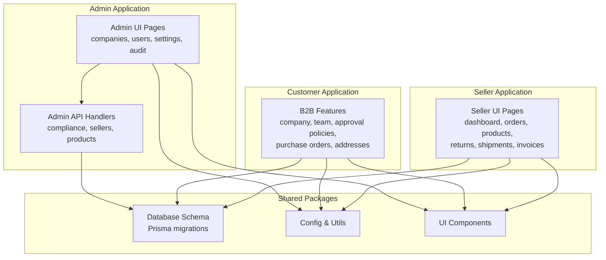

**Section sources**
- [page.tsx](file://apps/admin/src/app/companies/page.tsx)
- [page.tsx](file://apps/admin/src/app/users/page.tsx)
- [page.tsx](file://apps/admin/src/app/settings/page.tsx)
- [page.tsx](file://apps/admin/src/app/audit/page.tsx)
- [page.tsx](file://apps/customer/src/app/b2b/company/page.tsx)
- [page.tsx](file://apps/customer/src/app/b2b/team/page.tsx)
- [page.tsx](file://apps/seller/src/app/dashboard/page.tsx)

## Core Components
- Admin UI: Provides administrative dashboards for companies, users, settings, and audit logs.
- Compliance and Approvals: API routes for approving/rejecting compliance requests, seller onboarding, and product listings.
- Authentication and Authorization: NextAuth-based authentication with middleware enforcing admin sessions.
- Customer B2B: Company profiles, team management, approval policies, purchase orders, and related workflows.
- Seller Operations: Dashboards and actions for orders, products, returns, shipments, and invoicing.
- Database Schema: Prisma migration defines entities for companies, members, approval policies, and related structures.

**Section sources**
- [page.tsx](file://apps/admin/src/app/companies/page.tsx)
- [page.tsx](file://apps/admin/src/app/users/page.tsx)
- [page.tsx](file://apps/admin/src/app/settings/page.tsx)
- [page.tsx](file://apps/admin/src/app/audit/page.tsx)
- [route.ts](file://apps/admin/src/app/api/admin/compliance[id]/approve/route.ts)
- [route.ts](file://apps/admin/src/app/api/admin/compliance[id]/reject/route.ts)
- [route.ts](file://apps/admin/src/app/api/admin/sellers/[id]/approve/route.ts)
- [route.ts](file://apps/admin/src/app/api/admin/sellers/[id]/reject/route.ts)
- [route.ts](file://apps/admin/src/app/api/admin/products[id]/approve/route.ts)
- [page.tsx](file://apps/customer/src/app/b2b/company/page.tsx)
- [page.tsx](file://apps/customer/src/app/b2b/team/page.tsx)
- [page.tsx](file://apps/customer/src/app/b2b/approval-policies/page.tsx)
- [page.tsx](file://apps/customer/src/app/b2b/purchase-orders/page.tsx)
- [page.tsx](file://apps/seller/src/app/dashboard/page.tsx)
- [page.tsx](file://packages/database/prisma/migrations/20260530234542_init_avenick_schema/migration.sql)

## Architecture Overview
The admin module integrates UI pages, API handlers, authentication, and database entities. Administrative actions are protected by middleware and NextAuth. Approval workflows are handled via dedicated API routes.

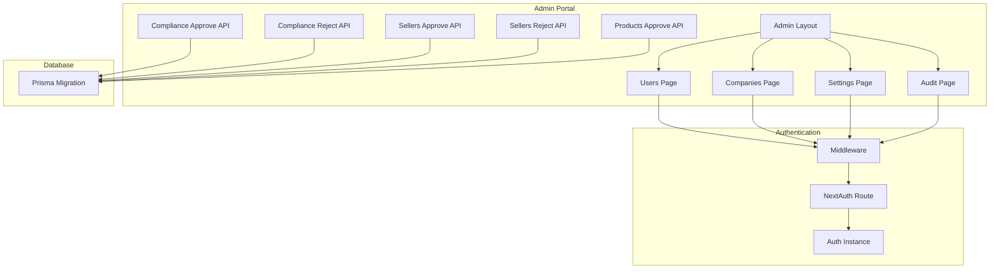

**Diagram sources**
- [admin-layout.tsx](file://apps/admin/src/components/layout/admin-layout.tsx)
- [page.tsx](file://apps/admin/src/app/users/page.tsx)
- [page.tsx](file://apps/admin/src/app/companies/page.tsx)
- [page.tsx](file://apps/admin/src/app/settings/page.tsx)
- [page.tsx](file://apps/admin/src/app/audit/page.tsx)
- [route.ts](file://apps/admin/src/app/api/admin/compliance[id]/approve/route.ts)
- [route.ts](file://apps/admin/src/app/api/admin/compliance[id]/reject/route.ts)
- [route.ts](file://apps/admin/src/app/api/admin/sellers/[id]/approve/route.ts)
- [route.ts](file://apps/admin/src/app/api/admin/sellers/[id]/reject/route.ts)
- [route.ts](file://apps/admin/src/app/api/admin/products[id]/approve/route.ts)
- [route.ts](file://apps/admin/src/app/api/auth[[...nextauth]]/route.ts)
- [middleware.ts](file://apps/admin/src/middleware.ts)
- [auth-instance.ts](file://apps/admin/src/lib/auth-instance.ts)
- [page.tsx](file://packages/database/prisma/migrations/20260530234542_init_avenick_schema/migration.sql)

## Detailed Component Analysis

### User Management
- Role Assignment and Permissions:
  - Roles include company roles such as COMPANY_ADMIN, COMPANY_BUYER, and COMPANY_APPROVER.
  - Team management displays member roles, departments, and statuses.
  - Access control is enforced via middleware requiring admin session for admin pages.
- Account Lifecycle Management:
  - CompanyMember entity supports activation/deactivation and spend limits.
  - Administrative pages present controls for adding and managing users within a company.
- Implementation Notes:
  - Company team page enumerates roles and statuses for members.
  - Admin pages enforce session checks before rendering.

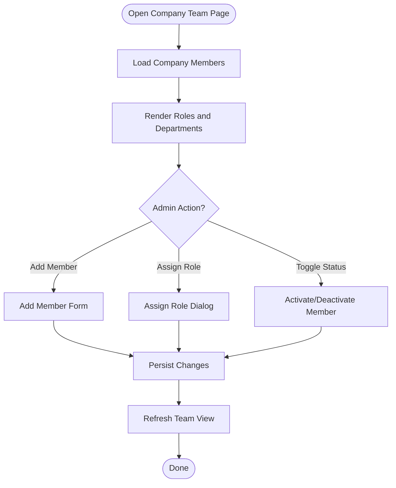

**Section sources**
- [page.tsx](file://apps/customer/src/app/b2b/team/page.tsx)
- [page.tsx](file://apps/customer/src/app/b2b/company/page.tsx)
- [page.tsx](file://apps/admin/src/app/users/page.tsx)
- [middleware.ts](file://apps/admin/src/middleware.ts)

### Company Oversight
- Business Entities and Hierarchies:
  - Company entity captures identifiers, industry, size, location, and status.
  - CompanyMember links users to companies with roles and spend limits.
  - ApprovalPolicy defines spending thresholds and approver requirements per company.
- Multi-User Accounts:
  - Team management enables assigning roles and departments to multiple users.
  - Spend limits and activity metrics support credit management.
- Administrative Controls:
  - Admin dashboard aggregates GMV, credit limits, and active counts.
  - Add company button initiates onboarding workflows.

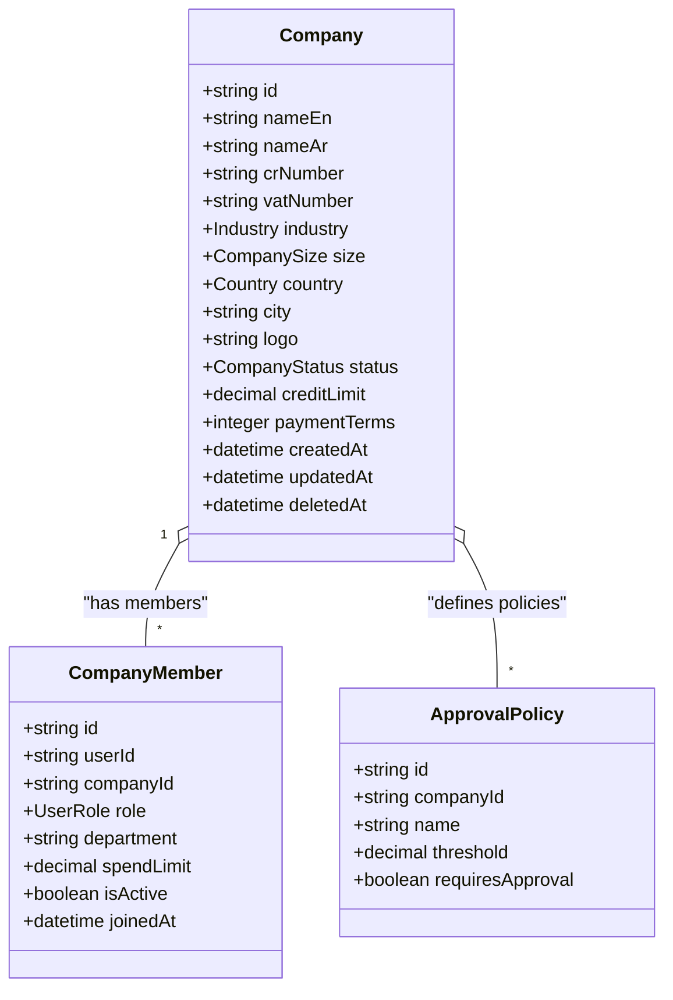

**Diagram sources**
- [page.tsx](file://packages/database/prisma/migrations/20260530234542_init_avenick_schema/migration.sql)

**Section sources**
- [page.tsx](file://apps/admin/src/app/companies/page.tsx)
- [page.tsx](file://apps/customer/src/app/b2b/company/page.tsx)
- [page.tsx](file://apps/customer/src/app/b2b/team/page.tsx)
- [page.tsx](file://packages/database/prisma/migrations/20260530234542_init_avenick_schema/migration.sql)

### System Configuration
- Branding Options:
  - Company logo field supports branding customization.
  - Localization fields (English/Arabic names) enable regional branding.
- Global Parameters and Defaults:
  - Payment terms and credit limits define operational defaults.
  - Approval policies set thresholds and approval requirements.
- Settings Page:
  - Centralized configuration interface for administrators.

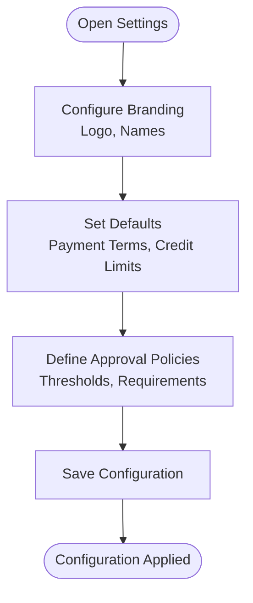

**Section sources**
- [page.tsx](file://apps/admin/src/app/settings/page.tsx)
- [page.tsx](file://packages/database/prisma/migrations/20260530234542_init_avenick_schema/migration.sql)

### Audit Trail
- Tracking Administrative Actions:
  - Audit page provides visibility into administrative activities.
  - Middleware ensures only authorized sessions access audit data.
- User Activities and System Changes:
  - Approval workflows (compliance, sellers, products) log decisions and timestamps.
  - CompanyMember changes reflect activation/deactivation and role updates.

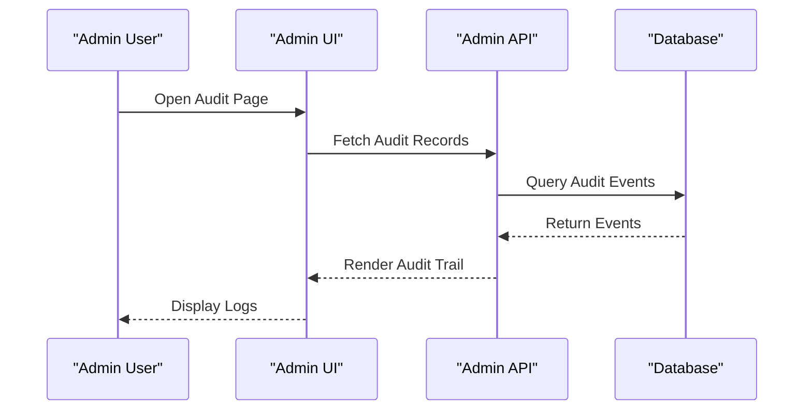

**Section sources**
- [page.tsx](file://apps/admin/src/app/audit/page.tsx)
- [middleware.ts](file://apps/admin/src/middleware.ts)

### Security Policies and Access Controls
- Authentication:
  - NextAuth route handles authentication flows.
  - Auth instance encapsulates session and permissions.
- Authorization:
  - Middleware enforces admin session requirements for admin pages.
  - Admin layout wraps pages to ensure consistent protection.

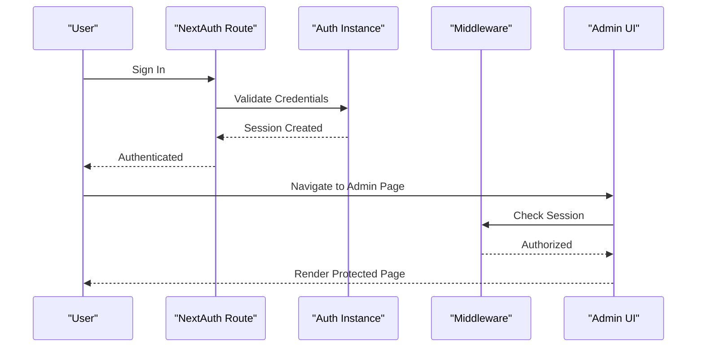

**Section sources**
- [route.ts](file://apps/admin/src/app/api/auth[[...nextauth]]/route.ts)
- [auth-instance.ts](file://apps/admin/src/lib/auth-instance.ts)
- [middleware.ts](file://apps/admin/src/middleware.ts)
- [admin-layout.tsx](file://apps/admin/src/components/layout/admin-layout.tsx)

### Compliance Reporting
- Compliance Requests:
  - Approve/reject routes handle compliance decisions for specific IDs.
  - Decisions are persisted and reflected in audit trails.
- Seller Onboarding and Product Approvals:
  - Dedicated APIs manage seller and product approval lifecycles.

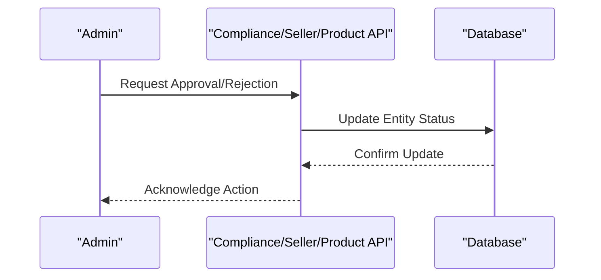

**Section sources**
- [route.ts](file://apps/admin/src/app/api/admin/compliance[id]/approve/route.ts)
- [route.ts](file://apps/admin/src/app/api/admin/compliance[id]/reject/route.ts)
- [route.ts](file://apps/admin/src/app/api/admin/sellers/[id]/approve/route.ts)
- [route.ts](file://apps/admin/src/app/api/admin/sellers/[id]/reject/route.ts)
- [route.ts](file://apps/admin/src/app/api/admin/products[id]/approve/route.ts)

### B2B Company Administration (Customer Portal)
- Company Profile:
  - Displays company details, contact info, and associated users.
- Team Management:
  - Lists members with roles, departments, and statuses.
- Approval Policies:
  - Defines spending thresholds and approval requirements.
- Purchase Orders and Addresses:
  - Manages POs and address book entries with actions for creation and updates.
- Validation and Shell Components:
  - Form validation and shell layouts support consistent UX.

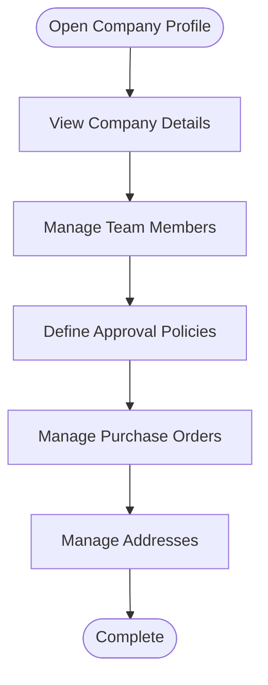

**Section sources**
- [page.tsx](file://apps/customer/src/app/b2b/company/page.tsx)
- [page.tsx](file://apps/customer/src/app/b2b/team/page.tsx)
- [page.tsx](file://apps/customer/src/app/b2b/approval-policies/page.tsx)
- [actions.ts](file://apps/customer/src/app/b2b/approval-policies/actions.ts)
- [page.tsx](file://apps/customer/src/app/b2b/purchase-orders/page.tsx)
- [actions.ts](file://apps/customer/src/app/b2b/purchase-orders/actions.ts)
- [page.tsx](file://apps/customer/src/app/b2b/addresses/page.tsx)
- [actions.ts](file://apps/customer/src/app/b2b/addresses/actions.ts)
- [validated-form.tsx](file://apps/customer/src/components/b2b/validated-form.tsx)
- [b2b-shell.tsx](file://apps/customer/src/components/b2b/b2b-shell.tsx)

### Seller Operations (Seller Portal)
- Dashboard and Analytics:
  - Performance metrics and analytics dashboards.
- Orders and Products:
  - Order management with actions and product catalog maintenance.
- Returns, Shipments, and Invoicing:
  - Operational workflows for returns, shipment tracking, and invoice generation.
- Notifications and Documents:
  - Communication and document management features.

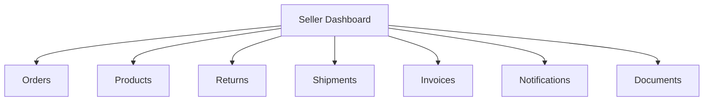

**Section sources**
- [page.tsx](file://apps/seller/src/app/dashboard/page.tsx)
- [page.tsx](file://apps/seller/src/app/orders/page.tsx)
- [actions.ts](file://apps/seller/src/app/orders/actions.ts)
- [page.tsx](file://apps/seller/src/app/products/page.tsx)
- [actions.ts](file://apps/seller/src/app/products/actions.ts)
- [page.tsx](file://apps/seller/src/app/returns/page.tsx)
- [actions.ts](file://apps/seller/src/app/returns/actions.ts)
- [page.tsx](file://apps/seller/src/app/shipments/page.tsx)
- [actions.ts](file://apps/seller/src/app/shipments/actions.ts)
- [page.tsx](file://apps/seller/src/app/invoices/page.tsx)
- [page.tsx](file://apps/seller/src/app/notifications/page.tsx)
- [page.tsx](file://apps/seller/src/app/documents/page.tsx)

## Dependency Analysis
- Admin UI depends on:
  - Admin layout for consistent navigation and protection.
  - Middleware for session enforcement.
  - NextAuth route for authentication.
- API handlers depend on:
  - Database schema for persistence.
  - Auth instance for session validation.
- Customer and Seller portals depend on:
  - Shared UI components and B2B shell for consistent UX.
  - Actions for form submissions and CRUD operations.

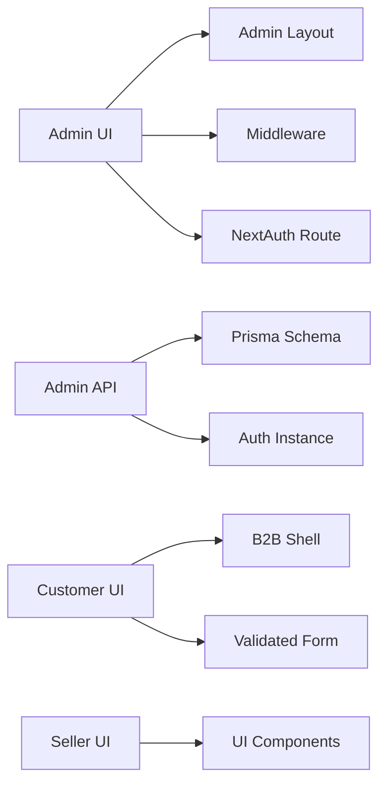

**Diagram sources**
- [admin-layout.tsx](file://apps/admin/src/components/layout/admin-layout.tsx)
- [middleware.ts](file://apps/admin/src/middleware.ts)
- [route.ts](file://apps/admin/src/app/api/auth[[...nextauth]]/route.ts)
- [auth-instance.ts](file://apps/admin/src/lib/auth-instance.ts)
- [page.tsx](file://packages/database/prisma/migrations/20260530234542_init_avenick_schema/migration.sql)
- [b2b-shell.tsx](file://apps/customer/src/components/b2b/b2b-shell.tsx)
- [validated-form.tsx](file://apps/customer/src/components/b2b/validated-form.tsx)

**Section sources**
- [admin-layout.tsx](file://apps/admin/src/components/layout/admin-layout.tsx)
- [middleware.ts](file://apps/admin/src/middleware.ts)
- [route.ts](file://apps/admin/src/app/api/auth[[...nextauth]]/route.ts)
- [auth-instance.ts](file://apps/admin/src/lib/auth-instance.ts)
- [page.tsx](file://packages/database/prisma/migrations/20260530234542_init_avenick_schema/migration.sql)
- [b2b-shell.tsx](file://apps/customer/src/components/b2b/b2b-shell.tsx)
- [validated-form.tsx](file://apps/customer/src/components/b2b/validated-form.tsx)

## Performance Considerations
- Minimize unnecessary re-renders by leveraging server-side rendering for admin pages and caching where appropriate.
- Optimize database queries for audit trails and company/member listings.
- Use pagination and filtering for large datasets in companies, users, and audit logs.
- Offload heavy computations to background jobs where feasible.

## Troubleshooting Guide
- Authentication Failures:
  - Verify NextAuth route configuration and session creation.
  - Ensure auth instance is properly initialized and accessible.
- Authorization Errors:
  - Confirm middleware is applied to admin pages and session validation passes.
- Approval Workflow Issues:
  - Check API routes for compliance, sellers, and products to ensure correct ID handling and persistence.
- Database Consistency:
  - Review Prisma migration for schema correctness and foreign key relationships.

**Section sources**
- [route.ts](file://apps/admin/src/app/api/auth[[...nextauth]]/route.ts)
- [auth-instance.ts](file://apps/admin/src/lib/auth-instance.ts)
- [middleware.ts](file://apps/admin/src/middleware.ts)
- [route.ts](file://apps/admin/src/app/api/admin/compliance[id]/approve/route.ts)
- [route.ts](file://apps/admin/src/app/api/admin/compliance[id]/reject/route.ts)
- [route.ts](file://apps/admin/src/app/api/admin/sellers/[id]/approve/route.ts)
- [route.ts](file://apps/admin/src/app/api/admin/sellers/[id]/reject/route.ts)
- [route.ts](file://apps/admin/src/app/api/admin/products[id]/approve/route.ts)
- [page.tsx](file://packages/database/prisma/migrations/20260530234542_init_avenick_schema/migration.sql)

## Conclusion
The System Administration module provides comprehensive capabilities for managing users, overseeing companies, configuring system defaults, maintaining audit trails, and enforcing security policies. The integration of admin UI, API handlers, authentication, and database entities ensures a cohesive administrative experience across the platform. Extending the module with additional compliance reporting and advanced analytics would further strengthen operational oversight.

## Appendices
- Additional Module Notes:
  - Admin Settings: [MODULE_09_ADMIN_SETTINGS_NOTES.md](file://MODULE_09_ADMIN_SETTINGS_NOTES.md)
  - Pricing and Commission: [MODULE_10_PRICING_COMMISSION_NOTES.md](file://MODULE_10_PRICING_COMMISSION_NOTES.md)
  - AI Automation and Integrations: [MODULE_11_AI_AUTOMATION_INTEGRATIONS_NOTES.md](file://MODULE_11_AI_AUTOMATION_INTEGRATIONS_NOTES.md)
  - Executive Dashboard: [EXECUTIVE_DASHBOARD_NOTES.md](file://EXECUTIVE_DASHBOARD_NOTES.md)
  - Design System: [DESIGN_SYSTEM_NOTES.md](file://DESIGN_SYSTEM_NOTES.md)
  - Branding Updates: [BRANDING_UPDATE_NOTES.md](file://BRANDING_UPDATE_NOTES.md)
  - Database Notes: [DATABASE_NOTES.md](file://DATABASE_NOTES.md)
  - Phase 2 Implementation: [PHASE2_IMPLEMENTATION_NOTES.md](file://PHASE2_IMPLEMENTATION_NOTES.md)
  - Phase 3 Implementation: [PHASE3_IMPLEMENTATION_NOTES.md](file://PHASE3_IMPLEMENTATION_NOTES.md)