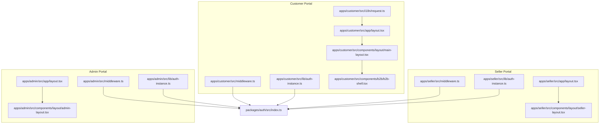
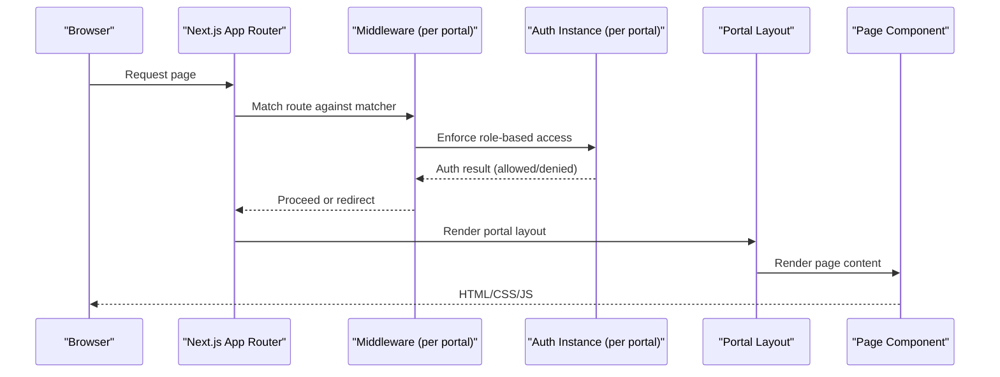
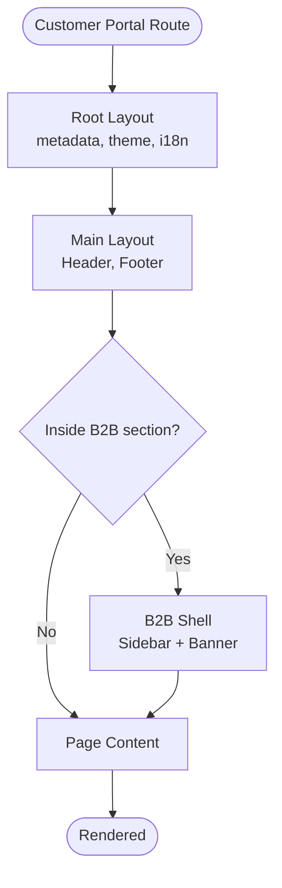
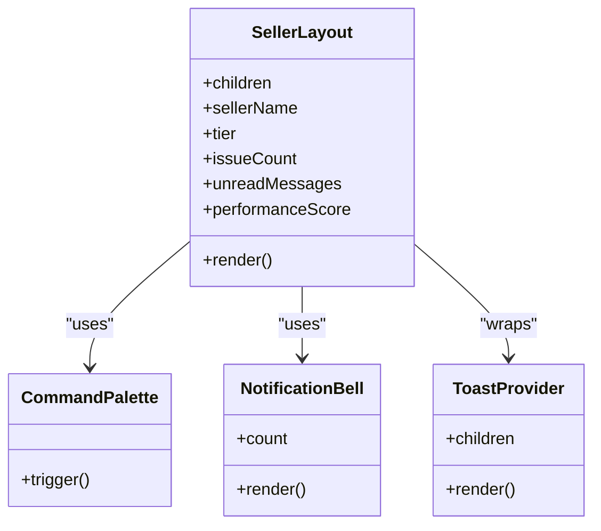
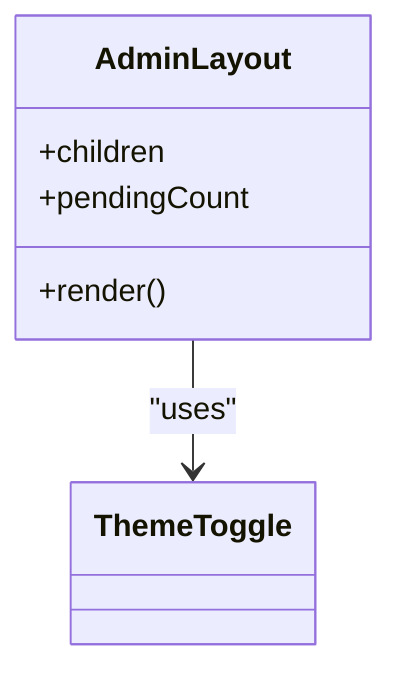
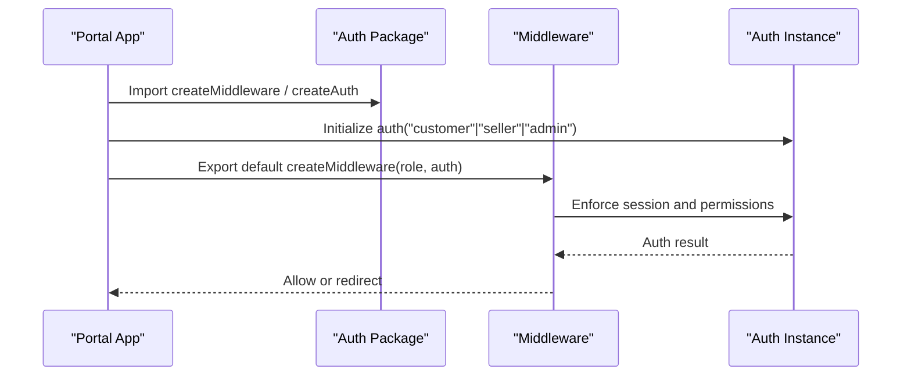
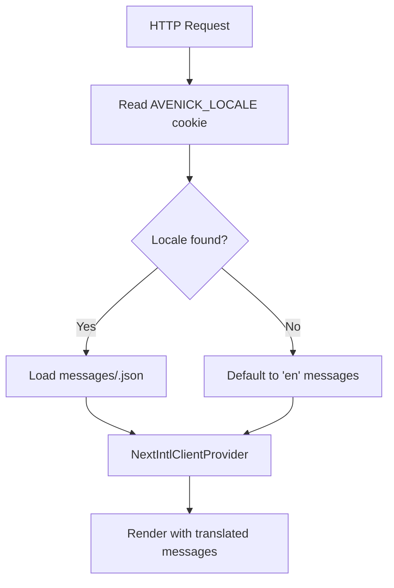
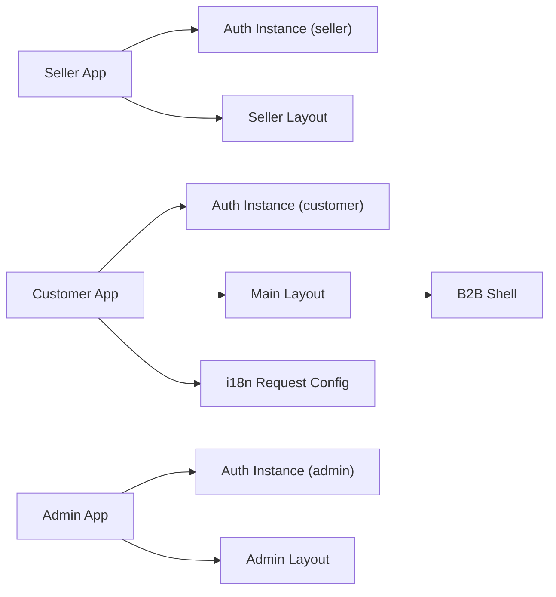

# Application Architecture & Portal Separation

<cite>
**Referenced Files in This Document**
- [apps/customer/src/app/layout.tsx](file://apps/customer/src/app/layout.tsx)
- [apps/admin/src/app/layout.tsx](file://apps/admin/src/app/layout.tsx)
- [apps/seller/src/app/layout.tsx](file://apps/seller/src/app/layout.tsx)
- [apps/customer/src/middleware.ts](file://apps/customer/src/middleware.ts)
- [apps/admin/src/middleware.ts](file://apps/admin/src/middleware.ts)
- [apps/seller/src/middleware.ts](file://apps/seller/src/middleware.ts)
- [apps/customer/src/lib/auth-instance.ts](file://apps/customer/src/lib/auth-instance.ts)
- [apps/admin/src/lib/auth-instance.ts](file://apps/admin/src/lib/auth-instance.ts)
- [apps/seller/src/lib/auth-instance.ts](file://apps/seller/src/lib/auth-instance.ts)
- [apps/customer/src/components/layout/main-layout.tsx](file://apps/customer/src/components/layout/main-layout.tsx)
- [apps/customer/src/components/layout/header.tsx](file://apps/customer/src/components/layout/header.tsx)
- [apps/customer/src/components/layout/footer.tsx](file://apps/customer/src/components/layout/footer.tsx)
- [apps/customer/src/components/b2b/b2b-shell.tsx](file://apps/customer/src/components/b2b/b2b-shell.tsx)
- [apps/admin/src/components/layout/admin-layout.tsx](file://apps/admin/src/components/layout/admin-layout.tsx)
- [apps/seller/src/components/layout/seller-layout.tsx](file://apps/seller/src/components/layout/seller-layout.tsx)
- [apps/customer/src/i18n/request.ts](file://apps/customer/src/i18n/request.ts)
- [apps/admin/messages/en.json](file://apps/admin/messages/en.json)
- [apps/admin/messages/ar.json](file://apps/admin/messages/ar.json)
- [apps/customer/messages/en.json](file://apps/customer/messages/en.json)
- [apps/customer/messages/ar.json](file://apps/customer/messages/ar.json)
- [packages/auth/src/index.ts](file://packages/auth/src/index.ts)
</cite>

## Table of Contents
1. [Introduction](#introduction)
2. [Project Structure](#project-structure)
3. [Core Components](#core-components)
4. [Architecture Overview](#architecture-overview)
5. [Detailed Component Analysis](#detailed-component-analysis)
6. [Dependency Analysis](#dependency-analysis)
7. [Performance Considerations](#performance-considerations)
8. [Troubleshooting Guide](#troubleshooting-guide)
9. [Conclusion](#conclusion)

## Introduction
This document describes the three-portal architecture of the commerce platform: Customer Portal (B2C/B2B), Seller Central, and Admin Console. It explains how each portal is structured, how internationalization and localization are handled, how routing and middleware enforce role-based access, and how shared UI components are reused across portals. It also outlines the navigation patterns, layout components, and inter-application communication strategies grounded in the repository’s codebase.

## Project Structure
The application is organized as a monorepo with three Next.js applications under apps/, each representing a distinct portal:
- Customer Portal: B2C-ready with B2B capabilities, including B2B shell navigation, cart, checkout, orders, and multi-language support.
- Seller Central: Supplier-facing portal for product catalog, orders, inventory, quotes, payouts, and compliance.
- Admin Console: Oversight and operations portal for commerce, B2B trade, suppliers, orders, warehouse, CRM, finance, support, and settings.

Each portal defines:
- An app layout with locale-aware metadata and theme initialization.
- Middleware that enforces role-based access control.
- Authentication instances configured per portal.
- Shared UI components for headers, footers, and layouts.
- Internationalization configuration and message bundles.

**Diagram sources**
- [apps/customer/src/app/layout.tsx:1-31](file://apps/customer/src/app/layout.tsx#L1-L31)
- [apps/admin/src/app/layout.tsx:1-27](file://apps/admin/src/app/layout.tsx#L1-L27)
- [apps/seller/src/app/layout.tsx:1-29](file://apps/seller/src/app/layout.tsx#L1-L29)
- [apps/customer/src/middleware.ts:1-9](file://apps/customer/src/middleware.ts#L1-L9)
- [apps/admin/src/middleware.ts:1-9](file://apps/admin/src/middleware.ts#L1-L9)
- [apps/seller/src/middleware.ts:1-9](file://apps/seller/src/middleware.ts#L1-L9)
- [apps/customer/src/lib/auth-instance.ts:1-4](file://apps/customer/src/lib/auth-instance.ts#L1-L4)
- [apps/admin/src/lib/auth-instance.ts:1-4](file://apps/admin/src/lib/auth-instance.ts#L1-L4)
- [apps/seller/src/lib/auth-instance.ts:1-4](file://apps/seller/src/lib/auth-instance.ts#L1-L4)
- [apps/customer/src/components/layout/main-layout.tsx:1-13](file://apps/customer/src/components/layout/main-layout.tsx#L1-L13)
- [apps/customer/src/components/b2b/b2b-shell.tsx:1-106](file://apps/customer/src/components/b2b/b2b-shell.tsx#L1-L106)
- [apps/admin/src/components/layout/admin-layout.tsx:1-267](file://apps/admin/src/components/layout/admin-layout.tsx#L1-L267)
- [apps/seller/src/components/layout/seller-layout.tsx:1-298](file://apps/seller/src/components/layout/seller-layout.tsx#L1-L298)
- [apps/customer/src/i18n/request.ts:1-13](file://apps/customer/src/i18n/request.ts#L1-L13)
- [packages/auth/src/index.ts:1-4](file://packages/auth/src/index.ts#L1-L4)

**Section sources**
- [apps/customer/src/app/layout.tsx:1-31](file://apps/customer/src/app/layout.tsx#L1-L31)
- [apps/admin/src/app/layout.tsx:1-27](file://apps/admin/src/app/layout.tsx#L1-L27)
- [apps/seller/src/app/layout.tsx:1-29](file://apps/seller/src/app/layout.tsx#L1-L29)
- [apps/customer/src/middleware.ts:1-9](file://apps/customer/src/middleware.ts#L1-L9)
- [apps/admin/src/middleware.ts:1-9](file://apps/admin/src/middleware.ts#L1-L9)
- [apps/seller/src/middleware.ts:1-9](file://apps/seller/src/middleware.ts#L1-L9)
- [apps/customer/src/lib/auth-instance.ts:1-4](file://apps/customer/src/lib/auth-instance.ts#L1-L4)
- [apps/admin/src/lib/auth-instance.ts:1-4](file://apps/admin/src/lib/auth-instance.ts#L1-L4)
- [apps/seller/src/lib/auth-instance.ts:1-4](file://apps/seller/src/lib/auth-instance.ts#L1-L4)
- [apps/customer/src/i18n/request.ts:1-13](file://apps/customer/src/i18n/request.ts#L1-L13)
- [packages/auth/src/index.ts:1-4](file://packages/auth/src/index.ts#L1-L4)

## Core Components
- Role-based middleware: Each portal uses a shared middleware factory to enforce role-scoped access. The middleware is configured per portal and applies to all routes except static assets.
- Authentication instances: Each portal has a dedicated authentication instance exported from a shared package, ensuring consistent auth behavior across portals.
- Layouts and navigation:
  - Customer Portal: Uses a main layout composed of header, main content, and footer, with a B2B shell wrapper for B2B features.
  - Seller Central: Provides a responsive sidebar navigation with grouped sections, badges for counts, and a performance indicator.
  - Admin Console: Implements a collapsible sidebar, mobile overlay, search, notifications, and a comprehensive navigation across commerce, B2B trade, suppliers, orders, warehouse, CRM, finance, support, and settings.
- Internationalization: The Customer Portal resolves locale via a server-side request configuration and loads messages from JSON files. Admin messages are present for English and Arabic.

Key implementation references:
- Middleware configuration and matcher patterns
- Authentication instance exports
- Layout composition and navigation shells
- i18n request configuration

**Section sources**
- [apps/customer/src/middleware.ts:1-9](file://apps/customer/src/middleware.ts#L1-L9)
- [apps/admin/src/middleware.ts:1-9](file://apps/admin/src/middleware.ts#L1-L9)
- [apps/seller/src/middleware.ts:1-9](file://apps/seller/src/middleware.ts#L1-L9)
- [apps/customer/src/lib/auth-instance.ts:1-4](file://apps/customer/src/lib/auth-instance.ts#L1-L4)
- [apps/admin/src/lib/auth-instance.ts:1-4](file://apps/admin/src/lib/auth-instance.ts#L1-L4)
- [apps/seller/src/lib/auth-instance.ts:1-4](file://apps/seller/src/lib/auth-instance.ts#L1-L4)
- [apps/customer/src/components/layout/main-layout.tsx:1-13](file://apps/customer/src/components/layout/main-layout.tsx#L1-L13)
- [apps/customer/src/components/b2b/b2b-shell.tsx:1-106](file://apps/customer/src/components/b2b/b2b-shell.tsx#L1-L106)
- [apps/admin/src/components/layout/admin-layout.tsx:1-267](file://apps/admin/src/components/layout/admin-layout.tsx#L1-L267)
- [apps/seller/src/components/layout/seller-layout.tsx:1-298](file://apps/seller/src/components/layout/seller-layout.tsx#L1-L298)
- [apps/customer/src/i18n/request.ts:1-13](file://apps/customer/src/i18n/request.ts#L1-L13)

## Architecture Overview
The architecture separates concerns by portal while sharing authentication and UI utilities:
- Authentication: A single auth package exposes a factory to create role-scoped auth instances and middleware. Each portal imports and configures its own instance.
- Routing and middleware: Middleware enforces role-based access for each portal and applies to dynamic routes and pages.
- Layouts and navigation: Each portal composes a root layout with locale-aware metadata and theme initialization, then wraps page content with a tailored layout and navigation shell.
- Internationalization: Customer Portal resolves locale from cookies and loads messages dynamically. Admin messages are included for English and Arabic.

**Diagram sources**
- [apps/customer/src/middleware.ts:1-9](file://apps/customer/src/middleware.ts#L1-L9)
- [apps/admin/src/middleware.ts:1-9](file://apps/admin/src/middleware.ts#L1-L9)
- [apps/seller/src/middleware.ts:1-9](file://apps/seller/src/middleware.ts#L1-L9)
- [apps/customer/src/lib/auth-instance.ts:1-4](file://apps/customer/src/lib/auth-instance.ts#L1-L4)
- [apps/admin/src/lib/auth-instance.ts:1-4](file://apps/admin/src/lib/auth-instance.ts#L1-L4)
- [apps/seller/src/lib/auth-instance.ts:1-4](file://apps/seller/src/lib/auth-instance.ts#L1-L4)
- [apps/customer/src/app/layout.tsx:1-31](file://apps/customer/src/app/layout.tsx#L1-L31)
- [apps/admin/src/app/layout.tsx:1-27](file://apps/admin/src/app/layout.tsx#L1-L27)
- [apps/seller/src/app/layout.tsx:1-29](file://apps/seller/src/app/layout.tsx#L1-L29)

## Detailed Component Analysis

### Customer Portal (B2C/B2B)
- Dual shopping experience:
  - B2C browsing and purchasing flows are supported via product listings, cart, checkout, and orders.
  - B2B features are encapsulated in a B2B shell with dedicated navigation for purchase orders, RFQs, quotes, approvals, billing, analytics, team management, delivery sites, and company settings.
- Layout and navigation:
  - Root layout sets metadata, theme persistence, and locale-aware provider.
  - Main layout composes header, main content, and footer.
  - B2B shell provides a sidebar navigation and a “Business Portal” banner, with active-state highlighting based on current path.
- Multi-language support:
  - i18n request configuration reads the locale from cookies and loads messages from JSON files for English and Arabic.

**Diagram sources**
- [apps/customer/src/app/layout.tsx:1-31](file://apps/customer/src/app/layout.tsx#L1-L31)
- [apps/customer/src/components/layout/main-layout.tsx:1-13](file://apps/customer/src/components/layout/main-layout.tsx#L1-L13)
- [apps/customer/src/components/b2b/b2b-shell.tsx:1-106](file://apps/customer/src/components/b2b/b2b-shell.tsx#L1-L106)
- [apps/customer/src/i18n/request.ts:1-13](file://apps/customer/src/i18n/request.ts#L1-L13)

**Section sources**
- [apps/customer/src/components/b2b/b2b-shell.tsx:1-106](file://apps/customer/src/components/b2b/b2b-shell.tsx#L1-L106)
- [apps/customer/src/components/layout/main-layout.tsx:1-13](file://apps/customer/src/components/layout/main-layout.tsx#L1-L13)
- [apps/customer/src/components/layout/header.tsx](file://apps/customer/src/components/layout/header.tsx)
- [apps/customer/src/components/layout/footer.tsx](file://apps/customer/src/components/layout/footer.tsx)
- [apps/customer/src/i18n/request.ts:1-13](file://apps/customer/src/i18n/request.ts#L1-L13)

### Seller Central
- Supplier management and product control:
  - Dashboard, analytics, performance overview, product catalog, inventory, bulk upload issues, orders, shipments, returns, quotes, messaging, payouts, invoices, compliance, and support.
- Order processing:
  - Dedicated order and shipment sections with actions and badges for counts.
- Layout and navigation:
  - Collapsible sidebar with grouped navigation items, performance score indicator, and user dropdown.
  - Responsive mobile overlay and search integration.

**Diagram sources**
- [apps/seller/src/components/layout/seller-layout.tsx:1-298](file://apps/seller/src/components/layout/seller-layout.tsx#L1-L298)

**Section sources**
- [apps/seller/src/components/layout/seller-layout.tsx:1-298](file://apps/seller/src/components/layout/seller-layout.tsx#L1-L298)

### Admin Console
- System oversight and business intelligence:
  - Dashboard, AI insights, automation, commerce (products, categories, brands, deals, pricing/commission), B2B trade (companies, RFQs, quotes, approvals), supplier network (all suppliers, pending, documents, performance), orders (all orders, shipments, returns, dispatch), warehouse (overview, inbound, stock, pick/pack), CRM (accounts, campaigns, segments, retention), finance (invoices, payments, settlements, VAT), support (tickets, disputes, SLA monitor), and settings (users, integrations, audit trail, settings).
- Layout and navigation:
  - Collapsible sidebar with grouped sections, badges for pending items, search, notifications, theme toggle, and user menu.

**Diagram sources**
- [apps/admin/src/components/layout/admin-layout.tsx:1-267](file://apps/admin/src/components/layout/admin-layout.tsx#L1-L267)

**Section sources**
- [apps/admin/src/components/layout/admin-layout.tsx:1-267](file://apps/admin/src/components/layout/admin-layout.tsx#L1-L267)

### Authentication and Middleware
- Role-based access:
  - Each portal imports a middleware factory from the shared auth package and configures it with its role identifier and auth instance.
  - The middleware matcher excludes static assets and favicon, applying to all dynamic routes.
- Authentication instances:
  - Each portal creates a role-scoped auth instance exported from the shared package.

**Diagram sources**
- [packages/auth/src/index.ts:1-4](file://packages/auth/src/index.ts#L1-L4)
- [apps/customer/src/middleware.ts:1-9](file://apps/customer/src/middleware.ts#L1-L9)
- [apps/admin/src/middleware.ts:1-9](file://apps/admin/src/middleware.ts#L1-L9)
- [apps/seller/src/middleware.ts:1-9](file://apps/seller/src/middleware.ts#L1-L9)
- [apps/customer/src/lib/auth-instance.ts:1-4](file://apps/customer/src/lib/auth-instance.ts#L1-L4)
- [apps/admin/src/lib/auth-instance.ts:1-4](file://apps/admin/src/lib/auth-instance.ts#L1-L4)
- [apps/seller/src/lib/auth-instance.ts:1-4](file://apps/seller/src/lib/auth-instance.ts#L1-L4)

**Section sources**
- [packages/auth/src/index.ts:1-4](file://packages/auth/src/index.ts#L1-L4)
- [apps/customer/src/middleware.ts:1-9](file://apps/customer/src/middleware.ts#L1-L9)
- [apps/admin/src/middleware.ts:1-9](file://apps/admin/src/middleware.ts#L1-L9)
- [apps/seller/src/middleware.ts:1-9](file://apps/seller/src/middleware.ts#L1-L9)
- [apps/customer/src/lib/auth-instance.ts:1-4](file://apps/customer/src/lib/auth-instance.ts#L1-L4)
- [apps/admin/src/lib/auth-instance.ts:1-4](file://apps/admin/src/lib/auth-instance.ts#L1-L4)
- [apps/seller/src/lib/auth-instance.ts:1-4](file://apps/seller/src/lib/auth-instance.ts#L1-L4)

### Internationalization and Localization
- Customer Portal:
  - Locale resolution via server-side request configuration reads a cookie for the preferred language and loads messages from JSON files.
  - Root layout wraps children with an internationalization provider.
- Admin Portal:
  - Message bundles exist for English and Arabic, enabling localized content.

**Diagram sources**
- [apps/customer/src/i18n/request.ts:1-13](file://apps/customer/src/i18n/request.ts#L1-L13)
- [apps/customer/src/app/layout.tsx:1-31](file://apps/customer/src/app/layout.tsx#L1-L31)
- [apps/admin/messages/en.json](file://apps/admin/messages/en.json)
- [apps/admin/messages/ar.json](file://apps/admin/messages/ar.json)
- [apps/customer/messages/en.json](file://apps/customer/messages/en.json)
- [apps/customer/messages/ar.json](file://apps/customer/messages/ar.json)

**Section sources**
- [apps/customer/src/i18n/request.ts:1-13](file://apps/customer/src/i18n/request.ts#L1-L13)
- [apps/customer/src/app/layout.tsx:1-31](file://apps/customer/src/app/layout.tsx#L1-L31)

## Dependency Analysis
- Portal-to-auth dependency:
  - Each portal depends on the shared auth package for middleware and auth instances.
- UI and shared components:
  - Customer Portal composes a main layout and B2B shell from its components directory.
  - Seller and Admin Portals each define their own layout components.
- i18n:
  - Customer Portal depends on its i18n request configuration and message files.

**Diagram sources**
- [apps/customer/src/lib/auth-instance.ts:1-4](file://apps/customer/src/lib/auth-instance.ts#L1-L4)
- [apps/seller/src/lib/auth-instance.ts:1-4](file://apps/seller/src/lib/auth-instance.ts#L1-L4)
- [apps/admin/src/lib/auth-instance.ts:1-4](file://apps/admin/src/lib/auth-instance.ts#L1-L4)
- [apps/customer/src/components/layout/main-layout.tsx:1-13](file://apps/customer/src/components/layout/main-layout.tsx#L1-L13)
- [apps/customer/src/components/b2b/b2b-shell.tsx:1-106](file://apps/customer/src/components/b2b/b2b-shell.tsx#L1-L106)
- [apps/seller/src/components/layout/seller-layout.tsx:1-298](file://apps/seller/src/components/layout/seller-layout.tsx#L1-L298)
- [apps/admin/src/components/layout/admin-layout.tsx:1-267](file://apps/admin/src/components/layout/admin-layout.tsx#L1-L267)
- [apps/customer/src/i18n/request.ts:1-13](file://apps/customer/src/i18n/request.ts#L1-L13)

**Section sources**
- [apps/customer/src/lib/auth-instance.ts:1-4](file://apps/customer/src/lib/auth-instance.ts#L1-L4)
- [apps/seller/src/lib/auth-instance.ts:1-4](file://apps/seller/src/lib/auth-instance.ts#L1-L4)
- [apps/admin/src/lib/auth-instance.ts:1-4](file://apps/admin/src/lib/auth-instance.ts#L1-L4)
- [apps/customer/src/components/layout/main-layout.tsx:1-13](file://apps/customer/src/components/layout/main-layout.tsx#L1-L13)
- [apps/customer/src/components/b2b/b2b-shell.tsx:1-106](file://apps/customer/src/components/b2b/b2b-shell.tsx#L1-L106)
- [apps/seller/src/components/layout/seller-layout.tsx:1-298](file://apps/seller/src/components/layout/seller-layout.tsx#L1-L298)
- [apps/admin/src/components/layout/admin-layout.tsx:1-267](file://apps/admin/src/components/layout/admin-layout.tsx#L1-L267)
- [apps/customer/src/i18n/request.ts:1-13](file://apps/customer/src/i18n/request.ts#L1-L13)

## Performance Considerations
- Middleware matcher exclusions reduce unnecessary auth checks for static assets and images.
- Theme persistence avoids layout shifts by hydrating early in the root layout.
- Collapsible sidebars in Admin and Seller Portals improve responsiveness and reduce render overhead on smaller screens.
- Badge counts for pending items help users focus on high-priority tasks without extra navigation.

## Troubleshooting Guide
- Authentication redirects:
  - If a user is redirected unexpectedly, verify the portal’s middleware configuration and the auth instance role.
- Locale issues:
  - If translations do not load, confirm the cookie value and presence of the corresponding message file.
- Layout hydration warnings:
  - Theme initialization occurs in the root layout head; ensure suppressHydrationWarning is used appropriately to avoid mismatches.

**Section sources**
- [apps/customer/src/middleware.ts:1-9](file://apps/customer/src/middleware.ts#L1-L9)
- [apps/admin/src/middleware.ts:1-9](file://apps/admin/src/middleware.ts#L1-L9)
- [apps/seller/src/middleware.ts:1-9](file://apps/seller/src/middleware.ts#L1-L9)
- [apps/customer/src/i18n/request.ts:1-13](file://apps/customer/src/i18n/request.ts#L1-L13)
- [apps/customer/src/app/layout.tsx:1-31](file://apps/customer/src/app/layout.tsx#L1-L31)
- [apps/admin/src/app/layout.tsx:1-27](file://apps/admin/src/app/layout.tsx#L1-L27)
- [apps/seller/src/app/layout.tsx:1-29](file://apps/seller/src/app/layout.tsx#L1-L29)

## Conclusion
The three-portal architecture cleanly separates roles and responsibilities while leveraging shared authentication and UI utilities. Middleware and auth instances ensure secure, role-scoped access. Layouts and navigation shells provide consistent experiences tailored to each audience. Internationalization is implemented with locale-aware providers and message bundles. This foundation supports scalable enhancements across commerce, B2B trade, supplier management, and administrative oversight.