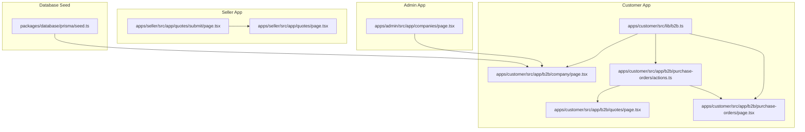
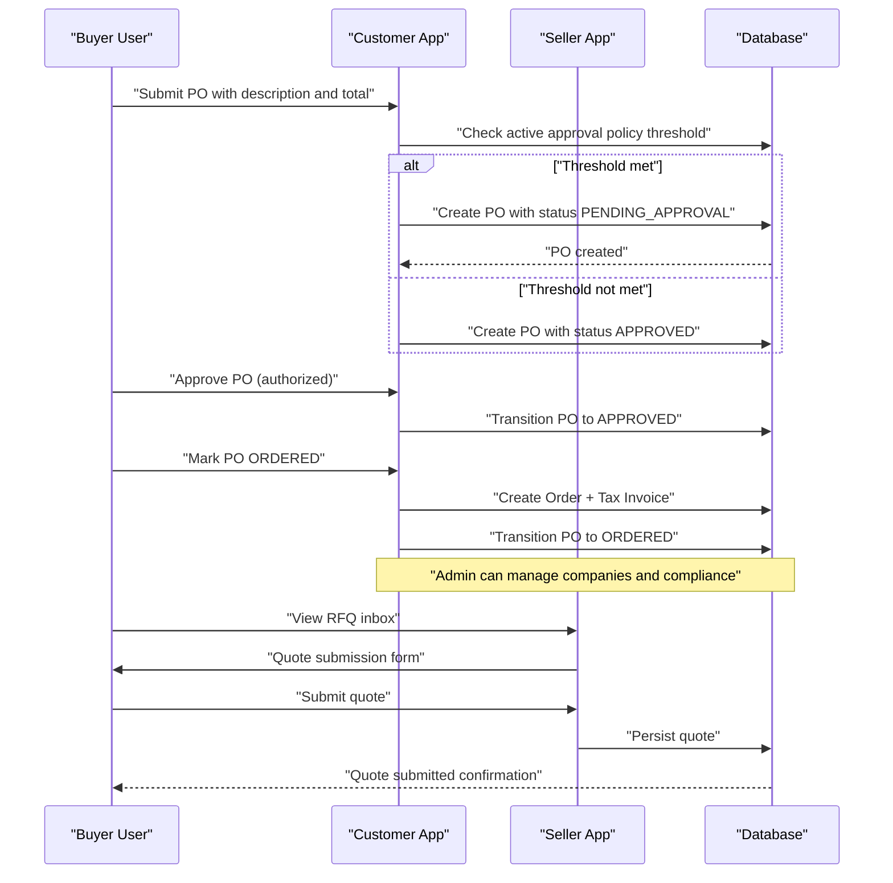
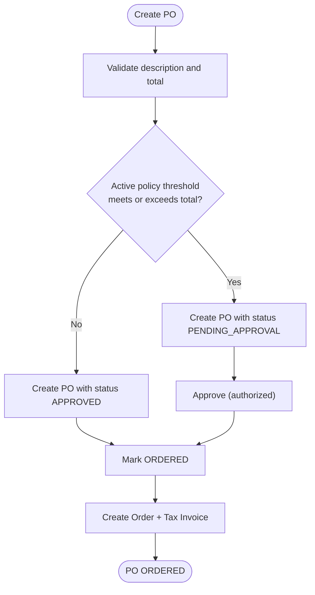
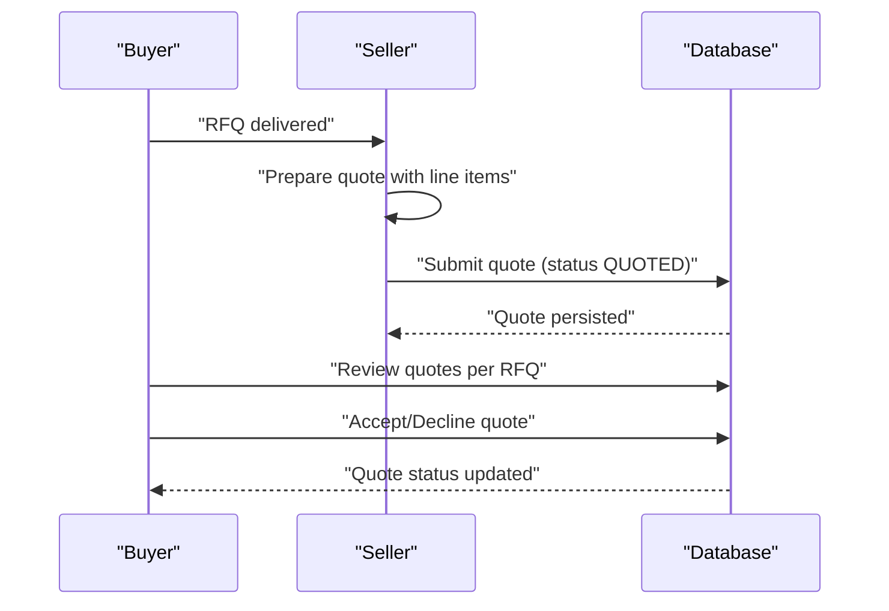
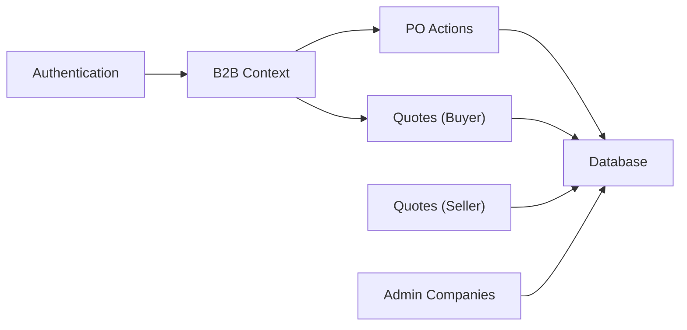

# B2B Business Features

<cite>
**Referenced Files in This Document**
- [b2b.ts](file://apps/customer/src/lib/b2b.ts)
- [page.tsx](file://apps/customer/src/app/b2b/company/page.tsx)
- [page.tsx](file://apps/admin/src/app/companies/page.tsx)
- [page.tsx](file://apps/customer/src/app/b2b/purchase-orders/page.tsx)
- [actions.ts](file://apps/customer/src/app/b2b/purchase-orders/actions.ts)
- [page.tsx](file://apps/customer/src/app/b2b/quotes/page.tsx)
- [page.tsx](file://apps/seller/src/app/quotes/submit/page.tsx)
- [page.tsx](file://apps/seller/src/app/quotes/page.tsx)
- [seed.ts](file://packages/database/prisma/seed.ts)
</cite>

## Table of Contents
1. [Introduction](#introduction)
2. [Project Structure](#project-structure)
3. [Core Components](#core-components)
4. [Architecture Overview](#architecture-overview)
5. [Detailed Component Analysis](#detailed-component-analysis)
6. [Dependency Analysis](#dependency-analysis)
7. [Performance Considerations](#performance-considerations)
8. [Troubleshooting Guide](#troubleshooting-guide)
9. [Conclusion](#conclusion)
10. [Appendices](#appendices)

## Introduction
This document describes the B2B Business Features implemented in the commerce platform. It focuses on:
- Business registration and company verification
- Tax information and invoicing
- Purchase Order lifecycle (creation, approval routing, status tracking)
- Quoting functionality for RFQs and bulk orders
- Team management (invitations, roles, permissions)
- Approval policies and spending limits
- Address book management for multiple delivery and billing locations
- Business account benefits, volume discounts, contract management, and reporting
- ERP integration points, procurement workflows, and compliance

Where applicable, this document maps features to concrete source files and highlights the control flows and data transformations.

## Project Structure
The B2B features span three Next.js applications:
- Customer app: Buyer-facing B2B portal (registration, POs, quotes, team, addresses, billing)
- Seller app: Supplier-facing quote submission and history
- Admin app: Oversight of companies, compliance, and governance

Key B2B areas:
- Buyer context resolution and shell: [b2b.ts](file://apps/customer/src/lib/b2b.ts)
- Company profile and trade documents: [page.tsx](file://apps/customer/src/app/b2b/company/page.tsx)
- Company listing and admin controls: [page.tsx](file://apps/admin/src/app/companies/page.tsx)
- Purchase Orders (list, creation, approval, placement, cancellation): [page.tsx](file://apps/customer/src/app/b2b/purchase-orders/page.tsx), [actions.ts](file://apps/customer/src/app/b2b/purchase-orders/actions.ts)
- Quotes (buyer view and seller submission): [page.tsx](file://apps/customer/src/app/b2b/quotes/page.tsx), [page.tsx](file://apps/seller/src/app/quotes/submit/page.tsx), [page.tsx](file://apps/seller/src/app/quotes/page.tsx)
- Seed data for a B2B company and admin: [seed.ts](file://packages/database/prisma/seed.ts)

**Diagram sources**
- [b2b.ts:1-23](file://apps/customer/src/lib/b2b.ts#L1-L23)
- [page.tsx:139-170](file://apps/customer/src/app/b2b/company/page.tsx#L139-L170)
- [page.tsx:24-51](file://apps/customer/src/app/b2b/purchase-orders/page.tsx#L24-L51)
- [actions.ts:1-120](file://apps/customer/src/app/b2b/purchase-orders/actions.ts#L1-L120)
- [page.tsx:1-41](file://apps/customer/src/app/b2b/quotes/page.tsx#L1-L41)
- [page.tsx:1-65](file://apps/seller/src/app/quotes/submit/page.tsx#L1-L65)
- [page.tsx:1-22](file://apps/seller/src/app/quotes/page.tsx#L1-L22)
- [page.tsx:1-27](file://apps/admin/src/app/companies/page.tsx#L1-L27)
- [seed.ts:144-185](file://packages/database/prisma/seed.ts#L144-L185)

**Section sources**
- [b2b.ts:1-23](file://apps/customer/src/lib/b2b.ts#L1-L23)
- [page.tsx:139-170](file://apps/customer/src/app/b2b/company/page.tsx#L139-L170)
- [page.tsx:1-27](file://apps/admin/src/app/companies/page.tsx#L1-L27)
- [page.tsx:24-51](file://apps/customer/src/app/b2b/purchase-orders/page.tsx#L24-L51)
- [actions.ts:1-120](file://apps/customer/src/app/b2b/purchase-orders/actions.ts#L1-L120)
- [page.tsx:1-41](file://apps/customer/src/app/b2b/quotes/page.tsx#L1-L41)
- [page.tsx:1-65](file://apps/seller/src/app/quotes/submit/page.tsx#L1-L65)
- [page.tsx:1-22](file://apps/seller/src/app/quotes/page.tsx#L1-L22)
- [seed.ts:144-185](file://packages/database/prisma/seed.ts#L144-L185)

## Core Components
- B2B context resolver: Resolves current user’s company membership and exposes company and role for authorization.
- Purchase Order module: Handles creation, approval routing, placement into orders/invoices, and cancellation.
- Quoting module: Buyer view of received quotes; seller submission of quotes against RFQs.
- Company profile: Displays company details, trade documents, and account manager.
- Admin companies: Lists companies, statuses, credit metrics, and health indicators.
- Seed data: Pre-populates a B2B company and admin user for development.

**Section sources**
- [b2b.ts:11-23](file://apps/customer/src/lib/b2b.ts#L11-L23)
- [actions.ts:20-47](file://apps/customer/src/app/b2b/purchase-orders/actions.ts#L20-L47)
- [page.tsx:10-21](file://apps/customer/src/app/b2b/quotes/page.tsx#L10-L21)
- [page.tsx:20-54](file://apps/seller/src/app/quotes/submit/page.tsx#L20-L54)
- [page.tsx:139-170](file://apps/customer/src/app/b2b/company/page.tsx#L139-L170)
- [page.tsx:10-25](file://apps/admin/src/app/companies/page.tsx#L10-L25)
- [seed.ts:144-185](file://packages/database/prisma/seed.ts#L144-L185)

## Architecture Overview
The B2B architecture centers on:
- Buyer context: Determined via authentication and company membership
- Approval policies: Threshold-based routing of POs to approvers
- PO-to-order conversion: Creates orders and tax invoices upon approval
- Quote lifecycle: RFQ distribution to sellers, quote submissions, acceptance/rejection
- Admin oversight: Company management, compliance, and governance

**Diagram sources**
- [actions.ts:20-47](file://apps/customer/src/app/b2b/purchase-orders/actions.ts#L20-L47)
- [actions.ts:59-67](file://apps/customer/src/app/b2b/purchase-orders/actions.ts#L59-L67)
- [actions.ts:70-116](file://apps/customer/src/app/b2b/purchase-orders/actions.ts#L70-L116)
- [page.tsx:50-54](file://apps/seller/src/app/quotes/submit/page.tsx#L50-L54)

## Detailed Component Analysis

### Business Registration and Company Verification
- Company entity includes identifiers (CR number), VAT number, industry, size, location, status, credit limit, and payment terms.
- Trade documents section displays validity and expiring soon notices.
- Admin dashboard lists companies with health and credit metrics.

Implementation highlights:
- Company creation/upsert in seed data demonstrates CR/VAT fields and credit limit.
- Company page aggregates trade document status and account manager contact.

**Section sources**
- [seed.ts:160-183](file://packages/database/prisma/seed.ts#L160-L183)
- [page.tsx:139-170](file://apps/customer/src/app/b2b/company/page.tsx#L139-L170)
- [page.tsx:10-25](file://apps/admin/src/app/companies/page.tsx#L10-L25)

### Tax Information Collection and Invoicing
- Upon marking a PO ORDERED, the system computes VAT based on currency and creates an order and tax invoice.
- VAT rates are applied per currency (e.g., SAR vs others).

Processing logic:
- Compute subtotal, VAT amount, and total
- Generate order number and invoice number
- Persist order and tax invoice under the PO

**Section sources**
- [actions.ts:76-112](file://apps/customer/src/app/b2b/purchase-orders/actions.ts#L76-L112)

### Purchase Order System
- Creation: Validates description and total; checks active approval policy threshold; auto-approves if threshold not met; otherwise routes to approval.
- Approval routing: Approver roles are enforced; transitions PO status accordingly.
- Status tracking: Draft, Pending Approval, Approved, Ordered, Rejected, Cancelled.
- Placement: Converts approved PO into an order and tax invoice; updates PO status to ORDERED.
- Cancellation: Allows cancellation from draft, pending approval, or approved states.

**Diagram sources**
- [actions.ts:20-47](file://apps/customer/src/app/b2b/purchase-orders/actions.ts#L20-L47)
- [actions.ts:59-67](file://apps/customer/src/app/b2b/purchase-orders/actions.ts#L59-L67)
- [actions.ts:70-116](file://apps/customer/src/app/b2b/purchase-orders/actions.ts#L70-L116)

**Section sources**
- [page.tsx:24-51](file://apps/customer/src/app/b2b/purchase-orders/page.tsx#L24-L51)
- [actions.ts:20-47](file://apps/customer/src/app/b2b/purchase-orders/actions.ts#L20-L47)
- [actions.ts:59-67](file://apps/customer/src/app/b2b/purchase-orders/actions.ts#L59-L67)
- [actions.ts:70-116](file://apps/customer/src/app/b2b/purchase-orders/actions.ts#L70-L116)
- [actions.ts:118-120](file://apps/customer/src/app/b2b/purchase-orders/actions.ts#L118-L120)

### Quoting Functionality for Bulk Orders and Proposal Management
- Buyer view: Groups quotes by RFQ, shows status (received, accepted, declined, expired), totals, and seller details.
- Seller submission: RFQ-driven quote form with line items, valid until date, payment terms, and notes; computes subtotal, VAT, and total; submits to buyer.

**Diagram sources**
- [page.tsx:10-21](file://apps/customer/src/app/b2b/quotes/page.tsx#L10-L21)
- [page.tsx:20-54](file://apps/seller/src/app/quotes/submit/page.tsx#L20-L54)
- [page.tsx:10-20](file://apps/seller/src/app/quotes/page.tsx#L10-L20)

**Section sources**
- [page.tsx:10-21](file://apps/customer/src/app/b2b/quotes/page.tsx#L10-L21)
- [page.tsx:20-54](file://apps/seller/src/app/quotes/submit/page.tsx#L20-L54)
- [page.tsx:10-20](file://apps/seller/src/app/quotes/page.tsx#L10-L20)

### Team Management: Invitations, Roles, and Permissions
- B2B context includes user ID, membership, company, and role.
- Approver roles are enforced for PO approval actions.
- Company admin can manage members and departments.

**Section sources**
- [b2b.ts:11-23](file://apps/customer/src/lib/b2b.ts#L11-L23)
- [actions.ts:14-57](file://apps/customer/src/app/b2b/purchase-orders/actions.ts#L14-L57)
- [seed.ts:175-181](file://packages/database/prisma/seed.ts#L175-L181)

### Approval Policies Configuration, Spending Limits, and Authorization Workflows
- Active approval policies define thresholds; POs exceeding threshold are routed for approval.
- Authorization requires approver roles; transitions enforce allowed state changes.

**Section sources**
- [actions.ts:30-32](file://apps/customer/src/app/b2b/purchase-orders/actions.ts#L30-L32)
- [actions.ts:14-57](file://apps/customer/src/app/b2b/purchase-orders/actions.ts#L14-L57)

### Address Book Management for Multiple Delivery and Billing Locations
- Company profile page displays company name, city, and country for shipping address fields during PO placement.
- Address book UI components are present in the B2B shell and address pages.

Note: The address book CRUD and multiple locations are not implemented in the referenced files; the PO placement uses company-level address fields.

**Section sources**
- [page.tsx:139-170](file://apps/customer/src/app/b2b/company/page.tsx#L139-L170)
- [actions.ts:99-100](file://apps/customer/src/app/b2b/purchase-orders/actions.ts#L99-L100)

### Business Account Benefits, Volume Discounts, Contract Management, and Reporting
- Credit limit and payment terms are modeled at the company level.
- Admin dashboard shows GMV, credit limit, and credit used for reporting insights.
- Trade documents section supports compliance and contract visibility.

**Section sources**
- [seed.ts:173-174](file://packages/database/prisma/seed.ts#L173-L174)
- [page.tsx:10-25](file://apps/admin/src/app/companies/page.tsx#L10-L25)
- [page.tsx:139-170](file://apps/customer/src/app/b2b/company/page.tsx#L139-L170)

### Integration with ERP Systems, Procurement Workflows, and Compliance
- PO-to-order and PO-to-invoice creation aligns with ERP procurement and accounting workflows.
- Compliance is supported by trade document tracking and admin oversight.

**Section sources**
- [actions.ts:84-112](file://apps/customer/src/app/b2b/purchase-orders/actions.ts#L84-L112)
- [page.tsx:139-170](file://apps/customer/src/app/b2b/company/page.tsx#L139-L170)
- [page.tsx:10-25](file://apps/admin/src/app/companies/page.tsx#L10-L25)

## Dependency Analysis
- Buyer context depends on authentication and company membership queries.
- PO actions depend on approval policies and company roles.
- PO placement depends on transactional writes to orders and tax invoices.
- Quotes depend on RFQ availability and seller submission forms.

**Diagram sources**
- [b2b.ts:11-23](file://apps/customer/src/lib/b2b.ts#L11-L23)
- [actions.ts:20-47](file://apps/customer/src/app/b2b/purchase-orders/actions.ts#L20-L47)
- [page.tsx:10-21](file://apps/customer/src/app/b2b/quotes/page.tsx#L10-L21)
- [page.tsx:20-54](file://apps/seller/src/app/quotes/submit/page.tsx#L20-L54)
- [page.tsx:10-25](file://apps/admin/src/app/companies/page.tsx#L10-L25)

**Section sources**
- [b2b.ts:11-23](file://apps/customer/src/lib/b2b.ts#L11-L23)
- [actions.ts:20-47](file://apps/customer/src/app/b2b/purchase-orders/actions.ts#L20-L47)
- [page.tsx:10-21](file://apps/customer/src/app/b2b/quotes/page.tsx#L10-L21)
- [page.tsx:20-54](file://apps/seller/src/app/quotes/submit/page.tsx#L20-L54)
- [page.tsx:10-25](file://apps/admin/src/app/companies/page.tsx#L10-L25)

## Performance Considerations
- Use database indexes on company ID, requester ID, and status for efficient PO queries.
- Batch revalidation after PO state transitions to avoid unnecessary cache invalidation.
- Memoize computed totals and VAT amounts in quote forms to reduce client-side computation overhead.
- Paginate PO and quote listings to limit initial payload sizes.

## Troubleshooting Guide
- PO creation fails validation: Ensure description and total are provided and valid.
- PO not auto-approved: Verify active approval policy threshold and total comparison.
- Approval action denied: Confirm user role is authorized approver.
- Placement errors: Ensure PO status is APPROVED before marking ORDERED.
- Quote submission: Confirm RFQ exists and form fields are filled; check valid until date and line item quantities/prices.

**Section sources**
- [actions.ts:24-29](file://apps/customer/src/app/b2b/purchase-orders/actions.ts#L24-L29)
- [actions.ts:30-32](file://apps/customer/src/app/b2b/purchase-orders/actions.ts#L30-L32)
- [actions.ts:52-57](file://apps/customer/src/app/b2b/purchase-orders/actions.ts#L52-L57)
- [actions.ts:73-74](file://apps/customer/src/app/b2b/purchase-orders/actions.ts#L73-L74)
- [actions.ts:118-120](file://apps/customer/src/app/b2b/purchase-orders/actions.ts#L118-L120)
- [page.tsx:50-54](file://apps/seller/src/app/quotes/submit/page.tsx#L50-L54)

## Conclusion
The B2B Business Features provide a robust foundation for company accounts, purchase orders with approval workflows, quoting against RFQs, and administrative oversight. The implementation leverages buyer context resolution, approval policies, and transactional order/invoice creation. Areas such as address book management, volume discounts, and contract-specific reporting are not yet implemented in the referenced files and would require extending the existing modules.

## Appendices
- B2B context shape and resolution are defined in the buyer library.
- Company and admin dashboards demonstrate trade document and credit metrics.

**Section sources**
- [b2b.ts:4-23](file://apps/customer/src/lib/b2b.ts#L4-L23)
- [page.tsx:139-170](file://apps/customer/src/app/b2b/company/page.tsx#L139-L170)
- [page.tsx:10-25](file://apps/admin/src/app/companies/page.tsx#L10-L25)