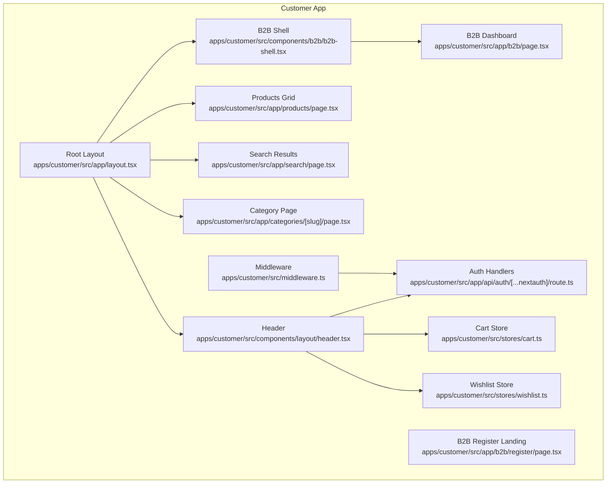
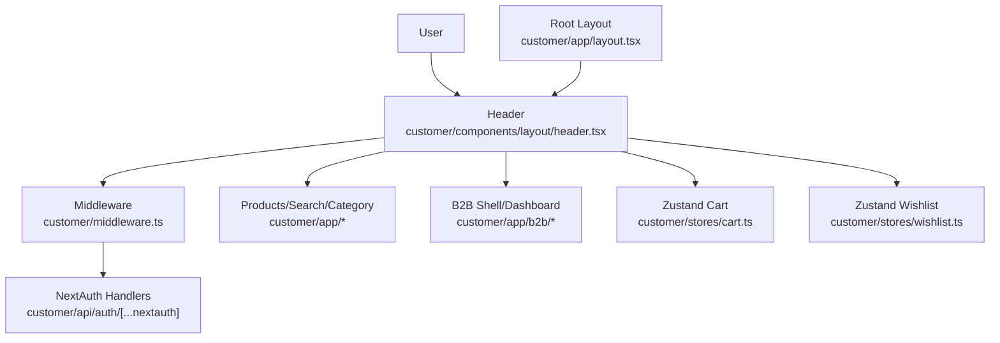
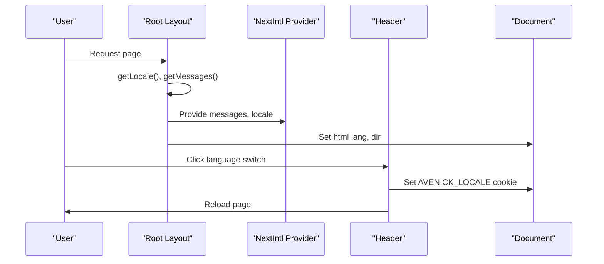
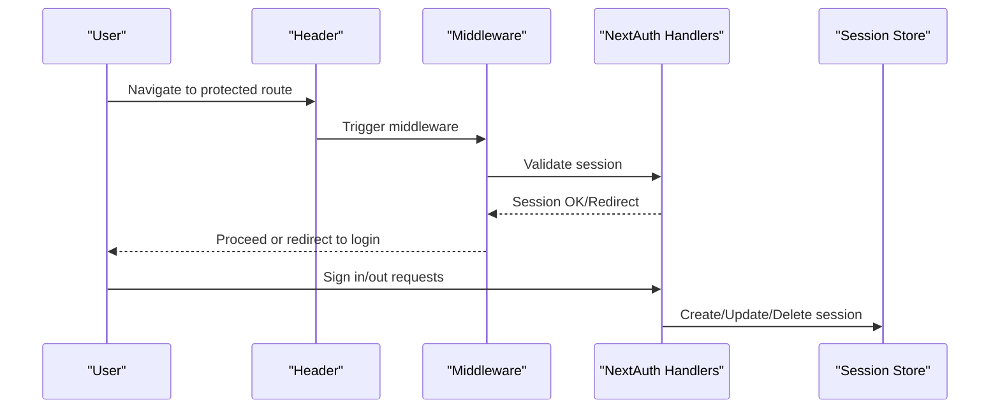
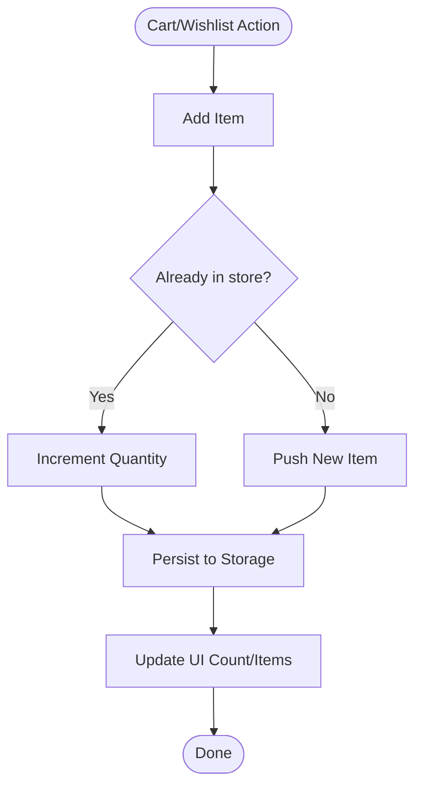
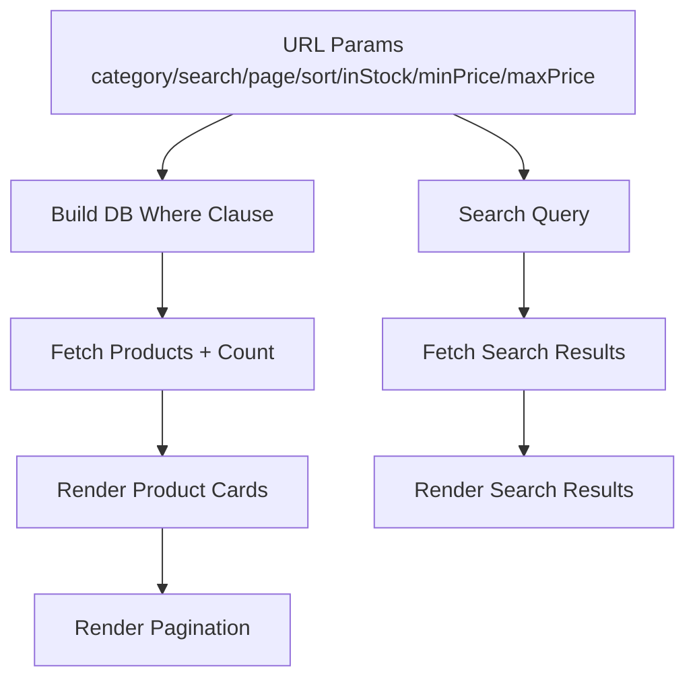
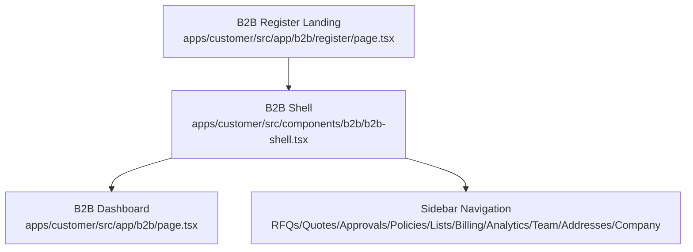
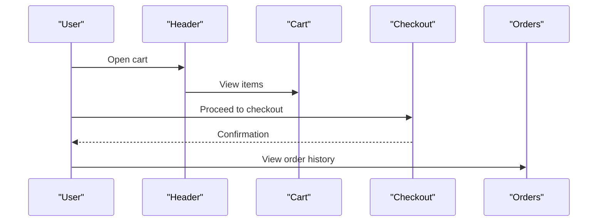
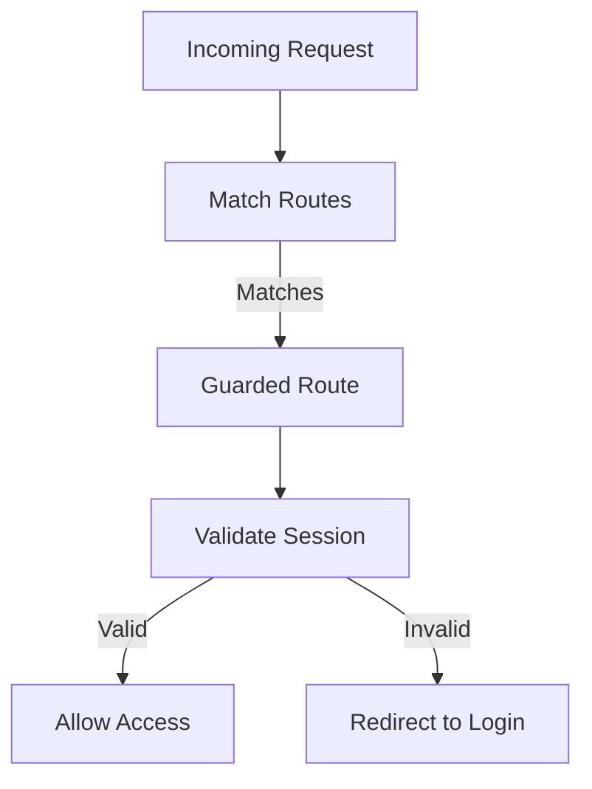
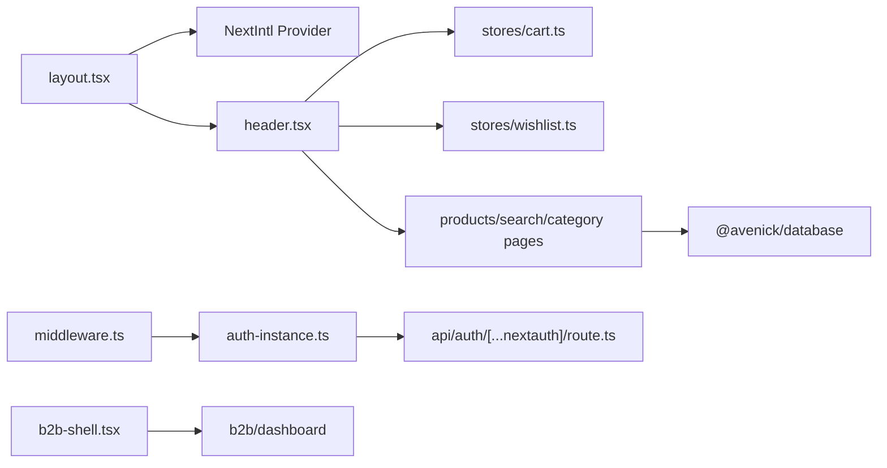

# Customer Portal (B2C/B2B)

<cite>
**Referenced Files in This Document**
- [layout.tsx](file://apps/customer/src/app/layout.tsx)
- [middleware.ts](file://apps/customer/src/middleware.ts)
- [auth-instance.ts](file://apps/customer/src/lib/auth-instance.ts)
- [cart.ts](file://apps/customer/src/stores/cart.ts)
- [wishlist.ts](file://apps/customer/src/stores/wishlist.ts)
- [b2b-shell.tsx](file://apps/customer/src/components/b2b/b2b-shell.tsx)
- [page.tsx](file://apps/customer/src/app/b2b/page.tsx)
- [page.tsx](file://apps/customer/src/app/products/page.tsx)
- [page.tsx](file://apps/customer/src/app/search/page.tsx)
- [page.tsx](file://apps/customer/src/app/categories/[slug]/page.tsx)
- [page.tsx](file://apps/customer/src/app/b2b/register/page.tsx)
- [route.ts](file://apps/customer/src/app/api/auth/[...nextauth]/route.ts)
- [header.tsx](file://apps/customer/src/components/layout/header.tsx)
</cite>

## Table of Contents
1. [Introduction](#introduction)
2. [Project Structure](#project-structure)
3. [Core Components](#core-components)
4. [Architecture Overview](#architecture-overview)
5. [Detailed Component Analysis](#detailed-component-analysis)
6. [Dependency Analysis](#dependency-analysis)
7. [Performance Considerations](#performance-considerations)
8. [Troubleshooting Guide](#troubleshooting-guide)
9. [Conclusion](#conclusion)
10. [Appendices](#appendices)

## Introduction
This document describes the Customer Portal’s dual commerce architecture supporting both B2C and B2B experiences. It covers product discovery, search and filtering, category management, B2B business features (registration, purchase orders, quoting, approvals, team management), multi-language localization (Arabic/English), shopping cart and checkout, wishlist, order history, state management, middleware-based role-based access control, authentication flows, session management, and cross-application navigation patterns.

## Project Structure
The Customer application is a Next.js app under apps/customer. Key areas:
- Internationalization and theme: Root layout initializes Next Intl provider and sets HTML directionality.
- Middleware: Enforces authentication and role gating for the customer portal.
- Authentication: Exposes NextAuth handlers via a route handler.
- Stores: Zustand-backed cart and wishlist with persistence.
- B2B shell and dashboard: Centralized layout and overview for business users.
- Product catalog: Product listing, search, and category pages with filters and sorting.
- UI and navigation: Shared header with locale switching, cart count, and account menu.

**Diagram sources**
- [layout.tsx:1-31](file://apps/customer/src/app/layout.tsx#L1-L31)
- [middleware.ts:1-9](file://apps/customer/src/middleware.ts#L1-L9)
- [route.ts:1-4](file://apps/customer/src/app/api/auth/[...nextauth]/route.ts#L1-L4)
- [header.tsx:1-141](file://apps/customer/src/components/layout/header.tsx#L1-L141)
- [cart.ts:1-64](file://apps/customer/src/stores/cart.ts#L1-L64)
- [wishlist.ts:1-45](file://apps/customer/src/stores/wishlist.ts#L1-L45)
- [b2b-shell.tsx:1-106](file://apps/customer/src/components/b2b/b2b-shell.tsx#L1-L106)
- [page.tsx:1-276](file://apps/customer/src/app/b2b/page.tsx#L1-L276)
- [page.tsx:1-256](file://apps/customer/src/app/products/page.tsx#L1-L256)
- [page.tsx:1-147](file://apps/customer/src/app/search/page.tsx#L1-L147)
- [page.tsx:1-50](file://apps/customer/src/app/categories/[slug]/page.tsx#L1-L50)
- [page.tsx:1-60](file://apps/customer/src/app/b2b/register/page.tsx#L1-L60)

**Section sources**
- [layout.tsx:1-31](file://apps/customer/src/app/layout.tsx#L1-L31)
- [middleware.ts:1-9](file://apps/customer/src/middleware.ts#L1-L9)
- [route.ts:1-4](file://apps/customer/src/app/api/auth/[...nextauth]/route.ts#L1-L4)
- [header.tsx:1-141](file://apps/customer/src/components/layout/header.tsx#L1-L141)
- [cart.ts:1-64](file://apps/customer/src/stores/cart.ts#L1-L64)
- [wishlist.ts:1-45](file://apps/customer/src/stores/wishlist.ts#L1-L45)
- [b2b-shell.tsx:1-106](file://apps/customer/src/components/b2b/b2b-shell.tsx#L1-L106)
- [page.tsx:1-276](file://apps/customer/src/app/b2b/page.tsx#L1-L276)
- [page.tsx:1-256](file://apps/customer/src/app/products/page.tsx#L1-L256)
- [page.tsx:1-147](file://apps/customer/src/app/search/page.tsx#L1-L147)
- [page.tsx:1-50](file://apps/customer/src/app/categories/[slug]/page.tsx#L1-L50)
- [page.tsx:1-60](file://apps/customer/src/app/b2b/register/page.tsx#L1-L60)

## Core Components
- Internationalization and theme: Root layout initializes Next Intl with server-side messages and determines HTML directionality based on locale.
- Middleware: Creates a customer-specific auth middleware and applies a catch-all matcher excluding static assets.
- Authentication: Exposes NextAuth handlers for the customer app using a shared auth factory.
- State management: Cart and wishlist stores use Zustand with persistence to localStorage.
- Navigation and UX: Header provides global navigation, search, theme toggle, locale switcher, cart badge, and account menu.
- B2B shell: Provides sidebar navigation and layout scaffolding for B2B features.
- Product discovery: Products page with filters, sorting, pagination; search page with popular queries and category browsing; category page for category-based browsing.

**Section sources**
- [layout.tsx:1-31](file://apps/customer/src/app/layout.tsx#L1-L31)
- [middleware.ts:1-9](file://apps/customer/src/middleware.ts#L1-L9)
- [auth-instance.ts:1-4](file://apps/customer/src/lib/auth-instance.ts#L1-L4)
- [route.ts:1-4](file://apps/customer/src/app/api/auth/[...nextauth]/route.ts#L1-L4)
- [cart.ts:1-64](file://apps/customer/src/stores/cart.ts#L1-L64)
- [wishlist.ts:1-45](file://apps/customer/src/stores/wishlist.ts#L1-L45)
- [header.tsx:1-141](file://apps/customer/src/components/layout/header.tsx#L1-L141)
- [b2b-shell.tsx:1-106](file://apps/customer/src/components/b2b/b2b-shell.tsx#L1-L106)
- [page.tsx:1-256](file://apps/customer/src/app/products/page.tsx#L1-L256)
- [page.tsx:1-147](file://apps/customer/src/app/search/page.tsx#L1-L147)
- [page.tsx:1-50](file://apps/customer/src/app/categories/[slug]/page.tsx#L1-L50)

## Architecture Overview
The Customer Portal integrates internationalization, authentication, state management, and domain-specific pages. The middleware ensures protected routes, while the layout injects localized messages and theme preferences. B2B features are organized under a dedicated shell with a sidebar and dashboard.

**Diagram sources**
- [middleware.ts:1-9](file://apps/customer/src/middleware.ts#L1-L9)
- [route.ts:1-4](file://apps/customer/src/app/api/auth/[...nextauth]/route.ts#L1-L4)
- [layout.tsx:1-31](file://apps/customer/src/app/layout.tsx#L1-L31)
- [header.tsx:1-141](file://apps/customer/src/components/layout/header.tsx#L1-L141)
- [cart.ts:1-64](file://apps/customer/src/stores/cart.ts#L1-L64)
- [wishlist.ts:1-45](file://apps/customer/src/stores/wishlist.ts#L1-L45)
- [page.tsx:1-256](file://apps/customer/src/app/products/page.tsx#L1-L256)
- [page.tsx:1-147](file://apps/customer/src/app/search/page.tsx#L1-L147)
- [page.tsx:1-50](file://apps/customer/src/app/categories/[slug]/page.tsx#L1-L50)
- [page.tsx:1-276](file://apps/customer/src/app/b2b/page.tsx#L1-L276)

## Detailed Component Analysis

### Internationalization and Localization
- Root layout fetches locale and messages server-side and passes them to Next Intl client provider.
- HTML directionality is set based on locale (RTL for Arabic, LTR otherwise).
- Locale cookie is set client-side for language switching; a reload updates the locale.

**Diagram sources**
- [layout.tsx:11-28](file://apps/customer/src/app/layout.tsx#L11-L28)
- [header.tsx:17-20](file://apps/customer/src/components/layout/header.tsx#L17-L20)

**Section sources**
- [layout.tsx:1-31](file://apps/customer/src/app/layout.tsx#L1-L31)
- [header.tsx:17-20](file://apps/customer/src/components/layout/header.tsx#L17-L20)

### Authentication and Session Management
- Authentication is handled by a shared auth factory configured for the customer app.
- NextAuth handlers are exposed via a route handler.
- Middleware enforces authentication and protects routes using a customer-specific guard.

**Diagram sources**
- [auth-instance.ts:1-4](file://apps/customer/src/lib/auth-instance.ts#L1-L4)
- [route.ts:1-4](file://apps/customer/src/app/api/auth/[...nextauth]/route.ts#L1-L4)
- [middleware.ts:1-9](file://apps/customer/src/middleware.ts#L1-L9)

**Section sources**
- [auth-instance.ts:1-4](file://apps/customer/src/lib/auth-instance.ts#L1-L4)
- [route.ts:1-4](file://apps/customer/src/app/api/auth/[...nextauth]/route.ts#L1-L4)
- [middleware.ts:1-9](file://apps/customer/src/middleware.ts#L1-L9)

### Shopping Cart and Wishlist State Management
- Cart store persists items and supports add/update/remove/clear, quantity calculation, and item counting.
- Wishlist store persists favorites and supports toggle, existence check, removal, and clear.
- Both stores use localStorage persistence for offline continuity.

**Diagram sources**
- [cart.ts:31-62](file://apps/customer/src/stores/cart.ts#L31-L62)
- [wishlist.ts:28-44](file://apps/customer/src/stores/wishlist.ts#L28-L44)

**Section sources**
- [cart.ts:1-64](file://apps/customer/src/stores/cart.ts#L1-L64)
- [wishlist.ts:1-45](file://apps/customer/src/stores/wishlist.ts#L1-L45)
- [header.tsx:32-38](file://apps/customer/src/components/layout/header.tsx#L32-L38)

### Product Discovery, Search, and Filtering
- Products page supports category filter, stock availability, price range, search across names and SKU, sorting, and pagination.
- Search page provides popular searches, category quick links, and result rendering.
- Category page renders products for a given category slug with metadata generation.

**Diagram sources**
- [page.tsx:36-139](file://apps/customer/src/app/products/page.tsx#L36-L139)
- [page.tsx:22-147](file://apps/customer/src/app/search/page.tsx#L22-L147)
- [page.tsx:14-49](file://apps/customer/src/app/categories/[slug]/page.tsx#L14-L49)

**Section sources**
- [page.tsx:1-256](file://apps/customer/src/app/products/page.tsx#L1-L256)
- [page.tsx:1-147](file://apps/customer/src/app/search/page.tsx#L1-L147)
- [page.tsx:1-50](file://apps/customer/src/app/categories/[slug]/page.tsx#L1-L50)

### B2B Experience: Registration, Dashboard, and Navigation
- B2B register landing highlights benefits and CTA to register a business account.
- B2B shell provides a responsive layout with a sidebar navigation spanning RFQs, quotes, approvals, policies, lists, billing, analytics, team, addresses, and company settings.
- B2B dashboard displays company info, credit usage, payment terms, active RFQs, pending approvals, reorder center, and quick actions.

**Diagram sources**
- [page.tsx:1-60](file://apps/customer/src/app/b2b/register/page.tsx#L1-L60)
- [b2b-shell.tsx:13-26](file://apps/customer/src/components/b2b/b2b-shell.tsx#L13-L26)
- [page.tsx:25-276](file://apps/customer/src/app/b2b/page.tsx#L25-L276)

**Section sources**
- [page.tsx:1-60](file://apps/customer/src/app/b2b/register/page.tsx#L1-L60)
- [b2b-shell.tsx:1-106](file://apps/customer/src/components/b2b/b2b-shell.tsx#L1-L106)
- [page.tsx:1-276](file://apps/customer/src/app/b2b/page.tsx#L1-L276)

### Checkout and Order History
- The portal exposes order history and individual order details pages under the account section.
- Checkout page exists for the customer app, enabling the end-to-end purchase flow.

**Diagram sources**
- [header.tsx:104-111](file://apps/customer/src/components/layout/header.tsx#L104-L111)
- [cart.ts:31-62](file://apps/customer/src/stores/cart.ts#L31-L62)
- [page.tsx:1-200](file://apps/customer/src/app/account/orders/page.tsx#L1-L200)

**Section sources**
- [header.tsx:104-111](file://apps/customer/src/components/layout/header.tsx#L104-L111)
- [cart.ts:1-64](file://apps/customer/src/stores/cart.ts#L1-L64)

### Role-Based Access Control and Middleware
- Middleware is customer-scoped and applies to all routes except static assets and images.
- Authentication guards protect routes; navigation to B2B features is gated by middleware.

**Diagram sources**
- [middleware.ts:6-8](file://apps/customer/src/middleware.ts#L6-L8)

**Section sources**
- [middleware.ts:1-9](file://apps/customer/src/middleware.ts#L1-L9)

## Dependency Analysis
- Internationalization: Root layout depends on Next Intl server helpers; header toggles locale via cookies.
- Authentication: Middleware depends on a shared auth factory; NextAuth handlers are exposed via a route.
- State: Header consumes cart and wishlist stores; stores depend on Zustand and persistence middleware.
- Navigation: Header composes global navigation and account menu; B2B shell composes sidebar navigation.
- Catalog: Products, search, and category pages depend on the database client and render product cards.

**Diagram sources**
- [layout.tsx:1-31](file://apps/customer/src/app/layout.tsx#L1-L31)
- [middleware.ts:1-9](file://apps/customer/src/middleware.ts#L1-L9)
- [auth-instance.ts:1-4](file://apps/customer/src/lib/auth-instance.ts#L1-L4)
- [route.ts:1-4](file://apps/customer/src/app/api/auth/[...nextauth]/route.ts#L1-L4)
- [header.tsx:1-141](file://apps/customer/src/components/layout/header.tsx#L1-L141)
- [cart.ts:1-64](file://apps/customer/src/stores/cart.ts#L1-L64)
- [wishlist.ts:1-45](file://apps/customer/src/stores/wishlist.ts#L1-L45)
- [page.tsx:1-256](file://apps/customer/src/app/products/page.tsx#L1-L256)
- [page.tsx:1-147](file://apps/customer/src/app/search/page.tsx#L1-L147)
- [page.tsx:1-50](file://apps/customer/src/app/categories/[slug]/page.tsx#L1-L50)
- [b2b-shell.tsx:1-106](file://apps/customer/src/components/b2b/b2b-shell.tsx#L1-L106)
- [page.tsx:1-276](file://apps/customer/src/app/b2b/page.tsx#L1-L276)

**Section sources**
- [layout.tsx:1-31](file://apps/customer/src/app/layout.tsx#L1-L31)
- [middleware.ts:1-9](file://apps/customer/src/middleware.ts#L1-L9)
- [auth-instance.ts:1-4](file://apps/customer/src/lib/auth-instance.ts#L1-L4)
- [route.ts:1-4](file://apps/customer/src/app/api/auth/[...nextauth]/route.ts#L1-L4)
- [header.tsx:1-141](file://apps/customer/src/components/layout/header.tsx#L1-L141)
- [cart.ts:1-64](file://apps/customer/src/stores/cart.ts#L1-L64)
- [wishlist.ts:1-45](file://apps/customer/src/stores/wishlist.ts#L1-L45)
- [page.tsx:1-256](file://apps/customer/src/app/products/page.tsx#L1-L256)
- [page.tsx:1-147](file://apps/customer/src/app/search/page.tsx#L1-L147)
- [page.tsx:1-50](file://apps/customer/src/app/categories/[slug]/page.tsx#L1-L50)
- [b2b-shell.tsx:1-106](file://apps/customer/src/components/b2b/b2b-shell.tsx#L1-L106)
- [page.tsx:1-276](file://apps/customer/src/app/b2b/page.tsx#L1-L276)

## Performance Considerations
- Client-server hydration: Cart count is initialized from persisted storage and reconciled after mount to prevent hydration mismatches.
- Suspense boundaries: Product grids and filters are wrapped in suspense to improve perceived performance during data fetching.
- Pagination: Server-side pagination reduces payload sizes and improves responsiveness.
- Filtering: Efficient where clauses and selective includes minimize database load.

[No sources needed since this section provides general guidance]

## Troubleshooting Guide
- Hydration mismatch on cart count: Ensure cart count is only applied after client mount to avoid SSR/client differences.
- Locale switching: Verify cookie setting and page reload behavior; confirm Next Intl messages are present.
- Middleware redirects: Confirm matcher excludes static assets and that protected routes redirect to login when unauthenticated.
- Authentication handlers: Ensure NextAuth handlers are reachable and session storage is accessible.

**Section sources**
- [header.tsx:34-38](file://apps/customer/src/components/layout/header.tsx#L34-L38)
- [layout.tsx:11-28](file://apps/customer/src/app/layout.tsx#L11-L28)
- [middleware.ts:6-8](file://apps/customer/src/middleware.ts#L6-L8)
- [route.ts:1-4](file://apps/customer/src/app/api/auth/[...nextauth]/route.ts#L1-L4)

## Conclusion
The Customer Portal implements a cohesive dual-commerce experience with robust internationalization, secure authentication, and scalable state management. B2C and B2B journeys are clearly separated yet integrated through shared layouts and stores. The architecture supports efficient product discovery, flexible filtering, and seamless navigation, while maintaining strong access controls and user-centric features like cart, wishlist, and order history.

## Appendices
- Cross-application navigation: The header provides links to B2B features and account sections, enabling smooth transitions between roles and contexts.
- Messages: Arabic and English message bundles exist under apps/customer/messages for localization.

[No sources needed since this section doesn't analyze specific files]