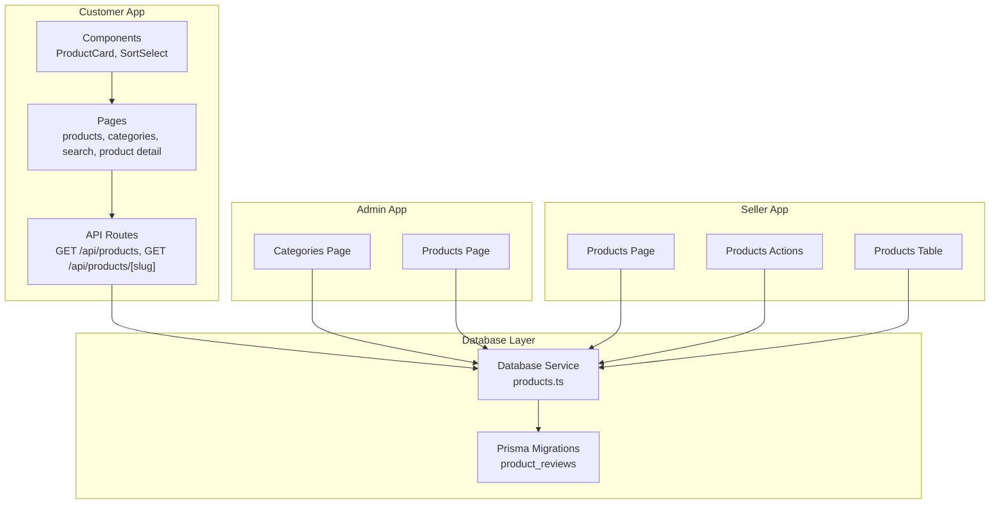
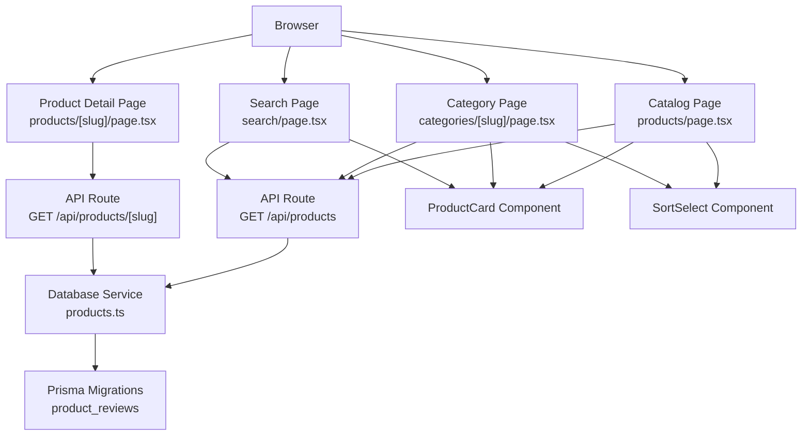
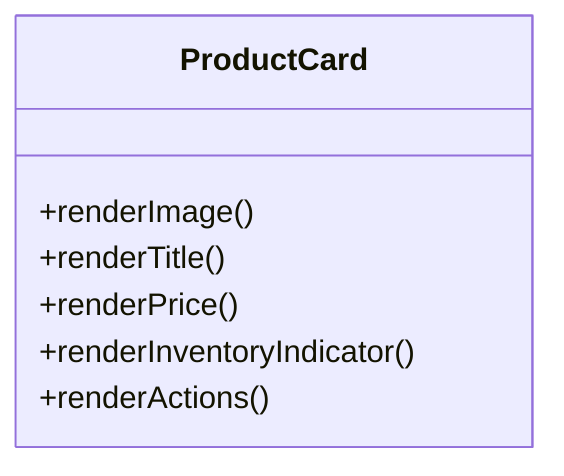
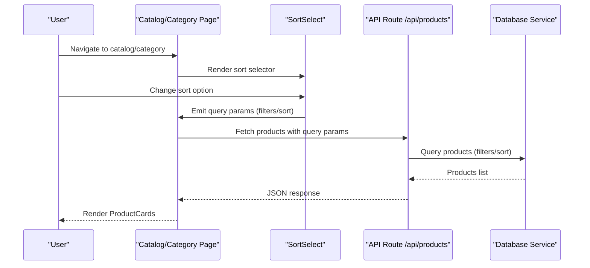
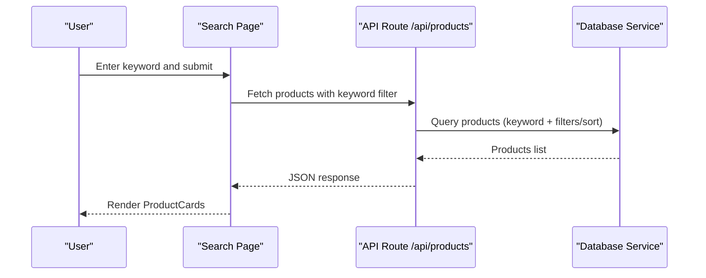
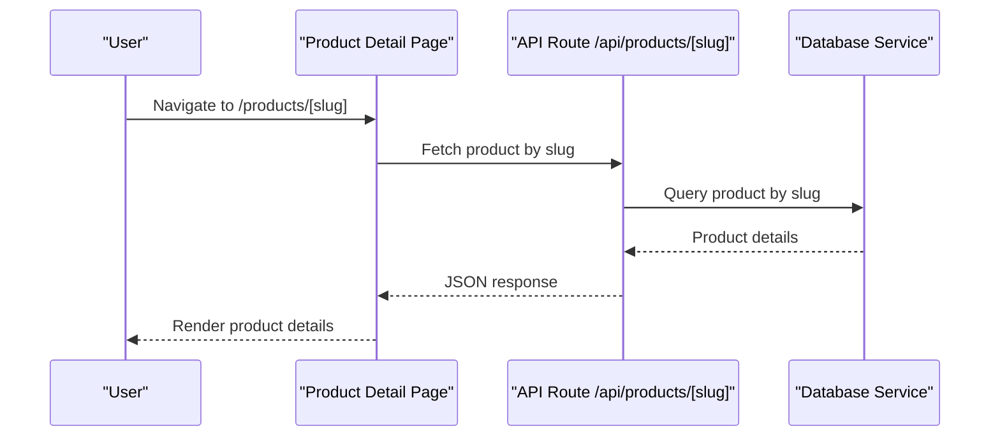
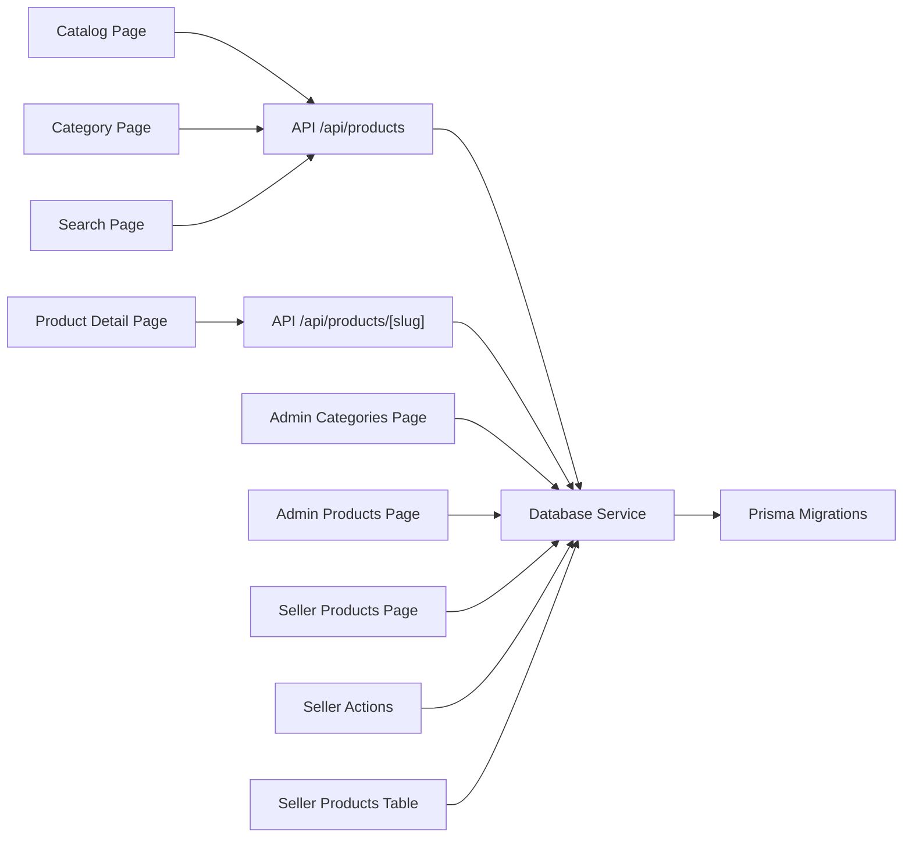

# Product Catalog Management

<cite>
**Referenced Files in This Document**
- [README.md](file://README.md)
- [MODULE_01_B2C_MARKETPLACE_NOTES.md](file://MODULE_01_B2C_MARKETPLACE_NOTES.md)
- [apps/customer/src/app/products/page.tsx](file://apps/customer/src/app/products/page.tsx)
- [apps/customer/src/app/products/[slug]/page.tsx](file://apps/customer/src/app/products/[slug]/page.tsx)
- [apps/customer/src/app/categories/[slug]/page.tsx](file://apps/customer/src/app/categories/[slug]/page.tsx)
- [apps/customer/src/app/search/page.tsx](file://apps/customer/src/app/search/page.tsx)
- [apps/customer/src/app/api/products/route.ts](file://apps/customer/src/app/api/products/route.ts)
- [apps/customer/src/app/api/products/[slug]/route.ts](file://apps/customer/src/app/api/products/[slug]/route.ts)
- [apps/customer/src/components/products/product-card.tsx](file://apps/customer/src/components/products/product-card.tsx)
- [apps/customer/src/components/products/sort-select.tsx](file://apps/customer/src/components/products/sort-select.tsx)
- [apps/admin/src/app/categories/page.tsx](file://apps/admin/src/app/categories/page.tsx)
- [apps/admin/src/app/products/page.tsx](file://apps/admin/src/app/products/page.tsx)
- [apps/seller/src/app/products/page.tsx](file://apps/seller/src/app/products/page.tsx)
- [apps/seller/src/app/products/actions.ts](file://apps/seller/src/app/products/actions.ts)
- [apps/seller/src/components/products-table.tsx](file://apps/seller/src/components/products-table.tsx)
- [packages/database/src/services/products.ts](file://packages/database/src/services/products.ts)
- [packages/database/prisma/migrations/20260601012214_add_product_reviews/migration.sql](file://packages/database/prisma/migrations/20260601012214_add_product_reviews/migration.sql)
</cite>

## Table of Contents
1. [Introduction](#introduction)
2. [Project Structure](#project-structure)
3. [Core Components](#core-components)
4. [Architecture Overview](#architecture-overview)
5. [Detailed Component Analysis](#detailed-component-analysis)
6. [Dependency Analysis](#dependency-analysis)
7. [Performance Considerations](#performance-considerations)
8. [Troubleshooting Guide](#troubleshooting-guide)
9. [Conclusion](#conclusion)
10. [Appendices](#appendices)

## Introduction
This document describes the Product Catalog Management system in the customer-facing application. It covers product browsing, category navigation, product detail pages, sorting and filtering, search, URL routing patterns, product display logic, image handling, pricing presentation, inventory indicators, pagination/infinite scroll strategies, performance optimizations, categorization and tagging, recommendations, database integration, and caching strategies. The goal is to provide a clear understanding of how the catalog is structured, how users discover and consume products, and how backend services supply product data.

## Project Structure
The customer application exposes routes for browsing products, viewing categories, searching, and accessing product details. UI components include a reusable product card and a sort selector. Backend API routes handle product queries and single-product retrieval. Database services encapsulate product data access. Administrative and seller applications complement catalog management and listing operations.

**Diagram sources**
- [apps/customer/src/app/products/page.tsx](file://apps/customer/src/app/products/page.tsx)
- [apps/customer/src/app/products/[slug]/page.tsx](file://apps/customer/src/app/products/[slug]/page.tsx)
- [apps/customer/src/app/categories/[slug]/page.tsx](file://apps/customer/src/app/categories/[slug]/page.tsx)
- [apps/customer/src/app/search/page.tsx](file://apps/customer/src/app/search/page.tsx)
- [apps/customer/src/app/api/products/route.ts](file://apps/customer/src/app/api/products/route.ts)
- [apps/customer/src/app/api/products/[slug]/route.ts](file://apps/customer/src/app/api/products/[slug]/route.ts)
- [apps/customer/src/components/products/product-card.tsx](file://apps/customer/src/components/products/product-card.tsx)
- [apps/customer/src/components/products/sort-select.tsx](file://apps/customer/src/components/products/sort-select.tsx)
- [apps/admin/src/app/categories/page.tsx](file://apps/admin/src/app/categories/page.tsx)
- [apps/admin/src/app/products/page.tsx](file://apps/admin/src/app/products/page.tsx)
- [apps/seller/src/app/products/page.tsx](file://apps/seller/src/app/products/page.tsx)
- [apps/seller/src/app/products/actions.ts](file://apps/seller/src/app/products/actions.ts)
- [apps/seller/src/components/products-table.tsx](file://apps/seller/src/components/products-table.tsx)
- [packages/database/src/services/products.ts](file://packages/database/src/services/products.ts)
- [packages/database/prisma/migrations/20260601012214_add_product_reviews/migration.sql](file://packages/database/prisma/migrations/20260601012214_add_product_reviews/migration.sql)

**Section sources**
- [apps/customer/src/app/products/page.tsx](file://apps/customer/src/app/products/page.tsx)
- [apps/customer/src/app/products/[slug]/page.tsx](file://apps/customer/src/app/products/[slug]/page.tsx)
- [apps/customer/src/app/categories/[slug]/page.tsx](file://apps/customer/src/app/categories/[slug]/page.tsx)
- [apps/customer/src/app/search/page.tsx](file://apps/customer/src/app/search/page.tsx)
- [apps/customer/src/app/api/products/route.ts](file://apps/customer/src/app/api/products/route.ts)
- [apps/customer/src/app/api/products/[slug]/route.ts](file://apps/customer/src/app/api/products/[slug]/route.ts)
- [apps/customer/src/components/products/product-card.tsx](file://apps/customer/src/components/products/product-card.tsx)
- [apps/customer/src/components/products/sort-select.tsx](file://apps/customer/src/components/products/sort-select.tsx)
- [apps/admin/src/app/categories/page.tsx](file://apps/admin/src/app/categories/page.tsx)
- [apps/admin/src/app/products/page.tsx](file://apps/admin/src/app/products/page.tsx)
- [apps/seller/src/app/products/page.tsx](file://apps/seller/src/app/products/page.tsx)
- [apps/seller/src/app/products/actions.ts](file://apps/seller/src/app/products/actions.ts)
- [apps/seller/src/components/products-table.tsx](file://apps/seller/src/components/products-table.tsx)
- [packages/database/src/services/products.ts](file://packages/database/src/services/products.ts)
- [packages/database/prisma/migrations/20260601012214_add_product_reviews/migration.sql](file://packages/database/prisma/migrations/20260601012214_add_product_reviews/migration.sql)

## Core Components
- Product browsing pages:
  - Catalog listing page for browsing products.
  - Category page for browsing products filtered by category slug.
  - Search page for keyword-based discovery.
  - Product detail page for a specific product identified by slug.
- API routes:
  - GET /api/products for listing/filtering/sorting products.
  - GET /api/products/[slug] for retrieving a single product by slug.
- UI components:
  - ProductCard: renders product preview with image, pricing, inventory indicator, and CTAs.
  - SortSelect: controls sorting options for product listings.
- Database service:
  - Centralized product retrieval logic abstracted behind a service interface.
- Administrative and seller apps:
  - Admin categories/products pages for catalog management.
  - Seller products page and actions/table for product lifecycle operations.

**Section sources**
- [apps/customer/src/app/products/page.tsx](file://apps/customer/src/app/products/page.tsx)
- [apps/customer/src/app/categories/[slug]/page.tsx](file://apps/customer/src/app/categories/[slug]/page.tsx)
- [apps/customer/src/app/search/page.tsx](file://apps/customer/src/app/search/page.tsx)
- [apps/customer/src/app/products/[slug]/page.tsx](file://apps/customer/src/app/products/[slug]/page.tsx)
- [apps/customer/src/app/api/products/route.ts](file://apps/customer/src/app/api/products/route.ts)
- [apps/customer/src/app/api/products/[slug]/route.ts](file://apps/customer/src/app/api/products/[slug]/route.ts)
- [apps/customer/src/components/products/product-card.tsx](file://apps/customer/src/components/products/product-card.tsx)
- [apps/customer/src/components/products/sort-select.tsx](file://apps/customer/src/components/products/sort-select.tsx)
- [packages/database/src/services/products.ts](file://packages/database/src/services/products.ts)
- [apps/admin/src/app/categories/page.tsx](file://apps/admin/src/app/categories/page.tsx)
- [apps/admin/src/app/products/page.tsx](file://apps/admin/src/app/products/page.tsx)
- [apps/seller/src/app/products/page.tsx](file://apps/seller/src/app/products/page.tsx)
- [apps/seller/src/app/products/actions.ts](file://apps/seller/src/app/products/actions.ts)
- [apps/seller/src/components/products-table.tsx](file://apps/seller/src/components/products-table.tsx)

## Architecture Overview
The customer app’s catalog architecture follows a layered pattern:
- Pages orchestrate data fetching and render UI.
- API routes implement server-side handlers for product queries and detail retrieval.
- UI components encapsulate presentation logic for product cards and sorting.
- Database service abstracts Prisma operations for product data.
- Admin and seller apps complement catalog management and product operations.

**Diagram sources**
- [apps/customer/src/app/products/page.tsx](file://apps/customer/src/app/products/page.tsx)
- [apps/customer/src/app/categories/[slug]/page.tsx](file://apps/customer/src/app/categories/[slug]/page.tsx)
- [apps/customer/src/app/search/page.tsx](file://apps/customer/src/app/search/page.tsx)
- [apps/customer/src/app/products/[slug]/page.tsx](file://apps/customer/src/app/products/[slug]/page.tsx)
- [apps/customer/src/app/api/products/route.ts](file://apps/customer/src/app/api/products/route.ts)
- [apps/customer/src/app/api/products/[slug]/route.ts](file://apps/customer/src/app/api/products/[slug]/route.ts)
- [apps/customer/src/components/products/product-card.tsx](file://apps/customer/src/components/products/product-card.tsx)
- [apps/customer/src/components/products/sort-select.tsx](file://apps/customer/src/components/products/sort-select.tsx)
- [packages/database/src/services/products.ts](file://packages/database/src/services/products.ts)
- [packages/database/prisma/migrations/20260601012214_add_product_reviews/migration.sql](file://packages/database/prisma/migrations/20260601012214_add_product_reviews/migration.sql)

## Detailed Component Analysis

### Product Card Component
The ProductCard component is responsible for rendering product previews across catalog, category, and search pages. It displays:
- Product image placeholder or asset.
- Pricing information and currency formatting.
- Inventory indicators (e.g., availability, low-stock signals).
- Call-to-action buttons (e.g., add to cart, quick view).

**Diagram sources**
- [apps/customer/src/components/products/product-card.tsx](file://apps/customer/src/components/products/product-card.tsx)

**Section sources**
- [apps/customer/src/components/products/product-card.tsx](file://apps/customer/src/components/products/product-card.tsx)

### Sorting and Filtering Mechanisms
Sorting and filtering are controlled via query parameters on the catalog and category pages. The SortSelect component provides user-driven sorting options. The API route consumes these parameters to apply filters and ordering on product queries.

**Diagram sources**
- [apps/customer/src/components/products/sort-select.tsx](file://apps/customer/src/components/products/sort-select.tsx)
- [apps/customer/src/app/products/page.tsx](file://apps/customer/src/app/products/page.tsx)
- [apps/customer/src/app/categories/[slug]/page.tsx](file://apps/customer/src/app/categories/[slug]/page.tsx)
- [apps/customer/src/app/api/products/route.ts](file://apps/customer/src/app/api/products/route.ts)
- [packages/database/src/services/products.ts](file://packages/database/src/services/products.ts)

**Section sources**
- [apps/customer/src/components/products/sort-select.tsx](file://apps/customer/src/components/products/sort-select.tsx)
- [apps/customer/src/app/products/page.tsx](file://apps/customer/src/app/products/page.tsx)
- [apps/customer/src/app/categories/[slug]/page.tsx](file://apps/customer/src/app/categories/[slug]/page.tsx)
- [apps/customer/src/app/api/products/route.ts](file://apps/customer/src/app/api/products/route.ts)
- [packages/database/src/services/products.ts](file://packages/database/src/services/products.ts)

### Search Functionality
The search page accepts a keyword query parameter and renders matching products using the same ProductCard component. The API route applies keyword filtering alongside existing filters and sorting.

**Diagram sources**
- [apps/customer/src/app/search/page.tsx](file://apps/customer/src/app/search/page.tsx)
- [apps/customer/src/app/api/products/route.ts](file://apps/customer/src/app/api/products/route.ts)
- [packages/database/src/services/products.ts](file://packages/database/src/services/products.ts)

**Section sources**
- [apps/customer/src/app/search/page.tsx](file://apps/customer/src/app/search/page.tsx)
- [apps/customer/src/app/api/products/route.ts](file://apps/customer/src/app/api/products/route.ts)
- [packages/database/src/services/products.ts](file://packages/database/src/services/products.ts)

### Product Detail Pages
The product detail page uses a dynamic slug route to fetch and render a single product. The API route resolves the product by slug and returns structured product data consumed by the page.

**Diagram sources**
- [apps/customer/src/app/products/[slug]/page.tsx](file://apps/customer/src/app/products/[slug]/page.tsx)
- [apps/customer/src/app/api/products/[slug]/route.ts](file://apps/customer/src/app/api/products/[slug]/route.ts)
- [packages/database/src/services/products.ts](file://packages/database/src/services/products.ts)

**Section sources**
- [apps/customer/src/app/products/[slug]/page.tsx](file://apps/customer/src/app/products/[slug]/page.tsx)
- [apps/customer/src/app/api/products/[slug]/route.ts](file://apps/customer/src/app/api/products/[slug]/route.ts)
- [packages/database/src/services/products.ts](file://packages/database/src/services/products.ts)

### URL Routing Patterns
- Catalog listing: GET /products
- Category browsing: GET /categories/[slug]
- Search: GET /search?keyword=...
- Product detail: GET /products/[slug]

These routes integrate with API handlers that accept query parameters for filters, sorting, pagination, and keyword search.

**Section sources**
- [apps/customer/src/app/products/page.tsx](file://apps/customer/src/app/products/page.tsx)
- [apps/customer/src/app/categories/[slug]/page.tsx](file://apps/customer/src/app/categories/[slug]/page.tsx)
- [apps/customer/src/app/search/page.tsx](file://apps/customer/src/app/search/page.tsx)
- [apps/customer/src/app/products/[slug]/page.tsx](file://apps/customer/src/app/products/[slug]/page.tsx)
- [apps/customer/src/app/api/products/route.ts](file://apps/customer/src/app/api/products/route.ts)
- [apps/customer/src/app/api/products/[slug]/route.ts](file://apps/customer/src/app/api/products/[slug]/route.ts)

### Product Display Logic, Image Handling, Pricing, Inventory
- Product display logic is centralized in ProductCard, which receives product props and renders standardized previews.
- Image handling is managed within ProductCard; typical patterns include fallback placeholders and responsive image attributes.
- Pricing presentation includes currency formatting and optional original vs. discounted price display.
- Inventory indicators reflect stock status (e.g., in stock, low stock, out of stock) to inform purchasing decisions.

**Section sources**
- [apps/customer/src/components/products/product-card.tsx](file://apps/customer/src/components/products/product-card.tsx)

### Pagination and Infinite Scroll Strategies
- Pagination: The API route supports pagination via query parameters (e.g., page and limit). The catalog and category pages pass these parameters to the API handler.
- Infinite scroll: The catalog and category pages can implement intersection observers to load more items as the user scrolls, appending results to the current list.

Note: The specific implementation details for pagination and infinite scroll are not present in the referenced files; the above describes the expected integration points.

**Section sources**
- [apps/customer/src/app/products/page.tsx](file://apps/customer/src/app/products/page.tsx)
- [apps/customer/src/app/categories/[slug]/page.tsx](file://apps/customer/src/app/categories/[slug]/page.tsx)
- [apps/customer/src/app/api/products/route.ts](file://apps/customer/src/app/api/products/route.ts)

### Product Categorization and Tagging Systems
- Categories are managed in the admin application and rendered in the customer app for hierarchical browsing.
- Tagging: The product_reviews migration indicates review tagging capabilities; tagging for products is not explicitly shown in the referenced files.

**Section sources**
- [apps/admin/src/app/categories/page.tsx](file://apps/admin/src/app/categories/page.tsx)
- [apps/customer/src/app/categories/[slug]/page.tsx](file://apps/customer/src/app/categories/[slug]/page.tsx)
- [packages/database/prisma/migrations/20260601012214_add_product_reviews/migration.sql](file://packages/database/prisma/migrations/20260601012214_add_product_reviews/migration.sql)

### Recommendation Algorithms
Recommendation logic is not implemented in the referenced files. The catalog currently relies on browsing, search, and category navigation.

**Section sources**
- [apps/customer/src/app/products/page.tsx](file://apps/customer/src/app/products/page.tsx)
- [apps/customer/src/app/search/page.tsx](file://apps/customer/src/app/search/page.tsx)

### Database Services and Caching Strategies
- Database service: Product retrieval logic is encapsulated in a service module, enabling centralized query logic and potential caching layers.
- Caching: No explicit caching implementation is visible in the referenced files. Recommendations include Redis or in-memory caching for frequently accessed product lists and details.

**Section sources**
- [packages/database/src/services/products.ts](file://packages/database/src/services/products.ts)

## Dependency Analysis
The customer app depends on API routes and UI components to render the catalog. The API routes depend on the database service, which interacts with Prisma migrations. Admin and seller apps complement catalog management and product operations.

**Diagram sources**
- [apps/customer/src/app/products/page.tsx](file://apps/customer/src/app/products/page.tsx)
- [apps/customer/src/app/categories/[slug]/page.tsx](file://apps/customer/src/app/categories/[slug]/page.tsx)
- [apps/customer/src/app/search/page.tsx](file://apps/customer/src/app/search/page.tsx)
- [apps/customer/src/app/products/[slug]/page.tsx](file://apps/customer/src/app/products/[slug]/page.tsx)
- [apps/customer/src/app/api/products/route.ts](file://apps/customer/src/app/api/products/route.ts)
- [apps/customer/src/app/api/products/[slug]/route.ts](file://apps/customer/src/app/api/products/[slug]/route.ts)
- [packages/database/src/services/products.ts](file://packages/database/src/services/products.ts)
- [packages/database/prisma/migrations/20260601012214_add_product_reviews/migration.sql](file://packages/database/prisma/migrations/20260601012214_add_product_reviews/migration.sql)
- [apps/admin/src/app/categories/page.tsx](file://apps/admin/src/app/categories/page.tsx)
- [apps/admin/src/app/products/page.tsx](file://apps/admin/src/app/products/page.tsx)
- [apps/seller/src/app/products/page.tsx](file://apps/seller/src/app/products/page.tsx)
- [apps/seller/src/app/products/actions.ts](file://apps/seller/src/app/products/actions.ts)
- [apps/seller/src/components/products-table.tsx](file://apps/seller/src/components/products-table.tsx)

**Section sources**
- [apps/customer/src/app/products/page.tsx](file://apps/customer/src/app/products/page.tsx)
- [apps/customer/src/app/categories/[slug]/page.tsx](file://apps/customer/src/app/categories/[slug]/page.tsx)
- [apps/customer/src/app/search/page.tsx](file://apps/customer/src/app/search/page.tsx)
- [apps/customer/src/app/products/[slug]/page.tsx](file://apps/customer/src/app/products/[slug]/page.tsx)
- [apps/customer/src/app/api/products/route.ts](file://apps/customer/src/app/api/products/route.ts)
- [apps/customer/src/app/api/products/[slug]/route.ts](file://apps/customer/src/app/api/products/[slug]/route.ts)
- [packages/database/src/services/products.ts](file://packages/database/src/services/products.ts)
- [packages/database/prisma/migrations/20260601012214_add_product_reviews/migration.sql](file://packages/database/prisma/migrations/20260601012214_add_product_reviews/migration.sql)
- [apps/admin/src/app/categories/page.tsx](file://apps/admin/src/app/categories/page.tsx)
- [apps/admin/src/app/products/page.tsx](file://apps/admin/src/app/products/page.tsx)
- [apps/seller/src/app/products/page.tsx](file://apps/seller/src/app/products/page.tsx)
- [apps/seller/src/app/products/actions.ts](file://apps/seller/src/app/products/actions.ts)
- [apps/seller/src/components/products-table.tsx](file://apps/seller/src/components/products-table.tsx)

## Performance Considerations
- API pagination: Use page and limit parameters to avoid large payloads.
- Lazy loading: Implement infinite scroll to progressively load items.
- Image optimization: Ensure responsive images and lazy loading in ProductCard.
- Caching: Introduce caching for product lists and details to reduce database load.
- Sorting and filtering: Apply server-side filtering to minimize client-side computation.
- Database indexing: Ensure indexes on commonly filtered/sorted fields (e.g., category, brand, name, price).

[No sources needed since this section provides general guidance]

## Troubleshooting Guide
- Empty results:
  - Verify query parameters for filters and sorting.
  - Confirm category slug correctness and existence.
- Product not found:
  - Validate slug uniqueness and existence in the database.
- Sorting issues:
  - Ensure SortSelect emits supported sort keys.
- Performance problems:
  - Add pagination and caching.
  - Optimize database queries and indexes.

**Section sources**
- [apps/customer/src/app/api/products/route.ts](file://apps/customer/src/app/api/products/route.ts)
- [apps/customer/src/app/api/products/[slug]/route.ts](file://apps/customer/src/app/api/products/[slug]/route.ts)
- [packages/database/src/services/products.ts](file://packages/database/src/services/products.ts)

## Conclusion
The Product Catalog Management system integrates pages, API routes, UI components, and database services to deliver a robust product browsing experience. Sorting, filtering, search, and category navigation are supported through query parameters and dedicated components. While recommendation and advanced caching are not yet implemented, the architecture provides clear extension points for future enhancements.

[No sources needed since this section summarizes without analyzing specific files]

## Appendices

### Appendix A: Product Reviews Migration
The product_reviews migration defines a schema for product reviews, which can be leveraged for ratings and tagging in future recommendation systems.

**Section sources**
- [packages/database/prisma/migrations/20260601012214_add_product_reviews/migration.sql](file://packages/database/prisma/migrations/20260601012214_add_product_reviews/migration.sql)

### Appendix B: B2C Marketplace Notes
Additional schema notes for product-related entities (e.g., wishlists, promo codes) are documented in the B2C marketplace notes.

**Section sources**
- [MODULE_01_B2C_MARKETPLACE_NOTES.md](file://MODULE_01_B2C_MARKETPLACE_NOTES.md)