# Shopping Experience

<cite>
**Referenced Files in This Document**
- [cart.ts](file://apps/customer/src/stores/cart.ts)
- [wishlist.ts](file://apps/customer/src/stores/wishlist.ts)
- [page.tsx](file://apps/customer/src/app/cart/page.tsx)
- [page.tsx](file://apps/customer/src/app/checkout/page.tsx)
- [page.tsx](file://apps/customer/src/app/wishlist/page.tsx)
- [route.ts](file://apps/customer/src/app/api/payments/webhook/route.ts)
- [validated-form.tsx](file://apps/customer/src/components/b2b/validated-form.tsx)
- [actions.ts](file://apps/customer/src/app/b2b/addresses/actions.ts)
- [actions.ts](file://apps/customer/src/app/b2b/lists/actions.ts)
- [actions.ts](file://apps/customer/src/app/b2b/purchase-orders/actions.ts)
- [actions.ts](file://apps/customer/src/app/orders/actions.ts)
- [orders.tsx](file://apps/seller/src/app/orders/page.tsx)
- [orders-table.tsx](file://apps/seller/src/components/orders-table.tsx)
- [auth-instance.ts](file://apps/customer/src/lib/auth-instance.ts)
- [auth.ts](file://apps/admin/src/lib/auth.ts)
- [auth-instance.ts](file://apps/seller/src/lib/auth-instance.ts)
- [layout.tsx](file://apps/customer/src/app/layout.tsx)
- [layout.tsx](file://apps/admin/src/app/layout.tsx)
- [layout.tsx](file://apps/seller/src/app/layout.tsx)
</cite>

## Table of Contents
1. [Introduction](#introduction)
2. [Project Structure](#project-structure)
3. [Core Components](#core-components)
4. [Architecture Overview](#architecture-overview)
5. [Detailed Component Analysis](#detailed-component-analysis)
6. [Dependency Analysis](#dependency-analysis)
7. [Performance Considerations](#performance-considerations)
8. [Troubleshooting Guide](#troubleshooting-guide)
9. [Conclusion](#conclusion)

## Introduction
This document describes the Shopping Experience subsystem of the Avenick Commerce platform. It focuses on the customer-facing shopping journey: cart management, checkout, payment processing, order confirmation, and wishlist operations. It also covers state management via local stores, user session handling, guest checkout options, and integration touchpoints for payments, shipping, taxes, and order placement. The content is derived from the customer application’s stores, pages, and supporting utilities.

## Project Structure
The Shopping Experience spans the customer application and integrates with shared libraries and backend APIs:
- Local state stores for cart and wishlist
- Pages for cart, checkout, and wishlist
- Payment webhook endpoint
- B2B utilities for validated forms and address management
- Order management for both customer and seller applications
- Authentication instances for session handling

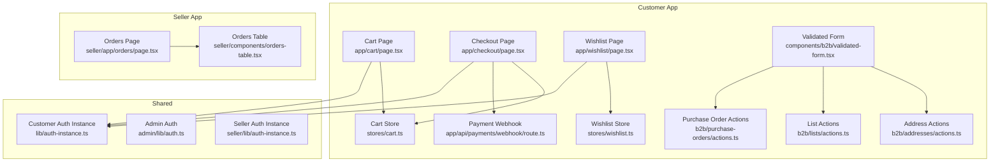

**Diagram sources**
- [cart.ts](file://apps/customer/src/stores/cart.ts)
- [wishlist.ts](file://apps/customer/src/stores/wishlist.ts)
- [page.tsx](file://apps/customer/src/app/cart/page.tsx)
- [page.tsx](file://apps/customer/src/app/checkout/page.tsx)
- [page.tsx](file://apps/customer/src/app/wishlist/page.tsx)
- [route.ts](file://apps/customer/src/app/api/payments/webhook/route.ts)
- [validated-form.tsx](file://apps/customer/src/components/b2b/validated-form.tsx)
- [actions.ts](file://apps/customer/src/app/b2b/addresses/actions.ts)
- [actions.ts](file://apps/customer/src/app/b2b/lists/actions.ts)
- [actions.ts](file://apps/customer/src/app/b2b/purchase-orders/actions.ts)
- [auth-instance.ts](file://apps/customer/src/lib/auth-instance.ts)
- [auth.ts](file://apps/admin/src/lib/auth.ts)
- [auth-instance.ts](file://apps/seller/src/lib/auth-instance.ts)
- [orders.tsx](file://apps/seller/src/app/orders/page.tsx)
- [orders-table.tsx](file://apps/seller/src/components/orders-table.tsx)

**Section sources**
- [cart.ts](file://apps/customer/src/stores/cart.ts)
- [wishlist.ts](file://apps/customer/src/stores/wishlist.ts)
- [page.tsx](file://apps/customer/src/app/cart/page.tsx)
- [page.tsx](file://apps/customer/src/app/checkout/page.tsx)
- [page.tsx](file://apps/customer/src/app/wishlist/page.tsx)
- [route.ts](file://apps/customer/src/app/api/payments/webhook/route.ts)
- [validated-form.tsx](file://apps/customer/src/components/b2b/validated-form.tsx)
- [actions.ts](file://apps/customer/src/app/b2b/addresses/actions.ts)
- [actions.ts](file://apps/customer/src/app/b2b/lists/actions.ts)
- [actions.ts](file://apps/customer/src/app/b2b/purchase-orders/actions.ts)
- [auth-instance.ts](file://apps/customer/src/lib/auth-instance.ts)
- [auth.ts](file://apps/admin/src/lib/auth.ts)
- [auth-instance.ts](file://apps/seller/src/lib/auth-instance.ts)
- [orders.tsx](file://apps/seller/src/app/orders/page.tsx)
- [orders-table.tsx](file://apps/seller/src/components/orders-table.tsx)

## Core Components
- Cart Store: Manages items, quantities, totals, and persistence in local storage. Provides add, update quantity, remove, and clear operations.
- Wishlist Store: Manages saved items, supports share and remove actions.
- Cart Page: Renders cart contents, allows quantity updates and removals, and initiates checkout.
- Checkout Page: Collects shipping/billing details, validates inputs, triggers payment processing, and handles order confirmation.
- Payment Webhook: Receives asynchronous payment outcomes to reconcile order state.
- B2B Utilities: Validated forms and actions for addresses, lists, and purchase orders.
- Order Management: Customer and seller views for order lifecycle tracking.

**Section sources**
- [cart.ts](file://apps/customer/src/stores/cart.ts)
- [wishlist.ts](file://apps/customer/src/stores/wishlist.ts)
- [page.tsx](file://apps/customer/src/app/cart/page.tsx)
- [page.tsx](file://apps/customer/src/app/checkout/page.tsx)
- [page.tsx](file://apps/customer/src/app/wishlist/page.tsx)
- [route.ts](file://apps/customer/src/app/api/payments/webhook/route.ts)
- [validated-form.tsx](file://apps/customer/src/components/b2b/validated-form.tsx)
- [actions.ts](file://apps/customer/src/app/b2b/addresses/actions.ts)
- [actions.ts](file://apps/customer/src/app/b2b/lists/actions.ts)
- [actions.ts](file://apps/customer/src/app/b2b/purchase-orders/actions.ts)

## Architecture Overview
The Shopping Experience follows a layered pattern:
- UI Pages orchestrate user interactions for cart, checkout, and wishlist.
- Local Stores encapsulate state and persistence.
- Backend APIs handle payment webhooks, order creation, and B2B operations.
- Authentication instances manage sessions across roles.

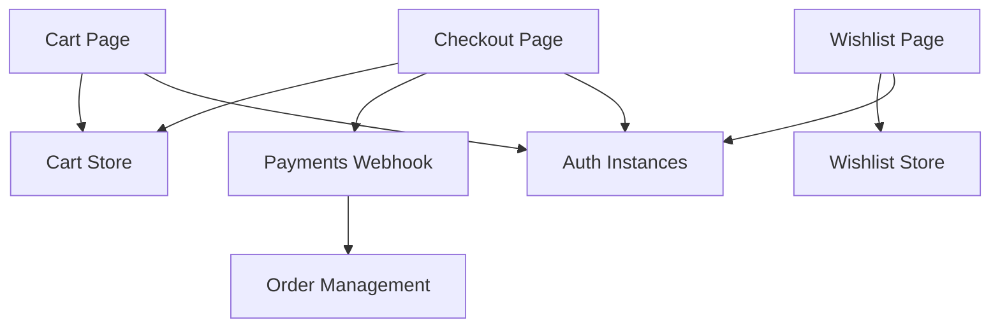

**Diagram sources**
- [page.tsx](file://apps/customer/src/app/cart/page.tsx)
- [page.tsx](file://apps/customer/src/app/checkout/page.tsx)
- [page.tsx](file://apps/customer/src/app/wishlist/page.tsx)
- [cart.ts](file://apps/customer/src/stores/cart.ts)
- [wishlist.ts](file://apps/customer/src/stores/wishlist.ts)
- [route.ts](file://apps/customer/src/app/api/payments/webhook/route.ts)
- [auth-instance.ts](file://apps/customer/src/lib/auth-instance.ts)
- [orders.tsx](file://apps/seller/src/app/orders/page.tsx)

## Detailed Component Analysis

### Cart Store and Persistence
The cart store maintains items and quantities, computes totals, and persists state locally. It exposes operations to add items, update quantities, remove items, and clear the cart. Persistence ensures continuity across browser sessions.

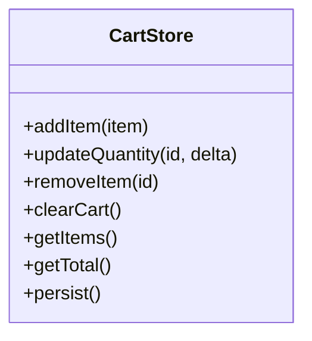

**Diagram sources**
- [cart.ts](file://apps/customer/src/stores/cart.ts)

**Section sources**
- [cart.ts](file://apps/customer/src/stores/cart.ts)

### Wishlist Store and Sharing
The wishlist store manages saved items and supports sharing and removal. It complements the cart by enabling long-term item preservation and collaboration.

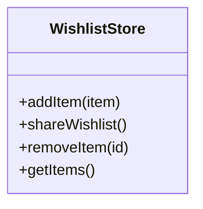

**Diagram sources**
- [wishlist.ts](file://apps/customer/src/stores/wishlist.ts)

**Section sources**
- [wishlist.ts](file://apps/customer/src/stores/wishlist.ts)

### Cart Page Workflow
The cart page renders items from the cart store, allows quantity adjustments, and removals. It links to checkout when ready.

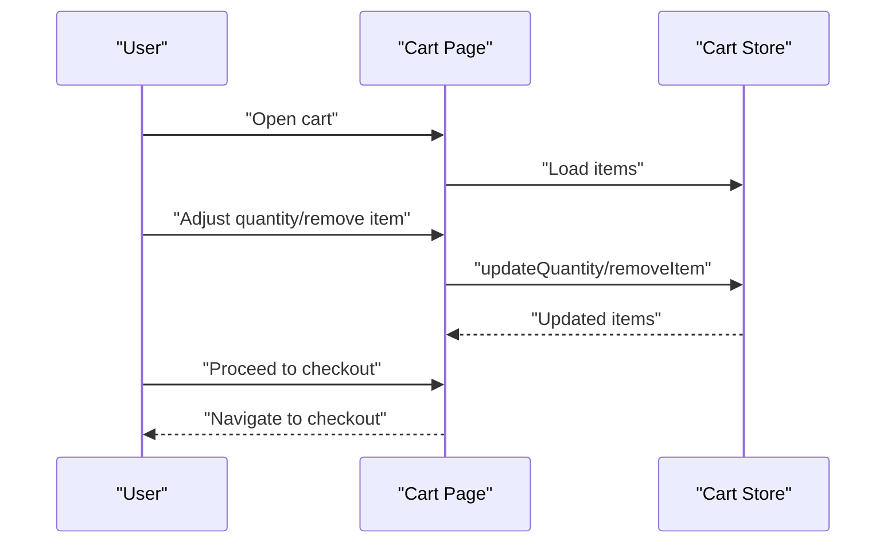

**Diagram sources**
- [page.tsx](file://apps/customer/src/app/cart/page.tsx)
- [cart.ts](file://apps/customer/src/stores/cart.ts)

**Section sources**
- [page.tsx](file://apps/customer/src/app/cart/page.tsx)
- [cart.ts](file://apps/customer/src/stores/cart.ts)

### Checkout Process Flow
The checkout page collects shipping and billing information, validates inputs, triggers payment processing, and confirms order completion. It relies on the cart store for totals and items.

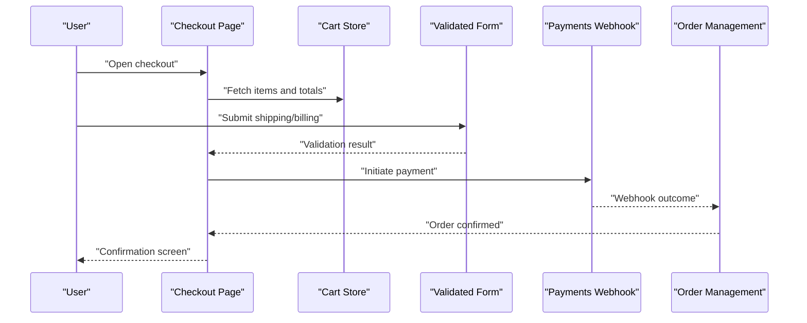

**Diagram sources**
- [page.tsx](file://apps/customer/src/app/checkout/page.tsx)
- [cart.ts](file://apps/customer/src/stores/cart.ts)
- [validated-form.tsx](file://apps/customer/src/components/b2b/validated-form.tsx)
- [route.ts](file://apps/customer/src/app/api/payments/webhook/route.ts)
- [orders.tsx](file://apps/seller/src/app/orders/page.tsx)

**Section sources**
- [page.tsx](file://apps/customer/src/app/checkout/page.tsx)
- [validated-form.tsx](file://apps/customer/src/components/b2b/validated-form.tsx)
- [route.ts](file://apps/customer/src/app/api/payments/webhook/route.ts)
- [orders.tsx](file://apps/seller/src/app/orders/page.tsx)

### Payment Webhook Integration
The payment webhook endpoint receives asynchronous payment outcomes. It reconciles order state based on the event payload and updates order management accordingly.

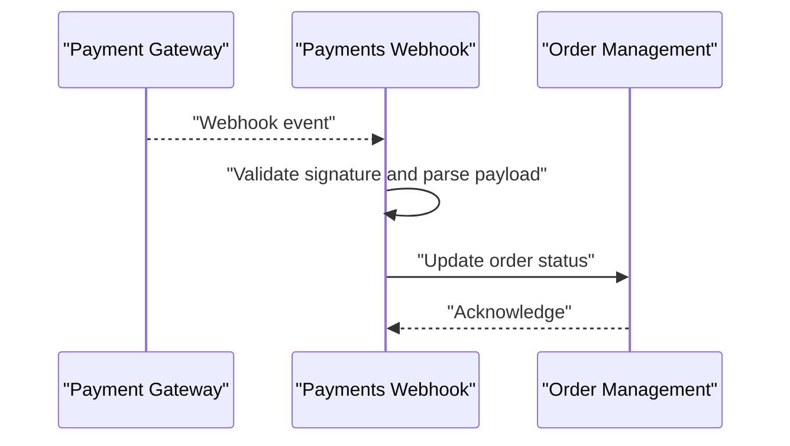

**Diagram sources**
- [route.ts](file://apps/customer/src/app/api/payments/webhook/route.ts)
- [orders.tsx](file://apps/seller/src/app/orders/page.tsx)

**Section sources**
- [route.ts](file://apps/customer/src/app/api/payments/webhook/route.ts)
- [orders.tsx](file://apps/seller/src/app/orders/page.tsx)

### Wishlist Page Workflow
The wishlist page displays saved items, supports sharing, and allows removal. It integrates with the wishlist store for state management.

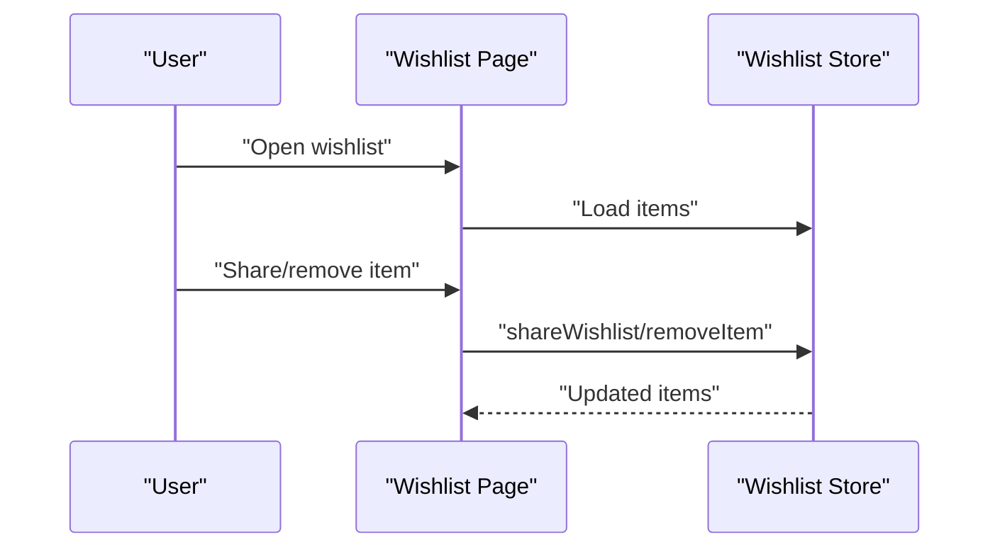

**Diagram sources**
- [page.tsx](file://apps/customer/src/app/wishlist/page.tsx)
- [wishlist.ts](file://apps/customer/src/stores/wishlist.ts)

**Section sources**
- [page.tsx](file://apps/customer/src/app/wishlist/page.tsx)
- [wishlist.ts](file://apps/customer/src/stores/wishlist.ts)

### B2B Validation and Actions
B2B flows rely on validated forms and actions for addresses, lists, and purchase orders. These utilities ensure data integrity and streamline business workflows.

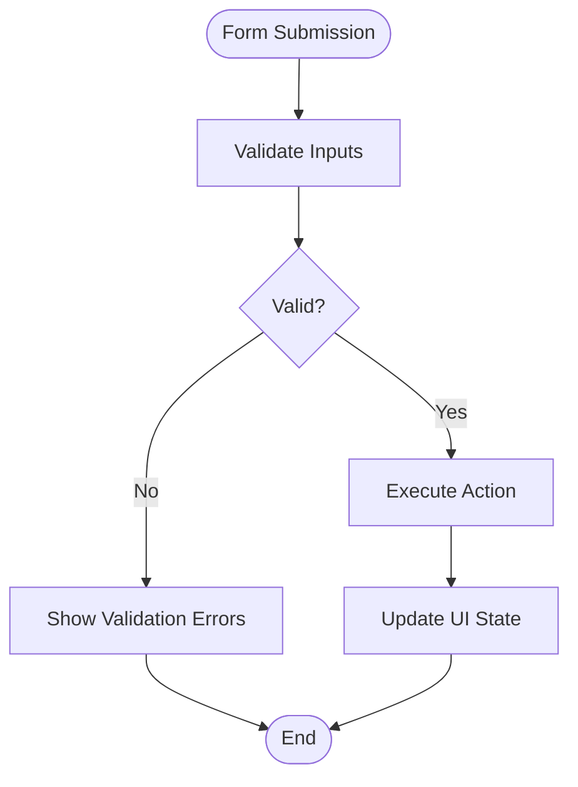

**Diagram sources**
- [validated-form.tsx](file://apps/customer/src/components/b2b/validated-form.tsx)
- [actions.ts](file://apps/customer/src/app/b2b/addresses/actions.ts)
- [actions.ts](file://apps/customer/src/app/b2b/lists/actions.ts)
- [actions.ts](file://apps/customer/src/app/b2b/purchase-orders/actions.ts)

**Section sources**
- [validated-form.tsx](file://apps/customer/src/components/b2b/validated-form.tsx)
- [actions.ts](file://apps/customer/src/app/b2b/addresses/actions.ts)
- [actions.ts](file://apps/customer/src/app/b2b/lists/actions.ts)
- [actions.ts](file://apps/customer/src/app/b2b/purchase-orders/actions.ts)

### Order Management (Seller)
The seller application provides order management capabilities, including viewing orders and rendering order tables for fulfillment.

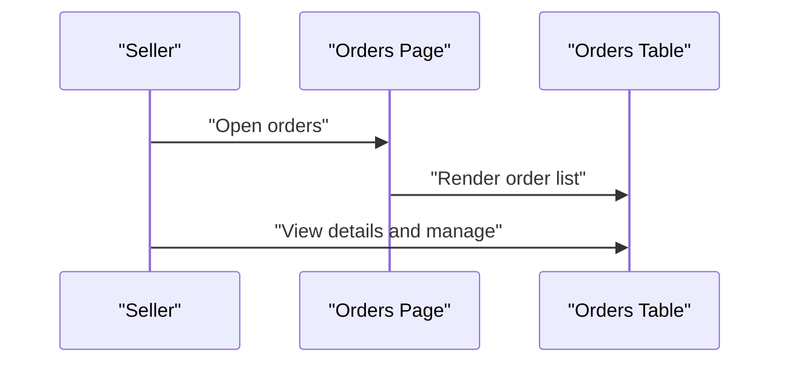

**Diagram sources**
- [orders.tsx](file://apps/seller/src/app/orders/page.tsx)
- [orders-table.tsx](file://apps/seller/src/components/orders-table.tsx)

**Section sources**
- [orders.tsx](file://apps/seller/src/app/orders/page.tsx)
- [orders-table.tsx](file://apps/seller/src/components/orders-table.tsx)

## Dependency Analysis
The Shopping Experience subsystem exhibits clear separation of concerns:
- UI Pages depend on local stores for state and on authentication instances for session context.
- Payment webhook depends on order management for state reconciliation.
- B2B utilities depend on action modules for server-side effects.
- Seller order management depends on UI components for rendering.

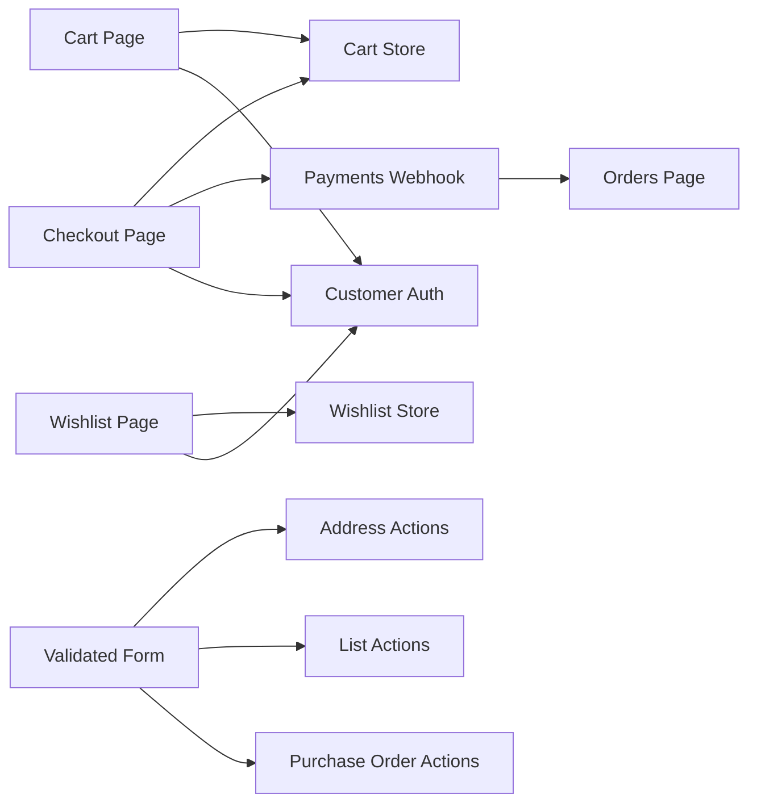

**Diagram sources**
- [page.tsx](file://apps/customer/src/app/cart/page.tsx)
- [page.tsx](file://apps/customer/src/app/checkout/page.tsx)
- [page.tsx](file://apps/customer/src/app/wishlist/page.tsx)
- [cart.ts](file://apps/customer/src/stores/cart.ts)
- [wishlist.ts](file://apps/customer/src/stores/wishlist.ts)
- [route.ts](file://apps/customer/src/app/api/payments/webhook/route.ts)
- [validated-form.tsx](file://apps/customer/src/components/b2b/validated-form.tsx)
- [actions.ts](file://apps/customer/src/app/b2b/addresses/actions.ts)
- [actions.ts](file://apps/customer/src/app/b2b/lists/actions.ts)
- [actions.ts](file://apps/customer/src/app/b2b/purchase-orders/actions.ts)
- [auth-instance.ts](file://apps/customer/src/lib/auth-instance.ts)
- [orders.tsx](file://apps/seller/src/app/orders/page.tsx)

**Section sources**
- [cart.ts](file://apps/customer/src/stores/cart.ts)
- [wishlist.ts](file://apps/customer/src/stores/wishlist.ts)
- [page.tsx](file://apps/customer/src/app/cart/page.tsx)
- [page.tsx](file://apps/customer/src/app/checkout/page.tsx)
- [page.tsx](file://apps/customer/src/app/wishlist/page.tsx)
- [route.ts](file://apps/customer/src/app/api/payments/webhook/route.ts)
- [validated-form.tsx](file://apps/customer/src/components/b2b/validated-form.tsx)
- [actions.ts](file://apps/customer/src/app/b2b/addresses/actions.ts)
- [actions.ts](file://apps/customer/src/app/b2b/lists/actions.ts)
- [actions.ts](file://apps/customer/src/app/b2b/purchase-orders/actions.ts)
- [auth-instance.ts](file://apps/customer/src/lib/auth-instance.ts)
- [orders.tsx](file://apps/seller/src/app/orders/page.tsx)

## Performance Considerations
- Minimize re-renders by structuring store state efficiently and using selective updates.
- Persist cart and wishlist data locally to avoid repeated network requests during browsing.
- Debounce form inputs in checkout to reduce unnecessary validations.
- Batch UI updates after store mutations to improve perceived performance.
- Use optimistic updates for quick feedback during add-to-cart and wishlist operations, with reconciliation on server response.

## Troubleshooting Guide
Common issues and resolutions:
- Cart not persisting across sessions: Verify local storage availability and store persistence logic.
- Checkout validation errors: Confirm validated form rules and ensure proper error messaging.
- Payment webhook not updating order: Check webhook signature verification and payload parsing.
- Wishlist sharing failures: Validate share permissions and network connectivity.
- Session inconsistencies: Review authentication instance usage and cookie/session storage.

**Section sources**
- [cart.ts](file://apps/customer/src/stores/cart.ts)
- [wishlist.ts](file://apps/customer/src/stores/wishlist.ts)
- [validated-form.tsx](file://apps/customer/src/components/b2b/validated-form.tsx)
- [route.ts](file://apps/customer/src/app/api/payments/webhook/route.ts)
- [auth-instance.ts](file://apps/customer/src/lib/auth-instance.ts)

## Conclusion
The Shopping Experience subsystem integrates local state management, validated forms, and backend webhooks to deliver a robust shopping journey. The cart and wishlist stores provide reliable persistence, while checkout and payment webhook flows ensure secure transactions. B2B utilities and order management further enhance the ecosystem for both customers and sellers.