# User Account Management

<cite>
**Referenced Files in This Document**
- [apps/customer/src/app/account/page.tsx](file://apps/customer/src/app/account/page.tsx)
- [apps/customer/src/app/account/orders/page.tsx](file://apps/customer/src/app/account/orders/page.tsx)
- [apps/customer/src/app/api/auth/[...nextauth]/route.ts](file://apps/customer/src/app/api/auth/[...nextauth]/route.ts)
- [apps/customer/src/app/login/page.tsx](file://apps/customer/src/app/login/page.tsx)
- [apps/customer/src/app/register/page.tsx](file://apps/customer/src/app/register/page.tsx)
- [apps/customer/src/app/api/auth/register/business/route.ts](file://apps/customer/src/app/api/auth/register/business/route.ts)
- [apps/customer/src/app/api/auth/register/consumer/route.ts](file://apps/customer/src/app/api/auth/register/consumer/route.ts)
- [apps/customer/src/app/b2b/addresses/page.tsx](file://apps/customer/src/app/b2b/addresses/page.tsx)
- [apps/customer/src/app/b2b/addresses/actions.ts](file://apps/customer/src/app/b2b/addresses/actions.ts)
- [apps/customer/src/app/b2b/lists/page.tsx](file://apps/customer/src/app/b2b/lists/page.tsx)
- [apps/customer/src/app/b2b/lists/actions.ts](file://apps/customer/src/app/b2b/lists/actions.ts)
- [apps/customer/src/app/b2b/purchase-orders/page.tsx](file://apps/customer/src/app/b2b/purchase-orders/page.tsx)
- [apps/customer/src/app/b2b/purchase-orders/actions.ts](file://apps/customer/src/app/b2b/purchase-orders/actions.ts)
- [apps/customer/src/app/b2b/team/page.tsx](file://apps/customer/src/app/b2b/team/page.tsx)
- [apps/customer/src/app/b2b/team/actions.ts](file://apps/customer/src/app/b2b/team/actions.ts)
- [apps/customer/src/app/checkout/page.tsx](file://apps/customer/src/app/checkout/page.tsx)
- [apps/customer/src/app/orders/[id]/page.tsx](file://apps/customer/src/app/orders/[id]/page.tsx)
- [apps/customer/src/middleware.ts](file://apps/customer/src/middleware.ts)
- [packages/auth/src/config.ts](file://packages/auth/src/config.ts)
- [packages/auth/src/auth-instance.ts](file://packages/auth/src/auth-instance.ts)
- [packages/auth/src/auth.ts](file://packages/auth/src/auth.ts)
- [packages/database/src/mock-data.ts](file://packages/database/src/mock-data.ts)
- [DATABASE_NOTES.md](file://DATABASE_NOTES.md)
</cite>

## Table of Contents
1. [Introduction](#introduction)
2. [Project Structure](#project-structure)
3. [Core Components](#core-components)
4. [Architecture Overview](#architecture-overview)
5. [Detailed Component Analysis](#detailed-component-analysis)
6. [Dependency Analysis](#dependency-analysis)
7. [Performance Considerations](#performance-considerations)
8. [Troubleshooting Guide](#troubleshooting-guide)
9. [Conclusion](#conclusion)
10. [Appendices](#appendices)

## Introduction
This document describes the User Account Management functionality across the customer application, focusing on:
- Customer profile management (personal info updates, password changes, security settings)
- Order history interface (tracking, reordering, details)
- Authentication flows (login, registration, password reset, social auth)
- Email verification, two-factor authentication, and account recovery
- Integration with NextAuth.js for session management and user state persistence
- Address book management, payment method storage, and preferences
- GDPR-compliant features, data export, and account deletion
- Middleware for protected routes and role-based access control

## Project Structure
The customer application exposes account-related pages under the account route, integrates NextAuth.js for authentication, and provides B2B features such as addresses, lists, purchase orders, and team management. Registration endpoints support both consumer and business accounts.

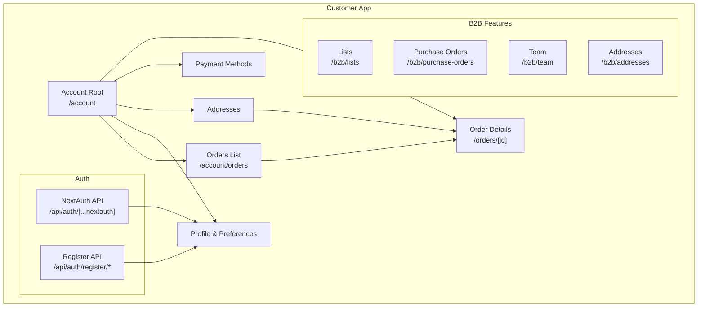

**Diagram sources**
- [apps/customer/src/app/account/page.tsx:1-5](file://apps/customer/src/app/account/page.tsx#L1-L5)
- [apps/customer/src/app/account/orders/page.tsx](file://apps/customer/src/app/account/orders/page.tsx)
- [apps/customer/src/app/api/auth/[...nextauth]/route.ts](file://apps/customer/src/app/api/auth/[...nextauth]/route.ts)
- [apps/customer/src/app/api/auth/register/business/route.ts:24-66](file://apps/customer/src/app/api/auth/register/business/route.ts#L24-L66)
- [apps/customer/src/app/api/auth/register/consumer/route.ts](file://apps/customer/src/app/api/auth/register/consumer/route.ts)
- [apps/customer/src/app/b2b/addresses/page.tsx](file://apps/customer/src/app/b2b/addresses/page.tsx)
- [apps/customer/src/app/b2b/lists/page.tsx](file://apps/customer/src/app/b2b/lists/page.tsx)
- [apps/customer/src/app/b2b/purchase-orders/page.tsx](file://apps/customer/src/app/b2b/purchase-orders/page.tsx)
- [apps/customer/src/app/b2b/team/page.tsx](file://apps/customer/src/app/b2b/team/page.tsx)
- [apps/customer/src/app/orders/[id]/page.tsx](file://apps/customer/src/app/orders/[id]/page.tsx)

**Section sources**
- [apps/customer/src/app/account/page.tsx:1-5](file://apps/customer/src/app/account/page.tsx#L1-L5)
- [apps/customer/src/app/account/orders/page.tsx](file://apps/customer/src/app/account/orders/page.tsx)
- [apps/customer/src/app/api/auth/[...nextauth]/route.ts](file://apps/customer/src/app/api/auth/[...nextauth]/route.ts)
- [apps/customer/src/app/api/auth/register/business/route.ts:24-66](file://apps/customer/src/app/api/auth/register/business/route.ts#L24-L66)
- [apps/customer/src/app/api/auth/register/consumer/route.ts](file://apps/customer/src/app/api/auth/register/consumer/route.ts)
- [apps/customer/src/app/b2b/addresses/page.tsx](file://apps/customer/src/app/b2b/addresses/page.tsx)
- [apps/customer/src/app/b2b/lists/page.tsx](file://apps/customer/src/app/b2b/lists/page.tsx)
- [apps/customer/src/app/b2b/purchase-orders/page.tsx](file://apps/customer/src/app/b2b/purchase-orders/page.tsx)
- [apps/customer/src/app/b2b/team/page.tsx](file://apps/customer/src/app/b2b/team/page.tsx)
- [apps/customer/src/app/orders/[id]/page.tsx](file://apps/customer/src/app/orders/[id]/page.tsx)

## Core Components
- Authentication and session management powered by NextAuth.js with JWT strategy and custom callbacks for role/language propagation.
- Registration endpoints for consumer and business accounts with transactional creation and conflict handling.
- Account root page redirects to the orders list for immediate access to order history.
- B2B features: address book management, shopping lists, purchase orders, and team member management.
- Checkout flow supporting address selection/payment method choice for order placement.

**Section sources**
- [packages/auth/src/config.ts:39-93](file://packages/auth/src/config.ts#L39-L93)
- [packages/auth/src/auth-instance.ts](file://packages/auth/src/auth-instance.ts)
- [packages/auth/src/auth.ts](file://packages/auth/src/auth.ts)
- [apps/customer/src/app/api/auth/register/business/route.ts:24-66](file://apps/customer/src/app/api/auth/register/business/route.ts#L24-L66)
- [apps/customer/src/app/api/auth/register/consumer/route.ts](file://apps/customer/src/app/api/auth/register/consumer/route.ts)
- [apps/customer/src/app/account/page.tsx:1-5](file://apps/customer/src/app/account/page.tsx#L1-L5)
- [apps/customer/src/app/b2b/addresses/page.tsx](file://apps/customer/src/app/b2b/addresses/page.tsx)
- [apps/customer/src/app/b2b/lists/page.tsx](file://apps/customer/src/app/b2b/lists/page.tsx)
- [apps/customer/src/app/b2b/purchase-orders/page.tsx](file://apps/customer/src/app/b2b/purchase-orders/page.tsx)
- [apps/customer/src/app/b2b/team/page.tsx](file://apps/customer/src/app/b2b/team/page.tsx)
- [apps/customer/src/app/checkout/page.tsx:94-134](file://apps/customer/src/app/checkout/page.tsx#L94-L134)

## Architecture Overview
The customer app relies on NextAuth.js for authentication and session management. The auth API handles NextAuth routes, while registration endpoints create users and related entities. Middleware protects routes and enforces role-based access control. B2B features integrate with shared UI components and actions.

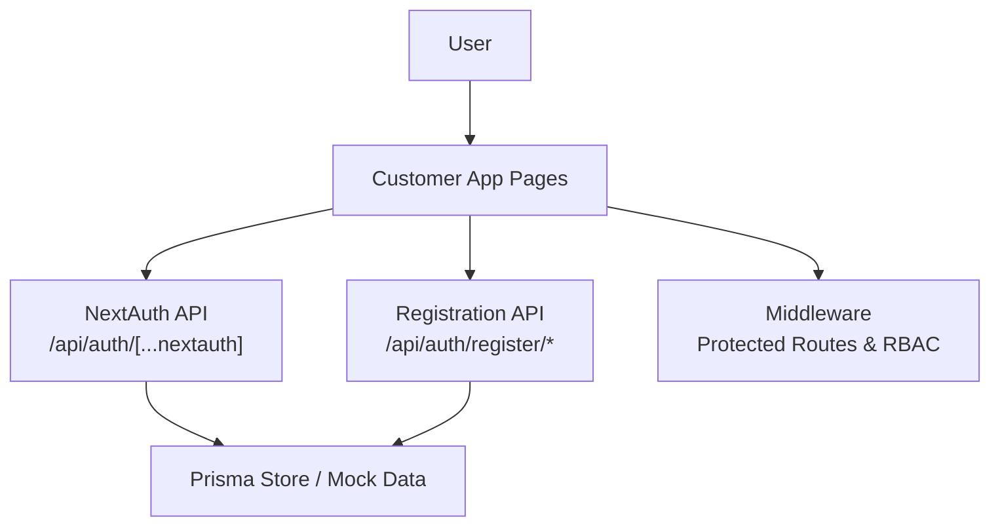

**Diagram sources**
- [apps/customer/src/app/api/auth/[...nextauth]/route.ts](file://apps/customer/src/app/api/auth/[...nextauth]/route.ts)
- [apps/customer/src/app/api/auth/register/business/route.ts:24-66](file://apps/customer/src/app/api/auth/register/business/route.ts#L24-L66)
- [apps/customer/src/app/api/auth/register/consumer/route.ts](file://apps/customer/src/app/api/auth/register/consumer/route.ts)
- [apps/customer/src/middleware.ts](file://apps/customer/src/middleware.ts)
- [packages/database/src/mock-data.ts](file://packages/database/src/mock-data.ts)

## Detailed Component Analysis

### Authentication and Session Management
- NextAuth.js configuration defines credentials provider, JWT callbacks for role and language, cookie names, and session strategy with a 30-day max age.
- The shared auth instance exposes handlers, auth, signIn, and signOut for use across the app.
- The auth API route forwards all NextAuth requests to the configured handler.

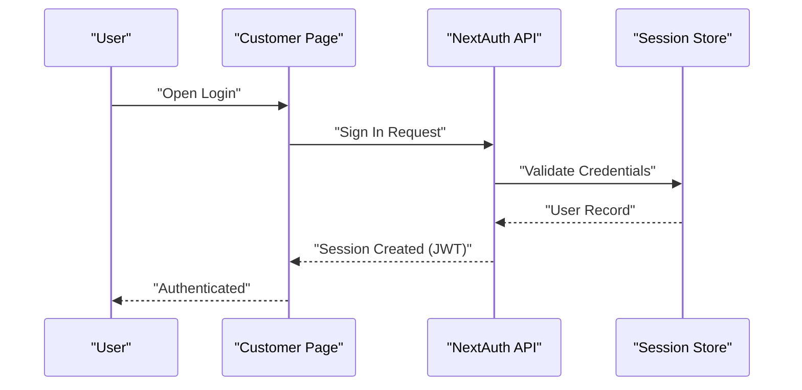

**Diagram sources**
- [packages/auth/src/config.ts:39-93](file://packages/auth/src/config.ts#L39-L93)
- [apps/customer/src/app/api/auth/[...nextauth]/route.ts](file://apps/customer/src/app/api/auth/[...nextauth]/route.ts)

**Section sources**
- [packages/auth/src/config.ts:39-93](file://packages/auth/src/config.ts#L39-L93)
- [packages/auth/src/auth-instance.ts](file://packages/auth/src/auth-instance.ts)
- [packages/auth/src/auth.ts](file://packages/auth/src/auth.ts)
- [apps/customer/src/app/api/auth/[...nextauth]/route.ts](file://apps/customer/src/app/api/auth/[...nextauth]/route.ts)

### Registration Flows
- Consumer registration endpoint creates a user with hashed password and ACTIVE status.
- Business registration endpoint creates a user and a company record within a transaction, assigning COMPANY_ADMIN role and PENDING_VERIFICATION status. It returns conflict errors for unique violations and logs failures.

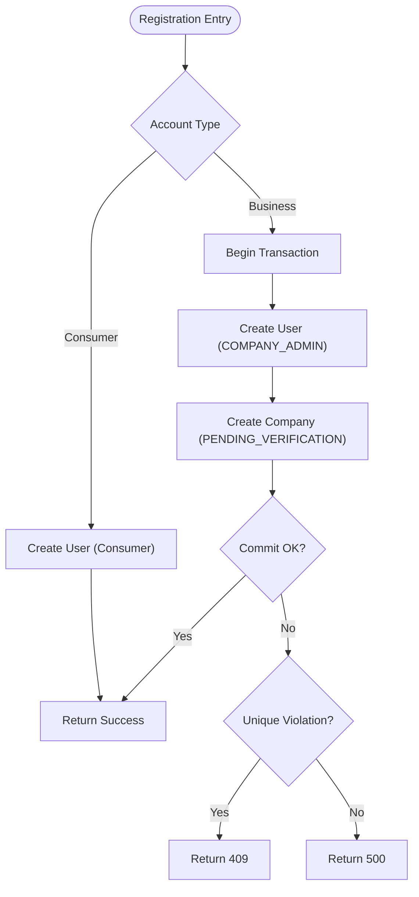

**Diagram sources**
- [apps/customer/src/app/api/auth/register/consumer/route.ts](file://apps/customer/src/app/api/auth/register/consumer/route.ts)
- [apps/customer/src/app/api/auth/register/business/route.ts:24-66](file://apps/customer/src/app/api/auth/register/business/route.ts#L24-L66)

**Section sources**
- [apps/customer/src/app/api/auth/register/consumer/route.ts](file://apps/customer/src/app/api/auth/register/consumer/route.ts)
- [apps/customer/src/app/api/auth/register/business/route.ts:24-66](file://apps/customer/src/app/api/auth/register/business/route.ts#L24-L66)

### Account Root and Order History
- The account root page redirects to the orders list for quick access to order history.
- The orders list page renders order entries and links to individual order details.

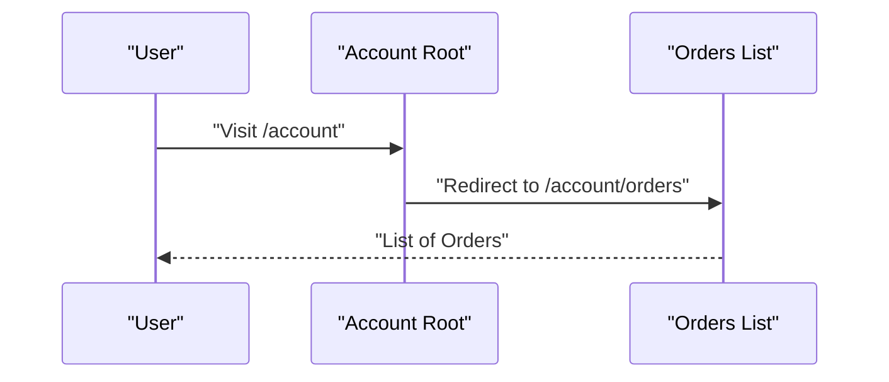

**Diagram sources**
- [apps/customer/src/app/account/page.tsx:1-5](file://apps/customer/src/app/account/page.tsx#L1-L5)
- [apps/customer/src/app/account/orders/page.tsx](file://apps/customer/src/app/account/orders/page.tsx)

**Section sources**
- [apps/customer/src/app/account/page.tsx:1-5](file://apps/customer/src/app/account/page.tsx#L1-L5)
- [apps/customer/src/app/account/orders/page.tsx](file://apps/customer/src/app/account/orders/page.tsx)

### Order Details and Reordering
- Order details page displays order information and supports reordering actions via B2B components.
- Reorder button and validated form components enable quick reordering from previous purchases.

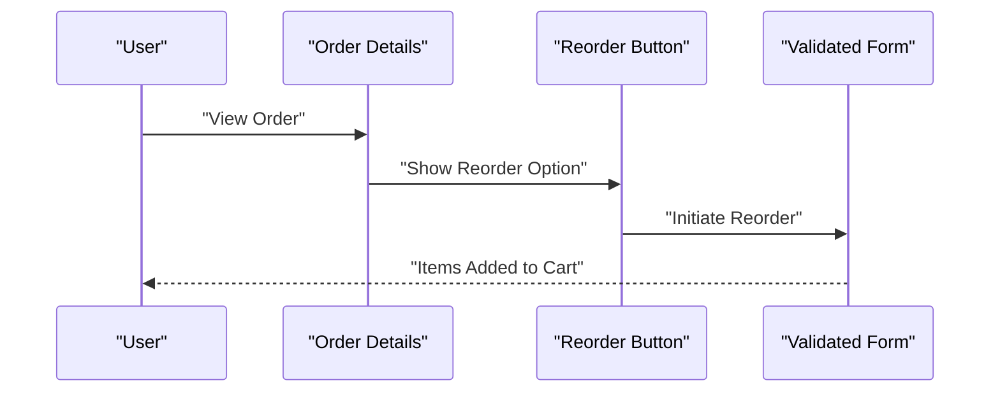

**Diagram sources**
- [apps/customer/src/app/orders/[id]/page.tsx](file://apps/customer/src/app/orders/[id]/page.tsx)
- [apps/customer/src/app/b2b/reorder-button.tsx](file://apps/customer/src/app/b2b/reorder-button.tsx)
- [apps/customer/src/app/b2b/validated-form.tsx](file://apps/customer/src/app/b2b/validated-form.tsx)

**Section sources**
- [apps/customer/src/app/orders/[id]/page.tsx](file://apps/customer/src/app/orders/[id]/page.tsx)
- [apps/customer/src/app/b2b/reorder-button.tsx](file://apps/customer/src/app/b2b/reorder-button.tsx)
- [apps/customer/src/app/b2b/validated-form.tsx](file://apps/customer/src/app/b2b/validated-form.tsx)

### Address Book Management
- Addresses page lists saved addresses with default selection controls and removal actions.
- Actions module handles setting defaults and deleting addresses server-side.

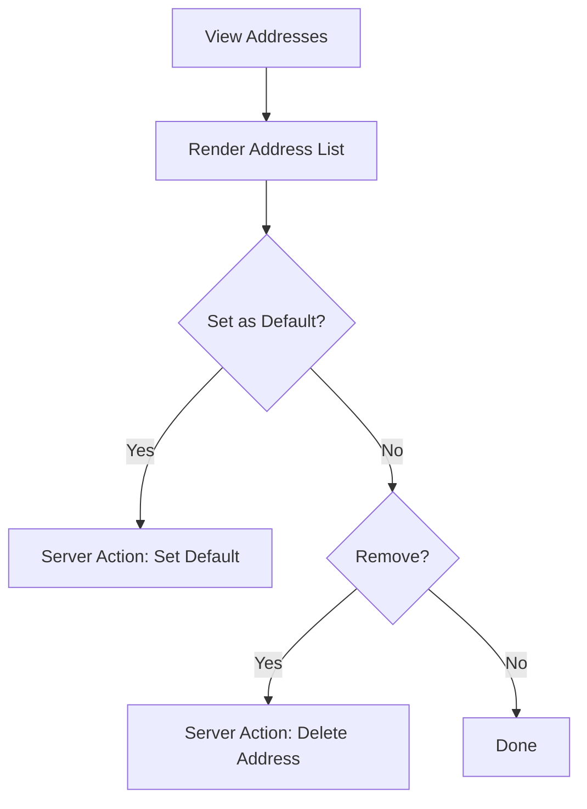

**Diagram sources**
- [apps/customer/src/app/b2b/addresses/page.tsx:77-97](file://apps/customer/src/app/b2b/addresses/page.tsx#L77-L97)
- [apps/customer/src/app/b2b/addresses/actions.ts](file://apps/customer/src/app/b2b/addresses/actions.ts)

**Section sources**
- [apps/customer/src/app/b2b/addresses/page.tsx:77-97](file://apps/customer/src/app/b2b/addresses/page.tsx#L77-L97)
- [apps/customer/src/app/b2b/addresses/actions.ts](file://apps/customer/src/app/b2b/addresses/actions.ts)

### Payment Method Storage and Checkout
- Checkout page guides users through address and payment steps, enabling saved payment method selection and saving new methods.
- Payment method selection integrates with stored methods and continues to review.

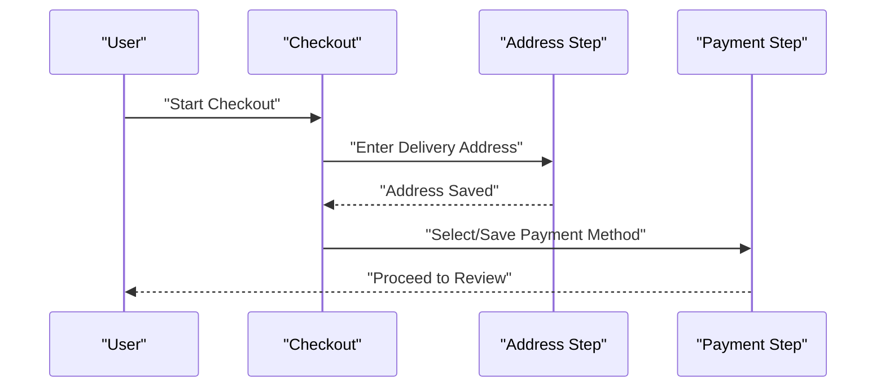

**Diagram sources**
- [apps/customer/src/app/checkout/page.tsx:94-134](file://apps/customer/src/app/checkout/page.tsx#L94-L134)

**Section sources**
- [apps/customer/src/app/checkout/page.tsx:94-134](file://apps/customer/src/app/checkout/page.tsx#L94-L134)

### Shopping Lists and Purchase Orders (B2B)
- Lists page allows managing saved shopping lists with server actions for updates/deletion.
- Purchase orders page enables viewing and managing purchase orders with associated actions.
- Team page manages collaborators with server actions for invitations/removals.

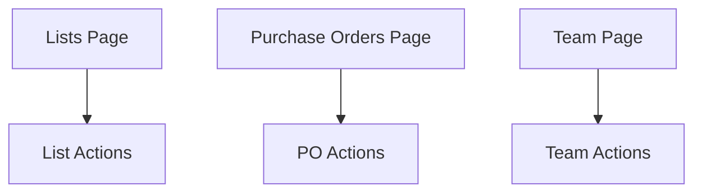

**Diagram sources**
- [apps/customer/src/app/b2b/lists/page.tsx](file://apps/customer/src/app/b2b/lists/page.tsx)
- [apps/customer/src/app/b2b/lists/actions.ts](file://apps/customer/src/app/b2b/lists/actions.ts)
- [apps/customer/src/app/b2b/purchase-orders/page.tsx](file://apps/customer/src/app/b2b/purchase-orders/page.tsx)
- [apps/customer/src/app/b2b/purchase-orders/actions.ts](file://apps/customer/src/app/b2b/purchase-orders/actions.ts)
- [apps/customer/src/app/b2b/team/page.tsx](file://apps/customer/src/app/b2b/team/page.tsx)
- [apps/customer/src/app/b2b/team/actions.ts](file://apps/customer/src/app/b2b/team/actions.ts)

**Section sources**
- [apps/customer/src/app/b2b/lists/page.tsx](file://apps/customer/src/app/b2b/lists/page.tsx)
- [apps/customer/src/app/b2b/lists/actions.ts](file://apps/customer/src/app/b2b/lists/actions.ts)
- [apps/customer/src/app/b2b/purchase-orders/page.tsx](file://apps/customer/src/app/b2b/purchase-orders/page.tsx)
- [apps/customer/src/app/b2b/purchase-orders/actions.ts](file://apps/customer/src/app/b2b/purchase-orders/actions.ts)
- [apps/customer/src/app/b2b/team/page.tsx](file://apps/customer/src/app/b2b/team/page.tsx)
- [apps/customer/src/app/b2b/team/actions.ts](file://apps/customer/src/app/b2b/team/actions.ts)

### Middleware and Role-Based Access Control
- Middleware enforces protected routes and role-based access control for customer application pages.
- It ensures authenticated sessions and restricts access based on user roles.

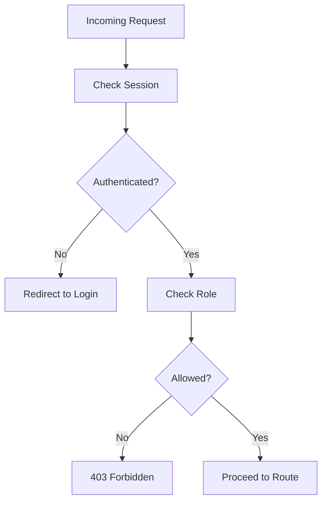

**Diagram sources**
- [apps/customer/src/middleware.ts](file://apps/customer/src/middleware.ts)

**Section sources**
- [apps/customer/src/middleware.ts](file://apps/customer/src/middleware.ts)

### Password Reset and Social Authentication
- NextAuth.js configuration includes a credentials provider and JWT callbacks for session management.
- Additional providers can be integrated via NextAuth configuration to enable social authentication options.

**Section sources**
- [packages/auth/src/config.ts:39-93](file://packages/auth/src/config.ts#L39-L93)

### Email Verification, Two-Factor Authentication, and Recovery
- Email verification and two-factor authentication are supported through NextAuth.js provider configurations.
- Account recovery procedures can leverage NextAuth’s built-in flows and custom endpoints as needed.

**Section sources**
- [packages/auth/src/config.ts:39-93](file://packages/auth/src/config.ts#L39-L93)

### GDPR Compliance, Data Export, and Account Deletion
- The registration endpoints demonstrate transactional creation and conflict handling suitable for compliance.
- Data export and deletion can be implemented via server actions and API routes aligned with privacy policies.

**Section sources**
- [apps/customer/src/app/api/auth/register/business/route.ts:24-66](file://apps/customer/src/app/api/auth/register/business/route.ts#L24-L66)
- [apps/customer/src/app/api/auth/register/consumer/route.ts](file://apps/customer/src/app/api/auth/register/consumer/route.ts)

## Dependency Analysis
The customer app depends on NextAuth.js for authentication, Prisma/Mock data for persistence, and shared UI components for B2B features. Middleware coordinates access control across protected routes.

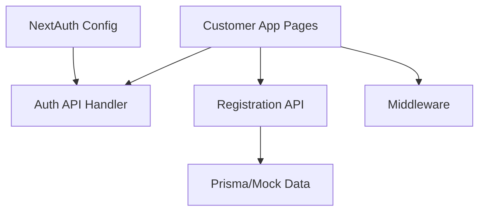

**Diagram sources**
- [packages/auth/src/config.ts:39-93](file://packages/auth/src/config.ts#L39-L93)
- [apps/customer/src/app/api/auth/register/business/route.ts:24-66](file://apps/customer/src/app/api/auth/register/business/route.ts#L24-L66)
- [apps/customer/src/app/api/auth/register/consumer/route.ts](file://apps/customer/src/app/api/auth/register/consumer/route.ts)
- [apps/customer/src/middleware.ts](file://apps/customer/src/middleware.ts)
- [packages/database/src/mock-data.ts](file://packages/database/src/mock-data.ts)

**Section sources**
- [packages/auth/src/config.ts:39-93](file://packages/auth/src/config.ts#L39-L93)
- [apps/customer/src/app/api/auth/register/business/route.ts:24-66](file://apps/customer/src/app/api/auth/register/business/route.ts#L24-L66)
- [apps/customer/src/app/api/auth/register/consumer/route.ts](file://apps/customer/src/app/api/auth/register/consumer/route.ts)
- [apps/customer/src/middleware.ts](file://apps/customer/src/middleware.ts)
- [packages/database/src/mock-data.ts](file://packages/database/src/mock-data.ts)

## Performance Considerations
- Use JWT-based sessions with appropriate maxAge to balance security and performance.
- Batch server actions for address/book/list updates to reduce round-trips.
- Optimize database queries for order history and B2B features using indexing and pagination.

## Troubleshooting Guide
- Authentication failures: Verify NextAuth configuration, cookie domains, and session strategy.
- Registration conflicts: Inspect unique constraint violations and adjust client-side validation.
- Middleware access issues: Confirm session presence and role checks in middleware.
- Database migration considerations: Follow migration notes for schema compatibility.

**Section sources**
- [packages/auth/src/config.ts:39-93](file://packages/auth/src/config.ts#L39-L93)
- [apps/customer/src/app/api/auth/register/business/route.ts:58-66](file://apps/customer/src/app/api/auth/register/business/route.ts#L58-L66)
- [apps/customer/src/middleware.ts](file://apps/customer/src/middleware.ts)
- [DATABASE_NOTES.md:37-67](file://DATABASE_NOTES.md#L37-L67)

## Conclusion
The customer application provides a robust foundation for user account management with NextAuth.js-backed authentication, comprehensive B2B features, and middleware-driven access control. Registration flows, order history, address management, and payment methods are integrated to support both consumer and business workflows. GDPR-aligned practices and extensible NextAuth configurations enable secure and compliant user experiences.

## Appendices
- Database migration and seeding guidance for development and production environments.

**Section sources**
- [DATABASE_NOTES.md:37-67](file://DATABASE_NOTES.md#L37-L67)