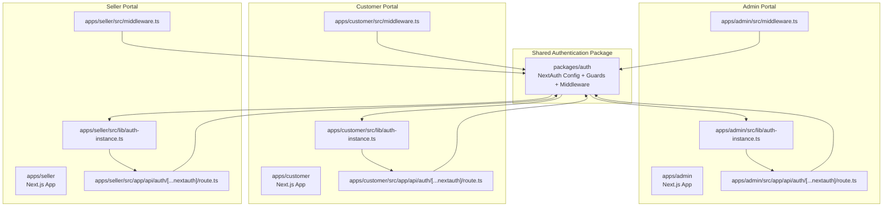
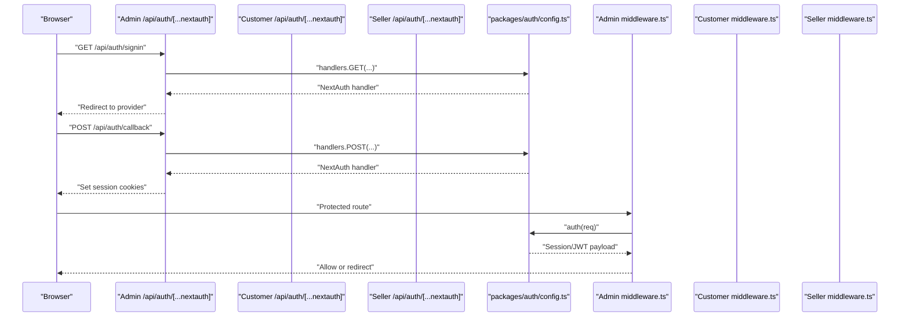
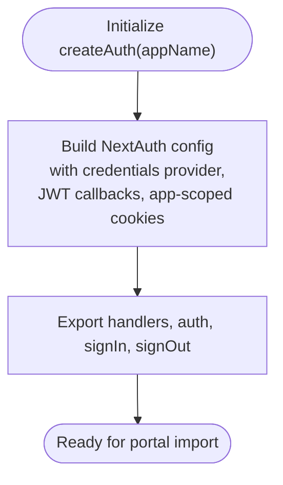
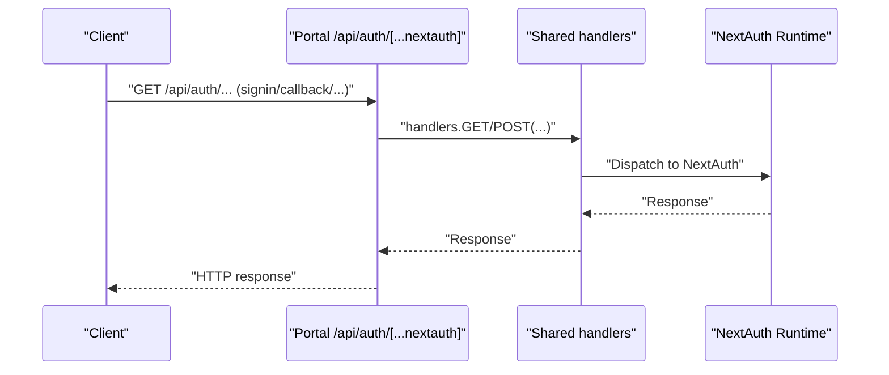
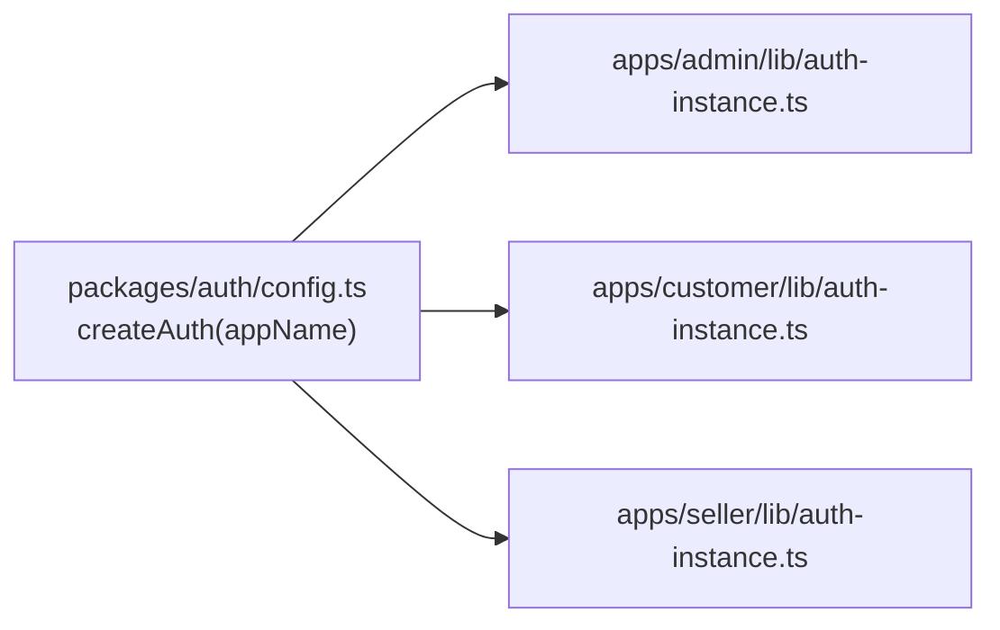
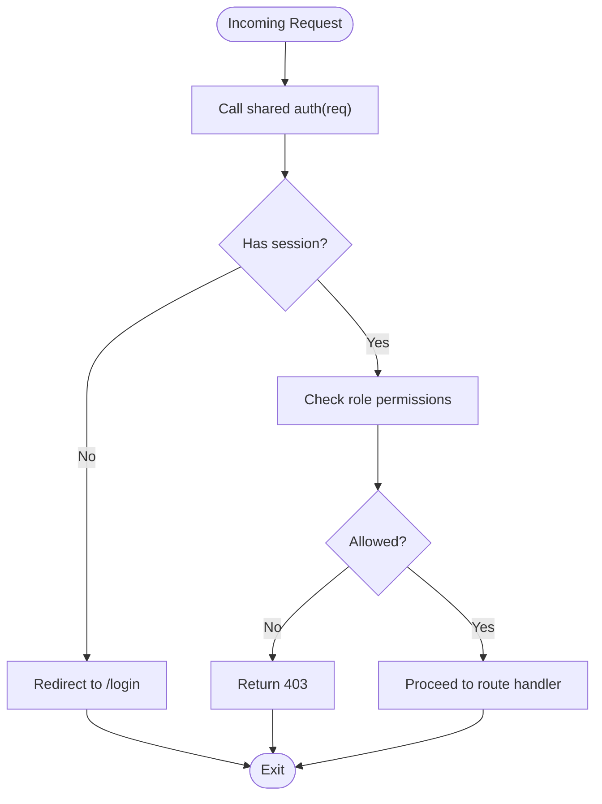
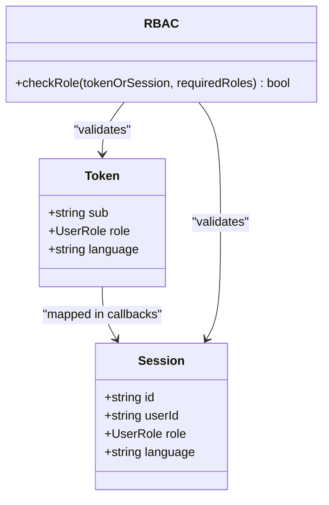
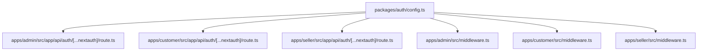

# Inter-Application Communication

<cite>
**Referenced Files in This Document**
- [config.ts](file://packages/auth/src/config.ts)
- [index.ts](file://packages/auth/src/index.ts)
- [middleware.ts](file://packages/auth/src/middleware.ts)
- [auth-instance.ts](file://apps/admin/src/lib/auth-instance.ts)
- [auth-instance.ts](file://apps/customer/src/lib/auth-instance.ts)
- [auth-instance.ts](file://apps/seller/src/lib/auth-instance.ts)
- [admin route.ts](file://apps/admin/src/app/api/auth/[...nextauth]/route.ts)
- [customer route.ts](file://apps/customer/src/app/api/auth/[...nextauth]/route.ts)
- [seller route.ts](file://apps/seller/src/app/api/auth/[...nextauth]/route.ts)
- [admin middleware.ts](file://apps/admin/src/middleware.ts)
- [customer middleware.ts](file://apps/customer/src/middleware.ts)
- [seller middleware.ts](file://apps/seller/src/middleware.ts)
- [admin layout.tsx](file://apps/admin/src/components/layout/admin-layout.tsx)
- [customer role-switcher.tsx](file://apps/customer/src/components/layout/role-switcher.tsx)
- [admin dashboard-view.tsx](file://apps/admin/src/app/dashboard/dashboard-view.tsx)
- [customer page.tsx](file://apps/customer/src/app/account/page.tsx)
- [seller page.tsx](file://apps/seller/src/app/dashboard/page.tsx)
</cite>

## Table of Contents
1. [Introduction](#introduction)
2. [Project Structure](#project-structure)
3. [Core Components](#core-components)
4. [Architecture Overview](#architecture-overview)
5. [Detailed Component Analysis](#detailed-component-analysis)
6. [Dependency Analysis](#dependency-analysis)
7. [Performance Considerations](#performance-considerations)
8. [Troubleshooting Guide](#troubleshooting-guide)
9. [Conclusion](#conclusion)

## Introduction
This document describes the inter-application communication architecture and shared authentication system across three portals: Admin, Customer, and Seller. It explains the centralized authentication implementation using NextAuth.js, the role-based access control (RBAC) model, middleware patterns, session management, shared authentication guards, token-based flows, and cross-application user context management. It also covers inter-application data sharing patterns, API communication protocols, state synchronization mechanisms, middleware configuration per portal, authentication flow coordination, and security considerations. Finally, it addresses user experience continuity, navigation patterns, and seamless role transitions between applications.

## Project Structure
The solution is organized as a monorepo with three Next.js applications under apps/, each exposing its own authentication endpoints and middleware. A shared authentication package under packages/auth provides the centralized NextAuth.js configuration, guards, and middleware utilities. Each portal exposes a NextAuth-compatible API route that delegates to a shared handlers instance.

**Diagram sources**
- [config.ts:88-93](file://packages/auth/src/config.ts#L88-L93)
- [admin route.ts:1-3](file://apps/admin/src/app/api/auth/[...nextauth]/route.ts#L1-L3)
- [customer route.ts:1-3](file://apps/customer/src/app/api/auth/[...nextauth]/route.ts#L1-L3)
- [seller route.ts:1-3](file://apps/seller/src/app/api/auth/[...nextauth]/route.ts#L1-L3)
- [admin middleware.ts](file://apps/admin/src/middleware.ts)
- [customer middleware.ts](file://apps/customer/src/middleware.ts)
- [seller middleware.ts](file://apps/seller/src/middleware.ts)

**Section sources**
- [config.ts:57-85](file://packages/auth/src/config.ts#L57-L85)
- [index.ts:1-3](file://packages/auth/src/index.ts#L1-L3)

## Core Components
- Centralized NextAuth.js configuration with JWT strategy and cookie customization per app.
- Shared authentication handlers exported from the auth package and imported by each portal.
- Middleware utilities for protected routes and role enforcement.
- Guards for protecting pages and API routes.
- Portal-specific authentication routes delegating to shared handlers.

Key implementation patterns:
- Each portal defines an API route under its app/api/auth/[...nextauth]/ that re-exports the shared handlers.
- Each portal creates a local auth-instance.ts that initializes the shared createAuth(appName) with the portal’s identifier.
- Middleware is configured per portal to enforce authentication and roles.
- Session storage uses JWT with a 30-day max age and app-scoped cookie names.

**Section sources**
- [config.ts:39-93](file://packages/auth/src/config.ts#L39-L93)
- [index.ts:1-3](file://packages/auth/src/index.ts#L1-L3)
- [admin route.ts:1-3](file://apps/admin/src/app/api/auth/[...nextauth]/route.ts#L1-L3)
- [customer route.ts:1-3](file://apps/customer/src/app/api/auth/[...nextauth]/route.ts#L1-L3)
- [seller route.ts:1-3](file://apps/seller/src/app/api/auth/[...nextauth]/route.ts#L1-L3)

## Architecture Overview
The authentication architecture is shared across all portals via a single NextAuth.js configuration. Each portal registers its own NextAuth endpoint and middleware, but both delegate to the shared auth package. This ensures consistent authentication behavior, session management, and RBAC enforcement across applications.

**Diagram sources**
- [admin route.ts:1-3](file://apps/admin/src/app/api/auth/[...nextauth]/route.ts#L1-L3)
- [customer route.ts:1-3](file://apps/customer/src/app/api/auth/[...nextauth]/route.ts#L1-L3)
- [seller route.ts:1-3](file://apps/seller/src/app/api/auth/[...nextauth]/route.ts#L1-L3)
- [config.ts:88-93](file://packages/auth/src/config.ts#L88-L93)
- [admin middleware.ts](file://apps/admin/src/middleware.ts)
- [customer middleware.ts](file://apps/customer/src/middleware.ts)
- [seller middleware.ts](file://apps/seller/src/middleware.ts)

## Detailed Component Analysis

### Centralized Authentication Configuration
The shared configuration builds a NextAuth.js adapter with:
- Credentials provider for password-based login.
- JWT strategy with custom callbacks to attach role and language to tokens and sessions.
- App-scoped cookie names to prevent cross-app cookie collisions.
- Sign-in and error pages mapped to a unified login route.
- Session duration set to 30 days.

**Diagram sources**
- [config.ts:39-93](file://packages/auth/src/config.ts#L39-L93)
- [config.ts:88-93](file://packages/auth/src/config.ts#L88-L93)

**Section sources**
- [config.ts:39-93](file://packages/auth/src/config.ts#L39-L93)

### Portal Authentication Routes
Each portal exposes a NextAuth-compatible API route that simply re-exports the shared handlers. This ensures identical authentication flows across Admin, Customer, and Seller.

**Diagram sources**
- [admin route.ts:1-3](file://apps/admin/src/app/api/auth/[...nextauth]/route.ts#L1-L3)
- [customer route.ts:1-3](file://apps/customer/src/app/api/auth/[...nextauth]/route.ts#L1-L3)
- [seller route.ts:1-3](file://apps/seller/src/app/api/auth/[...nextauth]/route.ts#L1-L3)
- [index.ts:1-3](file://packages/auth/src/index.ts#L1-L3)

**Section sources**
- [admin route.ts:1-3](file://apps/admin/src/app/api/auth/[...nextauth]/route.ts#L1-L3)
- [customer route.ts:1-3](file://apps/customer/src/app/api/auth/[...nextauth]/route.ts#L1-L3)
- [seller route.ts:1-3](file://apps/seller/src/app/api/auth/[...nextauth]/route.ts#L1-L3)

### Portal Authentication Instances
Each portal creates a local auth-instance.ts that initializes the shared createAuth(appName) with the portal’s identifier. This enables app-scoped cookie names and consistent behavior across portals.

**Diagram sources**
- [config.ts:88-93](file://packages/auth/src/config.ts#L88-L93)
- [auth-instance.ts](file://apps/admin/src/lib/auth-instance.ts)
- [auth-instance.ts](file://apps/customer/src/lib/auth-instance.ts)
- [auth-instance.ts](file://apps/seller/src/lib/auth-instance.ts)

**Section sources**
- [config.ts:88-93](file://packages/auth/src/config.ts#L88-L93)
- [auth-instance.ts](file://apps/admin/src/lib/auth-instance.ts)
- [auth-instance.ts](file://apps/customer/src/lib/auth-instance.ts)
- [auth-instance.ts](file://apps/seller/src/lib/auth-instance.ts)

### Middleware Implementation Patterns
Each portal defines middleware.ts to protect routes. The middleware uses the shared auth function to extract session data and enforce authentication and role checks. This pattern is repeated consistently across Admin, Customer, and Seller.

**Diagram sources**
- [admin middleware.ts](file://apps/admin/src/middleware.ts)
- [customer middleware.ts](file://apps/customer/src/middleware.ts)
- [seller middleware.ts](file://apps/seller/src/middleware.ts)
- [config.ts:62-77](file://packages/auth/src/config.ts#L62-L77)

**Section sources**
- [admin middleware.ts](file://apps/admin/src/middleware.ts)
- [customer middleware.ts](file://apps/customer/src/middleware.ts)
- [seller middleware.ts](file://apps/seller/src/middleware.ts)

### Role-Based Access Control (RBAC) and Guards
The shared configuration attaches role and language to JWT tokens and sessions via callbacks. Guards (from packages/auth/guards) can be used to restrict access to routes and pages based on roles. While the guards module is exported, the specific guard implementations are not shown here; however, the token structure supports enforcing role-based restrictions in middleware and pages.

**Diagram sources**
- [config.ts:62-77](file://packages/auth/src/config.ts#L62-L77)

**Section sources**
- [config.ts:62-77](file://packages/auth/src/config.ts#L62-L77)

### Session Management Strategies
- Strategy: JWT
- Max age: 30 days
- Cookie names: App-scoped (e.g., customer.session-token, admin.session-token)
- Callbacks: Attach role and language to token and session

These strategies ensure consistent session behavior across portals while preventing cookie collisions.

**Section sources**
- [config.ts:57-85](file://packages/auth/src/config.ts#L57-L85)

### Cross-Application User Context Management
- Shared NextAuth configuration ensures consistent user identity and claims across Admin, Customer, and Seller.
- App-scoped cookies prevent cross-app session leakage.
- JWT-based sessions enable stateless verification and easy propagation across services.

**Section sources**
- [config.ts:57-85](file://packages/auth/src/config.ts#L57-L85)

### Inter-Application Data Sharing and API Communication
- Authentication endpoints are standardized across portals, enabling consistent token issuance and validation.
- Middleware enforces access control uniformly, supporting secure inter-application navigation and data access.
- Shared guards and auth utilities facilitate consistent RBAC enforcement across APIs and pages.

[No sources needed since this section provides conceptual guidance]

### User Experience Continuity and Seamless Role Transitions
- Unified login experience via shared NextAuth handlers.
- Role-aware navigation components (e.g., role switcher in Customer portal) enable seamless transitions between roles.
- Consistent session duration and cookie scoping reduce friction across applications.

**Section sources**
- [customer role-switcher.tsx](file://apps/customer/src/components/layout/role-switcher.tsx)

## Dependency Analysis
The dependency graph shows how each portal depends on the shared auth package for authentication behavior, while maintaining independent API routes and middleware.

**Diagram sources**
- [config.ts:88-93](file://packages/auth/src/config.ts#L88-L93)
- [admin route.ts:1-3](file://apps/admin/src/app/api/auth/[...nextauth]/route.ts#L1-L3)
- [customer route.ts:1-3](file://apps/customer/src/app/api/auth/[...nextauth]/route.ts#L1-L3)
- [seller route.ts:1-3](file://apps/seller/src/app/api/auth/[...nextauth]/route.ts#L1-L3)
- [admin middleware.ts](file://apps/admin/src/middleware.ts)
- [customer middleware.ts](file://apps/customer/src/middleware.ts)
- [seller middleware.ts](file://apps/seller/src/middleware.ts)

**Section sources**
- [index.ts:1-3](file://packages/auth/src/index.ts#L1-L3)

## Performance Considerations
- JWT strategy reduces server-side session storage overhead.
- App-scoped cookies minimize cross-app cache pollution.
- Middleware checks are lightweight and rely on parsed JWT claims.
- Consider optimizing cookie sizes and avoiding unnecessary callbacks for high-traffic routes.

[No sources needed since this section provides general guidance]

## Troubleshooting Guide
Common issues and resolutions:
- Cookies not persisting across apps: Verify app-scoped cookie names and SameSite/Cross-site policies.
- Role not reflected in session: Confirm JWT callbacks are attaching role and language to token/session.
- Middleware redirects to login unexpectedly: Check auth(req) extraction and ensure protected routes call middleware.
- Inconsistent login experience: Ensure all portals expose the same NextAuth API route and import the same shared handlers.

**Section sources**
- [config.ts:57-85](file://packages/auth/src/config.ts#L57-L85)
- [config.ts:62-77](file://packages/auth/src/config.ts#L62-L77)
- [admin middleware.ts](file://apps/admin/src/middleware.ts)
- [customer middleware.ts](file://apps/customer/src/middleware.ts)
- [seller middleware.ts](file://apps/seller/src/middleware.ts)

## Conclusion
The inter-application communication architecture leverages a shared NextAuth.js configuration to deliver a consistent, secure, and scalable authentication and authorization system across Admin, Customer, and Seller portals. App-scoped cookies, JWT-based sessions, and middleware-driven RBAC enforcement ensure seamless user experiences, predictable navigation, and robust security. The standardized API routes and guards simplify maintenance and enable reliable cross-application user context management.