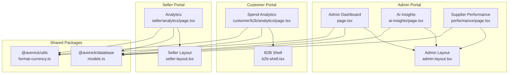
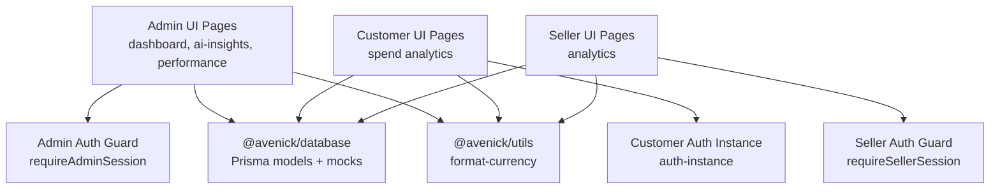
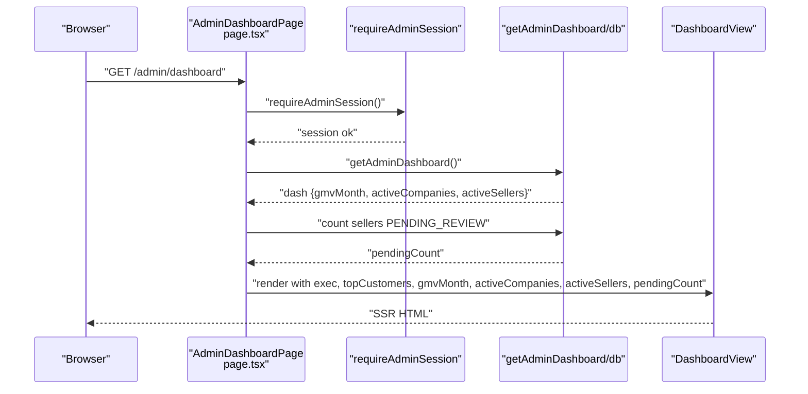
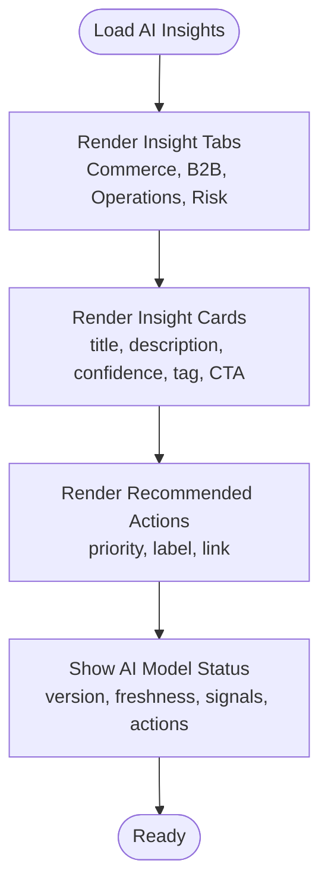
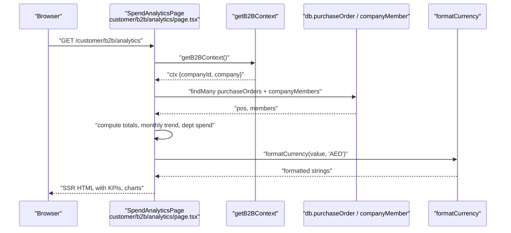
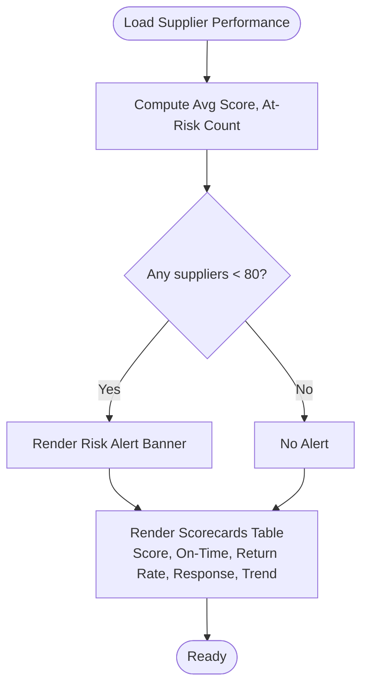
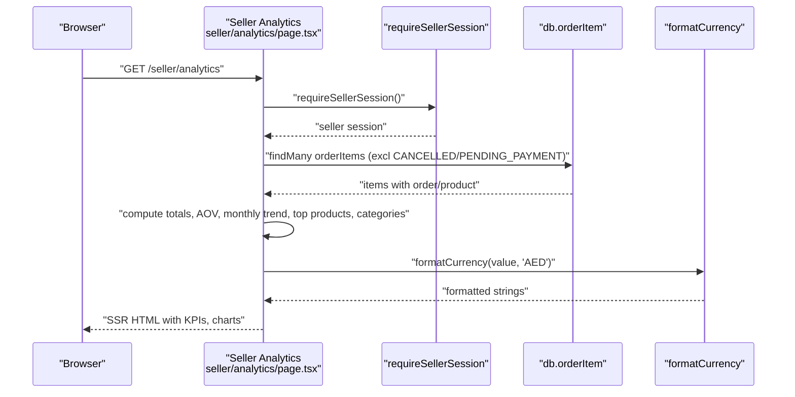
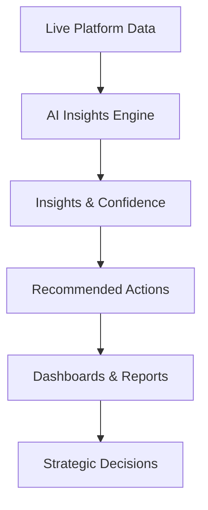
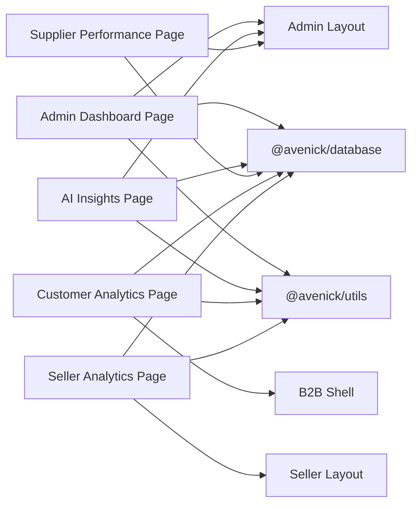

# Business Intelligence & Analytics

<cite>
**Referenced Files in This Document**
- [admin-dashboard-page.tsx](file://apps/admin/src/app/dashboard/page.tsx)
- [admin-dashboard-view.tsx](file://apps/admin/src/app/dashboard/dashboard-view.tsx)
- [ai-insights-page.tsx](file://apps/admin/src/app/ai-insights/page.tsx)
- [customer-analytics-page.tsx](file://apps/customer/src/app/b2b/analytics/page.tsx)
- [seller-analytics-page.tsx](file://apps/seller/src/app/analytics/page.tsx)
- [performance-page.tsx](file://apps/admin/src/app/performance/page.tsx)
- [auth-lib.ts](file://apps/admin/src/lib/auth.ts)
- [auth-lib.ts](file://apps/customer/src/lib/auth-instance.ts)
- [auth-lib.ts](file://apps/seller/src/lib/auth.ts)
- [utils-format-currency.ts](file://packages/utils/src/format-currency.ts)
- [database-index.ts](file://packages/database/src/index.ts)
- [database-executive-mocks.ts](file://packages/database/src/executive-mocks.ts)
- [database-models.ts](file://packages/database/src/models.ts)
- [admin-layout.tsx](file://apps/admin/src/components/layout/admin-layout.tsx)
- [seller-layout.tsx](file://apps/seller/src/components/layout/seller-layout.tsx)
- [b2b-shell.tsx](file://apps/customer/src/components/b2b/b2b-shell.tsx)
</cite>

## Table of Contents
1. [Introduction](#introduction)
2. [Project Structure](#project-structure)
3. [Core Components](#core-components)
4. [Architecture Overview](#architecture-overview)
5. [Detailed Component Analysis](#detailed-component-analysis)
6. [Dependency Analysis](#dependency-analysis)
7. [Performance Considerations](#performance-considerations)
8. [Troubleshooting Guide](#troubleshooting-guide)
9. [Conclusion](#conclusion)

## Introduction
This document describes the Business Intelligence and Analytics platform that powers market insights, performance metrics, and strategic decision support across the commerce ecosystem. It covers:
- Executive dashboards for KPIs, sales trends, and market position
- AI-powered insights generation and recommendation engines
- Competitive analysis, pricing intelligence, and demand forecasting
- Customer behavior analytics, sales funnel optimization, and conversion rate analysis
- Report generation, custom dashboards, and data export
- Market trend analysis, seasonal pattern recognition, and growth opportunity identification
- Integrations with external market data sources and real-time analytics processing

## Project Structure
The analytics platform spans three Next.js applications:
- Admin portal: executive dashboards, AI insights, supplier performance, and administrative analytics
- Customer (B2B) portal: spend analytics and procurement insights
- Seller portal: product and sales performance analytics

**Diagram sources**
- [admin-dashboard-page.tsx:1-28](file://apps/admin/src/app/dashboard/page.tsx#L1-L28)
- [admin-dashboard-view.tsx](file://apps/admin/src/app/dashboard/dashboard-view.tsx)
- [ai-insights-page.tsx:1-318](file://apps/admin/src/app/ai-insights/page.tsx#L1-L318)
- [performance-page.tsx:1-97](file://apps/admin/src/app/performance/page.tsx#L1-L97)
- [customer-analytics-page.tsx:1-121](file://apps/customer/src/app/b2b/analytics/page.tsx#L1-L121)
- [seller-analytics-page.tsx:1-156](file://apps/seller/src/app/analytics/page.tsx#L1-L156)
- [admin-layout.tsx](file://apps/admin/src/components/layout/admin-layout.tsx)
- [seller-layout.tsx](file://apps/seller/src/components/layout/seller-layout.tsx)
- [b2b-shell.tsx](file://apps/customer/src/components/b2b/b2b-shell.tsx)
- [database-index.ts](file://packages/database/src/index.ts)
- [utils-format-currency.ts](file://packages/utils/src/format-currency.ts)

**Section sources**
- [admin-dashboard-page.tsx:1-28](file://apps/admin/src/app/dashboard/page.tsx#L1-L28)
- [ai-insights-page.tsx:1-318](file://apps/admin/src/app/ai-insights/page.tsx#L1-L318)
- [customer-analytics-page.tsx:1-121](file://apps/customer/src/app/b2b/analytics/page.tsx#L1-L121)
- [seller-analytics-page.tsx:1-156](file://apps/seller/src/app/analytics/page.tsx#L1-L156)
- [performance-page.tsx:1-97](file://apps/admin/src/app/performance/page.tsx#L1-L97)

## Core Components
- Executive Dashboard (Admin): Renders live GMV and other KPIs, aggregates counts of pending profiles, and passes serializable data to the client-side dashboard view.
- AI Insights (Admin): Presents categorized AI-generated insights with confidence levels and recommended actions, integrating with internal operational domains (Commerce, B2B, Operations, Risk).
- Spend Analytics (Customer/B2B): Provides committed spend, monthly trends, and departmental breakdowns for procurement visibility.
- Supplier Performance (Admin): Displays marketplace-wide supplier scorecards, SLA metrics, and risk indicators.
- Sales Analytics (Seller): Shows revenue, units, monthly trends, top products, and category distribution.

**Section sources**
- [admin-dashboard-page.tsx:7-27](file://apps/admin/src/app/dashboard/page.tsx#L7-L27)
- [ai-insights-page.tsx:197-313](file://apps/admin/src/app/ai-insights/page.tsx#L197-L313)
- [customer-analytics-page.tsx:11-120](file://apps/customer/src/app/b2b/analytics/page.tsx#L11-L120)
- [performance-page.tsx:20-96](file://apps/admin/src/app/performance/page.tsx#L20-L96)
- [seller-analytics-page.tsx:11-155](file://apps/seller/src/app/analytics/page.tsx#L11-L155)

## Architecture Overview
The platform follows a layered architecture:
- UI Layer: Next.js pages and shared layouts/components
- Data Access Layer: Shared @avenick/database package for Prisma models and mocks
- Utilities: Shared @avenick/utils for formatting and helpers
- Authentication: Role-specific auth guards and sessions per app

**Diagram sources**
- [admin-dashboard-page.tsx:1-2](file://apps/admin/src/app/dashboard/page.tsx#L1-L2)
- [ai-insights-page.tsx:1-2](file://apps/admin/src/app/ai-insights/page.tsx#L1-L2)
- [customer-analytics-page.tsx:1-4](file://apps/customer/src/app/b2b/analytics/page.tsx#L1-L4)
- [seller-analytics-page.tsx:1-3](file://apps/seller/src/app/analytics/page.tsx#L1-L3)
- [utils-format-currency.ts](file://packages/utils/src/format-currency.ts)
- [database-index.ts](file://packages/database/src/index.ts)

## Detailed Component Analysis

### Executive Dashboard (Admin)
The Admin Dashboard page fetches live metrics and falls back to mock data for demonstration. It renders a dashboard view component with serialized props.

**Diagram sources**
- [admin-dashboard-page.tsx:7-27](file://apps/admin/src/app/dashboard/page.tsx#L7-L27)

**Section sources**
- [admin-dashboard-page.tsx:7-27](file://apps/admin/src/app/dashboard/page.tsx#L7-L27)

### AI Insights Engine (Admin)
The AI Insights page displays categorized insights with confidence indicators and links to relevant sections. It includes a recommended actions panel prioritized by AI.

**Diagram sources**
- [ai-insights-page.tsx:197-313](file://apps/admin/src/app/ai-insights/page.tsx#L197-L313)

**Section sources**
- [ai-insights-page.tsx:10-187](file://apps/admin/src/app/ai-insights/page.tsx#L10-L187)
- [ai-insights-page.tsx:189-195](file://apps/admin/src/app/ai-insights/page.tsx#L189-L195)
- [ai-insights-page.tsx:197-313](file://apps/admin/src/app/ai-insights/page.tsx#L197-L313)

### Spend Analytics (Customer/B2B)
The B2B Spend Analytics page computes committed spend, monthly trends, and departmental distribution. It requires a B2B context and formats currency via shared utilities.

**Diagram sources**
- [customer-analytics-page.tsx:11-120](file://apps/customer/src/app/b2b/analytics/page.tsx#L11-L120)

**Section sources**
- [customer-analytics-page.tsx:11-120](file://apps/customer/src/app/b2b/analytics/page.tsx#L11-L120)

### Supplier Performance (Admin)
The Supplier Performance page aggregates marketplace-wide metrics and displays supplier scorecards with trend indicators.

**Diagram sources**
- [performance-page.tsx:20-96](file://apps/admin/src/app/performance/page.tsx#L20-L96)

**Section sources**
- [performance-page.tsx:9-15](file://apps/admin/src/app/performance/page.tsx#L9-L15)
- [performance-page.tsx:20-96](file://apps/admin/src/app/performance/page.tsx#L20-L96)

### Sales Analytics (Seller)
The Seller Analytics page computes revenue, units, monthly trends, top products, and category distribution.

**Diagram sources**
- [seller-analytics-page.tsx:11-155](file://apps/seller/src/app/analytics/page.tsx#L11-L155)

**Section sources**
- [seller-analytics-page.tsx:11-155](file://apps/seller/src/app/analytics/page.tsx#L11-L155)

### Conceptual Overview
The platform integrates real-time data with AI-driven insights to enable:
- Real-time dashboards and alerts
- Predictive signals for inventory, pricing, and demand
- Strategic recommendations aligned with business outcomes
- Cross-functional collaboration via shared insights and actions

[No sources needed since this diagram shows conceptual workflow, not actual code structure]

## Dependency Analysis
Key dependencies and relationships:
- UI pages depend on shared auth guards and layouts
- All analytics pages depend on @avenick/database for data access and @avenick/utils for formatting
- Mock data is used for executive dashboards and supplier performance to demonstrate capability

**Diagram sources**
- [admin-dashboard-page.tsx:1-3](file://apps/admin/src/app/dashboard/page.tsx#L1-L3)
- [ai-insights-page.tsx:1-2](file://apps/admin/src/app/ai-insights/page.tsx#L1-L2)
- [performance-page.tsx:1-3](file://apps/admin/src/app/performance/page.tsx#L1-L3)
- [customer-analytics-page.tsx:1-5](file://apps/customer/src/app/b2b/analytics/page.tsx#L1-L5)
- [seller-analytics-page.tsx:1-5](file://apps/seller/src/app/analytics/page.tsx#L1-L5)
- [admin-layout.tsx](file://apps/admin/src/components/layout/admin-layout.tsx)
- [seller-layout.tsx](file://apps/seller/src/components/layout/seller-layout.tsx)
- [b2b-shell.tsx](file://apps/customer/src/components/b2b/b2b-shell.tsx)
- [database-index.ts](file://packages/database/src/index.ts)
- [utils-format-currency.ts](file://packages/utils/src/format-currency.ts)

**Section sources**
- [admin-dashboard-page.tsx:1-3](file://apps/admin/src/app/dashboard/page.tsx#L1-L3)
- [ai-insights-page.tsx:1-2](file://apps/admin/src/app/ai-insights/page.tsx#L1-L2)
- [performance-page.tsx:1-3](file://apps/admin/src/app/performance/page.tsx#L1-L3)
- [customer-analytics-page.tsx:1-5](file://apps/customer/src/app/b2b/analytics/page.tsx#L1-L5)
- [seller-analytics-page.tsx:1-5](file://apps/seller/src/app/analytics/page.tsx#L1-L5)

## Performance Considerations
- Server-side rendering (SSR) ensures fast initial loads for analytics pages.
- Currency formatting is centralized to reduce duplication and ensure consistency.
- Mock data fallbacks maintain UX continuity during development or when live data is unavailable.
- Efficient aggregation patterns compute KPIs and trends client-side after fetching minimal datasets.

[No sources needed since this section provides general guidance]

## Troubleshooting Guide
Common scenarios and resolutions:
- Missing B2B context in spend analytics: The page renders a friendly message and guidance when no company account is associated.
- Empty analytics data: Dedicated empty states guide users to take action (e.g., place purchase orders).
- Authentication failures: Auth guards redirect unauthenticated users appropriately; ensure role-based access aligns with the requested page.

**Section sources**
- [customer-analytics-page.tsx:13-23](file://apps/customer/src/app/b2b/analytics/page.tsx#L13-L23)
- [seller-analytics-page.tsx:88-94](file://apps/seller/src/app/analytics/page.tsx#L88-L94)

## Conclusion
The Business Intelligence and Analytics platform delivers actionable insights across the commerce ecosystem. It combines real-time dashboards, AI-driven recommendations, and domain-specific analytics to support strategic decision-making, optimize operations, and uncover growth opportunities. The modular architecture and shared packages facilitate maintainability and scalability.