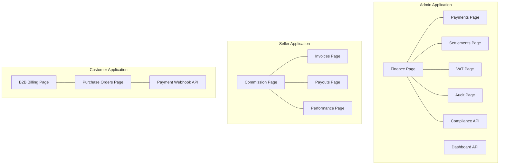
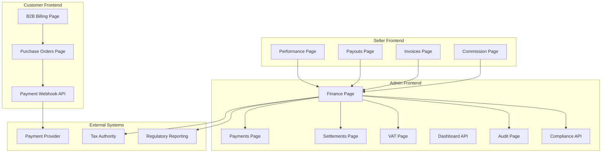
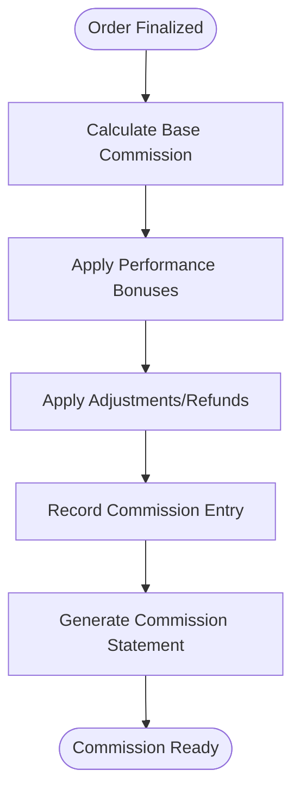
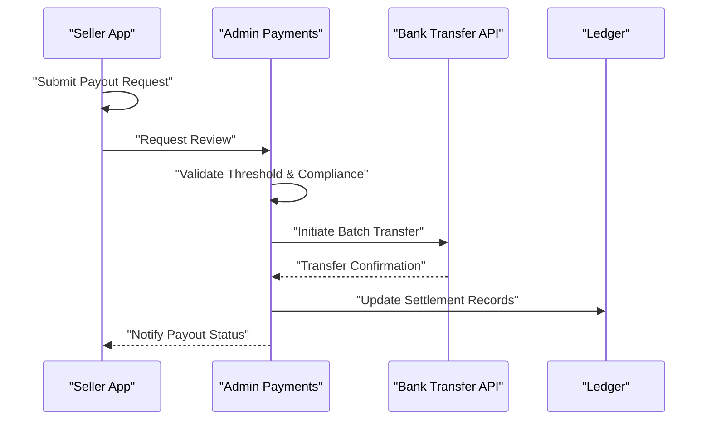
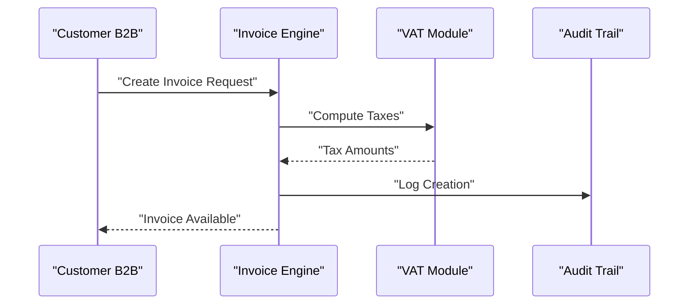
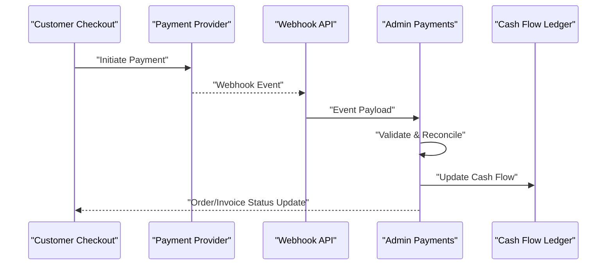
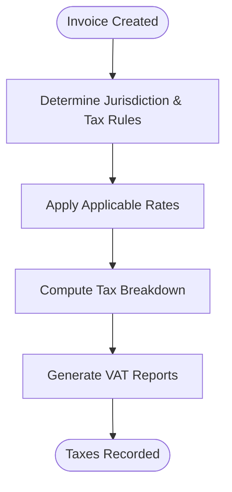
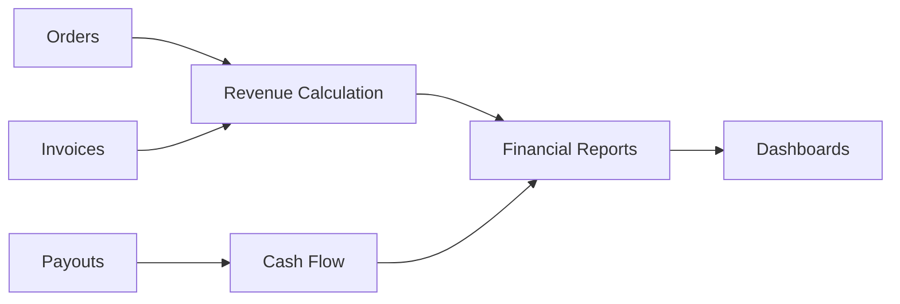
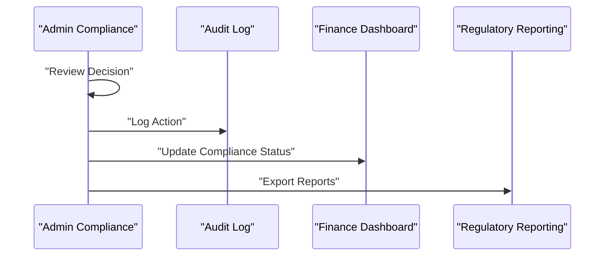
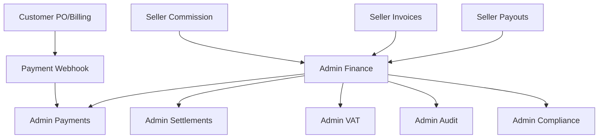

# Financial Management

<cite>
**Referenced Files in This Document**
- [MODULE_07_FINANCE_NOTES.md](file://MODULE_07_FINANCE_NOTES.md)
- [MODULE_10_PRICING_COMMISSION_NOTES.md](file://MODULE_10_PRICING_COMMISSION_NOTES.md)
- [apps/admin/src/app/finance/page.tsx](file://apps/admin/src/app/finance/page.tsx)
- [apps/admin/src/app/payments/page.tsx](file://apps/admin/src/app/payments/page.tsx)
- [apps/admin/src/app/settlements/page.tsx](file://apps/admin/src/app/settlements/page.tsx)
- [apps/admin/src/app/vat/page.tsx](file://apps/admin/src/app/vat/page.tsx)
- [apps/admin/src/app/dashboard/page.tsx](file://apps/admin/src/app/dashboard/page.tsx)
- [apps/admin/src/app/audit/page.tsx](file://apps/admin/src/app/audit/page.tsx)
- [apps/admin/src/app/compliance/page.tsx](file://apps/admin/src/app/compliance/page.tsx)
- [apps/seller/src/app/commission/page.tsx](file://apps/seller/src/app/commission/page.tsx)
- [apps/seller/src/app/invoices/page.tsx](file://apps/seller/src/app/invoices/page.tsx)
- [apps/seller/src/app/payouts/page.tsx](file://apps/seller/src/app/payouts/page.tsx)
- [apps/seller/src/app/performance/page.tsx](file://apps/seller/src/app/performance/page.tsx)
- [apps/customer/src/app/b2b/analytics/page.tsx](file://apps/customer/src/app/b2b/analytics/page.tsx)
- [apps/customer/src/app/b2b/billing/page.tsx](file://apps/customer/src/app/b2b/billing/page.tsx)
- [apps/customer/src/app/b2b/company/page.tsx](file://apps/customer/src/app/b2b/company/page.tsx)
- [apps/customer/src/app/b2b/lists/page.tsx](file://apps/customer/src/app/b2b/lists/page.tsx)
- [apps/customer/src/app/b2b/purchase-orders/page.tsx](file://apps/customer/src/app/b2b/purchase-orders/page.tsx)
- [apps/customer/src/app/b2b/quotes/page.tsx](file://apps/customer/src/app/b2b/quotes/page.tsx)
- [apps/customer/src/app/orders/[id]/page.tsx](file://apps/customer/src/app/orders/[id]/page.tsx)
- [apps/customer/src/app/products/[slug]/page.tsx](file://apps/customer/src/app/products/[slug]/page.tsx)
- [apps/customer/src/app/checkout/page.tsx](file://apps/customer/src/app/checkout/page.tsx)
- [apps/customer/src/app/cart/page.tsx](file://apps/customer/src/app/cart/page.tsx)
- [apps/customer/src/app/search/page.tsx](file://apps/customer/src/app/search/page.tsx)
- [apps/customer/src/app/support/page.tsx](file://apps/customer/src/app/support/page.tsx)
- [apps/customer/src/app/wishlist/page.tsx](file://apps/customer/src/app/wishlist/page.tsx)
- [apps/seller/src/app/orders/actions.ts](file://apps/seller/src/app/orders/actions.ts)
- [apps/seller/src/app/shipments/actions.ts](file://apps/seller/src/app/shipments/actions.ts)
- [apps/seller/src/app/returns/actions.ts](file://apps/seller/src/app/returns/actions.ts)
- [apps/seller/src/app/saved-views/actions.ts](file://apps/seller/src/app/saved-views/actions.ts)
- [apps/customer/src/app/b2b/lists/actions.ts](file://apps/customer/src/app/b2b/lists/actions.ts)
- [apps/customer/src/app/b2b/purchase-orders/actions.ts](file://apps/customer/src/app/b2b/purchase-orders/actions.ts)
- [apps/customer/src/app/b2b/team/actions.ts](file://apps/customer/src/app/b2b/team/actions.ts)
- [apps/customer/src/app/b2b/approval-policies/actions.ts](file://apps/customer/src/app/b2b/approval-policies/actions.ts)
- [apps/customer/src/app/support/actions.ts](file://apps/customer/src/app/support/actions.ts)
- [apps/admin/src/app/api/admin/compliance/[id]/approve/route.ts](file://apps/admin/src/app/api/admin/compliance/[id]/approve/route.ts)
- [apps/admin/src/app/api/admin/compliance/[id]/reject/route.ts](file://apps/admin/src/app/api/admin/compliance/[id]/reject/route.ts)
- [apps/admin/src/app/api/admin/sellers/[id]/approve/route.ts](file://apps/admin/src/app/api/admin/sellers/[id]/approve/route.ts)
- [apps/admin/src/app/api/admin/sellers/[id]/reject/route.ts](file://apps/admin/src/app/api/admin/sellers/[id]/reject/route.ts)
- [apps/admin/src/app/api/admin/products/[id]/approve/route.ts](file://apps/admin/src/app/api/admin/products/[id]/approve/route.ts)
- [apps/admin/src/app/api/admin/dashboard/dashboard-view.ts](file://apps/admin/src/app/api/admin/dashboard/dashboard-view.ts)
- [apps/admin/src/app/api/auth/[...nextauth]/route.ts](file://apps/admin/src/app/api/auth/[...nextauth]/route.ts)
- [apps/customer/src/app/api/auth/[...nextauth]/route.ts](file://apps/customer/src/app/api/auth/[...nextauth]/route.ts)
- [apps/customer/src/app/api/payments/webhook/route.ts](file://apps/customer/src/app/api/payments/webhook/route.ts)
- [apps/admin/src/app/api/admin/compliance/[id]/approve/route.ts](file://apps/admin/src/app/api/admin/compliance/[id]/approve/route.ts)
- [apps/admin/src/app/api/admin/compliance/[id]/reject/route.ts](file://apps/admin/src/app/api/admin/compliance/[id]/reject/route.ts)
- [apps/admin/src/app/api/admin/sellers/[id]/approve/route.ts](file://apps/admin/src/app/api/admin/sellers/[id]/approve/route.ts)
- [apps/admin/src/app/api/admin/sellers/[id]/reject/route.ts](file://apps/admin/src/app/api/admin/sellers/[id]/reject/route.ts)
- [apps/admin/src/app/api/admin/products/[id]/approve/route.ts](file://apps/admin/src/app/api/admin/products/[id]/approve/route.ts)
- [apps/admin/src/app/api/admin/dashboard/dashboard-view.ts](file://apps/admin/src/app/api/admin/dashboard/dashboard-view.ts)
- [apps/admin/src/app/api/auth/[...nextauth]/route.ts](file://apps/admin/src/app/api/auth/[...nextauth]/route.ts)
- [apps/customer/src/app/api/auth/[...nextauth]/route.ts](file://apps/customer/src/app/api/auth/[...nextauth]/route.ts)
- [apps/customer/src/app/api/payments/webhook/route.ts](file://apps/customer/src/app/api/payments/webhook/route.ts)
</cite>

## Table of Contents
1. [Introduction](#introduction)
2. [Project Structure](#project-structure)
3. [Core Components](#core-components)
4. [Architecture Overview](#architecture-overview)
5. [Detailed Component Analysis](#detailed-component-analysis)
6. [Dependency Analysis](#dependency-analysis)
7. [Performance Considerations](#performance-considerations)
8. [Troubleshooting Guide](#troubleshooting-guide)
9. [Conclusion](#conclusion)
10. [Appendices](#appendices)

## Introduction
This document describes the Financial Management system within the marketplace ecosystem, focusing on commission tracking, payout processing, invoicing workflows, and supporting capabilities such as tax calculations, financial reporting, performance-based earnings, and compliance. It synthesizes the current state of the codebase and module notes to present a practical guide for developers, administrators, and stakeholders.

## Project Structure
The Finance domain spans three primary applications:
- Admin application: oversight, compliance, settlements, VAT, and audit.
- Seller application: commission statements, invoices, payouts, and performance analytics.
- Customer application: B2B purchase lifecycle, billing, and payment webhooks.

Key Finance-related pages and APIs:
- Admin Finance dashboard and supporting modules.
- Seller Commission, Invoices, Payouts, and Performance.
- Customer B2B Billing and Purchase Orders, plus Payment Webhooks.

**Section sources**
- [apps/admin/src/app/finance/page.tsx](file://apps/admin/src/app/finance/page.tsx)
- [apps/admin/src/app/payments/page.tsx](file://apps/admin/src/app/payments/page.tsx)
- [apps/admin/src/app/settlements/page.tsx](file://apps/admin/src/app/settlements/page.tsx)
- [apps/admin/src/app/vat/page.tsx](file://apps/admin/src/app/vat/page.tsx)
- [apps/admin/src/app/dashboard/page.tsx](file://apps/admin/src/app/dashboard/page.tsx)
- [apps/admin/src/app/audit/page.tsx](file://apps/admin/src/app/audit/page.tsx)
- [apps/admin/src/app/compliance/page.tsx](file://apps/admin/src/app/compliance/page.tsx)
- [apps/seller/src/app/commission/page.tsx](file://apps/seller/src/app/commission/page.tsx)
- [apps/seller/src/app/invoices/page.tsx](file://apps/seller/src/app/invoices/page.tsx)
- [apps/seller/src/app/payouts/page.tsx](file://apps/seller/src/app/payouts/page.tsx)
- [apps/seller/src/app/performance/page.tsx](file://apps/seller/src/app/performance/page.tsx)
- [apps/customer/src/app/b2b/billing/page.tsx](file://apps/customer/src/app/b2b/billing/page.tsx)
- [apps/customer/src/app/b2b/purchase-orders/page.tsx](file://apps/customer/src/app/b2b/purchase-orders/page.tsx)
- [apps/customer/src/app/api/payments/webhook/route.ts](file://apps/customer/src/app/api/payments/webhook/route.ts)

## Core Components
- Commission Tracking (Seller): Displays commission summaries and calculations per period.
- Invoicing (Seller): Manages invoice generation and status tracking.
- Payouts (Seller): Handles payout requests and schedules.
- Payments and Settlements (Admin): Receives payment events and reconciles settlements.
- VAT and Tax (Admin): Manages tax configurations and reporting.
- Audit and Compliance (Admin): Maintains audit trails and compliance decisions.
- B2B Billing and Purchase Orders (Customer): Drives invoiceable events and payment triggers.
- Payment Webhooks (Customer): Processes external payment confirmations.

**Section sources**
- [apps/seller/src/app/commission/page.tsx](file://apps/seller/src/app/commission/page.tsx)
- [apps/seller/src/app/invoices/page.tsx](file://apps/seller/src/app/invoices/page.tsx)
- [apps/seller/src/app/payouts/page.tsx](file://apps/seller/src/app/payouts/page.tsx)
- [apps/admin/src/app/payments/page.tsx](file://apps/admin/src/app/payments/page.tsx)
- [apps/admin/src/app/settlements/page.tsx](file://apps/admin/src/app/settlements/page.tsx)
- [apps/admin/src/app/vat/page.tsx](file://apps/admin/src/app/vat/page.tsx)
- [apps/admin/src/app/audit/page.tsx](file://apps/admin/src/app/audit/page.tsx)
- [apps/admin/src/app/compliance/page.tsx](file://apps/admin/src/app/compliance/page.tsx)
- [apps/customer/src/app/b2b/billing/page.tsx](file://apps/customer/src/app/b2b/billing/page.tsx)
- [apps/customer/src/app/b2b/purchase-orders/page.tsx](file://apps/customer/src/app/b2b/purchase-orders/page.tsx)
- [apps/customer/src/app/api/payments/webhook/route.ts](file://apps/customer/src/app/api/payments/webhook/route.ts)

## Architecture Overview
The Finance system integrates front-end pages with backend APIs and external payment providers via webhooks. Admin controls compliance, settlements, and tax, while Seller views manage commission, invoices, and payouts. Customer B2B workflows trigger invoiceable events and payment confirmations.

**Diagram sources**
- [apps/seller/src/app/commission/page.tsx](file://apps/seller/src/app/commission/page.tsx)
- [apps/seller/src/app/invoices/page.tsx](file://apps/seller/src/app/invoices/page.tsx)
- [apps/seller/src/app/payouts/page.tsx](file://apps/seller/src/app/payouts/page.tsx)
- [apps/seller/src/app/performance/page.tsx](file://apps/seller/src/app/performance/page.tsx)
- [apps/admin/src/app/finance/page.tsx](file://apps/admin/src/app/finance/page.tsx)
- [apps/admin/src/app/payments/page.tsx](file://apps/admin/src/app/payments/page.tsx)
- [apps/admin/src/app/settlements/page.tsx](file://apps/admin/src/app/settlements/page.tsx)
- [apps/admin/src/app/vat/page.tsx](file://apps/admin/src/app/vat/page.tsx)
- [apps/admin/src/app/dashboard/page.tsx](file://apps/admin/src/app/dashboard/page.tsx)
- [apps/admin/src/app/audit/page.tsx](file://apps/admin/src/app/audit/page.tsx)
- [apps/admin/src/app/compliance/page.tsx](file://apps/admin/src/app/compliance/page.tsx)
- [apps/customer/src/app/b2b/billing/page.tsx](file://apps/customer/src/app/b2b/billing/page.tsx)
- [apps/customer/src/app/b2b/purchase-orders/page.tsx](file://apps/customer/src/app/b2b/purchase-orders/page.tsx)
- [apps/customer/src/app/api/payments/webhook/route.ts](file://apps/customer/src/app/api/payments/webhook/route.ts)

## Detailed Component Analysis

### Commission Tracking
- Purpose: Aggregate and present seller earnings, including base commissions, bonuses, and adjustments.
- Inputs: Order events, product pricing, seller agreements, and performance metrics.
- Outputs: Commission statements, summary charts, and exportable reports.
- Integration points: Admin Finance dashboard for oversight; Seller Performance for KPIs.

**Section sources**
- [apps/seller/src/app/commission/page.tsx](file://apps/seller/src/app/commission/page.tsx)
- [apps/seller/src/app/performance/page.tsx](file://apps/seller/src/app/performance/page.tsx)
- [apps/admin/src/app/finance/page.tsx](file://apps/admin/src/app/finance/page.tsx)

### Payout Processing
- Purpose: Manage seller payout requests, schedules, and statuses.
- Inputs: Commission balances, payout thresholds, seller bank details, and compliance checks.
- Outputs: Payout requests, scheduled disbursements, and settlement records.
- Integration points: Admin Payments/Settlements for reconciliation; external bank transfer APIs.

**Section sources**
- [apps/seller/src/app/payouts/page.tsx](file://apps/seller/src/app/payouts/page.tsx)
- [apps/admin/src/app/payments/page.tsx](file://apps/admin/src/app/payments/page.tsx)
- [apps/admin/src/app/settlements/page.tsx](file://apps/admin/src/app/settlements/page.tsx)

### Invoicing Workflows
- Purpose: Generate invoices from purchase orders and B2B billing events, track statuses, and manage tax.
- Inputs: Purchase orders, product/service details, tax rates, and delivery confirmations.
- Outputs: Invoice records, PDFs, and tax reports.
- Integration points: Admin VAT for tax configuration; Audit for compliance.

**Section sources**
- [apps/seller/src/app/invoices/page.tsx](file://apps/seller/src/app/invoices/page.tsx)
- [apps/customer/src/app/b2b/billing/page.tsx](file://apps/customer/src/app/b2b/billing/page.tsx)
- [apps/customer/src/app/b2b/purchase-orders/page.tsx](file://apps/customer/src/app/b2b/purchase-orders/page.tsx)
- [apps/admin/src/app/vat/page.tsx](file://apps/admin/src/app/vat/page.tsx)
- [apps/admin/src/app/audit/page.tsx](file://apps/admin/src/app/audit/page.tsx)

### Payment Webhooks and Cash Flow
- Purpose: Receive and process external payment confirmations, reconcile cash flow, and update order/invoice states.
- Inputs: Payment provider webhook payloads.
- Outputs: Updated order/invoice statuses, cash flow entries, and settlement updates.
- Integration points: Admin Payments for reconciliation; Admin Dashboard for real-time metrics.

**Section sources**
- [apps/customer/src/app/api/payments/webhook/route.ts](file://apps/customer/src/app/api/payments/webhook/route.ts)
- [apps/admin/src/app/payments/page.tsx](file://apps/admin/src/app/payments/page.tsx)
- [apps/admin/src/app/dashboard/page.tsx](file://apps/admin/src/app/dashboard/page.tsx)

### Tax Calculations and VAT
- Purpose: Compute taxes on invoices, manage VAT rates, and support tax reporting.
- Inputs: Product/service amounts, applicable tax rates, and jurisdiction rules.
- Outputs: Tax breakdowns, VAT reports, and filings.
- Integration points: Invoicing engine; Admin VAT; Regulatory reporting.

**Section sources**
- [apps/admin/src/app/vat/page.tsx](file://apps/admin/src/app/vat/page.tsx)
- [apps/seller/src/app/invoices/page.tsx](file://apps/seller/src/app/invoices/page.tsx)

### Financial Reporting and Analytics
- Purpose: Provide dashboards and analytics for revenue, commissions, and cash flow.
- Inputs: Orders, invoices, payouts, and ledger entries.
- Outputs: Charts, KPIs, and exportable reports.
- Integration points: Admin Dashboard; Seller Performance.

**Section sources**
- [apps/admin/src/app/dashboard/page.tsx](file://apps/admin/src/app/dashboard/page.tsx)
- [apps/seller/src/app/performance/page.tsx](file://apps/seller/src/app/performance/page.tsx)
- [apps/customer/src/app/b2b/analytics/page.tsx](file://apps/customer/src/app/b2b/analytics/page.tsx)

### Compliance, Audit, and Regulatory Reporting
- Purpose: Enforce compliance policies, maintain audit trails, and support regulatory submissions.
- Inputs: Compliance decisions, transaction logs, and report requests.
- Outputs: Approved/rejected records, audit logs, and regulatory reports.
- Integration points: Admin Compliance; Admin Audit; Finance dashboards.

**Section sources**
- [apps/admin/src/app/compliance/page.tsx](file://apps/admin/src/app/compliance/page.tsx)
- [apps/admin/src/app/audit/page.tsx](file://apps/admin/src/app/audit/page.tsx)
- [apps/admin/src/app/finance/page.tsx](file://apps/admin/src/app/finance/page.tsx)

### Multi-Currency Support and International Payments
- Scope: Currency conversion, multi-currency invoicing, and international payment routing.
- Implementation considerations: Exchange rate sources, rounding policies, and compliance for cross-border transactions.
- Integration points: Payment provider webhooks; Finance dashboards; VAT for jurisdiction-specific taxes.

[No sources needed since this section provides general guidance]

### Financial Statement Generation and Tax Document Preparation
- Scope: Automated generation of profit/loss, balance sheet, and tax documents.
- Implementation considerations: Accrual vs. cash basis, period-end cutoffs, and audit-ready formatting.
- Integration points: Ledger entries; VAT; Compliance.

[No sources needed since this section provides general guidance]

## Dependency Analysis
- Frontend-to-Frontend: Seller Finance pages depend on Admin Finance for oversight and reporting.
- Frontend-to-API: All Finance pages integrate with Admin APIs for reconciliation, compliance, and reporting.
- External Integrations: Payment webhooks, bank transfers, and tax authorities.

**Diagram sources**
- [apps/seller/src/app/commission/page.tsx](file://apps/seller/src/app/commission/page.tsx)
- [apps/seller/src/app/invoices/page.tsx](file://apps/seller/src/app/invoices/page.tsx)
- [apps/seller/src/app/payouts/page.tsx](file://apps/seller/src/app/payouts/page.tsx)
- [apps/admin/src/app/finance/page.tsx](file://apps/admin/src/app/finance/page.tsx)
- [apps/admin/src/app/payments/page.tsx](file://apps/admin/src/app/payments/page.tsx)
- [apps/admin/src/app/settlements/page.tsx](file://apps/admin/src/app/settlements/page.tsx)
- [apps/admin/src/app/vat/page.tsx](file://apps/admin/src/app/vat/page.tsx)
- [apps/admin/src/app/audit/page.tsx](file://apps/admin/src/app/audit/page.tsx)
- [apps/admin/src/app/compliance/page.tsx](file://apps/admin/src/app/compliance/page.tsx)
- [apps/customer/src/app/api/payments/webhook/route.ts](file://apps/customer/src/app/api/payments/webhook/route.ts)

**Section sources**
- [apps/admin/src/app/api/admin/dashboard/dashboard-view.ts](file://apps/admin/src/app/api/admin/dashboard/dashboard-view.ts)
- [apps/admin/src/app/api/admin/compliance/[id]/approve/route.ts](file://apps/admin/src/app/api/admin/compliance/[id]/approve/route.ts)
- [apps/admin/src/app/api/admin/compliance/[id]/reject/route.ts](file://apps/admin/src/app/api/admin/compliance/[id]/reject/route.ts)
- [apps/admin/src/app/api/admin/sellers/[id]/approve/route.ts](file://apps/admin/src/app/api/admin/sellers/[id]/approve/route.ts)
- [apps/admin/src/app/api/admin/sellers/[id]/reject/route.ts](file://apps/admin/src/app/api/admin/sellers/[id]/reject/route.ts)
- [apps/admin/src/app/api/admin/products/[id]/approve/route.ts](file://apps/admin/src/app/api/admin/products/[id]/approve/route.ts)

## Performance Considerations
- Batch reconciliation for high-volume payouts and settlements.
- Asynchronous processing for invoice generation and tax computations.
- Caching and indexing for Finance dashboards and reporting queries.
- Idempotent webhook handlers to prevent duplicate cash flow entries.

[No sources needed since this section provides general guidance]

## Troubleshooting Guide
- Payment Webhooks: Verify endpoint URLs, signatures, and payload schemas; check Admin Payments logs for validation errors.
- Payout Disputes: Confirm threshold rules, compliance flags, and bank details; review Admin Compliance decisions.
- Invoice Issues: Validate Purchase Orders, tax rules, and product/service data; check Audit logs for discrepancies.
- VAT Mismatches: Reconcile jurisdiction rules and rates; align with Admin VAT configurations.

**Section sources**
- [apps/customer/src/app/api/payments/webhook/route.ts](file://apps/customer/src/app/api/payments/webhook/route.ts)
- [apps/admin/src/app/payments/page.tsx](file://apps/admin/src/app/payments/page.tsx)
- [apps/admin/src/app/compliance/page.tsx](file://apps/admin/src/app/compliance/page.tsx)
- [apps/admin/src/app/audit/page.tsx](file://apps/admin/src/app/audit/page.tsx)
- [apps/admin/src/app/vat/page.tsx](file://apps/admin/src/app/vat/page.tsx)

## Conclusion
The Financial Management system integrates commission tracking, invoicing, payouts, payments, VAT, compliance, and reporting across Admin, Seller, and Customer applications. Robust API integrations with payment providers and tax systems enable automated cash flow, accurate tax computation, and comprehensive auditability. Extending support for multi-currency and international payments will further strengthen global operations.

## Appendices
- Commission and Pricing Notes: See module notes for rate structures and performance-based calculations.
- Finance Domain Notes: See module notes for high-level architecture and workflows.

**Section sources**
- [MODULE_07_FINANCE_NOTES.md](file://MODULE_07_FINANCE_NOTES.md)
- [MODULE_10_PRICING_COMMISSION_NOTES.md](file://MODULE_10_PRICING_COMMISSION_NOTES.md)