# Order Processing

<cite>
**Referenced Files in This Document**
- [seed.ts](file://packages/database/prisma/seed.ts)
- [orders.ts](file://packages/database/src/services/orders.ts)
- [page.tsx](file://apps/admin/src/app/warehouse/pickpack/page.tsx)
- [page.tsx](file://apps/admin/src/app/shipments/page.tsx)
- [page.tsx](file://apps/seller/src/app/shipments/page.tsx)
- [actions.ts](file://apps/seller/src/app/returns/actions.ts)
- [page.tsx](file://apps/seller/src/app/returns/page.tsx)
- [page.tsx](file://apps/admin/src/app/returns/page.tsx)
- [page.tsx](file://apps/customer/src/app/b2b/purchase-orders/actions.ts)
- [MODULE_03_SUPPLIER_SELLER_NOTES.md](file://MODULE_03_SUPPLIER_SELLER_NOTES.md)
</cite>

## Table of Contents
1. [Introduction](#introduction)
2. [Project Structure](#project-structure)
3. [Core Components](#core-components)
4. [Architecture Overview](#architecture-overview)
5. [Detailed Component Analysis](#detailed-component-analysis)
6. [Dependency Analysis](#dependency-analysis)
7. [Performance Considerations](#performance-considerations)
8. [Troubleshooting Guide](#troubleshooting-guide)
9. [Conclusion](#conclusion)
10. [Appendices](#appendices)

## Introduction
This document describes the Order Processing system across the Avenick commerce platform, focusing on the end-to-end order lifecycle from receipt to delivery completion. It covers order fulfillment workflows (confirmation, preparation, packaging, dispatch), return and refund management, shipment tracking and carrier management, order modifications and cancellations, dispute resolution, automation and batch operations, analytics and performance metrics, and integrations with warehouse management and logistics providers. The content synthesizes current frontend pages and backend services present in the repository to provide a practical, code-backed guide for operators and developers.

## Project Structure
The order processing domain spans three applications:
- Admin portal: oversight of marketplace-wide orders, returns, shipments, and dispatch queue.
- Seller portal: order and return management per seller, shipment status updates, and outbound logistics.
- Customer portal (B2B): purchase order creation and invoice generation upon order placement.

Key directories and files:
- Admin:
  - Orders overview and fulfillment dispatch queue
  - Shipments dashboard
  - Returns dashboard
- Seller:
  - Shipments management and status transitions
  - Returns management actions
- Customer (B2B):
  - Purchase order actions that finalize orders and generate tax invoices

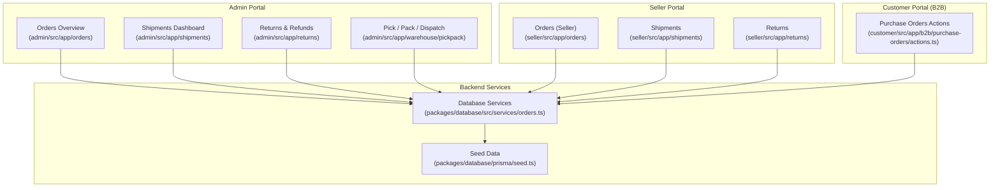

**Diagram sources**
- [page.tsx](file://apps/admin/src/app/warehouse/pickpack/page.tsx)
- [page.tsx](file://apps/admin/src/app/shipments/page.tsx)
- [page.tsx](file://apps/admin/src/app/returns/page.tsx)
- [page.tsx](file://apps/seller/src/app/shipments/page.tsx)
- [actions.ts](file://apps/seller/src/app/returns/actions.ts)
- [actions.ts](file://apps/customer/src/app/b2b/purchase-orders/actions.ts)
- [orders.ts](file://packages/database/src/services/orders.ts)
- [seed.ts](file://packages/database/prisma/seed.ts)

**Section sources**
- [page.tsx](file://apps/admin/src/app/warehouse/pickpack/page.tsx)
- [page.tsx](file://apps/admin/src/app/shipments/page.tsx)
- [page.tsx](file://apps/admin/src/app/returns/page.tsx)
- [page.tsx](file://apps/seller/src/app/shipments/page.tsx)
- [actions.ts](file://apps/seller/src/app/returns/actions.ts)
- [actions.ts](file://apps/customer/src/app/b2b/purchase-orders/actions.ts)
- [orders.ts](file://packages/database/src/services/orders.ts)
- [seed.ts](file://packages/database/prisma/seed.ts)

## Core Components
- Order service: central backend service for creating orders, updating statuses, and enumerating orders for sellers.
- Admin dashboards: oversee marketplace-wide shipment visibility, return processing, and dispatch queue.
- Seller dashboards: manage shipment status transitions and return decisions per seller.
- Customer B2B purchase order actions: convert purchase orders into confirmed orders and generate tax invoices.

Key responsibilities:
- Order creation and status transitions
- Fulfillment pipeline visibility (pick, pack, dispatch)
- Shipment tracking and carrier management
- Return authorization, inspection, and refund processing
- Purchase order to order conversion and invoicing

**Section sources**
- [orders.ts](file://packages/database/src/services/orders.ts)
- [page.tsx](file://apps/admin/src/app/warehouse/pickpack/page.tsx)
- [page.tsx](file://apps/admin/src/app/shipments/page.tsx)
- [page.tsx](file://apps/seller/src/app/shipments/page.tsx)
- [actions.ts](file://apps/seller/src/app/returns/actions.ts)
- [page.tsx](file://apps/seller/src/app/returns/page.tsx)
- [page.tsx](file://apps/admin/src/app/returns/page.tsx)
- [actions.ts](file://apps/customer/src/app/b2b/purchase-orders/actions.ts)

## Architecture Overview
The order lifecycle integrates frontend dashboards with backend services and seed data. The flow begins with purchase order actions that finalize orders and create tax invoices, followed by order status updates and fulfillment pipeline stages. Shipment tracking is managed via seller actions and admin dashboards, while returns are handled through seller-admin coordination.

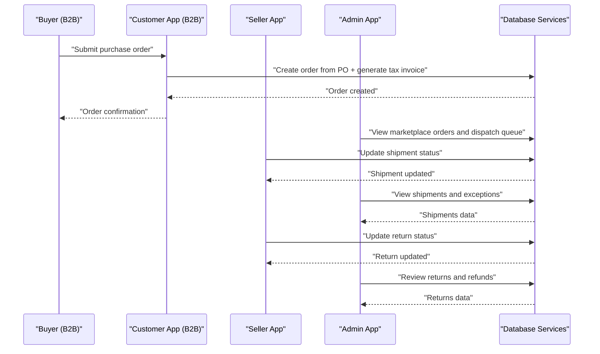

**Diagram sources**
- [actions.ts](file://apps/customer/src/app/b2b/purchase-orders/actions.ts)
- [orders.ts](file://packages/database/src/services/orders.ts)
- [page.tsx](file://apps/admin/src/app/warehouse/pickpack/page.tsx)
- [page.tsx](file://apps/admin/src/app/shipments/page.tsx)
- [page.tsx](file://apps/seller/src/app/shipments/page.tsx)
- [actions.ts](file://apps/seller/src/app/returns/actions.ts)
- [page.tsx](file://apps/admin/src/app/returns/page.tsx)

## Detailed Component Analysis

### Order Creation and Confirmation (B2B Purchase Orders)
- Purchase order actions finalize orders by creating order records and associated tax invoices, transitioning purchase order states accordingly.
- The process ensures financial records are generated alongside order creation for auditability.

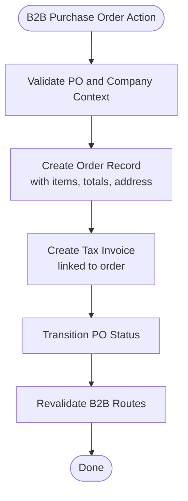

**Diagram sources**
- [actions.ts](file://apps/customer/src/app/b2b/purchase-orders/actions.ts)

**Section sources**
- [actions.ts](file://apps/customer/src/app/b2b/purchase-orders/actions.ts)

### Order Fulfillment Pipeline (Pick, Pack, Dispatch)
- Admin’s Pick/Pack/Dispatch view exposes a mock fulfillment queue with statuses spanning PICK_PENDING through DISPATCHED, enabling warehouse operators to track and assign tasks.
- The interface supports filtering and assignment, aligning with typical warehouse management needs.

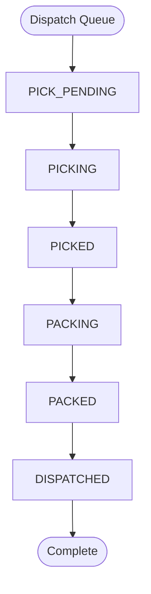

**Diagram sources**
- [page.tsx](file://apps/admin/src/app/warehouse/pickpack/page.tsx)

**Section sources**
- [page.tsx](file://apps/admin/src/app/warehouse/pickpack/page.tsx)

### Shipment Tracking and Carrier Management
- Sellers update shipment statuses through dedicated actions, moving statuses from Pending to Picked Up, In Transit, Out for Delivery, and Delivered.
- Admin dashboard aggregates shipment KPIs (exceptions, in-transit count) and displays routes, carriers, tracking numbers, and ETAs.

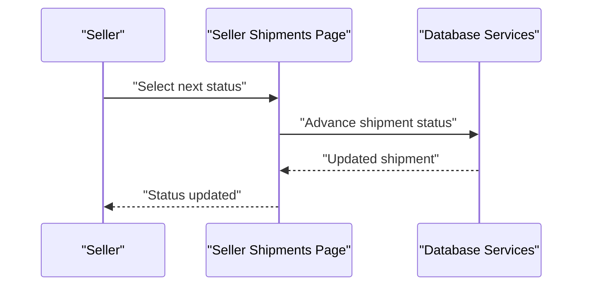

**Diagram sources**
- [page.tsx](file://apps/seller/src/app/shipments/page.tsx)
- [orders.ts](file://packages/database/src/services/orders.ts)

**Section sources**
- [page.tsx](file://apps/seller/src/app/shipments/page.tsx)
- [page.tsx](file://apps/admin/src/app/shipments/page.tsx)

### Return and Refund Management
- Sellers can update return statuses (Requested, Approved, Rejected, In Transit, Received, Refunded) via server actions.
- Admin dashboard provides an overview of return volumes and refund value, supporting marketplace-wide return monitoring.

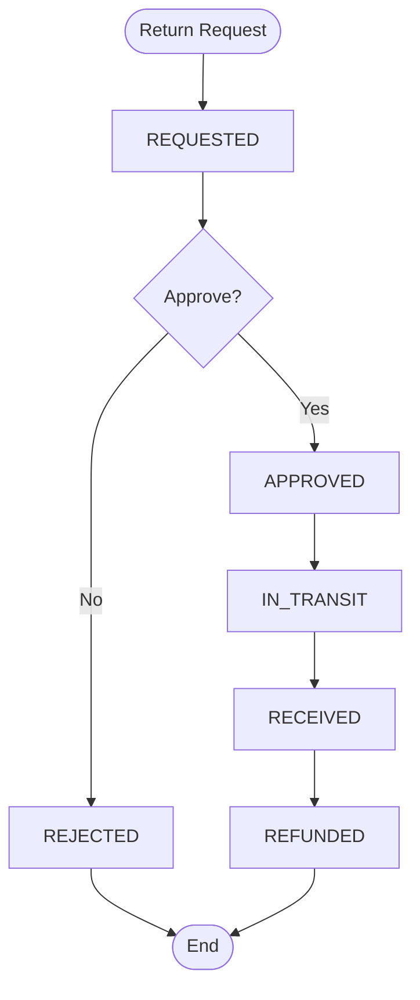

**Diagram sources**
- [actions.ts](file://apps/seller/src/app/returns/actions.ts)
- [page.tsx](file://apps/seller/src/app/returns/page.tsx)
- [page.tsx](file://apps/admin/src/app/returns/page.tsx)

**Section sources**
- [actions.ts](file://apps/seller/src/app/returns/actions.ts)
- [page.tsx](file://apps/seller/src/app/returns/page.tsx)
- [page.tsx](file://apps/admin/src/app/returns/page.tsx)

### Order Modification Requests, Cancellations, and Disputes
- Purchase order cancellation transitions are supported for eligible states, ensuring controlled lifecycle changes.
- Dispute resolution is represented in the admin portal under dedicated sections, indicating a structured escalation path.

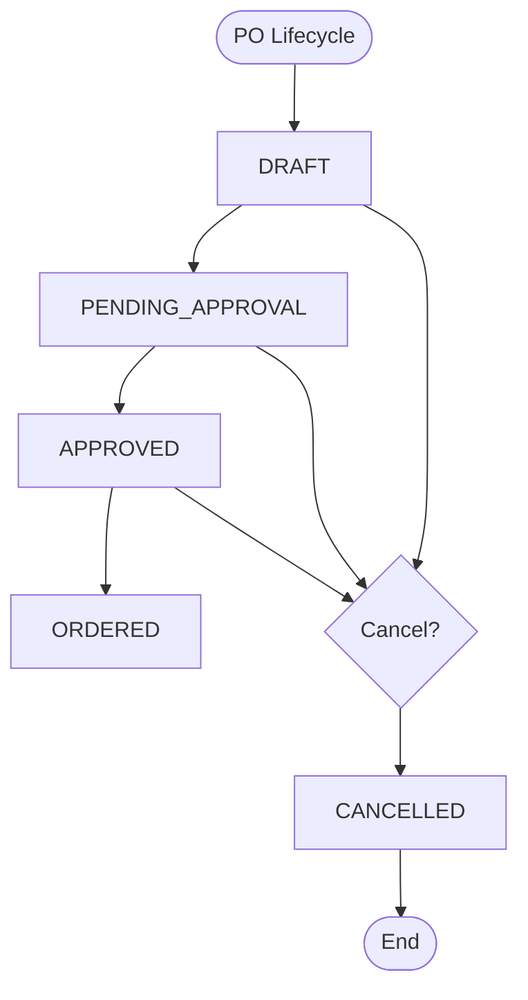

**Diagram sources**
- [actions.ts](file://apps/customer/src/app/b2b/purchase-orders/actions.ts)
- [page.tsx](file://apps/admin/src/app/disputes/page.tsx)

**Section sources**
- [actions.ts](file://apps/customer/src/app/b2b/purchase-orders/actions.ts)
- [page.tsx](file://apps/admin/src/app/disputes/page.tsx)

### Automated Order Processing Rules and Batch Operations
- Seed data demonstrates initial order status history entries (e.g., CONFIRMED, PROCESSING), indicating automated progression from payment to preparation.
- Batch operations can leverage the order service’s enumeration and status update capabilities to apply bulk transitions or analytics runs.

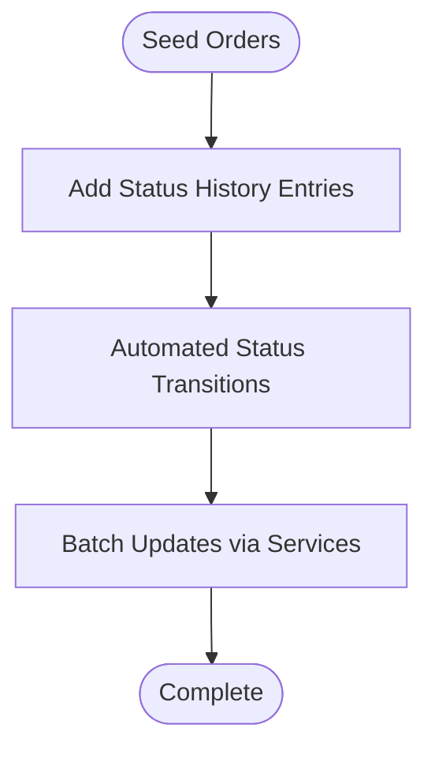

**Diagram sources**
- [seed.ts](file://packages/database/prisma/seed.ts)
- [orders.ts](file://packages/database/src/services/orders.ts)

**Section sources**
- [seed.ts](file://packages/database/prisma/seed.ts)
- [orders.ts](file://packages/database/src/services/orders.ts)

### Order Analytics, Performance Metrics, and Customer Satisfaction Tracking
- Admin dashboards expose high-level metrics such as exception counts and in-transit shipment counts, enabling performance monitoring.
- Returns dashboard computes refund value across approved/processing/completed returns, supporting financial and satisfaction insights.

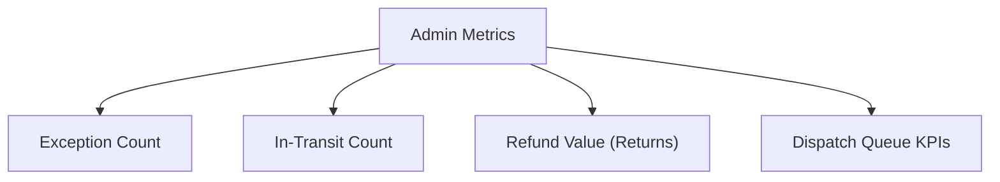

**Diagram sources**
- [page.tsx](file://apps/admin/src/app/shipments/page.tsx)
- [page.tsx](file://apps/admin/src/app/returns/page.tsx)
- [page.tsx](file://apps/admin/src/app/warehouse/pickpack/page.tsx)

**Section sources**
- [page.tsx](file://apps/admin/src/app/shipments/page.tsx)
- [page.tsx](file://apps/admin/src/app/returns/page.tsx)
- [page.tsx](file://apps/admin/src/app/warehouse/pickpack/page.tsx)

### Integration with Warehouse Management and Logistics Providers
- Fulfillment queue in the admin portal mirrors warehouse operations (pick, pack, dispatch).
- Shipment statuses integrate with carrier systems (e.g., Aramex, DHL, FedEx, Fetchr), enabling end-to-end tracking visibility.

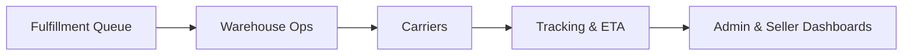

**Diagram sources**
- [page.tsx](file://apps/admin/src/app/warehouse/pickpack/page.tsx)
- [page.tsx](file://apps/admin/src/app/shipments/page.tsx)
- [page.tsx](file://apps/seller/src/app/shipments/page.tsx)

**Section sources**
- [page.tsx](file://apps/admin/src/app/warehouse/pickpack/page.tsx)
- [page.tsx](file://apps/admin/src/app/shipments/page.tsx)
- [page.tsx](file://apps/seller/src/app/shipments/page.tsx)
- [MODULE_03_SUPPLIER_SELLER_NOTES.md](file://MODULE_03_SUPPLIER_SELLER_NOTES.md)

## Dependency Analysis
The order processing system exhibits clear separation of concerns:
- Frontend dashboards depend on backend services for data retrieval and mutations.
- Seed data initializes baseline order states and histories.
- Purchase order actions bridge B2B ordering to order creation and invoicing.

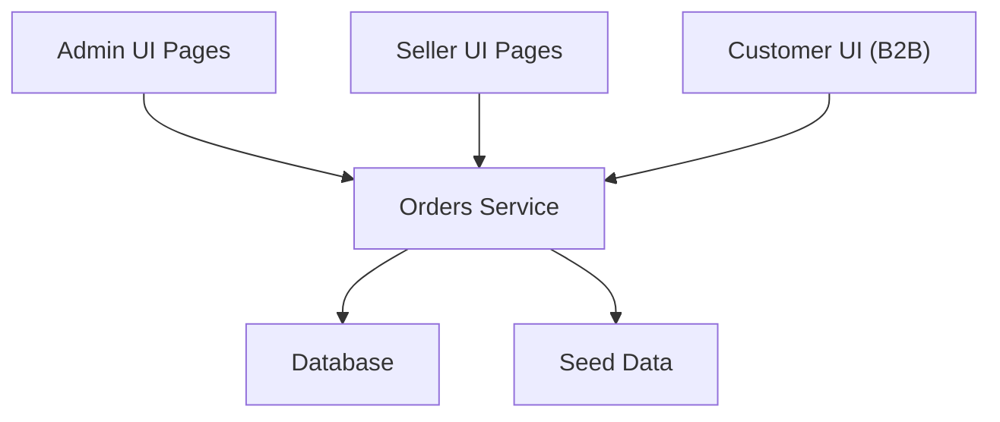

**Diagram sources**
- [orders.ts](file://packages/database/src/services/orders.ts)
- [seed.ts](file://packages/database/prisma/seed.ts)
- [page.tsx](file://apps/admin/src/app/shipments/page.tsx)
- [page.tsx](file://apps/seller/src/app/shipments/page.tsx)
- [actions.ts](file://apps/customer/src/app/b2b/purchase-orders/actions.ts)

**Section sources**
- [orders.ts](file://packages/database/src/services/orders.ts)
- [seed.ts](file://packages/database/prisma/seed.ts)
- [page.tsx](file://apps/admin/src/app/shipments/page.tsx)
- [page.tsx](file://apps/seller/src/app/shipments/page.tsx)
- [actions.ts](file://apps/customer/src/app/b2b/purchase-orders/actions.ts)

## Performance Considerations
- Use pagination and filters in order and shipment listings to reduce payload sizes.
- Batch status updates via backend services to minimize repeated UI interactions.
- Cache frequently accessed metrics (exception counts, in-transit counts) at the dashboard level.
- Optimize database queries by leveraging order enumerations and indexed status fields.

## Troubleshooting Guide
- If shipment status transitions fail, verify session requirements and status validity in seller actions.
- If returns do not reflect in dashboards, confirm status updates and cache revalidation triggers.
- For purchase order to order conversion issues, check PO eligibility and transaction boundaries.

Common checks:
- Session validation for admin and seller contexts
- Status enums and transitions
- Transactional integrity for order and invoice creation
- Cache revalidation after state changes

**Section sources**
- [actions.ts](file://apps/seller/src/app/returns/actions.ts)
- [page.tsx](file://apps/seller/src/app/returns/page.tsx)
- [actions.ts](file://apps/customer/src/app/b2b/purchase-orders/actions.ts)

## Conclusion
The Order Processing system integrates B2B purchase order workflows, order creation and invoicing, fulfillment pipeline visibility, shipment tracking, return management, and administrative oversight. By leveraging backend services, seed data, and modular frontend dashboards, the platform supports scalable order lifecycle management, carrier integration, and operational analytics.

## Appendices
- Additional schema notes for shipments and quotes are documented in module notes for future implementation alignment.

**Section sources**
- [MODULE_03_SUPPLIER_SELLER_NOTES.md](file://MODULE_03_SUPPLIER_SELLER_NOTES.md)