# Product Management

<cite>
**Referenced Files in This Document**
- [page.tsx](file://apps/seller/src/app/products/page.tsx)
- [actions.ts](file://apps/seller/src/app/products/actions.ts)
- [products-table.tsx](file://apps/seller/src/components/products-table.tsx)
- [ai-assist.tsx](file://apps/seller/src/components/ai-assist.tsx)
- [auth.ts](file://apps/seller/src/lib/auth.ts)
- [middleware.ts](file://packages/auth/src/middleware.ts)
- [page.tsx](file://apps/admin/src/app/pricing/page.tsx)
- [mock-data.ts](file://packages/database/src/mock-data.ts)
- [MODULE_10_PRICING_COMMISSION_NOTES.md](file://MODULE_10_PRICING_COMMISSION_NOTES.md)
</cite>

## Table of Contents
1. [Introduction](#introduction)
2. [Project Structure](#project-structure)
3. [Core Components](#core-components)
4. [Architecture Overview](#architecture-overview)
5. [Detailed Component Analysis](#detailed-component-analysis)
6. [Dependency Analysis](#dependency-analysis)
7. [Performance Considerations](#performance-considerations)
8. [Troubleshooting Guide](#troubleshooting-guide)
9. [Conclusion](#conclusion)
10. [Appendices](#appendices)

## Introduction
This document describes the Product Management system in the Seller Portal, focusing on the product listing interface, inventory control, pricing management, analytics dashboards, AI-powered suggestions, bulk operations, import/export capabilities, categorization, inventory tracking workflows, stock alerts, reorder point management, search optimization, visibility controls, performance analytics, and lifecycle management from creation to deactivation. It synthesizes the current implementation visible in the repository and highlights areas where mock data and UI scaffolding are used.

## Project Structure
The Seller Portal’s product management surface is primarily implemented under the seller application. Key routes and components include:
- Product listing page: renders a paginated, sortable table of products with inventory and pricing summaries.
- Actions module: provides server actions for product updates and bulk operations.
- Products table component: reusable UI for listing and interacting with product rows.
- AI Assist component: integrates AI-driven suggestions for product creation and optimization.
- Authentication and routing middleware: enforce role-based access for the seller portal.

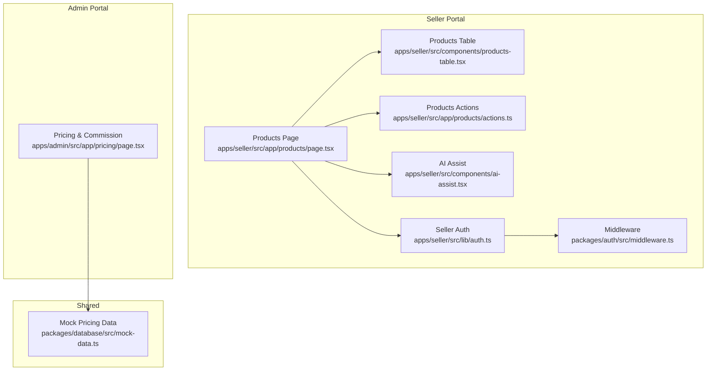

**Diagram sources**
- [page.tsx:1-37](file://apps/seller/src/app/products/page.tsx#L1-L37)
- [actions.ts:1-200](file://apps/seller/src/app/products/actions.ts#L1-L200)
- [products-table.tsx:1-200](file://apps/seller/src/components/products-table.tsx#L1-L200)
- [ai-assist.tsx:1-200](file://apps/seller/src/components/ai-assist.tsx#L1-L200)
- [auth.ts:1-16](file://apps/seller/src/lib/auth.ts#L1-L16)
- [middleware.ts:1-37](file://packages/auth/src/middleware.ts#L1-L37)
- [page.tsx:1-84](file://apps/admin/src/app/pricing/page.tsx#L1-L84)
- [mock-data.ts:383-394](file://packages/database/src/mock-data.ts#L383-L394)

**Section sources**
- [page.tsx:1-37](file://apps/seller/src/app/products/page.tsx#L1-L37)
- [actions.ts:1-200](file://apps/seller/src/app/products/actions.ts#L1-L200)
- [products-table.tsx:1-200](file://apps/seller/src/components/products-table.tsx#L1-L200)
- [ai-assist.tsx:1-200](file://apps/seller/src/components/ai-assist.tsx#L1-L200)
- [auth.ts:1-16](file://apps/seller/src/lib/auth.ts#L1-L16)
- [middleware.ts:1-37](file://packages/auth/src/middleware.ts#L1-L37)
- [page.tsx:1-84](file://apps/admin/src/app/pricing/page.tsx#L1-L84)
- [mock-data.ts:383-394](file://packages/database/src/mock-data.ts#L383-L394)

## Core Components
- Product Listing Page: Fetches and renders product rows with availability, price, currency, listing health, and issue counts. It also integrates AI Assist for suggestions.
- Products Table: Provides a reusable table UI for product listings, sorting, and row-level actions.
- Actions Module: Defines server actions for product updates and bulk operations (placeholder in current snapshot).
- AI Assist: Offers AI-powered suggestions for product creation and optimization.
- Authentication and Middleware: Enforce role-based access for seller users and public paths for anonymous access.

Key implementation references:
- Product listing query and row mapping: [page.tsx:12-37](file://apps/seller/src/app/products/page.tsx#L12-L37)
- Products table component: [products-table.tsx:1-200](file://apps/seller/src/components/products-table.tsx#L1-L200)
- AI Assist integration: [ai-assist.tsx:1-200](file://apps/seller/src/components/ai-assist.tsx#L1-L200)
- Seller session enforcement: [auth.ts:5-16](file://apps/seller/src/lib/auth.ts#L5-L16)
- Middleware role mapping and public paths: [middleware.ts:7-29](file://packages/auth/src/middleware.ts#L7-L29)

**Section sources**
- [page.tsx:9-37](file://apps/seller/src/app/products/page.tsx#L9-L37)
- [products-table.tsx:1-200](file://apps/seller/src/components/products-table.tsx#L1-L200)
- [ai-assist.tsx:1-200](file://apps/seller/src/components/ai-assist.tsx#L1-L200)
- [auth.ts:5-16](file://apps/seller/src/lib/auth.ts#L5-L16)
- [middleware.ts:31-37](file://packages/auth/src/middleware.ts#L31-L37)

## Architecture Overview
The Seller Portal’s product management follows a Next.js App Router architecture with server-side rendering and server actions. The product listing page queries the database for product records filtered by seller and non-deleted status, then maps them into a tabular representation. Actions are executed via server actions to update product attributes. Authentication middleware ensures only authorized seller users can access protected routes.

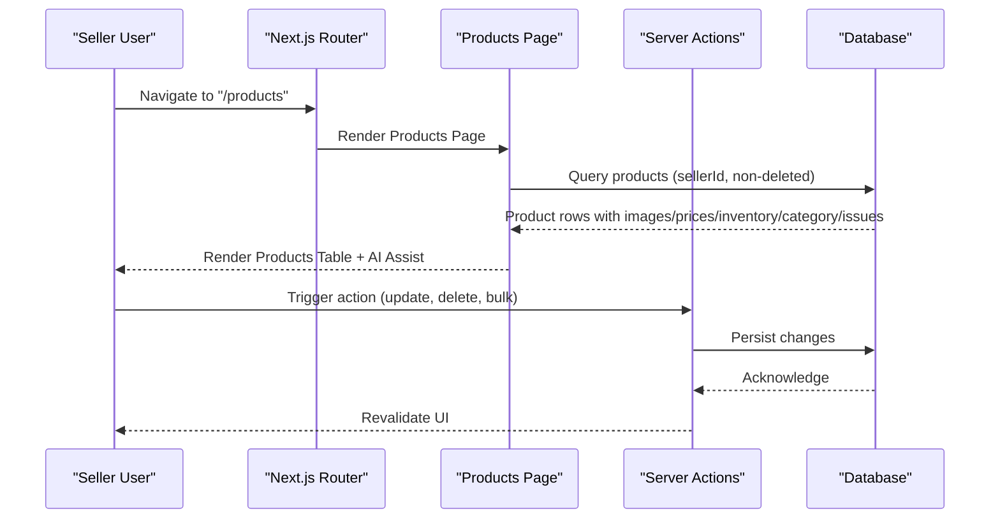

**Diagram sources**
- [page.tsx:9-37](file://apps/seller/src/app/products/page.tsx#L9-L37)
- [actions.ts:1-200](file://apps/seller/src/app/products/actions.ts#L1-L200)
- [auth.ts:5-16](file://apps/seller/src/lib/auth.ts#L5-L16)
- [middleware.ts:31-37](file://packages/auth/src/middleware.ts#L31-L37)

## Detailed Component Analysis

### Product Listing Interface
The product listing page aggregates product data including images, active prices, inventory quantities, categories, and unresolved issues. It computes derived metrics such as available stock and displays listing health and issue counts.

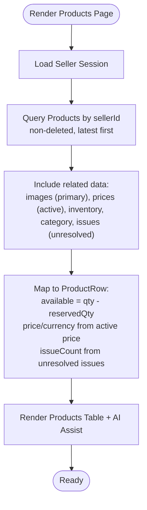

**Diagram sources**
- [page.tsx:9-37](file://apps/seller/src/app/products/page.tsx#L9-L37)

**Section sources**
- [page.tsx:9-37](file://apps/seller/src/app/products/page.tsx#L9-L37)

### Inventory Control Mechanisms
Inventory data is included in the product listing query and exposed via the Products Table. The available quantity is computed as total quantity minus reserved quantity. The table supports sorting and filtering, enabling efficient inventory oversight.

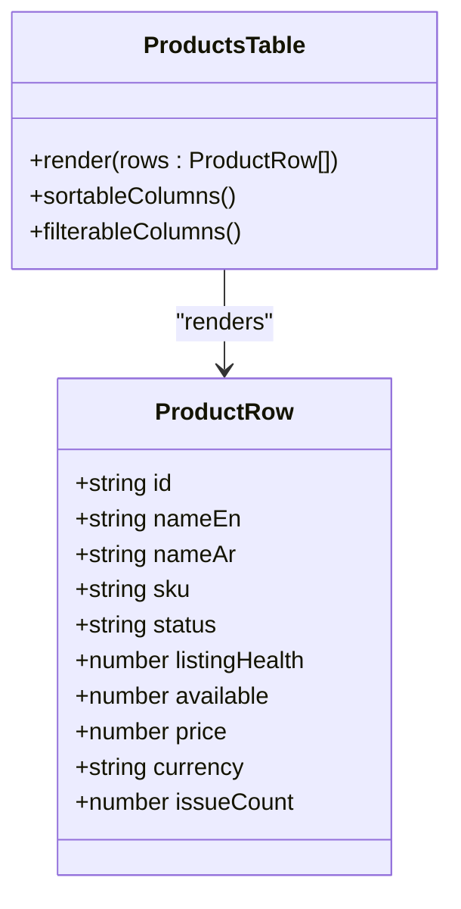

**Diagram sources**
- [page.tsx:24-37](file://apps/seller/src/app/products/page.tsx#L24-L37)
- [products-table.tsx:1-200](file://apps/seller/src/components/products-table.tsx#L1-L200)

**Section sources**
- [page.tsx:12-37](file://apps/seller/src/app/products/page.tsx#L12-L37)
- [products-table.tsx:1-200](file://apps/seller/src/components/products-table.tsx#L1-L200)

### Pricing Management Features
Pricing management is surfaced in the Admin Portal under “Pricing & Commission,” which demonstrates margin computation, bulk pricing tiers, commission rules, and contract pricing. While the seller product page currently focuses on listing and inventory, the admin pricing center provides the conceptual framework for pricing policies that influence seller product pricing.

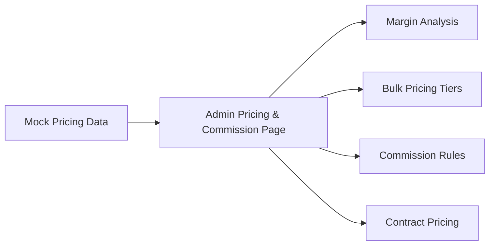

**Diagram sources**
- [page.tsx:1-84](file://apps/admin/src/app/pricing/page.tsx#L1-L84)
- [mock-data.ts:383-394](file://packages/database/src/mock-data.ts#L383-L394)
- [MODULE_10_PRICING_COMMISSION_NOTES.md:18-42](file://MODULE_10_PRICING_COMMISSION_NOTES.md#L18-L42)

**Section sources**
- [page.tsx:1-84](file://apps/admin/src/app/pricing/page.tsx#L1-L84)
- [mock-data.ts:383-394](file://packages/database/src/mock-data.ts#L383-L394)
- [MODULE_10_PRICING_COMMISSION_NOTES.md:18-42](file://MODULE_10_PRICING_COMMISSION_NOTES.md#L18-L42)

### Product Analytics Dashboard
The Seller Portal includes an analytics page under the analytics route. While detailed metrics are not implemented in the current snapshot, the analytics page serves as the designated location for sales performance, inventory turnover, and market positioning metrics.

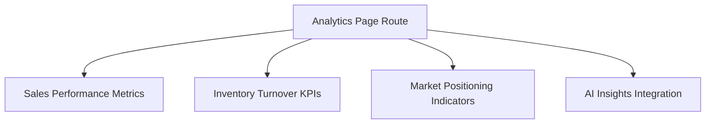

**Diagram sources**
- [page.tsx:1-200](file://apps/seller/src/app/analytics/page.tsx#L1-L200)

**Section sources**
- [page.tsx:1-200](file://apps/seller/src/app/analytics/page.tsx#L1-L200)

### AI-Powered Product Suggestions and Optimization Recommendations
The AI Assist component is integrated into the product listing page to provide AI-driven suggestions for product creation and optimization. This enables sellers to enhance product listings and improve performance.

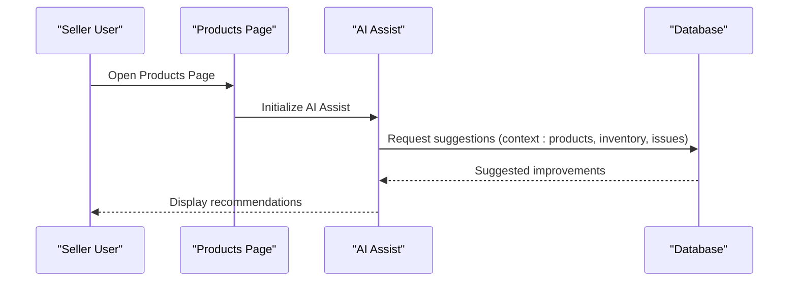

**Diagram sources**
- [page.tsx:6-7](file://apps/seller/src/app/products/page.tsx#L6-L7)
- [ai-assist.tsx:1-200](file://apps/seller/src/components/ai-assist.tsx#L1-L200)

**Section sources**
- [page.tsx:6-7](file://apps/seller/src/app/products/page.tsx#L6-L7)
- [ai-assist.tsx:1-200](file://apps/seller/src/components/ai-assist.tsx#L1-L200)

### Bulk Product Operations, Import/Export, and Product Categorization
Bulk operations and import/export are not implemented in the current snapshot. The actions module is present but lacks concrete server actions for bulk updates or data exchange. Product categorization is included in the product listing query via category selection.

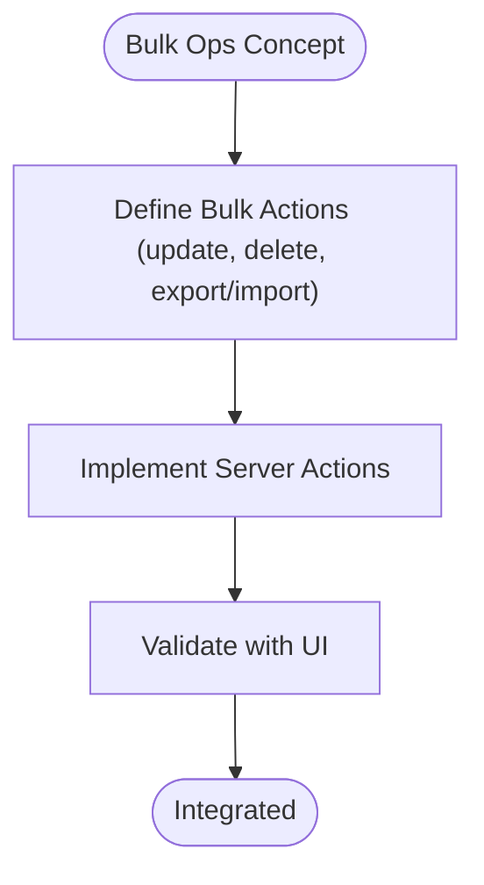

**Diagram sources**
- [actions.ts:1-200](file://apps/seller/src/app/products/actions.ts#L1-L200)
- [page.tsx:12-22](file://apps/seller/src/app/products/page.tsx#L12-L22)

**Section sources**
- [actions.ts:1-200](file://apps/seller/src/app/products/actions.ts#L1-L200)
- [page.tsx:12-22](file://apps/seller/src/app/products/page.tsx#L12-L22)

### Inventory Tracking Workflows, Stock Alerts, and Reorder Point Management
Stock alerting and reorder point management are not implemented in the current snapshot. The product listing exposes available inventory, but alerting and reorder logic are not present in the provided files.

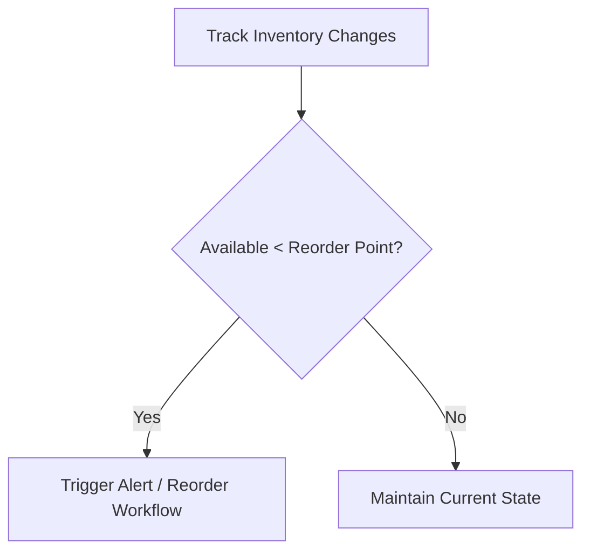

[No sources needed since this diagram shows conceptual workflow, not actual code structure]

### Product Search Optimization, Visibility Controls, and Performance Analytics
Search optimization and visibility controls are not implemented in the current snapshot. The analytics page is present as the destination for performance analytics.

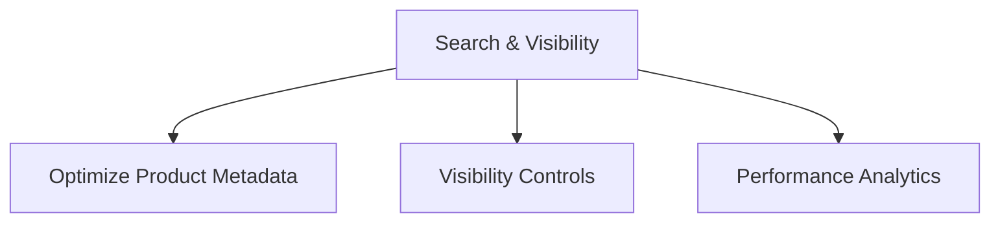

[No sources needed since this diagram shows conceptual workflow, not actual code structure]

### Product Lifecycle Management (Creation to Deactivation)
Lifecycle management from creation to deactivation is not implemented in the current snapshot. The product listing filters out deleted products, indicating a soft-delete pattern, but creation and deactivation flows are not present in the provided files.

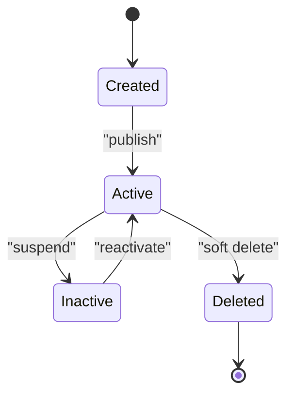

[No sources needed since this diagram shows conceptual workflow, not actual code structure]

## Dependency Analysis
The product listing depends on:
- Authentication and middleware for role-based access.
- Database queries for product data, images, prices, inventory, categories, and unresolved issues.
- UI components for rendering and interaction.

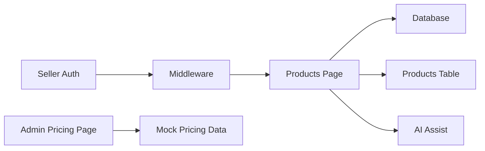

**Diagram sources**
- [auth.ts:5-16](file://apps/seller/src/lib/auth.ts#L5-L16)
- [middleware.ts:31-37](file://packages/auth/src/middleware.ts#L31-L37)
- [page.tsx:9-37](file://apps/seller/src/app/products/page.tsx#L9-L37)
- [products-table.tsx:1-200](file://apps/seller/src/components/products-table.tsx#L1-L200)
- [ai-assist.tsx:1-200](file://apps/seller/src/components/ai-assist.tsx#L1-L200)
- [page.tsx:1-84](file://apps/admin/src/app/pricing/page.tsx#L1-L84)
- [mock-data.ts:383-394](file://packages/database/src/mock-data.ts#L383-L394)

**Section sources**
- [auth.ts:5-16](file://apps/seller/src/lib/auth.ts#L5-L16)
- [middleware.ts:31-37](file://packages/auth/src/middleware.ts#L31-L37)
- [page.tsx:9-37](file://apps/seller/src/app/products/page.tsx#L9-L37)
- [products-table.tsx:1-200](file://apps/seller/src/components/products-table.tsx#L1-L200)
- [ai-assist.tsx:1-200](file://apps/seller/src/components/ai-assist.tsx#L1-L200)
- [page.tsx:1-84](file://apps/admin/src/app/pricing/page.tsx#L1-L84)
- [mock-data.ts:383-394](file://packages/database/src/mock-data.ts#L383-L394)

## Performance Considerations
- Database query optimization: The listing query includes multiple includes; consider pagination and selective field loading to reduce payload size.
- Rendering efficiency: Memoize derived values (e.g., available stock) and leverage client-side sorting/filtering for large datasets.
- Network requests: Batch operations and avoid redundant re-fetches after updates.

[No sources needed since this section provides general guidance]

## Troubleshooting Guide
- Access denied: Ensure the user has a valid seller session and the correct role. Verify middleware and auth checks.
- Empty product list: Confirm the seller ID filter and non-deleted status in the query.
- Missing inventory/pricing: Validate that related records exist and are marked active.

**Section sources**
- [auth.ts:5-16](file://apps/seller/src/lib/auth.ts#L5-L16)
- [middleware.ts:31-37](file://packages/auth/src/middleware.ts#L31-L37)
- [page.tsx:12-22](file://apps/seller/src/app/products/page.tsx#L12-L22)

## Conclusion
The Seller Portal’s Product Management system currently provides a robust product listing interface with inventory and pricing summaries, AI assistance, and foundational authentication and routing. Pricing management concepts are demonstrated in the Admin Portal. Areas such as bulk operations, import/export, inventory alerts, reorder points, search optimization, visibility controls, and lifecycle management are not implemented in the current snapshot and represent opportunities for future development aligned with the existing architecture.

## Appendices
- Pricing & Commission concepts and mock data are documented in the pricing module notes and mock data file.

**Section sources**
- [MODULE_10_PRICING_COMMISSION_NOTES.md:18-42](file://MODULE_10_PRICING_COMMISSION_NOTES.md#L18-L42)
- [mock-data.ts:383-394](file://packages/database/src/mock-data.ts#L383-L394)