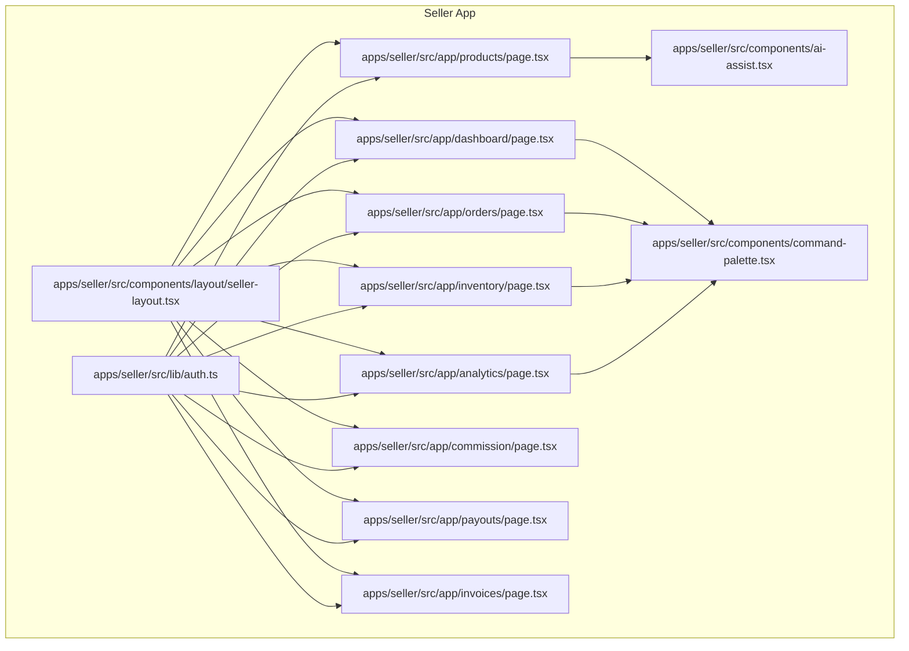
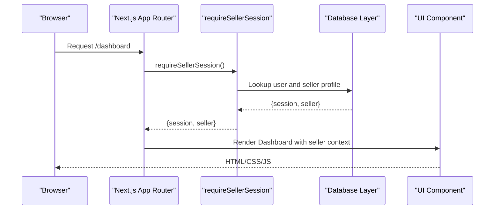
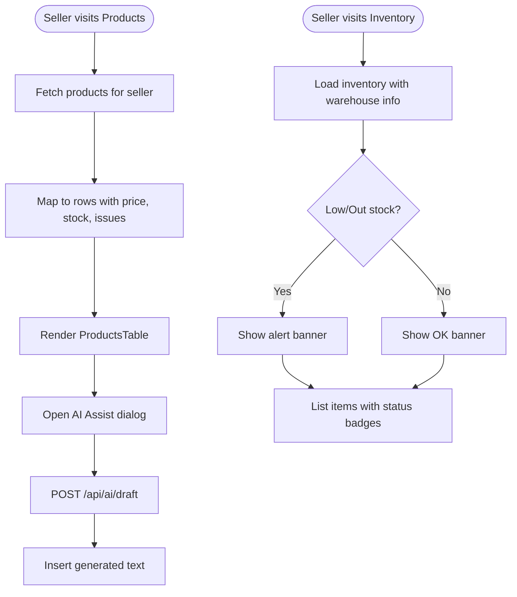
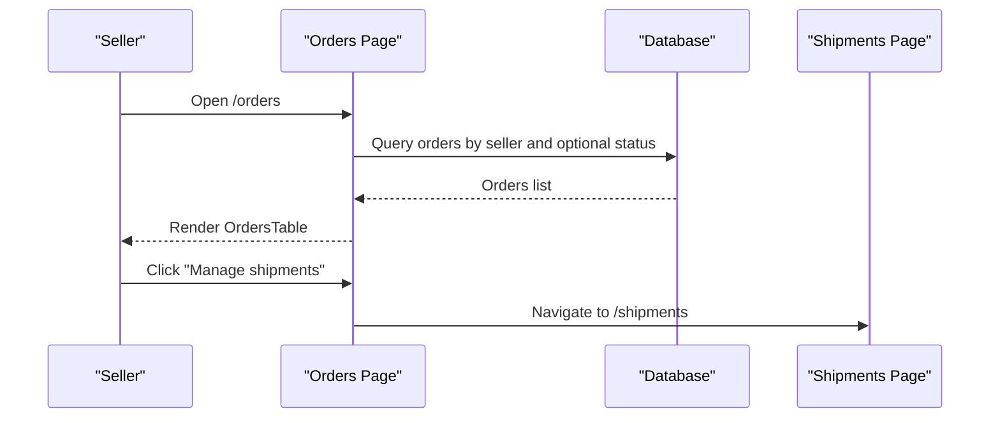
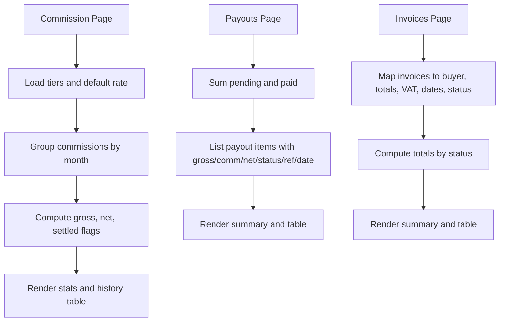
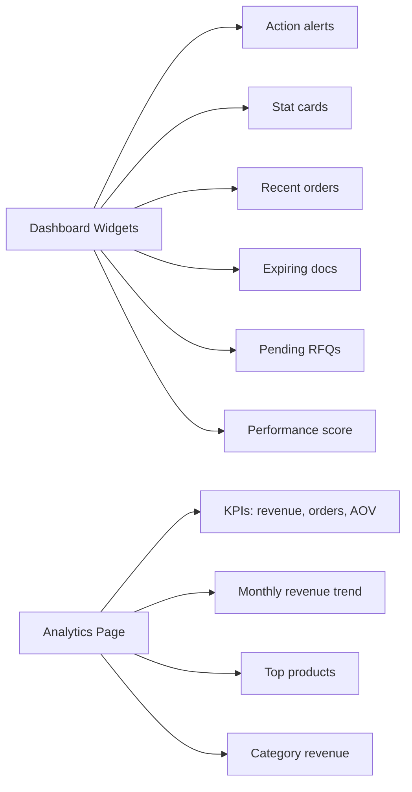
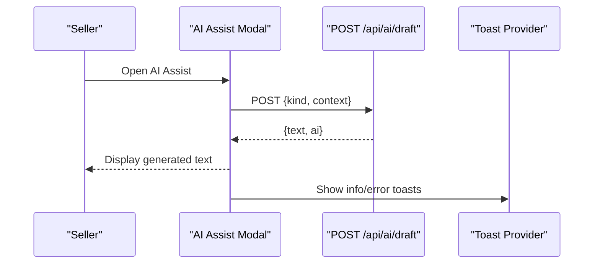
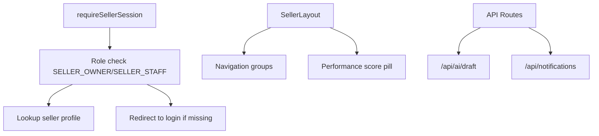
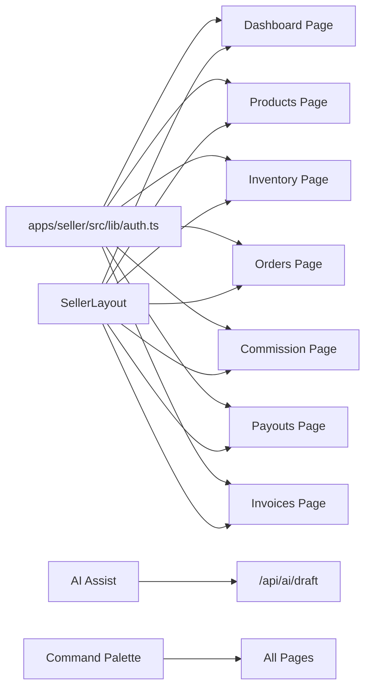

# Seller Portal

<cite>
**Referenced Files in This Document**
- [apps/seller/src/app/page.tsx](file://apps/seller/src/app/page.tsx)
- [apps/seller/src/app/layout.tsx](file://apps/seller/src/app/layout.tsx)
- [apps/seller/src/components/layout/seller-layout.tsx](file://apps/seller/src/components/layout/seller-layout.tsx)
- [apps/seller/src/app/dashboard/page.tsx](file://apps/seller/src/app/dashboard/page.tsx)
- [apps/seller/src/app/analytics/page.tsx](file://apps/seller/src/app/analytics/page.tsx)
- [apps/seller/src/app/products/page.tsx](file://apps/seller/src/app/products/page.tsx)
- [apps/seller/src/app/inventory/page.tsx](file://apps/seller/src/app/inventory/page.tsx)
- [apps/seller/src/app/orders/page.tsx](file://apps/seller/src/app/orders/page.tsx)
- [apps/seller/src/components/ai-assist.tsx](file://apps/seller/src/components/ai-assist.tsx)
- [apps/seller/src/components/command-palette.tsx](file://apps/seller/src/components/command-palette.tsx)
- [apps/seller/src/app/api/ai/draft/route.ts](file://apps/seller/src/app/api/ai/draft/route.ts)
- [apps/seller/src/app/api/notifications/route.ts](file://apps/seller/src/app/api/notifications/route.ts)
- [apps/seller/src/lib/auth.ts](file://apps/seller/src/lib/auth.ts)
- [apps/seller/src/app/commission/page.tsx](file://apps/seller/src/app/commission/page.tsx)
- [apps/seller/src/app/payouts/page.tsx](file://apps/seller/src/app/payouts/page.tsx)
- [apps/seller/src/app/invoices/page.tsx](file://apps/seller/src/app/invoices/page.tsx)
</cite>

## Table of Contents
1. [Introduction](#introduction)
2. [Project Structure](#project-structure)
3. [Core Components](#core-components)
4. [Architecture Overview](#architecture-overview)
5. [Detailed Component Analysis](#detailed-component-analysis)
6. [Dependency Analysis](#dependency-analysis)
7. [Performance Considerations](#performance-considerations)
8. [Troubleshooting Guide](#troubleshooting-guide)
9. [Conclusion](#conclusion)
10. [Appendices](#appendices)

## Introduction
This document describes the Seller Portal’s supplier management and business operations capabilities. It covers product management (inventory control, pricing, analytics), order processing (fulfillment, returns, shipment tracking), financial management (commission tracking, payouts, invoicing), performance analytics and market intelligence, AI assistance and command palette, operational efficiency features, onboarding and compliance, and integration patterns with the central marketplace and administrative systems.

## Project Structure
The Seller Portal is a Next.js application under apps/seller. It follows a feature-based structure with:
- Pages under apps/seller/src/app/<feature>/page.tsx
- Shared UI components under apps/seller/src/components/*
- Authentication utilities under apps/seller/src/lib/*
- API routes under apps/seller/src/app/api/*

**Diagram sources**
- [apps/seller/src/components/layout/seller-layout.tsx:1-298](file://apps/seller/src/components/layout/seller-layout.tsx#L1-L298)
- [apps/seller/src/app/dashboard/page.tsx:1-160](file://apps/seller/src/app/dashboard/page.tsx#L1-L160)
- [apps/seller/src/app/analytics/page.tsx:1-156](file://apps/seller/src/app/analytics/page.tsx#L1-L156)
- [apps/seller/src/app/products/page.tsx:1-60](file://apps/seller/src/app/products/page.tsx#L1-L60)
- [apps/seller/src/app/inventory/page.tsx:1-88](file://apps/seller/src/app/inventory/page.tsx#L1-L88)
- [apps/seller/src/app/orders/page.tsx:1-77](file://apps/seller/src/app/orders/page.tsx#L1-L77)
- [apps/seller/src/app/commission/page.tsx:1-138](file://apps/seller/src/app/commission/page.tsx#L1-L138)
- [apps/seller/src/app/payouts/page.tsx:1-88](file://apps/seller/src/app/payouts/page.tsx#L1-L88)
- [apps/seller/src/app/invoices/page.tsx:1-133](file://apps/seller/src/app/invoices/page.tsx#L1-L133)
- [apps/seller/src/components/ai-assist.tsx:1-110](file://apps/seller/src/components/ai-assist.tsx#L1-L110)
- [apps/seller/src/components/command-palette.tsx:1-143](file://apps/seller/src/components/command-palette.tsx#L1-L143)
- [apps/seller/src/lib/auth.ts:1-17](file://apps/seller/src/lib/auth.ts#L1-L17)

**Section sources**
- [apps/seller/src/app/page.tsx:1-6](file://apps/seller/src/app/page.tsx#L1-L6)
- [apps/seller/src/app/layout.tsx:1-29](file://apps/seller/src/app/layout.tsx#L1-L29)
- [apps/seller/src/components/layout/seller-layout.tsx:1-298](file://apps/seller/src/components/layout/seller-layout.tsx#L1-L298)

## Core Components
- Global layout and navigation: Provides the sidebar, top bar, theme toggle, notifications, and command palette integration.
- Dashboard: Aggregates key metrics, recent orders, compliance and inventory alerts, and onboarding checklist.
- Analytics: Computes KPIs, revenue trends, top products, and category breakdowns.
- Product Catalog: Lists products, integrates AI assistance for listings, and supports bulk upload.
- Inventory: Displays stock levels, low/out-of-stock warnings, and warehouse locations.
- Orders: Filters by status, saved views, and links to shipment management.
- Finance: Commission rates and history, payouts summary and details, tax invoices with statuses.
- AI Assist: Generates RFQ replies and listing copy via API.
- Command Palette: Fast navigation and actions across the portal.

**Section sources**
- [apps/seller/src/components/layout/seller-layout.tsx:22-77](file://apps/seller/src/components/layout/seller-layout.tsx#L22-L77)
- [apps/seller/src/app/dashboard/page.tsx:13-160](file://apps/seller/src/app/dashboard/page.tsx#L13-L160)
- [apps/seller/src/app/analytics/page.tsx:11-156](file://apps/seller/src/app/analytics/page.tsx#L11-L156)
- [apps/seller/src/app/products/page.tsx:9-60](file://apps/seller/src/app/products/page.tsx#L9-L60)
- [apps/seller/src/app/inventory/page.tsx:7-88](file://apps/seller/src/app/inventory/page.tsx#L7-L88)
- [apps/seller/src/app/orders/page.tsx:20-77](file://apps/seller/src/app/orders/page.tsx#L20-L77)
- [apps/seller/src/app/commission/page.tsx:16-138](file://apps/seller/src/app/commission/page.tsx#L16-L138)
- [apps/seller/src/app/payouts/page.tsx:8-88](file://apps/seller/src/app/payouts/page.tsx#L8-L88)
- [apps/seller/src/app/invoices/page.tsx:11-133](file://apps/seller/src/app/invoices/page.tsx#L11-L133)
- [apps/seller/src/components/ai-assist.tsx:7-110](file://apps/seller/src/components/ai-assist.tsx#L7-L110)
- [apps/seller/src/components/command-palette.tsx:35-143](file://apps/seller/src/components/command-palette.tsx#L35-L143)

## Architecture Overview
The Seller Portal enforces role-based access, delegates server-side rendering to pages, and uses shared components for layout and UI. API routes handle AI generation and notifications. Authentication guards ensure only authorized sellers can access protected pages.

**Diagram sources**
- [apps/seller/src/lib/auth.ts:5-16](file://apps/seller/src/lib/auth.ts#L5-L16)
- [apps/seller/src/app/dashboard/page.tsx:13-16](file://apps/seller/src/app/dashboard/page.tsx#L13-L16)
- [apps/seller/src/components/layout/seller-layout.tsx:95-156](file://apps/seller/src/components/layout/seller-layout.tsx#L95-L156)

## Detailed Component Analysis

### Product Management System
- Product listing page queries products per seller, includes images, active prices, inventory, and unresolved issues. It renders a ProductsTable and integrates AI Assist for listing copy.
- Inventory page aggregates stock by warehouse, flags low/out-of-stock items, and displays availability and reorder points.
- Analytics page computes total revenue, monthly trend, top products, and category distribution to inform pricing and inventory decisions.

**Diagram sources**
- [apps/seller/src/app/products/page.tsx:12-40](file://apps/seller/src/app/products/page.tsx#L12-L40)
- [apps/seller/src/app/inventory/page.tsx:9-84](file://apps/seller/src/app/inventory/page.tsx#L9-L84)
- [apps/seller/src/app/analytics/page.tsx:14-58](file://apps/seller/src/app/analytics/page.tsx#L14-L58)
- [apps/seller/src/components/ai-assist.tsx:27-39](file://apps/seller/src/components/ai-assist.tsx#L27-L39)
- [apps/seller/src/app/api/ai/draft/route.ts:5-20](file://apps/seller/src/app/api/ai/draft/route.ts#L5-L20)

**Section sources**
- [apps/seller/src/app/products/page.tsx:9-60](file://apps/seller/src/app/products/page.tsx#L9-L60)
- [apps/seller/src/app/inventory/page.tsx:7-88](file://apps/seller/src/app/inventory/page.tsx#L7-L88)
- [apps/seller/src/app/analytics/page.tsx:11-156](file://apps/seller/src/app/analytics/page.tsx#L11-L156)
- [apps/seller/src/components/ai-assist.tsx:7-110](file://apps/seller/src/components/ai-assist.tsx#L7-L110)
- [apps/seller/src/app/api/ai/draft/route.ts:1-21](file://apps/seller/src/app/api/ai/draft/route.ts#L1-L21)

### Order Processing Workflow
- Orders page filters by status, exposes saved views, and links to shipment management.
- The layout integrates a command palette for quick navigation to orders and related features.

**Diagram sources**
- [apps/seller/src/app/orders/page.tsx:20-77](file://apps/seller/src/app/orders/page.tsx#L20-L77)
- [apps/seller/src/components/command-palette.tsx:13-33](file://apps/seller/src/components/command-palette.tsx#L13-L33)

**Section sources**
- [apps/seller/src/app/orders/page.tsx:1-77](file://apps/seller/src/app/orders/page.tsx#L1-L77)
- [apps/seller/src/components/command-palette.tsx:35-143](file://apps/seller/src/components/command-palette.tsx#L35-L143)

### Financial Management
- Commission page shows current rate, YTD paid and net earnings, tier benefits, and monthly commission history with gross, commission, and net calculations.
- Payouts page summarizes pending and total paid amounts, lists periods, gross, commission, net, status, reference, and processed date.
- Invoices page lists tax invoices, buyer, totals, VAT, issuance and due dates, and status (paid/pending/overdue), with download action.

**Diagram sources**
- [apps/seller/src/app/commission/page.tsx:16-138](file://apps/seller/src/app/commission/page.tsx#L16-L138)
- [apps/seller/src/app/payouts/page.tsx:8-88](file://apps/seller/src/app/payouts/page.tsx#L8-L88)
- [apps/seller/src/app/invoices/page.tsx:11-133](file://apps/seller/src/app/invoices/page.tsx#L11-L133)

**Section sources**
- [apps/seller/src/app/commission/page.tsx:16-138](file://apps/seller/src/app/commission/page.tsx#L16-L138)
- [apps/seller/src/app/payouts/page.tsx:8-88](file://apps/seller/src/app/payouts/page.tsx#L8-L88)
- [apps/seller/src/app/invoices/page.tsx:11-133](file://apps/seller/src/app/invoices/page.tsx#L11-L133)

### Performance Analytics and Market Intelligence
- Dashboard presents account health, recent orders, and quick-access widgets for expiring documents and pending RFQs.
- Analytics page computes KPIs, revenue trend, top products, and category revenue distribution to guide business insights.

**Diagram sources**
- [apps/seller/src/app/dashboard/page.tsx:13-160](file://apps/seller/src/app/dashboard/page.tsx#L13-L160)
- [apps/seller/src/app/analytics/page.tsx:11-156](file://apps/seller/src/app/analytics/page.tsx#L11-L156)

**Section sources**
- [apps/seller/src/app/dashboard/page.tsx:13-160](file://apps/seller/src/app/dashboard/page.tsx#L13-L160)
- [apps/seller/src/app/analytics/page.tsx:11-156](file://apps/seller/src/app/analytics/page.tsx#L11-L156)

### AI Assistance Tools and Command Palette
- AI Assist opens a modal to generate RFQ replies or listing copy via POST /api/ai/draft, with copy-to-clipboard and regenerate actions.
- Command Palette provides keyboard-driven navigation across pages and actions, including AI assist and RFQ inbox.

**Diagram sources**
- [apps/seller/src/components/ai-assist.tsx:27-46](file://apps/seller/src/components/ai-assist.tsx#L27-L46)
- [apps/seller/src/app/api/ai/draft/route.ts:5-20](file://apps/seller/src/app/api/ai/draft/route.ts#L5-L20)

**Section sources**
- [apps/seller/src/components/ai-assist.tsx:7-110](file://apps/seller/src/components/ai-assist.tsx#L7-L110)
- [apps/seller/src/components/command-palette.tsx:35-143](file://apps/seller/src/components/command-palette.tsx#L35-L143)
- [apps/seller/src/app/api/ai/draft/route.ts:1-21](file://apps/seller/src/app/api/ai/draft/route.ts#L1-L21)

### Operational Efficiency Features
- Saved Views: Persist filters for orders to streamline repeated tasks.
- Notifications API: Retrieve and mark notifications as read.
- Command Palette: Keyboard shortcuts and quick actions reduce mouse movement.

**Section sources**
- [apps/seller/src/app/orders/page.tsx:25-30](file://apps/seller/src/app/orders/page.tsx#L25-L30)
- [apps/seller/src/app/api/notifications/route.ts:5-33](file://apps/seller/src/app/api/notifications/route.ts#L5-L33)
- [apps/seller/src/components/command-palette.tsx:35-143](file://apps/seller/src/components/command-palette.tsx#L35-L143)

### Seller Onboarding and Compliance
- Documents center and compliance onboarding are accessible from the layout navigation.
- Dashboard highlights pending compliance documents and links to resolution.

**Section sources**
- [apps/seller/src/components/layout/seller-layout.tsx:64-69](file://apps/seller/src/components/layout/seller-layout.tsx#L64-L69)
- [apps/seller/src/app/dashboard/page.tsx:17-21](file://apps/seller/src/app/dashboard/page.tsx#L17-L21)

### Integration Patterns
- Authentication: requireSellerSession validates roles and seller profile.
- Layout: Centralized navigation and performance score integration.
- API Routes: AI draft generation and notifications endpoint.

**Diagram sources**
- [apps/seller/src/lib/auth.ts:5-16](file://apps/seller/src/lib/auth.ts#L5-L16)
- [apps/seller/src/components/layout/seller-layout.tsx:22-77](file://apps/seller/src/components/layout/seller-layout.tsx#L22-L77)
- [apps/seller/src/app/api/ai/draft/route.ts:5-20](file://apps/seller/src/app/api/ai/draft/route.ts#L5-L20)
- [apps/seller/src/app/api/notifications/route.ts:5-33](file://apps/seller/src/app/api/notifications/route.ts#L5-L33)

**Section sources**
- [apps/seller/src/lib/auth.ts:1-17](file://apps/seller/src/lib/auth.ts#L1-L17)
- [apps/seller/src/components/layout/seller-layout.tsx:1-298](file://apps/seller/src/components/layout/seller-layout.tsx#L1-L298)
- [apps/seller/src/app/api/ai/draft/route.ts:1-21](file://apps/seller/src/app/api/ai/draft/route.ts#L1-L21)
- [apps/seller/src/app/api/notifications/route.ts:1-33](file://apps/seller/src/app/api/notifications/route.ts#L1-L33)

## Dependency Analysis
- Pages depend on requireSellerSession for authentication and database helpers for data fetching.
- Components share common UI patterns (layout, tables, modals) and integrate with global providers (theme, notifications, toasts).
- API routes encapsulate backend logic for AI and notifications.

**Diagram sources**
- [apps/seller/src/lib/auth.ts:1-17](file://apps/seller/src/lib/auth.ts#L1-L17)
- [apps/seller/src/components/layout/seller-layout.tsx:1-298](file://apps/seller/src/components/layout/seller-layout.tsx#L1-L298)
- [apps/seller/src/components/ai-assist.tsx:1-110](file://apps/seller/src/components/ai-assist.tsx#L1-L110)
- [apps/seller/src/app/api/ai/draft/route.ts:1-21](file://apps/seller/src/app/api/ai/draft/route.ts#L1-L21)
- [apps/seller/src/components/command-palette.tsx:1-143](file://apps/seller/src/components/command-palette.tsx#L1-L143)

**Section sources**
- [apps/seller/src/lib/auth.ts:1-17](file://apps/seller/src/lib/auth.ts#L1-L17)
- [apps/seller/src/components/layout/seller-layout.tsx:1-298](file://apps/seller/src/components/layout/seller-layout.tsx#L1-L298)
- [apps/seller/src/components/ai-assist.tsx:1-110](file://apps/seller/src/components/ai-assist.tsx#L1-L110)
- [apps/seller/src/app/api/ai/draft/route.ts:1-21](file://apps/seller/src/app/api/ai/draft/route.ts#L1-L21)
- [apps/seller/src/components/command-palette.tsx:1-143](file://apps/seller/src/components/command-palette.tsx#L1-L143)

## Performance Considerations
- Use server-side rendering on pages to minimize client work and leverage database helpers for efficient queries.
- Batch reads for dashboard widgets to reduce round trips.
- Paginate inventory and order lists to keep tables responsive.
- Cache static assets and leverage browser caching for improved TTFB.

## Troubleshooting Guide
- Unauthorized access: ensure requireSellerSession redirects unauthenticated or non-authorized users to login.
- Notifications not updating: verify POST to notifications endpoint marks read correctly.
- AI draft errors: confirm API route accepts only allowed kinds and that environment keys are configured for AI provider.

**Section sources**
- [apps/seller/src/lib/auth.ts:5-16](file://apps/seller/src/lib/auth.ts#L5-L16)
- [apps/seller/src/app/api/notifications/route.ts:20-32](file://apps/seller/src/app/api/notifications/route.ts#L20-L32)
- [apps/seller/src/app/api/ai/draft/route.ts:14-16](file://apps/seller/src/app/api/ai/draft/route.ts#L14-L16)

## Conclusion
The Seller Portal consolidates supplier operations with a cohesive layout, robust analytics, AI-powered assistance, and streamlined financial reporting. Its modular structure and shared components enable rapid iteration while maintaining strong access controls and operational efficiency.

## Appendices
- Role-based access ensures only SELLER_OWNER and SELLER_STAFF can access the portal.
- Layout navigation groups align with supplier workflows: Overview, Catalog, Orders, RFQ/Quotes, Finance, Documents, Support.
- Command palette accelerates navigation and reduces cognitive load.