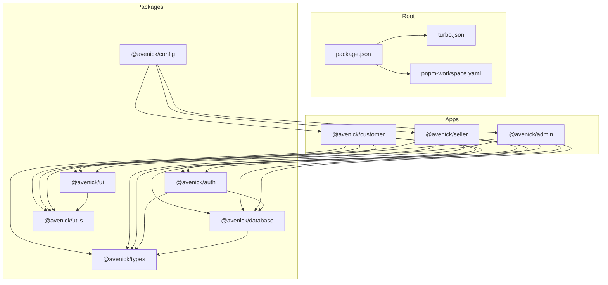
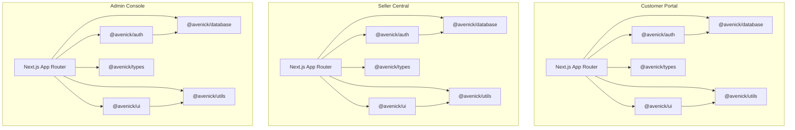
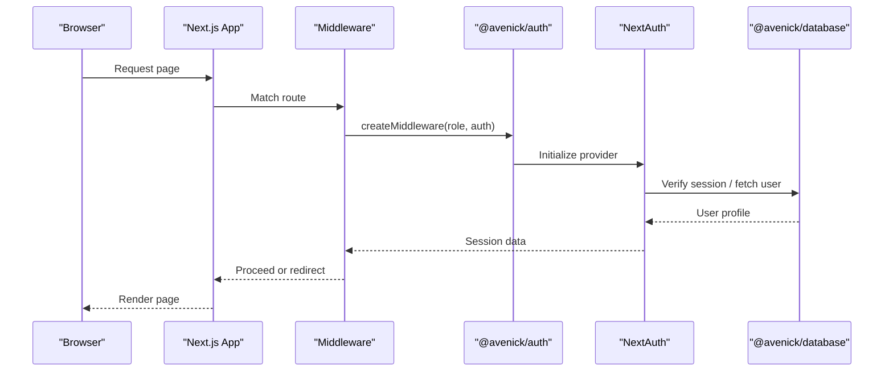
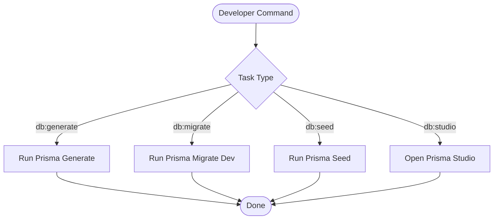
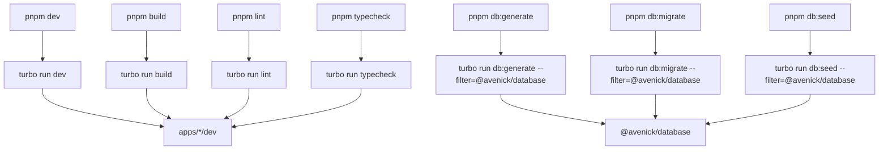
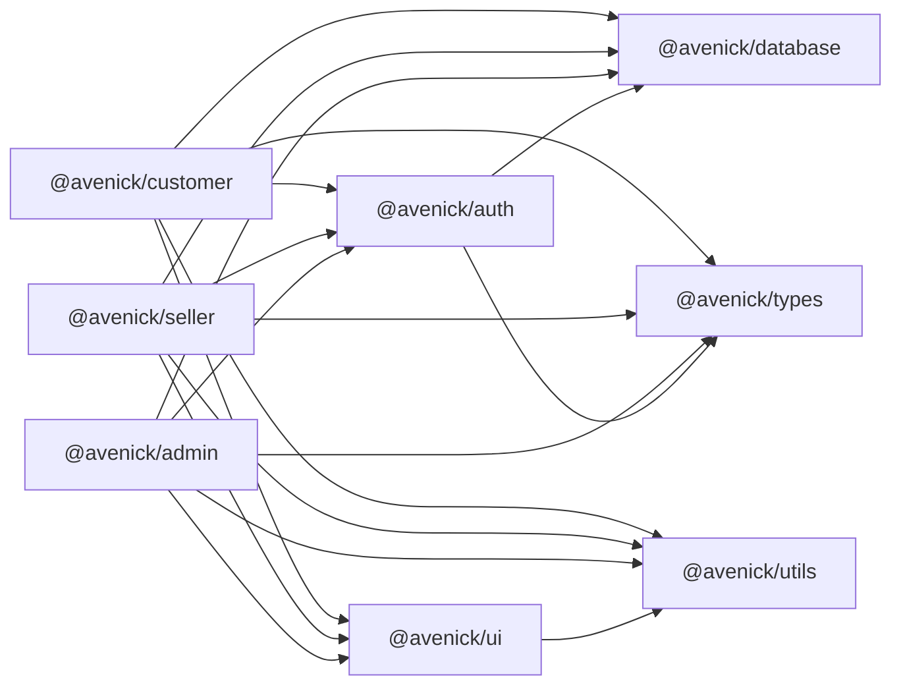

# Architecture Overview

<cite>
**Referenced Files in This Document**
- [package.json](file://package.json)
- [turbo.json](file://turbo.json)
- [pnpm-workspace.yaml](file://pnpm-workspace.yaml)
- [apps/admin/package.json](file://apps/admin/package.json)
- [apps/customer/package.json](file://apps/customer/package.json)
- [apps/seller/package.json](file://apps/seller/package.json)
- [packages/auth/package.json](file://packages/auth/package.json)
- [packages/database/package.json](file://packages/database/package.json)
- [packages/types/package.json](file://packages/types/package.json)
- [packages/ui/package.json](file://packages/ui/package.json)
- [packages/utils/package.json](file://packages/utils/package.json)
- [packages/config/package.json](file://packages/config/package.json)
- [apps/customer/src/lib/auth-instance.ts](file://apps/customer/src/lib/auth-instance.ts)
- [apps/admin/src/lib/auth-instance.ts](file://apps/admin/src/lib/auth-instance.ts)
- [apps/seller/src/lib/auth-instance.ts](file://apps/seller/src/lib/auth-instance.ts)
- [apps/customer/src/middleware.ts](file://apps/customer/src/middleware.ts)
- [apps/admin/src/middleware.ts](file://apps/admin/src/middleware.ts)
- [apps/seller/src/middleware.ts](file://apps/seller/src/middleware.ts)
</cite>

## Table of Contents
1. [Introduction](#introduction)
2. [Project Structure](#project-structure)
3. [Core Components](#core-components)
4. [Architecture Overview](#architecture-overview)
5. [Detailed Component Analysis](#detailed-component-analysis)
6. [Dependency Analysis](#dependency-analysis)
7. [Performance Considerations](#performance-considerations)
8. [Troubleshooting Guide](#troubleshooting-guide)
9. [Conclusion](#conclusion)

## Introduction
This document describes the Avenick Commerce platform architecture. It is a three-portal monorepo built with Next.js 14 App Router, orchestrated by Turborepo, and powered by a shared package ecosystem. The platform comprises:
- Customer Portal (B2C/B2B)
- Seller Central
- Admin Console

Each portal is a standalone Next.js application sharing common packages for authentication, database, UI components, types, utilities, and configuration. The system supports multi-tenant and role-based access control via a unified authentication layer and per-app middleware.

## Project Structure
The repository follows a classic monorepo layout:
- apps/: Three Next.js applications (customer, seller, admin)
- packages/: Shared libraries consumed by the apps
- Root orchestration via Turborepo and PNPM workspaces



**Diagram sources**
- [package.json:1-28](file://package.json#L1-L28)
- [turbo.json:1-69](file://turbo.json#L1-L69)
- [pnpm-workspace.yaml:1-14](file://pnpm-workspace.yaml#L1-L14)
- [apps/customer/package.json:1-51](file://apps/customer/package.json#L1-L51)
- [apps/seller/package.json:1-49](file://apps/seller/package.json#L1-L49)
- [apps/admin/package.json:1-49](file://apps/admin/package.json#L1-L49)
- [packages/auth/package.json:1-23](file://packages/auth/package.json#L1-L23)
- [packages/database/package.json:1-34](file://packages/database/package.json#L1-L34)
- [packages/types/package.json:1-18](file://packages/types/package.json#L1-L18)
- [packages/ui/package.json:1-45](file://packages/ui/package.json#L1-L45)
- [packages/utils/package.json:1-19](file://packages/utils/package.json#L1-L19)
- [packages/config/package.json:1-11](file://packages/config/package.json#L1-L11)

**Section sources**
- [package.json:1-28](file://package.json#L1-L28)
- [turbo.json:1-69](file://turbo.json#L1-L69)
- [pnpm-workspace.yaml:1-14](file://pnpm-workspace.yaml#L1-L14)

## Core Components
- Authentication Layer (@avenick/auth): Provides role-scoped auth instances and middleware factories used by each portal.
- Database Layer (@avenick/database): Prisma-based ORM client and seed/migration scripts.
- Types (@avenick/types): Shared Zod schemas and TypeScript types used across apps.
- UI (@avenick/ui): Reusable Radix-powered React components and global styles.
- Utilities (@avenick/utils): Shared helpers and constants.
- Configuration (@avenick/config): Base TypeScript, ESLint, and Tailwind configs shared by apps.

Key integration points:
- Each app depends on @avenick/auth, @avenick/database, @avenick/types, @avenick/ui, and @avenick/utils.
- Apps consume @avenick/config exports for consistent tooling configuration.
- Authentication is centralized via per-app auth instances and middleware.

**Section sources**
- [packages/auth/package.json:1-23](file://packages/auth/package.json#L1-L23)
- [packages/database/package.json:1-34](file://packages/database/package.json#L1-L34)
- [packages/types/package.json:1-18](file://packages/types/package.json#L1-L18)
- [packages/ui/package.json:1-45](file://packages/ui/package.json#L1-L45)
- [packages/utils/package.json:1-19](file://packages/utils/package.json#L1-L19)
- [packages/config/package.json:1-11](file://packages/config/package.json#L1-L11)
- [apps/customer/package.json:12-36](file://apps/customer/package.json#L12-L36)
- [apps/seller/package.json:12-35](file://apps/seller/package.json#L12-L35)
- [apps/admin/package.json:12-35](file://apps/admin/package.json#L12-L35)

## Architecture Overview
The system uses a role-based portal architecture:
- Customer Portal: B2C/B2B experiences, order/account management, product browsing, quotes, RFQs, and returns.
- Seller Central: Product catalog, orders, analytics, inventory, quotations, returns, payouts, and compliance.
- Admin Console: Governance, compliance, audit, CRM, finance, integrations, settings, and operational dashboards.

Inter-application communication is primarily through:
- Shared packages for cross-cutting concerns (auth, DB, types, UI, utils)
- API routes within each app exposing internal capabilities
- Middleware enforcing role-scoped access



**Diagram sources**
- [apps/customer/package.json:12-36](file://apps/customer/package.json#L12-L36)
- [apps/seller/package.json:12-35](file://apps/seller/package.json#L12-L35)
- [apps/admin/package.json:12-35](file://apps/admin/package.json#L12-L35)
- [packages/auth/package.json:10-16](file://packages/auth/package.json#L10-L16)
- [packages/database/package.json:22-25](file://packages/database/package.json#L22-L25)
- [packages/ui/package.json:9-32](file://packages/ui/package.json#L9-L32)
- [packages/utils/package.json:1-19](file://packages/utils/package.json#L1-L19)

## Detailed Component Analysis

### Authentication and Middleware
Each portal defines a role-scoped auth instance and a matching Next.js middleware that enforces protected routes.



**Diagram sources**
- [apps/customer/src/lib/auth-instance.ts:1-4](file://apps/customer/src/lib/auth-instance.ts#L1-L4)
- [apps/admin/src/lib/auth-instance.ts:1-4](file://apps/admin/src/lib/auth-instance.ts#L1-L4)
- [apps/seller/src/lib/auth-instance.ts:1-4](file://apps/seller/src/lib/auth-instance.ts#L1-L4)
- [apps/customer/src/middleware.ts:1-9](file://apps/customer/src/middleware.ts#L1-L9)
- [apps/admin/src/middleware.ts:1-9](file://apps/admin/src/middleware.ts#L1-L9)
- [apps/seller/src/middleware.ts:1-9](file://apps/seller/src/middleware.ts#L1-L9)
- [packages/auth/package.json:10-16](file://packages/auth/package.json#L10-L16)
- [packages/database/package.json:22-25](file://packages/database/package.json#L22-L25)

Implementation highlights:
- Per-app auth instances are created via a factory exported by @avenick/auth and bound to a role ("customer", "seller", "admin").
- Middleware uses the role-aware auth instance to enforce protected routes and redirects unauthenticated users.

**Section sources**
- [apps/customer/src/lib/auth-instance.ts:1-4](file://apps/customer/src/lib/auth-instance.ts#L1-L4)
- [apps/admin/src/lib/auth-instance.ts:1-4](file://apps/admin/src/lib/auth-instance.ts#L1-L4)
- [apps/seller/src/lib/auth-instance.ts:1-4](file://apps/seller/src/lib/auth-instance.ts#L1-L4)
- [apps/customer/src/middleware.ts:1-9](file://apps/customer/src/middleware.ts#L1-L9)
- [apps/admin/src/middleware.ts:1-9](file://apps/admin/src/middleware.ts#L1-L9)
- [apps/seller/src/middleware.ts:1-9](file://apps/seller/src/middleware.ts#L1-L9)
- [packages/auth/package.json:10-16](file://packages/auth/package.json#L10-L16)

### Database and Schema Management
The database package encapsulates Prisma client generation, migrations, and seeding. Scripts are exposed via the package.json scripts and invoked by Turborepo tasks.



**Diagram sources**
- [packages/database/package.json:11-21](file://packages/database/package.json#L11-L21)
- [turbo.json:41-53](file://turbo.json#L41-L53)

Operational notes:
- Post-install generation ensures Prisma client availability.
- Migration and seed commands are available for development and production workflows.
- Global environment variables are configured at the root for database connectivity and related services.

**Section sources**
- [packages/database/package.json:11-21](file://packages/database/package.json#L11-L21)
- [turbo.json:55-67](file://turbo.json#L55-L67)

### Shared UI and Utilities
The UI package exposes a curated set of Radix primitives and common components, plus global styles. Utilities provide shared helpers and styling utilities.

```mermaid
classDiagram
class UIExports {
"+index.ts"
"\"./globals.css\""
}
class UtilsExports {
"+index.ts"
}
class UI_Deps {
"@avenick/utils"
"@tanstack/react-table"
"date-fns"
"@radix-ui/*"
"lucide-react"
"react"
"tailwind-merge"
}
class Utils_Deps {
"date-fns"
"clsx"
"tailwind-merge"
}
UIExports --> UtilsExports : "consumes"
UI_Deps --> Utils_Deps : "depends on"
```

**Diagram sources**
- [packages/ui/package.json:5-8](file://packages/ui/package.json#L5-L8)
- [packages/ui/package.json:9-32](file://packages/ui/package.json#L9-L32)
- [packages/utils/package.json:5-7](file://packages/utils/package.json#L5-L7)
- [packages/utils/package.json:8-12](file://packages/utils/package.json#L8-L12)

**Section sources**
- [packages/ui/package.json:5-8](file://packages/ui/package.json#L5-L8)
- [packages/ui/package.json:9-32](file://packages/ui/package.json#L9-L32)
- [packages/utils/package.json:5-7](file://packages/utils/package.json#L5-L7)
- [packages/utils/package.json:8-12](file://packages/utils/package.json#L8-L12)

### Orchestration with Turborepo
Root scripts delegate to Turborepo tasks, enabling incremental builds, linting, type checking, and database operations across apps and packages.



**Diagram sources**
- [package.json:5-16](file://package.json#L5-L16)
- [turbo.json:4-54](file://turbo.json#L4-L54)

**Section sources**
- [package.json:5-16](file://package.json#L5-L16)
- [turbo.json:4-54](file://turbo.json#L4-L54)

## Dependency Analysis
The apps depend on shared packages, while the auth package depends on database and types. The UI package depends on utils.



**Diagram sources**
- [apps/customer/package.json:12-36](file://apps/customer/package.json#L12-L36)
- [apps/seller/package.json:12-35](file://apps/seller/package.json#L12-L35)
- [apps/admin/package.json:12-35](file://apps/admin/package.json#L12-L35)
- [packages/auth/package.json:10-16](file://packages/auth/package.json#L10-L16)
- [packages/ui/package.json:9-32](file://packages/ui/package.json#L9-L32)
- [packages/utils/package.json:8-12](file://packages/utils/package.json#L8-L12)

**Section sources**
- [apps/customer/package.json:12-36](file://apps/customer/package.json#L12-L36)
- [apps/seller/package.json:12-35](file://apps/seller/package.json#L12-L35)
- [apps/admin/package.json:12-35](file://apps/admin/package.json#L12-L35)
- [packages/auth/package.json:10-16](file://packages/auth/package.json#L10-L16)
- [packages/ui/package.json:9-32](file://packages/ui/package.json#L9-L32)
- [packages/utils/package.json:8-12](file://packages/utils/package.json#L8-L12)

## Performance Considerations
- Incremental builds: Turborepo caches outputs and runs tasks in parallel where possible.
- Workspace installs: PNPM workspaces reduce duplication and speed up installs.
- Database operations: Use Turborepo filtering to run DB tasks only on demand.
- Middleware overhead: Keep middleware matchers minimal to avoid unnecessary auth checks.

## Troubleshooting Guide
Common issues and resolutions:
- Authentication redirects loops: Verify role-specific auth instances and middleware matchers align with route patterns.
- Prisma client errors: Run database post-install or regenerate the client via db:generate.
- Environment variables: Ensure global env variables are present for database, auth, storage, cache, and search services.

**Section sources**
- [apps/customer/src/middleware.ts:6-8](file://apps/customer/src/middleware.ts#L6-L8)
- [apps/admin/src/middleware.ts:6-8](file://apps/admin/src/middleware.ts#L6-L8)
- [apps/seller/src/middleware.ts:6-8](file://apps/seller/src/middleware.ts#L6-L8)
- [packages/database/package.json:12-21](file://packages/database/package.json#L12-L21)
- [turbo.json:55-67](file://turbo.json#L55-L67)

## Conclusion
Avenick Commerce employs a clean, scalable three-portal architecture leveraging Next.js 14 App Router, Turborepo orchestration, and a cohesive shared package ecosystem. Role-scoped authentication and middleware ensure secure, tenant-aware access across portals, while shared packages promote consistency and maintainability. The modular design supports future growth and feature expansion across B2C/B2B, supplier, and administrative domains.