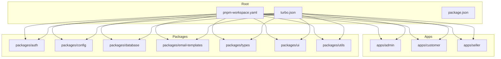
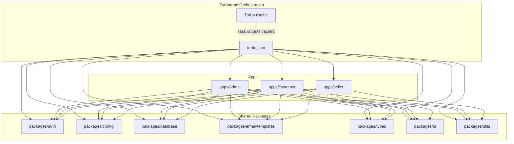
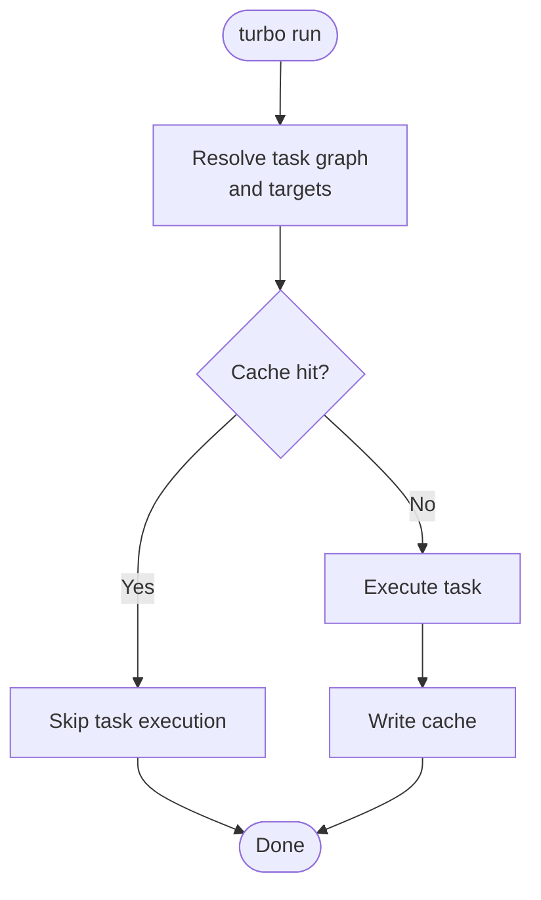
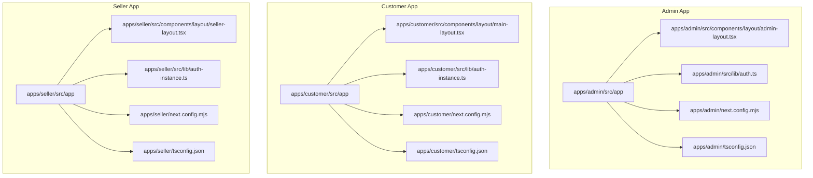
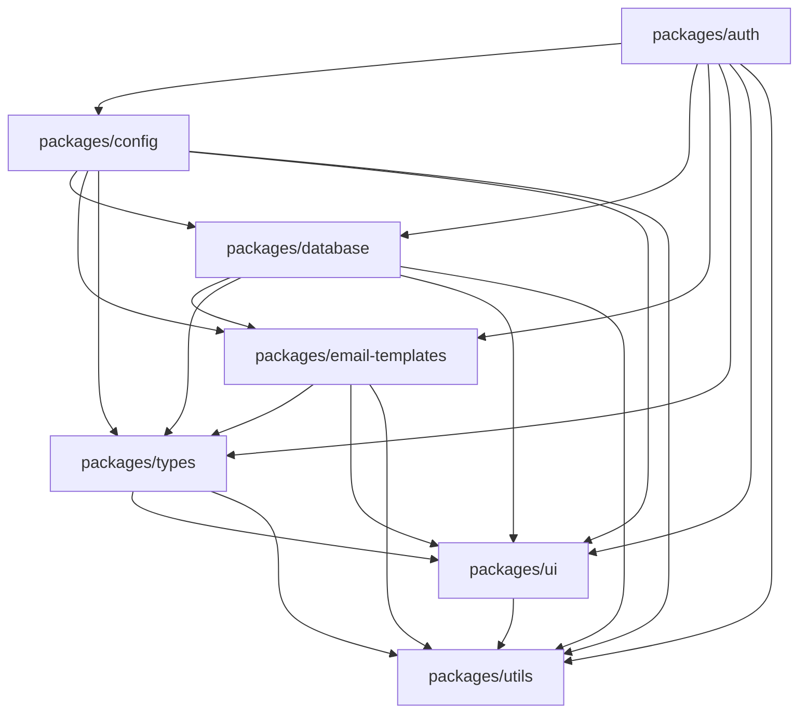
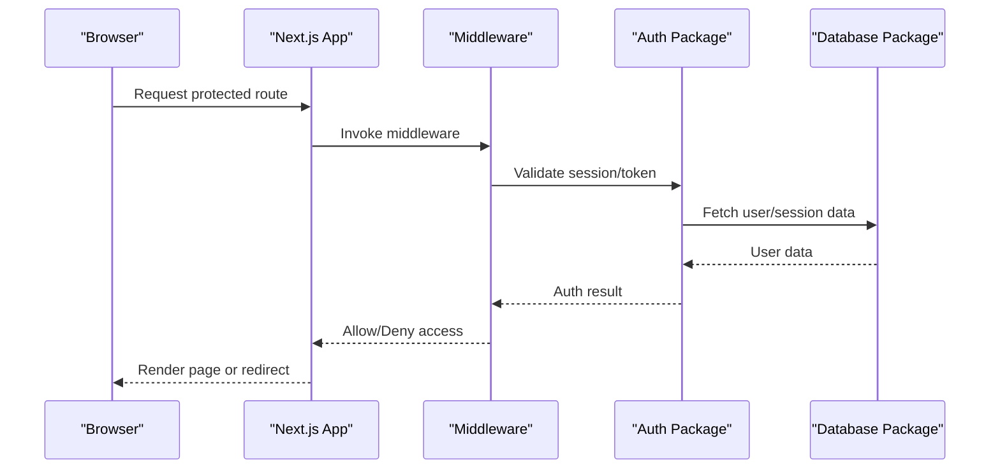
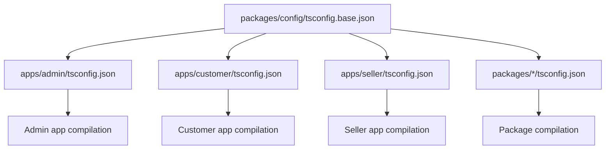
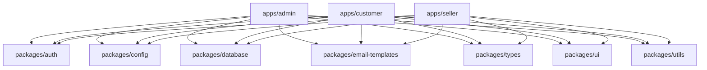

# Monorepo Structure & Turborepo Orchestration

<cite>
**Referenced Files in This Document**
- [turbo.json](file://turbo.json)
- [pnpm-workspace.yaml](file://pnpm-workspace.yaml)
- [package.json](file://package.json)
- [apps/admin/package.json](file://apps/admin/package.json)
- [apps/customer/package.json](file://apps/customer/package.json)
- [apps/seller/package.json](file://apps/seller/package.json)
- [packages/auth/package.json](file://packages/auth/package.json)
- [packages/config/package.json](file://packages/config/package.json)
- [packages/database/package.json](file://packages/database/package.json)
- [packages/email-templates/package.json](file://packages/email-templates/package.json)
- [packages/types/package.json](file://packages/types/package.json)
- [packages/ui/package.json](file://packages/ui/package.json)
- [packages/utils/package.json](file://packages/utils/package.json)
- [apps/admin/tsconfig.json](file://apps/admin/tsconfig.json)
- [apps/customer/tsconfig.json](file://apps/customer/tsconfig.json)
- [apps/seller/tsconfig.json](file://apps/seller/tsconfig.json)
- [packages/config/tsconfig.base.json](file://packages/config/tsconfig.base.json)
- [apps/admin/next.config.mjs](file://apps/admin/next.config.mjs)
- [apps/customer/next.config.mjs](file://apps/customer/next.config.mjs)
- [apps/seller/next.config.mjs](file://apps/seller/next.config.mjs)
- [apps/admin/middleware.ts](file://apps/admin/middleware.ts)
- [apps/customer/middleware.ts](file://apps/customer/middleware.ts)
- [apps/seller/middleware.ts](file://apps/seller/middleware.ts)
- [apps/admin/src/lib/auth.ts](file://apps/admin/src/lib/auth.ts)
- [apps/customer/src/lib/auth-instance.ts](file://apps/customer/src/lib/auth-instance.ts)
- [apps/seller/src/lib/auth-instance.ts](file://apps/seller/src/lib/auth-instance.ts)
- [apps/admin/src/components/layout/admin-layout.tsx](file://apps/admin/src/components/layout/admin-layout.tsx)
- [apps/customer/src/components/layout/main-layout.tsx](file://apps/customer/src/components/layout/main-layout.tsx)
- [apps/seller/src/components/layout/seller-layout.tsx](file://apps/seller/src/components/layout/seller-layout.tsx)
- [apps/admin/src/app/dashboard/page.tsx](file://apps/admin/src/app/dashboard/page.tsx)
- [apps/customer/src/app/products/[slug]/page.tsx](file://apps/customer/src/app/products/[slug]/page.tsx)
- [apps/seller/src/app/products/page.tsx](file://apps/seller/src/app/products/page.tsx)
</cite>

## Table of Contents
1. [Introduction](#introduction)
2. [Project Structure](#project-structure)
3. [Core Components](#core-components)
4. [Architecture Overview](#architecture-overview)
5. [Detailed Component Analysis](#detailed-component-analysis)
6. [Dependency Analysis](#dependency-analysis)
7. [Performance Considerations](#performance-considerations)
8. [Troubleshooting Guide](#troubleshooting-guide)
9. [Conclusion](#conclusion)

## Introduction
This document provides comprehensive technical documentation for the Avenick Commerce monorepo architecture. It explains how Turborepo orchestrates tasks, leverages caching, and optimizes the build pipeline across three independent Next.js applications (admin, customer, seller). It also details the pnpm workspace configuration, inter-package dependencies, shared packages, and development workflow optimization strategies. The guide concludes with monorepo best practices, package versioning approaches, and CI/CD integration patterns tailored for this codebase.

## Project Structure
The repository follows a classic monorepo layout with:
- apps/: Three independent Next.js applications (admin, customer, seller)
- packages/: Shared packages consumed by the applications
- Root configuration files for Turborepo and pnpm workspace

**Diagram sources**
- [turbo.json](file://turbo.json)
- [pnpm-workspace.yaml](file://pnpm-workspace.yaml)

**Section sources**
- [turbo.json](file://turbo.json)
- [pnpm-workspace.yaml](file://pnpm-workspace.yaml)
- [package.json](file://package.json)

## Core Components
This section outlines the foundational configuration files and their roles in orchestrating the monorepo.

- Turborepo configuration (turbo.json): Defines task pipelines, caching, and task graph dependencies across apps and packages.
- pnpm workspace (pnpm-workspace.yaml): Declares workspace packages and enables hoisted dependency management.
- Root package.json: Centralizes shared scripts, devDependencies, and metadata for the monorepo.
- Application package.json files: Define app-specific dependencies, build scripts, and Next.js configurations.
- Shared package package.json files: Define reusable libraries, UI components, types, and utilities.

Key responsibilities:
- Task orchestration: Build, lint, type-check, test, and deploy tasks are orchestrated per app and package.
- Caching: Turbo caches task outputs based on deterministic inputs and outputs, enabling incremental builds.
- Dependency management: pnpm manages hoisted dependencies and enforces inter-package references via workspace protocol.

**Section sources**
- [turbo.json](file://turbo.json)
- [pnpm-workspace.yaml](file://pnpm-workspace.yaml)
- [package.json](file://package.json)
- [apps/admin/package.json](file://apps/admin/package.json)
- [apps/customer/package.json](file://apps/customer/package.json)
- [apps/seller/package.json](file://apps/seller/package.json)
- [packages/auth/package.json](file://packages/auth/package.json)
- [packages/config/package.json](file://packages/config/package.json)
- [packages/database/package.json](file://packages/database/package.json)
- [packages/email-templates/package.json](file://packages/email-templates/package.json)
- [packages/types/package.json](file://packages/types/package.json)
- [packages/ui/package.json](file://packages/ui/package.json)
- [packages/utils/package.json](file://packages/utils/package.json)

## Architecture Overview
The Avenick Commerce architecture integrates three independent Next.js applications that share common packages. The system emphasizes:
- Independent builds: Each app maintains its own Next.js configuration and build pipeline.
- Shared packages: Common logic, UI components, types, and utilities are extracted into dedicated packages.
- Task orchestration: Turborepo coordinates tasks across apps and packages, leveraging caching and task graph execution.
- Development workflow: Fast iteration through incremental builds, hot reloading, and shared development tooling.

**Diagram sources**
- [turbo.json](file://turbo.json)
- [apps/admin/package.json](file://apps/admin/package.json)
- [apps/customer/package.json](file://apps/customer/package.json)
- [apps/seller/package.json](file://apps/seller/package.json)
- [packages/auth/package.json](file://packages/auth/package.json)
- [packages/config/package.json](file://packages/config/package.json)
- [packages/database/package.json](file://packages/database/package.json)
- [packages/email-templates/package.json](file://packages/email-templates/package.json)
- [packages/types/package.json](file://packages/types/package.json)
- [packages/ui/package.json](file://packages/ui/package.json)
- [packages/utils/package.json](file://packages/utils/package.json)

## Detailed Component Analysis

### Turborepo Configuration and Task Orchestration
Turborepo defines task pipelines and caching strategies that optimize build performance across the monorepo. Typical tasks include:
- Build: Compiles Next.js applications and shared packages.
- Lint: Runs ESLint across apps and packages.
- Type-check: Validates TypeScript definitions and references.
- Test: Executes unit and integration tests where applicable.
- Deploy: Builds and prepares artifacts for deployment.

Task orchestration highlights:
- Task graph: Dependencies between tasks ensure correct execution order (e.g., type-check before build).
- Caching: Deterministic hashing of inputs and outputs enables fast incremental builds.
- Remote caching: Optional remote cache integration can further accelerate CI and developer machines.

**Diagram sources**
- [turbo.json](file://turbo.json)

**Section sources**
- [turbo.json](file://turbo.json)

### pnpm Workspace Setup and Inter-Workspace Dependencies
The pnpm workspace configuration declares all packages and enables efficient dependency management:
- Workspace declaration: All apps and packages are included under the workspace.
- Hoisting: Common dependencies are hoisted to the root for reduced disk usage and faster installs.
- Inter-package references: Workspace protocol allows packages to depend on each other seamlessly.

Dependency management patterns:
- Version alignment: Keep shared packages aligned across apps to avoid duplication and conflicts.
- Peer dependencies: Prefer peer dependencies for libraries consumed by multiple apps (e.g., UI components).
- Lockfile stability: Use pnpm lockfile to ensure reproducible installs across environments.

**Section sources**
- [pnpm-workspace.yaml](file://pnpm-workspace.yaml)
- [package.json](file://package.json)

### Next.js Applications: Admin, Customer, Seller
Each application is a standalone Next.js app with independent routing, middleware, and configurations. They share common packages while maintaining separate build outputs.

**Diagram sources**
- [apps/admin/next.config.mjs](file://apps/admin/next.config.mjs)
- [apps/admin/tsconfig.json](file://apps/admin/tsconfig.json)
- [apps/admin/src/lib/auth.ts](file://apps/admin/src/lib/auth.ts)
- [apps/admin/src/components/layout/admin-layout.tsx](file://apps/admin/src/components/layout/admin-layout.tsx)
- [apps/customer/next.config.mjs](file://apps/customer/next.config.mjs)
- [apps/customer/tsconfig.json](file://apps/customer/tsconfig.json)
- [apps/customer/src/lib/auth-instance.ts](file://apps/customer/src/lib/auth-instance.ts)
- [apps/customer/src/components/layout/main-layout.tsx](file://apps/customer/src/components/layout/main-layout.tsx)
- [apps/seller/next.config.mjs](file://apps/seller/next.config.mjs)
- [apps/seller/tsconfig.json](file://apps/seller/tsconfig.json)
- [apps/seller/src/lib/auth-instance.ts](file://apps/seller/src/lib/auth-instance.ts)
- [apps/seller/src/components/layout/seller-layout.tsx](file://apps/seller/src/components/layout/seller-layout.tsx)

**Section sources**
- [apps/admin/package.json](file://apps/admin/package.json)
- [apps/customer/package.json](file://apps/customer/package.json)
- [apps/seller/package.json](file://apps/seller/package.json)
- [apps/admin/next.config.mjs](file://apps/admin/next.config.mjs)
- [apps/customer/next.config.mjs](file://apps/customer/next.config.mjs)
- [apps/seller/next.config.mjs](file://apps/seller/next.config.mjs)
- [apps/admin/tsconfig.json](file://apps/admin/tsconfig.json)
- [apps/customer/tsconfig.json](file://apps/customer/tsconfig.json)
- [apps/seller/tsconfig.json](file://apps/seller/tsconfig.json)
- [apps/admin/middleware.ts](file://apps/admin/middleware.ts)
- [apps/customer/middleware.ts](file://apps/customer/middleware.ts)
- [apps/seller/middleware.ts](file://apps/seller/middleware.ts)

### Shared Packages: Authentication, Config, Database, UI, Types, Utils
Shared packages encapsulate cross-cutting concerns and reusable components:
- packages/auth: Authentication utilities and guards used across apps.
- packages/config: Environment configuration and runtime settings.
- packages/database: Database client initialization and connection utilities.
- packages/email-templates: Email rendering templates and helpers.
- packages/types: Shared TypeScript interfaces and types.
- packages/ui: Reusable UI components and design tokens.
- packages/utils: General-purpose utilities and helpers.

**Diagram sources**
- [packages/auth/package.json](file://packages/auth/package.json)
- [packages/config/package.json](file://packages/config/package.json)
- [packages/database/package.json](file://packages/database/package.json)
- [packages/email-templates/package.json](file://packages/email-templates/package.json)
- [packages/types/package.json](file://packages/types/package.json)
- [packages/ui/package.json](file://packages/ui/package.json)
- [packages/utils/package.json](file://packages/utils/package.json)

**Section sources**
- [packages/auth/package.json](file://packages/auth/package.json)
- [packages/config/package.json](file://packages/config/package.json)
- [packages/database/package.json](file://packages/database/package.json)
- [packages/email-templates/package.json](file://packages/email-templates/package.json)
- [packages/types/package.json](file://packages/types/package.json)
- [packages/ui/package.json](file://packages/ui/package.json)
- [packages/utils/package.json](file://packages/utils/package.json)

### Middleware and Routing Patterns
Each app defines middleware for authentication and routing:
- Middleware: Guards routes, redirects unauthorized users, and sets up session handling.
- Routing: App-specific pages and API routes organized under src/app.

**Diagram sources**
- [apps/admin/middleware.ts](file://apps/admin/middleware.ts)
- [apps/customer/middleware.ts](file://apps/customer/middleware.ts)
- [apps/seller/middleware.ts](file://apps/seller/middleware.ts)
- [packages/auth/package.json](file://packages/auth/package.json)
- [packages/database/package.json](file://packages/database/package.json)

**Section sources**
- [apps/admin/middleware.ts](file://apps/admin/middleware.ts)
- [apps/customer/middleware.ts](file://apps/customer/middleware.ts)
- [apps/seller/middleware.ts](file://apps/seller/middleware.ts)
- [apps/admin/src/lib/auth.ts](file://apps/admin/src/lib/auth.ts)
- [apps/customer/src/lib/auth-instance.ts](file://apps/customer/src/lib/auth-instance.ts)
- [apps/seller/src/lib/auth-instance.ts](file://apps/seller/src/lib/auth-instance.ts)

### TypeScript Configuration and Base Configurations
TypeScript configurations ensure consistent compilation and type checking across apps and packages:
- App tsconfig.json: Extends base configuration and adds app-specific compiler options.
- Package tsconfig.json: Defines module resolution and base settings for shared packages.

**Diagram sources**
- [packages/config/tsconfig.base.json](file://packages/config/tsconfig.base.json)
- [apps/admin/tsconfig.json](file://apps/admin/tsconfig.json)
- [apps/customer/tsconfig.json](file://apps/customer/tsconfig.json)
- [apps/seller/tsconfig.json](file://apps/seller/tsconfig.json)

**Section sources**
- [packages/config/tsconfig.base.json](file://packages/config/tsconfig.base.json)
- [apps/admin/tsconfig.json](file://apps/admin/tsconfig.json)
- [apps/customer/tsconfig.json](file://apps/customer/tsconfig.json)
- [apps/seller/tsconfig.json](file://apps/seller/tsconfig.json)

### Example Pages and Layouts
Example pages demonstrate how apps consume shared packages and layouts:
- Admin dashboard page consumes shared components and utilities.
- Customer product page demonstrates dynamic routing and shared UI components.
- Seller product page showcases seller-specific features and shared layouts.

**Section sources**
- [apps/admin/src/app/dashboard/page.tsx](file://apps/admin/src/app/dashboard/page.tsx)
- [apps/customer/src/app/products/[slug]/page.tsx](file://apps/customer/src/app/products/[slug]/page.tsx)
- [apps/seller/src/app/products/page.tsx](file://apps/seller/src/app/products/page.tsx)
- [apps/admin/src/components/layout/admin-layout.tsx](file://apps/admin/src/components/layout/admin-layout.tsx)
- [apps/customer/src/components/layout/main-layout.tsx](file://apps/customer/src/components/layout/main-layout.tsx)
- [apps/seller/src/components/layout/seller-layout.tsx](file://apps/seller/src/components/layout/seller-layout.tsx)

## Dependency Analysis
This section analyzes inter-package dependencies and coupling between apps and shared packages.

**Diagram sources**
- [apps/admin/package.json](file://apps/admin/package.json)
- [apps/customer/package.json](file://apps/customer/package.json)
- [apps/seller/package.json](file://apps/seller/package.json)
- [packages/auth/package.json](file://packages/auth/package.json)
- [packages/config/package.json](file://packages/config/package.json)
- [packages/database/package.json](file://packages/database/package.json)
- [packages/email-templates/package.json](file://packages/email-templates/package.json)
- [packages/types/package.json](file://packages/types/package.json)
- [packages/ui/package.json](file://packages/ui/package.json)
- [packages/utils/package.json](file://packages/utils/package.json)

**Section sources**
- [apps/admin/package.json](file://apps/admin/package.json)
- [apps/customer/package.json](file://apps/customer/package.json)
- [apps/seller/package.json](file://apps/seller/package.json)
- [packages/auth/package.json](file://packages/auth/package.json)
- [packages/config/package.json](file://packages/config/package.json)
- [packages/database/package.json](file://packages/database/package.json)
- [packages/email-templates/package.json](file://packages/email-templates/package.json)
- [packages/types/package.json](file://packages/types/package.json)
- [packages/ui/package.json](file://packages/ui/package.json)
- [packages/utils/package.json](file://packages/utils/package.json)

## Performance Considerations
Optimization strategies for the monorepo:
- Incremental builds: Leverage Turbo caching to skip unchanged tasks and rebuild only affected targets.
- Parallelization: Run independent tasks concurrently to reduce total build time.
- Dependency pruning: Keep shared packages cohesive and avoid unnecessary cross-dependencies.
- Bundle splitting: Utilize Next.js automatic code splitting for optimal client-side performance.
- Remote caching: Enable remote cache in CI to speed up builds and maintain consistency across environments.

[No sources needed since this section provides general guidance]

## Troubleshooting Guide
Common issues and resolutions:
- Task failures: Verify task definitions in turbo.json and ensure all required inputs are declared.
- Dependency resolution errors: Confirm pnpm workspace declarations and inter-package references.
- Build inconsistencies: Align TypeScript configurations across apps and packages; ensure base configs are properly extended.
- Middleware conflicts: Review middleware logic and ensure consistent session handling across apps.
- Cache corruption: Clear Turbo cache and reinstall dependencies if incremental builds behave unexpectedly.

**Section sources**
- [turbo.json](file://turbo.json)
- [pnpm-workspace.yaml](file://pnpm-workspace.yaml)
- [apps/admin/tsconfig.json](file://apps/admin/tsconfig.json)
- [apps/customer/tsconfig.json](file://apps/customer/tsconfig.json)
- [apps/seller/tsconfig.json](file://apps/seller/tsconfig.json)

## Conclusion
The Avenick Commerce monorepo combines Turborepo orchestration with a pnpm workspace to deliver scalable, maintainable development for three independent Next.js applications. By extracting shared logic into dedicated packages and enforcing consistent TypeScript configurations, the architecture supports independent builds while promoting reuse and consistency. Adopting the recommended practices and patterns outlined here will help sustain growth, improve developer productivity, and streamline CI/CD workflows.