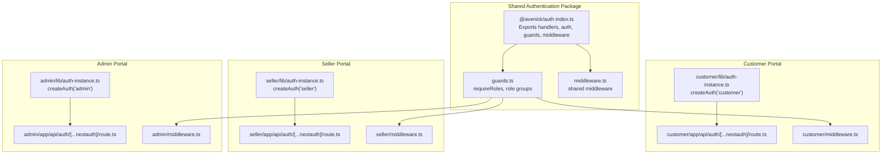
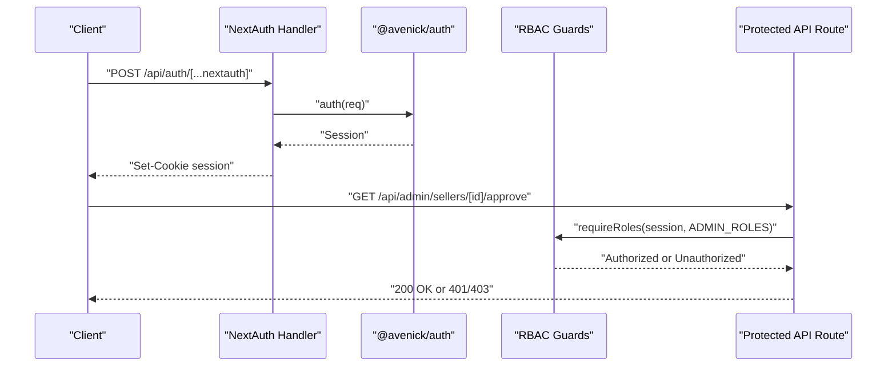
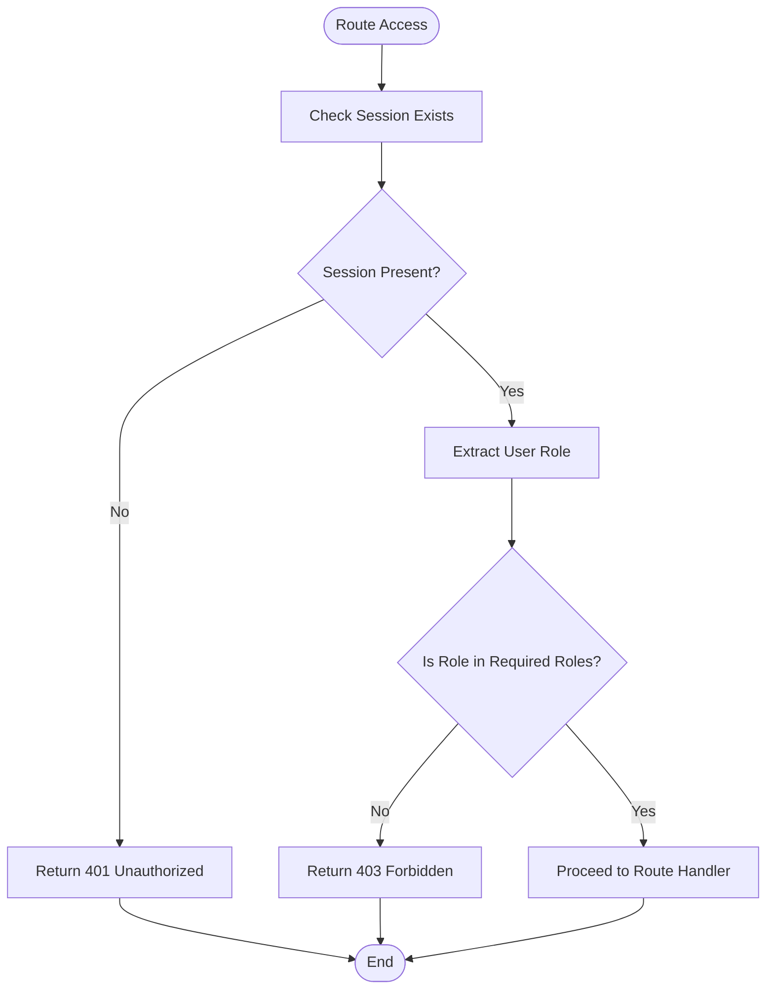
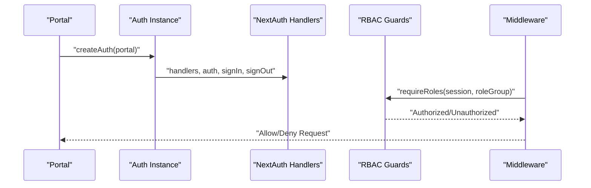
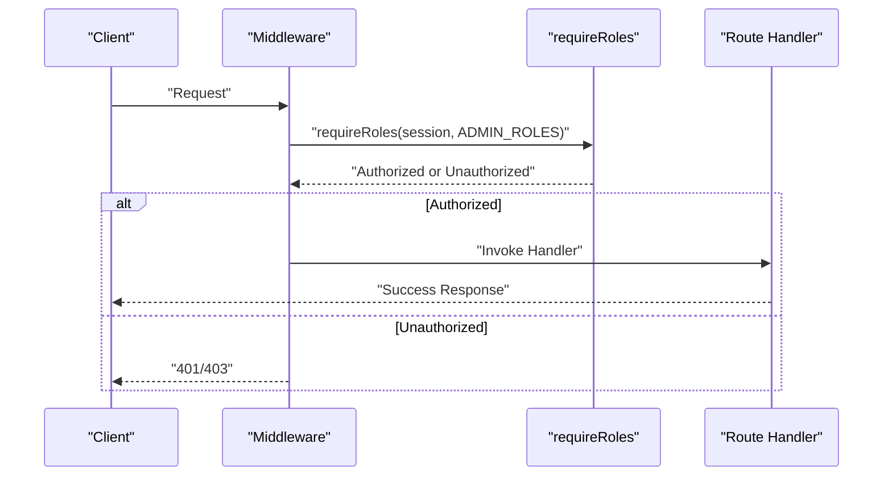
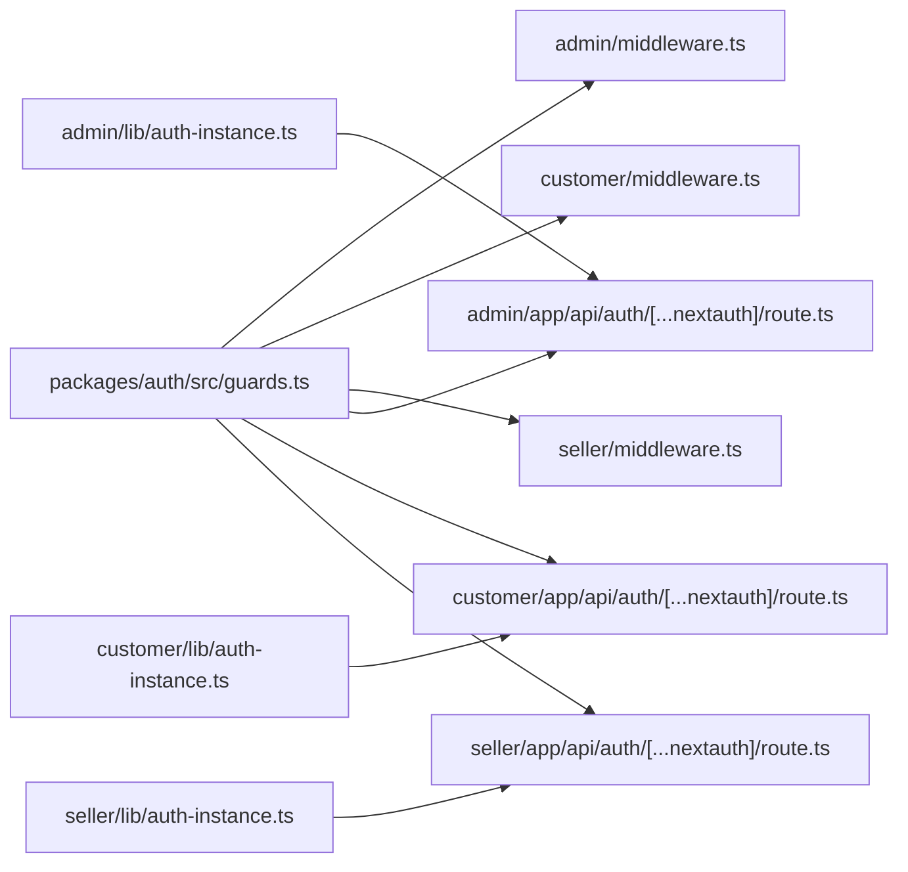

# Security Architecture & Access Control

<cite>
**Referenced Files in This Document**
- [guards.ts](file://packages/auth/src/guards.ts)
- [middleware.ts](file://packages/auth/src/middleware.ts)
- [index.ts](file://packages/auth/src/index.ts)
- [auth-instance.ts](file://apps/admin/src/lib/auth-instance.ts)
- [auth-instance.ts](file://apps/customer/src/lib/auth-instance.ts)
- [auth-instance.ts](file://apps/seller/src/lib/auth-instance.ts)
- [route.ts](file://apps/admin/src/app/api/auth/[...nextauth]/route.ts)
- [route.ts](file://apps/customer/src/app/api/auth/[...nextauth]/route.ts)
- [route.ts](file://apps/seller/src/app/api/auth/[...nextauth]/route.ts)
- [middleware.ts](file://apps/admin/src/middleware.ts)
- [middleware.ts](file://apps/customer/src/middleware.ts)
- [middleware.ts](file://apps/seller/src/middleware.ts)
- [route.ts](file://apps/admin/src/app/api/admin/compliance[id]/approve/route.ts)
- [route.ts](file://apps/admin/src/app/api/admin/products[id]/approve/route.ts)
- [route.ts](file://apps/admin/src/app/api/admin/sellers/[id]/approve/route.ts)
- [route.ts](file://apps/admin/src/app/api/admin/sellers/[id]/reject/route.ts)
- [route.ts](file://apps/admin/src/app/api/admin/sellers/sellers/route.ts)
- [route.ts](file://apps/customer/src/app/api/register/business/route.ts)
- [route.ts](file://apps/customer/src/app/api/register/consumer/route.ts)
- [route.ts](file://apps/customer/src/app/api/orders/route.ts)
- [route.ts](file://apps/seller/src/app/api/seller/dashboard/route.ts)
- [route.ts](file://apps/seller/src/app/api/seller/orders/route.ts)
</cite>

## Table of Contents
1. [Introduction](#introduction)
2. [Project Structure](#project-structure)
3. [Core Components](#core-components)
4. [Architecture Overview](#architecture-overview)
5. [Detailed Component Analysis](#detailed-component-analysis)
6. [Dependency Analysis](#dependency-analysis)
7. [Performance Considerations](#performance-considerations)
8. [Troubleshooting Guide](#troubleshooting-guide)
9. [Conclusion](#conclusion)

## Introduction
This document provides a comprehensive overview of the security architecture and access control mechanisms across the three portals: customer, seller, and administrator. It explains the role-based access control (RBAC) implementation, authentication middleware, session management, token-based security patterns, authorization guards, route protection, and permission validation systems. It also covers security best practices, input validation, CSRF protection, secure API endpoint design, multi-tenant security considerations, data isolation, and compliance requirements.

## Project Structure
The security model is implemented through a shared authentication package (`@avenick/auth`) consumed by each portal. Each portal exposes a NextAuth handler endpoint and defines middleware for route protection. RBAC guards enforce role-based permissions for protected routes.

**Diagram sources**
- [index.ts:1-3](file://packages/auth/src/index.ts#L1-L3)
- [guards.ts:1-48](file://packages/auth/src/guards.ts#L1-L48)
- [middleware.ts](file://packages/auth/src/middleware.ts)
- [auth-instance.ts:1-3](file://apps/admin/src/lib/auth-instance.ts#L1-L3)
- [auth-instance.ts:1-3](file://apps/customer/src/lib/auth-instance.ts#L1-L3)
- [auth-instance.ts:1-3](file://apps/seller/src/lib/auth-instance.ts#L1-L3)
- [route.ts:1-3](file://apps/admin/src/app/api/auth/[...nextauth]/route.ts#L1-L3)
- [route.ts:1-3](file://apps/customer/src/app/api/auth/[...nextauth]/route.ts#L1-L3)
- [route.ts:1-3](file://apps/seller/src/app/api/auth/[...nextauth]/route.ts#L1-L3)
- [middleware.ts](file://apps/admin/src/middleware.ts)
- [middleware.ts](file://apps/customer/src/middleware.ts)
- [middleware.ts](file://apps/seller/src/middleware.ts)

**Section sources**
- [index.ts:1-3](file://packages/auth/src/index.ts#L1-L3)
- [guards.ts:1-48](file://packages/auth/src/guards.ts#L1-L48)
- [middleware.ts](file://packages/auth/src/middleware.ts)
- [auth-instance.ts:1-3](file://apps/admin/src/lib/auth-instance.ts#L1-L3)
- [auth-instance.ts:1-3](file://apps/customer/src/lib/auth-instance.ts#L1-L3)
- [auth-instance.ts:1-3](file://apps/seller/src/lib/auth-instance.ts#L1-L3)
- [route.ts:1-3](file://apps/admin/src/app/api/auth/[...nextauth]/route.ts#L1-L3)
- [route.ts:1-3](file://apps/customer/src/app/api/auth/[...nextauth]/route.ts#L1-L3)
- [route.ts:1-3](file://apps/seller/src/app/api/auth/[...nextauth]/route.ts#L1-L3)
- [middleware.ts](file://apps/admin/src/middleware.ts)
- [middleware.ts](file://apps/customer/src/middleware.ts)
- [middleware.ts](file://apps/seller/src/middleware.ts)

## Core Components
- Shared RBAC Guards: Centralized role checks and role group constants enable consistent authorization across portals.
- Authentication Instances: Each portal creates a dedicated NextAuth instance via the shared package, exposing standardized handlers.
- Middleware: Route protection middleware leverages guards to enforce access policies.
- Protected API Routes: Specific administrative endpoints demonstrate guard usage for sensitive operations.

Key RBAC roles and role groups:
- Buyer roles: consumer, company admin, company buyer, company approver
- Seller roles: seller owner, seller staff
- Administrator roles: admin, super admin

**Section sources**
- [guards.ts:1-48](file://packages/auth/src/guards.ts#L1-L48)

## Architecture Overview
The security architecture follows a layered approach:
- Authentication: NextAuth handles session creation and management per portal.
- Authorization: RBAC guards validate roles against the session user.
- Middleware: Protects routes by enforcing authorization policies.
- API Protection: Guarded endpoints validate permissions before processing requests.

**Diagram sources**
- [route.ts:1-3](file://apps/admin/src/app/api/auth/[...nextauth]/route.ts#L1-L3)
- [auth-instance.ts:1-3](file://apps/admin/src/lib/auth-instance.ts#L1-L3)
- [guards.ts:13-39](file://packages/auth/src/guards.ts#L13-L39)
- [route.ts](file://apps/admin/src/app/api/admin/sellers/[id]/approve/route.ts)

## Detailed Component Analysis

### Role-Based Access Control (RBAC) Implementation
RBAC is enforced centrally with:
- Role validation: Ensures the session user has one of the required roles.
- Role groups: Predefined arrays for buyers, sellers, and administrators simplify route protection.
- Unauthorized responses: Standardized 401/403 responses with structured error payloads.

**Diagram sources**
- [guards.ts:13-39](file://packages/auth/src/guards.ts#L13-L39)

**Section sources**
- [guards.ts:1-48](file://packages/auth/src/guards.ts#L1-L48)

### Authentication Middleware and Session Management
Each portal defines a dedicated authentication instance that wraps the shared package’s `createAuth`. The NextAuth handler exposes standardized GET/POST endpoints for authentication flows. Middleware integrates with the shared guards to protect routes.

**Diagram sources**
- [auth-instance.ts:1-3](file://apps/admin/src/lib/auth-instance.ts#L1-L3)
- [auth-instance.ts:1-3](file://apps/customer/src/lib/auth-instance.ts#L1-L3)
- [auth-instance.ts:1-3](file://apps/seller/src/lib/auth-instance.ts#L1-L3)
- [route.ts:1-3](file://apps/admin/src/app/api/auth/[...nextauth]/route.ts#L1-L3)
- [route.ts:1-3](file://apps/customer/src/app/api/auth/[...nextauth]/route.ts#L1-L3)
- [route.ts:1-3](file://apps/seller/src/app/api/auth/[...nextauth]/route.ts#L1-L3)
- [guards.ts:13-39](file://packages/auth/src/guards.ts#L13-L39)
- [middleware.ts](file://apps/admin/src/middleware.ts)
- [middleware.ts](file://apps/customer/src/middleware.ts)
- [middleware.ts](file://apps/seller/src/middleware.ts)

**Section sources**
- [auth-instance.ts:1-3](file://apps/admin/src/lib/auth-instance.ts#L1-L3)
- [auth-instance.ts:1-3](file://apps/customer/src/lib/auth-instance.ts#L1-L3)
- [auth-instance.ts:1-3](file://apps/seller/src/lib/auth-instance.ts#L1-L3)
- [route.ts:1-3](file://apps/admin/src/app/api/auth/[...nextauth]/route.ts#L1-L3)
- [route.ts:1-3](file://apps/customer/src/app/api/auth/[...nextauth]/route.ts#L1-L3)
- [route.ts:1-3](file://apps/seller/src/app/api/auth/[...nextauth]/route.ts#L1-L3)
- [guards.ts:13-39](file://packages/auth/src/guards.ts#L13-L39)
- [middleware.ts](file://apps/admin/src/middleware.ts)
- [middleware.ts](file://apps/customer/src/middleware.ts)
- [middleware.ts](file://apps/seller/src/middleware.ts)

### Authorization Guards and Route Protection
Authorization guards are applied at two levels:
- Middleware level: Protects entire routes or route groups.
- Endpoint level: Validates permissions for sensitive operations.

Examples of guarded endpoints:
- Admin compliance approvals and rejections
- Product approvals
- Seller onboarding approvals and rejections
- Customer registration endpoints
- Seller dashboard and order endpoints

**Diagram sources**
- [guards.ts:13-39](file://packages/auth/src/guards.ts#L13-L39)
- [route.ts](file://apps/admin/src/app/api/admin/compliance[id]/approve/route.ts)
- [route.ts](file://apps/admin/src/app/api/admin/products[id]/approve/route.ts)
- [route.ts](file://apps/admin/src/app/api/admin/sellers/[id]/approve/route.ts)
- [route.ts](file://apps/admin/src/app/api/admin/sellers/[id]/reject/route.ts)
- [route.ts](file://apps/admin/src/app/api/admin/sellers/sellers/route.ts)
- [route.ts](file://apps/customer/src/app/api/register/business/route.ts)
- [route.ts](file://apps/customer/src/app/api/register/consumer/route.ts)
- [route.ts](file://apps/seller/src/app/api/seller/dashboard/route.ts)
- [route.ts](file://apps/seller/src/app/api/seller/orders/route.ts)

**Section sources**
- [guards.ts:13-39](file://packages/auth/src/guards.ts#L13-L39)
- [route.ts](file://apps/admin/src/app/api/admin/compliance[id]/approve/route.ts)
- [route.ts](file://apps/admin/src/app/api/admin/products[id]/approve/route.ts)
- [route.ts](file://apps/admin/src/app/api/admin/sellers/[id]/approve/route.ts)
- [route.ts](file://apps/admin/src/app/api/admin/sellers/[id]/reject/route.ts)
- [route.ts](file://apps/admin/src/app/api/admin/sellers/sellers/route.ts)
- [route.ts](file://apps/customer/src/app/api/register/business/route.ts)
- [route.ts](file://apps/customer/src/app/api/register/consumer/route.ts)
- [route.ts](file://apps/seller/src/app/api/seller/dashboard/route.ts)
- [route.ts](file://apps/seller/src/app/api/seller/orders/route.ts)

### Token-Based Security Patterns
Token-based security is implemented through NextAuth sessions:
- Session cookies: Secure, HttpOnly cookies manage session identity.
- API access: Requests carry session cookies; server-side auth validates session and applies RBAC.
- Standardized handlers: Each portal exposes identical NextAuth handler signatures for consistent token lifecycle management.

**Section sources**
- [route.ts:1-3](file://apps/admin/src/app/api/auth/[...nextauth]/route.ts#L1-L3)
- [route.ts:1-3](file://apps/customer/src/app/api/auth/[...nextauth]/route.ts#L1-L3)
- [route.ts:1-3](file://apps/seller/src/app/api/auth/[...nextauth]/route.ts#L1-L3)

### Multi-Tenant Security and Data Isolation
Multi-tenant considerations are addressed by:
- Role-scoped access: Different role groups prevent cross-portal data access.
- Tenant-aware guards: Middleware and guards enforce role boundaries.
- Data isolation: API handlers should validate ownership or tenant membership before mutating data.

[No sources needed since this section provides general guidance]

### Compliance Requirements
Compliance-ready practices include:
- Audit logging: Track authentication events and privileged actions.
- Session lifecycle: Enforce session timeouts and logout flows.
- Least privilege: Restrict access to administrative endpoints.
- Secure defaults: Use HTTPS, secure cookies, and CSRF protection.

[No sources needed since this section provides general guidance]

## Dependency Analysis
The authentication and authorization stack depends on the shared package for centralized RBAC logic and middleware, while each portal maintains its own NextAuth instance and handler endpoints.

**Diagram sources**
- [guards.ts:1-48](file://packages/auth/src/guards.ts#L1-L48)
- [middleware.ts](file://apps/admin/src/middleware.ts)
- [middleware.ts](file://apps/customer/src/middleware.ts)
- [middleware.ts](file://apps/seller/src/middleware.ts)
- [auth-instance.ts:1-3](file://apps/admin/src/lib/auth-instance.ts#L1-L3)
- [auth-instance.ts:1-3](file://apps/customer/src/lib/auth-instance.ts#L1-L3)
- [auth-instance.ts:1-3](file://apps/seller/src/lib/auth-instance.ts#L1-L3)
- [route.ts:1-3](file://apps/admin/src/app/api/auth/[...nextauth]/route.ts#L1-L3)
- [route.ts:1-3](file://apps/customer/src/app/api/auth/[...nextauth]/route.ts#L1-L3)
- [route.ts:1-3](file://apps/seller/src/app/api/auth/[...nextauth]/route.ts#L1-L3)

**Section sources**
- [guards.ts:1-48](file://packages/auth/src/guards.ts#L1-L48)
- [middleware.ts](file://apps/admin/src/middleware.ts)
- [middleware.ts](file://apps/customer/src/middleware.ts)
- [middleware.ts](file://apps/seller/src/middleware.ts)
- [auth-instance.ts:1-3](file://apps/admin/src/lib/auth-instance.ts#L1-L3)
- [auth-instance.ts:1-3](file://apps/customer/src/lib/auth-instance.ts#L1-L3)
- [auth-instance.ts:1-3](file://apps/seller/src/lib/auth-instance.ts#L1-L3)
- [route.ts:1-3](file://apps/admin/src/app/api/auth/[...nextauth]/route.ts#L1-L3)
- [route.ts:1-3](file://apps/customer/src/app/api/auth/[...nextauth]/route.ts#L1-L3)
- [route.ts:1-3](file://apps/seller/src/app/api/auth/[...nextauth]/route.ts#L1-L3)

## Performance Considerations
- Minimize guard evaluations: Apply guards at middleware level for broad coverage; avoid redundant checks in route handlers.
- Efficient role lookups: Keep role checks O(1) by storing roles in session claims.
- Session caching: Reuse validated session data across middleware and handlers.

[No sources needed since this section provides general guidance]

## Troubleshooting Guide
Common issues and resolutions:
- Authentication failures: Verify NextAuth handlers are correctly exported and reachable.
- Permission errors: Confirm the user’s role matches the required role group; check guard invocation.
- Middleware misconfiguration: Ensure middleware is registered and applied to protected routes.

**Section sources**
- [guards.ts:13-39](file://packages/auth/src/guards.ts#L13-L39)
- [route.ts:1-3](file://apps/admin/src/app/api/auth/[...nextauth]/route.ts#L1-L3)
- [route.ts:1-3](file://apps/customer/src/app/api/auth/[...nextauth]/route.ts#L1-L3)
- [route.ts:1-3](file://apps/seller/src/app/api/auth/[...nextauth]/route.ts#L1-L3)

## Conclusion
The security architecture employs a centralized RBAC system with shared guards and middleware, complemented by portal-specific NextAuth instances. This design ensures consistent authentication and authorization across the customer, seller, and administrator portals, with clear separation of concerns and extensible role-based protections.