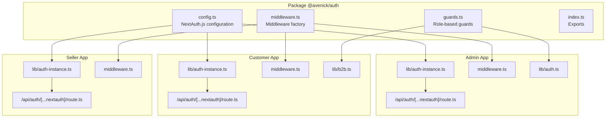
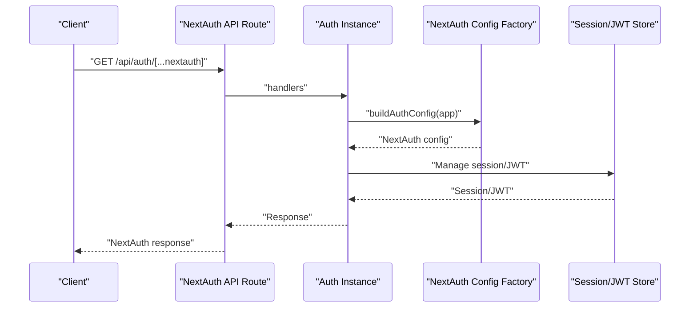
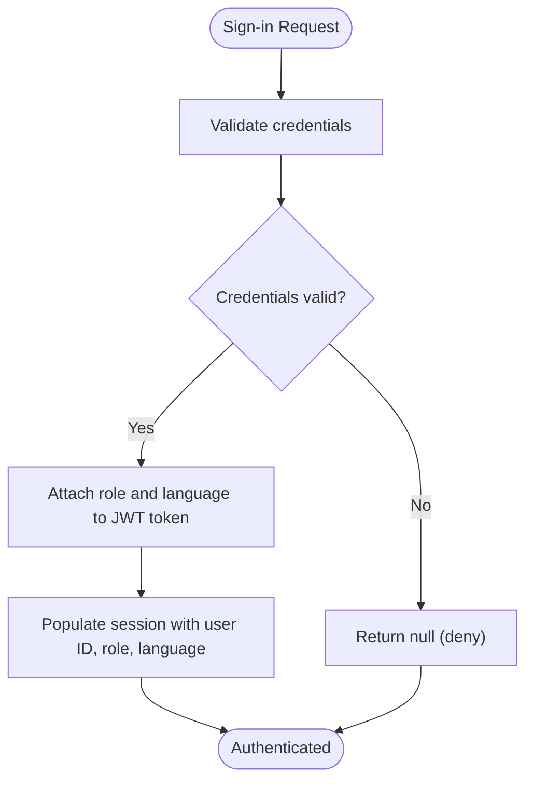
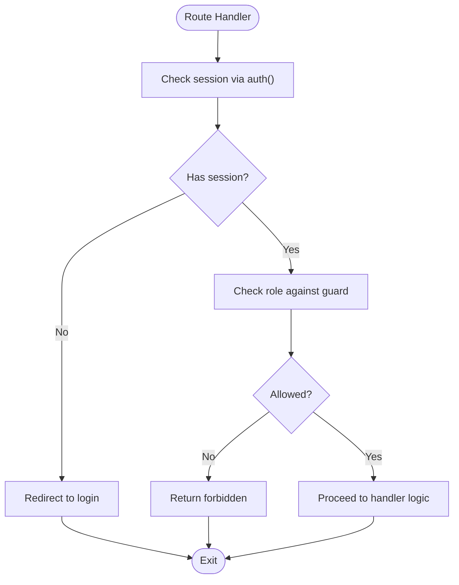
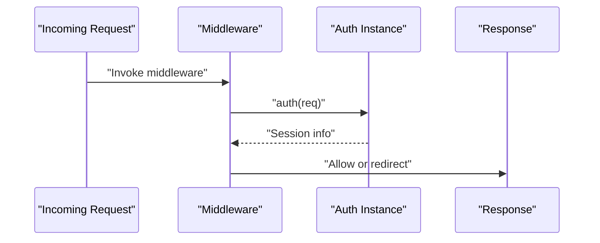
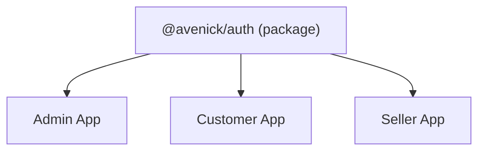

# Authentication Package

<cite>
**Referenced Files in This Document**
- [config.ts](file://packages/auth/src/config.ts)
- [guards.ts](file://packages/auth/src/guards.ts)
- [middleware.ts](file://packages/auth/src/middleware.ts)
- [index.ts](file://packages/auth/src/index.ts)
- [admin-auth-route.ts](file://apps/admin/src/app/api/auth/[...nextauth]/route.ts)
- [customer-auth-route.ts](file://apps/customer/src/app/api/auth/[...nextauth]/route.ts)
- [seller-auth-route.ts](file://apps/seller/src/app/api/auth/[...nextauth]/route.ts)
- [admin-auth-instance.ts](file://apps/admin/src/lib/auth-instance.ts)
- [customer-auth-instance.ts](file://apps/customer/src/lib/auth-instance.ts)
- [seller-auth-instance.ts](file://apps/seller/src/lib/auth-instance.ts)
- [admin-middleware.ts](file://apps/admin/src/middleware.ts)
- [customer-middleware.ts](file://apps/customer/src/middleware.ts)
- [seller-middleware.ts](file://apps/seller/src/middleware.ts)
- [admin-auth-lib.ts](file://apps/admin/src/lib/auth.ts)
- [customer-b2b.ts](file://apps/customer/src/lib/b2b.ts)
- [admin-support-actions.ts](file://apps/admin/src/app/support/actions.ts)
- [customer-orders-route.ts](file://apps/customer/src/app/api/orders/route.ts)
- [customer-register-business-route.ts](file://apps/customer/src/app/api/auth/register/business/route.ts)
- [customer-register-consumer-route.ts](file://apps/customer/src/app/api/auth/register/consumer/route.ts)
</cite>

## Table of Contents
1. [Introduction](#introduction)
2. [Project Structure](#project-structure)
3. [Core Components](#core-components)
4. [Architecture Overview](#architecture-overview)
5. [Detailed Component Analysis](#detailed-component-analysis)
6. [Dependency Analysis](#dependency-analysis)
7. [Performance Considerations](#performance-considerations)
8. [Troubleshooting Guide](#troubleshooting-guide)
9. [Conclusion](#conclusion)

## Introduction
This document provides comprehensive documentation for the authentication package in a Next.js monorepo. It covers NextAuth.js integration, configuration options, provider setup, session management, role-based access control guards, middleware implementation, authentication flows, security best practices, and multi-application authentication sharing patterns. It also outlines custom authentication providers, JWT token handling, session serialization, and common authentication scenarios such as password reset, email verification, and account linking.

## Project Structure
The authentication system is implemented as a reusable package (`@avenick/auth`) and consumed by three applications: admin, customer, and seller. Each application exposes NextAuth.js handlers via API routes and uses a shared authentication instance factory to configure NextAuth.js per application. Middleware is implemented using the package's middleware factory to enforce authentication checks across routes.

**Diagram sources**
- [config.ts:88-93](file://packages/auth/src/config.ts#L88-L93)
- [index.ts:1-3](file://packages/auth/src/index.ts#L1-L3)
- [admin-auth-route.ts:1-3](file://apps/admin/src/app/api/auth/[...nextauth]/route.ts#L1-L3)
- [customer-auth-route.ts:1-3](file://apps/customer/src/app/api/auth/[...nextauth]/route.ts#L1-L3)
- [seller-auth-route.ts:1-3](file://apps/seller/src/app/api/auth/[...nextauth]/route.ts#L1-L3)
- [admin-auth-instance.ts:1-3](file://apps/admin/src/lib/auth-instance.ts#L1-L3)
- [customer-auth-instance.ts:1-3](file://apps/customer/src/lib/auth-instance.ts#L1-L3)
- [seller-auth-instance.ts:1-3](file://apps/seller/src/lib/auth-instance.ts#L1-L3)
- [admin-middleware.ts:1-2](file://apps/admin/src/middleware.ts#L1-L2)
- [customer-middleware.ts:1-2](file://apps/customer/src/middleware.ts#L1-L2)
- [seller-middleware.ts:1-2](file://apps/seller/src/middleware.ts#L1-L2)
- [admin-auth-lib.ts:1-2](file://apps/admin/src/lib/auth.ts#L1-L2)
- [customer-b2b.ts:1-2](file://apps/customer/src/lib/b2b.ts#L1-L2)

**Section sources**
- [index.ts:1-3](file://packages/auth/src/index.ts#L1-L3)
- [admin-auth-route.ts:1-3](file://apps/admin/src/app/api/auth/[...nextauth]/route.ts#L1-L3)
- [customer-auth-route.ts:1-3](file://apps/customer/src/app/api/auth/[...nextauth]/route.ts#L1-L3)
- [seller-auth-route.ts:1-3](file://apps/seller/src/app/api/auth/[...nextauth]/route.ts#L1-L3)
- [admin-auth-instance.ts:1-3](file://apps/admin/src/lib/auth-instance.ts#L1-L3)
- [customer-auth-instance.ts:1-3](file://apps/customer/src/lib/auth-instance.ts#L1-L3)
- [seller-auth-instance.ts:1-3](file://apps/seller/src/lib/auth-instance.ts#L1-L3)
- [admin-middleware.ts:1-2](file://apps/admin/src/middleware.ts#L1-L2)
- [customer-middleware.ts:1-2](file://apps/customer/src/middleware.ts#L1-L2)
- [seller-middleware.ts:1-2](file://apps/seller/src/middleware.ts#L1-L2)

## Core Components
- NextAuth.js configuration factory: Builds application-specific configurations with cookie names, callbacks for JWT and session, pages overrides, session strategy, and host trust settings.
- Authentication instance factory: Creates NextAuth.js instances per application using the shared configuration factory.
- Guards: Role-based access control utilities for protecting routes and resources.
- Middleware factory: Provides middleware for enforcing authentication checks across applications.
- API handlers: Expose NextAuth.js handlers via API routes in each application.

Key implementation references:
- Configuration factory and exports: [config.ts:88-93](file://packages/auth/src/config.ts#L88-L93), [index.ts:1-3](file://packages/auth/src/index.ts#L1-L3)
- Application-specific handlers: [admin-auth-route.ts:1-3](file://apps/admin/src/app/api/auth/[...nextauth]/route.ts#L1-L3), [customer-auth-route.ts:1-3](file://apps/customer/src/app/api/auth/[...nextauth]/route.ts#L1-L3), [seller-auth-route.ts:1-3](file://apps/seller/src/app/api/auth/[...nextauth]/route.ts#L1-L3)
- Authentication instances: [admin-auth-instance.ts:1-3](file://apps/admin/src/lib/auth-instance.ts#L1-L3), [customer-auth-instance.ts:1-3](file://apps/customer/src/lib/auth-instance.ts#L1-L3), [seller-auth-instance.ts:1-3](file://apps/seller/src/lib/auth-instance.ts#L1-L3)

**Section sources**
- [config.ts:88-93](file://packages/auth/src/config.ts#L88-L93)
- [index.ts:1-3](file://packages/auth/src/index.ts#L1-L3)
- [admin-auth-route.ts:1-3](file://apps/admin/src/app/api/auth/[...nextauth]/route.ts#L1-L3)
- [customer-auth-route.ts:1-3](file://apps/customer/src/app/api/auth/[...nextauth]/route.ts#L1-L3)
- [seller-auth-route.ts:1-3](file://apps/seller/src/app/api/auth/[...nextauth]/route.ts#L1-L3)
- [admin-auth-instance.ts:1-3](file://apps/admin/src/lib/auth-instance.ts#L1-L3)
- [customer-auth-instance.ts:1-3](file://apps/customer/src/lib/auth-instance.ts#L1-L3)
- [seller-auth-instance.ts:1-3](file://apps/seller/src/lib/auth-instance.ts#L1-L3)

## Architecture Overview
The authentication architecture centers on a shared package that encapsulates NextAuth.js configuration and utilities. Each application creates its own authentication instance and exposes NextAuth.js handlers through dedicated API routes. Middleware enforces authentication checks, while guards protect routes and resources based on roles.

**Diagram sources**
- [admin-auth-route.ts:1-3](file://apps/admin/src/app/api/auth/[...nextauth]/route.ts#L1-L3)
- [customer-auth-route.ts:1-3](file://apps/customer/src/app/api/auth/[...nextauth]/route.ts#L1-L3)
- [seller-auth-route.ts:1-3](file://apps/seller/src/app/api/auth/[...nextauth]/route.ts#L1-L3)
- [admin-auth-instance.ts:1-3](file://apps/admin/src/lib/auth-instance.ts#L1-L3)
- [customer-auth-instance.ts:1-3](file://apps/customer/src/lib/auth-instance.ts#L1-L3)
- [seller-auth-instance.ts:1-3](file://apps/seller/src/lib/auth-instance.ts#L1-L3)
- [config.ts:88-93](file://packages/auth/src/config.ts#L88-L93)

## Detailed Component Analysis

### NextAuth.js Configuration and Session Management
- Configuration factory: Creates application-specific NextAuth.js configuration with cookie naming, callbacks for JWT and session, pages overrides, session strategy set to JWT with a 30-day max age, and host trust enabled.
- Callbacks:
  - JWT callback: Attaches role and language to the token during sign-in.
  - Session callback: Injects user ID, role, and language into the session object from the token.
- Cookies: Custom cookie names prefixed per application to avoid conflicts across apps.
- Pages: Redirects to a login page on sign-in and error scenarios.

Implementation references:
- Configuration factory and callbacks: [config.ts:57-84](file://packages/auth/src/config.ts#L57-L84)
- Instance creation: [config.ts:88-93](file://packages/auth/src/config.ts#L88-L93)
- Exported API: [index.ts:1-3](file://packages/auth/src/index.ts#L1-L3)

**Diagram sources**
- [config.ts:62-77](file://packages/auth/src/config.ts#L62-L77)

**Section sources**
- [config.ts:57-84](file://packages/auth/src/config.ts#L57-L84)
- [config.ts:88-93](file://packages/auth/src/config.ts#L88-L93)
- [index.ts:1-3](file://packages/auth/src/index.ts#L1-L3)

### Role-Based Access Control Guards
- Guards module: Provides utilities for protecting routes and resources based on roles.
- Usage examples:
  - Admin-only routes: Import guards in server-side code and apply role checks before processing requests.
  - B2B features: Guards are used in B2B-related libraries to restrict access to authorized users.

Implementation references:
- Guards module: [guards.ts](file://packages/auth/src/guards.ts)
- Admin usage: [admin-support-actions.ts:1-5](file://apps/admin/src/app/support/actions.ts#L1-L5)
- B2B usage: [customer-b2b.ts:1-2](file://apps/customer/src/lib/b2b.ts#L1-L2)

**Diagram sources**
- [guards.ts](file://packages/auth/src/guards.ts)
- [admin-support-actions.ts:1-5](file://apps/admin/src/app/support/actions.ts#L1-L5)
- [customer-b2b.ts:1-2](file://apps/customer/src/lib/b2b.ts#L1-L2)

**Section sources**
- [guards.ts](file://packages/auth/src/guards.ts)
- [admin-support-actions.ts:1-5](file://apps/admin/src/app/support/actions.ts#L1-L5)
- [customer-b2b.ts:1-2](file://apps/customer/src/lib/b2b.ts#L1-L2)

### Middleware Implementation
- Middleware factory: Provides a middleware factory for enforcing authentication checks across applications.
- Application middleware:
  - Admin: Imports the middleware factory and the auth instance.
  - Customer: Imports the middleware factory and the auth instance.
  - Seller: Imports the middleware factory and the auth instance.

Implementation references:
- Middleware factory: [middleware.ts](file://packages/auth/src/middleware.ts)
- Admin middleware: [admin-middleware.ts:1-2](file://apps/admin/src/middleware.ts#L1-L2)
- Customer middleware: [customer-middleware.ts:1-2](file://apps/customer/src/middleware.ts#L1-L2)
- Seller middleware: [seller-middleware.ts:1-2](file://apps/seller/src/middleware.ts#L1-L2)

**Diagram sources**
- [middleware.ts](file://packages/auth/src/middleware.ts)
- [admin-middleware.ts:1-2](file://apps/admin/src/middleware.ts#L1-L2)
- [customer-middleware.ts:1-2](file://apps/customer/src/middleware.ts#L1-L2)
- [seller-middleware.ts:1-2](file://apps/seller/src/middleware.ts#L1-L2)

**Section sources**
- [middleware.ts](file://packages/auth/src/middleware.ts)
- [admin-middleware.ts:1-2](file://apps/admin/src/middleware.ts#L1-L2)
- [customer-middleware.ts:1-2](file://apps/customer/src/middleware.ts#L1-L2)
- [seller-middleware.ts:1-2](file://apps/seller/src/middleware.ts#L1-L2)

### Multi-Application Authentication Sharing Patterns
- Shared package: The authentication package is imported by each application to share configuration and utilities.
- Application-specific instances: Each app creates its own authentication instance using the shared configuration factory.
- API handlers: Each app exposes NextAuth.js handlers via its own API route.
- Middleware: Each app uses the middleware factory to enforce authentication checks.

Implementation references:
- Package exports: [index.ts:1-3](file://packages/auth/src/index.ts#L1-L3)
- Admin instance and handler: [admin-auth-instance.ts:1-3](file://apps/admin/src/lib/auth-instance.ts#L1-L3), [admin-auth-route.ts:1-3](file://apps/admin/src/app/api/auth/[...nextauth]/route.ts#L1-L3)
- Customer instance and handler: [customer-auth-instance.ts:1-3](file://apps/customer/src/lib/auth-instance.ts#L1-L3), [customer-auth-route.ts:1-3](file://apps/customer/src/app/api/auth/[...nextauth]/route.ts#L1-L3)
- Seller instance and handler: [seller-auth-instance.ts:1-3](file://apps/seller/src/lib/auth-instance.ts#L1-L3), [seller-auth-route.ts:1-3](file://apps/seller/src/app/api/auth/[...nextauth]/route.ts#L1-L3)

**Section sources**
- [index.ts:1-3](file://packages/auth/src/index.ts#L1-L3)
- [admin-auth-instance.ts:1-3](file://apps/admin/src/lib/auth-instance.ts#L1-L3)
- [customer-auth-instance.ts:1-3](file://apps/customer/src/lib/auth-instance.ts#L1-L3)
- [seller-auth-instance.ts:1-3](file://apps/seller/src/lib/auth-instance.ts#L1-L3)
- [admin-auth-route.ts:1-3](file://apps/admin/src/app/api/auth/[...nextauth]/route.ts#L1-L3)
- [customer-auth-route.ts:1-3](file://apps/customer/src/app/api/auth/[...nextauth]/route.ts#L1-L3)
- [seller-auth-route.ts:1-3](file://apps/seller/src/app/api/auth/[...nextauth]/route.ts#L1-L3)

### Custom Authentication Providers and JWT Token Handling
- Custom provider setup: The configuration factory demonstrates how to integrate custom authentication providers and handle user data during sign-in.
- JWT token handling: The JWT callback attaches role and language to the token; the session callback injects user ID, role, and language into the session object.
- Session serialization: The session strategy is set to JWT with a 30-day max age, ensuring serialized session data remains consistent across requests.

Implementation references:
- Provider integration and callbacks: [config.ts:56-77](file://packages/auth/src/config.ts#L56-L77)
- Session strategy: [config.ts:83-84](file://packages/auth/src/config.ts#L83-L84)

**Section sources**
- [config.ts:56-77](file://packages/auth/src/config.ts#L56-L77)
- [config.ts:83-84](file://packages/auth/src/config.ts#L83-L84)

### Common Authentication Scenarios
- Password reset: Implement a dedicated API route to handle password reset requests and update user credentials securely.
- Email verification: Add an email verification flow with secure tokens and verification endpoints.
- Account linking: Support linking multiple accounts or providers for the same user.

Implementation references:
- Registration routes (business/consumer): [customer-register-business-route.ts](file://apps/customer/src/app/api/auth/register/business/route.ts), [customer-register-consumer-route.ts](file://apps/customer/src/app/api/auth/register/consumer/route.ts)
- Orders API protected by auth: [customer-orders-route.ts](file://apps/customer/src/app/api/orders/route.ts)

**Section sources**
- [customer-register-business-route.ts](file://apps/customer/src/app/api/auth/register/business/route.ts)
- [customer-register-consumer-route.ts](file://apps/customer/src/app/api/auth/register/consumer/route.ts)
- [customer-orders-route.ts:1-2](file://apps/customer/src/app/api/orders/route.ts#L1-L2)

## Dependency Analysis
The authentication package depends on NextAuth.js and exports configuration, guards, and middleware. Applications depend on the package for shared authentication logic and expose their own handlers and middleware.

**Diagram sources**
- [index.ts:1-3](file://packages/auth/src/index.ts#L1-L3)
- [admin-auth-instance.ts:1-3](file://apps/admin/src/lib/auth-instance.ts#L1-L3)
- [customer-auth-instance.ts:1-3](file://apps/customer/src/lib/auth-instance.ts#L1-L3)
- [seller-auth-instance.ts:1-3](file://apps/seller/src/lib/auth-instance.ts#L1-L3)

**Section sources**
- [index.ts:1-3](file://packages/auth/src/index.ts#L1-L3)
- [admin-auth-instance.ts:1-3](file://apps/admin/src/lib/auth-instance.ts#L1-L3)
- [customer-auth-instance.ts:1-3](file://apps/customer/src/lib/auth-instance.ts#L1-L3)
- [seller-auth-instance.ts:1-3](file://apps/seller/src/lib/auth-instance.ts#L1-L3)

## Performance Considerations
- Session strategy: Using JWT with a 30-day max age balances persistence and security. Consider shorter max ages for highly sensitive applications.
- Cookie naming: Application-specific cookie names prevent conflicts and reduce cross-app interference.
- Callback efficiency: Keep JWT and session callbacks minimal to avoid slowing down authentication flows.

## Troubleshooting Guide
- Login redirects loop: Verify cookie names and host trust settings in the configuration factory.
- Role-based access denied: Ensure guards are applied consistently and roles are correctly attached to tokens and sessions.
- Middleware not enforcing: Confirm middleware factory is imported and the auth instance is passed to the middleware.

**Section sources**
- [config.ts:57-84](file://packages/auth/src/config.ts#L57-L84)
- [guards.ts](file://packages/auth/src/guards.ts)
- [middleware.ts](file://packages/auth/src/middleware.ts)

## Conclusion
The authentication package provides a robust, shared foundation for NextAuth.js integration across multiple applications. It offers configurable session management, role-based access control, and middleware enforcement, enabling secure and scalable authentication flows. By leveraging the package’s configuration factory, guards, and middleware, teams can maintain consistent authentication behavior while supporting diverse application needs.