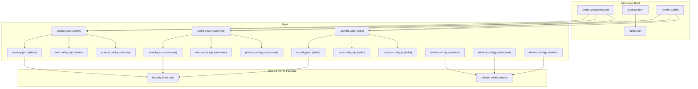
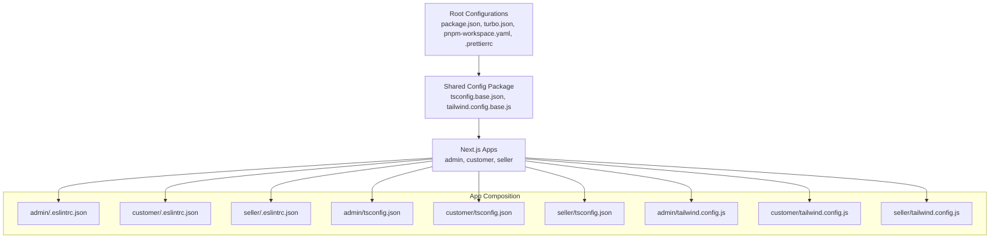
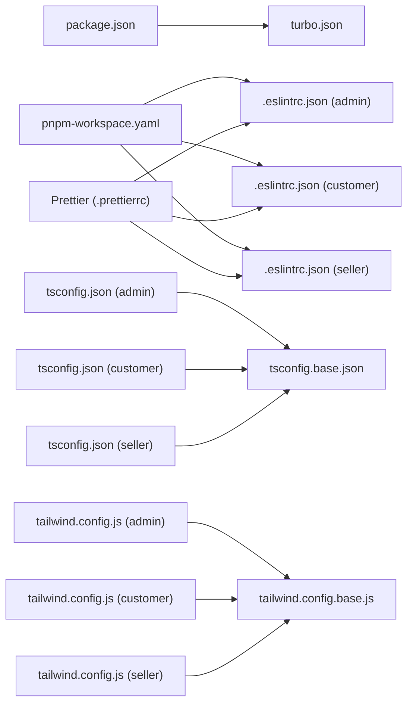

# Configuration Package

<cite>
**Referenced Files in This Document**
- [turbo.json](file://turbo.json)
- [package.json](file://package.json)
- [pnpm-workspace.yaml](file://pnpm-workspace.yaml)
- [.prettierrc](file://.prettierrc)
- [packages/config/tsconfig.base.json](file://packages/config/tsconfig.base.json)
- [packages/config/tailwind.config.base.js](file://packages/config/tailwind.config.base.js)
- [apps/admin/.eslintrc.json](file://apps/admin/.eslintrc.json)
- [apps/customer/.eslintrc.json](file://apps/customer/.eslintrc.json)
- [apps/seller/.eslintrc.json](file://apps/seller/.eslintrc.json)
- [apps/admin/tsconfig.json](file://apps/admin/tsconfig.json)
- [apps/customer/tsconfig.json](file://apps/customer/tsconfig.json)
- [apps/seller/tsconfig.json](file://apps/seller/tsconfig.json)
- [apps/admin/next.config.mjs](file://apps/admin/next.config.mjs)
- [apps/customer/next.config.mjs](file://apps/customer/next.config.mjs)
- [apps/seller/next.config.mjs](file://apps/seller/next.config.mjs)
- [apps/admin/postcss.config.js](file://apps/admin/postcss.config.js)
- [apps/customer/postcss.config.js](file://apps/customer/postcss.config.js)
- [apps/seller/postcss.config.js](file://apps/seller/postcss.config.js)
- [apps/admin/tailwind.config.js](file://apps/admin/tailwind.config.js)
- [apps/customer/tailwind.config.js](file://apps/customer/tailwind.config.js)
- [apps/seller/tailwind.config.js](file://apps/seller/tailwind.config.js)
</cite>

## Table of Contents
1. [Introduction](#introduction)
2. [Project Structure](#project-structure)
3. [Core Components](#core-components)
4. [Architecture Overview](#architecture-overview)
5. [Detailed Component Analysis](#detailed-component-analysis)
6. [Dependency Analysis](#dependency-analysis)
7. [Performance Considerations](#performance-considerations)
8. [Troubleshooting Guide](#troubleshooting-guide)
9. [Conclusion](#conclusion)

## Introduction
This document describes the configuration package and shared tooling across the monorepo. It focuses on:
- Shared TypeScript base configuration
- Tailwind CSS base configuration
- ESLint configurations for Next.js applications
- Formatting standards via Prettier
- Build and dev tooling settings in Next.js apps
- Monorepo orchestration with Turborepo and PNPM workspaces

The goal is to provide a consistent developer experience across apps while enabling environment-specific overrides and extensibility.

## Project Structure
The configuration package centralizes shared settings for TypeScript, Tailwind, and formatting. Each Next.js app consumes these shared settings and adds local overrides as needed.

**Diagram sources**
- [pnpm-workspace.yaml](file://pnpm-workspace.yaml)
- [package.json](file://package.json)
- [turbo.json](file://turbo.json)
- [.prettierrc](file://.prettierrc)
- [packages/config/tsconfig.base.json](file://packages/config/tsconfig.base.json)
- [packages/config/tailwind.config.base.js](file://packages/config/tailwind.config.base.js)
- [apps/admin/.eslintrc.json](file://apps/admin/.eslintrc.json)
- [apps/customer/.eslintrc.json](file://apps/customer/.eslintrc.json)
- [apps/seller/.eslintrc.json](file://apps/seller/.eslintrc.json)
- [apps/admin/tsconfig.json](file://apps/admin/tsconfig.json)
- [apps/customer/tsconfig.json](file://apps/customer/tsconfig.json)
- [apps/seller/tsconfig.json](file://apps/seller/tsconfig.json)
- [apps/admin/next.config.mjs](file://apps/admin/next.config.mjs)
- [apps/customer/next.config.mjs](file://apps/customer/next.config.mjs)
- [apps/seller/next.config.mjs](file://apps/seller/next.config.mjs)
- [apps/admin/postcss.config.js](file://apps/admin/postcss.config.js)
- [apps/customer/postcss.config.js](file://apps/customer/postcss.config.js)
- [apps/seller/postcss.config.js](file://apps/seller/postcss.config.js)
- [apps/admin/tailwind.config.js](file://apps/admin/tailwind.config.js)
- [apps/customer/tailwind.config.js](file://apps/customer/tailwind.config.js)
- [apps/seller/tailwind.config.js](file://apps/seller/tailwind.config.js)

**Section sources**
- [pnpm-workspace.yaml](file://pnpm-workspace.yaml)
- [package.json](file://package.json)
- [turbo.json](file://turbo.json)
- [.prettierrc](file://.prettierrc)

## Core Components
- Shared TypeScript base configuration: Provides consistent compiler options and project references across apps.
- Tailwind base configuration: Centralizes design system tokens and plugin setup for consistent styling.
- ESLint configurations per app: Enforce code quality and Next.js-specific rules with local overrides.
- Formatting: Prettier configuration ensures consistent code formatting across the monorepo.
- Next.js tooling: Next config, PostCSS, and Tailwind configs per app integrate shared base settings.

**Section sources**
- [packages/config/tsconfig.base.json](file://packages/config/tsconfig.base.json)
- [packages/config/tailwind.config.base.js](file://packages/config/tailwind.config.base.js)
- [apps/admin/.eslintrc.json](file://apps/admin/.eslintrc.json)
- [apps/customer/.eslintrc.json](file://apps/customer/.eslintrc.json)
- [apps/seller/.eslintrc.json](file://apps/seller/.eslintrc.json)
- [.prettierrc](file://.prettierrc)

## Architecture Overview
The configuration architecture follows a layered approach:
- Monorepo root defines workspace and build orchestration.
- Shared config package supplies base TypeScript and Tailwind settings.
- Each Next.js app composes shared base settings with local overrides for environment-specific needs.

**Diagram sources**
- [package.json](file://package.json)
- [turbo.json](file://turbo.json)
- [pnpm-workspace.yaml](file://pnpm-workspace.yaml)
- [.prettierrc](file://.prettierrc)
- [packages/config/tsconfig.base.json](file://packages/config/tsconfig.base.json)
- [packages/config/tailwind.config.base.js](file://packages/config/tailwind.config.base.js)
- [apps/admin/.eslintrc.json](file://apps/admin/.eslintrc.json)
- [apps/customer/.eslintrc.json](file://apps/customer/.eslintrc.json)
- [apps/seller/.eslintrc.json](file://apps/seller/.eslintrc.json)
- [apps/admin/tsconfig.json](file://apps/admin/tsconfig.json)
- [apps/customer/tsconfig.json](file://apps/customer/tsconfig.json)
- [apps/seller/tsconfig.json](file://apps/seller/tsconfig.json)
- [apps/admin/tailwind.config.js](file://apps/admin/tailwind.config.js)
- [apps/customer/tailwind.config.js](file://apps/customer/tailwind.config.js)
- [apps/seller/tailwind.config.js](file://apps/seller/tailwind.config.js)

## Detailed Component Analysis

### Shared TypeScript Base Configuration
The shared base TypeScript configuration centralizes compiler options and project references to ensure consistency across apps. It enables strictness, modern JS features, and efficient builds while allowing apps to extend and override as needed.

Key characteristics:
- Centralized compiler options for type checking, module resolution, and output.
- Project references to enable fast incremental builds and better IDE support.
- Extensible via app-level tsconfig.json files that merge with the base.

Recommended usage:
- Extend the base in each app’s tsconfig.json.
- Override only what is necessary (e.g., paths, include/exclude, specific compiler options).
- Keep shared base minimal and focused on cross-app concerns.

**Section sources**
- [packages/config/tsconfig.base.json](file://packages/config/tsconfig.base.json)
- [apps/admin/tsconfig.json](file://apps/admin/tsconfig.json)
- [apps/customer/tsconfig.json](file://apps/customer/tsconfig.json)
- [apps/seller/tsconfig.json](file://apps/seller/tsconfig.json)

### Tailwind CSS Base Configuration
The Tailwind base configuration defines design tokens, plugins, and theme defaults used across apps. It ensures visual consistency and simplifies customization per app.

Key characteristics:
- Centralized color palette, spacing scale, typography, and breakpoints.
- Plugin setup for advanced features (e.g., forms, typography).
- Extensible via app-level tailwind.config.js that merges with the base.

Recommended usage:
- Import the base configuration in each app’s tailwind.config.js.
- Add app-specific design tokens or plugins without modifying the base.
- Keep base minimal and avoid app-specific overrides.

**Section sources**
- [packages/config/tailwind.config.base.js](file://packages/config/tailwind.config.base.js)
- [apps/admin/tailwind.config.js](file://apps/admin/tailwind.config.js)
- [apps/customer/tailwind.config.js](file://apps/customer/tailwind.config.js)
- [apps/seller/tailwind.config.js](file://apps/seller/tailwind.config.js)

### ESLint Configuration for Next.js Applications
Each Next.js app includes an ESLint configuration tailored to its domain and Next.js runtime. The configuration enforces code quality, Next.js best practices, and project-specific rules.

Highlights:
- Next.js plugin and React/JSX runtime settings aligned with the app’s framework usage.
- Custom rules for domain-specific constraints (e.g., import ordering, naming conventions).
- Environment-specific overrides (e.g., browser vs server, API routes).

Recommended usage:
- Extend the base ESLint configuration in each app.
- Add app-specific rules without removing core Next.js or shared rules.
- Keep custom rules scoped and documented.

**Section sources**
- [apps/admin/.eslintrc.json](file://apps/admin/.eslintrc.json)
- [apps/customer/.eslintrc.json](file://apps/customer/.eslintrc.json)
- [apps/seller/.eslintrc.json](file://apps/seller/.eslintrc.json)

### Formatting Standards with Prettier
Prettier is configured at the root to enforce consistent formatting across all apps and packages. This eliminates style bikeshedding and keeps diffs clean.

Key characteristics:
- Single source of truth for formatting rules.
- Integrates with editors and CI to auto-format on save and pre-commit.

Recommended usage:
- Run formatting locally and in CI.
- Avoid per-app overrides unless absolutely necessary; prefer centralized settings.

**Section sources**
- [.prettierrc](file://.prettierrc)

### Next.js Tooling Settings
Each app integrates Next.js with shared base settings for build and dev experience.

Build and dev tooling:
- Next.js configuration files define runtime behavior, redirects, headers, and experimental features.
- PostCSS configuration integrates with Tailwind and other transforms.
- Tailwind configuration composes the base with app-specific design tokens.

Recommended usage:
- Keep Next.js config minimal and rely on shared base for consistency.
- Add app-specific routes, headers, or redirects in the app-level config.

**Section sources**
- [apps/admin/next.config.mjs](file://apps/admin/next.config.mjs)
- [apps/customer/next.config.mjs](file://apps/customer/next.config.mjs)
- [apps/seller/next.config.mjs](file://apps/seller/next.config.mjs)
- [apps/admin/postcss.config.js](file://apps/admin/postcss.config.js)
- [apps/customer/postcss.config.js](file://apps/customer/postcss.config.js)
- [apps/seller/postcss.config.js](file://apps/seller/postcss.config.js)
- [apps/admin/tailwind.config.js](file://apps/admin/tailwind.config.js)
- [apps/customer/tailwind.config.js](file://apps/customer/tailwind.config.js)
- [apps/seller/tailwind.config.js](file://apps/seller/tailwind.config.js)

### Extending Configurations for Different Environments and Application Types
To extend configurations for different environments or app types:
- TypeScript: Extend the base tsconfig.json with environment-specific compiler options (e.g., target, moduleResolution) and include/exclude patterns.
- Tailwind: Merge the base configuration with app-specific design tokens and plugins; avoid changing the base for environment overrides.
- ESLint: Add environment-specific rules in the app’s .eslintrc.json; keep Next.js and shared rules intact.
- Next.js: Use separate next.config.mjs variants for environment-specific behavior (e.g., feature flags, redirects) while keeping shared base.

Examples of extension points:
- TypeScript: Add environment-specific paths or JSX transform options in app-level tsconfig.json.
- Tailwind: Introduce app-specific colors or spacing scales in the app’s tailwind.config.js.
- ESLint: Add domain-specific rules (e.g., import grouping) in the app’s .eslintrc.json.
- Next.js: Configure environment-specific headers, redirects, or runtime behavior in next.config.mjs.

**Section sources**
- [packages/config/tsconfig.base.json](file://packages/config/tsconfig.base.json)
- [packages/config/tailwind.config.base.js](file://packages/config/tailwind.config.base.js)
- [apps/admin/.eslintrc.json](file://apps/admin/.eslintrc.json)
- [apps/customer/.eslintrc.json](file://apps/customer/.eslintrc.json)
- [apps/seller/.eslintrc.json](file://apps/seller/.eslintrc.json)
- [apps/admin/next.config.mjs](file://apps/admin/next.config.mjs)
- [apps/customer/next.config.mjs](file://apps/customer/next.config.mjs)
- [apps/seller/next.config.mjs](file://apps/seller/next.config.mjs)

## Dependency Analysis
The configuration package depends on:
- Monorepo tooling (Turborepo and PNPM workspaces) for build orchestration and package management.
- Shared base TypeScript and Tailwind configurations consumed by apps.
- App-level overrides that depend on the shared base.

**Diagram sources**
- [package.json](file://package.json)
- [turbo.json](file://turbo.json)
- [pnpm-workspace.yaml](file://pnpm-workspace.yaml)
- [.prettierrc](file://.prettierrc)
- [packages/config/tsconfig.base.json](file://packages/config/tsconfig.base.json)
- [packages/config/tailwind.config.base.js](file://packages/config/tailwind.config.base.js)
- [apps/admin/.eslintrc.json](file://apps/admin/.eslintrc.json)
- [apps/customer/.eslintrc.json](file://apps/customer/.eslintrc.json)
- [apps/seller/.eslintrc.json](file://apps/seller/.eslintrc.json)
- [apps/admin/tsconfig.json](file://apps/admin/tsconfig.json)
- [apps/customer/tsconfig.json](file://apps/customer/tsconfig.json)
- [apps/seller/tsconfig.json](file://apps/seller/tsconfig.json)
- [apps/admin/tailwind.config.js](file://apps/admin/tailwind.config.js)
- [apps/customer/tailwind.config.js](file://apps/customer/tailwind.config.js)
- [apps/seller/tailwind.config.js](file://apps/seller/tailwind.config.js)

**Section sources**
- [package.json](file://package.json)
- [turbo.json](file://turbo.json)
- [pnpm-workspace.yaml](file://pnpm-workspace.yaml)
- [.prettierrc](file://.prettierrc)

## Performance Considerations
- Use the shared TypeScript base to enable project references and incremental builds across apps.
- Keep Tailwind base minimal to reduce CSS bundle size; scope app-specific styles carefully.
- Prefer centralized ESLint rules to minimize linting overhead and maintain consistency.
- Leverage Turborepo caching and task graph to optimize repeated builds and linting.

[No sources needed since this section provides general guidance]

## Troubleshooting Guide
Common issues and resolutions:
- TypeScript errors after extending base: Verify app-level tsconfig.json merges correctly with the base and does not introduce conflicting options.
- Tailwind utilities missing: Ensure the app’s tailwind.config.js imports the base and includes the app’s content paths.
- ESLint rule conflicts: Confirm app-level .eslintrc.json extends the base and only overrides intended rules.
- Formatting inconsistencies: Run Prettier locally and ensure CI enforces formatting.

**Section sources**
- [packages/config/tsconfig.base.json](file://packages/config/tsconfig.base.json)
- [packages/config/tailwind.config.base.js](file://packages/config/tailwind.config.base.js)
- [apps/admin/.eslintrc.json](file://apps/admin/.eslintrc.json)
- [apps/customer/.eslintrc.json](file://apps/customer/.eslintrc.json)
- [apps/seller/.eslintrc.json](file://apps/seller/.eslintrc.json)
- [.prettierrc](file://.prettierrc)

## Conclusion
The configuration package establishes a consistent foundation for TypeScript, Tailwind, and formatting across the monorepo. By composing shared base settings with app-specific overrides, teams can maintain high code quality, predictable builds, and a scalable development workflow. Extending configurations for different environments and application types is straightforward through layered composition and targeted overrides.

[No sources needed since this section summarizes without analyzing specific files]