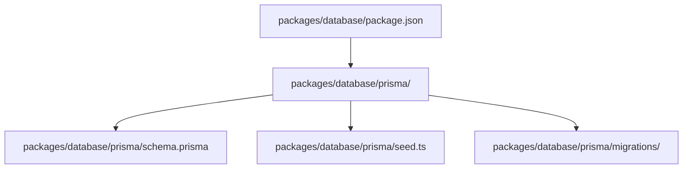
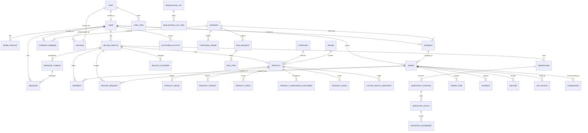
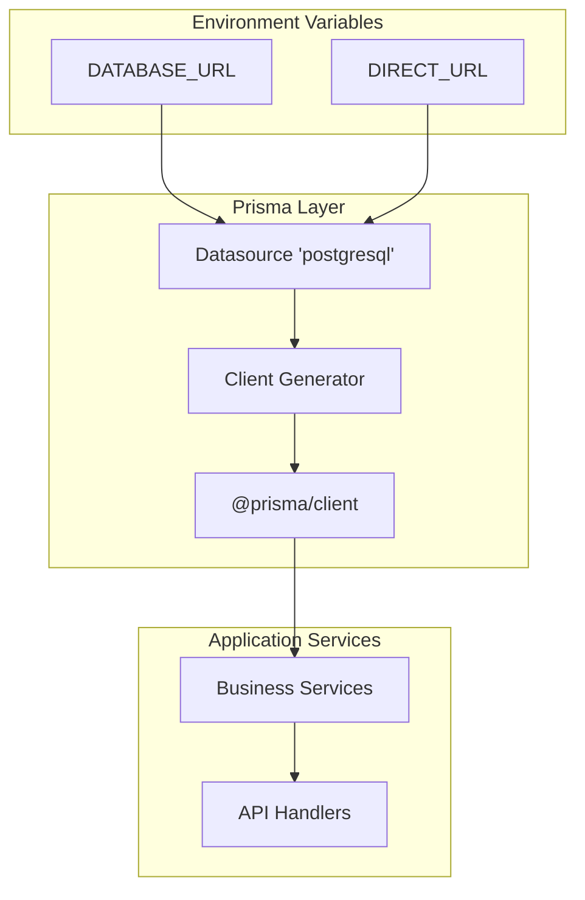
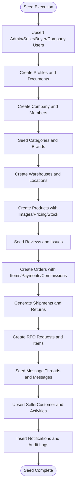
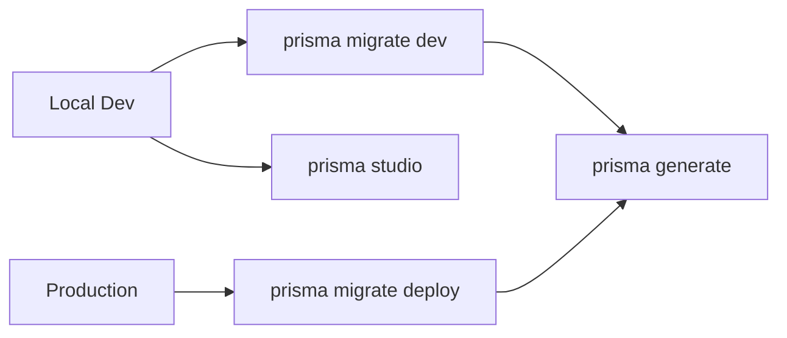
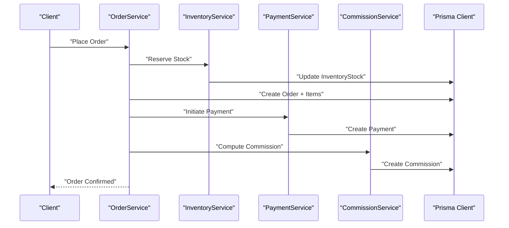
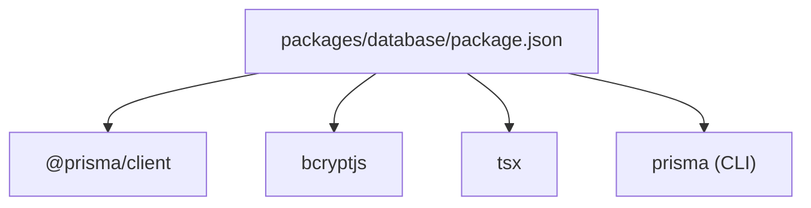

# Database Package

<cite>
**Referenced Files in This Document**
- [schema.prisma](file://packages/database/prisma/schema.prisma)
- [seed.ts](file://packages/database/prisma/seed.ts)
- [package.json](file://packages/database/package.json)
</cite>

## Table of Contents
1. [Introduction](#introduction)
2. [Project Structure](#project-structure)
3. [Core Components](#core-components)
4. [Architecture Overview](#architecture-overview)
5. [Detailed Component Analysis](#detailed-component-analysis)
6. [Dependency Analysis](#dependency-analysis)
7. [Performance Considerations](#performance-considerations)
8. [Troubleshooting Guide](#troubleshooting-guide)
9. [Conclusion](#conclusion)
10. [Appendices](#appendices)

## Introduction
This document describes the database package for the avenick-commerce project. It focuses on the Prisma schema that defines 20+ models covering Users, Companies, Sellers, Catalog (Categories, Brands, Products), Orders, Payments, Fulfillment (Shipments, Returns), CRM (SellerCustomer), Messaging, RFQ, Compliance, Inventory, Notifications, and Audit logs. It explains service-layer abstractions for encapsulating business logic and data access patterns, the mock data system for development and testing, migration and seeding strategies, environment-specific configurations, complex query patterns, transaction handling, validation, performance optimization, indexing strategies, and query optimization.

## Project Structure
The database package is organized around Prisma’s schema definition and supporting scripts:
- Prisma schema: central model definitions, relations, enums, and indexes
- Seed script: synthetic dataset initialization for development
- Package scripts: Prisma commands for generation, migrations, deployment, and seeding
- Environment variables: datasource URLs for PostgreSQL connectivity

**Diagram sources**
- [package.json:1-34](file://packages/database/package.json#L1-L34)
- [schema.prisma:1-12](file://packages/database/prisma/schema.prisma#L1-L12)

**Section sources**
- [package.json:1-34](file://packages/database/package.json#L1-L34)

## Core Components
This section outlines the primary domain models and their relationships, focusing on the most relevant entities for commerce operations.

- Identity and Access
  - User: identity, roles, statuses, localization, and associations to profiles and activity
  - AdminProfile, SellerProfile: role-specific profiles linked to User
  - Session: token-based sessions tied to User

- B2B Company and Procurement
  - Company: corporate profile, registration numbers, industry, size, country, status, credit limits
  - CompanyMember: membership linking User to Company with role and spend limit
  - ApprovalPolicy: spend thresholds requiring approver roles
  - PurchaseOrder: procurement lifecycle with requester/approver, amounts, status

- Catalog and Pricing
  - Category, Brand: taxonomy and brand metadata
  - Product: SKU/slug uniqueness, multilingual names/descriptions, status flags, compliance, pricing tiers, variants, images
  - ProductPrice: B2B/B2C pricing tiers with quantity bands and VAT rates
  - ProductVariant: variant attributes and pricing
  - ProductComplianceDocument: compliance docs per product/seller
  - ProductIssue, ListingHealthSnapshot: listing quality diagnostics

- Inventory and Warehousing
  - Warehouse: platform-owned and seller-owned storage facilities
  - InventoryLocation: location codes with zone/aisle/bin
  - InventoryStock: tracked by product/variant/location
  - InventoryMovement: inbound/outbound/adjustments

- Shopping and Orders
  - Cart, CartItem: guest/user carts
  - Address: shipping/billing addresses with geocoordinates
  - Order: order lifecycle, totals, taxes, fulfillment type, payment linkage
  - OrderItem: per-item breakdown with seller attribution
  - OrderStatusHistory: audit trail of status transitions
  - Payment, Refund, TaxInvoice: financial records
  - Commission: marketplace fee allocation
  - Shipment, ShipmentEvent, ReturnRequest: fulfillment and returns

- CRM and Messaging
  - SellerCustomer: buyer-account mapping with metrics and tags
  - CustomerActivity: behavioral events
  - MessageThread, Message: threaded conversations among buyer/seller/admin/system

- RFQ and Requisition Lists
  - RFQRequest, RFQItem: request for quotes with optional product linkage
  - RequisitionList, RequisitionListItem: buyer internal lists

- Support and Governance
  - SupportTicket: customer support requests with priority/status
  - Notification: user-centric alerts
  - AuditLog: change tracking across entities

**Diagram sources**
- [schema.prisma:321-1341](file://packages/database/prisma/schema.prisma#L321-L1341)

**Section sources**
- [schema.prisma:1-1341](file://packages/database/prisma/schema.prisma#L1-L1341)

## Architecture Overview
The database architecture centers on a single PostgreSQL datasource configured via environment variables. Prisma Client generates strongly-typed database access code consumed by application services. The seed script initializes realistic development data across users, companies, catalogs, orders, and CRM. Migrations evolve the schema over time, while environment variables enable separation of concerns across local, preview, and production deployments.

**Diagram sources**
- [schema.prisma:7-11](file://packages/database/prisma/schema.prisma#L7-L11)
- [package.json:22-32](file://packages/database/package.json#L22-L32)

**Section sources**
- [schema.prisma:7-11](file://packages/database/prisma/schema.prisma#L7-L11)
- [package.json:8-21](file://packages/database/package.json#L8-L21)

## Detailed Component Analysis

### Prisma Schema: Models and Relations
- Enums define strict categorical domains for roles, statuses, currencies, countries, and more, ensuring data integrity and consistent UI/business logic.
- Models capture the commerce domain comprehensively:
  - Identity: User, AdminProfile, SellerProfile, Session
  - B2B: Company, CompanyMember, ApprovalPolicy, PurchaseOrder
  - Catalog: Category, Brand, Product, ProductImage, ProductVariant, ProductPrice, ProductComplianceDocument, ProductIssue, ListingHealthSnapshot
  - Inventory: Warehouse, InventoryLocation, InventoryStock, InventoryMovement
  - Shopping: Cart, CartItem, Address
  - Orders: Order, OrderItem, OrderStatusHistory, Payment, Refund, TaxInvoice, Commission
  - Fulfillment: Shipment, ShipmentEvent, ReturnRequest
  - CRM: SellerCustomer, CustomerActivity
  - Messaging: MessageThread, Message
  - RFQ: RFQRequest, RFQItem
  - Support: SupportTicket
  - Governance: Notification, AuditLog

Indexing strategy is embedded in model definitions using @@index directives across foreign keys, unique identifiers, and frequently filtered fields (e.g., user-role-status, product slugs, order numbers, audit timestamps).

**Section sources**
- [schema.prisma:13-318](file://packages/database/prisma/schema.prisma#L13-L318)
- [schema.prisma:319-1341](file://packages/database/prisma/schema.prisma#L319-L1341)

### Service Layer Abstractions
Encapsulate business logic and data access patterns behind service modules:
- Identity and Access
  - UserService: user creation, role assignment, profile linkage, session management
  - Auth service: secure password hashing, session validation, role-based access checks
- B2B Company Management
  - CompanyService: company onboarding, member management, approval policy enforcement
  - PurchaseOrderService: PO lifecycle, requester/approver routing, status transitions
- Catalog and Pricing
  - ProductService: product CRUD, pricing tiers, compliance doc management, listing health scoring
  - PriceService: tiered pricing computation, VAT calculations, currency conversions
- Inventory and Warehousing
  - InventoryService: stock reservations, movements, reorder triggers, location management
  - WarehouseService: facility setup, capacity planning, 3PL coordination
- Orders and Payments
  - OrderService: order creation, item assembly, status updates, tax calculation
  - PaymentService: payment capture, reconciliation, refund orchestration
  - CommissionService: fee computation, payout scheduling, settlement tracking
- Fulfillment and Returns
  - ShipmentService: carrier coordination, tracking updates, event logging
  - ReturnService: return request processing, RMA generation, refund initiation
- CRM and Messaging
  - SellerCustomerService: customer segmentation, tagging, activity tracking
  - MessageService: thread management, notifications, read receipts
- RFQ and Requisitions
  - RFQService: request creation, quoting, negotiation, acceptance
  - RequisitionService: list management, bulk ordering, approvals
- Governance
  - AuditService: log generation, compliance reporting
  - NotificationService: alerting, digest scheduling

These services coordinate Prisma Client operations, enforce domain rules, and maintain transactional boundaries where necessary.

**Section sources**
- [schema.prisma:321-1341](file://packages/database/prisma/schema.prisma#L321-L1341)

### Mock Data System (Seed)
The seed script initializes a realistic development environment:
- Users: admin, super-admin, seller, buyer, company admin, pending seller
- Companies and memberships
- Categories and Brands
- Warehouses (platform and seller-owned) and inventory locations
- Products with images, pricing tiers, stock levels, compliance, issues, and listing health snapshots
- Orders (B2B/B2C), payments, commissions, tax invoices, and payouts
- RFQs, messaging threads, CRM entries, and audit logs
- Provides deterministic credentials for quick onboarding and testing

**Diagram sources**
- [seed.ts:35-1056](file://packages/database/prisma/seed.ts#L35-L1056)

**Section sources**
- [seed.ts:1-1056](file://packages/database/prisma/seed.ts#L1-L1056)

### Migration Strategies
- Development: use dev migrations to evolve schema locally; generated client reflects schema changes
- Production: deploy migrations using migration deployment commands to apply schema changes safely
- Reset: reset command to reinitialize schema during local cleanup
- Index coverage: migrations include explicit index coverage for foreign keys and frequently queried fields

**Diagram sources**
- [package.json:11-21](file://packages/database/package.json#L11-L21)

**Section sources**
- [package.json:11-21](file://packages/database/package.json#L11-L21)

### Seed Data Management
- Centralized seed script orchestrates creation of users, companies, catalog, inventory, orders, CRM, and governance artifacts
- Uses upsert patterns to avoid duplication and support idempotent runs
- Generates realistic pricing tiers, stock levels, and audit trails for demonstration

**Section sources**
- [seed.ts:35-1056](file://packages/database/prisma/seed.ts#L35-L1056)

### Environment-Specific Configurations
- Datasource configured with DATABASE_URL and DIRECT_URL environment variables
- Binary targets tailored for local and serverless runtimes
- Scripts expose standardized commands for generation, migration, deployment, and seeding

**Section sources**
- [schema.prisma:7-11](file://packages/database/prisma/schema.prisma#L7-L11)
- [package.json:8-21](file://packages/database/package.json#L8-L21)

### Complex Queries and Transactions
- Aggregated reports: order totals by buyer/seller, product sales velocity, inventory turnover
- Cross-entity joins: order items with product metadata, payments with tax invoices, shipments with events
- Transactional workflows: order creation with cart clearance, payment capture with inventory reservation, commission calculation with payout creation
- Validation patterns: enforce pricing tiers, stock availability, compliance document requirements, approval policies

**Diagram sources**
- [schema.prisma:901-1034](file://packages/database/prisma/schema.prisma#L901-L1034)

**Section sources**
- [schema.prisma:901-1034](file://packages/database/prisma/schema.prisma#L901-L1034)

### Data Validation
- Enum constraints prevent invalid statuses and roles
- Unique constraints on emails, phones, slugs, SKUs, order numbers, and document references
- Not-null constraints on critical fields (e.g., product name, pricing tiers)
- Computed fields (e.g., VAT amounts, totals) derived from base prices and quantities

**Section sources**
- [schema.prisma:321-1341](file://packages/database/prisma/schema.prisma#L321-L1341)

## Dependency Analysis
The database package depends on Prisma Client and bcrypt for hashing. Scripts integrate Prisma CLI for schema generation, migrations, and seeding.

**Diagram sources**
- [package.json:22-32](file://packages/database/package.json#L22-L32)

**Section sources**
- [package.json:22-32](file://packages/database/package.json#L22-L32)

## Performance Considerations
- Index coverage
  - Foreign keys indexed (e.g., user/company/product relations)
  - Frequently filtered fields indexed (e.g., orderNumber, status, createdAt)
  - Composite indexes for multi-column filters (e.g., user-role-status)
- Denormalization for reporting
  - ListingHealthSnapshot captures computed listing quality for fast dashboards
- Efficient joins
  - Prefer indexed relations for order-item, product-price, and inventory movement queries
- Pagination and filtering
  - Use cursor-based pagination on createdAt or id for large datasets
- Caching
  - Cache static taxonomy (categories, brands) and frequently accessed product metadata
- Asynchronous processing
  - Offload heavy computations (pricing recalculations, audit generation) to background jobs

[No sources needed since this section provides general guidance]

## Troubleshooting Guide
- Connection issues
  - Verify DATABASE_URL and DIRECT_URL environment variables
  - Confirm PostgreSQL connectivity and credentials
- Migration errors
  - Use prisma migrate dev to stage changes locally
  - Use prisma migrate deploy for production-safe application
- Seed failures
  - Run tsx prisma/seed.ts to initialize development data
  - Ensure seed script handles duplicates via upsert patterns
- Client generation
  - Run prisma generate after schema changes
- Transaction anomalies
  - Wrap multi-step operations in transactions to maintain consistency

**Section sources**
- [package.json:11-21](file://packages/database/package.json#L11-L21)
- [schema.prisma:7-11](file://packages/database/prisma/schema.prisma#L7-L11)

## Conclusion
The database package establishes a robust, strongly-typed schema for a multi-domain commerce platform. It integrates identity, B2B procurement, catalog management, inventory, orders, payments, fulfillment, CRM, messaging, RFQ, and governance. The seed script accelerates development, while migration and environment configurations support safe evolution across environments. Service-layer abstractions encapsulate business logic and data access, enabling scalable and maintainable application development.

[No sources needed since this section summarizes without analyzing specific files]

## Appendices

### Appendix A: Key Model Indexes
- User: email, role/status
- Product: sellerId/status, categoryId, brandId, slug, sku, deletedAt
- Order: userId/status, orderNumber, createdAt
- InventoryStock: productId, variantId, locationId
- AuditLog: entityType/entityId, actorId, sellerId, createdAt

**Section sources**
- [schema.prisma:354-356](file://packages/database/prisma/schema.prisma#L354-L356)
- [schema.prisma:658-664](file://packages/database/prisma/schema.prisma#L658-L664)
- [schema.prisma:939-945](file://packages/database/prisma/schema.prisma#L939-L945)
- [schema.prisma:825-828](file://packages/database/prisma/schema.prisma#L825-L828)
- [schema.prisma:1336-1339](file://packages/database/prisma/schema.prisma#L1336-L1339)