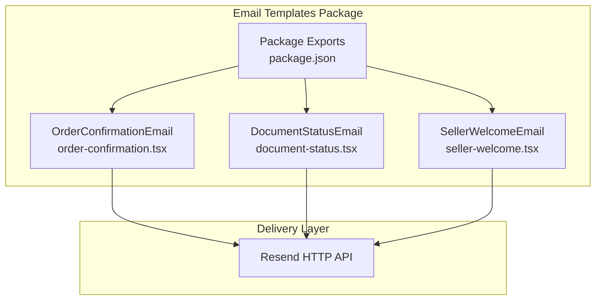
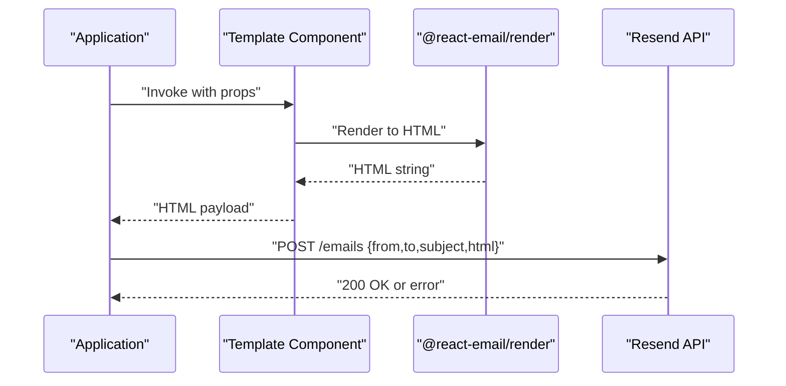
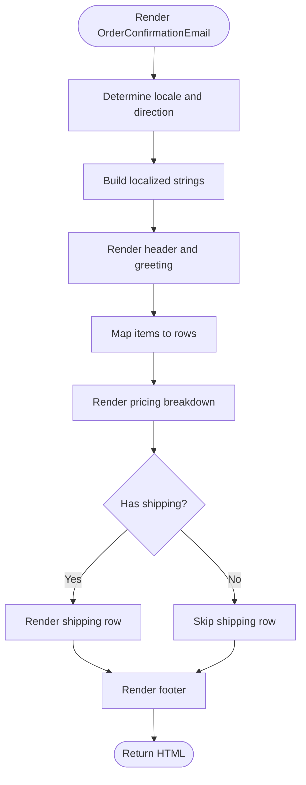
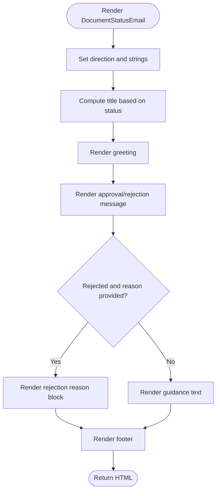
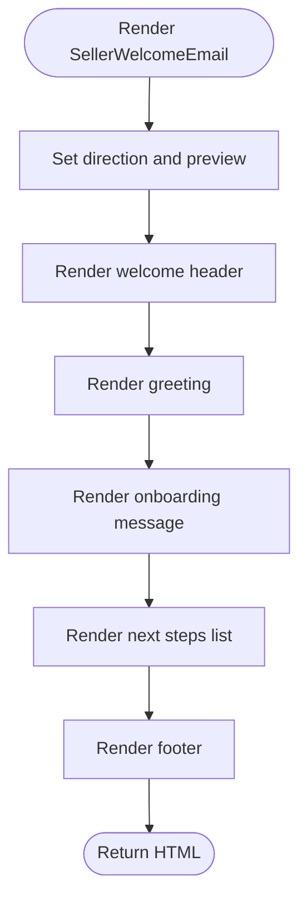
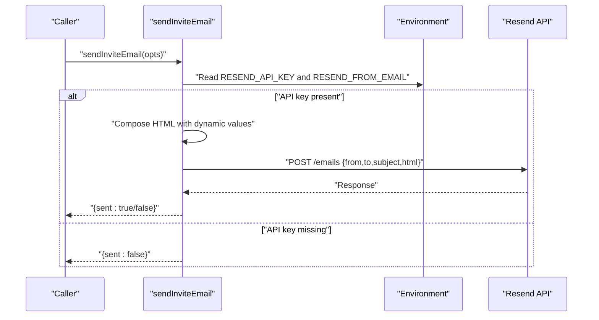
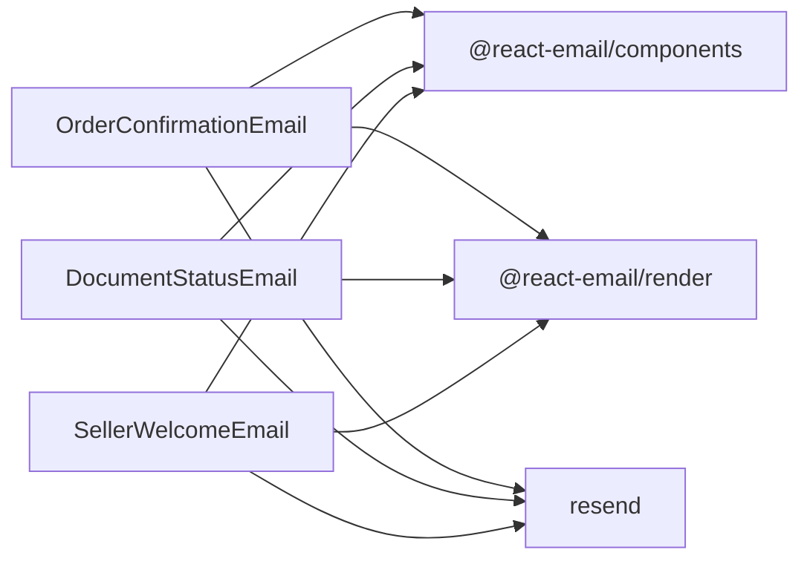

# Email Templates Package

<cite>
**Referenced Files in This Document**
- [package.json](file://packages/email-templates/package.json)
- [order-confirmation.tsx](file://packages/email-templates/src/order-confirmation.tsx)
- [document-status.tsx](file://packages/email-templates/src/document-status.tsx)
- [seller-welcome.tsx](file://packages/email-templates/src/seller-welcome.tsx)
- [email.ts](file://apps/customer/src/lib/email.ts)
</cite>

## Table of Contents
1. [Introduction](#introduction)
2. [Project Structure](#project-structure)
3. [Core Components](#core-components)
4. [Architecture Overview](#architecture-overview)
5. [Detailed Component Analysis](#detailed-component-analysis)
6. [Dependency Analysis](#dependency-analysis)
7. [Performance Considerations](#performance-considerations)
8. [Troubleshooting Guide](#troubleshooting-guide)
9. [Conclusion](#conclusion)
10. [Appendices](#appendices)

## Introduction
This document describes the email templates package used across the Avenick Commerce platform. It covers the HTML email templates, dynamic content injection, localization support, template rendering engine integration, variable substitution patterns, and email composition workflows. It also details customization options, branding guidelines, responsive design considerations, email delivery integration, tracking mechanisms, bounce handling, accessibility compliance, spam prevention, deliverability optimization, and examples of template inheritance, partial templates, and conditional content rendering.

## Project Structure
The email templates package is implemented as a React-based email library using @react-email/components and @react-email/render. The package exposes reusable email templates as React components and integrates with Resend for delivery.

**Diagram sources**
- [package.json:1-23](file://packages/email-templates/package.json#L1-L23)
- [order-confirmation.tsx:1-151](file://packages/email-templates/src/order-confirmation.tsx#L1-L151)
- [document-status.tsx:1-81](file://packages/email-templates/src/document-status.tsx#L1-L81)
- [seller-welcome.tsx:1-62](file://packages/email-templates/src/seller-welcome.tsx#L1-L62)

**Section sources**
- [package.json:1-23](file://packages/email-templates/package.json#L1-L23)

## Core Components
The package provides three primary email templates:
- Order Confirmation Email: localized order summary with items, pricing breakdown, and currency formatting.
- Document Status Email: approval/rejection notifications with optional rejection reasons.
- Seller Welcome Email: onboarding steps and next actions for sellers.

Each template is a React component that renders semantic HTML suitable for email clients, with Tailwind classes for styling and conditional logic for localization and content branching.

Key capabilities:
- Dynamic content injection via props (order details, user names, statuses).
- Localization with Arabic/English variants and right-to-left layout support.
- Responsive design using container-based layouts and Tailwind utilities.
- Conditional rendering for optional fields (e.g., shipping costs, rejection reasons).

**Section sources**
- [order-confirmation.tsx:25-47](file://packages/email-templates/src/order-confirmation.tsx#L25-L47)
- [document-status.tsx:6-20](file://packages/email-templates/src/document-status.tsx#L6-L20)
- [seller-welcome.tsx:6-16](file://packages/email-templates/src/seller-welcome.tsx#L6-L16)

## Architecture Overview
The email workflow integrates template rendering with a delivery provider. The templates are authored as React components and rendered to HTML for delivery via an HTTP API.

**Diagram sources**
- [order-confirmation.tsx:85-149](file://packages/email-templates/src/order-confirmation.tsx#L85-L149)
- [document-status.tsx:29-78](file://packages/email-templates/src/document-status.tsx#L29-L78)
- [seller-welcome.tsx:20-59](file://packages/email-templates/src/seller-welcome.tsx#L20-L59)
- [email.ts:38-58](file://apps/customer/src/lib/email.ts#L38-L58)

## Detailed Component Analysis

### Order Confirmation Email
Purpose: Notify customers of order confirmation with a detailed breakdown of items, pricing, VAT, shipping, and total.

Implementation highlights:
- Props include order metadata, customer name, items array, pricing totals, currency, and locale.
- Localized strings and directionality switch based on locale.
- Conditional rendering for shipping cost when applicable.
- Currency formatting applied consistently across totals.

**Diagram sources**
- [order-confirmation.tsx:37-151](file://packages/email-templates/src/order-confirmation.tsx#L37-L151)

**Section sources**
- [order-confirmation.tsx:25-83](file://packages/email-templates/src/order-confirmation.tsx#L25-L83)
- [order-confirmation.tsx:104-141](file://packages/email-templates/src/order-confirmation.tsx#L104-L141)

### Document Status Email
Purpose: Communicate approval or rejection decisions for submitted documents, optionally including a rejection reason.

Implementation highlights:
- Props include recipient name, document type, status, optional rejection reason, and locale.
- Conditional rendering for rejection reason block and follow-up guidance.
- Status-specific styling and messaging.

**Diagram sources**
- [document-status.tsx:14-81](file://packages/email-templates/src/document-status.tsx#L14-L81)

**Section sources**
- [document-status.tsx:6-20](file://packages/email-templates/src/document-status.tsx#L6-L20)
- [document-status.tsx:54-69](file://packages/email-templates/src/document-status.tsx#L54-L69)

### Seller Welcome Email
Purpose: Onboard new sellers with a friendly welcome and next steps during account review.

Implementation highlights:
- Props include seller name, business name, and locale.
- Next steps rendered as a styled list with localized copy.
- Consistent branding and footer messaging.

**Diagram sources**
- [seller-welcome.tsx:12-62](file://packages/email-templates/src/seller-welcome.tsx#L12-L62)

**Section sources**
- [seller-welcome.tsx:6-16](file://packages/email-templates/src/seller-welcome.tsx#L6-L16)
- [seller-welcome.tsx:41-50](file://packages/email-templates/src/seller-welcome.tsx#L41-L50)

### Template Rendering Engine Integration
Rendering engine: @react-email/render is used to convert React components into HTML suitable for email delivery. The templates leverage @react-email/components primitives for semantic markup and Tailwind utilities for styling.

Integration pattern:
- Each template component returns JSX using Html, Head, Preview, Tailwind, Body, Container, Heading, Text, Section, Row, Column, and Hr.
- The application renders the component to HTML and sends it via the Resend API.

**Section sources**
- [order-confirmation.tsx:1-15](file://packages/email-templates/src/order-confirmation.tsx#L1-L15)
- [document-status.tsx:1-4](file://packages/email-templates/src/document-status.tsx#L1-L4)
- [seller-welcome.tsx:1-4](file://packages/email-templates/src/seller-welcome.tsx#L1-L4)

### Variable Substitution Patterns
Templates use prop-driven variable substitution:
- Order Confirmation: orderNumber, customerName, items, subtotal, vatAmount, shippingAmount, total, currency, locale.
- Document Status: recipientName, documentType, status, rejectionReason, locale.
- Seller Welcome: sellerName, businessName, locale.

Localization:
- Each template defines an English and Arabic dictionary and selects content based on the locale prop.
- Directionality (ltr/rtl) and language attributes are set dynamically.

Conditional content:
- Shipping row appears only when shippingAmount is greater than zero.
- Rejection reason block appears only when status is REJECTED and a reason is provided.

**Section sources**
- [order-confirmation.tsx:25-47](file://packages/email-templates/src/order-confirmation.tsx#L25-L47)
- [document-status.tsx:6-20](file://packages/email-templates/src/document-status.tsx#L6-L20)
- [seller-welcome.tsx:6-16](file://packages/email-templates/src/seller-welcome.tsx#L6-L16)

### Email Composition Workflows
The customer app demonstrates a minimal email composition workflow using the Resend HTTP API:
- Environment variables provide the API key and sender identity.
- The sendInviteEmail function composes HTML content inline and posts to the Resend endpoint.
- Graceful degradation occurs when the API key is missing.

**Diagram sources**
- [email.ts:6-58](file://apps/customer/src/lib/email.ts#L6-L58)

**Section sources**
- [email.ts:1-59](file://apps/customer/src/lib/email.ts#L1-L59)

### Template Customization Options and Branding Guidelines
Customization options:
- Locale switching between English and Arabic with appropriate directionality.
- Tailwind classes enable consistent spacing, typography, and color usage.
- Preview text is set per template for improved inbox appearance.

Branding guidelines:
- Use brand-safe colors (e.g., orange accents) and neutral backgrounds.
- Keep headings and body text legible with proper contrast.
- Include consistent footer messaging and platform branding.

Responsive design considerations:
- Container-based layout with max-width and padding ensures readability on mobile.
- Semantic headings and paragraphs improve screen reader comprehension.
- Inline images or minimal graphics; rely on text-based layouts for reliability.

**Section sources**
- [order-confirmation.tsx:85-149](file://packages/email-templates/src/order-confirmation.tsx#L85-L149)
- [document-status.tsx:29-78](file://packages/email-templates/src/document-status.tsx#L29-L78)
- [seller-welcome.tsx:20-59](file://packages/email-templates/src/seller-welcome.tsx#L20-L59)

### Email Delivery Integration, Tracking, and Bounce Handling
Delivery integration:
- The templates are designed for delivery via the Resend HTTP API.
- The customer app’s sendInviteEmail function demonstrates sending HTML emails with proper headers and JSON payload.

Tracking mechanisms:
- The templates do not embed tracking pixels or links by default.
- To enable open/click tracking, integrate with Resend’s tracking features and add appropriate pixel/link URLs in the application layer.

Bounce handling:
- Implement server-side retry logic and dead letter queues for persistent failures.
- Monitor Resend response codes and error payloads to distinguish hard bounces from soft failures.

**Section sources**
- [email.ts:38-58](file://apps/customer/src/lib/email.ts#L38-L58)

### Accessibility Compliance, Spam Prevention, and Deliverability Optimization
Accessibility:
- Use semantic HTML (Headings, Paragraphs, Lists) for screen reader compatibility.
- Ensure sufficient color contrast and readable font sizes.
- Provide meaningful alt text for any images and concise preview text.

Spam prevention:
- Use a verified sender domain and DKIM/SPF records.
- Avoid spam trigger words and excessive capitalization.
- Include a clear unsubscribe mechanism if applicable.

Deliverability optimization:
- Maintain clean sender reputation with low complaint rates.
- Segment audiences and personalize subject lines carefully.
- Monitor bounce and spam complaint metrics and adjust content accordingly.

[No sources needed since this section provides general guidance]

## Dependency Analysis
External dependencies used by the email templates package:
- @react-email/components: Provides semantic email components (Html, Head, Preview, Tailwind, Body, Container, Heading, Text, Section, Row, Column, Hr).
- @react-email/render: Converts React components to HTML.
- resend: HTTP client for Resend API integration.
- react: Required peer dependency for component rendering.

**Diagram sources**
- [package.json:8-12](file://packages/email-templates/package.json#L8-L12)

**Section sources**
- [package.json:1-23](file://packages/email-templates/package.json#L1-L23)

## Performance Considerations
- Keep HTML lightweight: avoid heavy images and excessive nesting.
- Minimize inline styles; prefer Tailwind utilities for consistent, compact CSS.
- Cache rendered HTML when templates are static to reduce repeated rendering overhead.
- Use asynchronous rendering and batching for high-volume email sends.

[No sources needed since this section provides general guidance]

## Troubleshooting Guide
Common issues and resolutions:
- Missing API key: The customer app’s sendInviteEmail function logs a message and returns false when the Resend API key is not configured. Ensure environment variables are set in production.
- Delivery errors: Inspect HTTP response status and body for detailed error messages. Log and retry transient failures.
- Localization mismatches: Verify locale prop values and ensure fallback strings are defined.
- Styling inconsistencies: Confirm Tailwind classes render correctly in the target email clients; test across major providers.

**Section sources**
- [email.ts:17-20](file://apps/customer/src/lib/email.ts#L17-L20)
- [email.ts:49-52](file://apps/customer/src/lib/email.ts#L49-L52)

## Conclusion
The email templates package provides a robust, localized, and responsive foundation for transactional and onboarding emails. By leveraging React components and @react-email, it enables consistent branding, easy customization, and reliable delivery via Resend. Extending the system with tracking, advanced personalization, and comprehensive monitoring will further enhance engagement and deliverability.

[No sources needed since this section summarizes without analyzing specific files]

## Appendices

### Appendix A: Template Inheritance and Partial Templates
- Inheritance: Use a base component pattern to share common sections (header, footer) across templates. Pass children or shared fragments as props to compose richer layouts.
- Partials: Extract reusable UI blocks (e.g., pricing rows, action buttons) into dedicated components and compose them within templates.

[No sources needed since this section provides general guidance]

### Appendix B: Conditional Content Rendering Examples
- Order Confirmation: Render shipping row only when shippingAmount > 0.
- Document Status: Show rejection reason block only when status is REJECTED and a reason is provided.
- Localization: Switch headings, labels, and messages based on locale prop.

**Section sources**
- [order-confirmation.tsx:131-136](file://packages/email-templates/src/order-confirmation.tsx#L131-L136)
- [document-status.tsx:54-61](file://packages/email-templates/src/document-status.tsx#L54-L61)