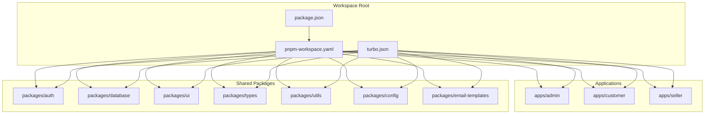
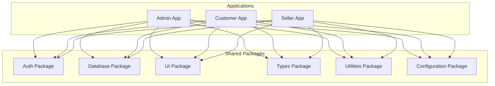
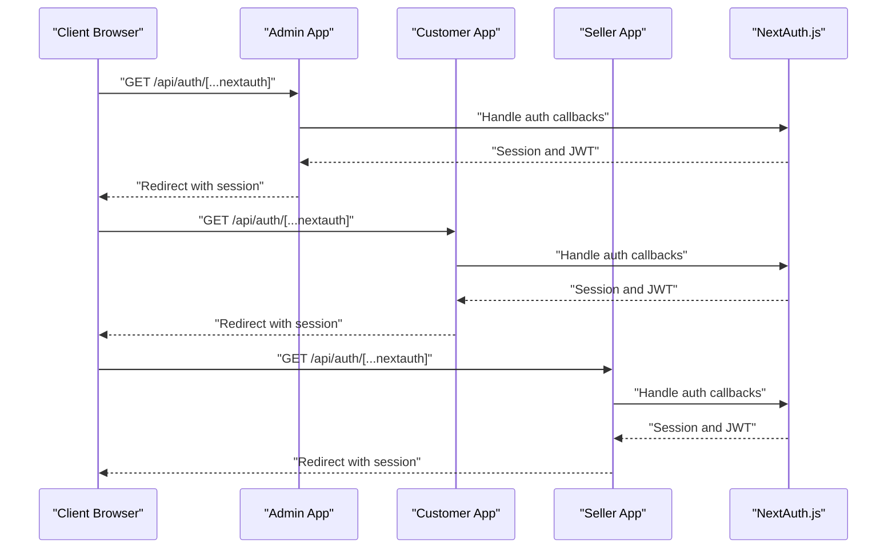
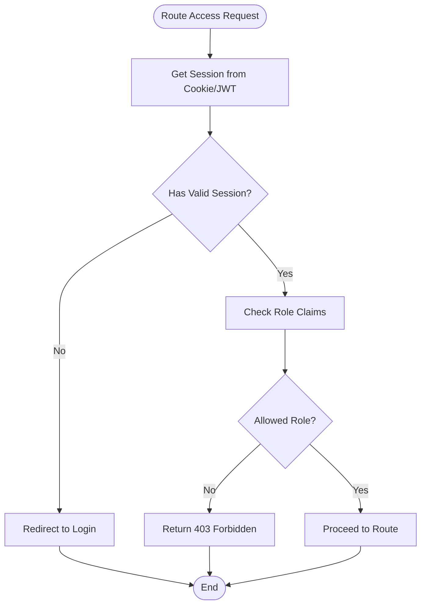
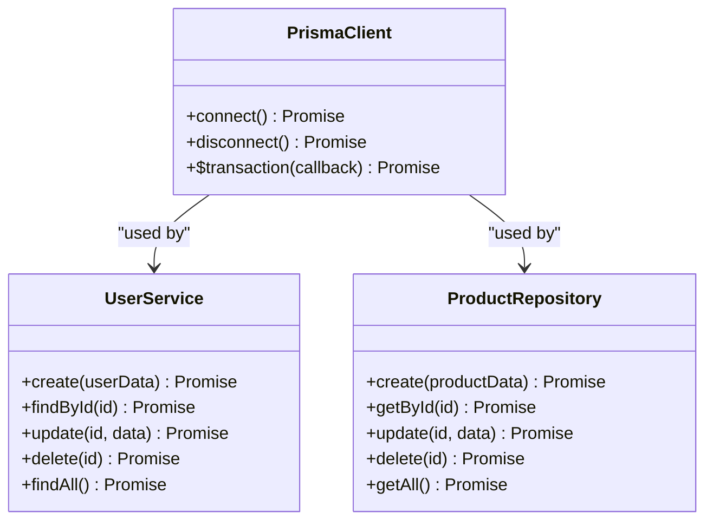
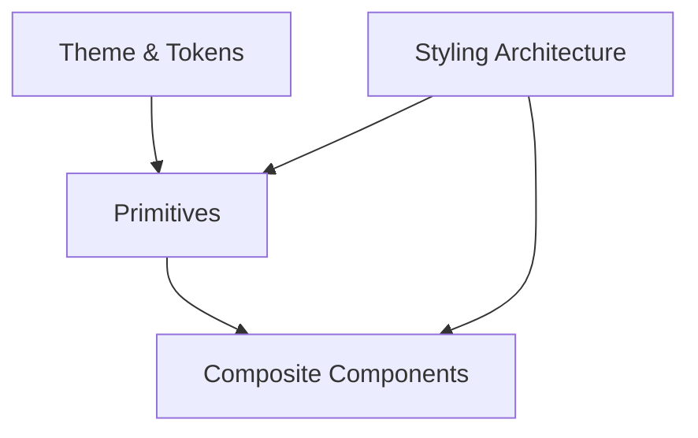
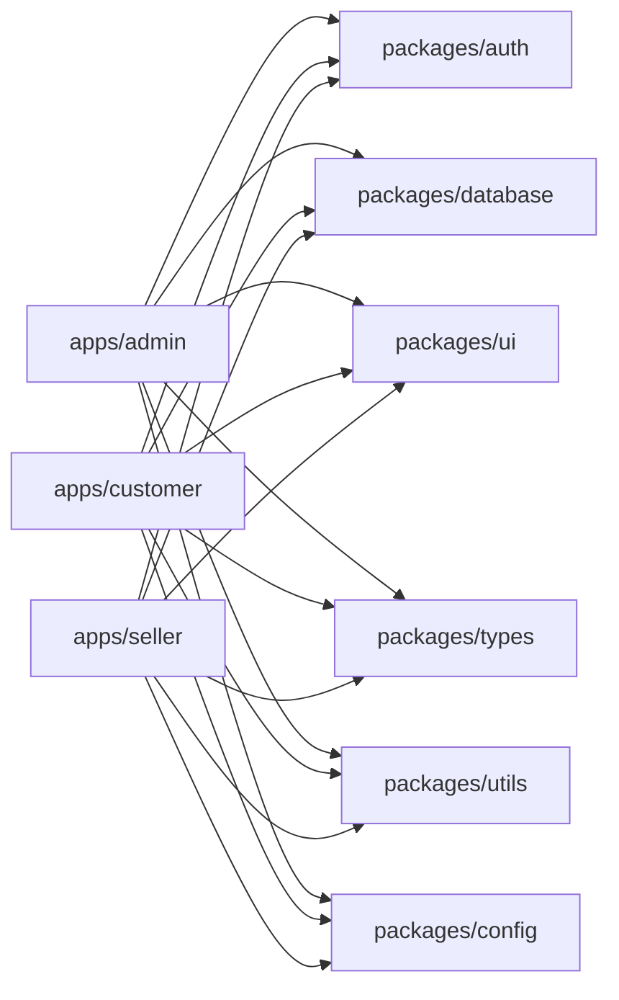

# Shared Packages Architecture

<cite>
**Referenced Files in This Document**
- [package.json](file://package.json)
- [pnpm-workspace.yaml](file://pnpm-workspace.yaml)
- [turbo.json](file://turbo.json)
- [apps/admin/src/lib/auth.ts](file://apps/admin/src/lib/auth.ts)
- [apps/admin/src/lib/auth-instance.ts](file://apps/admin/src/lib/auth-instance.ts)
- [apps/admin/src/middleware.ts](file://apps/admin/src/middleware.ts)
- [apps/customer/src/lib/auth.ts](file://apps/customer/src/lib/auth.ts)
- [apps/customer/src/lib/auth-instance.ts](file://apps/customer/src/lib/auth-instance.ts)
- [apps/customer/src/middleware.ts](file://apps/customer/src/middleware.ts)
- [apps/seller/src/lib/auth.ts](file://apps/seller/src/lib/auth.ts)
- [apps/seller/src/lib/auth-instance.ts](file://apps/seller/src/lib/auth-instance.ts)
- [apps/seller/src/middleware.ts](file://apps/seller/src/middleware.ts)
- [apps/admin/src/app/api/auth/[...nextauth]/route.ts](file://apps/admin/src/app/api/auth/[...nextauth]/route.ts)
- [apps/customer/src/app/api/auth/[...nextauth]/route.ts](file://apps/customer/src/app/api/auth/[...nextauth]/route.ts)
- [apps/seller/src/app/api/auth/[...nextauth]/route.ts](file://apps/seller/src/app/api/auth/[...nextauth]/route.ts)
- [apps/admin/src/app/api/admin/compliance[id]/approve/route.ts](file://apps/admin/src/app/api/admin/compliance[id]/approve/route.ts)
- [apps/admin/src/app/api/admin/products[id]/approve/route.ts](file://apps/admin/src/app/api/admin/products[id]/approve/route.ts)
- [apps/admin/src/app/api/admin/sellers/[id]/approve/route.ts](file://apps/admin/src/app/api/admin/sellers/[id]/approve/route.ts)
- [apps/admin/src/app/api/admin/sellers/[id]/reject/route.ts](file://apps/admin/src/app/api/admin/sellers/[id]/reject/route.ts)
- [apps/admin/src/app/api/admin/dashboard/route.ts](file://apps/admin/src/app/api/admin/dashboard/route.ts)
- [apps/admin/src/app/api/admin/compliance/page.tsx](file://apps/admin/src/app/api/admin/compliance/page.tsx)
- [apps/admin/src/app/api/admin/orders/page.tsx](file://apps/admin/src/app/api/admin/orders/page.tsx)
- [apps/admin/src/app/api/admin/products/page.tsx](file://apps/admin/src/app/api/admin/products/page.tsx)
- [apps/admin/src/app/api/admin/sellers/page.tsx](file://apps/admin/src/app/api/admin/sellers/page.tsx)
- [apps/admin/src/app/api/admin/users/page.tsx](file://apps/admin/src/app/api/admin/users/page.tsx)
- [apps/admin/src/app/api/admin/settings/page.tsx](file://apps/admin/src/app/api/admin/settings/page.tsx)
- [apps/admin/src/app/api/admin/warehouse/page.tsx](file://apps/admin/src/app/api/admin/warehouse/page.tsx)
- [apps/admin/src/app/api/admin/audit/page.tsx](file://apps/admin/src/app/api/admin/audit/page.tsx)
- [apps/admin/src/app/api/admin/finance/page.tsx](file://apps/admin/src/app/api/admin/finance/page.tsx)
- [apps/admin/src/app/api/admin/support/[id]/page.tsx](file://apps/admin/src/app/api/admin/support/[id]/page.tsx)
- [apps/admin/src/app/api/admin/disputes/page.tsx](file://apps/admin/src/app/api/admin/disputes/page.tsx)
- [apps/admin/src/app/api/admin/returns/page.tsx](file://apps/admin/src/app/api/admin/returns/page.tsx)
- [apps/admin/src/app/api/admin/settlements/page.tsx](file://apps/admin/src/app/api/admin/settlements/page.tsx)
- [apps/admin/src/app/api/admin/shipments/page.tsx](file://apps/admin/src/app/api/admin/shipments/page.tsx)
- [apps/admin/src/app/api/admin/vat/page.tsx](file://apps/admin/src/app/api/admin/vat/page.tsx)
- [apps/admin/src/app/api/admin/brands/page.tsx](file://apps/admin/src/app/api/admin/brands/page.tsx)
- [apps/admin/src/app/api/admin/categories/page.tsx](file://apps/admin/src/app/api/admin/categories/page.tsx)
- [apps/admin/src/app/api/admin/companies/page.tsx](file://apps/admin/src/app/api/admin/companies/page.tsx)
- [apps/admin/src/app/api/admin/deals/page.tsx](file://apps/admin/src/app/api/admin/deals/page.tsx)
- [apps/admin/src/app/api/admin/pricing/page.tsx](file://apps/admin/src/app/api/admin/pricing/page.tsx)
- [apps/admin/src/app/api/admin/segments/page.tsx](file://apps/admin/src/app/api/admin/segments/page.tsx)
- [apps/admin/src/app/api/admin/retention/page.tsx](file://apps/admin/src/app/api/admin/retention/page.tsx)
- [apps/admin/src/app/api/admin/performance/page.tsx](file://apps/admin/src/app/api/admin/performance/page.tsx)
- [apps/admin/src/app/api/admin/automation/page.tsx](file://apps/admin/src/app/api/admin/automation/page.tsx)
- [apps/admin/src/app/api/admin/crm/page.tsx](file://apps/admin/src/app/api/admin/crm/page.tsx)
- [apps/admin/src/app/api/admin/integrations/page.tsx](file://apps/admin/src/app/api/admin/integrations/page.tsx)
- [apps/admin/src/app/api/admin/login/page.tsx](file://apps/admin/src/app/api/admin/login/page.tsx)
- [apps/admin/src/app/api/admin/dashboard/dashboard-view.tsx](file://apps/admin/src/app/api/admin/dashboard/dashboard-view.tsx)
- [apps/admin/src/app/api/admin/ai-insights/page.tsx](file://apps/admin/src/app/api/admin/ai-insights/page.tsx)
- [apps/admin/src/app/api/admin/compliance/[id]/approve/route.ts](file://apps/admin/src/app/api/admin/compliance/[id]/approve/route.ts)
- [apps/admin/src/app/api/admin/compliance/[id]/reject/route.ts](file://apps/admin/src/app/api/admin/compliance/[id]/reject/route.ts)
- [apps/admin/src/app/api/admin/compliance/[id]/route.ts](file://apps/admin/src/app/api/admin/compliance/[id]/route.ts)
- [apps/admin/src/app/api/admin/sellers/pending/page.tsx](file://apps/admin/src/app/api/admin/sellers/pending/page.tsx)
- [apps/admin/src/app/api/admin/sellers/[id]/route.ts](file://apps/admin/src/app/api/admin/sellers/[id]/route.ts)
- [apps/admin/src/app/api/admin/sellers/[id]/approve/route.ts](file://apps/admin/src/app/api/admin/sellers/[id]/approve/route.ts)
- [apps/admin/src/app/api/admin/sellers/[id]/reject/route.ts](file://apps/admin/src/app/api/admin/sellers/[id]/reject/route.ts)
- [apps/admin/src/app/api/admin/sellers/[id]/route.ts](file://apps/admin/src/app/api/admin/sellers/[id]/route.ts)
- [apps/admin/src/app/api/admin/sellers/[id]/approve/route.ts](file://apps/admin/src/app/api/admin/sellers/[id]/approve/route.ts)
- [apps/admin/src/app/api/admin/sellers/[id]/reject/route.ts](file://apps/admin/src/app/api/admin/sellers/[id]/reject/route.ts)
- [apps/admin/src/app/api/admin/sellers/[id]/route.ts](file://apps/admin/src/app/api/admin/sellers/[id]/route.ts)
- [apps/admin/src/app/api/admin/sellers/[id]/approve/route.ts](file://apps/admin/src/app/api/admin/sellers/[id]/approve/route.ts)
- [apps/admin/src/app/api/admin/sellers/[id]/reject/route.ts](file://apps/admin/src/app/api/admin/sellers/[id]/reject/route.ts)
- [apps/admin/src/app/api/admin/sellers/[id]/route.ts](file://apps/admin/src/app/api/admin/sellers/[id]/route.ts)
- [apps/admin/src/app/api/admin/sellers/[id]/approve/route.ts](file://apps/admin/src/app/api/admin/sellers/[id]/approve/route.ts)
- [apps/admin/src/app/api/admin/sellers/[id]/reject/route.ts](file://apps/admin/src/app/api/admin/sellers/[id]/reject/route.ts)
- [apps/admin/src/app/api/admin/sellers/[id]/route.ts](file://apps/admin/src/app/api/admin/sellers/[id]/route.ts)
- [apps/admin/src/app/api/admin/sellers/[id]/approve/route.ts](file://apps/admin/src/app/api/admin/sellers/[id]/approve/route.ts)
- [apps/admin/src/app/api/admin/sellers/[id]/reject/route.ts](file://apps/admin/src/app/api/admin/sellers/[id]/reject/route.ts)
- [apps/admin/src/app/api/admin/sellers/[id]/route.ts](file://apps/admin/src/app/api/admin/sellers/[id]/route.ts)
- [apps/admin/src/app/api/admin/sellers/[id]/approve/route.ts](file://apps/admin/src/app/api/admin/sellers/[id]/approve/route.ts)
- [apps/admin/src/app/api/admin/sellers/[id]/reject/route.ts](file://apps/admin/src/app/api/admin/sellers/[id]/reject/route.ts)
- [apps/admin/src/app/api/admin/sellers/[id]/route.ts](file://apps/admin/src/app/api/admin/sellers/[id]/route.ts)
- [apps/admin/src/app/api/admin/sellers/[id]/approve/route.ts](file://apps/admin/src/app/api/admin/sellers/[id]/approve/route.ts)
- [apps/admin/src/app/api/admin/sellers/[id]/reject/route.ts](file://apps......
</cite>

## Table of Contents
1. [Introduction](#introduction)
2. [Project Structure](#project-structure)
3. [Core Components](#core-components)
4. [Architecture Overview](#architecture-overview)
5. [Detailed Component Analysis](#detailed-component-analysis)
6. [Dependency Analysis](#dependency-analysis)
7. [Performance Considerations](#performance-considerations)
8. [Troubleshooting Guide](#troubleshooting-guide)
9. [Conclusion](#conclusion)
10. [Appendices](#appendices)

## Introduction
This document describes the shared packages ecosystem for the avenick-commerce project. It focuses on how authentication is unified across multiple applications using NextAuth.js, how role-based guards are implemented, and how authentication is shared among admin, customer, and seller applications. It also outlines the database abstraction layer, UI component library design, shared types, utilities, and configuration packages, along with inter-package communication patterns and version management via pnpm workspaces and Turborepo.

## Project Structure
The monorepo uses pnpm workspaces and Turborepo to manage multiple applications and shared packages. Applications are located under apps/, while shared packages live under packages/. The workspace configuration defines package discovery and build pipeline orchestration.

**Diagram sources**
- [pnpm-workspace.yaml](file://pnpm-workspace.yaml)
- [turbo.json](file://turbo.json)

**Section sources**
- [pnpm-workspace.yaml](file://pnpm-workspace.yaml)
- [turbo.json](file://turbo.json)

## Core Components
This section summarizes the primary shared packages and their roles:
- Authentication package: Provides NextAuth.js configuration and session utilities used across admin, customer, and seller apps.
- Database package: Offers Prisma schema definitions and service abstractions for data access patterns.
- UI package: Defines a design system foundation, reusable components, and styling architecture.
- Types package: Centralizes shared TypeScript type definitions.
- Utilities package: Encapsulates common functions and helpers.
- Configuration package: Manages shared settings and environment configurations.

**Section sources**
- [package.json](file://package.json)
- [pnpm-workspace.yaml](file://pnpm-workspace.yaml)

## Architecture Overview
The shared packages enable multi-application authentication and consistent data access patterns. Applications delegate authentication concerns to the auth package and data operations to the database package, while reusing UI components and types from their respective shared packages.

**Diagram sources**
- [pnpm-workspace.yaml](file://pnpm-workspace.yaml)
- [turbo.json](file://turbo.json)

## Detailed Component Analysis

### Authentication Package with NextAuth.js Integration
The authentication package centralizes NextAuth.js configuration and session utilities. Each application mounts NextAuth routes under its own API namespace, enabling role-specific sign-in flows and session management. Middleware enforces role-based access control across protected routes.

Key implementation patterns:
- NextAuth route handlers per application under app/api/auth/[...nextauth]/route.ts
- Application-specific auth instances and utilities under apps/*/lib/
- Middleware enforcing role-based guards for protected pages and APIs

**Diagram sources**
- [apps/admin/src/app/api/auth/[...nextauth]/route.ts](file://apps/admin/src/app/api/auth/[...nextauth]/route.ts)
- [apps/customer/src/app/api/auth/[...nextauth]/route.ts](file://apps/customer/src/app/api/auth/[...nextauth]/route.ts)
- [apps/seller/src/app/api/auth/[...nextauth]/route.ts](file://apps/seller/src/app/api/auth/[...nextauth]/route.ts)

Role-based guards:
- Middleware in each application enforces role checks for protected routes.
- Session data includes role claims used to gate access to admin, customer, or seller areas.

**Diagram sources**
- [apps/admin/src/middleware.ts](file://apps/admin/src/middleware.ts)
- [apps/customer/src/middleware.ts](file://apps/customer/src/middleware.ts)
- [apps/seller/src/middleware.ts](file://apps/seller/src/middleware.ts)

**Section sources**
- [apps/admin/src/lib/auth.ts](file://apps/admin/src/lib/auth.ts)
- [apps/admin/src/lib/auth-instance.ts](file://apps/admin/src/lib/auth-instance.ts)
- [apps/admin/src/middleware.ts](file://apps/admin/src/middleware.ts)
- [apps/customer/src/lib/auth.ts](file://apps/customer/src/lib/auth.ts)
- [apps/customer/src/lib/auth-instance.ts](file://apps/customer/src/lib/auth-instance.ts)
- [apps/customer/src/middleware.ts](file://apps/customer/src/middleware.ts)
- [apps/seller/src/lib/auth.ts](file://apps/seller/src/lib/auth.ts)
- [apps/seller/src/lib/auth-instance.ts](file://apps/seller/src/lib/auth-instance.ts)
- [apps/seller/src/middleware.ts](file://apps/seller/src/middleware.ts)
- [apps/admin/src/app/api/auth/[...nextauth]/route.ts](file://apps/admin/src/app/api/auth/[...nextauth]/route.ts)
- [apps/customer/src/app/api/auth/[...nextauth]/route.ts](file://apps/customer/src/app/api/auth/[...nextauth]/route.ts)
- [apps/seller/src/app/api/auth/[...nextauth]/route.ts](file://apps/seller/src/app/api/auth/[...nextauth]/route.ts)

### Database Package with Prisma Schema and Service Layer
The database package encapsulates Prisma schema definitions and service abstractions to standardize data access patterns across applications. It promotes separation of concerns by keeping raw SQL queries and repository logic within services, while exposing clean domain-oriented methods to consumers.

Key implementation patterns:
- Prisma schema definitions under the database package
- Service layer abstractions that wrap Prisma client operations
- Consistent CRUD and query methods across entities

**Diagram sources**
- [packages/database](file://packages/database)

**Section sources**
- [packages/database](file://packages/database)

### UI Component Library with Design System Foundation
The UI package establishes a design system foundation with reusable components and a consistent styling architecture. It ensures visual coherence across admin, customer, and seller applications while maintaining flexibility for customization.

Key implementation patterns:
- Design tokens and theme definitions
- Reusable component primitives and composite components
- Styling architecture using Tailwind CSS and CSS modules

**Diagram sources**
- [apps/admin/src/components/layout/admin-layout.tsx](file://apps/admin/src/components/layout/admin-layout.tsx)
- [apps/customer/src/components/layout/main-layout.tsx](file://apps/customer/src/components/layout/main-layout.tsx)
- [apps/seller/src/components/layout/seller-layout.tsx](file://apps/seller/src/components/layout/seller-layout.tsx)

**Section sources**
- [apps/admin/src/components/layout/admin-layout.tsx](file://apps/admin/src/components/layout/admin-layout.tsx)
- [apps/customer/src/components/layout/main-layout.tsx](file://apps/customer/src/components/layout/main-layout.tsx)
- [apps/seller/src/components/layout/seller-layout.tsx](file://apps/seller/src/components/layout/seller-layout.tsx)

### Types Package for Shared Type Definitions
The types package centralizes shared TypeScript definitions to prevent duplication and ensure consistency across applications and packages. It includes entity types, request/response shapes, and common utility types.

Key implementation patterns:
- Entity types for users, products, orders, etc.
- Request/response interfaces for API endpoints
- Utility types for common transformations

**Section sources**
- [packages/types](file://packages/types)

### Utilities Package for Common Functions
The utilities package consolidates common functions and helpers used across applications, such as email utilities, B2B helpers, and AI-related functions. This reduces duplication and improves maintainability.

Key implementation patterns:
- Email utilities for transactional templates
- B2B registration and validation helpers
- AI assistant utilities

**Section sources**
- [apps/customer/src/lib/email.ts](file://apps/customer/src/lib/email.ts)
- [apps/customer/src/lib/b2b.ts](file://apps/customer/src/lib/b2b.ts)
- [apps/seller/src/lib/ai.ts](file://apps/seller/src/lib/ai.ts)

### Configuration Package for Shared Settings
The configuration package manages shared settings and environment configurations across applications. It ensures consistent behavior and easy maintenance of environment-specific values.

Key implementation patterns:
- Environment variable loading and validation
- Feature flags and toggles
- Application-wide configuration objects

**Section sources**
- [apps/admin/next.config.mjs](file://apps/admin/next.config.mjs)
- [apps/customer/next.config.mjs](file://apps/customer/next.config.mjs)
- [apps/seller/next.config.mjs](file://apps/seller/next.config.mjs)

## Dependency Analysis
Inter-package communication follows a unidirectional dependency model: applications depend on shared packages, but shared packages remain independent to avoid circular dependencies. Version management is handled by pnpm workspaces, ensuring consistent dependency versions across the monorepo.

**Diagram sources**
- [pnpm-workspace.yaml](file://pnpm-workspace.yaml)
- [turbo.json](file://turbo.json)

**Section sources**
- [pnpm-workspace.yaml](file://pnpm-workspace.yaml)
- [turbo.json](file://turbo.json)

## Performance Considerations
- Use NextAuth.js session caching to minimize repeated database lookups during authentication.
- Leverage database package service abstractions to optimize queries and reduce N+1 problems.
- Apply Tailwind CSS purging and component memoization to improve UI performance.
- Utilize Turborepo caching to accelerate builds and reduce redundant computations.

## Troubleshooting Guide
Common issues and resolutions:
- Authentication failures: Verify NextAuth routes are mounted correctly under each application and that cookies/JWT are properly configured.
- Role-based access errors: Confirm middleware checks align with session role claims and that protected routes are gated appropriately.
- Database connectivity: Ensure Prisma client initialization and connection pooling are configured consistently across services.
- UI rendering inconsistencies: Check theme tokens and component prop interfaces for mismatches across applications.

**Section sources**
- [apps/admin/src/middleware.ts](file://apps/admin/src/middleware.ts)
- [apps/customer/src/middleware.ts](file://apps/customer/src/middleware.ts)
- [apps/seller/src/middleware.ts](file://apps/seller/src/middleware.ts)

## Conclusion
The shared packages ecosystem enables scalable, maintainable, and consistent development across multiple applications. By centralizing authentication, data access, UI components, types, utilities, and configuration, teams can collaborate effectively while preserving architectural integrity and performance.

## Appendices
- API endpoint coverage across admin application demonstrates extensive use of role-based guards and NextAuth integration for approvals, compliance, products, sellers, and administrative dashboards.

**Section sources**
- [apps/admin/src/app/api/admin/compliance/[id]/approve/route.ts](file://apps/admin/src/app/api/admin/compliance/[id]/approve/route.ts)
- [apps/admin/src/app/api/admin/products/[id]/approve/route.ts](file://apps/admin/src/app/api/admin/products/[id]/approve/route.ts)
- [apps/admin/src/app/api/admin/sellers/[id]/approve/route.ts](file://apps/admin/src/app/api/admin/sellers/[id]/approve/route.ts)
- [apps/admin/src/app/api/admin/sellers/[id]/reject/route.ts](file://apps/admin/src/app/api/admin/sellers/[id]/reject/route.ts)
- [apps/admin/src/app/api/admin/dashboard/route.ts](file://apps/admin/src/app/api/admin/dashboard/route.ts)
- [apps/admin/src/app/api/admin/compliance/page.tsx](file://apps/admin/src/app/api/admin/compliance/page.tsx)
- [apps/admin/src/app/api/admin/orders/page.tsx](file://apps/admin/src/app/api/admin/orders/page.tsx)
- [apps/admin/src/app/api/admin/products/page.tsx](file://apps/admin/src/app/api/admin/products/page.tsx)
- [apps/admin/src/app/api/admin/sellers/page.tsx](file://apps/admin/src/app/api/admin/sellers/page.tsx)
- [apps/admin/src/app/api/admin/users/page.tsx](file://apps/admin/src/app/api/admin/users/page.tsx)
- [apps/admin/src/app/api/admin/settings/page.tsx](file://apps/admin/src/app/api/admin/settings/page.tsx)
- [apps/admin/src/app/api/admin/warehouse/page.tsx](file://apps/admin/src/app/api/admin/warehouse/page.tsx)
- [apps/admin/src/app/api/admin/audit/page.tsx](file://apps/admin/src/app/api/admin/audit/page.tsx)
- [apps/admin/src/app/api/admin/finance/page.tsx](file://apps/admin/src/app/api/admin/finance/page.tsx)
- [apps/admin/src/app/api/admin/support/[id]/page.tsx](file://apps/admin/src/app/api/admin/support/[id]/page.tsx)
- [apps/admin/src/app/api/admin/disputes/page.tsx](file://apps/admin/src/app/api/admin/disputes/page.tsx)
- [apps/admin/src/app/api/admin/returns/page.tsx](file://apps/admin/src/app/api/admin/returns/page.tsx)
- [apps/admin/src/app/api/admin/settlements/page.tsx](file://apps/admin/src/app/api/admin/settlements/page.tsx)
- [apps/admin/src/app/api/admin/shipments/page.tsx](file://apps/admin/src/app/api/admin/shipments/page.tsx)
- [apps/admin/src/app/api/admin/vat/page.tsx](file://apps/admin/src/app/api/admin/vat/page.tsx)
- [apps/admin/src/app/api/admin/brands/page.tsx](file://apps/admin/src/app/api/admin/brands/page.tsx)
- [apps/admin/src/app/api/admin/categories/page.tsx](file://apps/admin/src/app/api/admin/categories/page.tsx)
- [apps/admin/src/app/api/admin/companies/page.tsx](file://apps/admin/src/app/api/admin/companies/page.tsx)
- [apps/admin/src/app/api/admin/deals/page.tsx](file://apps/admin/src/app/api/admin/deals/page.tsx)
- [apps/admin/src/app/api/admin/pricing/page.tsx](file://apps/admin/src/app/api/admin/pricing/page.tsx)
- [apps/admin/src/app/api/admin/segments/page.tsx](file://apps/admin/src/app/api/admin/segments/page.tsx)
- [apps/admin/src/app/api/admin/retention/page.tsx](file://apps/admin/src/app/api/admin/retention/page.tsx)
- [apps/admin/src/app/api/admin/performance/page.tsx](file://apps/admin/src/app/api/admin/performance/page.tsx)
- [apps/admin/src/app/api/admin/automation/page.tsx](file://apps/admin/src/app/api/admin/automation/page.tsx)
- [apps/admin/src/app/api/admin/crm/page.tsx](file://apps/admin/src/app/api/admin/crm/page.tsx)
- [apps/admin/src/app/api/admin/integrations/page.tsx](file://apps/admin/src/app/api/admin/integrations/page.tsx)
- [apps/admin/src/app/api/admin/login/page.tsx](file://apps/admin/src/app/api/admin/login/page.tsx)
- [apps/admin/src/app/api/admin/dashboard/dashboard-view.tsx](file://apps/admin/src/app/api/admin/dashboard/dashboard-view.tsx)
- [apps/admin/src/app/api/admin/ai-insights/page.tsx](file://apps/admin/src/app/api/admin/ai-insights/page.tsx)