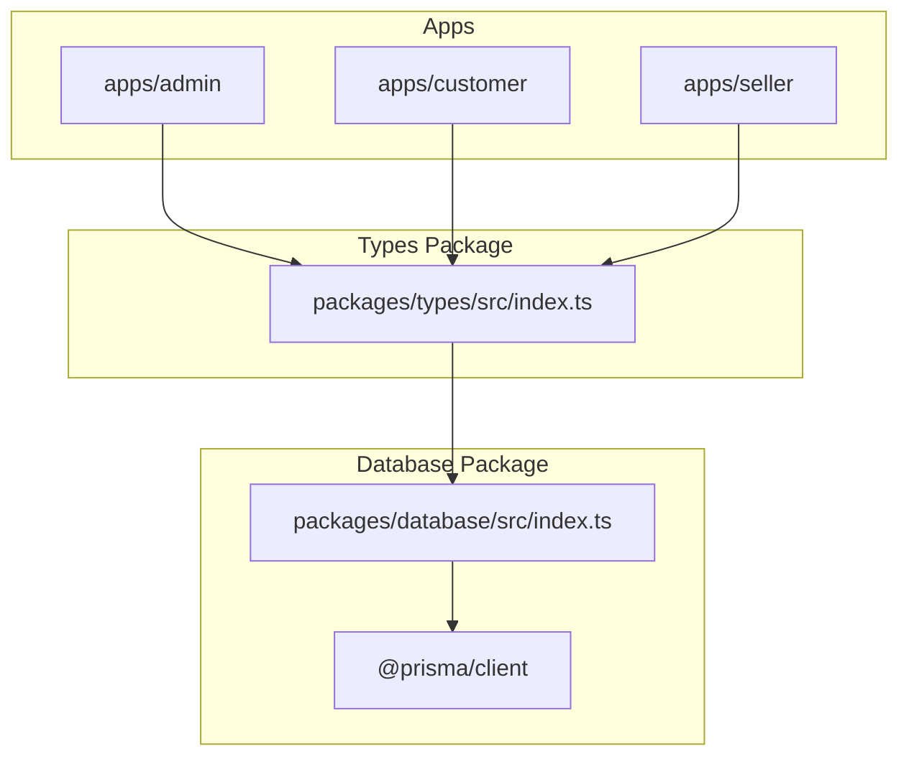
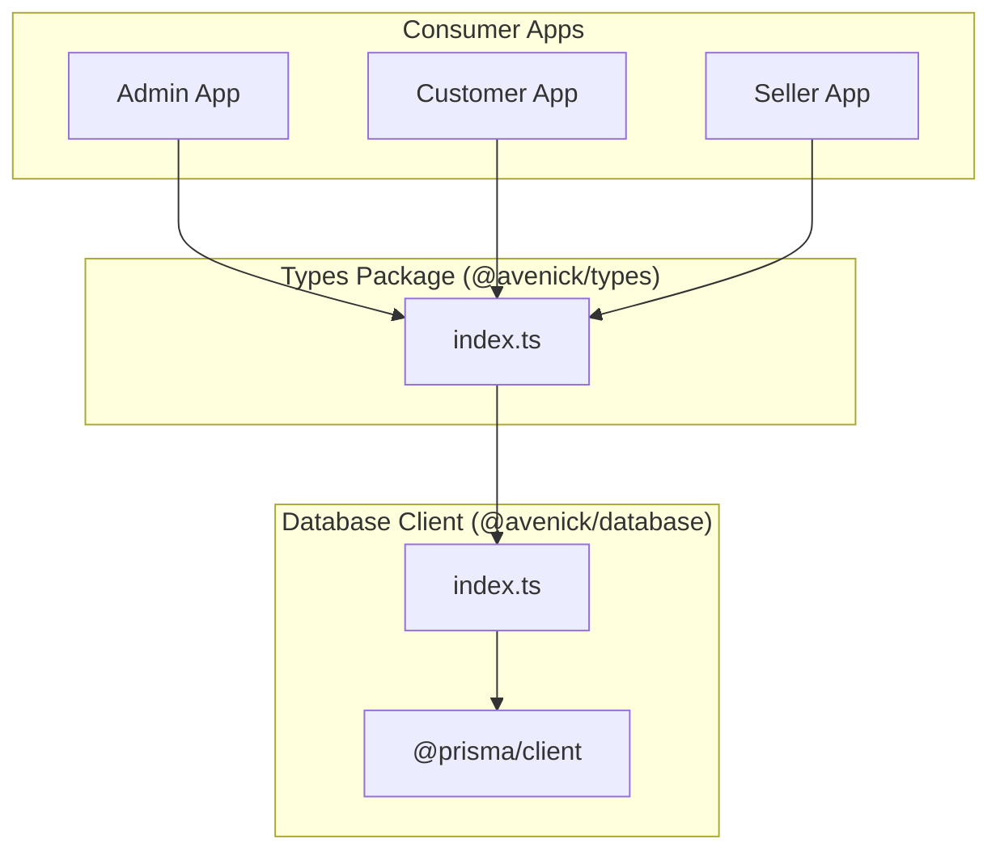
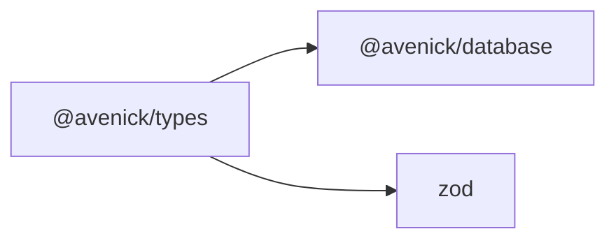

# Types Package

<cite>
**Referenced Files in This Document**
- [package.json](file://packages/types/package.json)
- [index.ts](file://packages/types/src/index.ts)
- [index.ts](file://packages/database/src/index.ts)
- [package.json](file://packages/database/package.json)
</cite>

## Table of Contents
1. [Introduction](#introduction)
2. [Project Structure](#project-structure)
3. [Core Components](#core-components)
4. [Architecture Overview](#architecture-overview)
5. [Detailed Component Analysis](#detailed-component-analysis)
6. [Dependency Analysis](#dependency-analysis)
7. [Performance Considerations](#performance-considerations)
8. [Troubleshooting Guide](#troubleshooting-guide)
9. [Conclusion](#conclusion)

## Introduction
This document describes the types package and its role in the monorepo’s shared type system. The types package centralizes commonly used TypeScript types, enums, and re-exports from the database client to ensure consistent type definitions across applications and services. It also exposes Zod-related types for runtime validation schemas and integrates with Prisma-generated types to maintain strong typing across the platform.

## Project Structure
The types package is a small, focused module that primarily re-exports types and enums from the database client and exposes a curated set of shared types and enums. It does not define its own standalone type definitions but serves as a single entry point for consumers to import shared types consistently.

**Diagram sources**
- [index.ts:1-50](file://packages/types/src/index.ts#L1-L50)
- [index.ts:1-29](file://packages/database/src/index.ts#L1-L29)

**Section sources**
- [package.json:1-18](file://packages/types/package.json#L1-L18)
- [index.ts:1-50](file://packages/types/src/index.ts#L1-L50)
- [index.ts:1-29](file://packages/database/src/index.ts#L1-L29)

## Core Components
- Shared business entity types: Re-exported from the database client, including users, companies, sellers, products, orders, categories, addresses, notifications, payouts, approval policies, and compliance documents.
- Business enums: Re-exported enums for roles, statuses, languages, countries, currencies, industries, company sizes, seller types/tiers/statuses, document types/statuses, product/pricing/order/payment/purchase order/notification/payout statuses.
- Validation schema types: Exposed via Zod integration to enable consistent runtime validation across APIs and services.
- Utility exports: Provides a consolidated import surface for consumers to avoid scattered imports across the monorepo.

These components collectively ensure type safety and consistency across the admin, customer, and seller portals.

**Section sources**
- [index.ts:4-49](file://packages/types/src/index.ts#L4-L49)

## Architecture Overview
The types package acts as a façade over the database client, exposing a curated subset of Prisma-generated types and enums. Consumers in the apps import from the types package rather than directly from the database client, simplifying maintenance and enforcing a single source of truth for shared types.

**Diagram sources**
- [index.ts:1-50](file://packages/types/src/index.ts#L1-L50)
- [index.ts:1-29](file://packages/database/src/index.ts#L1-L29)

## Detailed Component Analysis

### Shared Entity Types
The types package re-exports numerous business entity types from the database client, ensuring consistent definitions across applications. These include:
- Users, companies, and company members
- Sellers, seller profiles, and documents
- Products, variants, prices, and inventory
- Orders, order items, and purchase orders
- Categories, addresses, notifications, payouts, approval policies, and compliance documents

This consolidation reduces duplication and ensures that changes to entity schemas propagate uniformly.

**Section sources**
- [index.ts:5-24](file://packages/types/src/index.ts#L5-L24)

### Business Enums
The types package re-exports a comprehensive set of enums covering:
- User roles and statuses
- Localization: language, country, currency
- Company attributes: industry, size, status
- Seller classification: type, tier, status
- Documents: type, status
- Product and pricing: status, type
- Orders: type, status, payment method, payment status
- Purchase orders: status
- Notifications: type
- Payouts: status

These enums standardize domain semantics and improve type safety for business logic.

**Section sources**
- [index.ts:26-49](file://packages/types/src/index.ts#L26-L49)

### Validation Schema Types
The types package depends on Zod for runtime validation. While the package itself re-exports types from the database client, consumers can leverage Zod schemas alongside these types to validate API requests and responses consistently.

**Section sources**
- [package.json:9-12](file://packages/types/package.json#L9-L12)

### Type Guards and Utility Types
The current implementation focuses on re-exporting existing types and enums. There are no explicit custom type guards or utility types defined within the types package. Consumers can define their own type guards and utility types locally as needed, while still importing shared base types from this package.

[No sources needed since this section summarizes the absence of specific implementations in the types package]

### Generic Type Patterns
There are no custom generic type patterns defined in the types package. Consumers can compose generics with the re-exported types to build reusable patterns across the monorepo.

[No sources needed since this section summarizes the absence of specific implementations in the types package]

### API Request/Response Type Definitions
The types package does not define API-specific request/response types. Instead, it exposes shared domain types and enums that can be combined with Zod schemas to construct request/response shapes in individual apps or services.

[No sources needed since this section summarizes the absence of specific implementations in the types package]

### Error Handling Types
There are no dedicated error handling types defined in the types package. Consumers can define their own error types and integrate them with the shared domain types.

[No sources needed since this section summarizes the absence of specific implementations in the types package]

## Dependency Analysis
The types package depends on:
- The database client package for Prisma-generated types and enums
- Zod for validation-related type support

**Diagram sources**
- [package.json:9-12](file://packages/types/package.json#L9-L12)

**Section sources**
- [package.json:1-18](file://packages/types/package.json#L1-L18)
- [package.json:22-32](file://packages/database/package.json#L22-L32)

## Performance Considerations
- Centralized re-exports reduce bundle duplication and improve compile-time consistency.
- Consumers should import only what they need from the types package to minimize unnecessary type checks and reduce bundle size.
- Keep the number of re-exported types manageable to avoid bloating the public API surface.

[No sources needed since this section provides general guidance]

## Troubleshooting Guide
- If types appear missing after updates, ensure the database client is generating types and that the types package re-exports are aligned with the latest Prisma schema.
- When adding new enums or entity types, update the types package re-exports to expose them consistently across the monorepo.
- For validation issues, verify that Zod schemas align with the shared types and enums exposed by the types package.

[No sources needed since this section provides general guidance]

## Conclusion
The types package provides a centralized, curated export of shared business entity types and enums, along with integration points for validation schemas. By re-exporting Prisma-generated types and enums, it ensures consistent type definitions across applications while maintaining a clean, single-source-of-truth import surface. Extending the package with custom type guards, utility types, and API-specific schemas can further enhance type safety and developer productivity across the monorepo.