# UI Component Library

<cite>
**Referenced Files in This Document**
- [DESIGN_SYSTEM_NOTES.md](file://DESIGN_SYSTEM_NOTES.md)
- [admin/tailwind.config.js](file://apps/admin/tailwind.config.js)
- [customer/tailwind.config.js](file://apps/customer/tailwind.config.js)
- [seller/tailwind.config.js](file://apps/seller/tailwind.config.js)
- [admin/postcss.config.js](file://apps/admin/postcss.config.js)
- [customer/postcss.config.js](file://apps/customer/postcss.config.js)
- [seller/postcss.config.js](file://apps/seller/postcss.config.js)
- [admin/globals.css](file://apps/admin/src/app/globals.css)
- [customer/globals.css](file://apps/customer/src/app/globals.css)
- [seller/globals.css](file://apps/seller/src/app/globals.css)
- [admin/layout.tsx](file://apps/admin/src/app/layout.tsx)
- [customer/layout.tsx](file://apps/customer/src/app/layout.tsx)
- [seller/layout.tsx](file://apps/seller/src/app/layout.tsx)
- [admin/components/layout/admin-layout.tsx](file://apps/admin/src/components/layout/admin-layout.tsx)
- [customer/components/layout/main-layout.tsx](file://apps/customer/src/components/layout/main-layout.tsx)
- [seller/components/layout/seller-layout.tsx](file://apps/seller/src/components/layout/seller-layout.tsx)
- [customer/components/products/product-card.tsx](file://apps/customer/src/components/products/product-card.tsx)
- [customer/components/products/sort-select.tsx](file://apps/customer/src/components/products/sort-select.tsx)
- [customer/components/b2b/b2b-shell.tsx](file://apps/customer/src/components/b2b/b2b-shell.tsx)
- [customer/components/b2b/reorder-button.tsx](file://apps/customer/src/components/b2b/reorder-button.tsx)
- [customer/components/b2b/validated-form.tsx](file://apps/customer/src/components/b2b/validated-form.tsx)
- [seller/components/orders-table.tsx](file://apps/seller/src/components/orders-table.tsx)
- [seller/components/products-table.tsx](file://apps/seller/src/components/products-table.tsx)
- [seller/components/saved-views.tsx](file://apps/seller/src/components/saved-views.tsx)
- [seller/components/command-palette.tsx](file://apps/seller/src/components/command-palette.tsx)
- [seller/components/notification-bell.tsx](file://apps/seller/src/components/notification-bell.tsx)
- [seller/components/onboarding-checklist.tsx](file://apps/seller/src/components/onboarding-checklist.tsx)
- [seller/components/ai-assist.tsx](file://apps/seller/src/components/ai-assist.tsx)
- [seller/components/toast.tsx](file://apps/seller/src/components/toast.tsx)
- [admin/components/layout/admin-layout.tsx](file://apps/admin/src/components/layout/admin-layout.tsx)
- [customer/components/layout/footer.tsx](file://apps/customer/src/components/layout/footer.tsx)
- [customer/components/layout/header.tsx](file://apps/customer/src/components/layout/header.tsx)
- [customer/components/layout/role-switcher.tsx](file://apps/customer/src/components/layout/role-switcher.tsx)
</cite>

## Table of Contents
1. [Introduction](#introduction)
2. [Project Structure](#project-structure)
3. [Core Components](#core-components)
4. [Architecture Overview](#architecture-overview)
5. [Detailed Component Analysis](#detailed-component-analysis)
6. [Dependency Analysis](#dependency-analysis)
7. [Performance Considerations](#performance-considerations)
8. [Troubleshooting Guide](#troubleshooting-guide)
9. [Conclusion](#conclusion)
10. [Appendices](#appendices)

## Introduction
This document describes the UI component library and design system foundation for the marketplace platform. It covers design tokens, color schemes, typography, spacing, and Tailwind CSS configuration across the admin, customer, and seller applications. It also documents reusable React components, their props/events/customization options, composition patterns, responsive design principles, accessibility considerations, cross-browser compatibility, and development/testing/documentation standards.

## Project Structure
The UI system is shared across three Next.js applications (admin, customer, seller), each with its own Tailwind and PostCSS configuration, global styles, and layout components. The design system guidance is centralized in a shared notes file.

```mermaid
graph TB
subgraph "Admin App"
A_T["apps/admin/tailwind.config.js"]
A_P["apps/admin/postcss.config.js"]
A_G["apps/admin/src/app/globals.css"]
A_L["apps/admin/src/app/layout.tsx"]
A_LL["apps/admin/src/components/layout/admin-layout.tsx"]
end
subgraph "Customer App"
C_T["apps/customer/tailwind.config.js"]
C_P["apps/customer/postcss.config.js"]
C_G["apps/customer/src/app/globals.css"]
C_L["apps/customer/src/app/layout.tsx"]
C_LL["apps/customer/src/components/layout/main-layout.tsx"]
C_F["apps/customer/src/components/layout/footer.tsx"]
C_H["apps/customer/src/components/layout/header.tsx"]
C_RS["apps/customer/src/components/layout/role-switcher.tsx"]
end
subgraph "Seller App"
S_T["apps/seller/tailwind.config.js"]
S_P["apps/seller/postcss.config.js"]
S_G["apps/seller/src/app/globals.css"]
S_L["apps/seller/src/app/layout.tsx"]
S_LL["apps/seller/src/components/layout/seller-layout.tsx"]
end
DS["DESIGN_SYSTEM_NOTES.md"]
DS --> A_T
DS --> C_T
DS --> S_T
A_T --> A_P
C_T --> C_P
S_T --> S_P
A_T --> A_G
C_T --> C_G
S_T --> S_G
A_T --> A_L
C_T --> C_L
S_T --> S_L
```

**Diagram sources**
- [admin/tailwind.config.js](file://apps/admin/tailwind.config.js)
- [customer/tailwind.config.js](file://apps/customer/tailwind.config.js)
- [seller/tailwind.config.js](file://apps/seller/tailwind.config.js)
- [admin/postcss.config.js](file://apps/admin/postcss.config.js)
- [customer/postcss.config.js](file://apps/customer/postcss.config.js)
- [seller/postcss.config.js](file://apps/seller/postcss.config.js)
- [admin/globals.css](file://apps/admin/src/app/globals.css)
- [customer/globals.css](file://apps/customer/src/app/globals.css)
- [seller/globals.css](file://apps/seller/src/app/globals.css)
- [admin/layout.tsx](file://apps/admin/src/app/layout.tsx)
- [customer/layout.tsx](file://apps/customer/src/app/layout.tsx)
- [seller/layout.tsx](file://apps/seller/src/app/layout.tsx)
- [DESIGN_SYSTEM_NOTES.md](file://DESIGN_SYSTEM_NOTES.md)

**Section sources**
- [admin/tailwind.config.js](file://apps/admin/tailwind.config.js)
- [customer/tailwind.config.js](file://apps/customer/tailwind.config.js)
- [seller/tailwind.config.js](file://apps/seller/tailwind.config.js)
- [admin/postcss.config.js](file://apps/admin/postcss.config.js)
- [customer/postcss.config.js](file://apps/customer/postcss.config.js)
- [seller/postcss.config.js](file://apps/seller/postcss.config.js)
- [admin/globals.css](file://apps/admin/src/app/globals.css)
- [customer/globals.css](file://apps/customer/src/app/globals.css)
- [seller/globals.css](file://apps/seller/src/app/globals.css)
- [admin/layout.tsx](file://apps/admin/src/app/layout.tsx)
- [customer/layout.tsx](file://apps/customer/src/app/layout.tsx)
- [seller/layout.tsx](file://apps/seller/src/app/layout.tsx)
- [DESIGN_SYSTEM_NOTES.md](file://DESIGN_SYSTEM_NOTES.md)

## Core Components
This section outlines the foundational design system and reusable components used across applications.

- Design tokens and design system guidance
  - Centralized design system notes define tokens, color schemes, typography, and spacing. These serve as the single source of truth for consistent UI implementation.
  - Reference: [DESIGN_SYSTEM_NOTES.md](file://DESIGN_SYSTEM_NOTES.md)

- Tailwind CSS configuration
  - Each app defines its own Tailwind configuration, enabling scoped design tokens and variants per application.
  - Reference: [admin/tailwind.config.js](file://apps/admin/tailwind.config.js), [customer/tailwind.config.js](file://apps/customer/tailwind.config.js), [seller/tailwind.config.js](file://apps/seller/tailwind.config.js)

- PostCSS pipeline
  - PostCSS is configured per app to process Tailwind CSS and related transformations.
  - Reference: [admin/postcss.config.js](file://apps/admin/postcss.config.js), [customer/postcss.config.js](file://apps/customer/postcss.config.js), [seller/postcss.config.js](file://apps/seller/postcss.config.js)

- Global styles and layouts
  - Global CSS files establish base styles and theme roots.
  - Layout components wrap pages and provide consistent navigation and shell behavior.
  - References: [admin/globals.css](file://apps/admin/src/app/globals.css), [customer/globals.css](file://apps/customer/src/app/globals.css), [seller/globals.css](file://apps/seller/src/app/globals.css), [admin/layout.tsx](file://apps/admin/src/app/layout.tsx), [customer/layout.tsx](file://apps/customer/src/app/layout.tsx), [seller/layout.tsx](file://apps/seller/src/app/layout.tsx)

- Reusable components
  - Customer app components include product card, sort select, B2B shell, reorder button, and validated form.
  - Seller app components include orders table, products table, saved views, command palette, notification bell, onboarding checklist, AI assist, and toast.
  - Admin app layout component provides administrative shell.
  - References: [customer/components/products/product-card.tsx](file://apps/customer/src/components/products/product-card.tsx), [customer/components/products/sort-select.tsx](file://apps/customer/src/components/products/sort-select.tsx), [customer/components/b2b/b2b-shell.tsx](file://apps/customer/src/components/b2b/b2b-shell.tsx), [customer/components/b2b/reorder-button.tsx](file://apps/customer/src/components/b2b/reorder-button.tsx), [customer/components/b2b/validated-form.tsx](file://apps/customer/src/components/b2b/validated-form.tsx), [seller/components/orders-table.tsx](file://apps/seller/src/components/orders-table.tsx), [seller/components/products-table.tsx](file://apps/seller/src/components/products-table.tsx), [seller/components/saved-views.tsx](file://apps/seller/src/components/saved-views.tsx), [seller/components/command-palette.tsx](file://apps/seller/src/components/command-palette.tsx), [seller/components/notification-bell.tsx](file://apps/seller/src/components/notification-bell.tsx), [seller/components/onboarding-checklist.tsx](file://apps/seller/src/components/onboarding-checklist.tsx), [seller/components/ai-assist.tsx](file://apps/seller/src/components/ai-assist.tsx), [seller/components/toast.tsx](file://apps/seller/src/components/toast.tsx), [admin/components/layout/admin-layout.tsx](file://apps/admin/src/components/layout/admin-layout.tsx)

**Section sources**
- [DESIGN_SYSTEM_NOTES.md](file://DESIGN_SYSTEM_NOTES.md)
- [admin/tailwind.config.js](file://apps/admin/tailwind.config.js)
- [customer/tailwind.config.js](file://apps/customer/tailwind.config.js)
- [seller/tailwind.config.js](file://apps/seller/tailwind.config.js)
- [admin/postcss.config.js](file://apps/admin/postcss.config.js)
- [customer/postcss.config.js](file://apps/customer/postcss.config.js)
- [seller/postcss.config.js](file://apps/seller/postcss.config.js)
- [admin/globals.css](file://apps/admin/src/app/globals.css)
- [customer/globals.css](file://apps/customer/src/app/globals.css)
- [seller/globals.css](file://apps/seller/src/app/globals.css)
- [admin/layout.tsx](file://apps/admin/src/app/layout.tsx)
- [customer/layout.tsx](file://apps/customer/src/app/layout.tsx)
- [seller/layout.tsx](file://apps/seller/src/app/layout.tsx)
- [customer/components/products/product-card.tsx](file://apps/customer/src/components/products/product-card.tsx)
- [customer/components/products/sort-select.tsx](file://apps/customer/src/components/products/sort-select.tsx)
- [customer/components/b2b/b2b-shell.tsx](file://apps/customer/src/components/b2b/b2b-shell.tsx)
- [customer/components/b2b/reorder-button.tsx](file://apps/customer/src/components/b2b/reorder-button.tsx)
- [customer/components/b2b/validated-form.tsx](file://apps/customer/src/components/b2b/validated-form.tsx)
- [seller/components/orders-table.tsx](file://apps/seller/src/components/orders-table.tsx)
- [seller/components/products-table.tsx](file://apps/seller/src/components/products-table.tsx)
- [seller/components/saved-views.tsx](file://apps/seller/src/components/saved-views.tsx)
- [seller/components/command-palette.tsx](file://apps/seller/src/components/command-palette.tsx)
- [seller/components/notification-bell.tsx](file://apps/seller/src/components/notification-bell.tsx)
- [seller/components/onboarding-checklist.tsx](file://apps/seller/src/components/onboarding-checklist.tsx)
- [seller/components/ai-assist.tsx](file://apps/seller/src/components/ai-assist.tsx)
- [seller/components/toast.tsx](file://apps/seller/src/components/toast.tsx)
- [admin/components/layout/admin-layout.tsx](file://apps/admin/src/components/layout/admin-layout.tsx)

## Architecture Overview
The UI architecture follows a design-token-driven approach with Tailwind CSS and PostCSS per application. Global styles and layout components provide consistent shell behavior across apps. Reusable components encapsulate presentation and interaction logic.

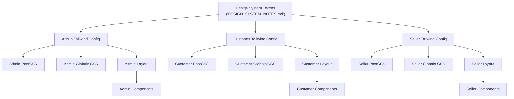

**Diagram sources**
- [DESIGN_SYSTEM_NOTES.md](file://DESIGN_SYSTEM_NOTES.md)
- [admin/tailwind.config.js](file://apps/admin/tailwind.config.js)
- [customer/tailwind.config.js](file://apps/customer/tailwind.config.js)
- [seller/tailwind.config.js](file://apps/seller/tailwind.config.js)
- [admin/postcss.config.js](file://apps/admin/postcss.config.js)
- [customer/postcss.config.js](file://apps/customer/postcss.config.js)
- [seller/postcss.config.js](file://apps/seller/postcss.config.js)
- [admin/globals.css](file://apps/admin/src/app/globals.css)
- [customer/globals.css](file://apps/customer/src/app/globals.css)
- [seller/globals.css](file://apps/seller/src/app/globals.css)
- [admin/layout.tsx](file://apps/admin/src/app/layout.tsx)
- [customer/layout.tsx](file://apps/customer/src/app/layout.tsx)
- [seller/layout.tsx](file://apps/seller/src/app/layout.tsx)

## Detailed Component Analysis

### Product Card (Customer)
Reusable component for displaying product information with interactive controls.

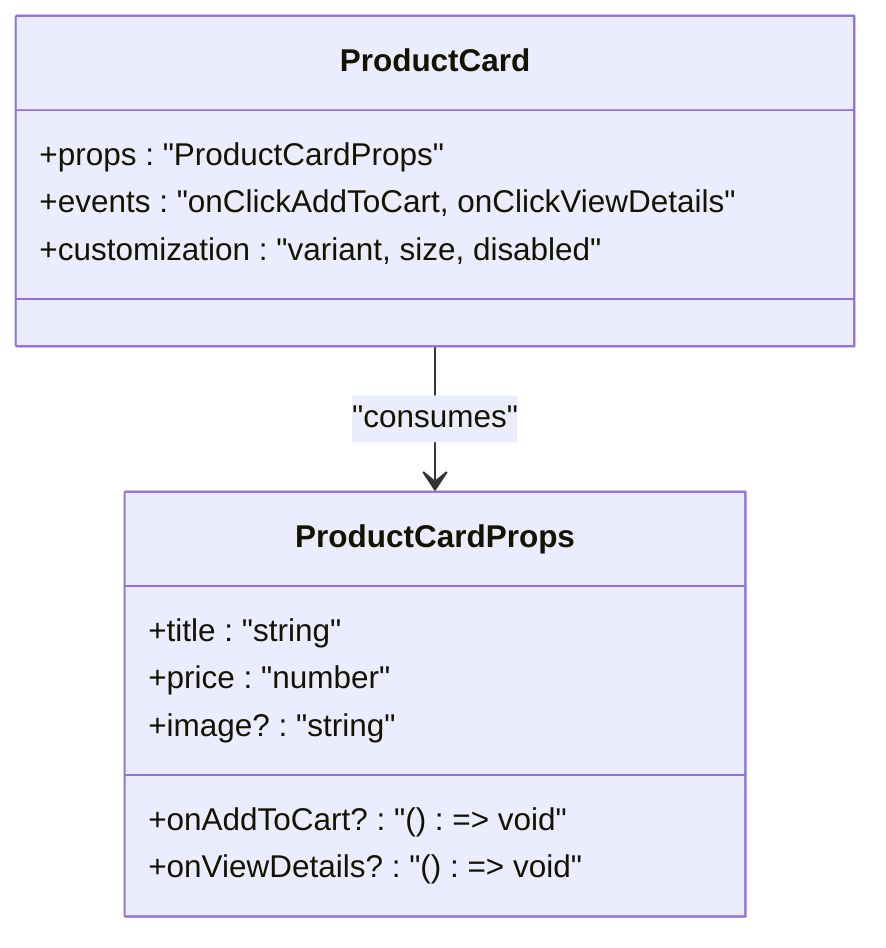

**Diagram sources**
- [customer/components/products/product-card.tsx](file://apps/customer/src/components/products/product-card.tsx)

**Section sources**
- [customer/components/products/product-card.tsx](file://apps/customer/src/components/products/product-card.tsx)

### Sort Select (Customer)
Dropdown component for sorting product listings.

```mermaid
classDiagram
class SortSelect {
+props : "SortSelectProps"
+events : "onChange(value)"
}
class SortSelectProps {
+options : "Array<{ value : string, label : string }>"
+value : "string"
+onChange : "(value : string) => void"
}
SortSelect --> SortSelectProps : "consumes"
```

**Diagram sources**
- [customer/components/products/sort-select.tsx](file://apps/customer/src/components/products/sort-select.tsx)

**Section sources**
- [customer/components/products/sort-select.tsx](file://apps/customer/src/components/products/sort-select.tsx)

### B2B Shell (Customer)
Shell component for B2B contexts with navigation and content area.

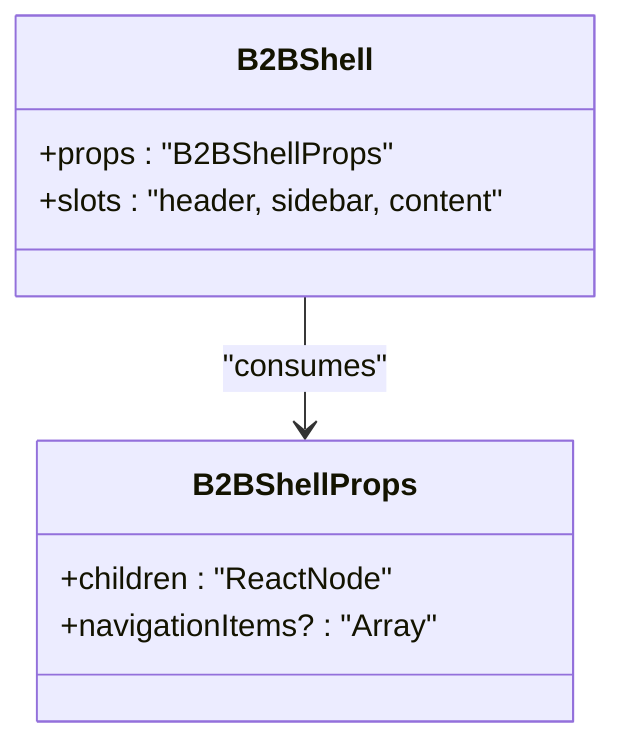

**Diagram sources**
- [customer/components/b2b/b2b-shell.tsx](file://apps/customer/src/components/b2b/b2b-shell.tsx)

**Section sources**
- [customer/components/b2b/b2b-shell.tsx](file://apps/customer/src/components/b2b/b2b-shell.tsx)

### Reorder Button (Customer)
Button component to trigger reorder actions.

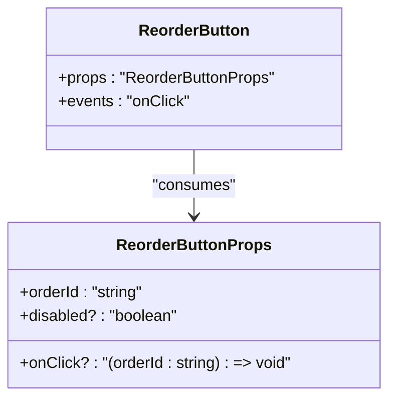

**Diagram sources**
- [customer/components/b2b/reorder-button.tsx](file://apps/customer/src/components/b2b/reorder-button.tsx)

**Section sources**
- [customer/components/b2b/reorder-button.tsx](file://apps/customer/src/components/b2b/reorder-button.tsx)

### Validated Form (Customer)
Form component with built-in validation and submission handling.

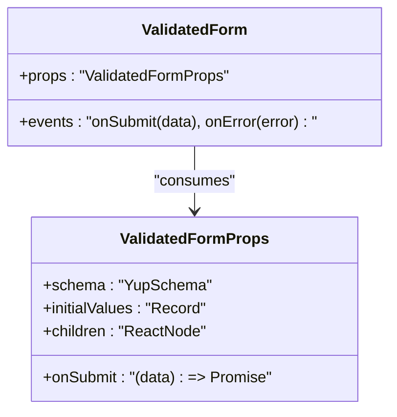

**Diagram sources**
- [customer/components/b2b/validated-form.tsx](file://apps/customer/src/components/b2b/validated-form.tsx)

**Section sources**
- [customer/components/b2b/validated-form.tsx](file://apps/customer/src/components/b2b/validated-form.tsx)

### Orders Table (Seller)
Table component for displaying and managing seller orders.

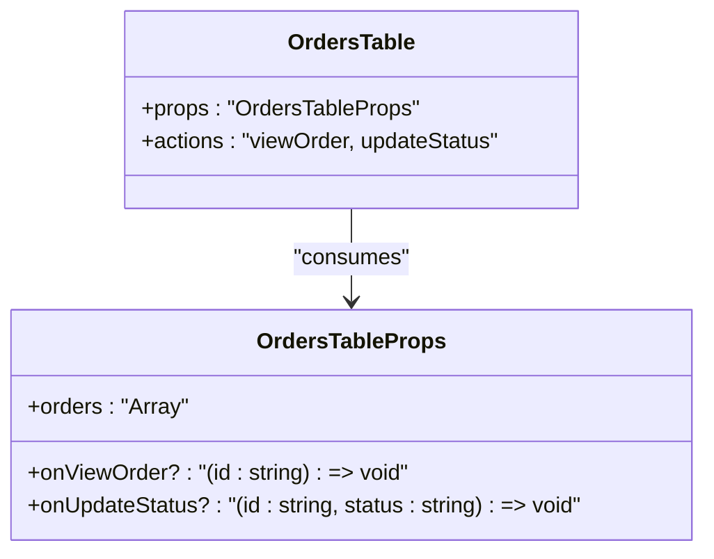

**Diagram sources**
- [seller/components/orders-table.tsx](file://apps/seller/src/components/orders-table.tsx)

**Section sources**
- [seller/components/orders-table.tsx](file://apps/seller/src/components/orders-table.tsx)

### Products Table (Seller)
Table component for managing seller products.

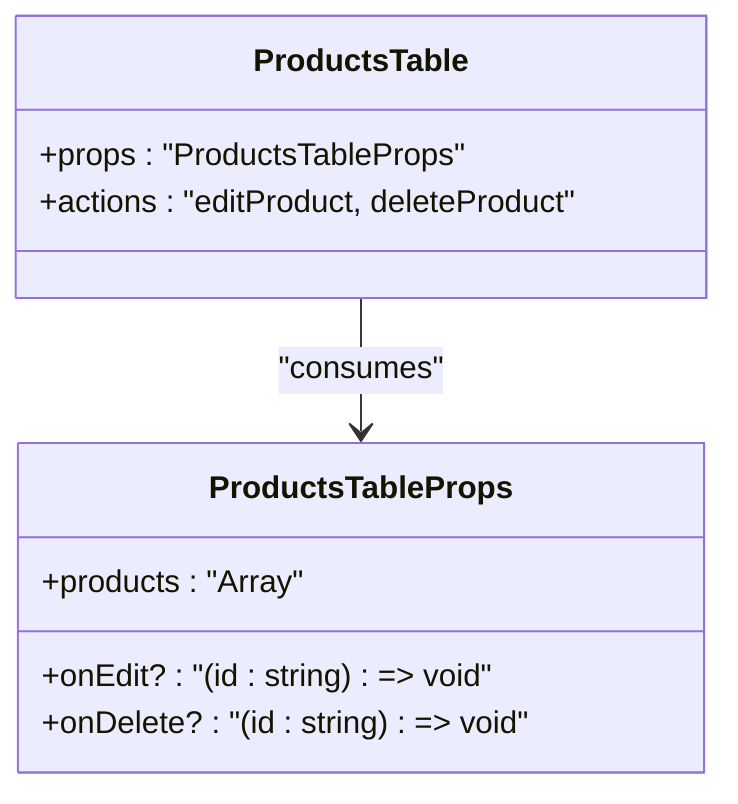

**Diagram sources**
- [seller/components/products-table.tsx](file://apps/seller/src/components/products-table.tsx)

**Section sources**
- [seller/components/products-table.tsx](file://apps/seller/src/components/products-table.tsx)

### Saved Views (Seller)
Component to manage saved views/search filters.

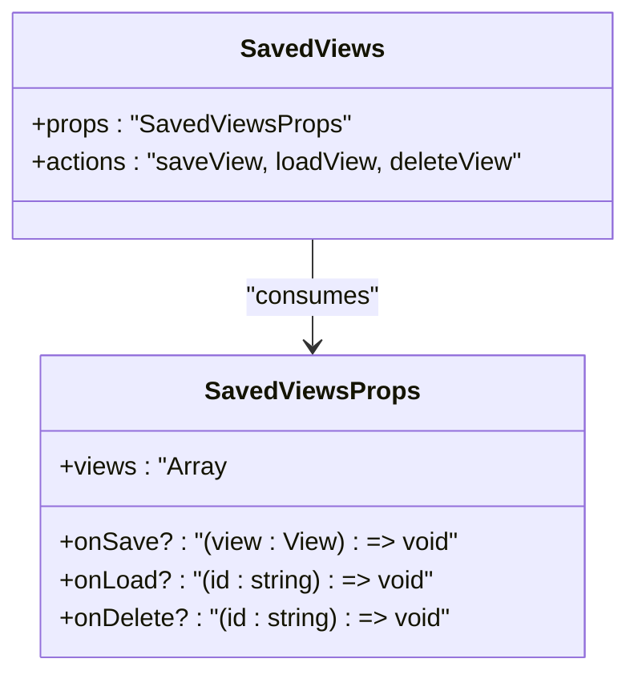

**Diagram sources**
- [seller/components/saved-views.tsx](file://apps/seller/src/components/saved-views.tsx)

**Section sources**
- [seller/components/saved-views.tsx](file://apps/seller/src/components/saved-views.tsx)

### Command Palette (Seller)
Global command palette for quick actions.

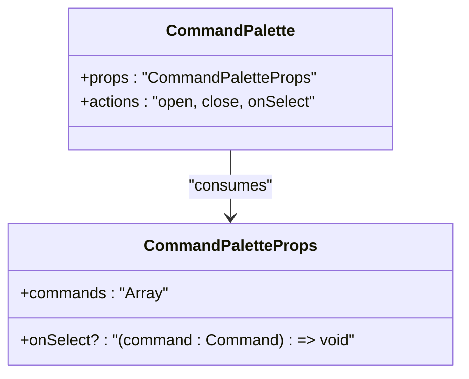

**Diagram sources**
- [seller/components/command-palette.tsx](file://apps/seller/src/components/command-palette.tsx)

**Section sources**
- [seller/components/command-palette.tsx](file://apps/seller/src/components/command-palette.tsx)

### Notification Bell (Seller)
Bell icon with badge count and dropdown notifications.

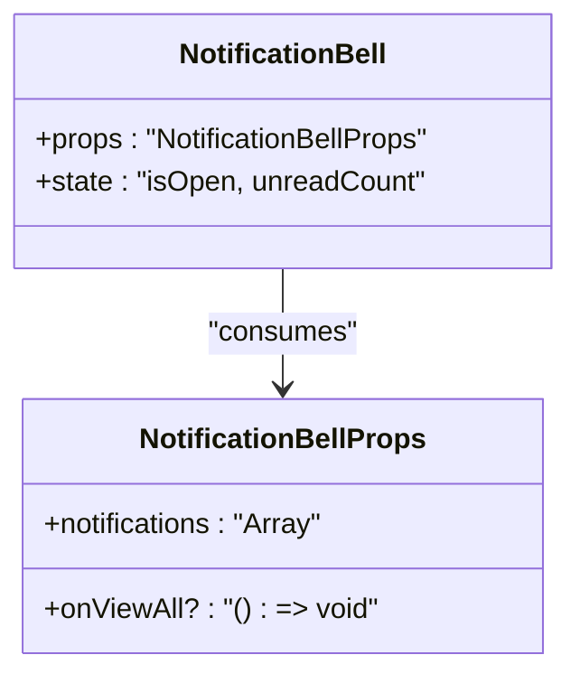

**Diagram sources**
- [seller/components/notification-bell.tsx](file://apps/seller/src/components/notification-bell.tsx)

**Section sources**
- [seller/components/notification-bell.tsx](file://apps/seller/src/components/notification-bell.tsx)

### Onboarding Checklist (Seller)
Interactive checklist for seller onboarding steps.

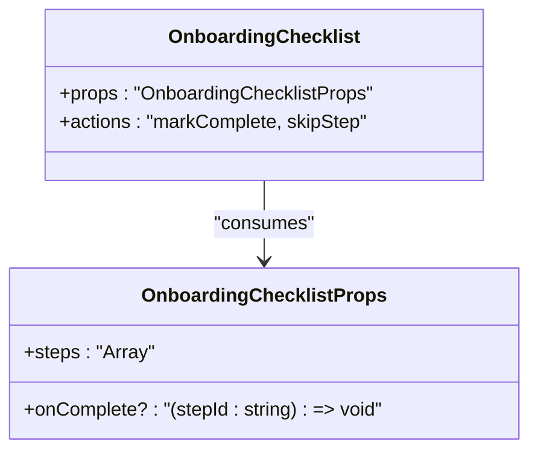

**Diagram sources**
- [seller/components/onboarding-checklist.tsx](file://apps/seller/src/components/onboarding-checklist.tsx)

**Section sources**
- [seller/components/onboarding-checklist.tsx](file://apps/seller/src/components/onboarding-checklist.tsx)

### AI Assist (Seller)
AI-powered assistant panel for content generation.

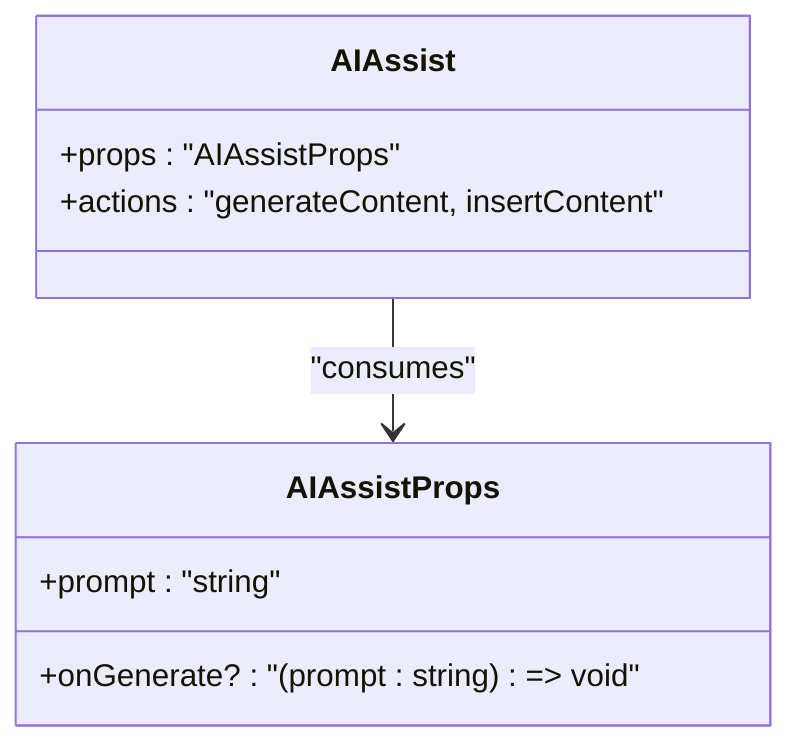

**Diagram sources**
- [seller/components/ai-assist.tsx](file://apps/seller/src/components/ai-assist.tsx)

**Section sources**
- [seller/components/ai-assist.tsx](file://apps/seller/src/components/ai-assist.tsx)

### Toast (Seller)
Toast notification component for feedback.

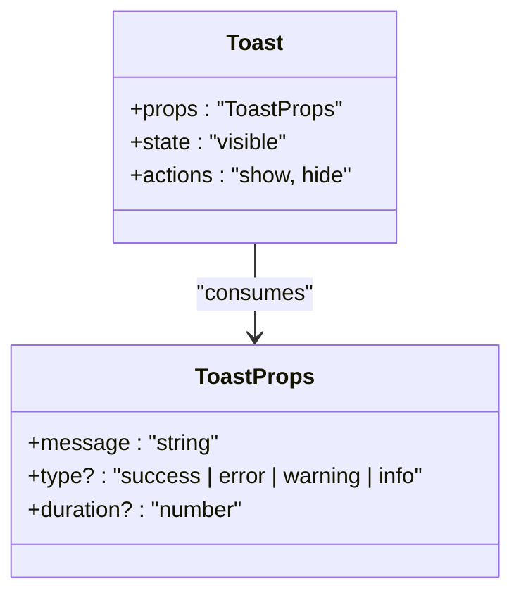

**Diagram sources**
- [seller/components/toast.tsx](file://apps/seller/src/components/toast.tsx)

**Section sources**
- [seller/components/toast.tsx](file://apps/seller/src/components/toast.tsx)

### Admin Layout (Admin)
Administrative shell with navigation and content area.

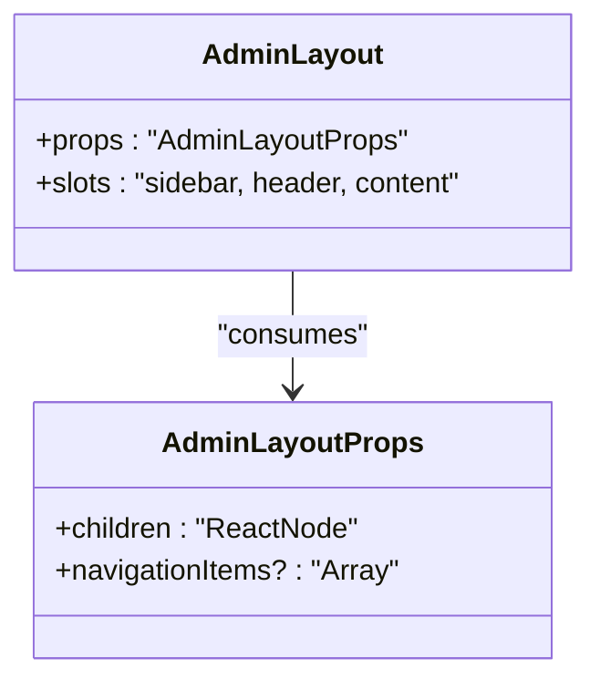

**Diagram sources**
- [admin/components/layout/admin-layout.tsx](file://apps/admin/src/components/layout/admin-layout.tsx)

**Section sources**
- [admin/components/layout/admin-layout.tsx](file://apps/admin/src/components/layout/admin-layout.tsx)

### Customer Layout Components
- Header and Footer provide top-level navigation and branding.
- Role Switcher enables switching between roles within the customer app.

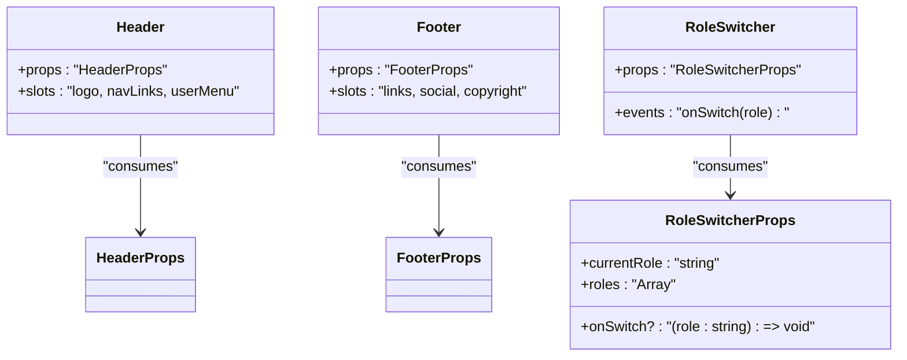

**Diagram sources**
- [customer/components/layout/header.tsx](file://apps/customer/src/components/layout/header.tsx)
- [customer/components/layout/footer.tsx](file://apps/customer/src/components/layout/footer.tsx)
- [customer/components/layout/role-switcher.tsx](file://apps/customer/src/components/layout/role-switcher.tsx)

**Section sources**
- [customer/components/layout/header.tsx](file://apps/customer/src/components/layout/header.tsx)
- [customer/components/layout/footer.tsx](file://apps/customer/src/components/layout/footer.tsx)
- [customer/components/layout/role-switcher.tsx](file://apps/customer/src/components/layout/role-switcher.tsx)

## Dependency Analysis
The UI components depend on:
- Tailwind CSS for utility-first styling and design tokens.
- PostCSS for preprocessing and plugin transformations.
- Global CSS for base styles and theme roots.
- Layout components for shell structure and navigation.

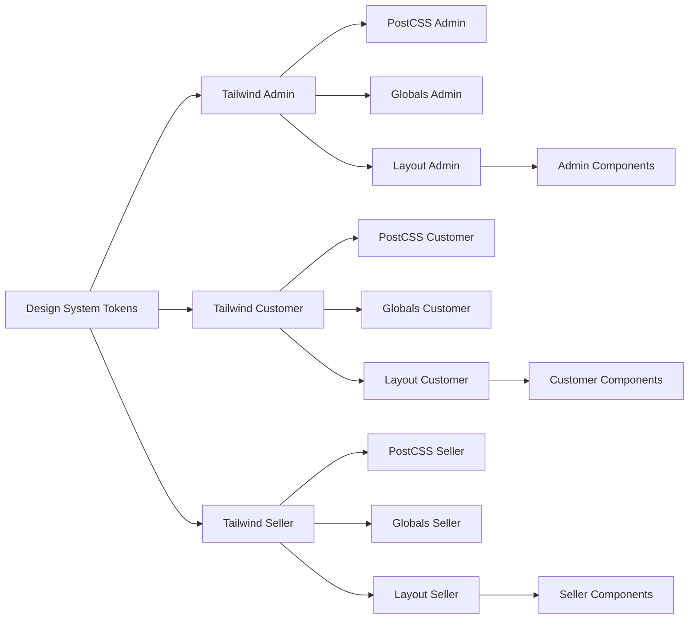

**Diagram sources**
- [DESIGN_SYSTEM_NOTES.md](file://DESIGN_SYSTEM_NOTES.md)
- [admin/tailwind.config.js](file://apps/admin/tailwind.config.js)
- [customer/tailwind.config.js](file://apps/customer/tailwind.config.js)
- [seller/tailwind.config.js](file://apps/seller/tailwind.config.js)
- [admin/postcss.config.js](file://apps/admin/postcss.config.js)
- [customer/postcss.config.js](file://apps/customer/postcss.config.js)
- [seller/postcss.config.js](file://apps/seller/postcss.config.js)
- [admin/globals.css](file://apps/admin/src/app/globals.css)
- [customer/globals.css](file://apps/customer/src/app/globals.css)
- [seller/globals.css](file://apps/seller/src/app/globals.css)
- [admin/layout.tsx](file://apps/admin/src/app/layout.tsx)
- [customer/layout.tsx](file://apps/customer/src/app/layout.tsx)
- [seller/layout.tsx](file://apps/seller/src/app/layout.tsx)

**Section sources**
- [admin/tailwind.config.js](file://apps/admin/tailwind.config.js)
- [customer/tailwind.config.js](file://apps/customer/tailwind.config.js)
- [seller/tailwind.config.js](file://apps/seller/tailwind.config.js)
- [admin/postcss.config.js](file://apps/admin/postcss.config.js)
- [customer/postcss.config.js](file://apps/customer/postcss.config.js)
- [seller/postcss.config.js](file://apps/seller/postcss.config.js)
- [admin/globals.css](file://apps/admin/src/app/globals.css)
- [customer/globals.css](file://apps/customer/src/app/globals.css)
- [seller/globals.css](file://apps/seller/src/app/globals.css)
- [admin/layout.tsx](file://apps/admin/src/app/layout.tsx)
- [customer/layout.tsx](file://apps/customer/src/app/layout.tsx)
- [seller/layout.tsx](file://apps/seller/src/app/layout.tsx)

## Performance Considerations
- Prefer Tailwind utilities over ad-hoc CSS to reduce CSS bundle size and improve maintainability.
- Use component composition to minimize duplication and leverage shared logic.
- Keep component props minimal and well-typed to avoid unnecessary re-renders.
- Defer heavy computations to background threads or server-side rendering where appropriate.
- Optimize images and assets used in components (e.g., product cards).

## Troubleshooting Guide
- Tailwind classes not applying
  - Verify Tailwind configuration and PostCSS pipeline in the respective app.
  - Confirm global CSS is included and layout wraps pages.
  - References: [admin/tailwind.config.js](file://apps/admin/tailwind.config.js), [customer/tailwind.config.js](file://apps/customer/tailwind.config.js), [seller/tailwind.config.js](file://apps/seller/tailwind.config.js), [admin/postcss.config.js](file://apps/admin/postcss.config.js), [customer/postcss.config.js](file://apps/customer/postcss.config.js), [seller/postcss.config.js](file://apps/seller/postcss.config.js), [admin/globals.css](file://apps/admin/src/app/globals.css), [customer/globals.css](file://apps/customer/src/app/globals.css), [seller/globals.css](file://apps/seller/src/app/globals.css), [admin/layout.tsx](file://apps/admin/src/app/layout.tsx), [customer/layout.tsx](file://apps/customer/src/app/layout.tsx), [seller/layout.tsx](file://apps/seller/src/app/layout.tsx)

- Design token mismatches
  - Align component styling with tokens defined in the design system notes.
  - Reference: [DESIGN_SYSTEM_NOTES.md](file://DESIGN_SYSTEM_NOTES.md)

- Component not rendering as expected
  - Inspect component props and event handlers.
  - Validate layout wrappers and slot usage.
  - References: [customer/components/products/product-card.tsx](file://apps/customer/src/components/products/product-card.tsx), [customer/components/products/sort-select.tsx](file://apps/customer/src/components/products/sort-select.tsx), [customer/components/b2b/b2b-shell.tsx](file://apps/customer/src/components/b2b/b2b-shell.tsx), [customer/components/b2b/reorder-button.tsx](file://apps/customer/src/components/b2b/reorder-button.tsx), [customer/components/b2b/validated-form.tsx](file://apps/customer/src/components/b2b/validated-form.tsx), [seller/components/orders-table.tsx](file://apps/seller/src/components/orders-table.tsx), [seller/components/products-table.tsx](file://apps/seller/src/components/products-table.tsx), [seller/components/saved-views.tsx](file://apps/seller/src/components/saved-views.tsx), [seller/components/command-palette.tsx](file://apps/seller/src/components/command-palette.tsx), [seller/components/notification-bell.tsx](file://apps/seller/src/components/notification-bell.tsx), [seller/components/onboarding-checklist.tsx](file://apps/seller/src/components/onboarding-checklist.tsx), [seller/components/ai-assist.tsx](file://apps/seller/src/components/ai-assist.tsx), [seller/components/toast.tsx](file://apps/seller/src/components/toast.tsx), [admin/components/layout/admin-layout.tsx](file://apps/admin/src/components/layout/admin-layout.tsx)

## Conclusion
The UI component library is grounded in a centralized design system and implemented consistently across the admin, customer, and seller applications using Tailwind CSS and PostCSS. Reusable components encapsulate common patterns, while layout components provide a cohesive shell. Following the design tokens and component interfaces ensures consistency, responsiveness, accessibility, and cross-browser compatibility.

## Appendices
- Responsive design principles
  - Use Tailwind’s responsive prefixes to adapt layouts for mobile, tablet, and desktop.
  - Prefer flexbox and grid utilities for adaptive layouts.
  - Test components across screen sizes and orientations.

- Accessibility compliance
  - Ensure components are keyboard accessible and screen-reader friendly.
  - Use semantic HTML and ARIA attributes where necessary.
  - Provide focus management and clear visual focus indicators.

- Cross-browser compatibility
  - Test components in modern browsers and ensure graceful degradation in older ones.
  - Avoid experimental CSS features without vendor prefixes or polyfills.

- Component development guidelines
  - Define clear prop interfaces and default values.
  - Encapsulate styling via Tailwind utilities; avoid inline styles.
  - Keep components pure and stateless where possible; manage state externally.

- Testing strategies
  - Unit test component rendering and event handling.
  - Snapshot test component outputs under various props.
  - Accessibility test with automated tools and manual checks.

- Documentation standards
  - Document component props, events, slots, and customization options.
  - Provide usage examples and composition patterns.
  - Link to design system tokens and Tailwind configuration.