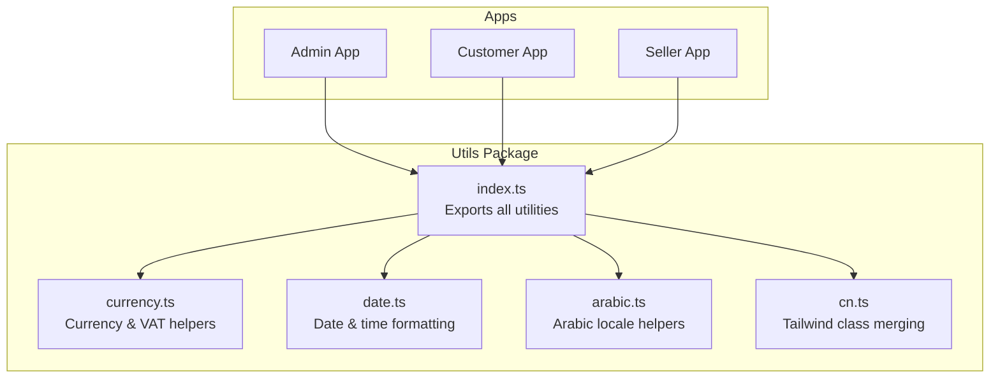
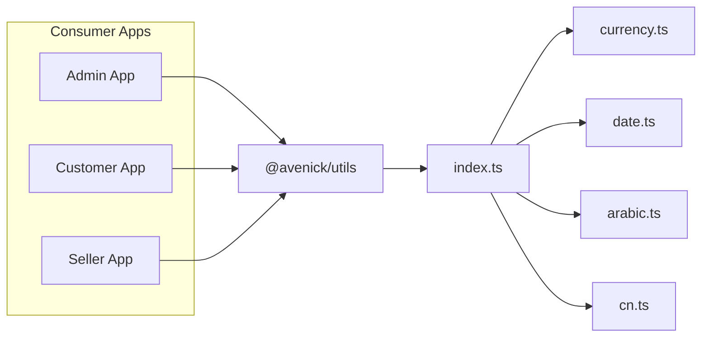
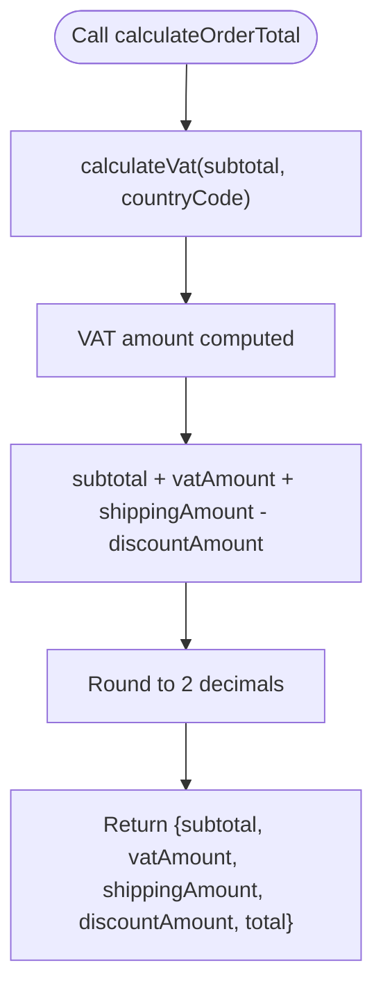
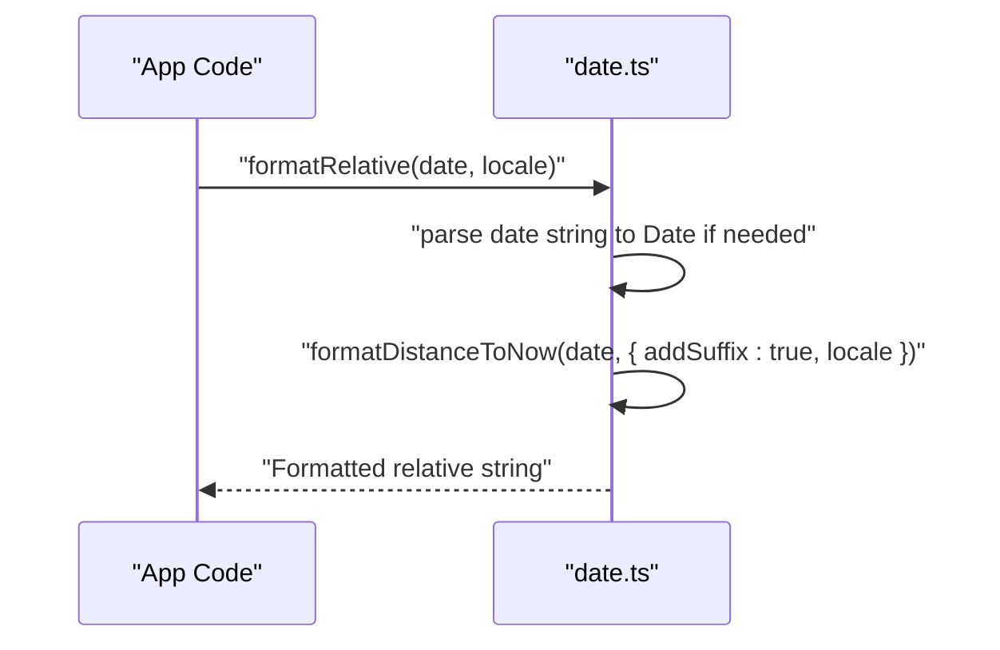
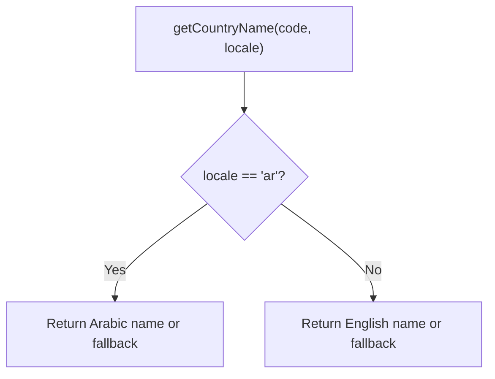
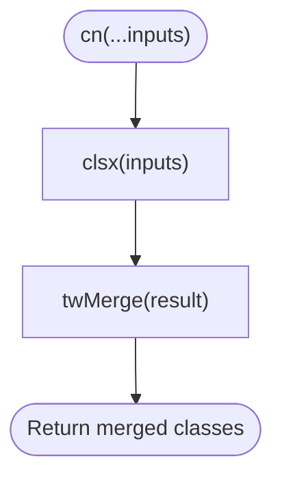
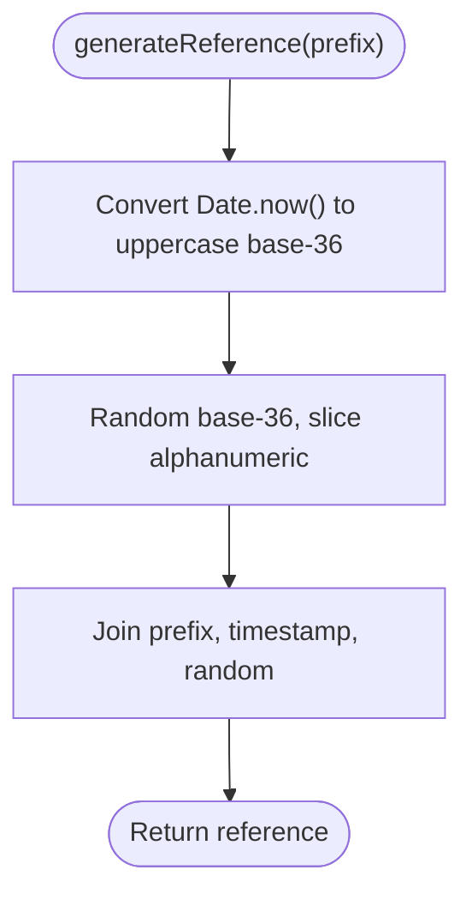
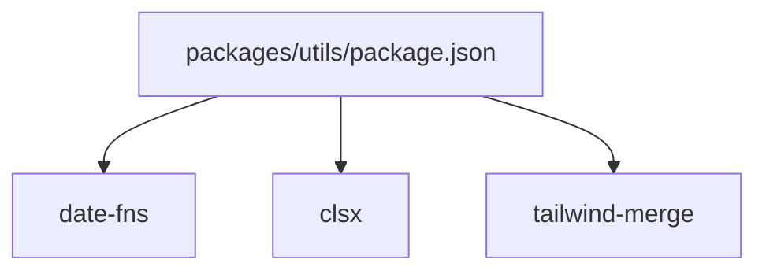

# Utilities Package

<cite>
**Referenced Files in This Document**
- [index.ts](file://packages/utils/src/index.ts)
- [currency.ts](file://packages/utils/src/currency.ts)
- [date.ts](file://packages/utils/src/date.ts)
- [arabic.ts](file://packages/utils/src/arabic.ts)
- [cn.ts](file://packages/utils/src/cn.ts)
- [package.json](file://packages/utils/package.json)
- [admin-dashboard-view.tsx](file://apps/admin/src/app/dashboard/dashboard-view.tsx)
- [admin-orders-page.tsx](file://apps/admin/src/app/orders/[id]/page.tsx)
- [admin-pricing-page.tsx](file://apps/admin/src/app/pricing/page.tsx)
- [admin-warehouse-stock-page.tsx](file://apps/admin/src/app/warehouse/stock/page.tsx)
- [admin-layout.tsx](file://apps/admin/src/components/layout/admin-layout.tsx)
</cite>

## Table of Contents
1. [Introduction](#introduction)
2. [Project Structure](#project-structure)
3. [Core Components](#core-components)
4. [Architecture Overview](#architecture-overview)
5. [Detailed Component Analysis](#detailed-component-analysis)
6. [Dependency Analysis](#dependency-analysis)
7. [Performance Considerations](#performance-considerations)
8. [Troubleshooting Guide](#troubleshooting-guide)
9. [Conclusion](#conclusion)
10. [Appendices](#appendices)

## Introduction
The Utilities package provides shared, reusable helpers for formatting, localization, and common data transformations across the Avenick Commerce platform. It focuses on:
- Formatting: currency, dates, and localized strings
- Localization helpers for Arabic and English contexts
- Tailwind CSS class merging
- General-purpose utilities like slugs, truncation, clamping, and reference generation

These utilities are consumed by multiple Next.js applications (admin, customer, seller) to ensure consistent formatting and behavior across the system.

## Project Structure
The package exports a single index barrel that re-exports specialized modules and exposes top-level helpers. Each module encapsulates a cohesive set of related utilities.

**Diagram sources**
- [index.ts:1-32](file://packages/utils/src/index.ts#L1-L32)
- [currency.ts:1-61](file://packages/utils/src/currency.ts#L1-L61)
- [date.ts:1-44](file://packages/utils/src/date.ts#L1-L44)
- [arabic.ts:1-52](file://packages/utils/src/arabic.ts#L1-L52)
- [cn.ts:1-7](file://packages/utils/src/cn.ts#L1-L7)

**Section sources**
- [index.ts:1-32](file://packages/utils/src/index.ts#L1-L32)
- [package.json:1-19](file://packages/utils/package.json#L1-L19)

## Core Components
This section summarizes the primary exported utilities and their responsibilities.

- Currency and VAT formatting
  - Supported currencies and locale-specific symbols
  - VAT rates by country code
  - Currency formatter with locale-aware placement of symbols
  - VAT calculation and order total computation

- Date and time formatting
  - Formatted date strings
  - Formatted date-time strings
  - Relative time formatting ("ago" with suffixes)
  - Expiry checks and "expiring soon" windows
  - Delivery estimate range formatting

- Arabic localization helpers
  - Detection of Arabic text
  - Directionality selection (RTL/LTR)
  - Localized value selection
  - Arabic name ordering (family name first)
  - Country name mapping between locales
  - Arabic-Indic numeral conversion

- Tailwind class merging
  - Merges and deduplicates Tailwind CSS classes

- General-purpose utilities
  - Unique reference code generator for bank transfers
  - String truncation with ellipsis
  - URL slug generation
  - Number clamping between min/max bounds

**Section sources**
- [index.ts:6-32](file://packages/utils/src/index.ts#L6-L32)
- [currency.ts:10-61](file://packages/utils/src/currency.ts#L10-L61)
- [date.ts:6-44](file://packages/utils/src/date.ts#L6-L44)
- [arabic.ts:1-52](file://packages/utils/src/arabic.ts#L1-L52)
- [cn.ts:1-7](file://packages/utils/src/cn.ts#L1-L7)

## Architecture Overview
The package follows a modular design with a central index exporting cohesive submodules. Consumers import only what they need, reducing bundle size and improving maintainability.

**Diagram sources**
- [index.ts:1-5](file://packages/utils/src/index.ts#L1-L5)
- [package.json:5-7](file://packages/utils/package.json#L5-L7)

## Detailed Component Analysis

### Currency and VAT Utilities
Purpose:
- Provide locale-aware currency formatting
- Compute VAT amounts and order totals
- Support multiple regional currencies and decimal rules

Key functions:
- formatCurrency(amount, currency, locale)
- calculateVat(amount, countryCode)
- calculateOrderTotal(subtotal, countryCode, shippingAmount, discountAmount)

Design highlights:
- Centralized currency configuration with symbols, Arabic symbols, locales, and decimal counts
- VAT rates keyed by country codes with defaults
- Uses Intl.NumberFormat for robust locale-aware formatting
- Returns formatted strings with symbol placement based on locale

**Diagram sources**
- [currency.ts:51-61](file://packages/utils/src/currency.ts#L51-L61)
- [currency.ts:46-49](file://packages/utils/src/currency.ts#L46-L49)

**Section sources**
- [currency.ts:10-61](file://packages/utils/src/currency.ts#L10-L61)

### Date and Time Utilities
Purpose:
- Format dates and relative times consistently
- Determine expiry and near-expiry states
- Generate delivery estimate ranges

Key functions:
- formatDate(date, locale)
- formatDateTime(date, locale)
- formatRelative(date, locale)
- isExpired(date)
- isExpiringSoon(date, withinDays)
- getDeliveryEstimate(daysMin, daysMax, locale)

Design highlights:
- Thin wrapper around date-fns for locale-aware formatting
- Relative time uses distance formatting with suffixes
- Expiry checks leverage date comparison helpers
- Delivery estimates compute date ranges and format them

**Diagram sources**
- [date.ts:16-22](file://packages/utils/src/date.ts#L16-L22)

**Section sources**
- [date.ts:6-44](file://packages/utils/src/date.ts#L6-L44)

### Arabic Localization Helpers
Purpose:
- Provide locale-aware helpers for Arabic content
- Support RTL layouts and Arabic-specific formatting

Key functions:
- isArabic(text)
- getDir(locale)
- localize(locale, ar, en)
- formatNameAr(firstName, lastName)
- getCountryName(code, locale)
- toArabicNumerals(num)

Design highlights:
- Simple boolean and mapping-based logic
- Name formatting for Arabic convention (family name first)
- Country name maps for both Arabic and English
- Uses toLocaleString with Arabic locale for numerals

**Diagram sources**
- [arabic.ts:42-46](file://packages/utils/src/arabic.ts#L42-L46)

**Section sources**
- [arabic.ts:1-52](file://packages/utils/src/arabic.ts#L1-L52)

### Tailwind Class Merging Utility
Purpose:
- Merge and deduplicate Tailwind CSS classes safely

Key function:
- cn(...inputs): returns merged class string

Design highlights:
- Uses clsx for union and tailwind-merge for conflict resolution
- Accepts multiple inputs for flexible composition

**Diagram sources**
- [cn.ts:4-6](file://packages/utils/src/cn.ts#L4-L6)

**Section sources**
- [cn.ts:1-7](file://packages/utils/src/cn.ts#L1-L7)

### General-Purpose Utilities
Purpose:
- Provide common data manipulation helpers

Key functions:
- generateReference(prefix): unique bank transfer reference
- truncate(str, maxLength): string truncation with ellipsis
- slugify(text): URL-safe slug generation
- clamp(value, min, max): clamp number within bounds

Design highlights:
- generateReference uses base-36 encoding and random suffix
- slugify normalizes whitespace and replaces invalid characters
- clamp leverages Math.min/max for simplicity

**Diagram sources**
- [index.ts:7-11](file://packages/utils/src/index.ts#L7-L11)

**Section sources**
- [index.ts:6-32](file://packages/utils/src/index.ts#L6-L32)

## Dependency Analysis
The package declares runtime and development dependencies. Consumers import only the needed utilities, enabling tree-shaking.

**Diagram sources**
- [package.json:8-12](file://packages/utils/package.json#L8-L12)

Consumption examples across apps:
- Admin dashboard uses currency formatting for KPIs
- Admin orders/pricing pages consume currency formatting
- Admin layout consumes cn for class merging

**Section sources**
- [admin-dashboard-view.tsx:7](file://apps/admin/src/app/dashboard/dashboard-view.tsx#L7)
- [admin-orders-page.tsx:3](file://apps/admin/src/app/orders/[id]/page.tsx#L3)
- [admin-pricing-page.tsx:3](file://apps/admin/src/app/pricing/page.tsx#L3)
- [admin-warehouse-stock-page.tsx:3](file://apps/admin/src/app/warehouse/stock/page.tsx#L3)
- [admin-layout.tsx:13](file://apps/admin/src/components/layout/admin-layout.tsx#L13)

## Performance Considerations
- Currency formatting
  - Uses Intl.NumberFormat; ensure locale and currency are preselected to avoid repeated configuration overhead
  - Consider memoizing repeated calculations for the same amount/currency combinations if called frequently in loops

- Date formatting
  - Reuse parsed Date objects when formatting multiple strings for the same input
  - Prefer passing Date instances over strings to avoid repeated parsing

- Arabic numeral conversion
  - toLocaleString is efficient; cache locale strings if used extensively

- Class merging
  - cn is lightweight; avoid unnecessary recomputation in hot paths

- Slugification and truncation
  - These are O(n) string operations; avoid in tight loops without batching

[No sources needed since this section provides general guidance]

## Troubleshooting Guide
Common issues and resolutions:
- Incorrect currency symbol placement
  - Verify locale parameter and supported currency keys
  - Confirm decimal precision matches regional expectations

- VAT calculation discrepancies
  - Ensure countryCode exists in VAT_RATES or rely on default
  - Round consistently to two decimals for financial accuracy

- Date formatting anomalies
  - Pass valid Date objects; strings are parsed internally but avoid ambiguous formats
  - Confirm locale availability in date-fns

- Arabic text detection
  - Ensure input includes Arabic Unicode ranges; otherwise isArabic will return false

- Class merging conflicts
  - Order of inputs matters; conflicting Tailwind variants may override unexpectedly
  - Use cn sparingly in dynamic components to keep styles predictable

**Section sources**
- [currency.ts:21-28](file://packages/utils/src/currency.ts#L21-L28)
- [date.ts:6-9](file://packages/utils/src/date.ts#L6-L9)
- [arabic.ts:2-4](file://packages/utils/src/arabic.ts#L2-L4)
- [cn.ts:4-6](file://packages/utils/src/cn.ts#L4-L6)

## Conclusion
The Utilities package offers a focused, modular set of helpers for formatting, localization, and common data transformations. Its design enables consistent behavior across applications while remaining easy to consume and maintain. By leveraging locale-aware APIs and composing small, single-purpose functions, teams can build reliable UIs and data displays with minimal boilerplate.

[No sources needed since this section summarizes without analyzing specific files]

## Appendices

### Integration Patterns
- Import only what you need to minimize bundle size
- Compose utilities for common tasks (e.g., formatCurrency + calculateVat)
- Centralize formatting in components or server-side rendering to avoid duplication

### Testing Approaches
- Currency formatting: test symbol placement, decimal rounding, and locale differences
- Date formatting: verify relative time strings and expiry logic across locales
- Arabic helpers: validate directionality, name ordering, and numeral conversion
- cn: ensure merging of conflicting Tailwind classes resolves predictably

### Examples of Utility Composition
- Dashboard KPIs: combine formatCurrency with localized labels
- Order summaries: compute totals via calculateOrderTotal and render with formatCurrency
- Expiry indicators: use isExpired/isExpiringSoon with formatRelative for user-friendly messaging

**Section sources**
- [admin-dashboard-view.tsx:95-99](file://apps/admin/src/app/dashboard/dashboard-view.tsx#L95-L99)
- [currency.ts:51-61](file://packages/utils/src/currency.ts#L51-L61)
- [date.ts:16-22](file://packages/utils/src/date.ts#L16-L22)