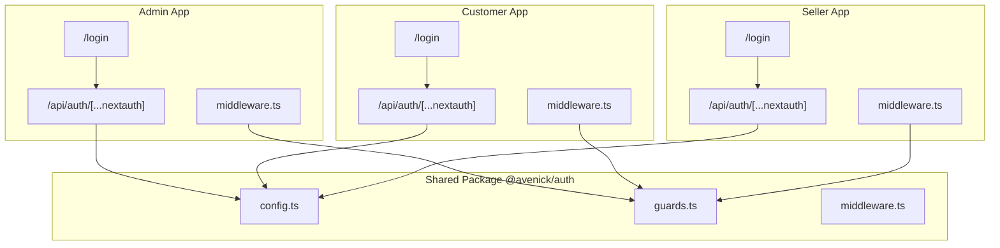
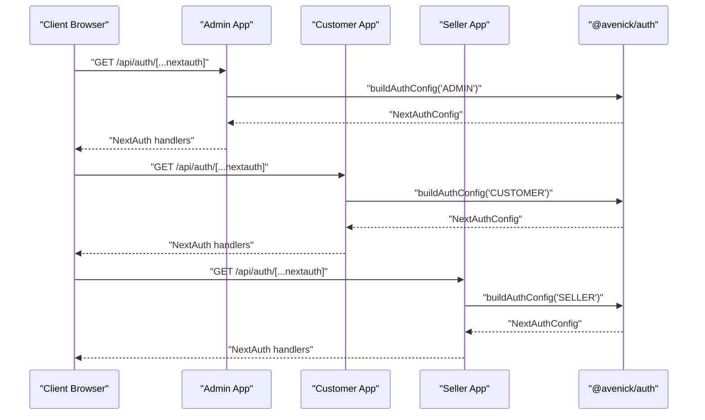
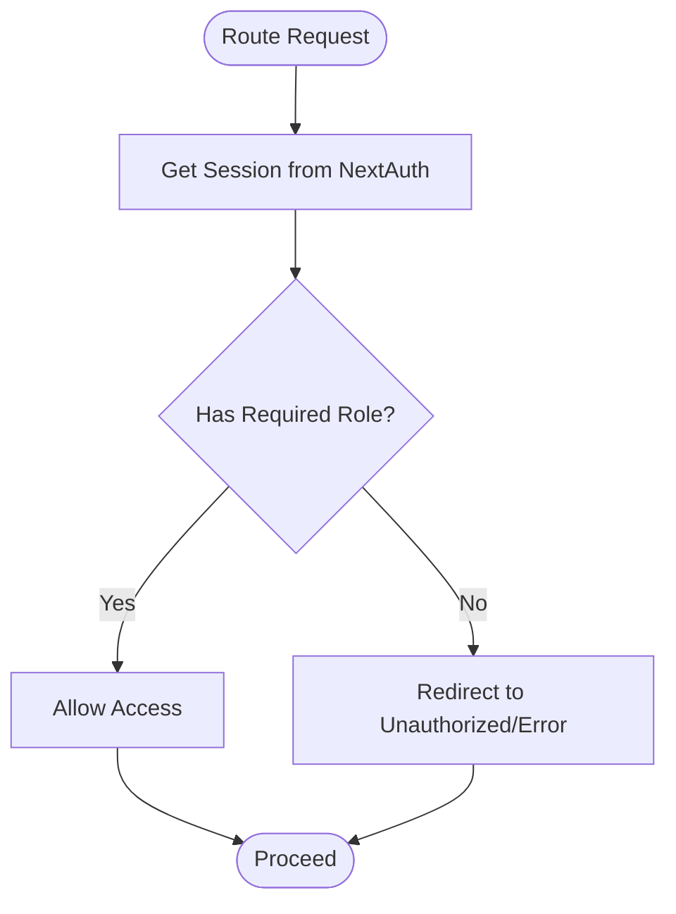
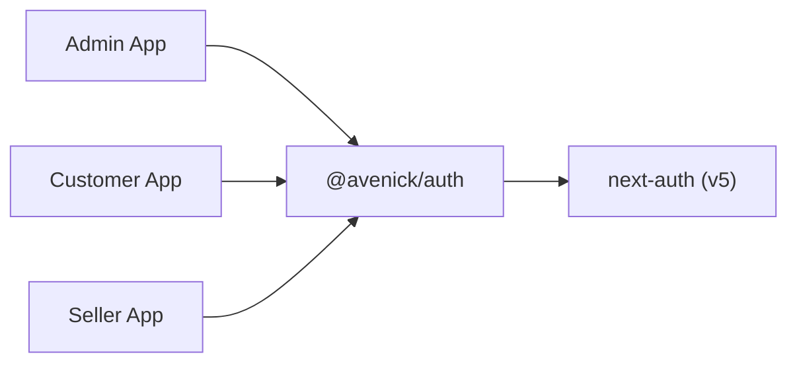

# Authentication & Authorization

<cite>
**Referenced Files in This Document**
- [admin route.ts](file://apps/admin/src/app/api/auth/[...nextauth]/route.ts)
- [customer route.ts](file://apps/customer/src/app/api/auth/[...nextauth]/route.ts)
- [seller route.ts](file://apps/seller/src/app/api/auth/[...nextauth]/route.ts)
- [admin auth-instance.ts](file://apps/admin/src/lib/auth-instance.ts)
- [customer auth-instance.ts](file://apps/customer/src/lib/auth-instance.ts)
- [seller auth-instance.ts](file://apps/seller/src/lib/auth-instance.ts)
- [admin middleware.ts](file://apps/admin/src/middleware.ts)
- [customer middleware.ts](file://apps/customer/src/middleware.ts)
- [seller middleware.ts](file://apps/seller/src/middleware.ts)
- [auth config.ts](file://packages/auth/src/config.ts)
- [auth guards.ts](file://packages/auth/src/guards.ts)
- [auth middleware.ts](file://packages/auth/src/middleware.ts)
- [admin package.json](file://apps/admin/package.json)
- [customer package.json](file://apps/customer/package.json)
- [seller package.json](file://apps/seller/package.json)
- [auth package.json](file://packages/auth/package.json)
- [admin login page.tsx](file://apps/admin/src/app/login/page.tsx)
- [customer login page.tsx](file://apps/customer/src/app/login/page.tsx)
- [seller login page.tsx](file://apps/seller/src/app/login/page.tsx)
</cite>

## Table of Contents
1. [Introduction](#introduction)
2. [Project Structure](#project-structure)
3. [Core Components](#core-components)
4. [Architecture Overview](#architecture-overview)
5. [Detailed Component Analysis](#detailed-component-analysis)
6. [Dependency Analysis](#dependency-analysis)
7. [Performance Considerations](#performance-considerations)
8. [Troubleshooting Guide](#troubleshooting-guide)
9. [Conclusion](#conclusion)

## Introduction
This document explains the authentication and authorization system for Avenick Commerce, focusing on NextAuth.js v5 integration, role-based access control (RBAC), and multi-application authentication sharing across the Admin, Customer/B2B, and Seller portals. It covers middleware implementation, custom guards, JWT token handling, session management, and secure route protection. Practical guidance is included for implementing authentication guards, accessing user context, and enforcing role-specific permissions.

## Project Structure
The authentication system is implemented across three Next.js applications and a shared package:
- Each application exposes a NextAuth endpoint under its API routes.
- Shared configuration and guards live in the @avenick/auth package.
- Middleware in each app enforces role-based access control.
- Login pages demonstrate client-side sign-in integration with next-auth/react.

**Diagram sources**
- [admin route.ts:1-200](file://apps/admin/src/app/api/auth/[...nextauth]/route.ts#L1-L200)
- [customer route.ts:1-200](file://apps/customer/src/app/api/auth/[...nextauth]/route.ts#L1-L200)
- [seller route.ts:1-200](file://apps/seller/src/app/api/auth/[...nextauth]/route.ts#L1-L200)
- [admin middleware.ts:1-200](file://apps/admin/src/middleware.ts#L1-L200)
- [customer middleware.ts:1-200](file://apps/customer/src/middleware.ts#L1-L200)
- [seller middleware.ts:1-200](file://apps/seller/src/middleware.ts#L1-L200)
- [auth config.ts:1-200](file://packages/auth/src/config.ts#L1-L200)
- [auth guards.ts:1-200](file://packages/auth/src/guards.ts#L1-L200)
- [auth middleware.ts:1-200](file://packages/auth/src/middleware.ts#L1-L200)

**Section sources**
- [admin route.ts:1-200](file://apps/admin/src/app/api/auth/[...nextauth]/route.ts#L1-L200)
- [customer route.ts:1-200](file://apps/customer/src/app/api/auth/[...nextauth]/route.ts#L1-L200)
- [seller route.ts:1-200](file://apps/seller/src/app/api/auth/[...nextauth]/route.ts#L1-L200)
- [admin middleware.ts:1-200](file://apps/admin/src/middleware.ts#L1-L200)
- [customer middleware.ts:1-200](file://apps/customer/src/middleware.ts#L1-L200)
- [seller middleware.ts:1-200](file://apps/seller/src/middleware.ts#L1-L200)
- [auth config.ts:1-200](file://packages/auth/src/config.ts#L1-L200)
- [auth guards.ts:1-200](file://packages/auth/src/guards.ts#L1-L200)
- [auth middleware.ts:1-200](file://packages/auth/src/middleware.ts#L1-L200)

## Core Components
- NextAuth.js v5 endpoints per application: Each app defines a NextAuth route handler that initializes NextAuth with application-specific configuration.
- Shared NextAuth configuration: The @avenick/auth package builds a NextAuthConfig tailored to the current application and registers providers and callbacks.
- Role-based guards: Guards enforce role checks against the authenticated user’s role claims.
- Middleware enforcement: Application middleware applies guards to protected routes.
- Client-side login: Login pages use next-auth/react to trigger sign-in flows routed through the app-specific NextAuth endpoints.

Key implementation references:
- NextAuth initialization per app: [admin route.ts:1-200](file://apps/admin/src/app/api/auth/[...nextauth]/route.ts#L1-L200), [customer route.ts:1-200](file://apps/customer/src/app/api/auth/[...nextauth]/route.ts#L1-L200), [seller route.ts:1-200](file://apps/seller/src/app/api/auth/[...nextauth]/route.ts#L1-L200)
- Shared NextAuth config builder: [auth config.ts:1-200](file://packages/auth/src/config.ts#L1-L200)
- Guards and role checks: [auth guards.ts:1-200](file://packages/auth/src/guards.ts#L1-L200)
- Middleware integration: [auth middleware.ts:1-200](file://packages/auth/src/middleware.ts#L1-L200)
- App middleware: [admin middleware.ts:1-200](file://apps/admin/src/middleware.ts#L1-L200), [customer middleware.ts:1-200](file://apps/customer/src/middleware.ts#L1-L200), [seller middleware.ts:1-200](file://apps/seller/src/middleware.ts#L1-L200)
- Client-side sign-in: [admin login page.tsx:1-100](file://apps/admin/src/app/login/page.tsx#L1-L100), [customer login page.tsx:1-100](file://apps/customer/src/app/login/page.tsx#L1-L100), [seller login page.tsx:1-100](file://apps/seller/src/app/login/page.tsx#L1-L100)

**Section sources**
- [admin route.ts:1-200](file://apps/admin/src/app/api/auth/[...nextauth]/route.ts#L1-L200)
- [customer route.ts:1-200](file://apps/customer/src/app/api/auth/[...nextauth]/route.ts#L1-L200)
- [seller route.ts:1-200](file://apps/seller/src/app/api/auth/[...nextauth]/route.ts#L1-L200)
- [auth config.ts:1-200](file://packages/auth/src/config.ts#L1-L200)
- [auth guards.ts:1-200](file://packages/auth/src/guards.ts#L1-L200)
- [auth middleware.ts:1-200](file://packages/auth/src/middleware.ts#L1-L200)
- [admin middleware.ts:1-200](file://apps/admin/src/middleware.ts#L1-L200)
- [customer middleware.ts:1-200](file://apps/customer/src/middleware.ts#L1-L200)
- [seller middleware.ts:1-200](file://apps/seller/src/middleware.ts#L1-L200)
- [admin login page.tsx:1-100](file://apps/admin/src/app/login/page.tsx#L1-L100)
- [customer login page.tsx:1-100](file://apps/customer/src/app/login/page.tsx#L1-L100)
- [seller login page.tsx:1-100](file://apps/seller/src/app/login/page.tsx#L1-L100)

## Architecture Overview
The system uses a shared NextAuth configuration with application-specific routing. Each portal defines its own NextAuth endpoint that delegates to the shared configuration. Middleware enforces role-based access control, and client-side sign-in integrates via next-auth/react.

**Diagram sources**
- [admin route.ts:1-200](file://apps/admin/src/app/api/auth/[...nextauth]/route.ts#L1-L200)
- [customer route.ts:1-200](file://apps/customer/src/app/api/auth/[...nextauth]/route.ts#L1-L200)
- [seller route.ts:1-200](file://apps/seller/src/app/api/auth/[...nextauth]/route.ts#L1-L200)
- [auth config.ts:1-200](file://packages/auth/src/config.ts#L1-L200)

## Detailed Component Analysis

### NextAuth.js v5 Integration
- Each app registers a NextAuth route handler that initializes NextAuth with a configuration built for that app.
- The shared configuration selects providers and callbacks appropriate to the application context.
- The route handlers expose NextAuth’s internal endpoints for sign-in, sign-out, session, and callbacks.

Implementation references:
- Admin NextAuth route: [admin route.ts:1-200](file://apps/admin/src/app/api/auth/[...nextauth]/route.ts#L1-L200)
- Customer NextAuth route: [customer route.ts:1-200](file://apps/customer/src/app/api/auth/[...nextauth]/route.ts#L1-L200)
- Seller NextAuth route: [seller route.ts:1-200](file://apps/seller/src/app/api/auth/[...nextauth]/route.ts#L1-L200)
- Shared config builder: [auth config.ts:1-200](file://packages/auth/src/config.ts#L1-L200)

**Section sources**
- [admin route.ts:1-200](file://apps/admin/src/app/api/auth/[...nextauth]/route.ts#L1-L200)
- [customer route.ts:1-200](file://apps/customer/src/app/api/auth/[...nextauth]/route.ts#L1-L200)
- [seller route.ts:1-200](file://apps/seller/src/app/api/auth/[...nextauth]/route.ts#L1-L200)
- [auth config.ts:1-200](file://packages/auth/src/config.ts#L1-L200)

### Role-Based Access Control (RBAC)
- Roles supported: CONSUMER, COMPANY_ADMIN, SELLER_OWNER, ADMIN, SUPER_ADMIN.
- Guards check the authenticated user’s role against required role sets for each route or page.
- Middleware applies guards globally to protected paths.

Implementation references:
- Guards and role checks: [auth guards.ts:1-200](file://packages/auth/src/guards.ts#L1-L200)
- Middleware integration: [auth middleware.ts:1-200](file://packages/auth/src/middleware.ts#L1-L200)
- App middleware: [admin middleware.ts:1-200](file://apps/admin/src/middleware.ts#L1-L200), [customer middleware.ts:1-200](file://apps/customer/src/middleware.ts#L1-L200), [seller middleware.ts:1-200](file://apps/seller/src/middleware.ts#L1-L200)

**Diagram sources**
- [auth guards.ts:1-200](file://packages/auth/src/guards.ts#L1-L200)
- [auth middleware.ts:1-200](file://packages/auth/src/middleware.ts#L1-L200)
- [admin middleware.ts:1-200](file://apps/admin/src/middleware.ts#L1-L200)
- [customer middleware.ts:1-200](file://apps/customer/src/middleware.ts#L1-L200)
- [seller middleware.ts:1-200](file://apps/seller/src/middleware.ts#L1-L200)

**Section sources**
- [auth guards.ts:1-200](file://packages/auth/src/guards.ts#L1-L200)
- [auth middleware.ts:1-200](file://packages/auth/src/middleware.ts#L1-L200)
- [admin middleware.ts:1-200](file://apps/admin/src/middleware.ts#L1-L200)
- [customer middleware.ts:1-200](file://apps/customer/src/middleware.ts#L1-L200)
- [seller middleware.ts:1-200](file://apps/seller/src/middleware.ts#L1-L200)

### Multi-Application Authentication Sharing
- All three apps share the same NextAuth provider configuration and callback logic via the @avenick/auth package.
- Each app’s NextAuth route handler delegates to the shared configuration, ensuring consistent authentication behavior across portals.
- Client-side sign-in is unified through next-auth/react across apps.

Implementation references:
- Shared config: [auth config.ts:1-200](file://packages/auth/src/config.ts#L1-L200)
- Admin route: [admin route.ts:1-200](file://apps/admin/src/app/api/auth/[...nextauth]/route.ts#L1-L200)
- Customer route: [customer route.ts:1-200](file://apps/customer/src/app/api/auth/[...nextauth]/route.ts#L1-L200)
- Seller route: [seller route.ts:1-200](file://apps/seller/src/app/api/auth/[...nextauth]/route.ts#L1-L200)
- Client-side sign-in: [admin login page.tsx:1-100](file://apps/admin/src/app/login/page.tsx#L1-L100), [customer login page.tsx:1-100](file://apps/customer/src/app/login/page.tsx#L1-L100), [seller login page.tsx:1-100](file://apps/seller/src/app/login/page.tsx#L1-L100)

**Section sources**
- [auth config.ts:1-200](file://packages/auth/src/config.ts#L1-L200)
- [admin route.ts:1-200](file://apps/admin/src/app/api/auth/[...nextauth]/route.ts#L1-L200)
- [customer route.ts:1-200](file://apps/customer/src/app/api/auth/[...nextauth]/route.ts#L1-L200)
- [seller route.ts:1-200](file://apps/seller/src/app/api/auth/[...nextauth]/route.ts#L1-L200)
- [admin login page.tsx:1-100](file://apps/admin/src/app/login/page.tsx#L1-L100)
- [customer login page.tsx:1-100](file://apps/customer/src/app/login/page.tsx#L1-L100)
- [seller login page.tsx:1-100](file://apps/seller/src/app/login/page.tsx#L1-L100)

### Middleware Implementation and Custom Guards
- Each app defines middleware that applies guard logic to protected routes.
- Guards evaluate the authenticated user’s role and either allow or block access.
- Middleware ensures that unauthorized requests are redirected appropriately.

Implementation references:
- Admin middleware: [admin middleware.ts:1-200](file://apps/admin/src/middleware.ts#L1-L200)
- Customer middleware: [customer middleware.ts:1-200](file://apps/customer/src/middleware.ts#L1-L200)
- Seller middleware: [seller middleware.ts:1-200](file://apps/seller/src/middleware.ts#L1-L200)
- Guards: [auth guards.ts:1-200](file://packages/auth/src/guards.ts#L1-L200)
- Middleware integration: [auth middleware.ts:1-200](file://packages/auth/src/middleware.ts#L1-L200)

**Section sources**
- [admin middleware.ts:1-200](file://apps/admin/src/middleware.ts#L1-L200)
- [customer middleware.ts:1-200](file://apps/customer/src/middleware.ts#L1-L200)
- [seller middleware.ts:1-200](file://apps/seller/src/middleware.ts#L1-L200)
- [auth guards.ts:1-200](file://packages/auth/src/guards.ts#L1-L200)
- [auth middleware.ts:1-200](file://packages/auth/src/middleware.ts#L1-L200)

### JWT Token Handling and Session Management
- NextAuth manages session tokens and persists them according to provider and callback configuration.
- The shared configuration centralizes token handling logic, ensuring consistent behavior across apps.
- Sessions carry role claims used by guards to enforce access control.

Implementation references:
- Shared config builder: [auth config.ts:1-200](file://packages/auth/src/config.ts#L1-L200)
- NextAuth route handlers: [admin route.ts:1-200](file://apps/admin/src/app/api/auth/[...nextauth]/route.ts#L1-L200), [customer route.ts:1-200](file://apps/customer/src/app/api/auth/[...nextauth]/route.ts#L1-L200), [seller route.ts:1-200](file://apps/seller/src/app/api/auth/[...nextauth]/route.ts#L1-L200)

**Section sources**
- [auth config.ts:1-200](file://packages/auth/src/config.ts#L1-L200)
- [admin route.ts:1-200](file://apps/admin/src/app/api/auth/[...nextauth]/route.ts#L1-L200)
- [customer route.ts:1-200](file://apps/customer/src/app/api/auth/[...nextauth]/route.ts#L1-L200)
- [seller route.ts:1-200](file://apps/seller/src/app/api/auth/[...nextauth]/route.ts#L1-L200)

### Practical Examples

- Implementing an authentication guard:
  - Use the guard functions exported by the shared package to check roles for a given route.
  - Reference: [auth guards.ts:1-200](file://packages/auth/src/guards.ts#L1-L200)

- Accessing user context in a page or component:
  - Use next-auth/react hooks to access the session and user role in client components.
  - References: [admin login page.tsx:1-100](file://apps/admin/src/app/login/page.tsx#L1-L100), [customer login page.tsx:1-100](file://apps/customer/src/app/login/page.tsx#L1-L100), [seller login page.tsx:1-100](file://apps/seller/src/app/login/page.tsx#L1-L100)

- Handling role-specific permissions:
  - Apply guards in middleware to protect routes and redirect unauthorized users.
  - References: [auth middleware.ts:1-200](file://packages/auth/src/middleware.ts#L1-L200), [admin middleware.ts:1-200](file://apps/admin/src/middleware.ts#L1-L200), [customer middleware.ts:1-200](file://apps/customer/src/middleware.ts#L1-L200), [seller middleware.ts:1-200](file://apps/seller/src/middleware.ts#L1-L200)

**Section sources**
- [auth guards.ts:1-200](file://packages/auth/src/guards.ts#L1-L200)
- [auth middleware.ts:1-200](file://packages/auth/src/middleware.ts#L1-L200)
- [admin middleware.ts:1-200](file://apps/admin/src/middleware.ts#L1-L200)
- [customer middleware.ts:1-200](file://apps/customer/src/middleware.ts#L1-L200)
- [seller middleware.ts:1-200](file://apps/seller/src/middleware.ts#L1-L200)
- [admin login page.tsx:1-100](file://apps/admin/src/app/login/page.tsx#L1-L100)
- [customer login page.tsx:1-100](file://apps/customer/src/app/login/page.tsx#L1-L100)
- [seller login page.tsx:1-100](file://apps/seller/src/app/login/page.tsx#L1-L100)

## Dependency Analysis
- Each application depends on the @avenick/auth package for shared NextAuth configuration and guards.
- The @avenick/auth package encapsulates NextAuth configuration and RBAC logic, minimizing duplication across apps.
- NextAuth peer dependency is declared in each app and the shared package.

**Diagram sources**
- [admin package.json:1-100](file://apps/admin/package.json#L1-L100)
- [customer package.json:1-100](file://apps/customer/package.json#L1-L100)
- [seller package.json:1-100](file://apps/seller/package.json#L1-L100)
- [auth package.json:1-100](file://packages/auth/package.json#L1-L100)
- [auth config.ts:1-200](file://packages/auth/src/config.ts#L1-L200)

**Section sources**
- [admin package.json:1-100](file://apps/admin/package.json#L1-L100)
- [customer package.json:1-100](file://apps/customer/package.json#L1-L100)
- [seller package.json:1-100](file://apps/seller/package.json#L1-L100)
- [auth package.json:1-100](file://packages/auth/package.json#L1-L100)
- [auth config.ts:1-200](file://packages/auth/src/config.ts#L1-L200)

## Performance Considerations
- Centralized NextAuth configuration reduces runtime overhead and ensures consistent behavior across apps.
- Keep guard checks lightweight and avoid heavy computations inside middleware.
- Use efficient role comparisons and cache role claims when appropriate to minimize repeated lookups.

## Troubleshooting Guide
- Verify NextAuth endpoints are reachable in each app and correctly delegate to the shared configuration.
  - References: [admin route.ts:1-200](file://apps/admin/src/app/api/auth/[...nextauth]/route.ts#L1-L200), [customer route.ts:1-200](file://apps/customer/src/app/api/auth/[...nextauth]/route.ts#L1-L200), [seller route.ts:1-200](file://apps/seller/src/app/api/auth/[...nextauth]/route.ts#L1-L200)
- Confirm middleware is applied to protected routes and guards are invoked.
  - References: [auth middleware.ts:1-200](file://packages/auth/src/middleware.ts#L1-L200), [admin middleware.ts:1-200](file://apps/admin/src/middleware.ts#L1-L200), [customer middleware.ts:1-200](file://apps/customer/src/middleware.ts#L1-L200), [seller middleware.ts:1-200](file://apps/seller/src/middleware.ts#L1-L200)
- Ensure client-side sign-in integrates with next-auth/react and redirects to the correct app endpoint.
  - References: [admin login page.tsx:1-100](file://apps/admin/src/app/login/page.tsx#L1-L100), [customer login page.tsx:1-100](file://apps/customer/src/app/login/page.tsx#L1-L100), [seller login page.tsx:1-100](file://apps/seller/src/app/login/page.tsx#L1-L100)

**Section sources**
- [admin route.ts:1-200](file://apps/admin/src/app/api/auth/[...nextauth]/route.ts#L1-L200)
- [customer route.ts:1-200](file://apps/customer/src/app/api/auth/[...nextauth]/route.ts#L1-L200)
- [seller route.ts:1-200](file://apps/seller/src/app/api/auth/[...nextauth]/route.ts#L1-L200)
- [auth middleware.ts:1-200](file://packages/auth/src/middleware.ts#L1-L200)
- [admin middleware.ts:1-200](file://apps/admin/src/middleware.ts#L1-L200)
- [customer middleware.ts:1-200](file://apps/customer/src/middleware.ts#L1-L200)
- [seller middleware.ts:1-200](file://apps/seller/src/middleware.ts#L1-L200)
- [admin login page.tsx:1-100](file://apps/admin/src/app/login/page.tsx#L1-L100)
- [customer login page.tsx:1-100](file://apps/customer/src/app/login/page.tsx#L1-L100)
- [seller login page.tsx:1-100](file://apps/seller/src/app/login/page.tsx#L1-L100)

## Conclusion
Avenick Commerce employs a robust, scalable authentication and authorization system powered by NextAuth.js v5. By centralizing configuration and guards in a shared package while maintaining separate NextAuth endpoints per application, the system achieves consistent behavior, simplified maintenance, and strong role-based access control across the Admin, Customer/B2B, and Seller portals. Middleware and guards ensure secure route protection, and client-side integration with next-auth/react streamlines user authentication experiences.