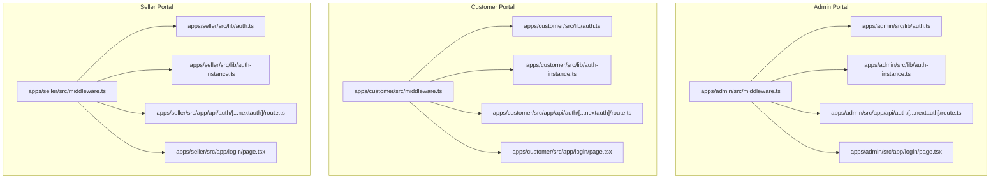
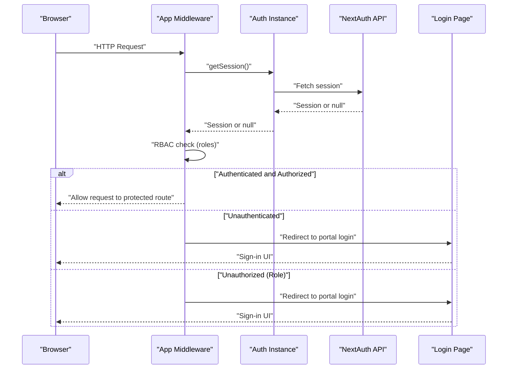
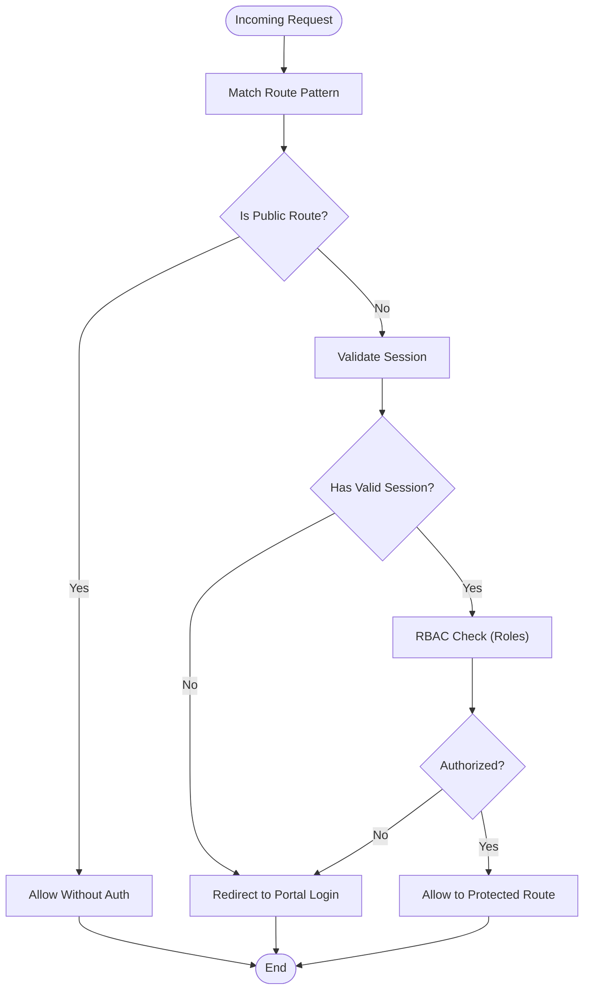
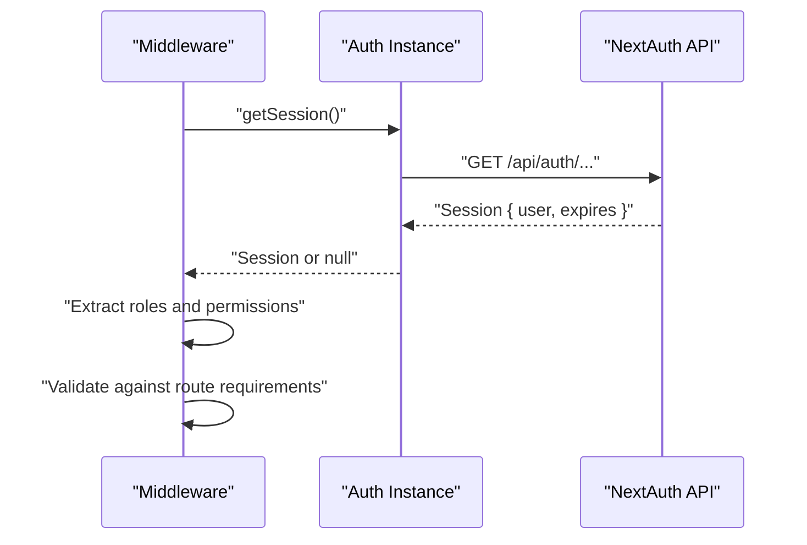
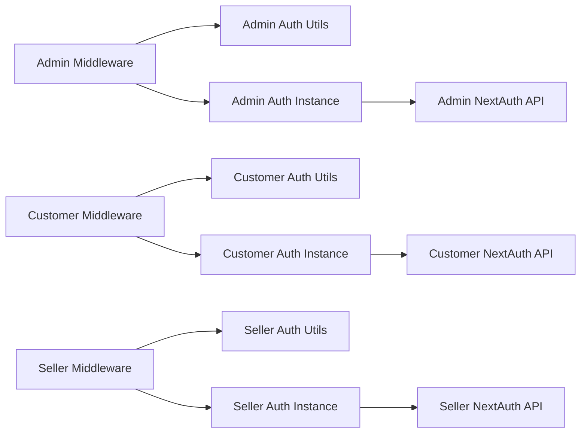

# Middleware Protection

<cite>
**Referenced Files in This Document**
- [admin/middleware.ts](file://apps/admin/src/middleware.ts)
- [customer/middleware.ts](file://apps/customer/src/middleware.ts)
- [seller/middleware.ts](file://apps/seller/src/middleware.ts)
- [admin/lib/auth.ts](file://apps/admin/src/lib/auth.ts)
- [customer/lib/auth.ts](file://apps/customer/src/lib/auth.ts)
- [seller/lib/auth.ts](file://apps/seller/src/lib/auth.ts)
- [admin/lib/auth-instance.ts](file://apps/admin/src/lib/auth-instance.ts)
- [customer/lib/auth-instance.ts](file://apps/customer/src/lib/auth-instance.ts)
- [seller/lib/auth-instance.ts](file://apps/seller/src/lib/auth-instance.ts)
- [admin/app/api/auth/[...nextauth]/route.ts](file://apps/admin/src/app/api/auth/[...nextauth]/route.ts)
- [customer/app/api/auth/[...nextauth]/route.ts](file://apps/customer/src/app/api/auth/[...nextauth]/route.ts)
- [seller/app/api/auth/[...nextauth]/route.ts](file://apps/seller/src/app/api/auth/[...nextauth]/route.ts)
- [admin/app/login/page.tsx](file://apps/admin/src/app/login/page.tsx)
- [customer/app/login/page.tsx](file://apps/customer/src/app/login/page.tsx)
- [seller/app/login/page.tsx](file://apps/seller/src/app/login/page.tsx)
- [admin/app/dashboard/page.tsx](file://apps/admin/src/app/dashboard/page.tsx)
- [customer/app/products/[slug]/page.tsx](file://apps/customer/src/app/products/[slug]/page.tsx)
- [seller/app/dashboard/page.tsx](file://apps/seller/src/app/dashboard/page.tsx)
</cite>

## Table of Contents
1. [Introduction](#introduction)
2. [Project Structure](#project-structure)
3. [Core Components](#core-components)
4. [Architecture Overview](#architecture-overview)
5. [Detailed Component Analysis](#detailed-component-analysis)
6. [Dependency Analysis](#dependency-analysis)
7. [Performance Considerations](#performance-considerations)
8. [Troubleshooting Guide](#troubleshooting-guide)
9. [Conclusion](#conclusion)

## Introduction
This document explains the authentication middleware implementation across the three Next.js applications: admin, customer, and seller. It covers how middleware intercepts requests, validates authentication state, enforces role-based access control, and orchestrates redirects. It also details the middleware chain execution order, authentication flow via NextAuth.js, session validation, and practical guidance for configuring and extending middleware.

## Project Structure
Each application defines its own middleware and authentication utilities:
- Application middleware files: apps/{admin,customer,seller}/src/middleware.ts
- Authentication utilities per app: apps/{admin,customer,seller}/src/lib/auth*.ts
- NextAuth.js API routes: apps/{admin,customer,seller}/src/app/api/auth/[...nextauth]/route.ts
- Login pages per portal: apps/{admin,customer,seller}/src/app/login/page.tsx
- Protected routes per portal: various page.tsx under each app’s app directory

**Diagram sources**
- [admin/middleware.ts:1-200](file://apps/admin/src/middleware.ts#L1-L200)
- [customer/middleware.ts:1-200](file://apps/customer/src/middleware.ts#L1-L200)
- [seller/middleware.ts:1-200](file://apps/seller/src/middleware.ts#L1-L200)
- [admin/lib/auth.ts:1-200](file://apps/admin/src/lib/auth.ts#L1-L200)
- [customer/lib/auth.ts:1-200](file://apps/customer/src/lib/auth.ts#L1-L200)
- [seller/lib/auth.ts:1-200](file://apps/seller/src/lib/auth.ts#L1-L200)
- [admin/lib/auth-instance.ts:1-200](file://apps/admin/src/lib/auth-instance.ts#L1-L200)
- [customer/lib/auth-instance.ts:1-200](file://apps/customer/src/lib/auth-instance.ts#L1-L200)
- [seller/lib/auth-instance.ts:1-200](file://apps/seller/src/lib/auth-instance.ts#L1-L200)
- [admin/app/api/auth/[...nextauth]/route.ts](file://apps/admin/src/app/api/auth/[...nextauth]/route.ts#L1-L200)
- [customer/app/api/auth/[...nextauth]/route.ts](file://apps/customer/src/app/api/auth/[...nextauth]/route.ts#L1-L200)
- [seller/app/api/auth/[...nextauth]/route.ts](file://apps/seller/src/app/api/auth/[...nextauth]/route.ts#L1-L200)
- [admin/app/login/page.tsx:1-200](file://apps/admin/src/app/login/page.tsx#L1-L200)
- [customer/app/login/page.tsx:1-200](file://apps/customer/src/app/login/page.tsx#L1-L200)
- [seller/app/login/page.tsx:1-200](file://apps/seller/src/app/login/page.tsx#L1-L200)

**Section sources**
- [admin/middleware.ts:1-200](file://apps/admin/src/middleware.ts#L1-L200)
- [customer/middleware.ts:1-200](file://apps/customer/src/middleware.ts#L1-L200)
- [seller/middleware.ts:1-200](file://apps/seller/src/middleware.ts#L1-L200)

## Core Components
- Middleware entry points: Each app defines a middleware.ts that exports a middleware function. This function runs for incoming requests and controls access to protected routes.
- Authentication utilities: Each app provides an auth.ts module with helpers for session retrieval, role checks, and protected route guards.
- Auth instances: Each app provides an auth-instance.ts module exporting a configured NextAuth client instance used for session validation and user metadata retrieval.
- NextAuth API: Each app exposes a NextAuth route handler under app/api/auth/[...nextauth]/route.ts to manage sign-in, sign-out, callbacks, and session persistence.
- Login pages: Each portal has a dedicated login page that renders the NextAuth sign-in UI.

Key responsibilities:
- Intercept requests early in the request lifecycle
- Validate session presence and freshness
- Enforce role-based access control (RBAC) based on user roles
- Redirect unauthenticated or unauthorized users to the appropriate login page
- Allow public routes to pass through without authentication

**Section sources**
- [admin/middleware.ts:1-200](file://apps/admin/src/middleware.ts#L1-L200)
- [customer/middleware.ts:1-200](file://apps/customer/src/middleware.ts#L1-L200)
- [seller/middleware.ts:1-200](file://apps/seller/src/middleware.ts#L1-L200)
- [admin/lib/auth.ts:1-200](file://apps/admin/src/lib/auth.ts#L1-L200)
- [customer/lib/auth.ts:1-200](file://apps/customer/src/lib/auth.ts#L1-L200)
- [seller/lib/auth.ts:1-200](file://apps/seller/src/lib/auth.ts#L1-L200)
- [admin/lib/auth-instance.ts:1-200](file://apps/admin/src/lib/auth-instance.ts#L1-L200)
- [customer/lib/auth-instance.ts:1-200](file://apps/customer/src/lib/auth-instance.ts#L1-L200)
- [seller/lib/auth-instance.ts:1-200](file://apps/seller/src/lib/auth-instance.ts#L1-L200)
- [admin/app/api/auth/[...nextauth]/route.ts](file://apps/admin/src/app/api/auth/[...nextauth]/route.ts#L1-L200)
- [customer/app/api/auth/[...nextauth]/route.ts](file://apps/customer/src/app/api/auth/[...nextauth]/route.ts#L1-L200)
- [seller/app/api/auth/[...nextauth]/route.ts](file://apps/seller/src/app/api/auth/[...nextauth]/route.ts#L1-L200)
- [admin/app/login/page.tsx:1-200](file://apps/admin/src/app/login/page.tsx#L1-L200)
- [customer/app/login/page.tsx:1-200](file://apps/customer/src/app/login/page.tsx#L1-L200)
- [seller/app/login/page.tsx:1-200](file://apps/seller/src/app/login/page.tsx#L1-L200)

## Architecture Overview
The middleware architecture follows a consistent pattern across all three portals:
- Middleware executes for every incoming request
- Session validation is performed via the shared NextAuth client instance
- RBAC checks are delegated to the app’s auth utilities
- Unauthorized or unauthenticated requests are redirected to the portal’s login page
- Public routes bypass authentication checks

**Diagram sources**
- [admin/middleware.ts:1-200](file://apps/admin/src/middleware.ts#L1-L200)
- [customer/middleware.ts:1-200](file://apps/customer/src/middleware.ts#L1-L200)
- [seller/middleware.ts:1-200](file://apps/seller/src/middleware.ts#L1-L200)
- [admin/lib/auth-instance.ts:1-200](file://apps/admin/src/lib/auth-instance.ts#L1-L200)
- [customer/lib/auth-instance.ts:1-200](file://apps/customer/src/lib/auth-instance.ts#L1-L200)
- [seller/lib/auth-instance.ts:1-200](file://apps/seller/src/lib/auth-instance.ts#L1-L200)
- [admin/app/api/auth/[...nextauth]/route.ts](file://apps/admin/src/app/api/auth/[...nextauth]/route.ts#L1-L200)
- [customer/app/api/auth/[...nextauth]/route.ts](file://apps/customer/src/app/api/auth/[...nextauth]/route.ts#L1-L200)
- [seller/app/api/auth/[...nextauth]/route.ts](file://apps/seller/src/app/api/auth/[...nextauth]/route.ts#L1-L200)
- [admin/app/login/page.tsx:1-200](file://apps/admin/src/app/login/page.tsx#L1-L200)
- [customer/app/login/page.tsx:1-200](file://apps/customer/src/app/login/page.tsx#L1-L200)
- [seller/app/login/page.tsx:1-200](file://apps/seller/src/app/login/page.tsx#L1-L200)

## Detailed Component Analysis

### Middleware Chain Execution Order
- Global middleware runs first for all requests
- Each app’s middleware.ts is executed after global middleware and before route handlers
- Middleware applies to all routes unless excluded by configuration
- Public routes (e.g., login, static assets) are typically excluded from middleware processing

Practical implications:
- Place shared pre-processing logic in global middleware if applicable
- Keep app-specific middleware focused on session validation and RBAC
- Use Next.js middleware matcher configuration to narrow protected paths

**Section sources**
- [admin/middleware.ts:1-200](file://apps/admin/src/middleware.ts#L1-L200)
- [customer/middleware.ts:1-200](file://apps/customer/src/middleware.ts#L1-L200)
- [seller/middleware.ts:1-200](file://apps/seller/src/middleware.ts#L1-L200)

### Authentication Flow Through Portals
- Admin portal: Uses NextAuth for session management and redirects unauthenticated users to the admin login page
- Customer portal: Same pattern with customer-specific login and protected routes
- Seller portal: Same pattern with seller-specific login and protected routes

**Diagram sources**
- [admin/middleware.ts:1-200](file://apps/admin/src/middleware.ts#L1-L200)
- [customer/middleware.ts:1-200](file://apps/customer/src/middleware.ts#L1-L200)
- [seller/middleware.ts:1-200](file://apps/seller/src/middleware.ts#L1-L200)
- [admin/app/login/page.tsx:1-200](file://apps/admin/src/app/login/page.tsx#L1-L200)
- [customer/app/login/page.tsx:1-200](file://apps/customer/src/app/login/page.tsx#L1-L200)
- [seller/app/login/page.tsx:1-200](file://apps/seller/src/app/login/page.tsx#L1-L200)

### Session Validation Processes
- Session retrieval: Each app’s auth-instance.ts exports a configured NextAuth client used to fetch the current session
- Session freshness: NextAuth handles cookie/session validation and refresh logic
- Metadata access: The auth utilities expose helpers to extract user roles and permissions for RBAC decisions

**Diagram sources**
- [admin/lib/auth-instance.ts:1-200](file://apps/admin/src/lib/auth-instance.ts#L1-L200)
- [customer/lib/auth-instance.ts:1-200](file://apps/customer/src/lib/auth-instance.ts#L1-L200)
- [seller/lib/auth-instance.ts:1-200](file://apps/seller/src/lib/auth-instance.ts#L1-L200)
- [admin/app/api/auth/[...nextauth]/route.ts](file://apps/admin/src/app/api/auth/[...nextauth]/route.ts#L1-L200)
- [customer/app/api/auth/[...nextauth]/route.ts](file://apps/customer/src/app/api/auth/[...nextauth]/route.ts#L1-L200)
- [seller/app/api/auth/[...nextauth]/route.ts](file://apps/seller/src/app/api/auth/[...nextauth]/route.ts#L1-L200)

### Role-Based Access Control (RBAC)
- RBAC is enforced in each app’s auth utilities by checking user roles against required roles for specific routes
- Unauthorized requests are redirected to the portal’s login page
- Public routes bypass RBAC checks

Common patterns:
- Define required roles per route or group of routes
- Centralize role checks in a single helper for consistency
- Support multiple roles per route (allow-list)

**Section sources**
- [admin/lib/auth.ts:1-200](file://apps/admin/src/lib/auth.ts#L1-L200)
- [customer/lib/auth.ts:1-200](file://apps/customer/src/lib/auth.ts#L1-L200)
- [seller/lib/auth.ts:1-200](file://apps/seller/src/lib/auth.ts#L1-L200)

### Practical Examples

#### Example: Middleware Configuration
- Configure middleware matchers to target protected routes and exclude public routes
- Use environment-aware logic to enable/disable middleware for specific environments

Reference paths:
- [admin/middleware.ts:1-200](file://apps/admin/src/middleware.ts#L1-L200)
- [customer/middleware.ts:1-200](file://apps/customer/src/middleware.ts#L1-L200)
- [seller/middleware.ts:1-200](file://apps/seller/src/middleware.ts#L1-L200)

#### Example: Custom Middleware Implementation
- Extend the middleware to add pre-authentication hooks (e.g., IP allowlisting, rate limiting)
- Integrate with external identity providers or SSO systems
- Add structured logging for authentication events

Reference paths:
- [admin/middleware.ts:1-200](file://apps/admin/src/middleware.ts#L1-L200)
- [customer/middleware.ts:1-200](file://apps/customer/src/middleware.ts#L1-L200)
- [seller/middleware.ts:1-200](file://apps/seller/src/middleware.ts#L1-L200)

#### Example: Handling Authentication Redirects
- Redirect unauthenticated users to the portal’s login page
- Preserve intended destination using Next.js router.replace or similar mechanisms
- Handle unauthorized users similarly by redirecting to login

Reference paths:
- [admin/app/login/page.tsx:1-200](file://apps/admin/src/app/login/page.tsx#L1-L200)
- [customer/app/login/page.tsx:1-200](file://apps/customer/src/app/login/page.tsx#L1-L200)
- [seller/app/login/page.tsx:1-200](file://apps/seller/src/app/login/page.tsx#L1-L200)

### Relationship Between Global Middleware and Application-Specific Middleware
- Global middleware runs first and can perform cross-cutting concerns (logging, telemetry, CSP)
- App-specific middleware runs after global middleware and focuses on authentication and RBAC
- App-specific middleware can override or refine behavior set by global middleware

Best practices:
- Keep global middleware lightweight
- Delegate authentication logic to app-specific middleware
- Use middleware matchers to minimize unnecessary processing

**Section sources**
- [admin/middleware.ts:1-200](file://apps/admin/src/middleware.ts#L1-L200)
- [customer/middleware.ts:1-200](file://apps/customer/src/middleware.ts#L1-L200)
- [seller/middleware.ts:1-200](file://apps/seller/src/middleware.ts#L1-L200)

## Dependency Analysis
The middleware stack depends on:
- NextAuth client instance for session retrieval
- NextAuth API route for session management
- Auth utilities for RBAC checks
- Login pages for redirects

**Diagram sources**
- [admin/middleware.ts:1-200](file://apps/admin/src/middleware.ts#L1-L200)
- [customer/middleware.ts:1-200](file://apps/customer/src/middleware.ts#L1-L200)
- [seller/middleware.ts:1-200](file://apps/seller/src/middleware.ts#L1-L200)
- [admin/lib/auth.ts:1-200](file://apps/admin/src/lib/auth.ts#L1-L200)
- [customer/lib/auth.ts:1-200](file://apps/customer/src/lib/auth.ts#L1-L200)
- [seller/lib/auth.ts:1-200](file://apps/seller/src/lib/auth.ts#L1-L200)
- [admin/lib/auth-instance.ts:1-200](file://apps/admin/src/lib/auth-instance.ts#L1-L200)
- [customer/lib/auth-instance.ts:1-200](file://apps/customer/src/lib/auth-instance.ts#L1-L200)
- [seller/lib/auth-instance.ts:1-200](file://apps/seller/src/lib/auth-instance.ts#L1-L200)
- [admin/app/api/auth/[...nextauth]/route.ts](file://apps/admin/src/app/api/auth/[...nextauth]/route.ts#L1-L200)
- [customer/app/api/auth/[...nextauth]/route.ts](file://apps/customer/src/app/api/auth/[...nextauth]/route.ts#L1-L200)
- [seller/app/api/auth/[...nextauth]/route.ts](file://apps/seller/src/app/api/auth/[...nextauth]/route.ts#L1-L200)

**Section sources**
- [admin/middleware.ts:1-200](file://apps/admin/src/middleware.ts#L1-L200)
- [customer/middleware.ts:1-200](file://apps/customer/src/middleware.ts#L1-L200)
- [seller/middleware.ts:1-200](file://apps/seller/src/middleware.ts#L1-L200)
- [admin/lib/auth.ts:1-200](file://apps/admin/src/lib/auth.ts#L1-L200)
- [customer/lib/auth.ts:1-200](file://apps/customer/src/lib/auth.ts#L1-L200)
- [seller/lib/auth.ts:1-200](file://apps/seller/src/lib/auth.ts#L1-L200)
- [admin/lib/auth-instance.ts:1-200](file://apps/admin/src/lib/auth-instance.ts#L1-L200)
- [customer/lib/auth-instance.ts:1-200](file://apps/customer/src/lib/auth-instance.ts#L1-L200)
- [seller/lib/auth-instance.ts:1-200](file://apps/seller/src/lib/auth-instance.ts#L1-L200)
- [admin/app/api/auth/[...nextauth]/route.ts](file://apps/admin/src/app/api/auth/[...nextauth]/route.ts#L1-L200)
- [customer/app/api/auth/[...nextauth]/route.ts](file://apps/customer/src/app/api/auth/[...nextauth]/route.ts#L1-L200)
- [seller/app/api/auth/[...nextauth]/route.ts](file://apps/seller/src/app/api/auth/[...nextauth]/route.ts#L1-L200)

## Performance Considerations
- Minimize middleware work: perform only essential checks (session retrieval, role checks)
- Cache session data when safe to avoid repeated network calls to NextAuth
- Use middleware matchers to limit the scope of protected routes
- Avoid heavy synchronous operations in middleware; defer to server-side rendering or API routes when possible
- Monitor redirect loops and ensure login URLs are excluded from middleware processing

## Troubleshooting Guide
Common issues and resolutions:
- Redirect loops: Ensure login pages are excluded from middleware matchers
- Stale sessions: Verify NextAuth cookie settings and session duration
- Role mismatches: Confirm role claims are present in the session and RBAC logic aligns with route requirements
- Cross-portal access attempts: Enforce strict portal boundaries in middleware and NextAuth configuration

Operational checks:
- Validate that the auth instance is correctly initialized and exported
- Confirm NextAuth API route is reachable and configured properly
- Inspect browser cookies for session validity

**Section sources**
- [admin/middleware.ts:1-200](file://apps/admin/src/middleware.ts#L1-L200)
- [customer/middleware.ts:1-200](file://apps/customer/src/middleware.ts#L1-L200)
- [seller/middleware.ts:1-200](file://apps/seller/src/middleware.ts#L1-L200)
- [admin/lib/auth-instance.ts:1-200](file://apps/admin/src/lib/auth-instance.ts#L1-L200)
- [customer/lib/auth-instance.ts:1-200](file://apps/customer/src/lib/auth-instance.ts#L1-L200)
- [seller/lib/auth-instance.ts:1-200](file://apps/seller/src/lib/auth-instance.ts#L1-L200)
- [admin/app/api/auth/[...nextauth]/route.ts](file://apps/admin/src/app/api/auth/[...nextauth]/route.ts#L1-L200)
- [customer/app/api/auth/[...nextauth]/route.ts](file://apps/customer/src/app/api/auth/[...nextauth]/route.ts#L1-L200)
- [seller/app/api/auth/[...nextauth]/route.ts](file://apps/seller/src/app/api/auth/[...nextauth]/route.ts#L1-L200)

## Conclusion
The authentication middleware across the admin, customer, and seller portals follows a consistent, scalable pattern built on NextAuth.js. Middleware intercepts requests, validates sessions, enforces RBAC, and redirects appropriately. By centralizing session retrieval and role checks in app-specific utilities and leveraging NextAuth for session management, the system maintains clarity, performance, and maintainability. Extending middleware should focus on minimal, targeted logic while preserving the established flow and redirect semantics.