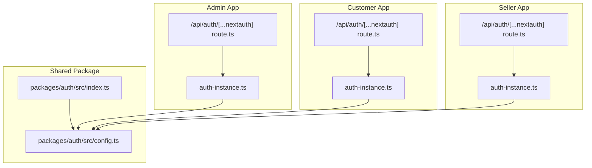
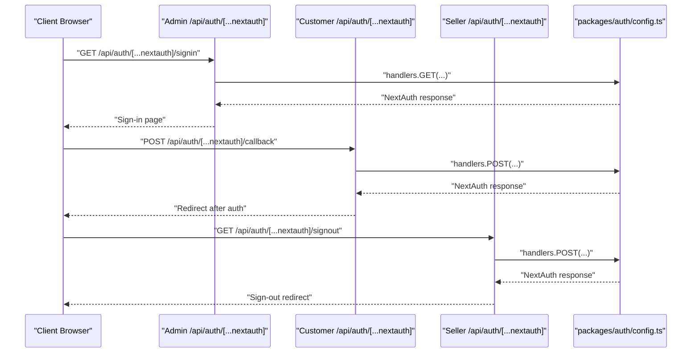
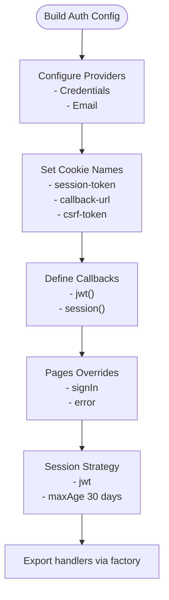
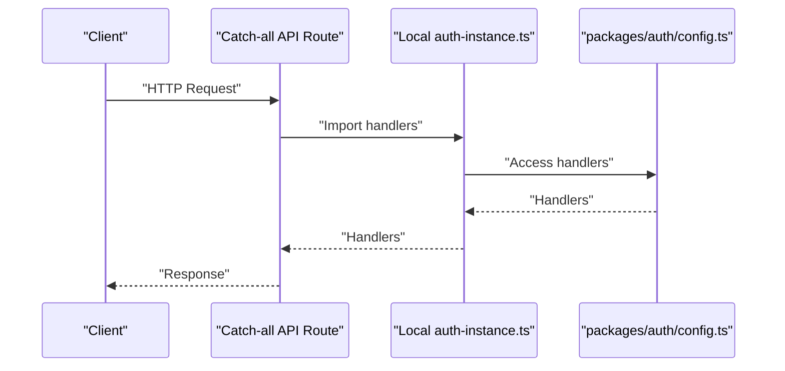
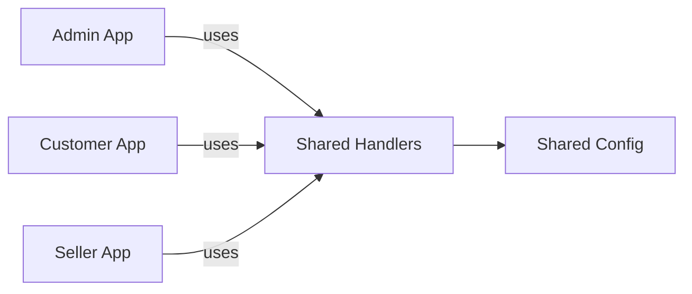
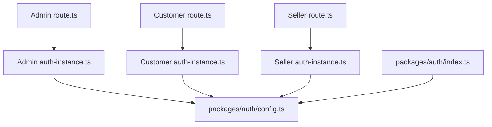

# NextAuth.js Configuration

<cite>
**Referenced Files in This Document**
- [route.ts](file://apps/admin/src/app/api/auth/[...nextauth]/route.ts)
- [route.ts](file://apps/customer/src/app/api/auth/[...nextauth]/route.ts)
- [route.ts](file://apps/seller/src/app/api/auth/[...nextauth]/route.ts)
- [auth-instance.ts](file://apps/admin/src/lib/auth-instance.ts)
- [auth-instance.ts](file://apps/customer/src/lib/auth-instance.ts)
- [auth-instance.ts](file://apps/seller/src/lib/auth-instance.ts)
- [auth.ts](file://apps/admin/src/lib/auth.ts)
- [auth.ts](file://apps/seller/src/lib/auth.ts)
- [config.ts](file://packages/auth/src/config.ts)
- [index.ts](file://packages/auth/src/index.ts)
</cite>

## Table of Contents
1. [Introduction](#introduction)
2. [Project Structure](#project-structure)
3. [Core Components](#core-components)
4. [Architecture Overview](#architecture-overview)
5. [Detailed Component Analysis](#detailed-component-analysis)
6. [Dependency Analysis](#dependency-analysis)
7. [Performance Considerations](#performance-considerations)
8. [Troubleshooting Guide](#troubleshooting-guide)
9. [Conclusion](#conclusion)

## Introduction
This document explains the NextAuth.js v5 configuration used across the Avenick Commerce monorepo. It focuses on how authentication providers are configured (credentials and email), how the NextAuth configuration object is structured, how callbacks and session handling work, and how JWT tokens are customized. It also details how the centralized authentication configuration is shared across all three applications (admin, customer, seller) and highlights security considerations, session store configuration, and provider-specific settings.

## Project Structure
The authentication system is implemented in a shared package and consumed by each application via thin API routes and local instances.

- Shared configuration and utilities live under the packages/auth package.
- Each application exposes NextAuth endpoints via a catch-all API route under its own namespace.
- Local instances in each app import the shared handlers and expose them.

**Diagram sources**
- [route.ts:1-3](file://apps/admin/src/app/api/auth/[...nextauth]/route.ts#L1-L3)
- [route.ts:1-3](file://apps/customer/src/app/api/auth/[...nextauth]/route.ts#L1-L3)
- [route.ts:1-3](file://apps/seller/src/app/api/auth/[...nextauth]/route.ts#L1-L3)
- [auth-instance.ts](file://apps/admin/src/lib/auth-instance.ts)
- [auth-instance.ts](file://apps/customer/src/lib/auth-instance.ts)
- [auth-instance.ts](file://apps/seller/src/lib/auth-instance.ts)
- [config.ts](file://packages/auth/src/config.ts)
- [index.ts:1-3](file://packages/auth/src/index.ts#L1-L3)

**Section sources**
- [route.ts:1-3](file://apps/admin/src/app/api/auth/[...nextauth]/route.ts#L1-L3)
- [route.ts:1-3](file://apps/customer/src/app/api/auth/[...nextauth]/route.ts#L1-L3)
- [route.ts:1-3](file://apps/seller/src/app/api/auth/[...nextauth]/route.ts#L1-L3)
- [auth-instance.ts](file://apps/admin/src/lib/auth-instance.ts)
- [auth-instance.ts](file://apps/customer/src/lib/auth-instance.ts)
- [auth-instance.ts](file://apps/seller/src/lib/auth-instance.ts)
- [config.ts](file://packages/auth/src/config.ts)
- [index.ts:1-3](file://packages/auth/src/index.ts#L1-L3)

## Core Components
- Centralized NextAuth configuration builder and factory:
  - The shared package exports a builder that constructs the NextAuth configuration object, including providers, callbacks, session strategy, cookie names, and pages.
  - A factory function creates a NextAuth instance for a given application name.
- Application-side handler exposure:
  - Each app defines a catch-all API route that re-exports the shared handlers.
  - Local instances import the shared handlers and expose GET/POST.

Key capabilities:
- Provider configuration supports credentials and email.
- JWT callbacks enrich tokens with role and language.
- Session callbacks propagate token data to the session object.
- Cookie names are prefixed per application to avoid conflicts.
- Pages override for sign-in and error redirection.
- Session strategy set to JWT with a 30-day max age.

**Section sources**
- [config.ts:39-93](file://packages/auth/src/config.ts#L39-L93)
- [index.ts:1-3](file://packages/auth/src/index.ts#L1-L3)
- [route.ts:1-3](file://apps/admin/src/app/api/auth/[...nextauth]/route.ts#L1-L3)
- [route.ts:1-3](file://apps/customer/src/app/api/auth/[...nextauth]/route.ts#L1-L3)
- [route.ts:1-3](file://apps/seller/src/app/api/auth/[...nextauth]/route.ts#L1-L3)

## Architecture Overview
The system follows a shared-configuration pattern:
- The shared package builds the NextAuth configuration.
- Each app imports the handlers from the shared package and exposes them via its own API route.
- The configuration is identical across apps except for application-specific cookie prefixes.

**Diagram sources**
- [route.ts:1-3](file://apps/admin/src/app/api/auth/[...nextauth]/route.ts#L1-L3)
- [route.ts:1-3](file://apps/customer/src/app/api/auth/[...nextauth]/route.ts#L1-L3)
- [route.ts:1-3](file://apps/seller/src/app/api/auth/[...nextauth]/route.ts#L1-L3)
- [config.ts](file://packages/auth/src/config.ts)

## Detailed Component Analysis

### Shared NextAuth Configuration Builder
The shared configuration builder:
- Defines a credentials provider that validates users against stored credentials, checks account status, and returns a minimal user profile.
- Configures an email provider (provider definition present in the builder).
- Sets cookie names with application-specific prefixes to prevent cross-app cookie collisions.
- Implements JWT and session callbacks to attach role and language to tokens and sessions.
- Redirects to a sign-in page on errors and sets a 30-day JWT session max age.
- Trusts the host for seamless operation across environments.

**Diagram sources**
- [config.ts:39-93](file://packages/auth/src/config.ts#L39-L93)

**Section sources**
- [config.ts:39-93](file://packages/auth/src/config.ts#L39-L93)

### Application-Side Handler Exposure
Each application exposes the shared handlers via a catch-all API route:
- The route imports handlers from the local auth-instance module.
- It re-exports GET and POST handlers to NextAuth.

**Diagram sources**
- [route.ts:1-3](file://apps/admin/src/app/api/auth/[...nextauth]/route.ts#L1-L3)
- [route.ts:1-3](file://apps/customer/src/app/api/auth/[...nextauth]/route.ts#L1-L3)
- [route.ts:1-3](file://apps/seller/src/app/api/auth/[...nextauth]/route.ts#L1-L3)
- [auth-instance.ts](file://apps/admin/src/lib/auth-instance.ts)
- [auth-instance.ts](file://apps/customer/src/lib/auth-instance.ts)
- [auth-instance.ts](file://apps/seller/src/lib/auth-instance.ts)
- [config.ts](file://packages/auth/src/config.ts)

**Section sources**
- [route.ts:1-3](file://apps/admin/src/app/api/auth/[...nextauth]/route.ts#L1-L3)
- [route.ts:1-3](file://apps/customer/src/app/api/auth/[...nextauth]/route.ts#L1-L3)
- [route.ts:1-3](file://apps/seller/src/app/api/auth/[...nextauth]/route.ts#L1-L3)
- [auth-instance.ts](file://apps/admin/src/lib/auth-instance.ts)
- [auth-instance.ts](file://apps/customer/src/lib/auth-instance.ts)
- [auth-instance.ts](file://apps/seller/src/lib/auth-instance.ts)

### Authentication Providers Setup
- Credentials provider:
  - Validates user credentials against stored hash.
  - Ensures the user account is active.
  - Returns a normalized user object with id, email, name, role, language, and optional avatar.
- Email provider:
  - Provider is defined in the builder; ensure the email transport is configured in the environment.

Provider-specific notes:
- The credentials provider performs server-side password verification and returns a minimal profile suitable for JWT/session propagation.
- The email provider relies on NextAuth’s built-in magic link/email flow and requires proper email service configuration.

**Section sources**
- [config.ts:39-56](file://packages/auth/src/config.ts#L39-L56)

### NextAuth Configuration Object
Key configuration elements:
- Providers: credentials and email.
- Cookies: application-scoped cookie names to avoid conflicts.
- Callbacks: JWT and session callbacks enrich token/session with role and language.
- Pages: redirects to the sign-in page on error and for initial sign-in.
- Session: JWT strategy with a 30-day max age.
- Trust host: allows NextAuth to operate across various deployment hosts.

**Section sources**
- [config.ts:57-84](file://packages/auth/src/config.ts#L57-L84)

### Callback Functions
- JWT callback:
  - On first login, attaches role and language to the token.
- Session callback:
  - Injects user id, role, and language into the session object derived from the token.

These callbacks ensure that downstream parts of the application can rely on consistent user metadata being available in both JWT and session contexts.

**Section sources**
- [config.ts:62-77](file://packages/auth/src/config.ts#L62-L77)

### Session Handling and JWT Token Configuration
- Strategy: JWT.
- Max age: 30 days.
- Token enrichment: role and language are stored in the token during the JWT callback.
- Session enrichment: the session callback copies token data into the session object.

This design centralizes user metadata in the token and propagates it to the session for convenience.

**Section sources**
- [config.ts:78-84](file://packages/auth/src/config.ts#L78-L84)

### Sharing Across Applications
- Each app defines a local auth-instance module that imports the shared handlers.
- Each app exposes a catch-all API route that re-exports the shared handlers.
- The shared configuration ensures identical behavior across admin, customer, and seller apps, while allowing per-app cookie names to avoid conflicts.

**Diagram sources**
- [auth-instance.ts](file://apps/admin/src/lib/auth-instance.ts)
- [auth-instance.ts](file://apps/customer/src/lib/auth-instance.ts)
- [auth-instance.ts](file://apps/seller/src/lib/auth-instance.ts)
- [config.ts](file://packages/auth/src/config.ts)

**Section sources**
- [auth-instance.ts](file://apps/admin/src/lib/auth-instance.ts)
- [auth-instance.ts](file://apps/customer/src/lib/auth-instance.ts)
- [auth-instance.ts](file://apps/seller/src/lib/auth-instance.ts)
- [route.ts:1-3](file://apps/admin/src/app/api/auth/[...nextauth]/route.ts#L1-L3)
- [route.ts:1-3](file://apps/customer/src/app/api/auth/[...nextauth]/route.ts#L1-L3)
- [route.ts:1-3](file://apps/seller/src/app/api/auth/[...nextauth]/route.ts#L1-L3)

### Practical Examples and Guidance
- Configure providers:
  - Add or adjust the credentials provider logic to match your user model and hashing scheme.
  - Ensure the email provider is enabled and configured with a valid email transport.
- Customize callbacks:
  - Extend the JWT callback to include additional claims (e.g., permissions, tenantId).
  - Extend the session callback to populate session.user with additional fields.
- Manage sessions:
  - Adjust maxAge to balance security and UX.
  - Consider refresh token strategies if switching from JWT to database-backed sessions.
- Customize JWT payload:
  - Add fields in the JWT callback and read them in the session callback.
- Security considerations:
  - Enforce HTTPS in production.
  - Set secure and sameSite flags on cookies if applicable.
  - Rotate secrets regularly.
  - Limit maxAge and implement logout to invalidate tokens.

[No sources needed since this section provides general guidance]

## Dependency Analysis
The dependency chain is straightforward and intentional:
- Application API routes depend on local auth-instance modules.
- Local auth-instance modules depend on the shared package exports.
- The shared package depends on NextAuth internals and provider configurations.

**Diagram sources**
- [route.ts:1-3](file://apps/admin/src/app/api/auth/[...nextauth]/route.ts#L1-L3)
- [route.ts:1-3](file://apps/customer/src/app/api/auth/[...nextauth]/route.ts#L1-L3)
- [route.ts:1-3](file://apps/seller/src/app/api/auth/[...nextauth]/route.ts#L1-L3)
- [auth-instance.ts](file://apps/admin/src/lib/auth-instance.ts)
- [auth-instance.ts](file://apps/customer/src/lib/auth-instance.ts)
- [auth-instance.ts](file://apps/seller/src/lib/auth-instance.ts)
- [config.ts](file://packages/auth/src/config.ts)
- [index.ts:1-3](file://packages/auth/src/index.ts#L1-L3)

**Section sources**
- [index.ts:1-3](file://packages/auth/src/index.ts#L1-L3)
- [config.ts](file://packages/auth/src/config.ts)
- [route.ts:1-3](file://apps/admin/src/app/api/auth/[...nextauth]/route.ts#L1-L3)
- [route.ts:1-3](file://apps/customer/src/app/api/auth/[...nextauth]/route.ts#L1-L3)
- [route.ts:1-3](file://apps/seller/src/app/api/auth/[...nextauth]/route.ts#L1-L3)
- [auth-instance.ts](file://apps/admin/src/lib/auth-instance.ts)
- [auth-instance.ts](file://apps/customer/src/lib/auth-instance.ts)
- [auth-instance.ts](file://apps/seller/src/lib/auth-instance.ts)

## Performance Considerations
- JWT strategy avoids database lookups for session validation but increases token size; keep claims minimal.
- Session maxAge of 30 days balances usability and security; consider shorter durations for sensitive environments.
- Provider lookups (e.g., email) incur network overhead; ensure reliable transports and timeouts.
- Cookie prefixing prevents cross-app interference but does not add significant overhead.

[No sources needed since this section provides general guidance]

## Troubleshooting Guide
Common issues and resolutions:
- Sign-in fails silently:
  - Verify provider credentials and ensure the user account is active.
  - Confirm cookie names are unique per app and not blocked by browser policies.
- Session not populated:
  - Ensure callbacks are defined and returning expected values.
  - Check that the client receives the session after authentication.
- Host mismatch errors:
  - Enable trustHost to allow NextAuth to operate across environments.
- Email provider not working:
  - Confirm email transport configuration and environment variables.
- Cross-app cookie conflicts:
  - Ensure cookie names are prefixed per app and not shared across domains.

**Section sources**
- [config.ts:57-84](file://packages/auth/src/config.ts#L57-L84)
- [config.ts:62-77](file://packages/auth/src/config.ts#L62-L77)

## Conclusion
Avenick Commerce centralizes NextAuth.js configuration in a shared package and exposes it consistently across the admin, customer, and seller applications. The configuration leverages JWT for session management, enriches tokens with role and language, and provides application-scoped cookie names to prevent conflicts. By following the patterns outlined here, teams can maintain a unified authentication experience while preserving flexibility for app-specific needs.