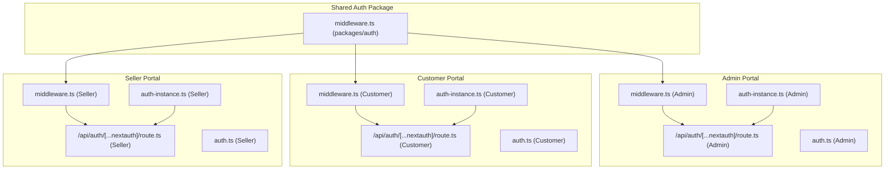
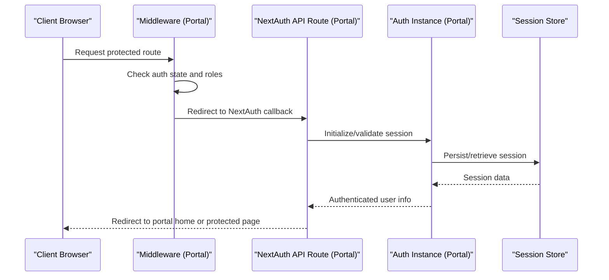
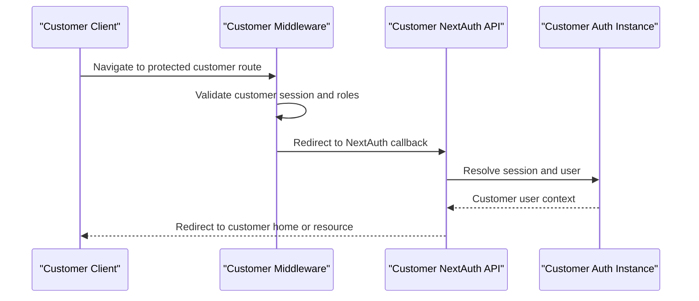
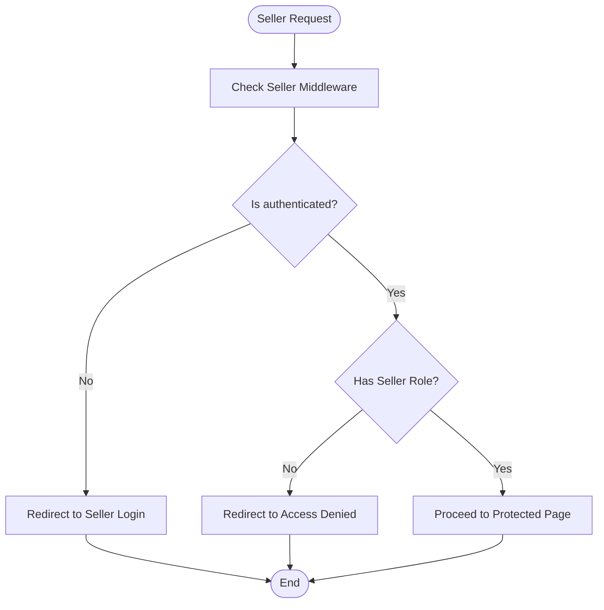
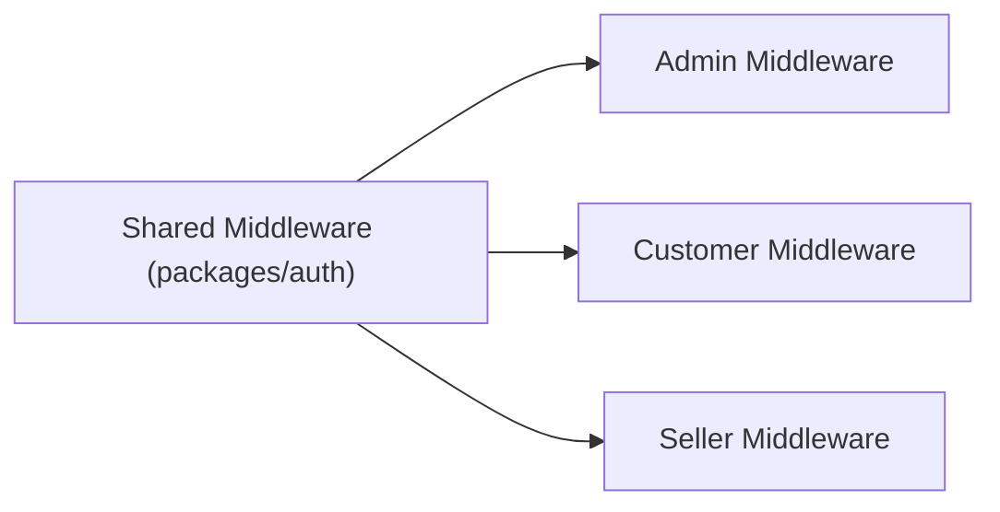
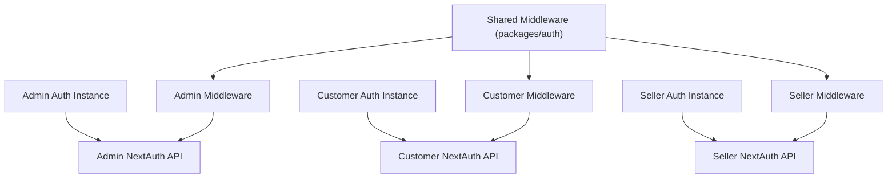

# Portal-Specific Authentication Instances

<cite>
**Referenced Files in This Document**
- [auth-instance.ts (Admin)](file://apps/admin/src/lib/auth-instance.ts)
- [auth.ts (Admin)](file://apps/admin/src/lib/auth.ts)
- [middleware.ts (Admin)](file://apps/admin/src/middleware.ts)
- [route.ts (Admin NextAuth API)](file://apps/admin/src/app/api/auth/[...nextauth]/route.ts)
- [auth-instance.ts (Customer)](file://apps/customer/src/lib/auth-instance.ts)
- [auth.ts (Customer)](file://apps/customer/src/lib/auth.ts)
- [middleware.ts (Customer)](file://apps/customer/src/middleware.ts)
- [route.ts (Customer NextAuth API)](file://apps/customer/src/app/api/auth/[...nextauth]/route.ts)
- [auth-instance.ts (Seller)](file://apps/seller/src/lib/auth-instance.ts)
- [auth.ts (Seller)](file://apps/seller/src/lib/auth.ts)
- [middleware.ts (Seller)](file://apps/seller/src/middleware.ts)
- [route.ts (Seller NextAuth API)](file://apps/seller/src/app/api/auth/[...nextauth]/route.ts)
- [middleware.ts (Shared Auth Package)](file://packages/auth/src/middleware.ts)
</cite>

## Table of Contents
1. [Introduction](#introduction)
2. [Project Structure](#project-structure)
3. [Core Components](#core-components)
4. [Architecture Overview](#architecture-overview)
5. [Detailed Component Analysis](#detailed-component-analysis)
6. [Dependency Analysis](#dependency-analysis)
7. [Performance Considerations](#performance-considerations)
8. [Troubleshooting Guide](#troubleshooting-guide)
9. [Conclusion](#conclusion)

## Introduction
This document explains how each portal application (admin, customer, seller) creates and manages its own authentication instance while sharing common authentication logic. It covers the authentication instance creation process, configuration differences across portals, session and state handling, and practical examples for implementing portal-specific authentication requirements. The focus is on the shared NextAuth-based authentication flow and how each application adapts it to its domain needs.

## Project Structure
Each portal application defines its own authentication instance and middleware, with a dedicated NextAuth API route. A shared authentication package provides reusable middleware logic that can be extended per portal.

**Diagram sources**
- [middleware.ts (Admin)](file://apps/admin/src/middleware.ts)
- [route.ts (Admin NextAuth API)](file://apps/admin/src/app/api/auth/[...nextauth]/route.ts)
- [auth-instance.ts (Admin)](file://apps/admin/src/lib/auth-instance.ts)
- [auth.ts (Admin)](file://apps/admin/src/lib/auth.ts)
- [middleware.ts (Customer)](file://apps/customer/src/middleware.ts)
- [route.ts (Customer NextAuth API)](file://apps/customer/src/app/api/auth/[...nextauth]/route.ts)
- [auth-instance.ts (Customer)](file://apps/customer/src/lib/auth-instance.ts)
- [auth.ts (Customer)](file://apps/customer/src/lib/auth.ts)
- [middleware.ts (Seller)](file://apps/seller/src/middleware.ts)
- [route.ts (Seller NextAuth API)](file://apps/seller/src/app/api/auth/[...nextauth]/route.ts)
- [auth-instance.ts (Seller)](file://apps/seller/src/lib/auth-instance.ts)
- [auth.ts (Seller)](file://apps/seller/src/lib/auth.ts)
- [middleware.ts (Shared Auth Package)](file://packages/auth/src/middleware.ts)

**Section sources**
- [auth-instance.ts (Admin)](file://apps/admin/src/lib/auth-instance.ts)
- [auth-instance.ts (Customer)](file://apps/customer/src/lib/auth-instance.ts)
- [auth-instance.ts (Seller)](file://apps/seller/src/lib/auth-instance.ts)
- [middleware.ts (Admin)](file://apps/admin/src/middleware.ts)
- [middleware.ts (Customer)](file://apps/customer/src/middleware.ts)
- [middleware.ts (Seller)](file://apps/seller/src/middleware.ts)
- [route.ts (Admin NextAuth API)](file://apps/admin/src/app/api/auth/[...nextauth]/route.ts)
- [route.ts (Customer NextAuth API)](file://apps/customer/src/app/api/auth/[...nextauth]/route.ts)
- [route.ts (Seller NextAuth API)](file://apps/seller/src/app/api/auth/[...nextauth]/route.ts)
- [middleware.ts (Shared Auth Package)](file://packages/auth/src/middleware.ts)

## Core Components
- Portal-specific authentication instances: Each application initializes its own NextAuth instance with portal-specific configuration (providers, callbacks, pages, etc.). These instances are created in dedicated files under each app’s lib directory.
- Shared middleware: A shared middleware module provides common authentication checks and routing logic that can be reused across portals.
- NextAuth API routes: Each portal exposes a NextAuth API route under its own namespace to handle authentication callbacks and flows.
- Session and state management: Each portal manages user sessions independently, with portal-specific session data and state transitions.

Key implementation patterns:
- Authentication instance creation per portal with distinct configuration.
- Middleware-driven access control and redirection logic.
- Dedicated NextAuth API endpoints for each portal.

**Section sources**
- [auth-instance.ts (Admin)](file://apps/admin/src/lib/auth-instance.ts)
- [auth-instance.ts (Customer)](file://apps/customer/src/lib/auth-instance.ts)
- [auth-instance.ts (Seller)](file://apps/seller/src/lib/auth-instance.ts)
- [middleware.ts (Admin)](file://apps/admin/src/middleware.ts)
- [middleware.ts (Customer)](file://apps/customer/src/middleware.ts)
- [middleware.ts (Seller)](file://apps/seller/src/middleware.ts)
- [route.ts (Admin NextAuth API)](file://apps/admin/src/app/api/auth/[...nextauth]/route.ts)
- [route.ts (Customer NextAuth API)](file://apps/customer/src/app/api/auth/[...nextauth]/route.ts)
- [route.ts (Seller NextAuth API)](file://apps/seller/src/app/api/auth/[...nextauth]/route.ts)
- [middleware.ts (Shared Auth Package)](file://packages/auth/src/middleware.ts)

## Architecture Overview
The authentication architecture follows a modular pattern:
- Each portal encapsulates its authentication logic via a dedicated instance file.
- A shared middleware module centralizes common authentication behaviors.
- NextAuth API routes serve as the single entry point for authentication flows within each portal.
- Session and state are managed per portal with portal-specific callbacks and redirects.

**Diagram sources**
- [middleware.ts (Admin)](file://apps/admin/src/middleware.ts)
- [route.ts (Admin NextAuth API)](file://apps/admin/src/app/api/auth/[...nextauth]/route.ts)
- [auth-instance.ts (Admin)](file://apps/admin/src/lib/auth-instance.ts)
- [middleware.ts (Customer)](file://apps/customer/src/middleware.ts)
- [route.ts (Customer NextAuth API)](file://apps/customer/src/app/api/auth/[...nextauth]/route.ts)
- [auth-instance.ts (Customer)](file://apps/customer/src/lib/auth-instance.ts)
- [middleware.ts (Seller)](file://apps/seller/src/middleware.ts)
- [route.ts (Seller NextAuth API)](file://apps/seller/src/app/api/auth/[...nextauth]/route.ts)
- [auth-instance.ts (Seller)](file://apps/seller/src/lib/auth-instance.ts)

## Detailed Component Analysis

### Admin Portal Authentication
- Authentication instance: Created in the admin app’s lib directory with portal-specific providers and callbacks.
- Middleware: Enforces admin-only access and redirects unauthenticated users to the admin login page.
- NextAuth API: Handles admin authentication callbacks and integrates with the admin auth instance.
- Session/state: Admin-specific session data and state transitions are handled by the admin instance.

**Diagram sources**
- [middleware.ts (Admin)](file://apps/admin/src/middleware.ts)
- [route.ts (Admin NextAuth API)](file://apps/admin/src/app/api/auth/[...nextauth]/route.ts)
- [auth-instance.ts (Admin)](file://apps/admin/src/lib/auth-instance.ts)

**Section sources**
- [auth-instance.ts (Admin)](file://apps/admin/src/lib/auth-instance.ts)
- [middleware.ts (Admin)](file://apps/admin/src/middleware.ts)
- [route.ts (Admin NextAuth API)](file://apps/admin/src/app/api/auth/[...nextauth]/route.ts)

### Customer Portal Authentication
- Authentication instance: Created in the customer app’s lib directory with customer-focused providers and callbacks.
- Middleware: Enforces customer access control and redirects unauthorized users to the customer login page.
- NextAuth API: Manages customer authentication flows and integrates with the customer auth instance.
- Session/state: Customer-specific session data and state transitions are handled by the customer instance.

**Diagram sources**
- [middleware.ts (Customer)](file://apps/customer/src/middleware.ts)
- [route.ts (Customer NextAuth API)](file://apps/customer/src/app/api/auth/[...nextauth]/route.ts)
- [auth-instance.ts (Customer)](file://apps/customer/src/lib/auth-instance.ts)

**Section sources**
- [auth-instance.ts (Customer)](file://apps/customer/src/lib/auth-instance.ts)
- [middleware.ts (Customer)](file://apps/customer/src/middleware.ts)
- [route.ts (Customer NextAuth API)](file://apps/customer/src/app/api/auth/[...nextauth]/route.ts)

### Seller Portal Authentication
- Authentication instance: Created in the seller app’s lib directory with seller-specific providers and callbacks.
- Middleware: Enforces seller access control and redirects unauthorized users to the seller login page.
- NextAuth API: Manages seller authentication flows and integrates with the seller auth instance.
- Session/state: Seller-specific session data and state transitions are handled by the seller instance.

**Diagram sources**
- [middleware.ts (Seller)](file://apps/seller/src/middleware.ts)
- [route.ts (Seller NextAuth API)](file://apps/seller/src/app/api/auth/[...nextauth]/route.ts)
- [auth-instance.ts (Seller)](file://apps/seller/src/lib/auth-instance.ts)

**Section sources**
- [auth-instance.ts (Seller)](file://apps/seller/src/lib/auth-instance.ts)
- [middleware.ts (Seller)](file://apps/seller/src/middleware.ts)
- [route.ts (Seller NextAuth API)](file://apps/seller/src/app/api/auth/[...nextauth]/route.ts)

### Shared Authentication Middleware
- Purpose: Provides reusable middleware logic that can be extended by each portal to enforce common authentication behaviors.
- Integration: Each portal’s middleware imports and leverages the shared middleware module to maintain consistency across portals.

**Diagram sources**
- [middleware.ts (Shared Auth Package)](file://packages/auth/src/middleware.ts)
- [middleware.ts (Admin)](file://apps/admin/src/middleware.ts)
- [middleware.ts (Customer)](file://apps/customer/src/middleware.ts)
- [middleware.ts (Seller)](file://apps/seller/src/middleware.ts)

**Section sources**
- [middleware.ts (Shared Auth Package)](file://packages/auth/src/middleware.ts)
- [middleware.ts (Admin)](file://apps/admin/src/middleware.ts)
- [middleware.ts (Customer)](file://apps/customer/src/middleware.ts)
- [middleware.ts (Seller)](file://apps/seller/src/middleware.ts)

## Dependency Analysis
- Each portal depends on its own authentication instance and NextAuth API route.
- Middleware in each portal depends on the shared middleware module for common logic.
- The shared middleware module centralizes cross-cutting concerns like role checks and redirects.

**Diagram sources**
- [middleware.ts (Shared Auth Package)](file://packages/auth/src/middleware.ts)
- [auth-instance.ts (Admin)](file://apps/admin/src/lib/auth-instance.ts)
- [route.ts (Admin NextAuth API)](file://apps/admin/src/app/api/auth/[...nextauth]/route.ts)
- [auth-instance.ts (Customer)](file://apps/customer/src/lib/auth-instance.ts)
- [route.ts (Customer NextAuth API)](file://apps/customer/src/app/api/auth/[...nextauth]/route.ts)
- [auth-instance.ts (Seller)](file://apps/seller/src/lib/auth-instance.ts)
- [route.ts (Seller NextAuth API)](file://apps/seller/src/app/api/auth/[...nextauth]/route.ts)

**Section sources**
- [middleware.ts (Shared Auth Package)](file://packages/auth/src/middleware.ts)
- [auth-instance.ts (Admin)](file://apps/admin/src/lib/auth-instance.ts)
- [auth-instance.ts (Customer)](file://apps/customer/src/lib/auth-instance.ts)
- [auth-instance.ts (Seller)](file://apps/seller/src/lib/auth-instance.ts)
- [route.ts (Admin NextAuth API)](file://apps/admin/src/app/api/auth/[...nextauth]/route.ts)
- [route.ts (Customer NextAuth API)](file://apps/customer/src/app/api/auth/[...nextauth]/route.ts)
- [route.ts (Seller NextAuth API)](file://apps/seller/src/app/api/auth/[...nextauth]/route.ts)

## Performance Considerations
- Minimize redundant middleware checks by consolidating shared logic in the shared middleware module.
- Optimize NextAuth provider configurations to reduce round trips during authentication.
- Use efficient session storage strategies and cache invalidation to avoid stale session data.
- Keep portal-specific authentication logic lightweight to reduce initialization overhead.

## Troubleshooting Guide
Common issues and resolutions:
- Authentication loops: Verify NextAuth API route paths and middleware redirect logic for each portal.
- Role mismatches: Confirm portal-specific role checks and session claims align with the authentication instance configuration.
- Provider misconfiguration: Review provider settings in each portal’s auth instance and ensure they match the intended identity providers.
- Session persistence: Ensure session store settings are configured correctly and cookies are set for the appropriate domain/path.

**Section sources**
- [auth-instance.ts (Admin)](file://apps/admin/src/lib/auth-instance.ts)
- [auth-instance.ts (Customer)](file://apps/customer/src/lib/auth-instance.ts)
- [auth-instance.ts (Seller)](file://apps/seller/src/lib/auth-instance.ts)
- [middleware.ts (Admin)](file://apps/admin/src/middleware.ts)
- [middleware.ts (Customer)](file://apps/customer/src/middleware.ts)
- [middleware.ts (Seller)](file://apps/seller/src/middleware.ts)
- [route.ts (Admin NextAuth API)](file://apps/admin/src/app/api/auth/[...nextauth]/route.ts)
- [route.ts (Customer NextAuth API)](file://apps/customer/src/app/api/auth/[...nextauth]/route.ts)
- [route.ts (Seller NextAuth API)](file://apps/seller/src/app/api/auth/[...nextauth]/route.ts)

## Conclusion
Each portal maintains its own authentication instance tailored to its domain requirements while leveraging a shared middleware module for common behaviors. The NextAuth API routes provide a unified entry point for authentication flows within each portal, ensuring consistent session and state management. By following the patterns outlined here, teams can implement and extend portal-specific authentication with confidence and maintainability.