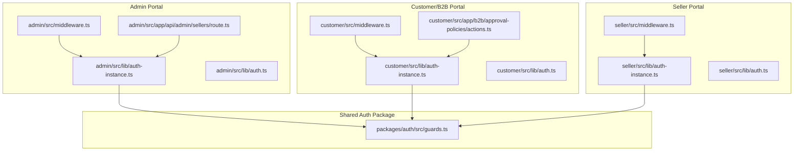
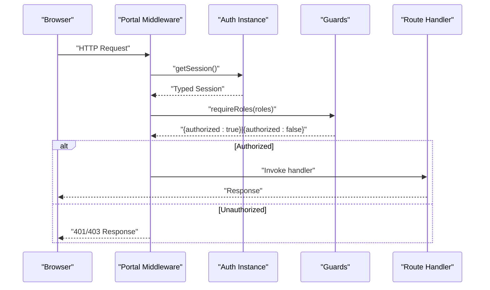
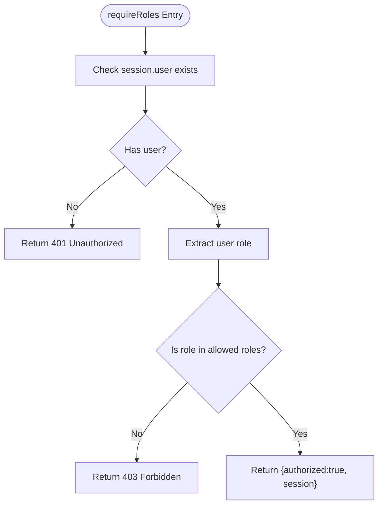
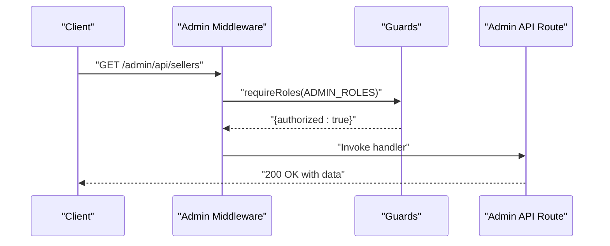
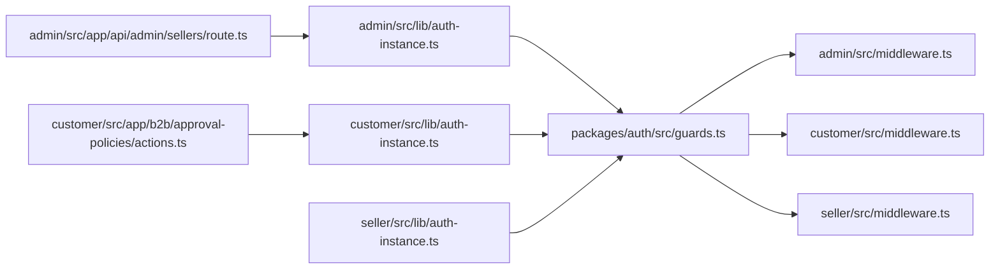

# Role-Based Access Control

<cite>
**Referenced Files in This Document**
- [guards.ts](file://packages/auth/src/guards.ts)
- [middleware.ts](file://apps/admin/src/middleware.ts)
- [middleware.ts](file://apps/customer/src/middleware.ts)
- [middleware.ts](file://apps/seller/src/middleware.ts)
- [auth-instance.ts](file://apps/admin/src/lib/auth-instance.ts)
- [auth-instance.ts](file://apps/customer/src/lib/auth-instance.ts)
- [auth-instance.ts](file://apps/seller/src/lib/auth-instance.ts)
- [auth.ts](file://apps/admin/src/lib/auth.ts)
- [auth.ts](file://apps/customer/src/lib/auth.ts)
- [auth.ts](file://apps/seller/src/lib/auth.ts)
- [route.ts](file://apps/admin/src/app/api/admin/sellers/route.ts)
- [actions.ts](file://apps/customer/src/app/b2b/approval-policies/actions.ts)
- [seed.ts](file://packages/database/prisma/seed.ts)
- [page.tsx](file://apps/admin/src/app/sellers/pending/page.tsx)
- [page.tsx](file://apps/admin/src/app/sellers/page.tsx)
</cite>

## Table of Contents
1. [Introduction](#introduction)
2. [Project Structure](#project-structure)
3. [Core Components](#core-components)
4. [Architecture Overview](#architecture-overview)
5. [Detailed Component Analysis](#detailed-component-analysis)
6. [Dependency Analysis](#dependency-analysis)
7. [Performance Considerations](#performance-considerations)
8. [Troubleshooting Guide](#troubleshooting-guide)
9. [Conclusion](#conclusion)

## Introduction
This document describes the role-based access control (RBAC) system in Avenick Commerce. It explains the user role hierarchy, permission levels, role-based guards, permission checking mechanisms, and route protection strategies across the Admin, Customer/B2B, and Seller portals. It also documents how roles relate to business entities such as companies and sellers, and provides practical examples for implementing role checks, protecting routes, and handling unauthorized access attempts.

## Project Structure
The RBAC system spans three Next.js applications (Admin, Customer/B2B, Seller) and a shared authentication package. Each portal defines middleware for route protection and uses shared authentication utilities and guards.

**Diagram sources**
- [middleware.ts](file://apps/admin/src/middleware.ts)
- [middleware.ts](file://apps/customer/src/middleware.ts)
- [middleware.ts](file://apps/seller/src/middleware.ts)
- [auth-instance.ts](file://apps/admin/src/lib/auth-instance.ts)
- [auth-instance.ts](file://apps/customer/src/lib/auth-instance.ts)
- [auth-instance.ts](file://apps/seller/src/lib/auth-instance.ts)
- [auth.ts](file://apps/admin/src/lib/auth.ts)
- [auth.ts](file://apps/customer/src/lib/auth.ts)
- [auth.ts](file://apps/seller/src/lib/auth.ts)
- [guards.ts](file://packages/auth/src/guards.ts)
- [route.ts](file://apps/admin/src/app/api/admin/sellers/route.ts)
- [actions.ts](file://apps/customer/src/app/b2b/approval-policies/actions.ts)

**Section sources**
- [middleware.ts](file://apps/admin/src/middleware.ts)
- [middleware.ts](file://apps/customer/src/middleware.ts)
- [middleware.ts](file://apps/seller/src/middleware.ts)
- [guards.ts](file://packages/auth/src/guards.ts)

## Core Components
- Role definitions and guard utilities are centralized in the shared auth package.
- Each portal exposes a typed authentication instance and guard helpers.
- Middleware enforces role-based access at the route level.
- API routes and server actions enforce roles programmatically.

Key responsibilities:
- Role constants and guard helpers: define role sets and provide reusable checks.
- Authentication instances: wrap NextAuth to expose typed session data.
- Middleware: protect pages and static routes.
- API routes and server actions: enforce roles for backend operations.

**Section sources**
- [guards.ts](file://packages/auth/src/guards.ts)
- [auth-instance.ts](file://apps/admin/src/lib/auth-instance.ts)
- [auth.ts](file://apps/admin/src/lib/auth.ts)
- [route.ts](file://apps/admin/src/app/api/admin/sellers/route.ts)
- [actions.ts](file://apps/customer/src/app/b2b/approval-policies/actions.ts)

## Architecture Overview
The RBAC architecture follows a layered pattern:
- Shared guards encapsulate role checks and return standardized responses.
- Authentication instances extract typed session data from NextAuth.
- Middleware applies guards to incoming requests.
- API routes and server actions apply guards for programmatic enforcement.

**Diagram sources**
- [guards.ts](file://packages/auth/src/guards.ts)
- [auth-instance.ts](file://apps/admin/src/lib/auth-instance.ts)
- [middleware.ts](file://apps/admin/src/middleware.ts)

## Detailed Component Analysis

### Role Hierarchy and Permission Levels
Avenick Commerce defines a comprehensive role taxonomy aligned with business entities and responsibilities:
- CONSUMER: Individual buyers in the marketplace.
- COMPANY_ADMIN, COMPANY_BUYER, COMPANY_APPROVER: Business entity roles for procurement and approvals within a company.
- SELLER_OWNER, SELLER_STAFF: Roles for seller-side operations.
- ADMIN, SUPER_ADMIN: Internal administrative roles with elevated privileges.

Role sets:
- SELLER_ROLES: SELLER_OWNER, SELLER_STAFF
- ADMIN_ROLES: ADMIN, SUPER_ADMIN
- BUYER_ROLES: CONSUMER, COMPANY_ADMIN, COMPANY_BUYER, COMPANY_APPROVER
- COMPANY_ROLES: COMPANY_ADMIN, COMPANY_BUYER, COMPANY_APPROVER

These sets enable concise permission checks across portals.

Practical examples:
- Require ADMIN or SUPER_ADMIN for sensitive admin endpoints.
- Allow COMPANY_ADMIN or COMPANY_APPROVER for approval policy management.
- Permit SELLER_OWNER or SELLER_STAFF for seller dashboard and order management.

**Section sources**
- [guards.ts](file://packages/auth/src/guards.ts)
- [seed.ts](file://packages/database/prisma/seed.ts)

### Role-Based Guard Implementation
The guard utilities provide:
- requireRoles: Enforces a set of allowed roles and returns either an authorized session or an unauthorized JSON response with appropriate status codes.
- hasRole: Lightweight helper to check membership in a role set.
- Predefined role sets: SELLER_ROLES, ADMIN_ROLES, BUYER_ROLES, COMPANY_ROLES.

Usage patterns:
- Middleware: Call requireRoles at the top of middleware to block unauthorized access early.
- API routes: Validate roles before performing privileged operations.
- Server actions: Validate roles before mutating data.

**Diagram sources**
- [guards.ts](file://packages/auth/src/guards.ts)

**Section sources**
- [guards.ts](file://packages/auth/src/guards.ts)

### Permission Checking Mechanisms
- Typed authentication instances: Each portal’s auth instance wraps NextAuth to provide a strongly-typed session object containing the user role.
- Guard helpers: requireRoles and hasRole encapsulate permission logic and unify error responses.
- Role sets: Centralized constants simplify permission expressions across the codebase.

Examples:
- Admin API route enforces ADMIN or SUPER_ADMIN via a role whitelist.
- Customer/B2B server action enforces COMPANY_ADMIN for policy management.

**Section sources**
- [auth-instance.ts](file://apps/admin/src/lib/auth-instance.ts)
- [auth.ts](file://apps/admin/src/lib/auth.ts)
- [route.ts](file://apps/admin/src/app/api/admin/sellers/route.ts)
- [actions.ts](file://apps/customer/src/app/b2b/approval-policies/actions.ts)

### Route Protection Strategies
- Middleware-based protection: Each portal defines middleware that applies requireRoles to protected routes.
- Page-level protection: Middleware intercepts navigation and blocks unauthenticated or unauthorized users.
- API endpoint protection: Handlers validate roles before processing requests.

**Diagram sources**
- [middleware.ts](file://apps/admin/src/middleware.ts)
- [guards.ts](file://packages/auth/src/guards.ts)
- [route.ts](file://apps/admin/src/app/api/admin/sellers/route.ts)

**Section sources**
- [middleware.ts](file://apps/admin/src/middleware.ts)
- [route.ts](file://apps/admin/src/app/api/admin/sellers/route.ts)

### Assigning, Validating, and Enforcing Roles Across Portals
- Assignment: Roles are persisted with user records and surfaced via the session. Example seed data assigns SELLER_OWNER to a user.
- Validation: Middleware and guards validate roles against the session.
- Enforcement: Middleware blocks unauthorized routes; API routes and server actions enforce roles for backend operations.

Evidence:
- Seed assigns SELLER_OWNER to a user for seller onboarding scenarios.
- Admin UI displays seller owner information, indicating role association.
- Admin API filters sellers by status and includes owner details.

**Section sources**
- [seed.ts](file://packages/database/prisma/seed.ts)
- [page.tsx](file://apps/admin/src/app/sellers/pending/page.tsx)
- [page.tsx](file://apps/admin/src/app/sellers/page.tsx)
- [route.ts](file://apps/admin/src/app/api/admin/sellers/route.ts)

### Practical Examples

#### Implementing Role Checks
- Use requireRoles(session, ADMIN_ROLES) in middleware or API handlers to enforce admin-only access.
- Use hasRole(session, BUYER_ROLES) in components to conditionally render buyer-specific UI.

Reference paths:
- [guards.ts](file://packages/auth/src/guards.ts)
- [middleware.ts](file://apps/admin/src/middleware.ts)

#### Protecting Routes
- Wrap route handlers with requireRoles to prevent unauthorized access.
- Apply role sets to group permissions (e.g., SELLER_ROLES for seller dashboards).

Reference paths:
- [route.ts](file://apps/admin/src/app/api/admin/sellers/route.ts)
- [guards.ts](file://packages/auth/src/guards.ts)

#### Handling Unauthorized Access Attempts
- requireRoles returns a JSON response with 401 (authentication required) or 403 (insufficient permissions).
- Middleware should short-circuit unauthorized requests before reaching route logic.

Reference paths:
- [guards.ts](file://packages/auth/src/guards.ts)

#### Relationship Between Roles and Business Entities
- COMPANY_ADMIN and COMPANY_APPROVER operate within a Company context (e.g., managing approval policies).
- SELLER_OWNER and SELLER_STAFF operate within a SellerProfile context (e.g., dashboard, orders).
- ADMIN/SUPER_ADMIN operate across the platform.

Evidence:
- Approval policies server action enforces COMPANY_ADMIN for management operations.
- Admin UI lists sellers with associated owners and documents.

Reference paths:
- [actions.ts](file://apps/customer/src/app/b2b/approval-policies/actions.ts)
- [page.tsx](file://apps/admin/src/app/sellers/pending/page.tsx)

## Dependency Analysis
The RBAC system exhibits low coupling and high cohesion:
- Shared guards depend on the database UserRole enum and Next.js server responses.
- Portal middleware depends on the shared guards and local auth instances.
- API routes and server actions depend on the auth instances and guards.

**Diagram sources**
- [guards.ts](file://packages/auth/src/guards.ts)
- [middleware.ts](file://apps/admin/src/middleware.ts)
- [middleware.ts](file://apps/customer/src/middleware.ts)
- [middleware.ts](file://apps/seller/src/middleware.ts)
- [auth-instance.ts](file://apps/admin/src/lib/auth-instance.ts)
- [auth-instance.ts](file://apps/customer/src/lib/auth-instance.ts)
- [auth-instance.ts](file://apps/seller/src/lib/auth-instance.ts)
- [route.ts](file://apps/admin/src/app/api/admin/sellers/route.ts)
- [actions.ts](file://apps/customer/src/app/b2b/approval-policies/actions.ts)

**Section sources**
- [guards.ts](file://packages/auth/src/guards.ts)
- [auth-instance.ts](file://apps/admin/src/lib/auth-instance.ts)
- [auth-instance.ts](file://apps/customer/src/lib/auth-instance.ts)
- [auth-instance.ts](file://apps/seller/src/lib/auth-instance.ts)
- [route.ts](file://apps/admin/src/app/api/admin/sellers/route.ts)
- [actions.ts](file://apps/customer/src/app/b2b/approval-policies/actions.ts)

## Performance Considerations
- Prefer guard helpers over ad-hoc role comparisons to reduce duplication and improve maintainability.
- Cache role checks at the middleware boundary when feasible to avoid repeated computations.
- Keep role sets small and focused to minimize branching logic in guards.

## Troubleshooting Guide
Common issues and resolutions:
- 401 Unauthorized: Occurs when session.user is missing. Ensure authentication completes and the auth instance is invoked before guards.
- 403 Forbidden: Occurs when the user’s role is not included in the required set. Verify the user’s role assignment and the guard’s allowed roles.
- Middleware bypass: Confirm middleware runs before route handlers and that protected routes are not excluded from middleware configuration.

**Section sources**
- [guards.ts](file://packages/auth/src/guards.ts)
- [middleware.ts](file://apps/admin/src/middleware.ts)

## Conclusion
Avenick Commerce implements a robust, shared RBAC system that centralizes role definitions and guard logic while enabling portal-specific middleware and route protection. The system cleanly separates concerns between authentication, authorization, and enforcement, and provides reusable role sets for consistent permission management across Admin, Customer/B2B, and Seller portals. By following the documented patterns, teams can reliably assign, validate, and enforce roles across business entities and application boundaries.