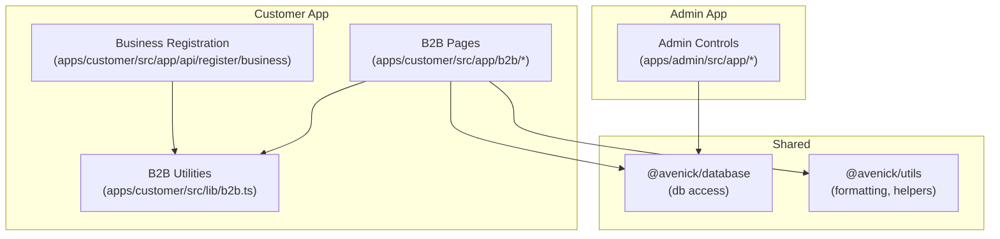
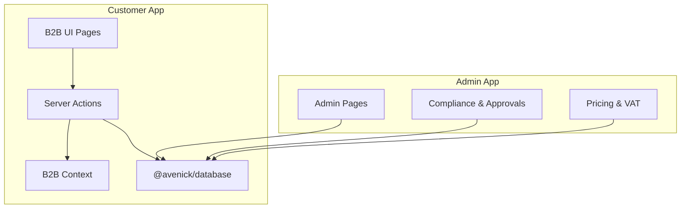
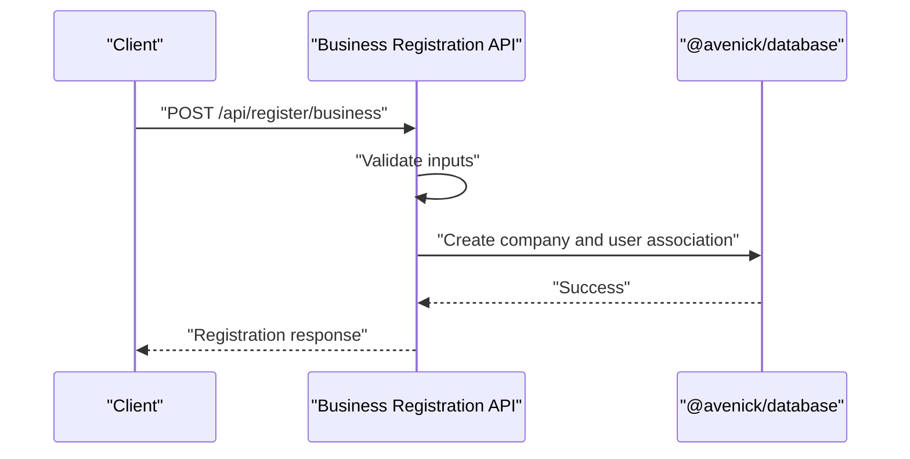
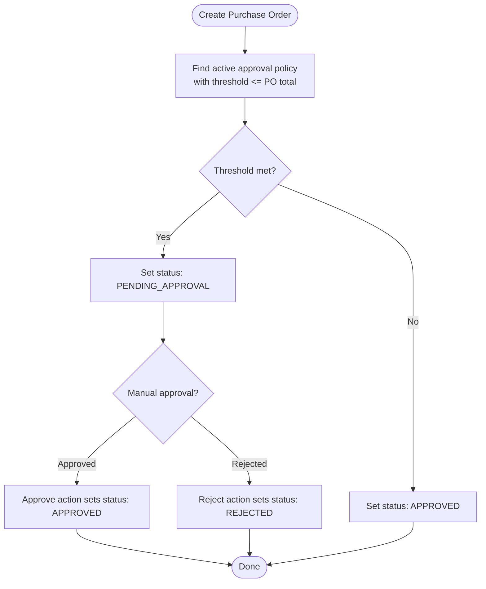
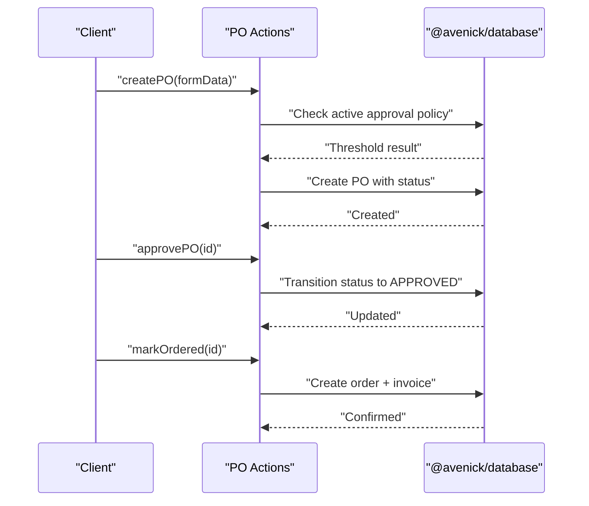
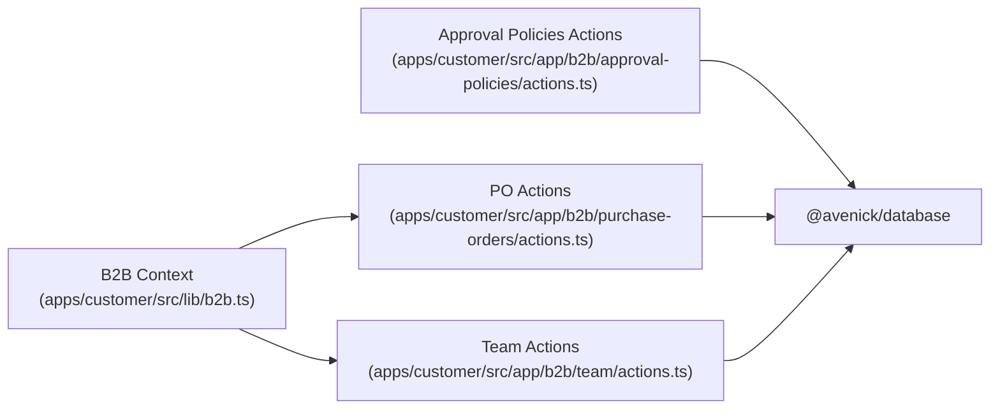

# B2B Business Features

<cite>
**Referenced Files in This Document**
- [apps/customer/src/app/api/register/business/route.ts](file://apps/customer/src/app/api/register/business/route.ts)
- [apps/customer/src/lib/b2b.ts](file://apps/customer/src/lib/b2b.ts)
- [apps/customer/src/app/b2b/register/page.tsx](file://apps/customer/src/app/b2b/register/page.tsx)
- [apps/customer/src/app/b2b/company/page.tsx](file://apps/customer/src/app/b2b/company/page.tsx)
- [apps/customer/src/app/b2b/approval-policies/page.tsx](file://apps/customer/src/app/b2b/approval-policies/page.tsx)
- [apps/customer/src/app/b2b/approval-policies/actions.ts](file://apps/customer/src/app/b2b/approval-policies/actions.ts)
- [apps/customer/src/app/b2b/purchase-orders/page.tsx](file://apps/customer/src/app/b2b/purchase-orders/page.tsx)
- [apps/customer/src/app/b2b/purchase-orders/actions.ts](file://apps/customer/src/app/b2b/purchase-orders/actions.ts)
- [apps/customer/src/app/b2b/team/page.tsx](file://apps/customer/src/app/b2b/team/page.tsx)
- [apps/customer/src/app/b2b/team/actions.ts](file://apps/customer/src/app/b2b/team/actions.ts)
- [apps/customer/src/app/b2b/quotes/page.tsx](file://apps/customer/src/app/b2b/quotes/page.tsx)
- [apps/customer/src/app/b2b/lists/page.tsx](file://apps/customer/src/app/b2b/lists/page.tsx)
- [apps/customer/src/app/b2b/lists/actions.ts](file://apps/customer/src/app/b2b/lists/actions.ts)
- [apps/admin/src/app/companies/page.tsx](file://apps/admin/src/app/companies/page.tsx)
- [apps/admin/src/app/sellers/[id]/route.ts](file://apps/admin/src/app/sellers/[id]/route.ts)
- [apps/admin/src/app/sellers/pending/page.tsx](file://apps/admin/src/app/sellers/pending/page.tsx)
- [apps/admin/src/app/sellers/[id]/approve/route.ts](file://apps/admin/src/app/sellers/[id]/approve/route.ts)
- [apps/admin/src/app/sellers/[id]/reject/route.ts](file://apps/admin/src/app/sellers/[id]/reject/route.ts)
- [apps/admin/src/app/sellers/route.ts](file://apps/admin/src/app/sellers/route.ts)
- [apps/admin/src/app/pricing/page.tsx](file://apps/admin/src/app/pricing/page.tsx)
- [apps/admin/src/app/vat/page.tsx](file://apps/admin/src/app/vat/page.tsx)
- [apps/admin/src/app/automation/page.tsx](file://apps/admin/src/app/automation/page.tsx)
- [apps/admin/src/app/compliance/page.tsx](file://apps/admin/src/app/compliance/page.tsx)
- [apps/admin/src/app/compliance/[id]/approve/route.ts](file://apps/admin/src/app/compliance/[id]/approve/route.ts)
- [apps/admin/src/app/compliance/[id]/reject/route.ts](file://apps/admin/src/app/compliance/[id]/reject/route.ts)
- [apps/admin/src/app/approvals/page.tsx](file://apps/admin/src/app/approvals/page.tsx)
- [apps/admin/src/app/audit/page.tsx](file://apps/admin/src/app/audit/page.tsx)
- [apps/admin/src/app/settings/page.tsx](file://apps/admin/src/app/settings/page.tsx)
</cite>

## Table of Contents
1. [Introduction](#introduction)
2. [Project Structure](#project-structure)
3. [Core Components](#core-components)
4. [Architecture Overview](#architecture-overview)
5. [Detailed Component Analysis](#detailed-component-analysis)
6. [Dependency Analysis](#dependency-analysis)
7. [Performance Considerations](#performance-considerations)
8. [Troubleshooting Guide](#troubleshooting-guide)
9. [Conclusion](#conclusion)

## Introduction
This document describes the B2B Business Features implemented in the commerce platform. It covers the business registration process, company information validation, and approval workflows; the purchase order system including PO creation, approval policies, status tracking, and supplier communication; the quoting system for business customers, quote management, and price negotiation workflows; team member management, role assignments, and permissions; and approval policy configuration, automated approval workflows, and compliance features specific to business transactions.

## Project Structure
The B2B features span three Next.js applications:
- Customer app: business-facing UI and APIs for registration, company info, purchase orders, quotes, team, and lists.
- Admin app: administrative controls for companies, sellers, approvals, compliance, automation, pricing, VAT, and settings.
- Shared libraries: database access, authentication, and utilities used across apps.

Key B2B feature areas:
- Registration and company management
- Approval policies and automated approvals
- Purchase orders lifecycle
- Team member management and roles
- Quoting and RFQ workflows
- Lists and favorites
- Compliance and audit

**Section sources**
- [apps/customer/src/app/api/register/business/route.ts:1-200](file://apps/customer/src/app/api/register/business/route.ts#L1-L200)
- [apps/customer/src/lib/b2b.ts:1-200](file://apps/customer/src/lib/b2b.ts#L1-L200)
- [apps/customer/src/app/b2b/purchase-orders/actions.ts:1-120](file://apps/customer/src/app/b2b/purchase-orders/actions.ts#L1-L120)
- [apps/admin/src/app/companies/page.tsx:1-200](file://apps/admin/src/app/companies/page.tsx#L1-L200)

## Core Components
- Business registration and company onboarding
- Approval policy engine and automated routing
- Purchase order lifecycle (creation, approval, ordering, status tracking)
- Team member management and role-based permissions
- Quoting and RFQ workflows
- Lists and favorites for business buyers
- Admin compliance and audit controls

**Section sources**
- [apps/customer/src/app/api/register/business/route.ts:1-200](file://apps/customer/src/app/api/register/business/route.ts#L1-L200)
- [apps/customer/src/lib/b2b.ts:1-200](file://apps/customer/src/lib/b2b.ts#L1-L200)
- [apps/customer/src/app/b2b/approval-policies/actions.ts:1-120](file://apps/customer/src/app/b2b/approval-policies/actions.ts#L1-L120)
- [apps/customer/src/app/b2b/purchase-orders/actions.ts:1-120](file://apps/customer/src/app/b2b/purchase-orders/actions.ts#L1-L120)
- [apps/customer/src/app/b2b/team/actions.ts:1-120](file://apps/customer/src/app/b2b/team/actions.ts#L1-L120)
- [apps/customer/src/app/b2b/quotes/page.tsx:1-200](file://apps/customer/src/app/b2b/quotes/page.tsx#L1-L200)
- [apps/customer/src/app/b2b/lists/actions.ts:1-120](file://apps/customer/src/app/b2b/lists/actions.ts#L1-L120)
- [apps/admin/src/app/compliance/page.tsx:1-200](file://apps/admin/src/app/compliance/page.tsx#L1-L200)

## Architecture Overview
The B2B architecture separates business-facing functionality (Customer app) from administrative oversight (Admin app). The Customer app exposes server actions for state transitions and uses a shared B2B context to enforce company membership and roles. Approval policies drive whether purchase orders require manual approval or are auto-approved. Admin dashboards govern compliance, seller onboarding, pricing, and VAT configurations.

**Diagram sources**
- [apps/customer/src/lib/b2b.ts:1-200](file://apps/customer/src/lib/b2b.ts#L1-L200)
- [apps/customer/src/app/b2b/purchase-orders/actions.ts:1-120](file://apps/customer/src/app/b2b/purchase-orders/actions.ts#L1-L120)
- [apps/admin/src/app/compliance/page.tsx:1-200](file://apps/admin/src/app/compliance/page.tsx#L1-L200)

## Detailed Component Analysis

### Business Registration and Company Onboarding
- Endpoint: Business registration endpoint validates inputs and creates a company record under the authenticated user’s account.
- Validation includes legal name, tax ID, address, and contact details.
- After registration, the user becomes associated with the company and gains access to B2B features.

**Diagram sources**
- [apps/customer/src/app/api/register/business/route.ts:1-200](file://apps/customer/src/app/api/register/business/route.ts#L1-L200)

**Section sources**
- [apps/customer/src/app/api/register/business/route.ts:1-200](file://apps/customer/src/app/api/register/business/route.ts#L1-L200)
- [apps/customer/src/app/b2b/register/page.tsx:1-200](file://apps/customer/src/app/b2b/register/page.tsx#L1-L200)

### Company Information Management
- Company profile page displays and allows updates to legal and operational details.
- Access is restricted to company members via the B2B context.

**Section sources**
- [apps/customer/src/app/b2b/company/page.tsx:1-200](file://apps/customer/src/app/b2b/company/page.tsx#L1-L200)
- [apps/customer/src/lib/b2b.ts:1-200](file://apps/customer/src/lib/b2b.ts#L1-L200)

### Approval Policy Engine and Automated Workflows
- Approval policies define thresholds per company; if a purchase order exceeds the threshold, it requires approval.
- Policies are active and evaluated during PO creation.
- Automated approvals bypass manual steps when thresholds are not met.

**Diagram sources**
- [apps/customer/src/app/b2b/purchase-orders/actions.ts:1-120](file://apps/customer/src/app/b2b/purchase-orders/actions.ts#L1-L120)
- [apps/customer/src/app/b2b/approval-policies/actions.ts:1-120](file://apps/customer/src/app/b2b/approval-policies/actions.ts#L1-L120)

**Section sources**
- [apps/customer/src/app/b2b/approval-policies/actions.ts:1-120](file://apps/customer/src/app/b2b/approval-policies/actions.ts#L1-L120)
- [apps/customer/src/app/b2b/purchase-orders/actions.ts:1-120](file://apps/customer/src/app/b2b/purchase-orders/actions.ts#L1-L120)

### Purchase Order System
- Creation: Generates a unique PO number, captures description, total, and required date, and applies approval routing based on policy.
- Approval/rejection: Only designated approvers can change status from pending.
- Ordering: Approved POs trigger order creation with tax calculation and invoice generation.
- Status tracking: UI reflects draft, pending, approved, ordered, rejected, and cancelled states.

**Diagram sources**
- [apps/customer/src/app/b2b/purchase-orders/actions.ts:1-120](file://apps/customer/src/app/b2b/purchase-orders/actions.ts#L1-L120)

**Section sources**
- [apps/customer/src/app/b2b/purchase-orders/page.tsx:1-200](file://apps/customer/src/app/b2b/purchase-orders/page.tsx#L1-L200)
- [apps/customer/src/app/b2b/purchase-orders/actions.ts:1-120](file://apps/customer/src/app/b2b/purchase-orders/actions.ts#L1-L120)

### Team Member Management and Permissions
- Team page lists members and supports adding/removing and role assignment.
- Roles include requester, approver, and admin; approvers can approve POs.
- Access checks enforce role-based visibility and actions.

**Section sources**
- [apps/customer/src/app/b2b/team/page.tsx:1-200](file://apps/customer/src/app/b2b/team/page.tsx#L1-L200)
- [apps/customer/src/app/b2b/team/actions.ts:1-120](file://apps/customer/src/app/b2b/team/actions.ts#L1-L120)
- [apps/customer/src/lib/b2b.ts:1-200](file://apps/customer/src/lib/b2b.ts#L1-L200)

### Quoting and RFQ Workflows
- Quotes page provides access to submitted quotes and statuses.
- RFQ (Request for Quote) submission and management are available under the RFQ section.
- Price negotiation occurs between buyer and supplier via internal messaging and quote revisions.

**Section sources**
- [apps/customer/src/app/b2b/quotes/page.tsx:1-200](file://apps/customer/src/app/b2b/quotes/page.tsx#L1-L200)

### Lists and Favorites
- Lists page enables managing product lists for business buyers.
- Actions support CRUD operations on lists and items.

**Section sources**
- [apps/customer/src/app/b2b/lists/page.tsx:1-200](file://apps/customer/src/app/b2b/lists/page.tsx#L1-L200)
- [apps/customer/src/app/b2b/lists/actions.ts:1-120](file://apps/customer/src/app/b2b/lists/actions.ts#L1-L120)

### Admin Compliance and Approvals
- Admin dashboard for companies, sellers, and compliance.
- Approvals page aggregates pending approvals for admin review.
- Compliance actions allow approve/reject decisions with audit trails.

**Section sources**
- [apps/admin/src/app/companies/page.tsx:1-200](file://apps/admin/src/app/companies/page.tsx#L1-L200)
- [apps/admin/src/app/sellers/[id]/approve/route.ts:1-200](file://apps/admin/src/app/sellers/[id]/approve/route.ts#L1-L200)
- [apps/admin/src/app/sellers/[id]/reject/route.ts:1-200](file://apps/admin/src/app/sellers/[id]/reject/route.ts#L1-L200)
- [apps/admin/src/app/approvals/page.tsx:1-200](file://apps/admin/src/app/approvals/page.tsx#L1-L200)
- [apps/admin/src/app/compliance/page.tsx:1-200](file://apps/admin/src/app/compliance/page.tsx#L1-L200)
- [apps/admin/src/app/compliance/[id]/approve/route.ts:1-200](file://apps/admin/src/app/compliance/[id]/approve/route.ts#L1-L200)
- [apps/admin/src/app/compliance/[id]/reject/route.ts:1-200](file://apps/admin/src/app/compliance/[id]/reject/route.ts#L1-L200)

### Pricing, VAT, and Automation
- Pricing page manages product pricing rules affecting business buyers.
- VAT page configures regional tax rates impacting PO totals and invoices.
- Automation page configures system automations for approvals and workflows.

**Section sources**
- [apps/admin/src/app/pricing/page.tsx:1-200](file://apps/admin/src/app/pricing/page.tsx#L1-L200)
- [apps/admin/src/app/vat/page.tsx:1-200](file://apps/admin/src/app/vat/page.tsx#L1-L200)
- [apps/admin/src/app/automation/page.tsx:1-200](file://apps/admin/src/app/automation/page.tsx#L1-L200)

### Audit and Settings
- Audit page provides historical logs of actions for compliance reporting.
- Settings page centralizes admin configuration for B2B features.

**Section sources**
- [apps/admin/src/app/audit/page.tsx:1-200](file://apps/admin/src/app/audit/page.tsx#L1-L200)
- [apps/admin/src/app/settings/page.tsx:1-200](file://apps/admin/src/app/settings/page.tsx#L1-L200)

## Dependency Analysis
- B2B context enforces company membership and role checks across pages and actions.
- Server actions encapsulate state transitions and validations, ensuring consistent business rules.
- Admin app depends on database for approvals, compliance, and configuration updates.
- UI pages depend on server actions and database queries to render data and enable interactions.

**Diagram sources**
- [apps/customer/src/lib/b2b.ts:1-200](file://apps/customer/src/lib/b2b.ts#L1-L200)
- [apps/customer/src/app/b2b/purchase-orders/actions.ts:1-120](file://apps/customer/src/app/b2b/purchase-orders/actions.ts#L1-L120)
- [apps/customer/src/app/b2b/team/actions.ts:1-120](file://apps/customer/src/app/b2b/team/actions.ts#L1-L120)
- [apps/customer/src/app/b2b/approval-policies/actions.ts:1-120](file://apps/customer/src/app/b2b/approval-policies/actions.ts#L1-L120)

**Section sources**
- [apps/customer/src/lib/b2b.ts:1-200](file://apps/customer/src/lib/b2b.ts#L1-L200)
- [apps/customer/src/app/b2b/purchase-orders/actions.ts:1-120](file://apps/customer/src/app/b2b/purchase-orders/actions.ts#L1-L120)
- [apps/customer/src/app/b2b/team/actions.ts:1-120](file://apps/customer/src/app/b2b/team/actions.ts#L1-L120)
- [apps/customer/src/app/b2b/approval-policies/actions.ts:1-120](file://apps/customer/src/app/b2b/approval-policies/actions.ts#L1-L120)

## Performance Considerations
- Use database indexes on frequently queried fields (company ID, status, user ID) to optimize PO and team queries.
- Batch revalidation after bulk actions to minimize cache invalidation overhead.
- Limit returned PO lists to recent entries and paginate for large datasets.
- Cache static configuration like VAT rates and approval policy thresholds where safe.

## Troubleshooting Guide
- Authentication errors: Ensure the user is signed in and associated with a company; otherwise B2B pages will prompt for a company account.
- Role restrictions: Approving POs requires approver or admin roles; otherwise transitions are ignored.
- Approval policy misconfiguration: Verify active policies and thresholds; inactive or missing policies can cause unexpected routing.
- Transaction failures: PO-to-order conversion runs in a transaction; confirm database connectivity and rollback scenarios.

**Section sources**
- [apps/customer/src/app/b2b/purchase-orders/actions.ts:1-120](file://apps/customer/src/app/b2b/purchase-orders/actions.ts#L1-L120)
- [apps/customer/src/lib/b2b.ts:1-200](file://apps/customer/src/lib/b2b.ts#L1-L200)

## Conclusion
The B2B Business Features provide a robust framework for business registration, company management, approval-driven purchase orders, team permissions, quoting, and administrative oversight. The modular design with server actions, shared B2B context, and admin dashboards ensures consistent enforcement of business rules, clear audit trails, and scalable automation.