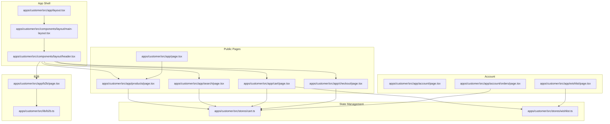
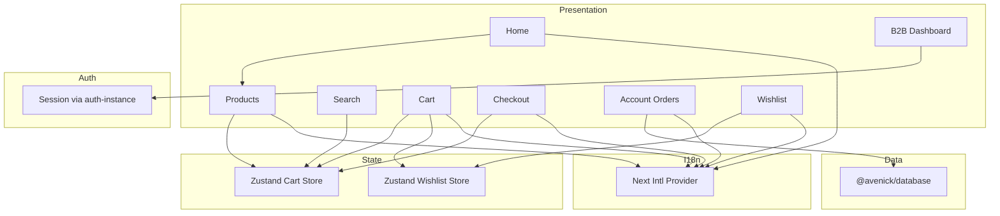
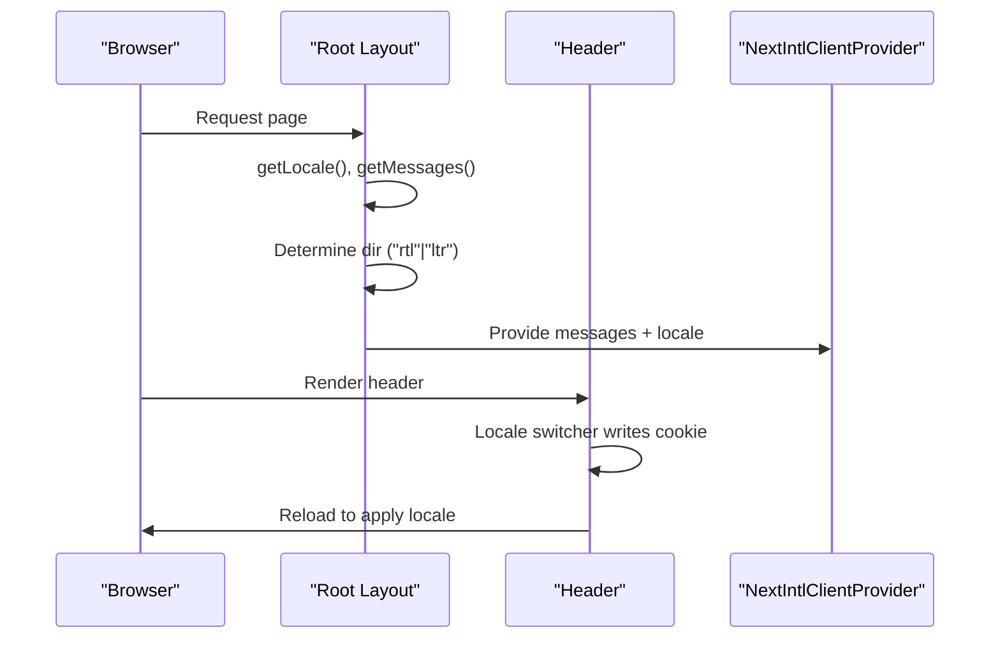
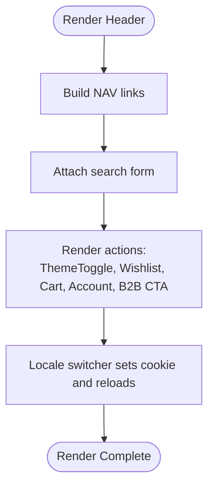
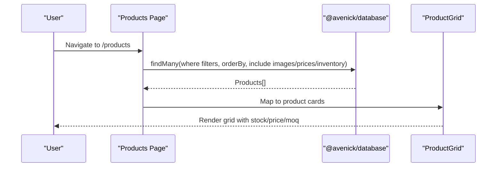
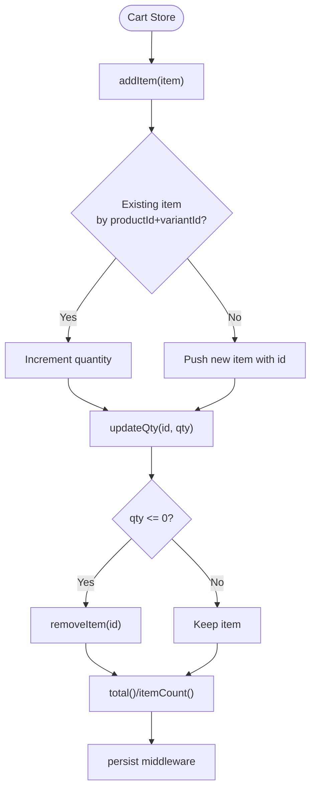
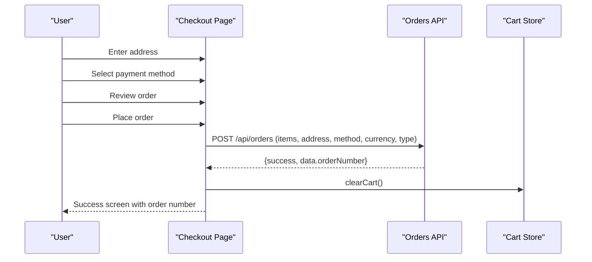
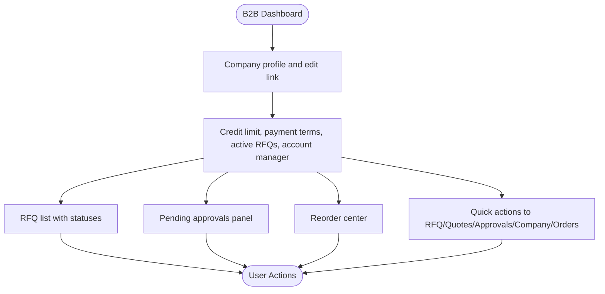
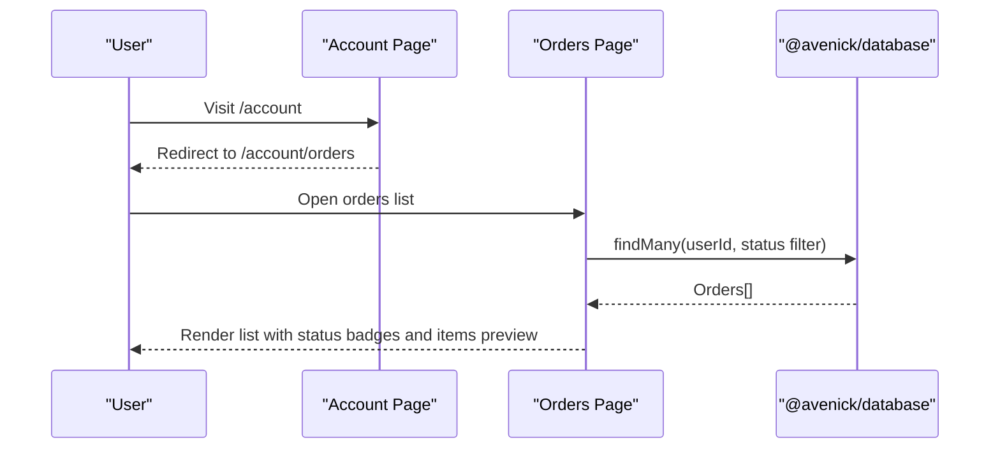
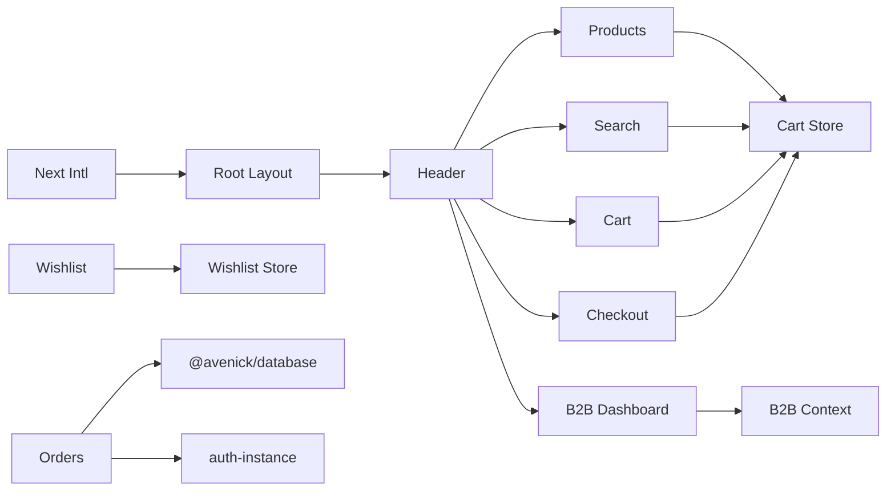

# Customer Portal (B2C/B2B)

<cite>
**Referenced Files in This Document**
- [layout.tsx](file://apps/customer/src/app/layout.tsx)
- [main-layout.tsx](file://apps/customer/src/components/layout/main-layout.tsx)
- [header.tsx](file://apps/customer/src/components/layout/header.tsx)
- [cart.ts](file://apps/customer/src/stores/cart.ts)
- [wishlist.ts](file://apps/customer/src/stores/wishlist.ts)
- [page.tsx](file://apps/customer/src/app/page.tsx)
- [products-page.tsx](file://apps/customer/src/app/products/page.tsx)
- [search-page.tsx](file://apps/customer/src/app/search/page.tsx)
- [cart-page.tsx](file://apps/customer/src/app/cart/page.tsx)
- [checkout-page.tsx](file://apps/customer/src/app/checkout/page.tsx)
- [b2b-dashboard-page.tsx](file://apps/customer/src/app/b2b/page.tsx)
- [account-page.tsx](file://apps/customer/src/app/account/page.tsx)
- [orders-page.tsx](file://apps/customer/src/app/account/orders/page.tsx)
- [wishlist-page.tsx](file://apps/customer/src/app/wishlist/page.tsx)
- [b2b.ts](file://apps/customer/src/lib/b2b.ts)
</cite>

## Table of Contents
1. [Introduction](#introduction)
2. [Project Structure](#project-structure)
3. [Core Components](#core-components)
4. [Architecture Overview](#architecture-overview)
5. [Detailed Component Analysis](#detailed-component-analysis)
6. [Dependency Analysis](#dependency-analysis)
7. [Performance Considerations](#performance-considerations)
8. [Troubleshooting Guide](#troubleshooting-guide)
9. [Conclusion](#conclusion)
10. [Appendices](#appendices)

## Introduction
This document describes the Customer Portal application with a focus on the B2C and B2B shopping experiences, product browsing and search, internationalization with Arabic/English and RTL support, state management for the shopping cart and wishlist using Zustand, a checkout flow with mock payment integration, and order placement. It also covers B2B features such as RFQs, quoting, approvals, and quick reorder, along with user account management, order history, address book, and wishlist functionality. The layout system integrates shared UI components and maintains a cohesive design language across pages.

## Project Structure
The Customer Portal is organized as a Next.js application under apps/customer. Key areas:
- App shell and i18n: Root layout sets locale and direction, wraps children with Next Intl provider.
- Layout system: Shared main layout and header/footer components.
- Stores: Zustand stores for cart and wishlist persistence.
- Pages: Home, products catalog, search, cart, checkout, B2B dashboard, account/order history, and wishlist.
- B2B utilities: Server action shape and B2B context resolution.

**Diagram sources**
- [layout.tsx:1-31](file://apps/customer/src/app/layout.tsx#L1-L31)
- [main-layout.tsx:1-13](file://apps/customer/src/components/layout/main-layout.tsx#L1-L13)
- [header.tsx:1-141](file://apps/customer/src/components/layout/header.tsx#L1-L141)
- [cart.ts:1-64](file://apps/customer/src/stores/cart.ts#L1-L64)
- [wishlist.ts:1-45](file://apps/customer/src/stores/wishlist.ts#L1-L45)
- [page.tsx:1-225](file://apps/customer/src/app/page.tsx#L1-L225)
- [products-page.tsx:1-256](file://apps/customer/src/app/products/page.tsx#L1-L256)
- [search-page.tsx:1-147](file://apps/customer/src/app/search/page.tsx#L1-L147)
- [cart-page.tsx:1-208](file://apps/customer/src/app/cart/page.tsx#L1-L208)
- [checkout-page.tsx:1-195](file://apps/customer/src/app/checkout/page.tsx#L1-L195)
- [b2b-dashboard-page.tsx:1-276](file://apps/customer/src/app/b2b/page.tsx#L1-L276)
- [account-page.tsx:1-6](file://apps/customer/src/app/account/page.tsx#L1-L6)
- [orders-page.tsx:1-184](file://apps/customer/src/app/account/orders/page.tsx#L1-L184)
- [wishlist-page.tsx:1-107](file://apps/customer/src/app/wishlist/page.tsx#L1-L107)
- [b2b.ts:1-24](file://apps/customer/src/lib/b2b.ts#L1-L24)

**Section sources**
- [layout.tsx:1-31](file://apps/customer/src/app/layout.tsx#L1-L31)
- [main-layout.tsx:1-13](file://apps/customer/src/components/layout/main-layout.tsx#L1-L13)
- [header.tsx:1-141](file://apps/customer/src/components/layout/header.tsx#L1-L141)

## Core Components
- Internationalization and RTL: Root layout resolves locale and direction, injects theme preference, and provides messages to the client via Next Intl.
- Layout system: Main layout composes header and footer around page content; header includes navigation, search, theme toggle, locale switcher, and cart count.
- State stores:
  - Cart: Typed items with product identifiers, quantities, pricing, and seller info; supports add/update/remove/clear, totals, and persistence.
  - Wishlist: Toggle, check presence, remove, clear; persists items.
- Product browsing: Home page highlights categories and featured products; products page supports filters, sorting, pagination, and stock indicators.
- Search: Full-text search across product names and SKU with discovery prompts and popular categories.
- Cart and checkout: Cart page shows items, promotions, shipping rules, VAT, and order summary; checkout uses a multi-step wizard with mock payment and order submission.
- B2B dashboard: RFQs, quotes, approvals, credit usage, and quick reorder center.
- Account and order history: Orders listing with status badges, filtering, and quick access to returns.
- Wishlist: Browse saved items, add to cart, remove.

**Section sources**
- [layout.tsx:1-31](file://apps/customer/src/app/layout.tsx#L1-L31)
- [main-layout.tsx:1-13](file://apps/customer/src/components/layout/main-layout.tsx#L1-L13)
- [header.tsx:1-141](file://apps/customer/src/components/layout/header.tsx#L1-L141)
- [cart.ts:1-64](file://apps/customer/src/stores/cart.ts#L1-L64)
- [wishlist.ts:1-45](file://apps/customer/src/stores/wishlist.ts#L1-L45)
- [page.tsx:1-225](file://apps/customer/src/app/page.tsx#L1-L225)
- [products-page.tsx:1-256](file://apps/customer/src/app/products/page.tsx#L1-L256)
- [search-page.tsx:1-147](file://apps/customer/src/app/search/page.tsx#L1-L147)
- [cart-page.tsx:1-208](file://apps/customer/src/app/cart/page.tsx#L1-L208)
- [checkout-page.tsx:1-195](file://apps/customer/src/app/checkout/page.tsx#L1-L195)
- [b2b-dashboard-page.tsx:1-276](file://apps/customer/src/app/b2b/page.tsx#L1-L276)
- [orders-page.tsx:1-184](file://apps/customer/src/app/account/orders/page.tsx#L1-L184)
- [wishlist-page.tsx:1-107](file://apps/customer/src/app/wishlist/page.tsx#L1-L107)

## Architecture Overview
The portal follows a layered architecture:
- Presentation layer: Next.js app directory with pages, components, and stores.
- State layer: Zustand stores for cart and wishlist with persistence.
- Data access: Database queries via @avenick/database in server-side pages.
- Authentication: Session-based access checks in account and B2B pages.
- Internationalization: Next Intl server-side locale/direction and client provider.

**Diagram sources**
- [layout.tsx:1-31](file://apps/customer/src/app/layout.tsx#L1-L31)
- [cart.ts:1-64](file://apps/customer/src/stores/cart.ts#L1-L64)
- [wishlist.ts:1-45](file://apps/customer/src/stores/wishlist.ts#L1-L45)
- [products-page.tsx:1-256](file://apps/customer/src/app/products/page.tsx#L1-L256)
- [search-page.tsx:1-147](file://apps/customer/src/app/search/page.tsx#L1-L147)
- [cart-page.tsx:1-208](file://apps/customer/src/app/cart/page.tsx#L1-L208)
- [checkout-page.tsx:1-195](file://apps/customer/src/app/checkout/page.tsx#L1-L195)
- [orders-page.tsx:1-184](file://apps/customer/src/app/account/orders/page.tsx#L1-L184)
- [wishlist-page.tsx:1-107](file://apps/customer/src/app/wishlist/page.tsx#L1-L107)
- [b2b-dashboard-page.tsx:1-276](file://apps/customer/src/app/b2b/page.tsx#L1-L276)

## Detailed Component Analysis

### Internationalization and RTL
- Root layout determines locale and direction server-side and passes messages to the client provider.
- Header exposes a locale switcher that writes a cookie and reloads to change language.
- Theme preference is initialized from localStorage and media query.

**Diagram sources**
- [layout.tsx:11-28](file://apps/customer/src/app/layout.tsx#L11-L28)
- [header.tsx:17-20](file://apps/customer/src/components/layout/header.tsx#L17-L20)

**Section sources**
- [layout.tsx:1-31](file://apps/customer/src/app/layout.tsx#L1-L31)
- [header.tsx:17-20](file://apps/customer/src/components/layout/header.tsx#L17-L20)

### Layout System and Navigation
- Main layout composes header and footer around page content.
- Header includes:
  - Utility bar with locale switcher and delivery notice.
  - Primary navigation and search form.
  - Theme toggle, wishlist, cart with dynamic count, account menu, and B2B CTA.

**Diagram sources**
- [main-layout.tsx:4-12](file://apps/customer/src/components/layout/main-layout.tsx#L4-L12)
- [header.tsx:31-141](file://apps/customer/src/components/layout/header.tsx#L31-L141)

**Section sources**
- [main-layout.tsx:1-13](file://apps/customer/src/components/layout/main-layout.tsx#L1-L13)
- [header.tsx:1-141](file://apps/customer/src/components/layout/header.tsx#L1-L141)

### Product Catalog Browsing and Search
- Home page:
  - Displays hero, categories, bestsellers, value props, featured products, and B2B CTA.
  - Uses database queries to fetch active B2C-enabled products with pricing and inventory.
- Products page:
  - Supports category filter, availability, price range, search, and sorting.
  - Server-side pagination and suspense boundaries for responsive loading.
  - Renders product cards with stock and MOQ indicators.
- Search page:
  - Full-text search across names and SKU.
  - Popular searches and categories for discovery.
  - Empty states with suggestions and links.

**Diagram sources**
- [page.tsx:30-66](file://apps/customer/src/app/page.tsx#L30-L66)
- [products-page.tsx:36-139](file://apps/customer/src/app/products/page.tsx#L36-L139)

**Section sources**
- [page.tsx:1-225](file://apps/customer/src/app/page.tsx#L1-L225)
- [products-page.tsx:1-256](file://apps/customer/src/app/products/page.tsx#L1-L256)
- [search-page.tsx:1-147](file://apps/customer/src/app/search/page.tsx#L1-L147)

### Shopping Cart with Zustand
- Cart store:
  - Typed CartItem with product/variant identity, pricing, seller, and currency.
  - Methods: addItem (merge by productId+variantId), updateQty (remove if zero), removeItem, clearCart, total, itemCount.
  - Persistence via Zustand middleware.
- Cart page:
  - Shows items with quantity controls, save-for-later to wishlist, promo code application, shipping progress, VAT calculation, and order summary.
  - Links to checkout.

**Diagram sources**
- [cart.ts:31-62](file://apps/customer/src/stores/cart.ts#L31-L62)

**Section sources**
- [cart.ts:1-64](file://apps/customer/src/stores/cart.ts#L1-L64)
- [cart-page.tsx:1-208](file://apps/customer/src/app/cart/page.tsx#L1-L208)

### Checkout and Mock Payment Integration
- Multi-step checkout:
  - Address collection with label, street, city, country.
  - Payment method selection (mock dev option plus others).
  - Review order with items and totals.
- Order placement:
  - Submits items, shipping address, selected payment method, currency, and type to backend API.
  - Clears cart on success and navigates to success screen.

**Diagram sources**
- [checkout-page.tsx:21-61](file://apps/customer/src/app/checkout/page.tsx#L21-L61)
- [cart.ts:31-62](file://apps/customer/src/stores/cart.ts#L31-L62)

**Section sources**
- [checkout-page.tsx:1-195](file://apps/customer/src/app/checkout/page.tsx#L1-L195)
- [cart.ts:1-64](file://apps/customer/src/stores/cart.ts#L1-L64)

### B2B Features and Team Management
- B2B dashboard:
  - Company profile header, credit usage KPI, payment terms, active RFQs, account manager.
  - RFQ list with status badges and “new quote” indicators.
  - Pending approvals panel with approve/reject actions.
  - Reorder center with quick links to browse and reorder.
  - Quick actions to RFQ, quotes, approvals, company profile, and orders.
- B2B context:
  - Resolves signed-in user’s company membership for server actions and UI decisions.

**Diagram sources**
- [b2b-dashboard-page.tsx:25-275](file://apps/customer/src/app/b2b/page.tsx#L25-L275)
- [b2b.ts:11-23](file://apps/customer/src/lib/b2b.ts#L11-L23)

**Section sources**
- [b2b-dashboard-page.tsx:1-276](file://apps/customer/src/app/b2b/page.tsx#L1-L276)
- [b2b.ts:1-24](file://apps/customer/src/lib/b2b.ts#L1-L24)

### User Account Management, Orders, and Wishlist
- Account redirection:
  - Root account route redirects to order history.
- Orders:
  - Lists orders per user with status badges, filtering by status, and counts for in-progress, shipped, delivered.
  - Provides quick access to returns and direct links to order detail pages.
- Wishlist:
  - Displays saved items, add to cart, remove from wishlist, and add all to cart when in stock.

**Diagram sources**
- [account-page.tsx:3-5](file://apps/customer/src/app/account/page.tsx#L3-L5)
- [orders-page.tsx:31-49](file://apps/customer/src/app/account/orders/page.tsx#L31-L49)

**Section sources**
- [account-page.tsx:1-6](file://apps/customer/src/app/account/page.tsx#L1-L6)
- [orders-page.tsx:1-184](file://apps/customer/src/app/account/orders/page.tsx#L1-L184)
- [wishlist-page.tsx:1-107](file://apps/customer/src/app/wishlist/page.tsx#L1-L107)

## Dependency Analysis
- Internal dependencies:
  - Pages depend on layout components and stores.
  - Stores are consumed by cart, checkout, and wishlist pages.
  - B2B dashboard depends on B2B context utilities.
  - Account pages depend on authentication and database.
- External dependencies:
  - Next Intl for i18n.
  - Zustand for state management with persistence.
  - Shared UI components and utilities (@avenick/ui, @avenick/utils).
  - Database client (@avenick/database).

**Diagram sources**
- [layout.tsx:1-31](file://apps/customer/src/app/layout.tsx#L1-L31)
- [header.tsx:1-141](file://apps/customer/src/components/layout/header.tsx#L1-L141)
- [cart.ts:1-64](file://apps/customer/src/stores/cart.ts#L1-L64)
- [wishlist.ts:1-45](file://apps/customer/src/stores/wishlist.ts#L1-L45)
- [b2b-dashboard-page.tsx:1-276](file://apps/customer/src/app/b2b/page.tsx#L1-L276)
- [b2b.ts:1-24](file://apps/customer/src/lib/b2b.ts#L1-L24)
- [orders-page.tsx:1-184](file://apps/customer/src/app/account/orders/page.tsx#L1-L184)

**Section sources**
- [cart.ts:1-64](file://apps/customer/src/stores/cart.ts#L1-L64)
- [wishlist.ts:1-45](file://apps/customer/src/stores/wishlist.ts#L1-L45)
- [b2b.ts:1-24](file://apps/customer/src/lib/b2b.ts#L1-L24)

## Performance Considerations
- Client-server hydration: Cart count is guarded to avoid hydration mismatches by mounting before reflecting persisted values.
- Suspense boundaries: Products and search pages use suspense to progressively render filters and product grids.
- Pagination: Server-side pagination prevents large payloads and improves responsiveness.
- Local storage and cookies: Locale switching uses cookies to avoid re-computation on every request.
- Persistent stores: Zustand persistence avoids repeated network requests for cart/wishlist across sessions.

[No sources needed since this section provides general guidance]

## Troubleshooting Guide
- Cart count mismatch on initial load:
  - Cause: Client vs server cart count difference due to persistence.
  - Fix: Guard client-side cart count until after mount.
  - Reference: [header.tsx:32-38](file://apps/customer/src/components/layout/header.tsx#L32-L38)
- Empty cart during checkout:
  - Cause: Client navigated away or cart cleared.
  - Fix: Redirect to products if cart is empty before proceeding to checkout.
  - Reference: [checkout-page.tsx:63-71](file://apps/customer/src/app/checkout/page.tsx#L63-L71)
- Locale not changing:
  - Cause: Cookie not set or cached response.
  - Fix: Ensure locale cookie is written and page reloads.
  - Reference: [header.tsx:17-20](file://apps/customer/src/components/layout/header.tsx#L17-L20)
- Order placement failure:
  - Cause: Network error or invalid payload.
  - Fix: Validate items, address, and payment method; handle errors and retry.
  - Reference: [checkout-page.tsx:34-61](file://apps/customer/src/app/checkout/page.tsx#L34-L61)
- B2B context missing:
  - Cause: User not associated with a company.
  - Fix: Gate B2B features behind context resolution and provide registration flow.
  - Reference: [b2b.ts:11-23](file://apps/customer/src/lib/b2b.ts#L11-L23)

**Section sources**
- [header.tsx:32-38](file://apps/customer/src/components/layout/header.tsx#L32-L38)
- [checkout-page.tsx:63-71](file://apps/customer/src/app/checkout/page.tsx#L63-L71)
- [header.tsx:17-20](file://apps/customer/src/components/layout/header.tsx#L17-L20)
- [checkout-page.tsx:34-61](file://apps/customer/src/app/checkout/page.tsx#L34-L61)
- [b2b.ts:11-23](file://apps/customer/src/lib/b2b.ts#L11-L23)

## Conclusion
The Customer Portal delivers a robust B2C and B2B experience with strong internationalization, a responsive layout, and efficient state management. The product catalog and search enable seamless discovery, while the cart and checkout streamline transactions with a clear multi-step flow and mock payment integration. B2B capabilities include RFQs, quoting, approvals, and quick reorder, supported by a contextual dashboard. User account features such as order history and wishlist round out the customer journey, all integrated with shared UI components and persistent state.

[No sources needed since this section summarizes without analyzing specific files]

## Appendices
- Data model notes and module documentation are maintained in the repository for broader system understanding.

[No sources needed since this section doesn't analyze specific source files]