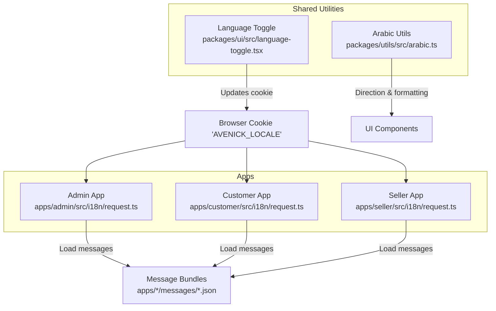
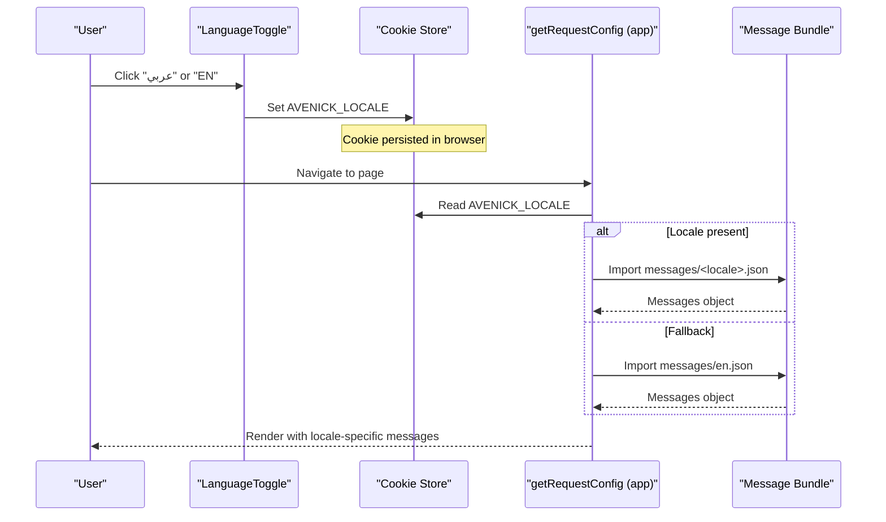
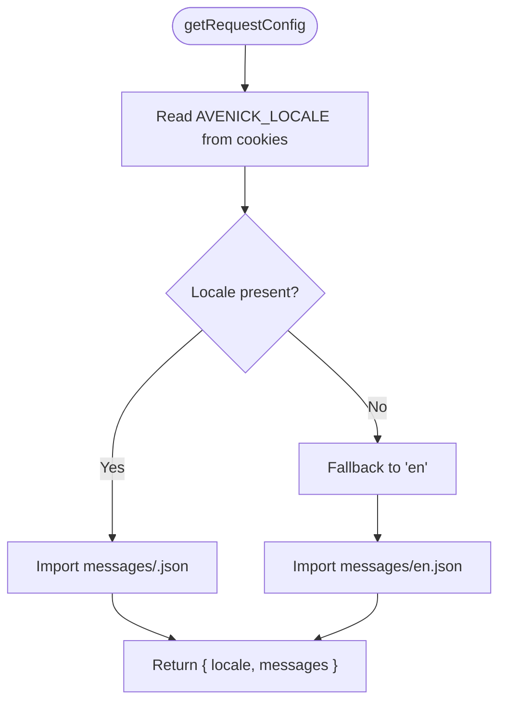
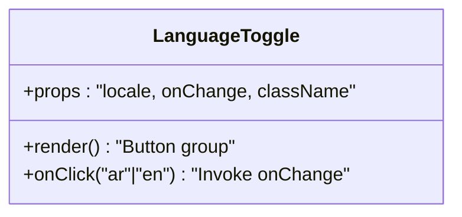
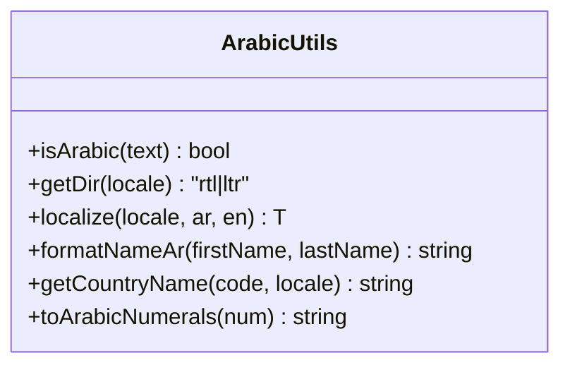
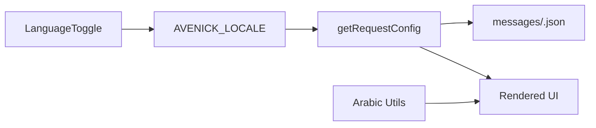

# Internationalization & Localization

<cite>
**Referenced Files in This Document**
- [apps/admin/src/i18n/request.ts](file://apps/admin/src/i18n/request.ts)
- [apps/customer/src/i18n/request.ts](file://apps/customer/src/i18n/request.ts)
- [apps/seller/src/i18n/request.ts](file://apps/seller/src/i18n/request.ts)
- [packages/ui/src/language-toggle.tsx](file://packages/ui/src/language-toggle.tsx)
- [packages/utils/src/arabic.ts](file://packages/utils/src/arabic.ts)
</cite>

## Table of Contents
1. [Introduction](#introduction)
2. [Project Structure](#project-structure)
3. [Core Components](#core-components)
4. [Architecture Overview](#architecture-overview)
5. [Detailed Component Analysis](#detailed-component-analysis)
6. [Dependency Analysis](#dependency-analysis)
7. [Performance Considerations](#performance-considerations)
8. [Troubleshooting Guide](#troubleshooting-guide)
9. [Conclusion](#conclusion)

## Introduction
This document explains the Internationalization and Localization (i18n/l10n) implementation across the application. It covers Arabic and English language support, right-to-left (RTL) layout adaptation, bidirectional text handling, message file structure, translation key organization, dynamic language switching, locale detection, user preference persistence, fallback language handling, and cultural adaptations such as date/time formatting and numeral systems. The focus is on the three Next.js applications (admin, customer, seller) and shared utilities used for locale-aware behavior.

## Project Structure
The i18n implementation follows a consistent pattern across the three applications:
- A server-side request configuration reads the user’s selected locale from a cookie and loads the corresponding message bundle.
- A reusable client-side language toggle component allows users to switch languages dynamically.
- Shared utilities provide locale-aware helpers for directionality, numeral formatting, and localized names.

**Diagram sources**
- [apps/admin/src/i18n/request.ts:1-11](file://apps/admin/src/i18n/request.ts#L1-L11)
- [apps/customer/src/i18n/request.ts:1-12](file://apps/customer/src/i18n/request.ts#L1-L12)
- [apps/seller/src/i18n/request.ts:1-11](file://apps/seller/src/i18n/request.ts#L1-L11)
- [packages/ui/src/language-toggle.tsx:1-41](file://packages/ui/src/language-toggle.tsx#L1-L41)
- [packages/utils/src/arabic.ts:1-51](file://packages/utils/src/arabic.ts#L1-L51)

**Section sources**
- [apps/admin/src/i18n/request.ts:1-11](file://apps/admin/src/i18n/request.ts#L1-L11)
- [apps/customer/src/i18n/request.ts:1-12](file://apps/customer/src/i18n/request.ts#L1-L12)
- [apps/seller/src/i18n/request.ts:1-11](file://apps/seller/src/i18n/request.ts#L1-L11)
- [packages/ui/src/language-toggle.tsx:1-41](file://packages/ui/src/language-toggle.tsx#L1-L41)
- [packages/utils/src/arabic.ts:1-51](file://packages/utils/src/arabic.ts#L1-L51)

## Core Components
- Locale request configuration (server-side): Reads the cookie AVENICK_LOCALE and loads the appropriate message bundle per app.
- Language toggle (client-side): Provides buttons to switch between Arabic and English and updates the stored locale.
- Arabic utilities: Direction detection, numeral formatting, localized country names, and name formatting.

Key behaviors:
- Locale detection: Reads AVENICK_LOCALE from cookies; defaults to English if missing.
- Message loading: Dynamically imports messages/<locale>.json for each app.
- Dynamic switching: Updates the cookie to persist the user’s choice.
- RTL adaptation: Uses direction helpers to adjust layout and text direction.

**Section sources**
- [apps/admin/src/i18n/request.ts:4-10](file://apps/admin/src/i18n/request.ts#L4-L10)
- [apps/customer/src/i18n/request.ts:4-11](file://apps/customer/src/i18n/request.ts#L4-L11)
- [apps/seller/src/i18n/request.ts:4-10](file://apps/seller/src/i18n/request.ts#L4-L10)
- [packages/ui/src/language-toggle.tsx:12-40](file://packages/ui/src/language-toggle.tsx#L12-L40)
- [packages/utils/src/arabic.ts:6-14](file://packages/utils/src/arabic.ts#L6-L14)

## Architecture Overview
The runtime flow for locale resolution and message loading is consistent across apps. The language toggle triggers a cookie update, which is reflected on subsequent requests via the server-side request configuration.

**Diagram sources**
- [apps/admin/src/i18n/request.ts:4-10](file://apps/admin/src/i18n/request.ts#L4-L10)
- [apps/customer/src/i18n/request.ts:4-11](file://apps/customer/src/i18n/request.ts#L4-L11)
- [apps/seller/src/i18n/request.ts:4-10](file://apps/seller/src/i18n/request.ts#L4-L10)
- [packages/ui/src/language-toggle.tsx:12-40](file://packages/ui/src/language-toggle.tsx#L12-L40)

## Detailed Component Analysis

### Locale Request Configuration (Server-Side)
Each app defines a server-side request configuration that:
- Reads the AVENICK_LOCALE cookie.
- Falls back to English if the cookie is absent.
- Dynamically imports the corresponding message bundle.

Implementation highlights:
- Uses next-intl’s getRequestConfig for server-side behavior.
- Imports messages/<locale>.json based on the resolved locale.
- Ensures consistent locale resolution across pages and API routes.

**Diagram sources**
- [apps/admin/src/i18n/request.ts:4-10](file://apps/admin/src/i18n/request.ts#L4-L10)
- [apps/customer/src/i18n/request.ts:4-11](file://apps/customer/src/i18n/request.ts#L4-L11)
- [apps/seller/src/i18n/request.ts:4-10](file://apps/seller/src/i18n/request.ts#L4-L10)

**Section sources**
- [apps/admin/src/i18n/request.ts:4-10](file://apps/admin/src/i18n/request.ts#L4-L10)
- [apps/customer/src/i18n/request.ts:4-11](file://apps/customer/src/i18n/request.ts#L4-L11)
- [apps/seller/src/i18n/request.ts:4-10](file://apps/seller/src/i18n/request.ts#L4-L10)

### Language Toggle Component (Client-Side)
The language toggle:
- Accepts current locale and an onChange handler.
- Renders two buttons for Arabic and English.
- Applies active state styling based on the current locale.
- Invokes onChange with the new locale when clicked.

Integration points:
- Should be wired to update the AVENICK_LOCALE cookie so that subsequent server requests reflect the change.
- Can be placed in shared layouts or navigation bars for easy access.

**Diagram sources**
- [packages/ui/src/language-toggle.tsx:6-40](file://packages/ui/src/language-toggle.tsx#L6-L40)

**Section sources**
- [packages/ui/src/language-toggle.tsx:12-40](file://packages/ui/src/language-toggle.tsx#L12-L40)

### Arabic Utilities (Direction, Numeral, Names)
The arabic utilities module provides:
- Direction detection: Returns "rtl" for Arabic and "ltr" otherwise.
- Localized value selection: Picks an Arabic or English variant based on locale.
- Name formatting: Family name first for Arabic contexts.
- Country names: Bidirectional mapping between Arabic and English country names.
- Arabic numeral formatting: Converts numbers to Arabic-Indic numerals using locale-specific formatting.

These utilities enable:
- Correct text direction in UI components.
- Consistent cultural naming conventions.
- Proper numeric presentation for Arabic locales.

**Diagram sources**
- [packages/utils/src/arabic.ts:1-51](file://packages/utils/src/arabic.ts#L1-L51)

**Section sources**
- [packages/utils/src/arabic.ts:6-14](file://packages/utils/src/arabic.ts#L6-L14)
- [packages/utils/src/arabic.ts:16-19](file://packages/utils/src/arabic.ts#L16-L19)
- [packages/utils/src/arabic.ts:24-46](file://packages/utils/src/arabic.ts#L24-L46)
- [packages/utils/src/arabic.ts:48-51](file://packages/utils/src/arabic.ts#L48-L51)

## Dependency Analysis
- Apps depend on a single cookie (AVENICK_LOCALE) for locale persistence.
- Server-side request configurations depend on the presence of messages/<locale>.json files.
- Client-side language toggle depends on the cookie to trigger re-resolution on the server.
- Arabic utilities are independent and can be used anywhere directionality or cultural formatting is needed.

**Diagram sources**
- [packages/ui/src/language-toggle.tsx:12-40](file://packages/ui/src/language-toggle.tsx#L12-L40)
- [apps/admin/src/i18n/request.ts:4-10](file://apps/admin/src/i18n/request.ts#L4-L10)
- [packages/utils/src/arabic.ts:6-14](file://packages/utils/src/arabic.ts#L6-L14)

**Section sources**
- [packages/ui/src/language-toggle.tsx:12-40](file://packages/ui/src/language-toggle.tsx#L12-L40)
- [apps/admin/src/i18n/request.ts:4-10](file://apps/admin/src/i18n/request.ts#L4-L10)
- [packages/utils/src/arabic.ts:6-14](file://packages/utils/src/arabic.ts#L6-L14)

## Performance Considerations
- Dynamic imports of message bundles occur per request; caching at the CDN or edge level can reduce repeated imports.
- Keep message keys concise and grouped to minimize payload sizes.
- Consider lazy-loading message bundles only when needed (e.g., on-demand per route) to avoid loading unused translations.

## Troubleshooting Guide
Common issues and resolutions:
- Missing cookie: If AVENICK_LOCALE is not set, the system falls back to English. Verify the language toggle sets the cookie correctly.
- Missing message file: If messages/<locale>.json is not present, the dynamic import may fail. Ensure both ar.json and en.json exist for each app.
- Layout not adapting: Confirm direction helpers are applied to container elements and that CSS respects the direction property.
- Incorrect numerals: Use the Arabic numeral formatting helper for numbers intended for Arabic locales.

**Section sources**
- [apps/admin/src/i18n/request.ts:4-10](file://apps/admin/src/i18n/request.ts#L4-L10)
- [apps/customer/src/i18n/request.ts:4-11](file://apps/customer/src/i18n/request.ts#L4-L11)
- [apps/seller/src/i18n/request.ts:4-10](file://apps/seller/src/i18n/request.ts#L4-L10)
- [packages/utils/src/arabic.ts:48-51](file://packages/utils/src/arabic.ts#L48-L51)

## Conclusion
The application implements a clean, cookie-driven i18n system with server-side message resolution and a client-side language toggle. Arabic and English are supported with explicit direction handling and culturally appropriate formatting. Extending support to additional locales involves adding message bundles and ensuring the cookie-based mechanism remains consistent.