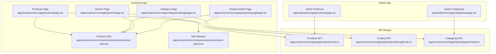
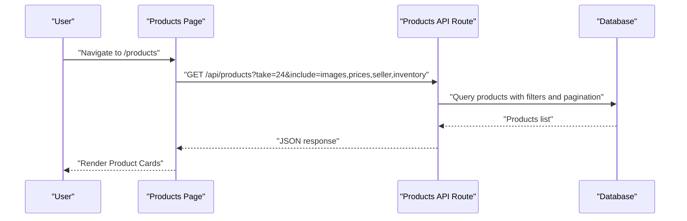
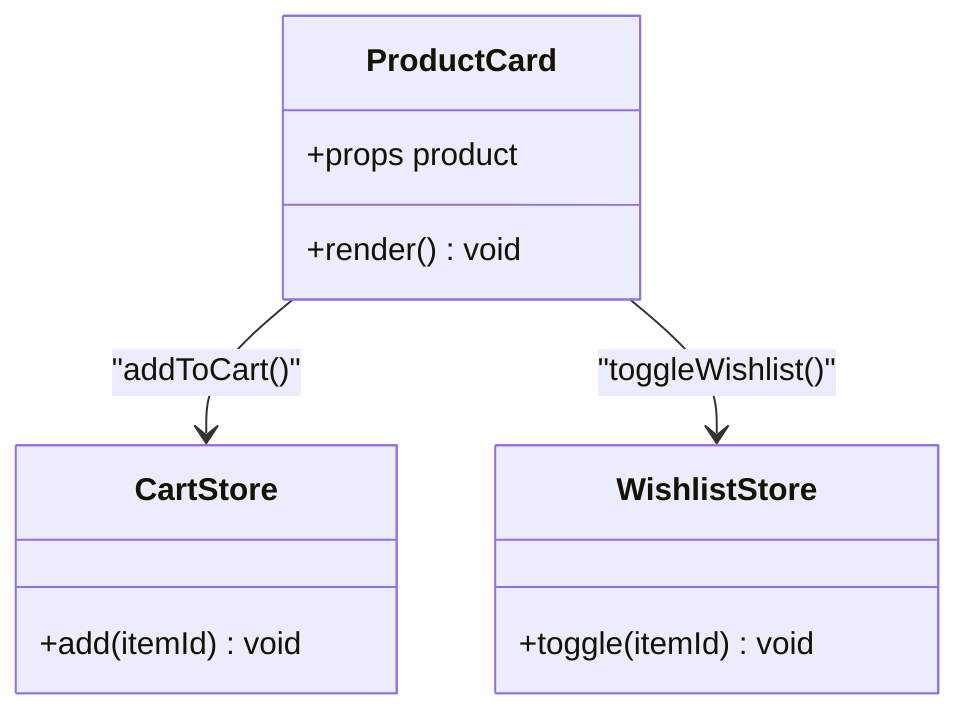
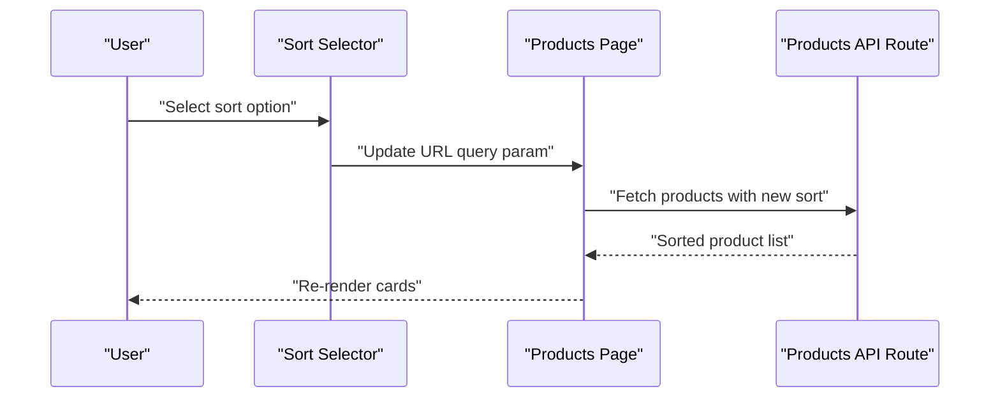
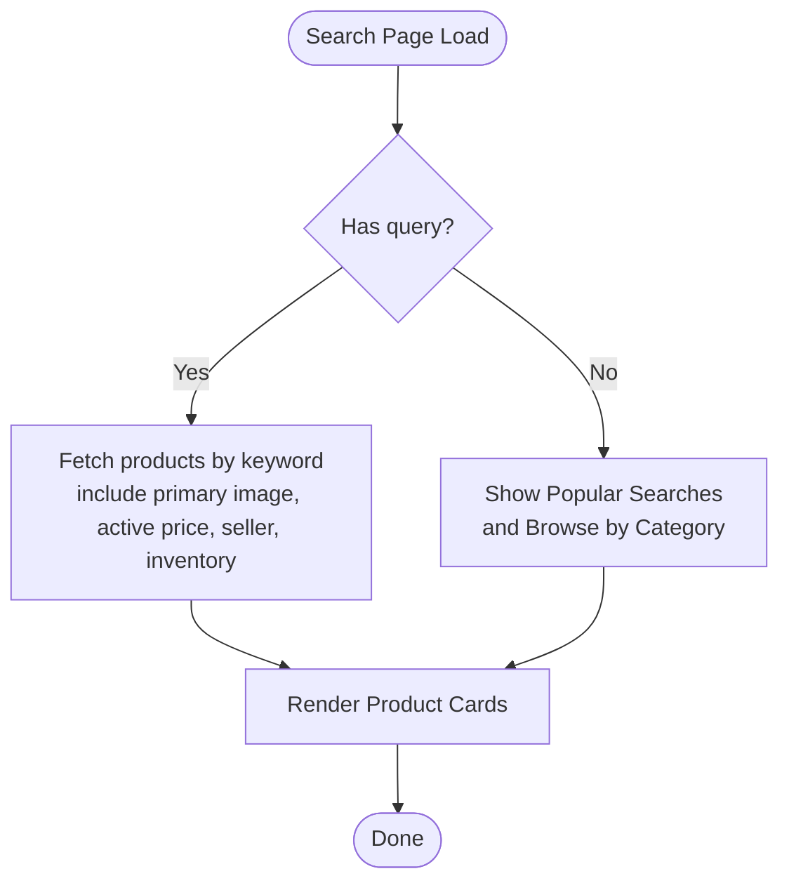
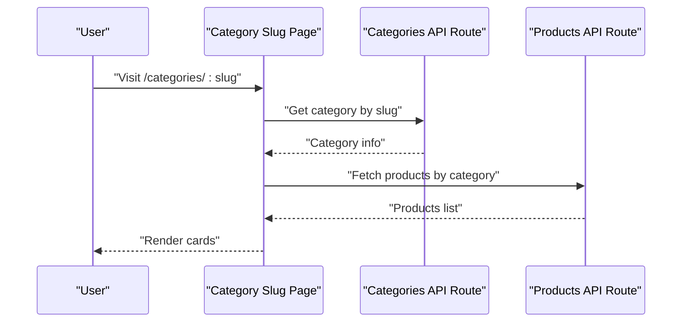
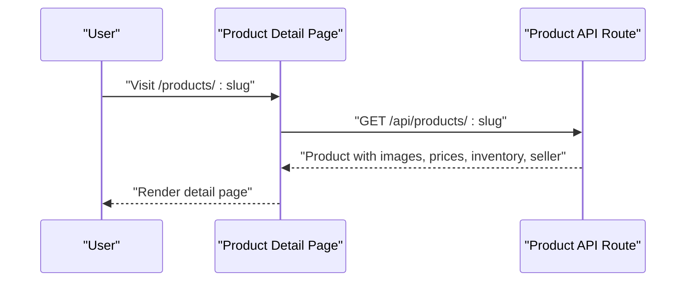
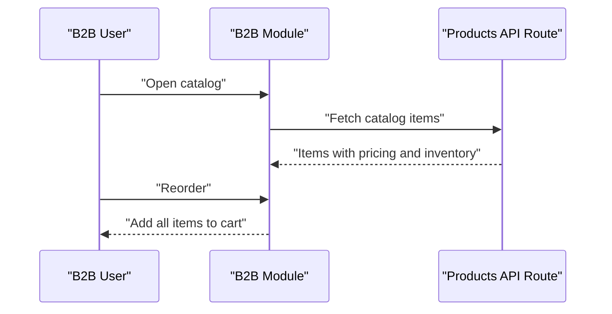
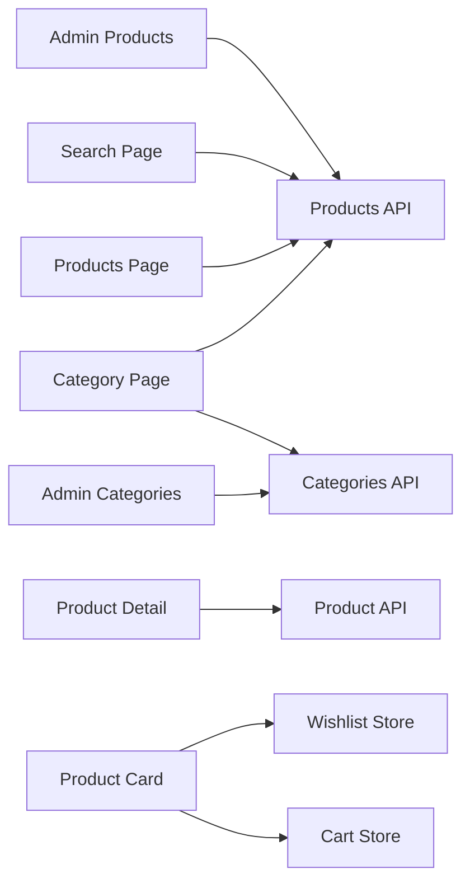

# Product Catalog & Discovery

<cite>
**Referenced Files in This Document**
- [apps/customer/src/app/products/page.tsx](file://apps/customer/src/app/products/page.tsx)
- [apps/customer/src/app/categories/[slug]/page.tsx](file://apps/customer/src/app/categories/[slug]/page.tsx)
- [apps/customer/src/app/search/page.tsx](file://apps/customer/src/app/search/page.tsx)
- [apps/customer/src/app/products/[slug]/page.tsx](file://apps/customer/src/app/products/[slug]/page.tsx)
- [apps/customer/src/components/products/product-card.tsx](file://apps/customer/src/components/products/product-card.tsx)
- [apps/customer/src/components/products/sort-select.tsx](file://apps/customer/src/components/products/sort-select.tsx)
- [apps/customer/src/lib/b2b.ts](file://apps/customer/src/lib/b2b.ts)
- [apps/admin/src/app/categories/page.tsx](file://apps/admin/src/app/categories/page.tsx)
- [apps/admin/src/app/products/page.tsx](file://apps/admin/src/app/products/page.tsx)
- [apps/customer/src/stores/cart.ts](file://apps/customer/src/stores/cart.ts)
- [apps/customer/src/stores/wishlist.ts](file://apps/customer/src/stores/wishlist.ts)
- [apps/customer/src/app/api/products/route.ts](file://apps/customer/src/app/api/products/route.ts)
- [apps/customer/src/app/api/products/[slug]/route.ts](file://apps/customer/src/app/api/products/[slug]/route.ts)
- [apps/customer/src/app/api/categories/route.ts](file://apps/customer/src/app/api/categories/route.ts)
</cite>

## Table of Contents
1. [Introduction](#introduction)
2. [Project Structure](#project-structure)
3. [Core Components](#core-components)
4. [Architecture Overview](#architecture-overview)
5. [Detailed Component Analysis](#detailed-component-analysis)
6. [Dependency Analysis](#dependency-analysis)
7. [Performance Considerations](#performance-considerations)
8. [Troubleshooting Guide](#troubleshooting-guide)
9. [Conclusion](#conclusion)
10. [Appendices](#appendices)

## Introduction
This document describes the Product Catalog and Discovery system for the customer-facing marketplace. It covers browsing interfaces, category-based navigation, filtering and sorting, product detail pages, the product card component architecture, search functionality, category hierarchy management, URL routing patterns, SEO strategies, performance considerations for large catalogs, and examples of customization for display, images, and metadata.

## Project Structure
The customer application exposes routes for browsing products, viewing categories, searching, and accessing product details. Shared UI components include the product card and sort selector. API routes handle product queries and category retrieval. Stores manage cart and wishlist state.

**Diagram sources**
- [apps/customer/src/app/products/page.tsx](file://apps/customer/src/app/products/page.tsx)
- [apps/customer/src/app/categories/[slug]/page.tsx](file://apps/customer/src/app/categories/[slug]/page.tsx)
- [apps/customer/src/app/search/page.tsx](file://apps/customer/src/app/search/page.tsx)
- [apps/customer/src/app/products/[slug]/page.tsx](file://apps/customer/src/app/products/[slug]/page.tsx)
- [apps/customer/src/components/products/product-card.tsx](file://apps/customer/src/components/products/product-card.tsx)
- [apps/customer/src/components/products/sort-select.tsx](file://apps/customer/src/components/products/sort-select.tsx)
- [apps/customer/src/app/api/products/route.ts](file://apps/customer/src/app/api/products/route.ts)
- [apps/customer/src/app/api/products/[slug]/route.ts](file://apps/customer/src/app/api/products/[slug]/route.ts)
- [apps/customer/src/app/api/categories/route.ts](file://apps/customer/src/app/api/categories/route.ts)
- [apps/admin/src/app/categories/page.tsx](file://apps/admin/src/app/categories/page.tsx)
- [apps/admin/src/app/products/page.tsx](file://apps/admin/src/app/products/page.tsx)

**Section sources**
- [apps/customer/src/app/products/page.tsx](file://apps/customer/src/app/products/page.tsx)
- [apps/customer/src/app/categories/[slug]/page.tsx](file://apps/customer/src/app/categories/[slug]/page.tsx)
- [apps/customer/src/app/search/page.tsx](file://apps/customer/src/app/search/page.tsx)
- [apps/customer/src/app/products/[slug]/page.tsx](file://apps/customer/src/app/products/[slug]/page.tsx)
- [apps/customer/src/components/products/product-card.tsx](file://apps/customer/src/components/products/product-card.tsx)
- [apps/customer/src/components/products/sort-select.tsx](file://apps/customer/src/components/products/sort-select.tsx)
- [apps/customer/src/app/api/products/route.ts](file://apps/customer/src/app/api/products/route.ts)
- [apps/customer/src/app/api/products/[slug]/route.ts](file://apps/customer/src/app/api/products/[slug]/route.ts)
- [apps/customer/src/app/api/categories/route.ts](file://apps/customer/src/app/api/categories/route.ts)
- [apps/admin/src/app/categories/page.tsx](file://apps/admin/src/app/categories/page.tsx)
- [apps/admin/src/app/products/page.tsx](file://apps/admin/src/app/products/page.tsx)

## Core Components
- Product Card: Renders product previews with SKU, price, availability, and seller info, and supports adding to cart or wishlist.
- Sort Selector: Provides sorting options for product lists.
- Search Page: Implements keyword search with popular suggestions and category browsing fallback.
- Category Page: Displays products filtered by category slug.
- Product Detail Page: Shows detailed product information via slug-based routing.
- API Routes: Serve product listings, filters, and single-product data.
- Admin Pages: Manage categories and products for catalog organization.

**Section sources**
- [apps/customer/src/components/products/product-card.tsx](file://apps/customer/src/components/products/product-card.tsx)
- [apps/customer/src/components/products/sort-select.tsx](file://apps/customer/src/components/products/sort-select.tsx)
- [apps/customer/src/app/search/page.tsx](file://apps/customer/src/app/search/page.tsx)
- [apps/customer/src/app/categories/[slug]/page.tsx](file://apps/customer/src/app/categories/[slug]/page.tsx)
- [apps/customer/src/app/products/[slug]/page.tsx](file://apps/customer/src/app/products/[slug]/page.tsx)
- [apps/customer/src/app/api/products/route.ts](file://apps/customer/src/app/api/products/route.ts)
- [apps/customer/src/app/api/products/[slug]/route.ts](file://apps/customer/src/app/api/products/[slug]/route.ts)
- [apps/customer/src/app/api/categories/route.ts](file://apps/customer/src/app/api/categories/route.ts)
- [apps/admin/src/app/categories/page.tsx](file://apps/admin/src/app/categories/page.tsx)
- [apps/admin/src/app/products/page.tsx](file://apps/admin/src/app/products/page.tsx)

## Architecture Overview
The system follows a Next.js App Router pattern with server-side rendering and API routes. Product browsing is driven by client pages that fetch data from API routes. The product card is a reusable component shared across pages. Sorting is controlled via URL query parameters. Category navigation uses dynamic slugs. Product details resolve via slug-based routes.

**Diagram sources**
- [apps/customer/src/app/products/page.tsx](file://apps/customer/src/app/products/page.tsx)
- [apps/customer/src/app/api/products/route.ts](file://apps/customer/src/app/api/products/route.ts)

**Section sources**
- [apps/customer/src/app/products/page.tsx](file://apps/customer/src/app/products/page.tsx)
- [apps/customer/src/app/api/products/route.ts](file://apps/customer/src/app/api/products/route.ts)

## Detailed Component Analysis

### Product Card Component
The product card displays essential product attributes and actions. It expects product data with images, prices, inventory, and seller information. Actions include adding to cart and wishlist.

**Diagram sources**
- [apps/customer/src/components/products/product-card.tsx](file://apps/customer/src/components/products/product-card.tsx)
- [apps/customer/src/stores/cart.ts](file://apps/customer/src/stores/cart.ts)
- [apps/customer/src/stores/wishlist.ts](file://apps/customer/src/stores/wishlist.ts)

**Section sources**
- [apps/customer/src/components/products/product-card.tsx](file://apps/customer/src/components/products/product-card.tsx)
- [apps/customer/src/stores/cart.ts](file://apps/customer/src/stores/cart.ts)
- [apps/customer/src/stores/wishlist.ts](file://apps/customer/src/stores/wishlist.ts)

### Sorting Mechanism
Sorting is controlled via URL query parameters. The sort selector updates the query string and triggers re-render of the product list.

**Diagram sources**
- [apps/customer/src/components/products/sort-select.tsx](file://apps/customer/src/components/products/sort-select.tsx)
- [apps/customer/src/app/products/page.tsx](file://apps/customer/src/app/products/page.tsx)
- [apps/customer/src/app/api/products/route.ts](file://apps/customer/src/app/api/products/route.ts)

**Section sources**
- [apps/customer/src/components/products/sort-select.tsx](file://apps/customer/src/components/products/sort-select.tsx)
- [apps/customer/src/app/products/page.tsx](file://apps/customer/src/app/products/page.tsx)
- [apps/customer/src/app/api/products/route.ts](file://apps/customer/src/app/api/products/route.ts)

### Search Functionality
The search page supports keyword search with prioritized results and fallback discovery features. It includes popular searches and category browsing when no query is present.

**Diagram sources**
- [apps/customer/src/app/search/page.tsx](file://apps/customer/src/app/search/page.tsx)
- [apps/customer/src/app/api/products/route.ts](file://apps/customer/src/app/api/products/route.ts)

**Section sources**
- [apps/customer/src/app/search/page.tsx](file://apps/customer/src/app/search/page.tsx)
- [apps/customer/src/app/api/products/route.ts](file://apps/customer/src/app/api/products/route.ts)

### Category-Based Navigation
Category pages filter products by slug and render product cards. The category hierarchy is managed in the admin app.

**Diagram sources**
- [apps/customer/src/app/categories/[slug]/page.tsx](file://apps/customer/src/app/categories/[slug]/page.tsx)
- [apps/customer/src/app/api/categories/route.ts](file://apps/customer/src/app/api/categories/route.ts)
- [apps/customer/src/app/api/products/route.ts](file://apps/customer/src/app/api/products/route.ts)
- [apps/admin/src/app/categories/page.tsx](file://apps/admin/src/app/categories/page.tsx)

**Section sources**
- [apps/customer/src/app/categories/[slug]/page.tsx](file://apps/customer/src/app/categories/[slug]/page.tsx)
- [apps/customer/src/app/api/categories/route.ts](file://apps/customer/src/app/api/categories/route.ts)
- [apps/customer/src/app/api/products/route.ts](file://apps/customer/src/app/api/products/route.ts)
- [apps/admin/src/app/categories/page.tsx](file://apps/admin/src/app/categories/page.tsx)

### Product Detail Pages
Product detail pages use slug-based routing to resolve a specific product and render detailed information.

**Diagram sources**
- [apps/customer/src/app/products/[slug]/page.tsx](file://apps/customer/src/app/products/[slug]/page.tsx)
- [apps/customer/src/app/api/products/[slug]/route.ts](file://apps/customer/src/app/api/products/[slug]/route.ts)

**Section sources**
- [apps/customer/src/app/products/[slug]/page.tsx](file://apps/customer/src/app/products/[slug]/page.tsx)
- [apps/customer/src/app/api/products/[slug]/route.ts](file://apps/customer/src/app/api/products/[slug]/route.ts)

### B2B Integration and Catalog Access
B2B features integrate with catalog data and allow reorder actions from a catalog-linked list.

**Diagram sources**
- [apps/customer/src/lib/b2b.ts](file://apps/customer/src/lib/b2b.ts)
- [apps/customer/src/app/api/products/route.ts](file://apps/customer/src/app/api/products/route.ts)

**Section sources**
- [apps/customer/src/lib/b2b.ts](file://apps/customer/src/lib/b2b.ts)
- [apps/customer/src/app/api/products/route.ts](file://apps/customer/src/app/api/products/route.ts)

## Dependency Analysis
- Pages depend on API routes for data fetching.
- Product Card depends on Cart and Wishlist stores for actions.
- Category pages depend on Categories API and Products API.
- Admin pages manage categories and products used by customer-facing pages.

**Diagram sources**
- [apps/customer/src/app/products/page.tsx](file://apps/customer/src/app/products/page.tsx)
- [apps/customer/src/app/categories/[slug]/page.tsx](file://apps/customer/src/app/categories/[slug]/page.tsx)
- [apps/customer/src/app/search/page.tsx](file://apps/customer/src/app/search/page.tsx)
- [apps/customer/src/app/products/[slug]/page.tsx](file://apps/customer/src/app/products/[slug]/page.tsx)
- [apps/customer/src/components/products/product-card.tsx](file://apps/customer/src/components/products/product-card.tsx)
- [apps/customer/src/stores/cart.ts](file://apps/customer/src/stores/cart.ts)
- [apps/customer/src/stores/wishlist.ts](file://apps/customer/src/stores/wishlist.ts)
- [apps/customer/src/app/api/products/route.ts](file://apps/customer/src/app/api/products/route.ts)
- [apps/customer/src/app/api/products/[slug]/route.ts](file://apps/customer/src/app/api/products/[slug]/route.ts)
- [apps/customer/src/app/api/categories/route.ts](file://apps/customer/src/app/api/categories/route.ts)
- [apps/admin/src/app/categories/page.tsx](file://apps/admin/src/app/categories/page.tsx)
- [apps/admin/src/app/products/page.tsx](file://apps/admin/src/app/products/page.tsx)

**Section sources**
- [apps/customer/src/app/products/page.tsx](file://apps/customer/src/app/products/page.tsx)
- [apps/customer/src/app/categories/[slug]/page.tsx](file://apps/customer/src/app/categories/[slug]/page.tsx)
- [apps/customer/src/app/search/page.tsx](file://apps/customer/src/app/search/page.tsx)
- [apps/customer/src/app/products/[slug]/page.tsx](file://apps/customer/src/app/products/[slug]/page.tsx)
- [apps/customer/src/components/products/product-card.tsx](file://apps/customer/src/components/products/product-card.tsx)
- [apps/customer/src/stores/cart.ts](file://apps/customer/src/stores/cart.ts)
- [apps/customer/src/stores/wishlist.ts](file://apps/customer/src/stores/wishlist.ts)
- [apps/customer/src/app/api/products/route.ts](file://apps/customer/src/app/api/products/route.ts)
- [apps/customer/src/app/api/products/[slug]/route.ts](file://apps/customer/src/app/api/products/[slug]/route.ts)
- [apps/customer/src/app/api/categories/route.ts](file://apps/customer/src/app/api/categories/route.ts)
- [apps/admin/src/app/categories/page.tsx](file://apps/admin/src/app/categories/page.tsx)
- [apps/admin/src/app/products/page.tsx](file://apps/admin/src/app/products/page.tsx)

## Performance Considerations
- Pagination and limits: API routes use take-based pagination to cap payload sizes.
- Selective includes: Queries limit included relations (images, prices, seller, inventory) to reduce data transfer.
- Sorting defaults: Sorting order is optimized for common use-cases; expensive sorts should be avoided without explicit user intent.
- Image handling: Primary image selection reduces payload and ensures consistent thumbnails.
- Client-side caching: Consider implementing client-side caching for repeated queries and category browsing.
- Lazy loading: Product cards can leverage lazy loading for images and offscreen content.
- SSR benefits: Server-side rendering reduces initial load time and improves SEO.

[No sources needed since this section provides general guidance]

## Troubleshooting Guide
- Empty search results: Verify query parameter handling and fallback discovery logic.
- Missing product images: Confirm primary image inclusion and fallback rendering in the product card.
- Incorrect sorting: Ensure URL query parameters are applied consistently across pages and API routes.
- Category not found: Validate slug correctness and category API response shape.
- Detail page errors: Confirm slug uniqueness and API route resolution for product details.

**Section sources**
- [apps/customer/src/app/search/page.tsx](file://apps/customer/src/app/search/page.tsx)
- [apps/customer/src/components/products/product-card.tsx](file://apps/customer/src/components/products/product-card.tsx)
- [apps/customer/src/app/products/page.tsx](file://apps/customer/src/app/products/page.tsx)
- [apps/customer/src/app/api/categories/route.ts](file://apps/customer/src/app/api/categories/route.ts)
- [apps/customer/src/app/api/products/[slug]/route.ts](file://apps/customer/src/app/api/products/[slug]/route.ts)

## Conclusion
The Product Catalog and Discovery system integrates client pages, reusable components, and API routes to deliver a scalable, SEO-friendly shopping experience. With category-based navigation, robust search, and customizable product cards, it supports efficient browsing and conversion. Admin tools maintain the catalog structure, ensuring accurate and organized product presentation.

[No sources needed since this section summarizes without analyzing specific files]

## Appendices

### URL Routing Patterns
- Products listing: GET /products
- Category filtering: GET /categories/:slug
- Product details: GET /products/:slug
- Search: GET /search?q=...
- Sorting: Query parameter controls ordering on product listing APIs

**Section sources**
- [apps/customer/src/app/products/page.tsx](file://apps/customer/src/app/products/page.tsx)
- [apps/customer/src/app/categories/[slug]/page.tsx](file://apps/customer/src/app/categories/[slug]/page.tsx)
- [apps/customer/src/app/products/[slug]/page.tsx](file://apps/customer/src/app/products/[slug]/page.tsx)
- [apps/customer/src/app/search/page.tsx](file://apps/customer/src/app/search/page.tsx)
- [apps/customer/src/app/api/products/route.ts](file://apps/customer/src/app/api/products/route.ts)
- [apps/customer/src/app/api/products/[slug]/route.ts](file://apps/customer/src/app/api/products/[slug]/route.ts)
- [apps/customer/src/app/api/categories/route.ts](file://apps/customer/src/app/api/categories/route.ts)

### SEO Optimization Strategies
- Canonical URLs: Use consistent slugs for products and categories.
- Structured metadata: Populate page titles and descriptions from product and category data.
- Open Graph/Twitter meta: Include product images and canonical links.
- Sitemaps: Generate sitemaps for products and categories.
- Robots.txt: Allow indexing of public product and category pages.

[No sources needed since this section provides general guidance]

### Examples of Customization
- Product display customization: Adjust product card layout, add badges, or modify action buttons.
- Image handling: Prefer primary images, lazy-load thumbnails, and provide fallback placeholders.
- Metadata management: Derive page titles and descriptions from product and category fields.

[No sources needed since this section provides general guidance]